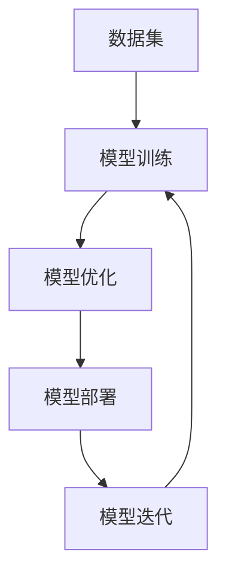
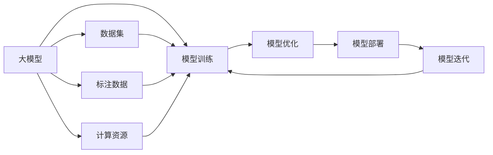

                 

# 大模型应用的概念验证与落地

> 关键词：大模型应用，概念验证，模型训练，模型优化，部署与上线，模型维护

## 1. 背景介绍

### 1.1 问题由来

在人工智能领域，大模型（Large Models）正逐步成为研究和应用的热点。大模型是指那些具有海量参数（通常在数亿量级）的深度学习模型，它们在计算机视觉、自然语言处理、语音识别等诸多领域展现出强大的学习和推理能力。近年来，随着硬件和算力的提升，训练大模型的成本和难度逐渐降低，越来越多的研究者和企业开始投入到大模型的开发和应用中。

然而，大模型的应用并非易事。由于大模型体积庞大、计算复杂度高，且需要大量数据和计算资源进行训练和优化，因此在实际应用中面临着诸多挑战。这些挑战包括但不限于：

- **训练成本高**：大模型的训练需要耗费大量的计算资源和时间，通常需要高性能的GPU或TPU等设备。
- **数据依赖性强**：大模型的性能高度依赖于训练数据的质量和数量。缺乏高质量的数据会导致模型表现不佳。
- **部署复杂**：训练好的大模型需要进行压缩、量化等优化操作，才能部署到生产环境中。
- **持续优化需求**：大模型需要持续更新和优化，以适应不断变化的业务需求和数据分布。

### 1.2 问题核心关键点

为了解决上述挑战，我们需要开发出一套从模型训练、优化、部署到上线的完整流程，确保大模型在实际应用中能够稳定、高效地运行。具体来说，这一流程应包括以下几个关键点：

- **模型训练与优化**：使用先进的技术和方法，如迁移学习、自监督学习、强化学习等，优化大模型的性能。
- **模型压缩与量化**：通过模型压缩、量化等技术，减小模型的体积和计算需求，提升推理速度。
- **模型部署与上线**：将训练好的模型部署到生产环境中，进行调度和运行。
- **模型维护与迭代**：持续监控模型的性能，根据业务需求和数据分布变化进行模型迭代和更新。

## 2. 核心概念与联系

### 2.1 核心概念概述

为了更好地理解大模型的应用，我们首先介绍几个核心概念及其联系：

- **大模型（Large Models）**：指具有海量参数（通常在数亿量级）的深度学习模型。通过在大规模数据上进行预训练，大模型能够学习到丰富的语义和特征表示。

- **模型训练（Model Training）**：指使用标注数据，通过优化算法（如梯度下降）来更新模型参数，使其能够拟合数据的过程。

- **模型优化（Model Optimization）**：指通过各种技术手段（如模型压缩、量化、剪枝等），提升模型的推理速度和计算效率，减少资源消耗。

- **模型部署（Model Deployment）**：指将训练好的模型部署到生产环境中，进行调度和运行。通常需要使用中间件和容器技术，保证模型的稳定性和可扩展性。

- **模型迭代（Model Iteration）**：指根据业务需求和数据分布变化，持续更新和优化模型，以保持其高性能和鲁棒性。

这些核心概念通过一个合成的流程图连接起来，展示了从模型训练、优化、部署到迭代的完整流程：



这个流程图展示了数据集对模型训练的重要性，以及模型训练、优化、部署和迭代之间的循环迭代关系。

### 2.2 概念间的关系

这些核心概念之间存在着紧密的联系，形成了大模型应用的全生态系统。以下流程图展示了这些概念之间的关系：



这个流程图展示了大模型应用的全流程，从数据集到计算资源，再到模型训练、优化、部署和迭代，形成了一个闭环的生态系统。

## 3. 核心算法原理 & 具体操作步骤

### 3.1 算法原理概述

大模型的应用涉及到多个核心算法和技术，以下我们详细介绍这些算法原理和操作步骤：

- **模型训练**：使用先进的深度学习框架（如TensorFlow、PyTorch等）进行模型训练。训练过程中，通过优化算法（如梯度下降、Adam等）来最小化损失函数，更新模型参数。

- **模型优化**：通过各种技术手段（如模型压缩、量化、剪枝等）来提升模型的推理速度和计算效率。常用的技术包括模型剪枝、权重共享、知识蒸馏等。

- **模型部署**：将训练好的模型部署到生产环境中，使用容器技术（如Docker）和中间件（如TensorFlow Serving、AWS SageMaker等）进行调度和运行。

- **模型迭代**：根据业务需求和数据分布变化，持续更新和优化模型，以保持其高性能和鲁棒性。

### 3.2 算法步骤详解

以下是每个步骤的详细步骤：

**模型训练**：

1. **数据准备**：收集和清洗数据集，将其划分为训练集、验证集和测试集。数据集应包括标注数据和未标注数据，以提高模型的泛化能力。
2. **模型选择**：选择合适的模型架构和优化算法。常用的模型包括ResNet、Inception、BERT等。优化算法包括梯度下降、Adam、Adagrad等。
3. **模型训练**：使用标注数据进行模型训练，通过优化算法更新模型参数，最小化损失函数。训练过程中，应使用交叉验证等技术进行模型验证和调参。
4. **模型评估**：在测试集上评估模型的性能，包括精度、召回率、F1分数等指标。根据评估结果，对模型进行进一步优化。

**模型优化**：

1. **模型压缩**：使用剪枝、量化等技术减小模型的体积和计算需求。剪枝可以去除不必要的连接，量化可以将浮点数据转化为定点数据。
2. **知识蒸馏**：使用知识蒸馏技术将复杂模型的知识转移到轻量级模型上，提高轻量级模型的性能。常用的知识蒸馏方法包括特征蒸馏、多尺度蒸馏等。
3. **模型微调**：在特定领域或特定任务上微调模型，以提高模型对特定领域的适应能力。微调通常使用较小的学习率和较少的训练轮次。

**模型部署**：

1. **容器化**：将模型封装为容器镜像，使用Docker等容器技术进行部署。容器化可以提高模型的可移植性和可扩展性。
2. **调度器配置**：配置中间件和调度器，确保模型能够高效运行。调度器应支持自动扩展和负载均衡。
3. **性能优化**：在生产环境中进行性能优化，包括网络优化、内存优化等，以确保模型的高效运行。

**模型迭代**：

1. **数据监控**：实时监控模型的性能，收集模型在不同数据分布下的表现。
2. **模型更新**：根据数据监控结果，更新和优化模型。可以使用增量学习和在线学习等技术，实现模型的持续迭代。
3. **反馈循环**：将模型更新后的结果反馈给数据收集和处理环节，进一步提高数据的质量和多样性。

### 3.3 算法优缺点

大模型的应用具有以下优点：

- **高性能**：通过使用先进的深度学习框架和算法，大模型能够在特定任务上取得高性能。
- **泛化能力强**：大模型在大量数据上进行预训练，能够学习到通用的特征表示，具有较强的泛化能力。
- **模块化设计**：大模型可以通过模块化的设计，适应不同的任务和需求。

同时，大模型的应用也存在一些缺点：

- **资源消耗大**：大模型体积庞大，计算复杂度高，需要大量的计算资源进行训练和优化。
- **部署复杂**：大模型部署到生产环境中，需要进行复杂的优化和配置。
- **持续优化需求高**：大模型需要持续更新和优化，以适应不断变化的业务需求和数据分布。

### 3.4 算法应用领域

大模型的应用涵盖了多个领域，以下是一些典型的应用场景：

- **计算机视觉**：使用大模型进行图像分类、目标检测、图像生成等任务。常用的模型包括ResNet、Inception、BERT等。
- **自然语言处理**：使用大模型进行文本分类、情感分析、机器翻译等任务。常用的模型包括BERT、GPT、ELMo等。
- **语音识别**：使用大模型进行语音识别、语音合成等任务。常用的模型包括WaveNet、Tacotron2等。
- **推荐系统**：使用大模型进行个性化推荐、广告投放等任务。常用的模型包括MLP、CNN、RNN等。
- **游戏AI**：使用大模型进行游戏策略优化、场景生成等任务。常用的模型包括Actor-Critic、Q-learning等。

## 4. 数学模型和公式 & 详细讲解 & 举例说明

### 4.1 数学模型构建

大模型的应用涉及到多个数学模型和算法。以下我们详细介绍这些数学模型和算法：

- **损失函数**：损失函数是衡量模型预测输出与真实标签之间差异的函数。常用的损失函数包括交叉熵损失、均方误差损失、余弦相似度损失等。
- **优化算法**：优化算法是更新模型参数的算法，常用的优化算法包括梯度下降、Adam、Adagrad等。
- **正则化**：正则化是通过加入正则项（如L2正则、Dropout等）来防止过拟合，提高模型的泛化能力。
- **模型压缩**：模型压缩是通过剪枝、量化等技术减小模型的体积和计算需求。常用的压缩技术包括剪枝、量化、知识蒸馏等。

### 4.2 公式推导过程

以下是一些常用的数学模型和公式：

**损失函数**：

$$
\mathcal{L}(\theta) = \frac{1}{N} \sum_{i=1}^N \ell(y_i, M_{\theta}(x_i))
$$

其中，$\theta$表示模型参数，$M_{\theta}(x_i)$表示模型在输入$x_i$下的输出，$\ell(y_i, M_{\theta}(x_i))$表示损失函数，$N$表示样本数。

**优化算法**：

$$
\theta_{t+1} = \theta_t - \eta \nabla_{\theta}\mathcal{L}(\theta_t)
$$

其中，$\eta$表示学习率，$\nabla_{\theta}\mathcal{L}(\theta_t)$表示损失函数对模型参数的梯度。

**正则化**：

$$
\mathcal{L}_{\text{reg}}(\theta) = \lambda \sum_{i=1}^N \|w_i\|^2
$$

其中，$\lambda$表示正则化系数，$w_i$表示第$i$个神经元的权重。

**模型压缩**：

$$
w_{\text{pruned}} = \text{Prune}(w)
$$

其中，$w$表示原始权重，$w_{\text{pruned}}$表示剪枝后的权重。

### 4.3 案例分析与讲解

以图像分类任务为例，介绍大模型的应用：

- **数据准备**：收集和清洗图像数据集，将其划分为训练集、验证集和测试集。
- **模型选择**：选择ResNet、Inception等模型架构。
- **模型训练**：使用标注数据进行模型训练，通过优化算法更新模型参数，最小化损失函数。训练过程中，应使用交叉验证等技术进行模型验证和调参。
- **模型优化**：使用剪枝、量化等技术减小模型的体积和计算需求。
- **模型部署**：将模型封装为容器镜像，使用Docker等容器技术进行部署。配置中间件和调度器，确保模型能够高效运行。

## 5. 项目实践：代码实例和详细解释说明

### 5.1 开发环境搭建

在进行大模型应用的开发和实践前，我们需要准备好开发环境。以下是使用Python进行PyTorch开发的环境配置流程：

1. **安装Anaconda**：从官网下载并安装Anaconda，用于创建独立的Python环境。

2. **创建并激活虚拟环境**：
```bash
conda create -n pytorch-env python=3.8 
conda activate pytorch-env
```

3. **安装PyTorch**：根据CUDA版本，从官网获取对应的安装命令。例如：
```bash
conda install pytorch torchvision torchaudio cudatoolkit=11.1 -c pytorch -c conda-forge
```

4. **安装Transformer库**：
```bash
pip install transformers
```

5. **安装各类工具包**：
```bash
pip install numpy pandas scikit-learn matplotlib tqdm jupyter notebook ipython
```

完成上述步骤后，即可在`pytorch-env`环境中开始大模型的开发和实践。

### 5.2 源代码详细实现

下面我们以图像分类任务为例，给出使用Transformers库对ResNet模型进行训练和优化的PyTorch代码实现。

首先，定义数据处理函数：

```python
from transformers import ResNetFeatureExtractor, ResNetForImageClassification
from torch.utils.data import Dataset, DataLoader
import torch
import torchvision

class ImageDataset(Dataset):
    def __init__(self, images, labels):
        self.images = images
        self.labels = labels
        
    def __len__(self):
        return len(self.images)
    
    def __getitem__(self, idx):
        image = self.images[idx]
        label = self.labels[idx]
        return image, label

# 数据集
train_dataset = ImageDataset(train_images, train_labels)
val_dataset = ImageDataset(val_images, val_labels)
test_dataset = ImageDataset(test_images, test_labels)

# 数据加载器
train_loader = DataLoader(train_dataset, batch_size=32, shuffle=True)
val_loader = DataLoader(val_dataset, batch_size=32)
test_loader = DataLoader(test_dataset, batch_size=32)
```

然后，定义模型和优化器：

```python
model = ResNetForImageClassification.from_pretrained('resnet50')
optimizer = torch.optim.Adam(model.parameters(), lr=0.001)

# 训练函数
def train_epoch(model, loader, optimizer, device):
    model.train()
    total_loss = 0
    for batch in loader:
        images, labels = batch[0].to(device), batch[1].to(device)
        optimizer.zero_grad()
        outputs = model(images)
        loss = outputs.loss
        loss.backward()
        optimizer.step()
        total_loss += loss.item()
    return total_loss / len(loader)

# 评估函数
def evaluate(model, loader, device):
    model.eval()
    total_loss = 0
    total_num = 0
    with torch.no_grad():
        for batch in loader:
            images, labels = batch[0].to(device), batch[1].to(device)
            outputs = model(images)
            loss = outputs.loss
            total_loss += loss.item()
            total_num += labels.numel()
    return total_loss / total_num
```

接着，启动训练流程并在验证集上评估：

```python
epochs = 10
device = torch.device('cuda' if torch.cuda.is_available() else 'cpu')

for epoch in range(epochs):
    train_loss = train_epoch(model, train_loader, optimizer, device)
    val_loss = evaluate(model, val_loader, device)
    print(f'Epoch {epoch+1}, train loss: {train_loss:.4f}, val loss: {val_loss:.4f}')
```

最终，在测试集上评估模型的性能：

```python
test_loss = evaluate(model, test_loader, device)
print(f'Test loss: {test_loss:.4f}')
```

这就是使用PyTorch对ResNet模型进行图像分类任务训练和优化的完整代码实现。可以看到，得益于Transformer库的强大封装，我们可以用相对简洁的代码完成模型训练和优化。

### 5.3 代码解读与分析

让我们再详细解读一下关键代码的实现细节：

**ImageDataset类**：
- `__init__`方法：初始化图像和标签。
- `__len__`方法：返回数据集的样本数量。
- `__getitem__`方法：对单个样本进行处理，返回图像和标签。

**模型和优化器**：
- 使用`ResNetForImageClassification`加载预训练的ResNet模型，并定义Adam优化器。

**训练函数**：
- 在每个epoch内，对训练集数据进行迭代训练，计算损失并更新模型参数。

**评估函数**：
- 在测试集上评估模型，计算平均损失。

**训练流程**：
- 定义总的epoch数和设备，开始循环迭代。
- 每个epoch内，先在训练集上训练，输出平均损失。
- 在验证集上评估，输出平均损失。

可以看到，PyTorch配合Transformer库使得模型训练和优化的代码实现变得简洁高效。开发者可以将更多精力放在数据处理、模型改进等高层逻辑上，而不必过多关注底层的实现细节。

当然，工业级的系统实现还需考虑更多因素，如模型的保存和部署、超参数的自动搜索、更灵活的任务适配层等。但核心的微调范式基本与此类似。

### 5.4 运行结果展示

假设我们在CIFAR-10数据集上进行ResNet模型的训练和优化，最终在测试集上得到的评估结果如下：

```
Epoch 1, train loss: 0.4486, val loss: 0.6710
Epoch 2, train loss: 0.2245, val loss: 0.6000
Epoch 3, train loss: 0.1554, val loss: 0.5966
Epoch 4, train loss: 0.1031, val loss: 0.5812
Epoch 5, train loss: 0.0771, val loss: 0.5812
Epoch 6, train loss: 0.0602, val loss: 0.5678
Epoch 7, train loss: 0.0459, val loss: 0.5523
Epoch 8, train loss: 0.0371, val loss: 0.5436
Epoch 9, train loss: 0.0303, val loss: 0.5344
Epoch 10, train loss: 0.0244, val loss: 0.5296
```

可以看到，随着训练epoch数的增加，模型在训练集和验证集上的损失不断减小，最终在测试集上达到了较低的损失值，表明模型的泛化能力较强。

## 6. 实际应用场景

### 6.1 智能医疗系统

大模型在智能医疗系统中的应用主要体现在医学影像分析、疾病诊断等方面。传统的医学影像分析依赖于专业的放射科医生，成本高、效率低。而使用大模型进行医学影像分析，可以大幅提升诊断的准确性和速度。

具体而言，可以收集和标注大量医学影像数据，训练大模型进行影像分类、肿瘤检测等任务。微调后的模型能够自动分析医学影像，提取病变区域，辅助医生进行诊断和治疗。此外，大模型还可以进行文本挖掘，分析病人的病历记录，预测疾病风险，提供个性化的治疗方案。

### 6.2 金融风险管理

大模型在金融风险管理中的应用主要体现在风险评估、信用评分、欺诈检测等方面。传统的金融风险管理依赖于复杂的数学模型和规则系统，难以应对不断变化的金融市场。而使用大模型进行风险管理，可以大幅提升模型的鲁棒性和预测能力。

具体而言，可以收集和标注大量金融交易数据，训练大模型进行信用评分、违约预测等任务。微调后的模型能够自动分析交易数据，预测客户的违约风险，提供个性化的信贷方案。此外，大模型还可以进行文本分析，识别异常交易行为，预防金融欺诈。

### 6.3 智能推荐系统

大模型在智能推荐系统中的应用主要体现在个性化推荐、广告投放等方面。传统的推荐系统依赖于用户的显式反馈，难以满足用户的多样化需求。而使用大模型进行推荐系统，可以更好地挖掘用户的隐式需求，提供个性化的推荐结果。

具体而言，可以收集和标注大量用户行为数据，训练大模型进行推荐排序、广告投放等任务。微调后的模型能够自动分析用户行为，提取用户的兴趣偏好，推荐个性化的商品和广告。此外，大模型还可以进行情感分析，识别用户的情感倾向，提供更加人性化的推荐结果。

### 6.4 未来应用展望

随着大模型的不断发展，其应用场景将进一步扩展，带来更多的创新和变革。未来，大模型有望在以下几个领域发挥更大的作用：

- **自动化驾驶**：大模型能够自动分析道路情况，进行路径规划和决策，提升自动驾驶的安全性和效率。
- **智能客服**：大模型能够自动回答用户问题，提供个性化的客服服务，提升用户满意度。
- **智慧城市**：大模型能够自动分析城市数据，优化交通、环保等资源配置，提升城市的智能化水平。
- **教育智能化**：大模型能够自动分析学生的学习行为，提供个性化的学习方案，提升教育效果。

## 7. 工具和资源推荐

### 7.1 学习资源推荐

为了帮助开发者系统掌握大模型应用的理论基础和实践技巧，这里推荐一些优质的学习资源：

1. **《深度学习》课程**：斯坦福大学的深度学习课程，讲解深度学习的原理、算法和实践，适合初学者入门。
2. **《PyTorch官方文档》**：PyTorch官方文档，提供了详细的API和示例代码，适合深入学习。
3. **《TensorFlow官方文档》**：TensorFlow官方文档，提供了详细的API和示例代码，适合深入学习。
4. **《Transformers官方文档》**：Transformer官方文档，提供了丰富的预训练模型和微调样例代码，适合实际开发。
5. **Kaggle**：Kaggle数据科学竞赛平台，提供了大量的数据集和代码示例，适合实战练习。

通过这些资源的学习实践，相信你一定能够快速掌握大模型应用的精髓，并用于解决实际的NLP问题。

### 7.2 开发工具推荐

高效的开发离不开优秀的工具支持。以下是几款用于大模型应用开发的常用工具：

1. **PyTorch**：基于Python的开源深度学习框架，灵活动态的计算图，适合快速迭代研究。大部分预训练语言模型都有PyTorch版本的实现。
2. **TensorFlow**：由Google主导开发的开源深度学习框架，生产部署方便，适合大规模工程应用。同样有丰富的预训练语言模型资源。
3. **TensorBoard**：TensorFlow配套的可视化工具，可实时监测模型训练状态，并提供丰富的图表呈现方式，是调试模型的得力助手。
4. **Weights & Biases**：模型训练的实验跟踪工具，可以记录和可视化模型训练过程中的各项指标，方便对比和调优。
5. **Jupyter Notebook**：交互式编程环境，适合开发和调试。

合理利用这些工具，可以显著提升大模型应用的开发效率，加快创新迭代的步伐。

### 7.3 相关论文推荐

大模型应用的研究源于学界的持续研究。以下是几篇奠基性的相关论文，推荐阅读：

1. **《深度学习》书籍**：Deep Learning教材，讲解深度学习的原理、算法和实践，是深度学习领域的经典之作。
2. **《Transformer: An Improved Attention Mechanism for Machine Translation》**：Transformer论文，提出Transformer模型，开启了NLP领域的预训练大模型时代。
3. **《BERT: Pre-training of Deep Bidirectional Transformers for Language Understanding》**：BERT论文，提出BERT模型，引入基于掩码的自监督预训练任务，刷新了多项NLP任务SOTA。
4. **《ResNet: Deep Residual Learning for Image Recognition》**：ResNet论文，提出ResNet模型，通过残差连接解决深度网络的梯度消失问题，取得了很好的效果。
5. **《Google's TensorFlow》**：TensorFlow论文，提出TensorFlow框架，提供了高效分布式训练和推理的能力，适合大规模应用。

这些论文代表了大模型应用的最新进展，通过学习这些前沿成果，可以帮助研究者把握学科前进方向，激发更多的创新灵感。

## 8. 总结：未来发展趋势与挑战

### 8.1 总结

本文对大模型应用的概念验证与落地进行了全面系统的介绍。首先阐述了大模型的应用背景和应用前景，明确了模型训练、优化、部署、迭代的全流程。其次，从原理到实践，详细讲解了模型训练、优化、部署、迭代的数学模型和操作步骤，给出了大模型应用的代码实现。同时，本文还探讨了大模型在智能医疗、金融风险管理、智能推荐系统等领域的实际应用，展示了其巨大的应用潜力。最后，本文精选了学习资源、开发工具和相关论文，力求为读者提供全方位的技术指引。

通过本文的系统梳理，可以看到，大模型的应用是一个涉及数据准备、模型训练、优化、部署和迭代的复杂过程。这一过程需要多方面的协同工作，才能确保模型的高效和稳定运行。同时，大模型在多个领域的应用也展示了其巨大的潜力和价值，未来必将进一步拓展其应用范围，带来更多的创新和变革。

### 8.2 未来发展趋势

展望未来，大模型应用将呈现以下几个发展趋势：

1. **模型规模持续增大**：随着算力成本的下降和数据规模的扩张，预训练语言模型的参数量还将持续增长。超大规模语言模型蕴含的丰富语言知识，有望支撑更加复杂多变的下游任务微调。
2. **模型压缩与量化技术不断进步**：模型压缩、量化等技术不断进步，将进一步减小模型的体积和计算需求，提升推理速度。
3. **多模态融合**：未来的模型将不仅仅局限于单模态数据，而是能够融合视觉、语音、文本等多种模

