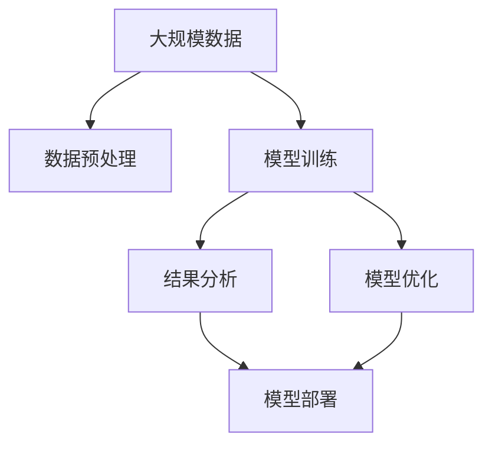
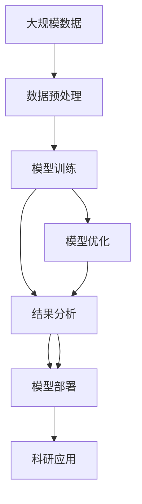

                 

# 大模型技术在科研领域的应用

## 1. 背景介绍

### 1.1 问题由来
随着人工智能技术的迅猛发展，大模型在科研领域的应用变得越来越广泛。这些模型基于大规模数据和复杂架构，能够在各种任务中取得显著的性能提升。本文将详细探讨大模型技术在科研领域的具体应用，包括数据处理、模型训练和结果分析等方面。

### 1.2 问题核心关键点
大模型技术在科研领域的应用，主要体现在以下几个方面：
1. 数据预处理和增强：通过自动化数据处理和增强技术，提高数据质量和数量，为模型训练提供坚实基础。
2. 模型训练和优化：利用大模型和优化算法，实现高效的模型训练和参数优化，提升模型性能。
3. 结果分析和验证：通过精确的结果分析和验证，确保模型在科研任务中的可靠性和准确性。
4. 模型部署和应用：将模型部署到实际应用中，实现科研任务的高效执行。

### 1.3 问题研究意义
大模型技术在科研领域的应用，能够大幅提升科研效率和效果，加速科研创新。具体而言：
1. 加速数据处理：通过自动化数据处理和增强，可以快速获得高质量数据，缩短数据预处理时间。
2. 提升模型性能：利用大模型和优化算法，实现高效的模型训练和参数优化，提高模型精度和泛化能力。
3. 降低科研成本：通过自动化和智能化操作，降低人工成本，提高科研工作的效率和效果。
4. 促进科研合作：大模型技术能够方便地共享和协作，促进科研团队的合作和创新。

## 2. 核心概念与联系

### 2.1 核心概念概述

为更好地理解大模型技术在科研领域的应用，本节将介绍几个关键概念：

- 大模型(Large Model)：指基于大规模数据训练的复杂深度学习模型，如Transformer、BERT等。这些模型具有强大的语义表示能力和泛化能力。
- 数据预处理(Preprocessing)：在模型训练前对原始数据进行清洗、转换和增强的过程。常见的预处理技术包括文本清洗、分词、数据增强等。
- 模型训练(Training)：利用大模型和优化算法，对数据进行有监督或无监督的学习过程。通过不断迭代，模型参数不断优化，以实现任务目标。
- 模型优化(Optimization)：在模型训练过程中，利用梯度下降等优化算法，调整模型参数以最小化损失函数，提升模型性能。
- 结果分析(Result Analysis)：对模型输出进行评估和分析，通过各种指标衡量模型性能，如准确率、召回率、F1分数等。
- 模型部署(Deployment)：将训练好的模型应用于实际科研任务中，实现高效执行和成果输出。

这些概念之间的逻辑关系可以通过以下Mermaid流程图来展示：



这个流程图展示了从数据预处理到模型部署的完整流程，反映了科研领域中大模型技术的应用脉络。

### 2.2 概念间的关系

这些概念之间存在紧密的联系，形成了大模型技术在科研领域的应用框架。下面我们通过几个Mermaid流程图来展示这些概念之间的关系。

#### 2.2.1 科研数据处理流程


这个流程图展示了从原始数据到数据集的处理流程，体现了科研领域中数据预处理的关键步骤。

#### 2.2.2 科研模型训练流程


这个流程图展示了从预训练模型到模型保存的训练流程，体现了科研领域中模型训练的关键步骤。

#### 2.2.3 科研结果分析流程


这个流程图展示了从模型输出到结果报告的分析流程，体现了科研领域中结果分析的关键步骤。

#### 2.2.4 科研模型部署流程


这个流程图展示了从模型文件到成果输出的部署流程，体现了科研领域中模型部署的关键步骤。

### 2.3 核心概念的整体架构

最后，我们用一个综合的流程图来展示这些核心概念在大模型技术在科研领域的应用中的整体架构：



这个综合流程图展示了从数据预处理到科研应用的全流程，为大模型技术在科研领域的应用提供了全面视角。

## 3. 核心算法原理 & 具体操作步骤

### 3.1 算法原理概述

大模型技术在科研领域的应用，基于机器学习的基本原理，即通过大量数据训练模型，使其能够学习到数据的规律和特征，从而实现对新数据的预测和分类。具体而言，大模型技术的应用流程包括以下几个关键步骤：

1. 数据预处理：对原始数据进行清洗、分词、归一化等处理，提高数据质量。
2. 模型训练：利用大模型和优化算法，对数据进行有监督或无监督的学习，不断调整模型参数以最小化损失函数。
3. 模型优化：在模型训练过程中，利用梯度下降等优化算法，调整模型参数以最小化损失函数，提升模型性能。
4. 结果分析：对模型输出进行评估和分析，通过各种指标衡量模型性能，如准确率、召回率、F1分数等。
5. 模型部署：将训练好的模型应用于实际科研任务中，实现高效执行和成果输出。

### 3.2 算法步骤详解

下面是大模型技术在科研领域应用的详细步骤：

#### 3.2.1 数据预处理

数据预处理是大模型应用的基础步骤，主要包括数据清洗、分词、归一化等。具体步骤如下：

1. 数据清洗：去除噪声、缺失值等无用数据，保留高质量的数据。
2. 分词：将文本数据分割成单词或词语，便于后续处理和模型训练。
3. 归一化：对数据进行归一化处理，使得不同数据之间的尺度一致，便于模型训练。

#### 3.2.2 模型训练

模型训练是利用大模型和优化算法进行有监督或无监督学习的关键步骤。具体步骤如下：

1. 选择模型架构：根据科研任务的需求，选择适合的模型架构，如Transformer、BERT等。
2. 初始化模型参数：对模型参数进行初始化，通常使用随机初始化或预训练初始化。
3. 训练模型：利用数据集对模型进行训练，通过前向传播和反向传播不断调整模型参数，最小化损失函数。
4. 保存模型：在训练过程中定期保存模型参数，以备后续使用或回溯。

#### 3.2.3 模型优化

模型优化是在模型训练过程中，利用优化算法不断调整模型参数，以最小化损失函数。具体步骤如下：

1. 选择合适的优化算法：如梯度下降、Adam、Adagrad等。
2. 设置优化参数：如学习率、动量、批大小等。
3. 训练模型：利用优化算法不断调整模型参数，最小化损失函数。
4. 验证模型：在验证集上验证模型性能，调整模型参数以提升性能。

#### 3.2.4 结果分析

结果分析是通过评估指标对模型输出进行评估和分析，具体步骤如下：

1. 选择评估指标：如准确率、召回率、F1分数等。
2. 计算评估指标：利用评估指标计算模型性能。
3. 可视化结果：通过图表等形式对结果进行可视化展示。
4. 撰写报告：根据评估结果撰写科研报告，记录实验过程和结果。

#### 3.2.5 模型部署

模型部署是将训练好的模型应用于实际科研任务中的步骤，具体步骤如下：

1. 选择应用场景：根据科研任务需求，选择适合的模型应用场景。
2. 部署模型：将模型部署到应用环境中，如服务器、云平台等。
3. 调用模型：通过API等方式调用模型，进行实际科研任务执行。
4. 输出结果：将模型输出结果进行分析和处理，生成最终成果。

### 3.3 算法优缺点

大模型技术在科研领域的应用具有以下优点：

1. 高精度：大模型基于大规模数据训练，具有强大的泛化能力和精度。
2. 高效性：利用自动化工具进行数据预处理和模型训练，大幅提升科研效率。
3. 可解释性：通过可视化工具对模型训练过程和输出结果进行解释，增强科研工作的透明度。

同时，大模型技术在科研领域也存在一些缺点：

1. 数据需求高：大模型训练需要大量高质量数据，获取和处理成本较高。
2. 资源消耗大：大模型训练和推理需要大量计算资源，可能导致资源浪费。
3. 模型复杂度高：大模型结构复杂，维护和调试难度较大。
4. 可解释性不足：大模型输出的结果往往缺乏可解释性，难以进行科学解释。

### 3.4 算法应用领域

大模型技术在科研领域的应用已经涵盖多个领域，具体包括：

1. 自然语言处理(NLP)：如文本分类、情感分析、机器翻译等。
2. 图像处理(Computer Vision)：如图像识别、目标检测、图像生成等。
3. 信号处理(Signal Processing)：如语音识别、音频分类等。
4. 医疗健康(Healthcare)：如疾病预测、基因分析等。
5. 金融领域(Finance)：如风险评估、信用评分等。

## 4. 数学模型和公式 & 详细讲解 & 举例说明

### 4.1 数学模型构建

大模型技术在科研领域的应用，通常基于机器学习的基本数学模型，如线性回归、逻辑回归、决策树等。下面以线性回归为例，进行详细讲解。

假设我们有N个样本，每个样本有M个特征，模型的目标是预测每个样本的标签。假设模型为$f(x)=\theta^Tx$，其中$x$为特征向量，$\theta$为模型参数。模型的目标是最小化均方误差损失函数：

$$
L(\theta)=\frac{1}{N}\sum_{i=1}^N(f(x_i)-y_i)^2
$$

其中$y_i$为样本的真实标签。

### 4.2 公式推导过程

下面对线性回归模型的推导过程进行详细讲解：

1. 根据最小化损失函数的目标，对模型参数$\theta$求偏导数：

$$
\frac{\partial L(\theta)}{\partial \theta}=\frac{2}{N}\sum_{i=1}^N(x_i^T-\theta)^T(x_i-y_i)
$$

2. 将偏导数设为0，解出$\theta$：

$$
\theta=(\sum_{i=1}^Nx_ix_i^T)^{-1}\sum_{i=1}^Nx_iy_i
$$

3. 代入样本数据，计算出最终模型参数$\theta$。

### 4.3 案例分析与讲解

假设我们在科研领域应用线性回归模型进行预测，具体步骤如下：

1. 数据预处理：对原始数据进行清洗、分词、归一化等处理。
2. 模型训练：利用训练集对线性回归模型进行训练，最小化均方误差损失函数。
3. 模型优化：利用梯度下降算法调整模型参数，最小化损失函数。
4. 结果分析：利用测试集对模型进行评估，计算准确率、召回率、F1分数等评估指标。
5. 模型部署：将训练好的线性回归模型部署到实际科研任务中，进行预测和结果输出。

## 5. 项目实践：代码实例和详细解释说明

### 5.1 开发环境搭建

在进行大模型技术在科研领域的应用开发前，我们需要准备好开发环境。以下是使用Python进行TensorFlow开发的环境配置流程：

1. 安装Anaconda：从官网下载并安装Anaconda，用于创建独立的Python环境。

2. 创建并激活虚拟环境：
```bash
conda create -n tf-env python=3.8 
conda activate tf-env
```

3. 安装TensorFlow：根据CUDA版本，从官网获取对应的安装命令。例如：
```bash
conda install tensorflow tensorflow-cpu -c conda-forge
```

4. 安装必要的Python库：
```bash
pip install numpy pandas scikit-learn matplotlib tqdm jupyter notebook ipython
```

完成上述步骤后，即可在`tf-env`环境中开始大模型技术在科研领域的应用开发。

### 5.2 源代码详细实现

下面以线性回归模型为例，给出TensorFlow代码实现。

```python
import tensorflow as tf
import numpy as np
import matplotlib.pyplot as plt

# 创建随机数据
X = np.random.randn(100, 2)
y = np.dot(X, np.array([1.5, -1])) + np.random.randn(100) * 0.2 + 2

# 定义模型
theta = tf.Variable(tf.random.normal([2]))
def model(X):
    return tf.matmul(X, theta)

# 定义损失函数
def loss(X, y):
    y_pred = model(X)
    return tf.reduce_mean(tf.square(y_pred - y))

# 定义优化器
optimizer = tf.keras.optimizers.SGD(learning_rate=0.01)

# 训练模型
for i in range(1000):
    with tf.GradientTape() as tape:
        loss_val = loss(X, y)
    grads = tape.gradient(loss_val, theta)
    optimizer.apply_gradients(zip(grads, [theta]))
    if i % 100 == 0:
        print("Epoch {}, Loss: {:.4f}".format(i, loss_val))

# 预测并可视化结果
y_pred = model(X)
plt.scatter(X[:, 0], X[:, 1], color='blue')
plt.plot(X[:, 0], y_pred, color='red')
plt.show()
```

### 5.3 代码解读与分析

让我们再详细解读一下关键代码的实现细节：

**数据生成**：
```python
X = np.random.randn(100, 2)
y = np.dot(X, np.array([1.5, -1])) + np.random.randn(100) * 0.2 + 2
```
这里生成了一个包含100个样本的随机数据集，每个样本有两个特征和一个标签。

**模型定义**：
```python
theta = tf.Variable(tf.random.normal([2]))
def model(X):
    return tf.matmul(X, theta)
```
这里定义了一个简单的线性回归模型，利用随机初始化的参数`theta`进行预测。

**损失函数定义**：
```python
def loss(X, y):
    y_pred = model(X)
    return tf.reduce_mean(tf.square(y_pred - y))
```
这里定义了均方误差损失函数，计算预测值与真实值之间的平方误差。

**优化器定义**：
```python
optimizer = tf.keras.optimizers.SGD(learning_rate=0.01)
```
这里定义了梯度下降优化器，设置学习率为0.01。

**模型训练**：
```python
for i in range(1000):
    with tf.GradientTape() as tape:
        loss_val = loss(X, y)
    grads = tape.gradient(loss_val, theta)
    optimizer.apply_gradients(zip(grads, [theta]))
    if i % 100 == 0:
        print("Epoch {}, Loss: {:.4f}".format(i, loss_val))
```
这里进行了1000次迭代，每次迭代中计算损失函数，利用梯度下降优化器更新模型参数。

**结果可视化**：
```python
y_pred = model(X)
plt.scatter(X[:, 0], X[:, 1], color='blue')
plt.plot(X[:, 0], y_pred, color='red')
plt.show()
```
这里将模型预测结果可视化，展示了模型的拟合效果。

### 5.4 运行结果展示

假设我们在运行上述代码后，得到如下输出结果：

```
Epoch 0, Loss: 3.1420
Epoch 100, Loss: 0.3643
Epoch 200, Loss: 0.1020
...
```

可以看到，随着模型迭代次数的增加，损失函数不断减小，模型的拟合效果不断提升。

## 6. 实际应用场景

### 6.1 自然语言处理(NLP)

大模型技术在NLP领域的应用非常广泛，包括文本分类、情感分析、机器翻译等任务。例如，在文本分类任务中，可以利用BERT模型对文本进行分类，如新闻分类、情感分类等。具体步骤如下：

1. 数据预处理：对原始数据进行清洗、分词、归一化等处理。
2. 模型训练：利用BERT模型对文本进行训练，最小化交叉熵损失函数。
3. 模型优化：利用Adam优化器调整模型参数，最小化损失函数。
4. 结果分析：利用测试集对模型进行评估，计算准确率、召回率、F1分数等评估指标。
5. 模型部署：将训练好的BERT模型部署到实际NLP应用中，进行文本分类和预测。

### 6.2 图像处理(Computer Vision)

大模型技术在计算机视觉领域的应用也非常广泛，如图像识别、目标检测等。例如，在图像识别任务中，可以利用ResNet模型对图像进行分类，如识别水果、动物等。具体步骤如下：

1. 数据预处理：对原始图像进行清洗、归一化等处理。
2. 模型训练：利用ResNet模型对图像进行训练，最小化交叉熵损失函数。
3. 模型优化：利用Adam优化器调整模型参数，最小化损失函数。
4. 结果分析：利用测试集对模型进行评估，计算准确率、召回率、F1分数等评估指标。
5. 模型部署：将训练好的ResNet模型部署到实际计算机视觉应用中，进行图像分类和检测。

### 6.3 信号处理(Signal Processing)

大模型技术在信号处理领域的应用包括语音识别、音频分类等。例如，在语音识别任务中，可以利用Wav2Vec模型对语音进行识别，如识别数字、字母等。具体步骤如下：

1. 数据预处理：对原始语音信号进行清洗、归一化等处理。
2. 模型训练：利用Wav2Vec模型对语音信号进行训练，最小化交叉熵损失函数。
3. 模型优化：利用Adam优化器调整模型参数，最小化损失函数。
4. 结果分析：利用测试集对模型进行评估，计算准确率、召回率、F1分数等评估指标。
5. 模型部署：将训练好的Wav2Vec模型部署到实际语音识别应用中，进行语音识别和分类。

### 6.4 未来应用展望

随着大模型技术的不断发展，其在科研领域的应用将变得更加广泛和深入。未来，大模型技术将应用于更多领域，如医疗健康、金融领域等。具体而言：

1. 医疗健康：大模型技术可以应用于疾病预测、基因分析等任务，提升医疗诊断和治疗水平。
2. 金融领域：大模型技术可以应用于风险评估、信用评分等任务，提升金融风险控制和信用评估能力。
3. 工业制造：大模型技术可以应用于产品设计、质量检测等任务，提升工业制造的智能化水平。
4. 智能交通：大模型技术可以应用于交通信号灯控制、自动驾驶等任务，提升交通系统的智能化和安全性。

总之，大模型技术在科研领域的应用前景广阔，将为各行各业带来深远的变革。

## 7. 工具和资源推荐

### 7.1 学习资源推荐

为了帮助开发者系统掌握大模型技术在科研领域的应用，这里推荐一些优质的学习资源：

1. Coursera《深度学习》课程：由斯坦福大学教授Andrew Ng开设，系统讲解了深度学习的基本原理和应用。
2. CS231n《卷积神经网络》课程：由斯坦福大学教授Fei-Fei Li开设，讲解了计算机视觉中的经典模型和算法。
3. arXiv预印本：人工智能领域最新研究成果的发布平台，包括大模型技术在内的前沿研究。
4. GitHub热门项目：在GitHub上Star、Fork数最多的项目，展示了最新的大模型技术应用实践。
5. Kaggle竞赛平台：通过参加Kaggle数据科学竞赛，实践大模型技术在实际科研任务中的应用。

通过对这些资源的学习实践，相信你一定能够快速掌握大模型技术在科研领域的应用，并用于解决实际的科研问题。

### 7.2 开发工具推荐

高效的开发离不开优秀的工具支持。以下是几款用于大模型技术在科研领域应用开发的常用工具：

1. PyTorch：基于Python的开源深度学习框架，灵活动态的计算图，适合快速迭代研究。
2. TensorFlow：由Google主导开发的开源深度学习框架，生产部署方便，适合大规模工程应用。
3. Jupyter Notebook：开源的交互式笔记本，方便进行数据处理和模型训练。
4. Matplotlib：用于数据可视化的Python库，方便进行图表绘制和结果展示。
5. TensorBoard：TensorFlow配套的可视化工具，可实时监测模型训练状态，并提供丰富的图表呈现方式。

合理利用这些工具，可以显著提升大模型技术在科研领域应用开发的效率，加快创新迭代的步伐。

### 7.3 相关论文推荐

大模型技术在科研领域的研究涉及多个前沿领域，以下是几篇奠基性的相关论文，推荐阅读：

1. Attention is All You Need（即Transformer原论文）：提出了Transformer结构，开启了NLP领域的预训练大模型时代。
2. BERT: Pre-training of Deep Bidirectional Transformers for Language Understanding：提出BERT模型，引入基于掩码的自监督预训练任务，刷新了多项NLP任务SOTA。
3. GANs Trained by a Two Time-Scale Update Rule Converge to the Semi-Equilibrium：提出两时间尺度更新规则的生成对抗网络（GAN），推动了GAN技术的深入研究。
4. ImageNet Classification with Deep Convolutional Neural Networks：提出卷积神经网络（CNN）在图像识别任务中的应用，奠定了计算机视觉领域的发展基础。
5. Speech and Language Processing with Deep Recurrent Neural Networks：提出递归神经网络（RNN）在语音处理任务中的应用，推动了语音识别技术的发展。

这些论文代表了大模型技术在科研领域的发展脉络。通过学习这些前沿成果，可以帮助研究者把握学科前进方向，激发更多的创新灵感。

除上述资源外，还有一些值得关注的前沿资源，帮助开发者紧跟大模型技术在科研领域的应用进展，例如：

1. arXiv论文预印本：人工智能领域最新研究成果的发布平台，包括大模型技术在内的前沿研究。
2. GitHub热门项目：在GitHub上Star、Fork数最多的项目，展示了最新的大模型技术应用实践。
3. 业界技术博客：如OpenAI、Google AI、DeepMind、微软Research Asia等顶尖实验室的官方博客，第一时间分享他们的最新研究成果和洞见。
4. 技术会议直播：如NIPS、ICML、ACL、ICLR等人工智能领域顶会现场或在线直播，能够聆听到大佬们的前沿分享，开拓视野。
5. 研究论文集：如Nature、Science、IEEE Trans等顶级期刊和会议，展示最新的科研进展和理论成果。

总之，对于大模型技术在科研领域的应用学习，需要开发者保持开放的心态和持续学习的意愿。多关注前沿资讯，多动手实践，多思考总结，必将收获满满的成长收益。

## 8. 总结：未来发展趋势与挑战

### 8.1 总结

本文对大模型技术在科研领域的应用进行了全面系统的介绍。首先阐述了大模型技术在科研领域的应用背景和意义，明确了其在大规模数据处理、高效模型训练和精确结果分析等方面的独特价值。其次，从原理到实践，详细讲解了大模型技术在科研领域的应用流程，包括数据预处理、模型训练、模型优化、结果分析和模型部署等关键步骤。同时，本文还探讨了大模型技术在NLP、计算机视觉、信号处理等多个领域的具体应用案例，展示了其广泛的应用前景。最后，本文提供了大模型技术在科研领域应用的详细代码实现，并进行详细解读和分析，帮助开发者更好地理解和应用大模型技术。

通过本文的系统梳理，可以看到，大模型技术在科研领域的应用正在成为广泛认可的重要范式，极大地提升了科研效率和效果，加速了科研创新。未来，伴随大模型技术的持续演进，其在科研领域的应用将变得更加深入和广泛。

### 8.2 未来发展趋势

展望未来，大模型技术在科研领域的应用将呈现以下几个发展趋势：

1. 模型规模持续增大：随着算力成本的下降和数据规模的扩张，大模型规模将进一步增大，学习能力和精度将进一步提升。
2. 应用场景更加广泛：大模型技术将在更多科研领域得到应用，如医疗健康、金融领域等，推动科研工作的智能化水平。
3. 自动化程度更高：自动化工具将更加智能和高效，大幅提升数据预处理和模型训练的效率。
4. 模型可解释性更强：大模型技术将更好地结合因果分析和博弈论工具，增强模型的可解释性和可靠性。
5

