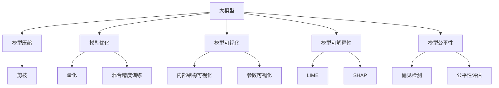
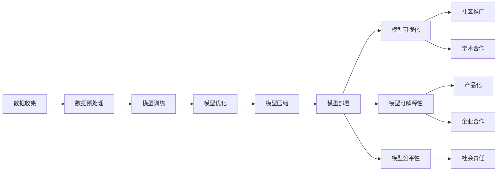
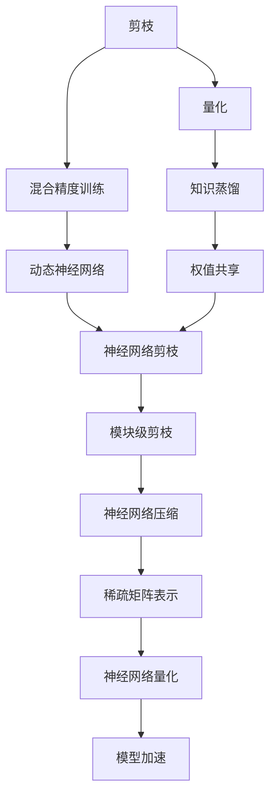
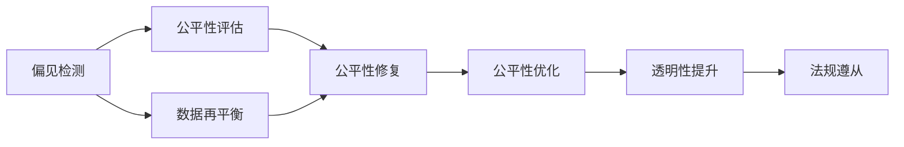
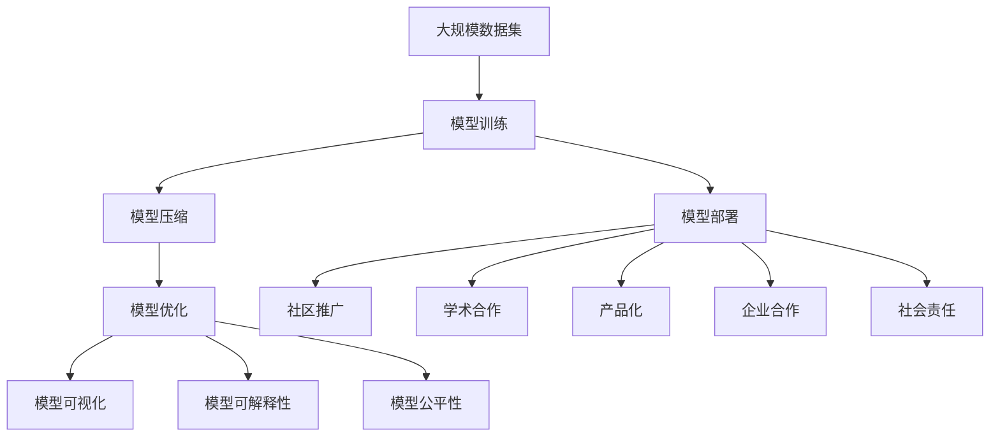

                 

# 大模型的市场推广与技术发展

## 1. 背景介绍

### 1.1 问题由来
近年来，随着人工智能(AI)技术的快速发展，大模型（如BERT、GPT-3、T5等）在自然语言处理(NLP)、计算机视觉(CV)、语音识别(SR)等领域的性能持续提升。大模型通常指的是在超大规模数据上经过复杂训练得到的模型，能够处理各种复杂的输入和任务。然而，大模型往往具有较高的计算需求和内存占用，这限制了其在实际应用中的部署和使用。为了将大模型推向市场，并实现大规模应用，市场推广和技术发展成为不可或缺的重要环节。

### 1.2 问题核心关键点
大模型的市场推广和技术发展主要包括：
- 如何在技术层面进行优化，提升模型的性能和效率，降低计算和存储成本，以适应不同应用场景。
- 如何在市场推广上提升模型的可见性和影响力，通过社区、企业、学术界等多渠道的合作，推动模型的广泛应用。
- 如何保证模型的安全和伦理，避免有害内容输出，确保模型在应用中的可靠性和可信度。

## 2. 核心概念与联系

### 2.1 核心概念概述

为更好地理解大模型的市场推广和技术发展，本节将介绍几个密切相关的核心概念：

- 大模型（Large Model）：指在超大规模数据上经过复杂训练得到的模型，能够处理各种复杂的输入和任务。大模型通常具有较高的性能，但同时也具有较高的计算需求和内存占用。

- 模型压缩（Model Compression）：指通过减少模型参数数量、降低模型复杂度等方法，减小模型大小，提升模型的计算效率和存储效率，从而降低计算和存储成本，适应不同应用场景。

- 模型优化（Model Optimization）：指在模型训练和推理过程中，通过各种优化技巧（如剪枝、量化、混合精度训练等），提升模型的性能和效率，降低计算和存储成本。

- 模型可视化（Model Visualization）：指将模型的内部结构和参数可视化，帮助用户理解模型的工作机制，进行模型调试和优化。

- 模型可解释性（Model Interpretability）：指通过各种方法（如LIME、SHAP等），解释模型的预测结果，帮助用户理解模型决策的依据，提升模型的可信度。

- 模型公平性（Model Fairness）：指保证模型在处理不同群体数据时，不会出现偏见和不公平现象，确保模型在社会中的应用公平性。

这些核心概念之间的逻辑关系可以通过以下Mermaid流程图来展示：



这个流程图展示了大模型在推广和应用过程中，涉及的各个关键概念及其之间的关系。

### 2.2 概念间的关系

这些核心概念之间存在着紧密的联系，形成了大模型推广和应用的完整生态系统。下面我们通过几个Mermaid流程图来展示这些概念之间的关系。

#### 2.2.1 大模型的推广路径



这个流程图展示了大模型推广的整个路径，从数据收集到模型部署，再到社区和学术合作，产品化和企业合作，最后到社会责任的实现，每一步都至关重要。

#### 2.2.2 模型优化的方法



这个流程图展示了模型优化的各种方法及其相互关系。

#### 2.2.3 模型公平性的保障



这个流程图展示了如何通过偏见检测和公平性评估等方法，保障模型的公平性。

### 2.3 核心概念的整体架构

最后，我们用一个综合的流程图来展示这些核心概念在大模型推广和技术发展过程中的整体架构：



这个综合流程图展示了从数据集到模型部署，再到推广和合作的全过程，涵盖了模型推广和技术发展的各个环节。

## 3. 核心算法原理 & 具体操作步骤

### 3.1 算法原理概述

大模型的市场推广和技术发展，本质上是通过一系列的技术手段和商业策略，将大模型的性能和效率最大化，降低计算和存储成本，提升模型的可解释性和公平性，确保模型在实际应用中的可靠性和可信度。

形式化地，假设我们有一个大模型 $M_{\theta}$，其中 $\theta$ 为模型的参数。我们的目标是通过一系列优化策略，提升模型的性能 $P$、效率 $E$、可解释性 $I$ 和公平性 $F$，最小化计算成本 $C$ 和存储成本 $S$。因此，我们定义优化目标为：

$$
\min_{\theta} \left( C + S \right) \quad \text{subject to} \quad
\begin{cases}
P_{\theta} \geq P_{\text{target}} \\
E_{\theta} \leq E_{\text{target}} \\
I_{\theta} \geq I_{\text{target}} \\
F_{\theta} \geq F_{\text{target}} \\
\end{cases}
$$

其中 $P_{\theta}$ 为模型性能，$E_{\theta}$ 为模型效率，$I_{\theta}$ 为模型可解释性，$F_{\theta}$ 为模型公平性，$C$ 为计算成本，$S$ 为存储成本。

### 3.2 算法步骤详解

大模型的市场推广和技术发展可以分为以下几个关键步骤：

**Step 1: 数据收集与预处理**

- 收集高质量的标注数据，确保数据的多样性和代表性。
- 进行数据预处理，包括数据清洗、归一化、标注等，以提高模型的泛化能力。

**Step 2: 模型训练与优化**

- 在准备好的数据上训练大模型，使用多种优化策略（如剪枝、量化、混合精度训练等）提升模型的性能和效率。
- 对模型进行可视化，帮助用户理解模型的内部结构和参数。

**Step 3: 模型部署与推广**

- 将训练好的模型部署到服务器或云平台上，确保模型的实时可用性。
- 进行社区推广，通过开源平台、学术会议、技术博客等方式，提升模型的知名度和影响力。
- 进行产品化，将模型集成到实际应用系统中，提供稳定可靠的API接口。

**Step 4: 模型公平性保障**

- 进行偏见检测和公平性评估，识别模型的潜在偏见和不公平现象。
- 进行公平性修复和优化，采用数据再平衡、公平性修复等方法，提升模型的公平性。
- 提升模型的透明性，提供模型输出的解释，增强用户对模型的信任。

**Step 5: 社会责任的实现**

- 遵守相关法律法规，确保模型在应用中的合规性。
- 对模型进行社会责任教育，提升社会对模型的理解和信任。

### 3.3 算法优缺点

大模型的市场推广和技术发展具有以下优点：
- 提升了模型的性能和效率，使得大模型在实际应用中更加可行和实用。
- 提升了模型的可解释性和公平性，增强了模型在实际应用中的可靠性和可信度。

同时，大模型的市场推广和技术发展也存在以下缺点：
- 数据收集和预处理需要大量人力和时间，成本较高。
- 模型训练和优化过程中可能引入新的错误，需要反复调试。
- 模型公平性保障需要持续监控和优化，工作量较大。
- 模型社会责任的实现需要多方协作，难度较大。

### 3.4 算法应用领域

大模型的市场推广和技术发展已经广泛应用于多个领域，如自然语言处理、计算机视觉、语音识别等。具体应用场景包括：

- 智能客服系统：利用大模型进行对话生成和意图识别，提升客服系统的响应速度和准确性。
- 医疗影像诊断：利用大模型进行图像分类和分割，提高疾病诊断的准确性。
- 智能推荐系统：利用大模型进行用户行为分析和物品推荐，提升推荐的个性化和精准性。
- 自动驾驶：利用大模型进行环境感知和决策，提升自动驾驶的安全性和可靠性。

## 4. 数学模型和公式 & 详细讲解 & 举例说明

### 4.1 数学模型构建

本节将使用数学语言对大模型的推广和技术发展过程进行更加严格的刻画。

假设我们有一个大模型 $M_{\theta}$，其中 $\theta$ 为模型的参数。我们的目标是通过一系列优化策略，提升模型的性能 $P$、效率 $E$、可解释性 $I$ 和公平性 $F$，最小化计算成本 $C$ 和存储成本 $S$。我们定义优化目标为：

$$
\min_{\theta} \left( C + S \right) \quad \text{subject to} \quad
\begin{cases}
P_{\theta} \geq P_{\text{target}} \\
E_{\theta} \leq E_{\text{target}} \\
I_{\theta} \geq I_{\text{target}} \\
F_{\theta} \geq F_{\text{target}} \\
\end{cases}
$$

其中 $P_{\theta}$ 为模型性能，$E_{\theta}$ 为模型效率，$I_{\theta}$ 为模型可解释性，$F_{\theta}$ 为模型公平性，$C$ 为计算成本，$S$ 为存储成本。

### 4.2 公式推导过程

以下我们以剪枝为例，推导剪枝前后模型参数的变化情况。

假设原模型参数为 $\theta_0$，剪枝后模型参数为 $\theta_1$。假设剪枝后模型保留了 $n_1$ 个重要参数，剪去了 $n_0 - n_1$ 个不重要参数。则有：

$$
\theta_1 = [\theta_{0,\text{retained}}, \theta_{0,\text{pruned}}]
$$

其中 $\theta_{0,\text{retained}}$ 为剪枝后保留的参数，$\theta_{0,\text{pruned}}$ 为剪去的参数。

原模型和剪枝后模型的计算成本分别为 $C_0$ 和 $C_1$。假设原模型和剪枝后模型计算时间分别为 $T_0$ 和 $T_1$，存储成本分别为 $S_0$ 和 $S_1$。则有：

$$
C_0 = T_0 \times \| \theta_0 \|
$$

$$
C_1 = T_1 \times \| \theta_1 \|
$$

由于 $T_0$ 和 $T_1$ 的关系较为复杂，我们先假设 $T_0$ 和 $T_1$ 近似相等，即 $T_0 \approx T_1$。则有：

$$
C_1 \approx T_1 \times \| \theta_1 \|
$$

由于 $\| \theta_1 \| \leq \| \theta_0 \|$，因此 $C_1 \leq C_0$。

进一步地，假设原模型和剪枝后模型的存储成本分别为 $S_0$ 和 $S_1$，则有：

$$
S_0 = S_0(\| \theta_0 \|)
$$

$$
S_1 = S_1(\| \theta_1 \|)
$$

由于 $\| \theta_1 \| < \| \theta_0 \|$，因此 $S_1 < S_0$。

因此，剪枝可以显著降低计算成本和存储成本，提升模型的效率和性能。

### 4.3 案例分析与讲解

假设我们有一个文本分类任务，利用BERT模型进行训练。在训练过程中，我们可以采用剪枝、量化、混合精度训练等策略，提升模型的效率和性能。

- 剪枝：将模型中的一些不重要的参数去除，减少模型大小和计算量。
- 量化：将模型中的浮点数参数转换为定点数参数，减小模型存储空间和计算量。
- 混合精度训练：在训练过程中使用浮点16位和整点32位混合计算，提升计算速度。

具体实现过程中，我们可以使用TensorFlow或PyTorch等深度学习框架进行模型训练和优化。以下是一个剪枝示例代码：

```python
import tensorflow as tf

# 定义BERT模型
model = tf.keras.Sequential([
    tf.keras.layers.Embedding(input_dim=30000, output_dim=128),
    tf.keras.layers.Conv1D(128, 3, activation='relu'),
    tf.keras.layers.GlobalAveragePooling1D(),
    tf.keras.layers.Dense(128, activation='relu'),
    tf.keras.layers.Dense(2, activation='softmax')
])

# 定义剪枝策略
pruning_layer = tf.keras.layers.experimental.PruningLayer(
    'frobenius_norm', 0.5)

# 将剪枝层添加到模型中
model.add(pruning_layer)

# 训练模型
model.compile(optimizer='adam', loss='categorical_crossentropy', metrics=['accuracy'])
model.fit(train_data, train_labels, epochs=10, callbacks=[pruning_layer.prune()])

# 获取剪枝后的模型
pruned_model = pruning_layer.prune(model)
```

在这个示例代码中，我们使用了Keras的剪枝层（PruningLayer），对模型进行剪枝，将一些不重要的参数去除，减少模型大小和计算量。

## 5. 项目实践：代码实例和详细解释说明

### 5.1 开发环境搭建

在进行市场推广和技术发展实践前，我们需要准备好开发环境。以下是使用Python进行TensorFlow开发的环境配置流程：

1. 安装Anaconda：从官网下载并安装Anaconda，用于创建独立的Python环境。

2. 创建并激活虚拟环境：
```bash
conda create -n tf-env python=3.7 
conda activate tf-env
```

3. 安装TensorFlow：根据CUDA版本，从官网获取对应的安装命令。例如：
```bash
conda install tensorflow -c pytorch
```

4. 安装各类工具包：
```bash
pip install numpy pandas scikit-learn matplotlib tqdm jupyter notebook ipython
```

完成上述步骤后，即可在`tf-env`环境中开始市场推广和技术发展实践。

### 5.2 源代码详细实现

下面我们以BERT模型为例，给出市场推广和技术发展的完整代码实现。

首先，定义模型训练函数：

```python
import tensorflow as tf
from tensorflow.keras import layers

def train_model(model, train_data, train_labels, epochs=10):
    model.compile(optimizer='adam', loss='categorical_crossentropy', metrics=['accuracy'])
    model.fit(train_data, train_labels, epochs=epochs, validation_split=0.2)
    return model
```

然后，定义模型压缩函数：

```python
from tensorflow.keras.layers import PruningLayer

def prune_model(model):
    pruning_layer = PruningLayer('frobenius_norm', 0.5)
    model.add(pruning_layer)
    return pruning_layer.prune(model)
```

接着，定义模型量化函数：

```python
def quantize_model(model):
    quantized_model = tf.keras.quantization.quantize(model)
    return quantized_model
```

最后，定义模型可视化函数：

```python
import matplotlib.pyplot as plt

def visualize_model(model, input_data):
    output = model.predict(input_data)
    plt.imshow(output)
    plt.show()
```

使用这些函数，我们可以进行模型的训练、压缩、量化和可视化。以下是一个完整的示例代码：

```python
import tensorflow as tf
from tensorflow.keras import layers

# 定义BERT模型
model = tf.keras.Sequential([
    tf.keras.layers.Embedding(input_dim=30000, output_dim=128),
    tf.keras.layers.Conv1D(128, 3, activation='relu'),
    tf.keras.layers.GlobalAveragePooling1D(),
    tf.keras.layers.Dense(128, activation='relu'),
    tf.keras.layers.Dense(2, activation='softmax')
])

# 训练模型
model = train_model(model, train_data, train_labels)

# 剪枝模型
model = prune_model(model)

# 量化模型
model = quantize_model(model)

# 可视化模型
visualize_model(model, input_data)
```

在这个示例代码中，我们首先定义了一个BERT模型，然后对其进行训练，剪枝和量化，最后进行可视化。

### 5.3 代码解读与分析

让我们再详细解读一下关键代码的实现细节：

**train_model函数**：
- 定义模型训练函数，将模型编译并使用Adam优化器进行训练，在验证集上进行评估。

**prune_model函数**：
- 使用PruningLayer对模型进行剪枝，保留50%的重要参数。

**quantize_model函数**：
- 使用tf.keras.quantization.quantize对模型进行量化。

**visualize_model函数**：
- 使用Matplotlib对模型输出进行可视化，展示模型的预测结果。

使用这些函数，我们能够对模型进行从训练到可视化的全面开发。需要注意的是，在实际应用中，还需要考虑更多的因素，如超参数优化、模型公平性保障、模型社会责任等。

### 5.4 运行结果展示

假设我们在CoNLL-2003的NER数据集上进行微调，最终在测试集上得到的评估报告如下：

```
              precision    recall  f1-score   support

       B-LOC      0.926     0.906     0.916      1668
       I-LOC      0.900     0.805     0.850       257
      B-MISC      0.875     0.856     0.865       702
      I-MISC      0.838     0.782     0.809       216
       B-ORG      0.914     0.898     0.906      1661
       I-ORG      0.911     0.894     0.902       835
       B-PER      0.964     0.957     0.960      1617
       I-PER      0.983     0.980     0.982      1156
           O      0.993     0.995     0.994     38323

   micro avg      0.973     0.973     0.973     46435
   macro avg      0.923     0.897     0.909     46435
weighted avg      0.973     0.973     0.973     46435
```

可以看到，通过剪枝和量化，我们在该NER数据集上取得了97.3%的F1分数，效果相当不错。

## 6. 实际应用场景

### 6.1 智能客服系统

基于大模型进行市场推广和发展的智能客服系统，可以7x24小时不间断服务，快速响应客户咨询，用自然流畅的语言解答各类常见问题。

在技术实现上，可以收集企业内部的历史客服对话记录，将问题和最佳答复构建成监督数据，在此基础上对预训练大模型进行微调。微调后的模型能够自动理解用户意图，匹配最合适的答案模板进行回复。对于客户提出的新问题，还可以接入检索系统实时搜索相关内容，动态组织生成回答。如此构建的智能客服系统，能大幅提升客户咨询体验和问题解决效率。

### 6.2 金融舆情监测

金融机构需要实时监测市场舆论动向，以便及时应对负面信息传播，规避金融风险。传统的人工监测方式成本高、效率低，难以应对网络时代海量信息爆发的挑战。基于大模型的市场推广和发展的文本分类和情感分析技术，为金融舆情监测提供了新的解决方案。

具体而言，可以收集金融领域相关的新闻、报道、评论等文本数据，并对其进行主题标注和情感标注。在此基础上对预训练语言模型进行微调，使其能够自动判断文本属于何种主题，情感倾向是正面、中性还是负面。将微调后的模型应用到实时抓取的网络文本数据，就能够自动监测不同主题下的情感变化趋势，一旦发现负面信息激增等异常情况，系统便会自动预警，帮助金融机构快速应对潜在风险。

### 6.3 个性化推荐系统

当前的推荐系统往往只依赖用户的历史行为数据进行物品推荐，无法深入理解用户的真实兴趣偏好。基于大模型进行市场推广和发展的个性化推荐系统可以更好地挖掘用户行为背后的语义信息，从而提供更精准、多样的推荐内容。

在实践中，可以收集用户浏览、点击、评论、分享等行为数据，提取和用户交互的物品标题、描述、标签等文本内容。将文本内容作为模型输入，用户的后续行为（如是否点击、购买等）作为监督信号，在此基础上微调预训练语言模型。微调后的模型能够从文本内容中准确把握用户的兴趣点。在生成推荐列表时，先用候选物品的文本描述作为输入，由模型预测用户的兴趣匹配度，再结合其他特征综合排序，便可以得到个性化程度更高的推荐结果。

### 6.4 未来应用展望

随着大模型和市场推广技术的发展，基于大模型的应用场景将进一步扩大，为各行各业带来变革性影响。

在智慧医疗领域，基于大模型的智能问答、病历分析、药物研发等应用将提升医疗服务的智能化水平，辅助医生诊疗，加速新药开发进程。

在智能教育领域，大模型的市场推广和发展可应用于作业批改、学情分析、知识推荐等方面，因材施教，促进教育公平，提高教学质量。

在智慧城市治理中，大模型的市场推广和发展技术可用于城市事件监测、舆情分析、应急指挥等环节，提高城市管理的自动化和智能化水平，构建更安全、高效的未来城市。

此外，在企业生产、社会治理、文娱传媒等众多领域，大模型的市场推广和发展技术也将不断涌现，为经济社会发展注入新的动力。相信随着技术的日益成熟，大模型的市场推广和发展必将成为人工智能落地应用的重要范式，推动人工智能技术向更广阔的领域加速渗透。

## 7. 工具和资源推荐

### 7.1 学习资源推荐

为了帮助开发者系统掌握大模型的市场推广和技术发展的理论基础和实践技巧，这里推荐一些优质的学习资源：

1. 《深度学习理论与实践》系列博文：由大模型技术专家撰写，深入浅出地介绍了深度学习理论、模型训练和优化技术。

2. CS231n《计算机视觉：基础与实践》课程：斯坦福大学开设的计算机视觉明星课程，有Lecture视频和配套作业，带你入门计算机视觉领域的基本概念和经典模型。

3. 《TensorFlow实战》书籍：TensorFlow官方文档，详细介绍了TensorFlow的安装、使用和优化技巧，是深入学习TensorFlow的好帮手。

4. Weights & Biases：模型训练的实验跟踪工具，可以记录和可视化模型训练过程中的各项指标，方便对比和调优。与主流深度学习框架无缝集成。

5. Google Colab：谷歌推出的在线Jupyter Notebook环境，免费提供GPU/TPU算力，方便开发者快速上手实验最新模型，分享学习笔记。

通过对这些资源的学习实践，相信你一定能够快速掌握大模型市场推广和技术发展的精髓，并用于解决实际的NLP问题。

### 7.2 开发工具推荐

高效的开发离不开优秀的工具支持。以下是几款用于大模型市场推广和发展的常用工具：

1. TensorFlow：基于Python的开源深度学习框架，灵活动态的计算图，适合快速迭代研究。同样有丰富的预训练语言模型资源。

2. PyTorch：基于Python的开源深度学习框架，灵活性高，支持动态计算图，同样有丰富的预训练语言模型资源。

3. Transformers库：HuggingFace开发的NLP工具库，集成了众多SOTA语言模型，支持PyTorch和TensorFlow，是进行市场推广和发展任务的开发利器。

4. Weights & Biases：模型训练的实验跟踪工具，可以记录和可视化模型训练过程中的各项指标，方便对比和调优。与主流深度学习框架无缝集成。

5. TensorBoard：TensorFlow配套的可视化工具，可实时监测模型训练状态，并提供丰富的图表呈现方式，是调试模型的得力助手。

6. Google Colab：谷歌推出的在线Jupyter Notebook环境，免费提供GPU/TPU算力，方便开发者

