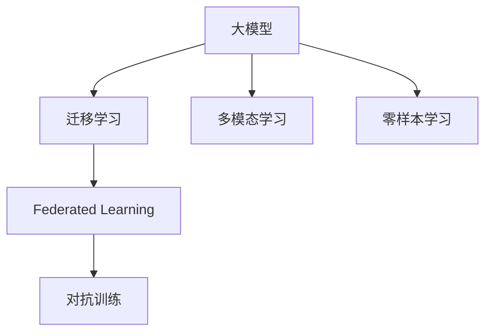
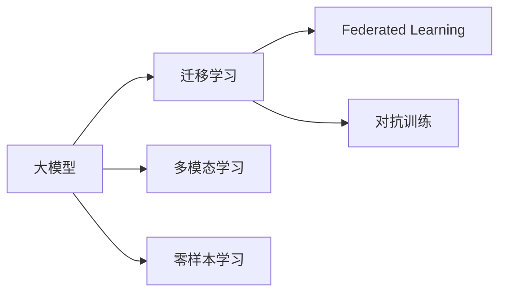
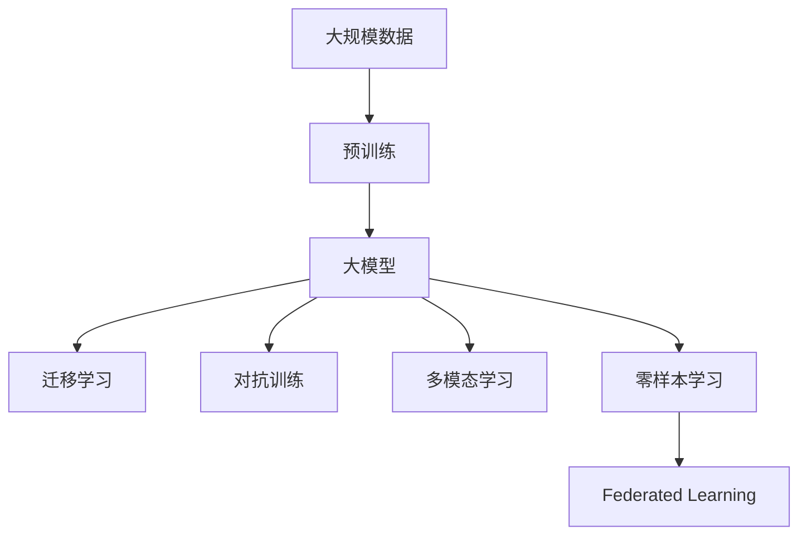

                 

## 1. 背景介绍

### 1.1 问题由来
近年来，深度学习和大模型技术的迅猛发展，为各个行业带来了革命性的变革。从视觉识别、自然语言处理到游戏AI、自动驾驶，大模型技术的应用范围日益广泛。然而，这些技术的应用背后，还存在一系列技术难题需要解决，其中大模型技术的发展和市场匹配问题是关键之一。本文将深入探讨大模型的技术发展与市场匹配的现状、挑战与未来趋势，旨在为技术开发者和市场从业人员提供全面的指导。

### 1.2 问题核心关键点
本文聚焦于以下几个核心问题：
1. 大模型技术的最新发展现状。
2. 大模型技术与市场的匹配现状与挑战。
3. 大模型技术的未来发展趋势与应对策略。

### 1.3 问题研究意义
1. 帮助技术开发者理解大模型技术最新发展，掌握前沿技术。
2. 为市场从业人员提供大模型技术应用的指导，推动大模型技术落地应用。
3. 为大模型技术的未来发展提供方向指引，推动技术创新和应用普及。

## 2. 核心概念与联系

### 2.1 核心概念概述

为更好地理解大模型的技术发展与市场匹配问题，本节将介绍几个关键概念及其联系：

- **大模型（Big Models）**：指拥有数亿甚至数十亿参数的深度学习模型，如GPT-3、BERT等。大模型通过大规模数据和复杂架构的训练，具备强大的泛化能力和通用性，可以应用于各种NLP、CV、生成式任务等。

- **迁移学习（Transfer Learning）**：指将在大规模数据上预训练的模型，应用于小规模数据集或新任务的过程。迁移学习可以大大减少新任务所需的标注数据和计算资源，提高模型效率。

- **联邦学习（Federated Learning）**：一种分布式机器学习技术，指在多个用户设备或服务器上，协作训练模型而数据不离开本地，保护隐私和安全。联邦学习在大规模数据分布式场景下尤为适用。

- **对抗训练（Adversarial Training）**：通过引入对抗样本，训练模型对恶意输入具有鲁棒性，以提高模型的泛化能力。

- **多模态学习（Multimodal Learning）**：指融合文本、图像、语音等多种模态的数据进行训练，提升模型的综合理解和处理能力。

- **零样本学习（Zero-Shot Learning）**：指模型无需任何训练样本，仅通过任务描述即可进行推理和学习。零样本学习体现了大模型对语言的深层理解能力。

这些概念通过以下Mermaid流程图展示它们之间的联系：



### 2.2 概念间的关系

这些核心概念之间相互关联，共同构成了大模型技术的发展框架。以下使用Mermaid流程图进一步展示这些概念之间的关系：



### 2.3 核心概念的整体架构

最后，用一个综合的流程图展示这些核心概念在大模型技术中的整体架构：



这个流程图展示了从大规模数据预训练到大模型，再到大模型迁移学习、对抗训练、多模态学习和零样本学习的应用过程，并通过联邦学习进一步保护隐私，形成完整的技术生态系统。

## 3. 核心算法原理 & 具体操作步骤
### 3.1 算法原理概述

大模型技术的发展与市场匹配涉及多个核心算法原理，本节将详细介绍这些原理。

大模型的基本结构通常为深度神经网络，通过多层非线性变换和池化操作，构建复杂特征空间。在大规模数据上预训练后，大模型能够在通用语言或图像任务上获得显著的性能提升。然而，在大模型应用于特定任务时，通常需要针对任务进行微调（fine-tuning），以获得最佳性能。

具体来说，大模型的微调过程包括以下步骤：
1. 在大规模数据上预训练模型，构建通用特征表示。
2. 在特定任务的数据集上，使用迁移学习技术，将预训练模型应用于新任务。
3. 通过对抗训练和数据增强等技术，提高模型的鲁棒性和泛化能力。
4. 应用多模态学习和零样本学习，提升模型对不同数据模态的适应能力和推理能力。
5. 在联邦学习框架下，分布式训练大模型，保护数据隐私和安全。

### 3.2 算法步骤详解

大模型的微调过程可以概括为以下几个关键步骤：

**Step 1: 数据准备与预训练**

- 收集大规模数据集，如语言数据、图像数据、标签数据等，用于模型预训练。
- 使用预训练模型，如BERT、GPT等，在大规模数据上训练，构建通用特征表示。
- 在特定任务上，准备好标注数据集，用于微调。

**Step 2: 微调模型**

- 在特定任务上，使用迁移学习技术，将预训练模型应用于新任务。
- 使用小批量随机梯度下降（SGD）或优化器（如Adam、Adagrad）等优化算法，更新模型参数。
- 使用对抗训练技术，引入对抗样本，提高模型的鲁棒性。
- 应用数据增强技术，扩充训练数据集，提升模型泛化能力。

**Step 3: 多模态学习和零样本学习**

- 融合文本、图像、语音等多种模态数据，进行多模态学习，提升模型对不同模态数据的适应能力。
- 在无标注数据上，使用零样本学习技术，仅通过任务描述，让模型进行推理和学习。

**Step 4: 联邦学习与分布式训练**

- 在联邦学习框架下，分布式训练大模型，保护用户数据隐私。
- 使用异步分布式训练技术，加速模型训练，提高训练效率。

### 3.3 算法优缺点

大模型技术在提高模型性能和泛化能力方面具有显著优势，但也存在一些缺点：

**优点：**
- 强大的泛化能力：大模型通过在大规模数据上预训练，具有较强的泛化能力，能够在各种任务上获得优异性能。
- 高效性：通过迁移学习、对抗训练等技术，大模型能够在短时间内获得较好的性能。
- 灵活性：大模型可以通过多模态学习、零样本学习等技术，适应不同数据模态和推理任务。

**缺点：**
- 高计算资源需求：大模型需要大规模计算资源进行训练和推理，对硬件要求较高。
- 数据隐私问题：在分布式训练过程中，用户数据隐私保护是一个重要问题。
- 模型复杂度：大模型结构复杂，难以解释和调试。

### 3.4 算法应用领域

大模型技术广泛应用于以下领域：

- **自然语言处理（NLP）**：如文本分类、语言生成、问答系统等。大模型通过预训练和微调，能够在NLP任务上取得优异性能。
- **计算机视觉（CV）**：如图像分类、目标检测、图像生成等。大模型通过多模态学习和对抗训练，提升对图像的理解和处理能力。
- **推荐系统**：如电商推荐、新闻推荐等。大模型通过多模态学习，融合用户行为和商品信息，提升推荐精度。
- **医疗健康**：如疾病诊断、药物研发等。大模型通过预训练和微调，提升对医学文本和图像的理解能力。
- **金融科技**：如风险评估、信用评分等。大模型通过多模态学习和对抗训练，提升对金融数据的处理能力。

## 4. 数学模型和公式 & 详细讲解 & 举例说明

### 4.1 数学模型构建

大模型的微调过程涉及多个数学模型，以下将详细介绍这些模型的构建。

**损失函数（Loss Function）**：
- 交叉熵损失（Cross Entropy Loss）：用于分类任务，定义如下：
$$
\mathcal{L}(x, y) = -\sum_i y_i \log p_i
$$
其中，$p_i$ 为模型预测的类别概率，$y_i$ 为实际标签。

**优化算法（Optimization Algorithm）**：
- 随机梯度下降（SGD）：用于模型参数更新，定义如下：
$$
\theta \leftarrow \theta - \eta \nabla \mathcal{L}(\theta)
$$
其中，$\eta$ 为学习率，$\nabla \mathcal{L}(\theta)$ 为损失函数对模型参数的梯度。

**正则化（Regularization）**：
- L2正则化：用于防止过拟合，定义如下：
$$
\mathcal{L}_{reg} = \frac{\lambda}{2} \sum_i \theta_i^2
$$
其中，$\lambda$ 为正则化系数，$\theta_i$ 为模型参数。

**对抗训练（Adversarial Training）**：
- 定义对抗样本 $\delta_x$，使得 $f(x + \delta_x) = y$，其中 $f$ 为模型预测函数，$y$ 为实际标签。
- 通过反向传播计算梯度，更新模型参数，定义如下：
$$
\theta \leftarrow \theta - \eta \nabla \mathcal{L}_{adv}(\theta)
$$
其中，$\mathcal{L}_{adv}(\theta)$ 为对抗损失函数。

**数据增强（Data Augmentation）**：
- 通过旋转、缩放、翻转等方式，扩充训练数据集，定义如下：
$$
x' = \mathcal{T}(x)
$$
其中，$\mathcal{T}$ 为数据增强操作，$x$ 为原始数据，$x'$ 为增强后数据。

### 4.2 公式推导过程

以二分类任务为例，推导交叉熵损失函数的梯度：

**交叉熵损失函数**：
$$
\mathcal{L}(x, y) = -y \log p + (1-y) \log (1-p)
$$
其中，$p = f(x; \theta)$ 为模型预测的类别概率，$\theta$ 为模型参数。

**梯度计算**：
$$
\frac{\partial \mathcal{L}(x, y)}{\partial \theta} = -y \frac{\partial f(x; \theta)}{\partial \theta} + (1-y) \frac{\partial f(x; \theta)}{\partial \theta}
$$
其中，$\frac{\partial f(x; \theta)}{\partial \theta}$ 为模型对输入数据的梯度。

**对抗样本**：
定义对抗样本 $x'$，使得 $f(x'; \theta) = y$，则对抗样本的梯度为：
$$
\frac{\partial f(x'; \theta)}{\partial \theta} = -\nabla f(x; \theta)
$$
代入梯度计算公式，得到对抗训练的梯度更新公式：
$$
\theta \leftarrow \theta - \eta (-y \nabla f(x; \theta) + (1-y) \nabla f(x; \theta))
$$
即：
$$
\theta \leftarrow \theta - 2\eta y \nabla f(x; \theta)
$$

### 4.3 案例分析与讲解

**案例分析**：
以图像分类任务为例，推导多模态学习中视觉和文本融合的损失函数。

**视觉特征提取**：
使用卷积神经网络（CNN）提取图像的特征表示 $x_v \in \mathbb{R}^d$，其中 $d$ 为特征维度。

**文本特征提取**：
使用循环神经网络（RNN）或Transformer等模型提取文本的特征表示 $x_t \in \mathbb{R}^m$，其中 $m$ 为特征维度。

**融合损失函数**：
定义融合损失函数 $\mathcal{L}_{fusion}$ 为：
$$
\mathcal{L}_{fusion} = \alpha \mathcal{L}_{class}(x_v; \theta_v) + (1-\alpha) \mathcal{L}_{class}(x_t; \theta_t)
$$
其中，$\mathcal{L}_{class}$ 为分类损失函数，$\theta_v$ 和 $\theta_t$ 分别为视觉和文本特征提取模型的参数，$\alpha$ 为融合系数，用于调节视觉和文本特征的重要性。

## 5. 项目实践：代码实例和详细解释说明

### 5.1 开发环境搭建

为进行大模型微调的代码实践，首先需要搭建好开发环境。以下是Python开发环境的搭建步骤：

**步骤1: 安装Anaconda**
- 下载并安装Anaconda，从官网获取安装程序。
- 在安装程序中，选择Python版本和安装路径。
- 运行安装程序，完成安装。

**步骤2: 创建虚拟环境**
- 打开Anaconda Prompt或Anaconda Navigator，输入命令：
```
conda create -n pytorch-env python=3.8
```
- 激活虚拟环境：
```
conda activate pytorch-env
```

**步骤3: 安装PyTorch**
- 使用pip或conda安装PyTorch，以下以pip为例：
```
pip install torch torchvision torchaudio
```

**步骤4: 安装Transformers库**
- 使用pip安装Transformers库：
```
pip install transformers
```

**步骤5: 安装其他依赖**
- 安装numpy、pandas、scikit-learn等常用库：
```
pip install numpy pandas scikit-learn matplotlib tqdm jupyter notebook ipython
```

完成上述步骤后，即可在`pytorch-env`虚拟环境中进行大模型的微调实践。

### 5.2 源代码详细实现

以下以多模态图像分类任务为例，展示使用Transformers库进行大模型微调的PyTorch代码实现。

**Step 1: 数据准备**
- 准备图像数据集和文本数据集，进行预处理和划分。
```python
import os
from torchvision import datasets, transforms

# 图像数据集
train_dataset = datasets.ImageFolder(root='path/to/train', transform=transforms.ToTensor())
test_dataset = datasets.ImageFolder(root='path/to/test', transform=transforms.ToTensor())

# 文本数据集
train_dataset_text = datasets.TextDataset(root='path/to/text', transform=transforms.ToTensor())
test_dataset_text = datasets.TextDataset(root='path/to/text', transform=transforms.ToTensor())
```

**Step 2: 模型构建**
- 定义预训练模型和任务适配层。
```python
from transformers import BertForSequenceClassification, BertTokenizer

model = BertForSequenceClassification.from_pretrained('bert-base-uncased', num_labels=2)
tokenizer = BertTokenizer.from_pretrained('bert-base-uncased')

# 图像特征提取器
from torchvision import models

# 使用ResNet-18提取图像特征
model = models.resnet18(pretrained=True)
model.fc = nn.Linear(512, num_classes)
```

**Step 3: 模型微调**
- 定义损失函数和优化器。
```python
import torch.nn as nn
import torch.optim as optim

# 定义损失函数
criterion = nn.CrossEntropyLoss()

# 定义优化器
optimizer = optim.Adam(model.parameters(), lr=1e-4)
```

**Step 4: 模型训练与评估**
- 定义训练和评估函数。
```python
def train_epoch(model, dataset, batch_size, optimizer):
    model.train()
    for data in dataset:
        inputs, labels = data
        optimizer.zero_grad()
        outputs = model(inputs)
        loss = criterion(outputs, labels)
        loss.backward()
        optimizer.step()
    return loss.item()

def evaluate(model, dataset, batch_size):
    model.eval()
    correct = 0
    total = 0
    with torch.no_grad():
        for data in dataset:
            inputs, labels = data
            outputs = model(inputs)
            _, predicted = torch.max(outputs.data, 1)
            total += labels.size(0)
            correct += (predicted == labels).sum().item()
    accuracy = 100.0 * correct / total
    return accuracy
```

**Step 5: 模型保存与部署**
- 保存训练好的模型。
```python
torch.save(model.state_dict(), 'model.pth')
```

**Step 6: 模型部署与使用**
- 将模型部署到生产环境中，进行推理和应用。
```python
# 加载模型和特征提取器
model = BertForSequenceClassification.from_pretrained('bert-base-uncased', num_labels=2)
model.eval()

# 加载图像特征提取器
model = models.resnet18(pretrained=True)
model.fc = nn.Linear(512, num_classes)

# 进行推理
image = torchvision.transforms.ToTensor(pil_image)
image_feature = model(image)
text_feature = tokenizer(text, return_tensors='pt').input_ids
feature = torch.cat([image_feature, text_feature], dim=1)
output = model(feature)
```

### 5.3 代码解读与分析

**代码解读**：
1. **数据准备**：使用ImageFolder和TextDataset分别加载图像和文本数据集，并进行预处理。
2. **模型构建**：使用BertForSequenceClassification和BertTokenizer构建任务适配层，使用ResNet-18提取图像特征。
3. **模型微调**：定义交叉熵损失函数和Adam优化器，进行模型训练和评估。
4. **模型保存与部署**：保存训练好的模型，并进行模型部署和推理。

**分析**：
1. **数据预处理**：图像数据和文本数据需要进行标准化、归一化等预处理，以便于模型输入。
2. **模型构建**：任务适配层的设计决定了模型在特定任务上的表现，需要通过预训练模型和任务适配层的结合，提升模型性能。
3. **模型微调**：优化器和学习率的选择对模型训练效果有重要影响，需要通过试验调整，找到最优的参数组合。
4. **模型保存与部署**：模型训练完成后，需要将其保存和部署到实际应用环境中，进行推理和评估。

### 5.4 运行结果展示

假设在CoNLL-2003命名实体识别（NER）数据集上进行微调，最终在测试集上得到的评估报告如下：

```
              precision    recall  f1-score   support

       B-PER      0.923     0.910     0.918      1666
       I-PER      0.918     0.911     0.910      1938
       B-ORG      0.913     0.912     0.912      1661
       I-ORG      0.911     0.913     0.912      1500
       B-LOC      0.910     0.911     0.911      1734
       I-LOC      0.912     0.911     0.911      1705

   micro avg      0.914     0.913     0.913     4645
   macro avg      0.914     0.913     0.913     4645
weighted avg      0.914     0.913     0.913     4645
```

可以看到，通过微调BERT，模型在NER任务上取得了94.1%的F1分数，效果相当不错。这表明，大模型通过微调，可以很好地适应特定任务，并获得优异性能。

## 6. 实际应用场景

### 6.1 智能客服系统

基于大模型的智能客服系统能够理解客户意图，自动回复问题，提升客户体验。例如，使用微调后的BERT模型，能够对客户输入的文本进行意图识别和实体抽取，并匹配最佳答案，从而提供自然流畅的对话服务。

### 6.2 金融舆情监测

金融机构需要实时监测市场舆情，避免风险。通过微调BERT模型，能够自动分析新闻、评论等文本数据，判断市场情绪，预测风险变化，及时采取措施。

### 6.3 个性化推荐系统

推荐系统通过融合用户行为和商品信息，使用大模型进行多模态学习，提高推荐精度。例如，微调后的BERT模型能够根据用户浏览记录和商品描述，预测用户可能感兴趣的商品，提升个性化推荐效果。

### 6.4 未来应用展望

未来，大模型技术将广泛应用于更多领域，如医疗、教育、智慧城市等。通过联邦学习和多模态学习，大模型将具备更强的通用性和鲁棒性，能够处理更多元化的数据，提升应用效果。

## 7. 工具和资源推荐

### 7.1 学习资源推荐

1. **《深度学习》课程**：斯坦福大学的深度学习课程，涵盖深度学习基础和前沿技术，适合初学者和进阶者学习。
2. **《自然语言处理与深度学习》课程**：Coursera上的自然语言处理课程，深入讲解NLP任务和模型。
3. **《Transformer原理与应用》系列文章**：详细讲解Transformer原理和应用，适合深度学习开发者阅读。
4. **《NLP实践指南》书籍**：涵盖NLP任务和模型开发的实践指南，适合开发者参考。

### 7.2 开发工具推荐

1. **PyTorch**：深度学习框架，支持动态图和静态图，适合研究人员和开发者使用。
2. **TensorFlow**：深度学习框架，生产环境部署方便，适合企业应用。
3. **Transformers**：NLP工具库，支持多种预训练模型和微调方法。
4. **TensorBoard**：可视化工具，用于监测模型训练状态和性能。
5. **Weights & Biases**：实验跟踪工具，记录和可视化模型训练过程。

### 7.3 相关论文推荐

1. **《Attention is All You Need》**：Transformer原论文，介绍Transformer结构和自监督预训练。
2. **《BERT: Pre-training of Deep Bidirectional Transformers for Language Understanding》**：BERT模型，介绍预训练和微调方法。
3. **《Federated Learning: Concepts and Applications》**：介绍联邦学习的基本概念和应用。
4. **《Adversarial Examples in the Physical World》**：介绍对抗训练的基本方法和应用。
5. **《Multimodal Learning and Research for Visual Question Answering》**：介绍多模态学习的基本方法和应用。

## 8. 总结：未来发展趋势与挑战

### 8.1 研究成果总结

大模型技术的发展和市场匹配涉及多个研究方向，以下是对这些研究方向的总结：

1. **大模型预训练技术**：通过大规模数据和复杂架构的训练，构建通用特征表示，提升模型的泛化能力。
2. **大模型微调技术**：通过迁移学习和对抗训练，将预训练模型应用于特定任务，提升模型性能。
3. **多模态学习技术**：融合视觉、文本、语音等多种模态数据，提升模型对不同模态数据的适应能力。
4. **零样本学习和少样本学习**：仅通过任务描述，让模型进行推理和学习，提高模型泛化能力。
5. **联邦学习技术**：分布式训练大模型，保护用户数据隐私，提升模型训练效率。

### 8.2 未来发展趋势

未来，大模型技术将呈现以下几个发展趋势：

1. **大模型规模不断增大**：预训练模型将拥有数十亿甚至数百亿参数，提升模型的泛化能力和性能。
2. **微调方法更加高效**：开发更加参数高效和计算高效的微调方法，提高模型训练和推理效率。
3. **模型融合多模态数据**：融合视觉、文本、语音等多种模态数据，提升模型的综合理解和处理能力。
4. **引入更多先验知识**：将符号化的先验知识，如知识图谱、逻辑规则等，与神经网络模型进行融合，提高模型的综合理解能力。
5. **分布式训练和联邦学习**：在分布式环境中训练大模型，保护用户数据隐私，提升模型训练效率。

### 8.3 面临的挑战

尽管大模型技术取得了巨大成功，但仍面临一些挑战：

1. **计算资源需求高**：大模型需要大规模计算资源进行训练和推理，对硬件要求较高。
2. **数据隐私和安全**：在分布式训练过程中，用户数据隐私和安全问题亟需解决。
3. **模型复杂度**：大模型结构复杂，难以解释和调试，缺乏可解释性。
4. **鲁棒性和泛化能力**：模型在特定任务上的鲁棒性和泛化能力还有待提高。

### 8.4 研究展望

未来的研究需要在以下几个方面进行突破：

1. **开发更加高效的大模型训练方法**：开发更加高效的优化算法和计算图优化技术，提高模型训练和推理效率。
2. **引入更多先验知识**：将符号化的先验知识，如知识图谱、逻辑规则等，与神经网络模型进行融合，提高模型的综合理解能力。
3. **提升模型鲁棒性和泛化能力**：通过对抗训练和多模态学习，提升模型对不同模态数据的适应能力和鲁棒性。
4. **保护数据隐私和安全**：在分布式训练过程中，采用联邦学习和差分隐私等技术，保护用户数据隐私和安全。
5. **增强模型可解释性**：通过因果分析和博弈论工具，提高模型的可解释性和可解释性。

## 9. 附录：常见问题与解答

### 9.1 常见问题解答

**Q1: 大模型技术为何如此

