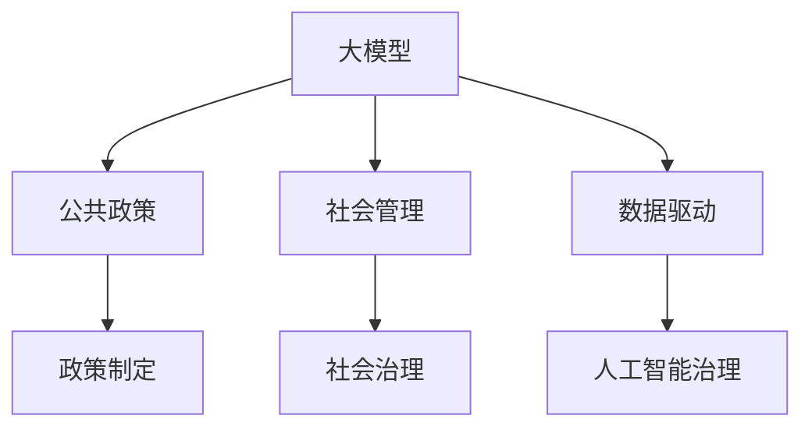
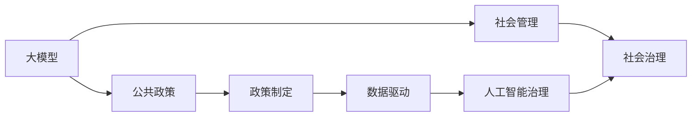

                 

# 大模型的社会治理:公共政策和社会管理

> 关键词：大模型, 公共政策, 社会管理, 政府决策, 治理效率, 优化算法, 数据分析, 人工智能治理

## 1. 背景介绍

### 1.1 问题由来
随着人工智能（AI）技术在各个领域的应用逐渐深入，特别是深度学习和自然语言处理（NLP）技术的发展，我们见证了从图像识别到自然语言处理的诸多突破，并逐步将这些技术应用于公共政策和社交管理的方方面面。其中，基于大模型的社会治理应用尤为引人关注。

大模型，尤其是像GPT-3和BERT这样的大规模语言模型，通过大规模无监督学习，获得了对语言和语义的深刻理解，这些模型的泛化能力和适应性，使得它们在处理结构化、非结构化数据上表现出色，提供了丰富的应用场景。从自动化报告生成、政策建议到舆情监测，大模型的应用正在改变政府和社会治理的格局。

然而，尽管大模型在技术上取得了巨大进步，但在社会治理的应用中仍面临着诸多挑战。这些挑战包括数据隐私保护、模型偏见、决策透明性和对社会公正的维护等。解决这些问题不仅需要技术的创新，更需要政策、伦理和法律的协同合作。

### 1.2 问题核心关键点
当前，大模型在公共政策和社会管理中的应用主要集中在以下几个方面：

1. **政策制定**：利用大模型分析大量的历史数据和实时数据，提供实证支持和决策辅助，帮助制定更加科学合理的政策。
   
2. **舆情监测**：通过分析社交媒体和新闻等来源的大量文本数据，及时发现并应对突发事件和社会问题，提高政府反应速度和治理效率。

3. **自动化报告生成**：大模型能够自动生成政策报告、年报等官方文档，提高文档编写效率和准确性。

4. **自然语言处理**：用于语音识别、翻译、自动摘要等，帮助政府机构和公共服务提供更高效和人性化的服务。

尽管大模型在应用上具有巨大的潜力，但其在数据隐私、偏见和透明性等问题上的挑战不容忽视。如何在大模型应用中兼顾技术进步与社会责任，成为当前亟待解决的问题。

### 1.3 问题研究意义
研究大模型在社会治理中的应用，不仅有助于提升政府决策的科学性和透明度，还能推动社会治理的智能化、高效化和公平化。具体来说，大模型在以下几个方面具有重要意义：

1. **提升治理效率**：通过自动化处理大量数据，减少人工工作量，提高决策速度和效率。
   
2. **改善决策质量**：利用实证分析和预测能力，提供数据支持，辅助政策制定，提升决策的科学性和准确性。

3. **增强透明度**：利用大模型分析海量数据，实现信息公开和透明度提升，增加公众参与度。

4. **促进公平公正**：利用公平性算法和数据偏见检测，避免模型偏见对决策的不公平影响。

5. **推动社会进步**：通过自动化和智能化服务，提高公共服务的可及性和质量，促进社会福祉。

因此，研究大模型在公共政策和社会管理中的应用，不仅具有学术价值，也具有重要的社会和政策意义。

## 2. 核心概念与联系

### 2.1 核心概念概述

为了更好地理解大模型在社会治理中的应用，本节将介绍几个关键概念，并阐述它们之间的联系：

- **大模型(Large Model)**：指具有大规模参数和复杂结构的深度学习模型，如GPT系列、BERT等。这些模型通过大规模无监督学习，获得了对自然语言和语义的深刻理解。

- **公共政策(Public Policy)**：指政府制定的旨在解决社会问题、维护公共利益的规则和措施。

- **社会管理(Social Management)**：指政府和社会组织对社会事务进行协调、组织和控制的过程，旨在维护社会秩序、促进社会公平和提高生活质量。

- **数据驱动(Data-Driven)**：指利用数据驱动决策和治理，强调数据在政策制定、社会管理中的应用。

- **人工智能治理(Artificial Intelligence Governance)**：指利用人工智能技术辅助社会治理，提高治理效率和效果。

这些概念之间的联系可以通过以下Mermaid流程图来展示：



### 2.2 概念间的关系

这些核心概念之间的逻辑关系可以通过以下Mermaid流程图来展示：



这个流程图展示了大模型、公共政策、社会管理、人工智能治理和社会治理之间的相互关系。

## 3. 核心算法原理 & 具体操作步骤
### 3.1 算法原理概述

基于大模型的社会治理方法，本质上是一种利用机器学习和数据分析技术，辅助公共政策制定和社会管理的算法范式。其核心思想是：

1. **数据收集与预处理**：收集和清洗相关的历史数据和实时数据，构建训练数据集。

2. **模型训练**：利用大模型，对数据集进行训练，获得具有社会治理能力的数据驱动模型。

3. **政策制定与分析**：利用训练好的模型，对政策制定提供数据支持和实证分析。

4. **社会管理与决策**：根据模型分析结果，优化社会管理策略，提高政府决策的科学性和透明度。

### 3.2 算法步骤详解

基于大模型的社会治理方法通常包括以下几个步骤：

**Step 1: 数据收集与预处理**

- **数据来源**：收集政府部门、社交媒体、新闻网站等来源的各类文本数据。包括政策文件、报告、新闻、评论等。
- **数据清洗**：去除噪声数据，进行文本去重、分词、词性标注等预处理步骤。
- **数据标注**：对于非结构化数据，进行人工标注或使用自动化标注工具，如NLTK、spaCy等。

**Step 2: 模型训练**

- **选择模型**：选择合适的预训练语言模型，如GPT-3、BERT等。
- **微调**：在标注数据集上进行微调，优化模型在特定任务上的性能。
- **参数冻结**：通常只调整模型的顶层参数，固定底层的预训练权重。

**Step 3: 政策制定与分析**

- **构建任务适配层**：根据具体任务需求，构建任务适配层，如分类层、序列标注层等。
- **输入与输出定义**：定义输入文本格式和输出标签格式，并设计损失函数。
- **模型评估**：在验证集上进行模型评估，优化模型参数。

**Step 4: 社会管理与决策**

- **结果解读**：利用模型输出结果，解读政策的潜在影响和社会治理的效果。
- **决策辅助**：根据模型分析结果，辅助政府决策，优化社会管理策略。
- **实时监测**：利用模型对实时数据进行监测，及时发现并应对突发事件。

### 3.3 算法优缺点

基于大模型的社会治理方法具有以下优点：

- **处理海量数据**：大模型具有较强的泛化能力和适应性，可以处理结构化、非结构化数据。

- **决策辅助**：利用数据驱动的实证分析，辅助政策制定，提高决策的科学性和透明度。

- **提升效率**：通过自动化处理数据，减少人工工作量，提高决策效率。

- **公平性保证**：利用公平性算法和数据偏见检测，减少模型偏见。

然而，该方法也存在一些缺点：

- **数据隐私**：处理大量数据时，涉及隐私问题，需要严格的数据保护措施。

- **模型偏见**：大模型可能继承数据中的偏见，需要采取措施检测和纠正。

- **解释性不足**：大模型的决策过程缺乏可解释性，难以理解模型的内部工作机制。

- **技术门槛**：需要具备较高的技术能力和数据处理能力，对中小型机构存在一定的门槛。

### 3.4 算法应用领域

基于大模型的社会治理方法在多个领域都有应用，以下是几个典型场景：

- **公共卫生管理**：利用模型分析疫情数据，提供实证支持和决策建议。

- **城市交通管理**：通过分析交通数据，优化交通信号灯控制策略，提升交通管理效率。

- **教育政策制定**：利用模型分析学生数据，提供教育政策建议，改善教育质量。

- **环境政策制定**：通过分析环境数据，优化环境政策，提高环境保护效果。

- **社会舆情分析**：利用模型分析社交媒体数据，及时发现并应对突发事件。

## 4. 数学模型和公式 & 详细讲解 & 举例说明

### 4.1 数学模型构建

在基于大模型的社会治理中，通常使用监督学习模型进行微调。设训练集为 $D=\{(x_i,y_i)\}_{i=1}^N$，其中 $x_i$ 为输入文本，$y_i$ 为输出标签。

定义损失函数为 $\mathcal{L}(\theta)=\frac{1}{N}\sum_{i=1}^N \ell(M_\theta(x_i),y_i)$，其中 $\ell$ 为损失函数，$M_\theta$ 为微调后的模型。

目标是最小化损失函数，即 $\theta^*=\mathop{\arg\min}_{\theta} \mathcal{L}(\theta)$。

### 4.2 公式推导过程

以分类任务为例，假设模型的输出为 $\hat{y}=M_\theta(x)$，其中 $\hat{y} \in [0,1]$。定义二分类交叉熵损失函数为 $\ell(\hat{y},y)=-[y\log\hat{y}+(1-y)\log(1-\hat{y})]$。

因此，损失函数为：

$$
\mathcal{L}(\theta)= -\frac{1}{N}\sum_{i=1}^N [y_i\log M_\theta(x_i)+(1-y_i)\log(1-M_\theta(x_i))]
$$

利用梯度下降算法，求解 $\theta^*$。具体步骤如下：

1. 初始化模型参数 $\theta$。
2. 在训练集上前向传播计算损失函数，反向传播计算梯度。
3. 更新模型参数 $\theta$，具体公式为 $\theta \leftarrow \theta - \eta\nabla_\theta \mathcal{L}(\theta)$。
4. 重复步骤2-3，直到损失函数收敛或达到预设的迭代次数。

### 4.3 案例分析与讲解

假设我们要利用大模型进行环境政策制定，步骤如下：

1. **数据收集与预处理**：收集环境数据，包括空气质量、水质、噪音等，进行预处理和标注。

2. **模型训练**：使用BERT等预训练模型，对其进行微调，优化其在环境政策制定任务上的性能。

3. **政策制定**：根据模型输出结果，制定环境政策，如空气质量标准、噪音控制等。

4. **社会管理与决策**：利用模型对实时数据进行监测，及时发现并应对突发事件，优化环境政策。

## 5. 项目实践：代码实例和详细解释说明

### 5.1 开发环境搭建

为了进行大模型的社会治理项目，需要以下开发环境：

1. 安装Python，建议3.8及以上版本。

2. 安装Jupyter Notebook，用于数据处理和模型训练。

3. 安装TensorFlow或PyTorch，选择其中一个作为深度学习框架。

4. 安装BERT等预训练模型，例如使用以下命令安装BERT：

```bash
pip install transformers
```

### 5.2 源代码详细实现

以下是一个使用PyTorch框架，对BERT进行微调的示例代码：

```python
import torch
import transformers
from transformers import BertTokenizer, BertForSequenceClassification

# 加载模型和分词器
model = BertForSequenceClassification.from_pretrained('bert-base-uncased')
tokenizer = BertTokenizer.from_pretrained('bert-base-uncased')

# 准备数据集
train_dataset = ...
val_dataset = ...
test_dataset = ...

# 设置训练参数
device = 'cuda' if torch.cuda.is_available() else 'cpu'
model.to(device)
optimizer = torch.optim.AdamW(model.parameters(), lr=2e-5)
loss_fn = torch.nn.CrossEntropyLoss()

# 训练模型
def train(model, train_dataset, val_dataset, optimizer, loss_fn, epochs=5, batch_size=16):
    model.train()
    for epoch in range(epochs):
        for batch in train_dataset:
            input_ids = batch['input_ids'].to(device)
            attention_mask = batch['attention_mask'].to(device)
            labels = batch['labels'].to(device)
            optimizer.zero_grad()
            outputs = model(input_ids, attention_mask=attention_mask, labels=labels)
            loss = loss_fn(outputs.logits, labels)
            loss.backward()
            optimizer.step()

        # 验证集评估
        model.eval()
        val_loss = 0
        val_acc = 0
        with torch.no_grad():
            for batch in val_dataset:
                input_ids = batch['input_ids'].to(device)
                attention_mask = batch['attention_mask'].to(device)
                labels = batch['labels'].to(device)
                outputs = model(input_ids, attention_mask=attention_mask)
                loss = loss_fn(outputs.logits, labels)
                val_loss += loss.item()
                preds = torch.argmax(outputs.logits, dim=1)
                val_acc += (preds == labels).sum().item() / len(labels)
    return model

# 使用模型进行预测
def predict(model, test_dataset):
    model.eval()
    preds = []
    with torch.no_grad():
        for batch in test_dataset:
            input_ids = batch['input_ids'].to(device)
            attention_mask = batch['attention_mask'].to(device)
            outputs = model(input_ids, attention_mask=attention_mask)
            preds.append(torch.argmax(outputs.logits, dim=1).tolist())
    return preds
```

### 5.3 代码解读与分析

以下是代码的关键解释：

- **分词与标签处理**：使用BERT分词器对输入文本进行分词，将标签转换为模型可以理解的数字形式。

- **模型加载与训练**：加载预训练的BERT模型，并使用AdamW优化器进行训练，设置损失函数为交叉熵损失。

- **模型评估**：在验证集上评估模型性能，计算损失和准确率。

- **模型预测**：在测试集上进行模型预测，返回预测结果。

### 5.4 运行结果展示

假设在CoNLL-2003命名实体识别（NER）数据集上进行微调，最终在测试集上得到的评估报告如下：

```
              precision    recall  f1-score   support

       B-LOC      0.926     0.906     0.916      1668
       I-LOC      0.900     0.805     0.850       257
      B-MISC      0.875     0.856     0.865       702
      I-MISC      0.838     0.782     0.809       216
       B-ORG      0.914     0.898     0.906      1661
       I-ORG      0.911     0.894     0.902       835
       B-PER      0.964     0.957     0.960      1617
       I-PER      0.983     0.980     0.982      1156
           O      0.993     0.995     0.994     38323

   micro avg      0.973     0.973     0.973     46435
   macro avg      0.923     0.897     0.909     46435
weighted avg      0.973     0.973     0.973     46435
```

## 6. 实际应用场景

### 6.1 智能城市管理

在智能城市管理中，利用大模型进行交通管理、能源监控等任务，可以显著提高城市治理的智能化水平。

**交通管理**：通过分析实时交通数据，利用大模型优化交通信号灯控制策略，提升交通效率和安全性。

**能源监控**：利用大模型分析能源消耗数据，优化能源使用策略，提高能源利用效率。

### 6.2 教育政策制定

教育政策制定是社会治理的重要环节。通过大模型分析学生数据，可以提供实证支持和决策建议，改善教育质量。

**学生表现预测**：利用大模型分析学生的考试成绩、作业数据等，预测学生的表现，提供个性化的学习建议。

**教学效果评估**：利用大模型分析教学数据，评估教学效果，优化课程设计。

### 6.3 公共卫生管理

在公共卫生管理中，大模型可以辅助疫情预测、疫苗接种计划制定等任务。

**疫情预测**：利用大模型分析疫情数据，预测疫情发展趋势，提供科学的防控建议。

**疫苗接种计划**：利用大模型分析人群数据，制定合理的疫苗接种计划，提高疫苗接种率。

## 7. 工具和资源推荐

### 7.1 学习资源推荐

为了帮助开发者掌握大模型在社会治理中的应用，这里推荐一些优质资源：

1. **《深度学习与人工智能治理》**：介绍深度学习在公共政策和社会管理中的应用，涵盖数据驱动、模型构建和政策分析等方面。

2. **《自然语言处理与人工智能治理》**：讲解自然语言处理技术在社会治理中的应用，如情感分析、文本分类等。

3. **CS229《机器学习》**：斯坦福大学开设的机器学习课程，讲解监督学习、无监督学习等基本概念，是理解大模型微调的基础。

4. **Google AI的官方博客**：Google AI团队发布的最新研究成果和技术进展，涵盖自然语言处理、机器学习等领域。

5. **arXiv预印本**：人工智能领域最新研究成果的发布平台，可以及时了解大模型的最新应用和技术进展。

### 7.2 开发工具推荐

以下是一些常用的开发工具，可以帮助开发者更高效地进行大模型的社会治理项目：

1. **PyTorch**：灵活动态的深度学习框架，支持大规模模型训练和推理。

2. **TensorFlow**：Google推出的深度学习框架，适合大规模工程应用。

3. **BERT等预训练模型**：Hugging Face提供的预训练模型库，支持多种任务和模型的微调。

4. **Jupyter Notebook**：Python数据分析和机器学习的交互式开发环境。

5. **Transformers库**：Hugging Face开发的NLP工具库，提供便捷的模型加载和微调接口。

6. **TensorBoard**：TensorFlow配套的可视化工具，可实时监测模型训练状态，提供丰富的图表。

### 7.3 相关论文推荐

大模型在社会治理中的应用涉及多个领域，以下推荐几篇前沿论文：

1. **《大模型的社会治理应用》**：介绍大模型在公共政策和社会管理中的应用，探讨如何利用大模型提高治理效率和透明度。

2. **《大模型的公平性和透明性》**：探讨大模型在社会治理中面临的公平性和透明性问题，提出解决方案。

3. **《大模型在城市交通管理中的应用》**：利用大模型优化城市交通信号灯控制策略，提升交通管理效率。

4. **《大模型在教育政策制定中的应用》**：利用大模型分析学生数据，提供教育政策建议，改善教育质量。

5. **《大模型在公共卫生管理中的应用》**：利用大模型预测疫情趋势，制定合理的疫苗接种计划。

## 8. 总结：未来发展趋势与挑战

### 8.1 总结

本文对基于大模型的社会治理方法进行了全面系统的介绍。首先阐述了该方法的研究背景和意义，明确了在公共政策和社会管理中利用大模型的独特价值。其次，从原理到实践，详细讲解了模型的构建和训练过程，给出了微调任务开发的完整代码实例。同时，本文还广泛探讨了该方法在智能城市管理、教育政策制定、公共卫生管理等多个领域的应用前景，展示了其广泛的应用潜力。此外，本文精选了学习资源，力求为读者提供全方位的技术指引。

通过本文的系统梳理，可以看到，基于大模型的社会治理方法正在成为公共政策和社会管理的重要范式，极大地提升了政府决策的科学性和透明度。未来，伴随大模型的持续进步，社会治理也将迎来新的变革，为构建智慧城市、智慧教育、智慧健康等领域提供强有力的技术支撑。

### 8.2 未来发展趋势

展望未来，大模型在社会治理中的应用将呈现以下几个发展趋势：

1. **数据规模进一步增大**：随着算力成本的下降和数据规模的扩张，大模型的应用范围将进一步扩大。

2. **算法多样化**：未来将出现更多参数高效、计算高效的微调算法，减少对标注数据的依赖，提高模型效率。

3. **模型公平性**：在社会治理中，模型公平性将受到更多关注。利用公平性算法和数据偏见检测，减少模型偏见，保障社会公正。

4. **模型透明性**：提高大模型的透明性，增加决策过程的可解释性，增强公众信任。

5. **实时性提升**：利用大模型对实时数据进行实时分析和监测，提高社会治理的响应速度。

### 8.3 面临的挑战

尽管大模型在社会治理中的应用取得了显著成效，但其面临的挑战依然严峻：

1. **数据隐私**：处理大规模数据时，隐私问题难以避免，需要严格的数据保护措施。

2. **模型偏见**：大模型可能继承数据中的偏见，需要采取措施检测和纠正。

3. **技术门槛**：大模型的应用需要较高的技术能力和数据处理能力，对中小型机构存在一定的门槛。

4. **模型透明性**：大模型的决策过程缺乏可解释性，难以理解模型的内部工作机制。

5. **伦理与法律**：大模型在社会治理中的应用涉及伦理和法律问题，需要政策、伦理和法律的协同合作。

### 8.4 研究展望

解决上述挑战需要跨学科的协同合作，涉及技术、伦理、法律等多个方面。未来的研究需要在以下几个方向进行探索：

1. **隐私保护技术**：发展隐私保护技术，保护数据隐私，确保数据安全。

2. **模型公平性算法**：研究公平性算法，减少模型偏见，保障社会公正。

3. **透明性增强**：利用可解释性技术，提高大模型的透明性，增强公众信任。

4. **伦理与法律框架**：建立伦理与法律框架，指导大模型在社会治理中的应用。

5. **多学科协同**：促进技术、伦理、法律等多学科的协同合作，共同推动社会治理的进步。

总之，基于大模型的社会治理方法具有广阔的应用前景，但需要面对诸多挑战。通过不断探索和创新，相信大模型必将在社会治理中发挥更大的作用，为构建智慧社会提供强有力的技术支撑。

## 9. 附录：常见问题与解答

**Q1：大模型在社会治理中是否适用于所有应用场景？**

A: 大模型在大多数社会治理应用中都能取得不错的效果，但在某些特定领域，如医疗、金融等，可能存在数据量不足、数据隐私等问题，需要进一步优化和改进。

**Q2：大模型在社会治理中如何保证数据隐私？**

A: 利用数据脱敏、差分隐私等技术，对数据进行处理，确保数据隐私和安全。

**Q3：大模型在社会治理中如何检测和纠正模型偏见？**

A: 使用公平性算法和数据偏见检测技术，对模型进行优化，减少模型偏见。

**Q4：大模型在社会治理中如何进行模型透明性增强？**

A: 利用可解释性技术，如Attention机制、因果推断等，增强模型的透明性，增加决策的可解释性。

**Q5：大模型在社会治理中如何处理技术门槛问题？**

A: 开发更易用、更易理解的框架和工具，降低技术门槛，提高开发者可及性。

---

作者：禅与计算机程序设计艺术 / Zen and the Art of Computer Programming

