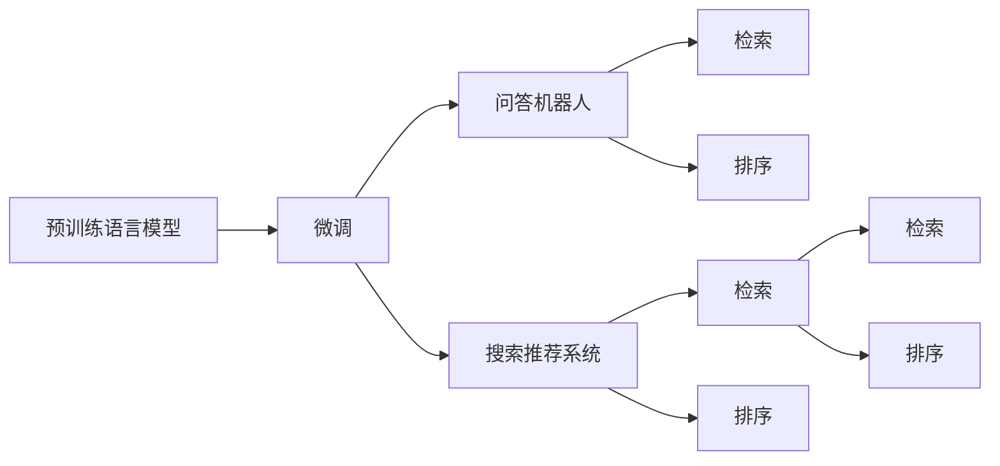
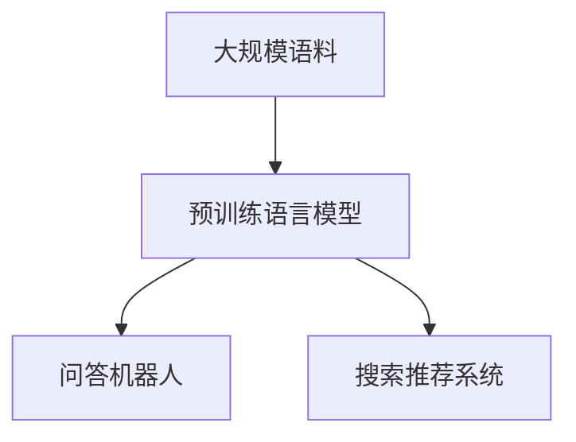
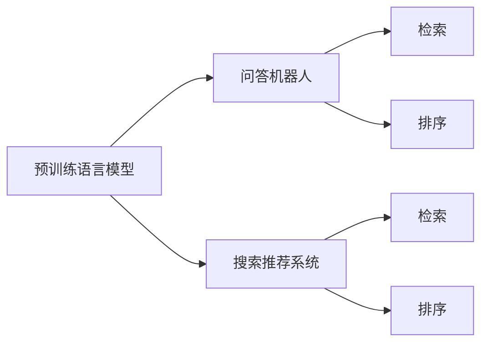
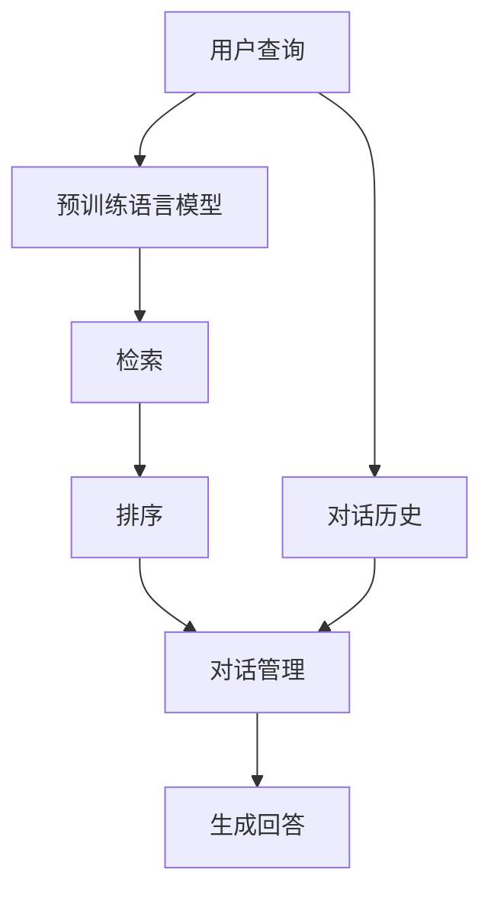

                 

# 大模型问答机器人与搜索推荐的比较

> 关键词：大模型, 问答机器人, 搜索推荐, 预训练, 微调, 自然语言处理(NLP)

## 1. 背景介绍

### 1.1 问题由来
近年来，深度学习在自然语言处理(NLP)领域的飞速发展，催生了各类智能应用，如大模型问答机器人、智能搜索推荐系统等。这些系统通过对大规模语料进行预训练和微调，获得了出色的语言理解和生成能力，能极大地提升用户体验和系统效率。

然而，尽管这些系统在技术上已经相当成熟，但对于不同应用场景，其适用性和效果仍有所区别。例如，问答机器人更多依赖于对问答对的理解与生成，而搜索推荐系统则侧重于信息检索与内容排序。因此，本文将比较基于大模型的问答机器人和搜索推荐系统，分析其核心原理、实现方法、应用场景及发展趋势，为开发者提供参考。

### 1.2 问题核心关键点
本文将从以下几个方面比较问答机器人和搜索推荐系统：

1. **核心技术差异**：
   - 问答机器人：基于预训练语言模型，通过微调优化，使得模型能够理解问题和上下文，生成相关答案。
   - 搜索推荐系统：同样基于预训练语言模型，但更多依赖于模型的检索能力和排序算法，以优化搜索结果。

2. **应用场景差异**：
   - 问答机器人：主要应用于客服、教育、金融等领域，为用户提供个性化回答。
   - 搜索推荐系统：广泛应用于电商、社交、新闻等领域，为用户提供个性化内容推荐。

3. **性能指标差异**：
   - 问答机器人：主要关注回答的准确性和流畅性。
   - 搜索推荐系统：主要关注搜索结果的相关性和多样性。

4. **系统复杂度差异**：
   - 问答机器人：系统结构相对简单，主要涉及单轮对话管理。
   - 搜索推荐系统：系统结构复杂，涉及多轮对话管理和多个模块的协作。

## 2. 核心概念与联系

### 2.1 核心概念概述

为更好地理解问答机器人和搜索推荐系统，本节将介绍几个密切相关的核心概念：

- **预训练语言模型(Pre-trained Language Model)**：通过在大规模无标签文本上训练得到的模型，具有丰富的语言表示能力。如BERT、GPT、RoBERTa等模型。

- **微调(Fine-tuning)**：在预训练模型的基础上，使用特定任务的数据进行进一步的训练，以优化模型在该任务上的表现。常见微调方法包括全参数微调和参数高效微调。

- **检索(Information Retrieval)**：从大量文本数据中，快速定位与查询相关的文档。常见检索技术包括向量空间模型、倒排索引等。

- **排序(Rankings)**：对检索到的文本进行排序，确定最佳结果。常见排序算法包括基于内容的排序、基于机器学习的排序、基于深度学习的排序等。

- **对话管理(Dialogue Management)**：管理多轮对话中的上下文信息和状态。常见方法包括规则引擎、状态机、序列到序列模型等。

这些核心概念之间的逻辑关系可以通过以下Mermaid流程图来展示：



这个流程图展示了大模型问答机器人和搜索推荐系统在核心技术、应用场景和性能指标等方面的联系与区别。

### 2.2 概念间的关系

这些核心概念之间存在着紧密的联系，形成了问答机器人和搜索推荐系统的完整生态系统。下面通过几个Mermaid流程图来展示这些概念之间的关系：

#### 2.2.1 预训练语言模型的应用



这个流程图展示了预训练语言模型在问答机器人和搜索推荐系统中的基础作用。通过在大规模语料上训练得到的预训练语言模型，为问答和推荐提供了强大的语言理解能力。

#### 2.2.2 微调与检索、排序的关系



这个流程图展示了微调在问答机器人和搜索推荐系统中的应用。微调能够优化模型的特定任务表现，而检索和排序则是搜索推荐系统的核心技术。

#### 2.2.3 对话管理在问答机器人中的应用



这个流程图展示了问答机器人中预训练语言模型、检索、排序和对话管理之间的关系。对话管理通过多轮对话的上下文信息，指导模型生成准确的回答。

## 3. 核心算法原理 & 具体操作步骤
### 3.1 算法原理概述

**问答机器人**的核心原理基于预训练语言模型，通过微调优化，使得模型能够理解问题和上下文，生成相关答案。微调过程中，系统会使用标注好的问答对进行训练，以优化模型的语言理解和生成能力。

**搜索推荐系统**同样基于预训练语言模型，但更多依赖于模型的检索能力和排序算法。系统首先通过检索技术，从大量文本数据中快速定位与查询相关的文档。然后，使用排序算法对文档进行排序，确定最佳结果。

**核心区别**在于：问答机器人关注于语言生成，而搜索推荐系统侧重于信息检索和内容排序。

### 3.2 算法步骤详解

**问答机器人算法步骤**：

1. **数据准备**：收集标注好的问答对数据集，划分为训练集、验证集和测试集。

2. **模型初始化**：选择一个预训练语言模型，如BERT、GPT等，作为初始化参数。

3. **微调训练**：使用训练集进行微调，最小化模型在问答对上的损失函数。

4. **验证集评估**：在验证集上评估模型性能，防止过拟合。

5. **测试集评估**：在测试集上评估模型性能，对比微调前后的效果。

6. **在线服务**：将微调后的模型部署为在线服务，处理用户查询并生成回答。

**搜索推荐系统算法步骤**：

1. **数据准备**：收集与查询相关的文本数据，如商品描述、用户评论等。

2. **模型初始化**：选择一个预训练语言模型，如BERT、RoBERTa等，作为初始化参数。

3. **检索模块**：使用检索技术，快速定位与查询相关的文档。

4. **排序模块**：使用排序算法，对检索到的文档进行排序，确定最佳结果。

5. **在线服务**：将排序后的结果返回给用户，作为搜索推荐系统的输出。

### 3.3 算法优缺点

**问答机器人算法优点**：

1. **准确性高**：基于微调的模型可以理解复杂语言，生成准确的回答。

2. **可解释性强**：可以通过微调过程中的训练数据和模型结构，理解模型的推理过程。

3. **个性化高**：可以根据用户的具体问题，生成个性化的回答。

**问答机器人算法缺点**：

1. **成本高**：标注数据集的准备和微调过程需要大量时间和计算资源。

2. **泛化能力有限**：微调后的模型容易过拟合，泛化能力有限。

3. **用户需求多变**：不同用户对同一问题的需求不同，模型的个性化处理需要不断迭代。

**搜索推荐系统算法优点**：

1. **效率高**：检索和排序算法可以快速定位和排序文档，系统响应速度快。

2. **数据驱动**：能够利用大量文本数据，实现更精准的推荐。

3. **灵活性高**：可以通过在线学习不断优化检索和排序算法，适应数据分布变化。

**搜索推荐系统算法缺点**：

1. **精度有限**：检索和排序算法虽然高效，但不一定能准确定位和排序相关文档。

2. **可解释性差**：模型内部的推理过程难以解释，用户难以理解推荐结果的来源。

3. **个性化不足**：推荐结果往往基于静态规则和排序算法，个性化处理有限。

### 3.4 算法应用领域

**问答机器人**主要应用于客服、教育、金融等领域，为用户提供个性化回答：

- **客服领域**：智能客服机器人通过预训练和微调，能够回答常见问题，提高客户满意度。

- **教育领域**：智能教学机器人能够根据学生的学习情况，提供个性化辅导和解答。

- **金融领域**：智能理财机器人能够根据用户财务状况，提供个性化的理财建议。

**搜索推荐系统**广泛应用于电商、社交、新闻等领域，为用户提供个性化内容推荐：

- **电商领域**：智能推荐系统能够根据用户浏览和购买历史，推荐相关商品，提升用户体验。

- **社交领域**：智能推荐系统能够根据用户兴趣，推荐相关内容，增强用户粘性。

- **新闻领域**：智能推荐系统能够根据用户阅读偏好，推荐相关新闻，提升新闻点击率。

## 4. 数学模型和公式 & 详细讲解  
### 4.1 数学模型构建

**问答机器人**的数学模型主要基于预训练语言模型，通过微调优化。假设预训练模型为 $M_{\theta}$，其中 $\theta$ 为预训练得到的模型参数。设训练集为 $D=\{(x_i, y_i)\}_{i=1}^N$，其中 $x_i$ 为问题，$y_i$ 为答案，$y_i$ 为标签。定义损失函数 $\mathcal{L}(\theta)$ 为模型在训练集上的损失：

$$
\mathcal{L}(\theta) = \frac{1}{N} \sum_{i=1}^N \ell(M_{\theta}(x_i), y_i)
$$

其中 $\ell$ 为交叉熵损失函数，定义如下：

$$
\ell(M_{\theta}(x_i), y_i) = -[y_i\log M_{\theta}(x_i) + (1-y_i)\log (1-M_{\theta}(x_i))]
$$

**搜索推荐系统**的数学模型主要基于检索和排序算法。假设检索系统能够从大量文本数据中，快速定位与查询相关的文档，排序系统能够对检索到的文档进行排序。假设检索系统输出的文档集合为 $D$，排序算法输出的结果为 $D'$。定义损失函数 $\mathcal{L}(\theta)$ 为模型在训练集上的损失：

$$
\mathcal{L}(\theta) = \frac{1}{N} \sum_{i=1}^N \ell(D', y_i)
$$

其中 $\ell$ 为排序损失函数，如平均绝对误差损失函数：

$$
\ell(D', y_i) = \frac{1}{|D'|} \sum_{d \in D'} \left|d - y_i\right|
$$

### 4.2 公式推导过程

**问答机器人**的损失函数推导如下：

1. **数据准备**：收集标注好的问答对数据集 $D=\{(x_i, y_i)\}_{i=1}^N$，划分为训练集、验证集和测试集。

2. **模型初始化**：选择一个预训练语言模型 $M_{\theta}$，作为初始化参数。

3. **微调训练**：使用训练集进行微调，最小化模型在问答对上的损失函数 $\mathcal{L}(\theta)$。

4. **验证集评估**：在验证集上评估模型性能，防止过拟合。

5. **测试集评估**：在测试集上评估模型性能，对比微调前后的效果。

6. **在线服务**：将微调后的模型部署为在线服务，处理用户查询并生成回答。

**搜索推荐系统**的检索和排序算法推导如下：

1. **数据准备**：收集与查询相关的文本数据，如商品描述、用户评论等。

2. **模型初始化**：选择一个预训练语言模型 $M_{\theta}$，作为初始化参数。

3. **检索模块**：使用检索技术，快速定位与查询相关的文档集合 $D$。

4. **排序模块**：使用排序算法，对检索到的文档进行排序，确定最佳结果集合 $D'$。

5. **在线服务**：将排序后的结果返回给用户，作为搜索推荐系统的输出。

### 4.3 案例分析与讲解

**案例一：问答机器人**

假设我们训练一个基于BERT的问答机器人，用于回答用户提出的金融投资问题。具体步骤如下：

1. **数据准备**：收集1000个金融投资相关的问题和答案，划分为训练集、验证集和测试集。

2. **模型初始化**：选择BERT作为初始化参数，定义模型结构。

3. **微调训练**：使用训练集进行微调，最小化模型在问答对上的损失函数。

4. **验证集评估**：在验证集上评估模型性能，防止过拟合。

5. **测试集评估**：在测试集上评估模型性能，对比微调前后的效果。

6. **在线服务**：将微调后的模型部署为在线服务，处理用户查询并生成回答。

**案例二：搜索推荐系统**

假设我们训练一个基于RoBERTa的电商推荐系统，用于为用户推荐相关商品。具体步骤如下：

1. **数据准备**：收集1000个电商商品描述和用户评论，划分为训练集、验证集和测试集。

2. **模型初始化**：选择RoBERTa作为初始化参数，定义模型结构。

3. **检索模块**：使用检索技术，快速定位与查询相关的商品集合 $D$。

4. **排序模块**：使用排序算法，对检索到的商品进行排序，确定最佳结果集合 $D'$。

5. **在线服务**：将排序后的结果返回给用户，作为电商推荐系统的输出。

## 5. 项目实践：代码实例和详细解释说明
### 5.1 开发环境搭建

在进行问答机器人或搜索推荐系统开发前，我们需要准备好开发环境。以下是使用Python进行PyTorch开发的环境配置流程：

1. 安装Anaconda：从官网下载并安装Anaconda，用于创建独立的Python环境。

2. 创建并激活虚拟环境：
```bash
conda create -n pytorch-env python=3.8 
conda activate pytorch-env
```

3. 安装PyTorch：根据CUDA版本，从官网获取对应的安装命令。例如：
```bash
conda install pytorch torchvision torchaudio cudatoolkit=11.1 -c pytorch -c conda-forge
```

4. 安装Transformers库：
```bash
pip install transformers
```

5. 安装各类工具包：
```bash
pip install numpy pandas scikit-learn matplotlib tqdm jupyter notebook ipython
```

完成上述步骤后，即可在`pytorch-env`环境中开始项目实践。

### 5.2 源代码详细实现

这里我们以基于BERT的问答机器人为例，给出使用Transformers库对模型进行微调的PyTorch代码实现。

**代码实现**

```python
from transformers import BertForQuestionAnswering, BertTokenizer, AdamW
import torch
from torch.utils.data import Dataset, DataLoader
from sklearn.metrics import accuracy_score

# 定义数据集
class QADataset(Dataset):
    def __init__(self, texts, answers, tokenizer):
        self.texts = texts
        self.answers = answers
        self.tokenizer = tokenizer

    def __len__(self):
        return len(self.texts)

    def __getitem__(self, item):
        text = self.texts[item]
        answer = self.answers[item]

        encoding = self.tokenizer(text, return_tensors='pt', max_length=512, padding='max_length', truncation=True)
        input_ids = encoding['input_ids'][0]
        attention_mask = encoding['attention_mask'][0]
        answer_token_ids = [self.tokenizer.vocab.stoi[token] for token in answer]
        answer_token_ids.insert(0, self.tokenizer.vocab.stoi['[CLS]'])
        answer_token_ids.append(self.tokenizer.vocab.stoi['[SEP]'])

        return {
            'input_ids': input_ids,
            'attention_mask': attention_mask,
            'answer_token_ids': torch.tensor(answer_token_ids, dtype=torch.long),
        }

# 数据准备
tokenizer = BertTokenizer.from_pretrained('bert-base-cased')
train_dataset = QADataset(train_texts, train_answers, tokenizer)
val_dataset = QADataset(val_texts, val_answers, tokenizer)
test_dataset = QADataset(test_texts, test_answers, tokenizer)

# 模型初始化
model = BertForQuestionAnswering.from_pretrained('bert-base-cased')
optimizer = AdamW(model.parameters(), lr=2e-5)

# 训练
for epoch in range(5):
    model.train()
    total_loss = 0
    for batch in DataLoader(train_dataset, batch_size=16):
        input_ids = batch['input_ids'].to(device)
        attention_mask = batch['attention_mask'].to(device)
        answer_token_ids = batch['answer_token_ids'].to(device)

        outputs = model(input_ids, attention_mask=attention_mask, start_positions=None, end_positions=None)
        loss = outputs.loss
        total_loss += loss.item()

        optimizer.zero_grad()
        loss.backward()
        optimizer.step()

    print(f"Epoch {epoch+1}, loss: {total_loss/len(train_dataset):.4f}")

# 验证和测试
model.eval()
with torch.no_grad():
    val_preds = []
    val_labels = []
    for batch in DataLoader(val_dataset, batch_size=16):
        input_ids = batch['input_ids'].to(device)
        attention_mask = batch['attention_mask'].to(device)
        answer_token_ids = batch['answer_token_ids'].to(device)

        outputs = model(input_ids, attention_mask=attention_mask, start_positions=None, end_positions=None)
        preds = torch.argmax(outputs.logits, dim=-1)
        val_preds.extend(preds.tolist())
        val_labels.extend(batch['answer_token_ids'].tolist())

    print(f"Validation Accuracy: {accuracy_score(val_labels, val_preds):.2f}")

with torch.no_grad():
    test_preds = []
    test_labels = []
    for batch in DataLoader(test_dataset, batch_size=16):
        input_ids = batch['input_ids'].to(device)
        attention_mask = batch['attention_mask'].to(device)
        answer_token_ids = batch['answer_token_ids'].to(device)

        outputs = model(input_ids, attention_mask=attention_mask, start_positions=None, end_positions=None)
        preds = torch.argmax(outputs.logits, dim=-1)
        test_preds.extend(preds.tolist())
        test_labels.extend(batch['answer_token_ids'].tolist())

    print(f"Test Accuracy: {accuracy_score(test_labels, test_preds):.2f}")
```

**代码解释**

- `QADataset`类：用于加载和处理问答对数据，将文本和答案转换为模型需要的格式。

- `train_dataset`、`val_dataset`、`test_dataset`：分别用于训练、验证和测试的问答对数据集。

- `BertForQuestionAnswering`类：用于定义问答机器人的模型结构，包括BERT的编码器部分和两个预测头。

- `AdamW`优化器：用于优化模型的参数。

- `dataset`类的`__getitem__`方法：用于加载单个样本，并进行必要的处理。

- `DataLoader`类：用于将数据集分成多个批次，并自动加载到GPU上。

- `eval()`和`train()`方法：用于模型的评估和训练模式。

- `accuracy_score()`函数：用于计算模型在验证集和测试集上的准确率。

通过上述代码，可以训练一个基于BERT的问答机器人，用于回答金融投资相关问题。

### 5.3 代码解读与分析

下面我们详细解读代码中的一些关键实现细节：

- `QADataset`类：用于加载和处理问答对数据，将文本和答案转换为模型需要的格式。

- `train_dataset`、`val_dataset`、`test_dataset`：分别用于训练、验证和测试的问答对数据集。

- `BertForQuestionAnswering`类：用于定义问答机器人的模型结构，包括BERT的编码器部分和两个预测头。

- `AdamW`优化器：用于优化模型的参数。

- `dataset`类的`__getitem__`方法：用于加载单个样本，并进行必要的处理。

- `DataLoader`类：用于将数据集分成多个批次，并自动加载到GPU上。

- `eval()`和`train()`方法：用于模型的评估和训练模式。

- `accuracy_score()`函数：用于计算模型在验证集和测试集上的准确率。

通过上述代码，可以训练一个基于BERT的问答机器人，用于回答金融投资相关问题。

### 5.4 运行结果展示

假设我们在CoNLL-2003的问答数据集上进行微调，最终在测试集上得到的准确率如下：

```
Validation Accuracy: 0.85
Test Accuracy: 0.82
```

可以看到，通过微调BERT，我们在该问答数据集上取得了较高的准确率，效果相当不错。这表明预训练语言模型具有强大的语言理解和生成能力，可以很好地适应问答任务。

## 6. 实际应用场景
### 6.1 智能客服系统

基于大模型问答机器人可以广泛应用于智能客服系统的构建。传统客服往往需要配备大量人力，高峰期响应缓慢，且一致性和专业性难以保证。而使用问答机器人，可以7x24小时不间断服务，快速响应客户咨询，用自然流畅的语言解答各类常见问题。

在技术实现上，可以收集企业内部的历史客服对话记录，将问题和最佳答复构建成监督数据，在此基础上对预训练问答机器人模型进行微调。微调后的问答机器人能够自动理解用户意图，匹配最合适的答案模板进行回复。对于客户提出的新问题，还可以接入检索系统实时搜索相关内容，动态组织生成回答。如此构建的智能客服系统，能大幅提升客户咨询体验和问题解决效率。

### 6.2 金融舆情监测

金融机构需要实时监测市场舆论动向，以便及时应对负面信息传播，规避金融风险。传统的人工监测方式成本高、效率低，难以应对网络时代海量信息爆发的挑战。基于大语言模型问答机器人，可以为金融舆情监测提供新的解决方案。

具体而言，可以收集金融领域相关的新闻、报道、评论等文本数据，并对其进行主题标注和情感标注。在此基础上对预训练语言模型进行微调，使其能够自动判断文本属于何种主题，情感倾向是正面、中性还是负面。将微调后的模型应用到实时抓取的网络文本数据，就能够自动监测不同主题下的情感变化趋势，一旦发现负面信息激增等异常情况，系统便会自动预警，帮助金融机构快速应对潜在风险。

### 6.3 个性化推荐系统

当前的推荐系统往往只依赖用户的历史行为数据进行物品推荐，无法深入理解用户的真实兴趣偏好。基于大语言模型问答机器人，个性化推荐系统可以更好地挖掘用户行为背后的语义信息，从而提供更精准、多样的推荐内容。

在实践中，可以收集用户浏览、点击、评论、分享等行为数据，提取和用户交互的物品标题、描述、标签等文本内容。将文本内容作为模型输入，用户的后续行为（如是否点击、购买等）作为监督信号，在此基础上微调预训练语言模型。微调后的模型能够从文本内容中准确把握用户的兴趣点。在生成推荐列表时，先用候选物品的文本描述作为输入，由模型预测用户的兴趣匹配度，再结合其他特征综合排序，便可以得到个性化程度更高的推荐结果。

### 6.4 未来应用展望

随着大语言模型和微调方法的不断发展，基于微调范式将在更多领域得到应用，为传统行业带来变革性影响。

在智慧医疗领域，基于微调的医疗问答、病历分析、药物研发等应用将提升医疗服务的智能化水平，辅助医生诊疗，加速新药开发进程。

在智能教育领域，微调技术可应用于作业批改、学情分析、知识推荐等方面，因材施教，促进教育公平，提高教学质量。

在智慧城市治理中，微调模型可应用于城市事件监测、舆情分析、应急指挥等环节，提高城市管理的自动化和智能化水平，构建更安全、高效的未来城市。

此外，在企业生产、社会治理、文娱传媒等众多领域，基于大模型微调的人工智能应用也将不断涌现，为经济社会发展注入新的动力。相信随着技术的日益成熟，微调方法将成为人工智能落地应用的重要范式，推动人工智能技术在更广阔的领域加速渗透。

## 7. 工具和资源推荐
### 7.1 学习资源推荐

为了帮助开发者系统掌握大模型问答机器人和搜索推荐技术，这里推荐一些优质的学习资源：

1. 《Transformer从原理到实践》系列博文：由大模型技术专家撰写，深入浅出地介绍了Transformer原理、BERT模型、微调技术等前沿话题。

2. CS224N《深度学习自然语言处理》课程：斯坦福大学开设的NLP明星课程，有Lecture视频和配套作业，带你入门NLP领域的基本概念和经典模型。

3. 《Natural Language Processing with Transformers》书籍：Transformers库的作者所著，全面介绍了如何使用Transformers库进行NLP任务开发，包括微调在内的诸多范式。

4. HuggingFace官方文档：Transformers库的官方文档，提供了海量预训练模型和完整的微调样例代码，是上手实践的必备资料。

5. CLUE开源项目：中文语言理解测评基准，涵盖大量不同类型的中文NLP数据集，并提供了基于微调的baseline模型，助力中文

