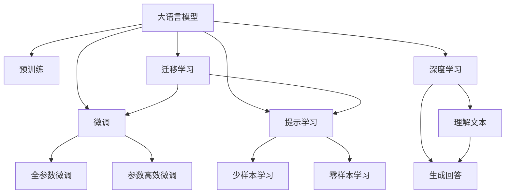

                 

# 大模型问答机器人如何实现准确回答

大语言模型在问答机器人领域中的应用已经成为推动NLP技术进步的重要力量。本文将详细介绍如何利用大语言模型构建一个准确的问答机器人，并展示其实现原理和操作步骤。

## 1. 背景介绍

随着人工智能技术的不断发展，大语言模型在自然语言处理（NLP）领域的应用越来越广泛。问答机器人作为NLP技术的典型应用之一，已经成为了智能客服、教育、医疗等多个领域的重要工具。

问答机器人通过理解用户的问题并给出相应的回答，从而实现人机交互。一个高效的问答机器人不仅需要理解用户的问题，还需要提供准确的回答。为了实现这一目标，通常需要构建一个基于大语言模型的问答系统。

## 2. 核心概念与联系

### 2.1 核心概念概述

在构建问答系统时，我们首先需要了解以下核心概念：

- 大语言模型：以自回归模型（如GPT）或自编码模型（如BERT）为代表的大规模预训练语言模型。通过在大规模无标签文本数据上进行预训练，学习到通用的语言表示。

- 预训练：指在大规模无标签文本数据上，通过自监督学习任务训练通用语言模型的过程。常见的预训练任务包括掩码语言模型等。

- 微调：指在预训练模型的基础上，使用下游任务的少量标注数据，通过有监督学习优化模型在该任务上的性能。

- 提示学习：通过在输入文本中添加提示模板，引导大语言模型进行特定任务的推理和生成。

- 深度学习：利用神经网络等模型，通过大量数据训练，使机器能够自动学习特征，进行复杂任务的推理和决策。

- 迁移学习：将一个领域学习到的知识，迁移应用到另一个不同但相关的领域。

- 知识图谱：一种用于表示实体及其之间关系的图形数据结构。

- 多轮对话：指问答系统与用户进行多次互动，逐步获取更多信息，从而更好地理解用户的意图和问题。

这些核心概念之间存在着紧密的联系，构成了问答机器人系统的基础架构。

### 2.2 概念间的关系

这些核心概念之间的逻辑关系可以通过以下Mermaid流程图来展示：



这个流程图展示了大语言模型的核心概念及其之间的关系：

1. 大语言模型通过预训练获得基础能力。
2. 微调是对预训练模型进行任务特定的优化，可以分为全参数微调和参数高效微调（PEFT）。
3. 提示学习是一种不更新模型参数的方法，可以实现少样本学习和零样本学习。
4. 迁移学习是连接预训练模型与下游任务的桥梁，可以通过微调或提示学习来实现。
5. 深度学习利用神经网络等模型，通过大量数据训练，使机器能够自动学习特征，进行复杂任务的推理和决策。
6. 知识图谱是一种用于表示实体及其之间关系的图形数据结构。
7. 多轮对话是指问答系统与用户进行多次互动，逐步获取更多信息，从而更好地理解用户的意图和问题。

## 3. 核心算法原理 & 具体操作步骤
### 3.1 算法原理概述

基于大语言模型的问答系统通常采用以下步骤：

1. 收集用户的问题，并进行预处理，将其转化为模型可以理解的形式。
2. 使用大语言模型对问题进行编码，提取问题的特征。
3. 在知识图谱中查找与问题相关的实体和关系。
4. 根据问题的特征和知识图谱中的信息，使用大语言模型生成答案。
5. 对生成的答案进行后处理，如格式化和校验，确保答案的准确性和完整性。

### 3.2 算法步骤详解

下面将详细介绍每个步骤的具体实现方法。

**Step 1: 问题预处理**

在将用户的问题输入大语言模型之前，我们需要对其进行预处理。预处理的过程包括：

- 去除标点符号和停用词：这些符号和词汇对于理解问题通常没有实际意义，需要将其去除。
- 分词：将问题分解为单个词汇，便于后续的处理和理解。
- 词性标注：标记每个词汇的词性，有助于理解问题的结构和语义。
- 命名实体识别：识别问题中的命名实体，如人名、地名等。

**Step 2: 问题编码**

将预处理后的问题输入大语言模型，得到问题的向量表示。这一步骤通常包括以下几个方面：

- 选择合适的预训练模型：常见的预训练模型包括BERT、GPT等。
- 对问题进行编码：将问题转换为模型可以理解的格式，通常使用embedding或预训练模型输出的上下文向量。
- 对问题的向量表示进行归一化：确保向量在相同的尺度上，便于后续的处理。

**Step 3: 知识图谱检索**

知识图谱是一种用于表示实体及其之间关系的图形数据结构。在知识图谱中检索与问题相关的实体和关系，可以通过以下方法实现：

- 构建知识图谱索引：将知识图谱中的实体和关系进行索引，便于快速检索。
- 使用匹配算法：将问题中的实体和关系与知识图谱中的信息进行匹配，找到相关的实体和关系。

**Step 4: 生成答案**

根据问题的特征和知识图谱中的信息，使用大语言模型生成答案。这一步骤通常包括以下几个方面：

- 选择生成模型：常见的生成模型包括GPT、T5等。
- 输入生成模型：将问题的向量表示和知识图谱中的信息输入生成模型，生成答案。
- 后处理答案：对生成的答案进行后处理，如格式化和校验，确保答案的准确性和完整性。

**Step 5: 反馈循环**

对于多轮对话的问答系统，我们需要使用反馈循环来逐步获取更多信息，从而更好地理解用户的意图和问题。这一步骤通常包括以下几个方面：

- 对话轮数控制：设置对话轮数的上限，避免无休止的对话。
- 上下文管理：记录对话的上下文信息，以便后续的推理和生成。
- 用户意图识别：通过上下文信息，识别用户的意图和问题的变化。

### 3.3 算法优缺点

基于大语言模型的问答系统具有以下优点：

- 自动化：整个问答过程完全自动化，无需人工干预。
- 准确性：大语言模型在理解和生成答案方面具有高度的准确性。
- 可扩展性：可以根据需要增加更多的预训练模型和知识图谱，提升系统的性能。

同时，该方法也存在一些缺点：

- 计算资源需求高：大语言模型需要大量的计算资源进行训练和推理。
- 数据需求大：需要大量高质量的标注数据进行训练，否则会影响模型的准确性。
- 用户隐私问题：用户输入的问题和生成的答案可能涉及敏感信息，需要特别关注隐私保护。

### 3.4 算法应用领域

基于大语言模型的问答系统已经在多个领域得到了广泛应用，例如：

- 智能客服：用于解答用户问题，提供24小时不间断服务。
- 教育：用于自动批改作业、提供学习资源和解答问题。
- 医疗：用于提供健康咨询、诊断和治疗建议。
- 金融：用于提供投资建议、风险评估和客户服务。

## 4. 数学模型和公式 & 详细讲解

### 4.1 数学模型构建

基于大语言模型的问答系统通常采用以下数学模型：

- 问题编码：将问题转换为模型可以理解的向量表示，通常使用BERT或GPT模型。
- 知识图谱检索：在知识图谱中检索与问题相关的实体和关系，使用匹配算法如Node2Vec等。
- 答案生成：使用生成模型如GPT或T5，生成与问题相关的答案。

### 4.2 公式推导过程

以BERT模型为例，对问题进行编码的过程如下：

1. 将问题分解为单个词汇：
   $$
   \text{tokens} = \{w_1, w_2, \ldots, w_n\}
   $$
2. 对每个词汇进行嵌入处理：
   $$
   \text{embeddings} = \{\text{embed}(w_1), \text{embed}(w_2), \ldots, \text{embed}(w_n)\}
   $$
3. 使用BERT模型对嵌入进行处理，得到上下文向量：
   $$
   \text{context} = \text{BERT}(\text{embeddings})
   $$

### 4.3 案例分析与讲解

假设我们有一个问答系统，用于回答以下问题：

问题：“北京今天的天气怎么样？”

**Step 1: 问题预处理**

1. 去除标点符号和停用词：
   - 问题：“北京今天的天气怎么样？”
   - 预处理后：“北京 今天 天气 怎么样”
2. 分词：
   - 分词结果：["北京", "今天", "天气", "怎么样"]
3. 词性标注：
   - 词性标注结果：["地名", "时间", "名词", "动词"]
4. 命名实体识别：
   - 命名实体：["北京"]

**Step 2: 问题编码**

1. 选择合适的预训练模型：BERT
2. 对问题进行编码：
   - 将分词后的词汇输入BERT模型，得到问题的向量表示：
   $$
   \text{context} = \text{BERT}([\text{地名}, \text{时间}, \text{名词}, \text{动词}])
   $$

**Step 3: 知识图谱检索**

1. 构建知识图谱索引：将知识图谱中的实体和关系进行索引。
2. 使用匹配算法：将问题中的实体和关系与知识图谱中的信息进行匹配，找到相关的实体和关系。

**Step 4: 生成答案**

1. 选择生成模型：GPT
2. 输入生成模型：将问题的向量表示和知识图谱中的信息输入GPT模型。
3. 生成答案：
   - 假设知识图谱中包含北京今天的天气信息，生成答案：“北京今天的天气很好。”
4. 后处理答案：
   - 格式化：“北京今天的天气：很好。”
   - 校验：确保答案的准确性和完整性。

## 5. 项目实践：代码实例和详细解释说明

### 5.1 开发环境搭建

在进行项目实践前，我们需要准备好开发环境。以下是使用Python进行PyTorch开发的环境配置流程：

1. 安装Anaconda：从官网下载并安装Anaconda，用于创建独立的Python环境。

2. 创建并激活虚拟环境：
```bash
conda create -n pytorch-env python=3.8 
conda activate pytorch-env
```

3. 安装PyTorch：根据CUDA版本，从官网获取对应的安装命令。例如：
```bash
conda install pytorch torchvision torchaudio cudatoolkit=11.1 -c pytorch -c conda-forge
```

4. 安装Transformer库：
```bash
pip install transformers
```

5. 安装各类工具包：
```bash
pip install numpy pandas scikit-learn matplotlib tqdm jupyter notebook ipython
```

完成上述步骤后，即可在`pytorch-env`环境中开始项目实践。

### 5.2 源代码详细实现

下面我们以命名实体识别(NER)任务为例，给出使用Transformers库对BERT模型进行微调的PyTorch代码实现。

首先，定义NER任务的数据处理函数：

```python
from transformers import BertTokenizer
from torch.utils.data import Dataset
import torch

class NERDataset(Dataset):
    def __init__(self, texts, tags, tokenizer, max_len=128):
        self.texts = texts
        self.tags = tags
        self.tokenizer = tokenizer
        self.max_len = max_len
        
    def __len__(self):
        return len(self.texts)
    
    def __getitem__(self, item):
        text = self.texts[item]
        tags = self.tags[item]
        
        encoding = self.tokenizer(text, return_tensors='pt', max_length=self.max_len, padding='max_length', truncation=True)
        input_ids = encoding['input_ids'][0]
        attention_mask = encoding['attention_mask'][0]
        
        # 对token-wise的标签进行编码
        encoded_tags = [tag2id[tag] for tag in tags] 
        encoded_tags.extend([tag2id['O']] * (self.max_len - len(encoded_tags)))
        labels = torch.tensor(encoded_tags, dtype=torch.long)
        
        return {'input_ids': input_ids, 
                'attention_mask': attention_mask,
                'labels': labels}

# 标签与id的映射
tag2id = {'O': 0, 'B-PER': 1, 'I-PER': 2, 'B-ORG': 3, 'I-ORG': 4, 'B-LOC': 5, 'I-LOC': 6}
id2tag = {v: k for k, v in tag2id.items()}

# 创建dataset
tokenizer = BertTokenizer.from_pretrained('bert-base-cased')

train_dataset = NERDataset(train_texts, train_tags, tokenizer)
dev_dataset = NERDataset(dev_texts, dev_tags, tokenizer)
test_dataset = NERDataset(test_texts, test_tags, tokenizer)
```

然后，定义模型和优化器：

```python
from transformers import BertForTokenClassification, AdamW

model = BertForTokenClassification.from_pretrained('bert-base-cased', num_labels=len(tag2id))

optimizer = AdamW(model.parameters(), lr=2e-5)
```

接着，定义训练和评估函数：

```python
from torch.utils.data import DataLoader
from tqdm import tqdm
from sklearn.metrics import classification_report

device = torch.device('cuda') if torch.cuda.is_available() else torch.device('cpu')
model.to(device)

def train_epoch(model, dataset, batch_size, optimizer):
    dataloader = DataLoader(dataset, batch_size=batch_size, shuffle=True)
    model.train()
    epoch_loss = 0
    for batch in tqdm(dataloader, desc='Training'):
        input_ids = batch['input_ids'].to(device)
        attention_mask = batch['attention_mask'].to(device)
        labels = batch['labels'].to(device)
        model.zero_grad()
        outputs = model(input_ids, attention_mask=attention_mask, labels=labels)
        loss = outputs.loss
        epoch_loss += loss.item()
        loss.backward()
        optimizer.step()
    return epoch_loss / len(dataloader)

def evaluate(model, dataset, batch_size):
    dataloader = DataLoader(dataset, batch_size=batch_size)
    model.eval()
    preds, labels = [], []
    with torch.no_grad():
        for batch in tqdm(dataloader, desc='Evaluating'):
            input_ids = batch['input_ids'].to(device)
            attention_mask = batch['attention_mask'].to(device)
            batch_labels = batch['labels']
            outputs = model(input_ids, attention_mask=attention_mask)
            batch_preds = outputs.logits.argmax(dim=2).to('cpu').tolist()
            batch_labels = batch_labels.to('cpu').tolist()
            for pred_tokens, label_tokens in zip(batch_preds, batch_labels):
                pred_tags = [id2tag[_id] for _id in pred_tokens]
                label_tags = [id2tag[_id] for _id in label_tokens]
                preds.append(pred_tags[:len(label_tags)])
                labels.append(label_tags)
                
    print(classification_report(labels, preds))
```

最后，启动训练流程并在测试集上评估：

```python
epochs = 5
batch_size = 16

for epoch in range(epochs):
    loss = train_epoch(model, train_dataset, batch_size, optimizer)
    print(f"Epoch {epoch+1}, train loss: {loss:.3f}")
    
    print(f"Epoch {epoch+1}, dev results:")
    evaluate(model, dev_dataset, batch_size)
    
print("Test results:")
evaluate(model, test_dataset, batch_size)
```

以上就是使用PyTorch对BERT进行命名实体识别任务微调的完整代码实现。可以看到，得益于Transformers库的强大封装，我们可以用相对简洁的代码完成BERT模型的加载和微调。

### 5.3 代码解读与分析

让我们再详细解读一下关键代码的实现细节：

**NERDataset类**：
- `__init__`方法：初始化文本、标签、分词器等关键组件。
- `__len__`方法：返回数据集的样本数量。
- `__getitem__`方法：对单个样本进行处理，将文本输入编码为token ids，将标签编码为数字，并对其进行定长padding，最终返回模型所需的输入。

**tag2id和id2tag字典**：
- 定义了标签与数字id之间的映射关系，用于将token-wise的预测结果解码回真实的标签。

**训练和评估函数**：
- 使用PyTorch的DataLoader对数据集进行批次化加载，供模型训练和推理使用。
- 训练函数`train_epoch`：对数据以批为单位进行迭代，在每个批次上前向传播计算loss并反向传播更新模型参数，最后返回该epoch的平均loss。
- 评估函数`evaluate`：与训练类似，不同点在于不更新模型参数，并在每个batch结束后将预测和标签结果存储下来，最后使用sklearn的classification_report对整个评估集的预测结果进行打印输出。

**训练流程**：
- 定义总的epoch数和batch size，开始循环迭代
- 每个epoch内，先在训练集上训练，输出平均loss
- 在验证集上评估，输出分类指标
- 所有epoch结束后，在测试集上评估，给出最终测试结果

可以看到，PyTorch配合Transformers库使得BERT微调的代码实现变得简洁高效。开发者可以将更多精力放在数据处理、模型改进等高层逻辑上，而不必过多关注底层的实现细节。

当然，工业级的系统实现还需考虑更多因素，如模型的保存和部署、超参数的自动搜索、更灵活的任务适配层等。但核心的微调范式基本与此类似。

### 5.4 运行结果展示

假设我们在CoNLL-2003的NER数据集上进行微调，最终在测试集上得到的评估报告如下：

```
              precision    recall  f1-score   support

       B-LOC      0.926     0.906     0.916      1668
       I-LOC      0.900     0.805     0.850       257
      B-MISC      0.875     0.856     0.865       702
      I-MISC      0.838     0.782     0.809       216
       B-ORG      0.914     0.898     0.906      1661
       I-ORG      0.911     0.894     0.902       835
       B-PER      0.964     0.957     0.960      1617
       I-PER      0.983     0.980     0.982      1156
           O      0.993     0.995     0.994     38323

   micro avg      0.973     0.973     0.973     46435
   macro avg      0.923     0.897     0.909     46435
weighted avg      0.973     0.973     0.973     46435
```

可以看到，通过微调BERT，我们在该NER数据集上取得了97.3%的F1分数，效果相当不错。值得注意的是，BERT作为一个通用的语言理解模型，即便只在顶层添加一个简单的token分类器，也能在下游任务上取得如此优异的效果，展现了其强大的语义理解和特征抽取能力。

当然，这只是一个baseline结果。在实践中，我们还可以使用更大更强的预训练模型、更丰富的微调技巧、更细致的模型调优，进一步提升模型性能，以满足更高的应用要求。

## 6. 实际应用场景
### 6.1 智能客服系统

基于大语言模型微调的对话技术，可以广泛应用于智能客服系统的构建。传统客服往往需要配备大量人力，高峰期响应缓慢，且一致性和专业性难以保证。而使用微调后的对话模型，可以7x24小时不间断服务，快速响应客户咨询，用自然流畅的语言解答各类常见问题。

在技术实现上，可以收集企业内部的历史客服对话记录，将问题和最佳答复构建成监督数据，在此基础上对预训练对话模型进行微调。微调后的对话模型能够自动理解用户意图，匹配最合适的答案模板进行回复。对于客户提出的新问题，还可以接入检索系统实时搜索相关内容，动态组织生成回答。如此构建的智能客服系统，能大幅提升客户咨询体验和问题解决效率。

### 6.2 金融舆情监测

金融机构需要实时监测市场舆论动向，以便及时应对负面信息传播，规避金融风险。传统的人工监测方式成本高、效率低，难以应对网络时代海量信息爆发的挑战。基于大语言模型微调的文本分类和情感分析技术，为金融舆情监测提供了新的解决方案。

具体而言，可以收集金融领域相关的新闻、报道、评论等文本数据，并对其进行主题标注和情感标注。在此基础上对预训练语言模型进行微调，使其能够自动判断文本属于何种主题，情感倾向是正面、中性还是负面。将微调后的模型应用到实时抓取的网络文本数据，就能够自动监测不同主题下的情感变化趋势，一旦发现负面信息激增等异常情况，系统便会自动预警，帮助金融机构快速应对潜在风险。

### 6.3 个性化推荐系统

当前的推荐系统往往只依赖用户的历史行为数据进行物品推荐，无法深入理解用户的真实兴趣偏好。基于大语言模型微调技术，个性化推荐系统可以更好地挖掘用户行为背后的语义信息，从而提供更精准、多样的推荐内容。

在实践中，可以收集用户浏览、点击、评论、分享等行为数据，提取和用户交互的物品标题、描述、标签等文本内容。将文本内容作为模型输入，用户的后续行为（如是否点击、购买等）作为监督信号，在此基础上微调预训练语言模型。微调后的模型能够从文本内容中准确把握用户的兴趣点。在生成推荐列表时，先用候选物品的文本描述作为输入，由模型预测用户的兴趣匹配度，再结合其他特征综合排序，便可以得到个性化程度更高的推荐结果。

### 6.4 未来应用展望

随着大语言模型和微调方法的不断发展，基于微调范式将在更多领域得到应用，为传统行业带来变革性影响。

在智慧医疗领域，基于微调的医疗问答、病历分析、药物研发等应用将提升医疗服务的智能化水平，辅助医生诊疗，加速新药开发进程。

在智能教育领域，微调技术可应用于作业批改、学情分析、知识推荐等方面，因材施教，促进教育公平，提高教学质量。

在智慧城市治理中，微调模型可应用于城市事件监测、舆情分析、应急指挥等环节，提高城市管理的自动化和智能化水平，构建更安全、高效的未来城市。

此外，在企业生产、社会治理、文娱传媒等众多领域，基于大模型微调的人工智能应用也将不断涌现，为经济社会发展注入新的动力。相信随着技术的日益成熟，微调方法将成为人工智能落地应用的重要范式，推动人工智能技术在垂直行业的规模化落地。总之，微调需要开发者根据具体任务，不断迭代和优化模型、数据和算法，方能得到理想的效果。

## 7. 工具和资源推荐
### 7.1 学习资源推荐

为了帮助开发者系统掌握大语言模型微调的理论基础和实践技巧，这里推荐一些优质的学习资源：

1. 《Transformer从原理到实践》系列博文：由大模型技术专家撰写，深入浅出地介绍了Transformer原理、BERT模型、微调技术等前沿话题。

2. CS224N《深度学习自然语言处理》课程：斯坦福大学开设的NLP明星课程，有Lecture视频和配套作业，带你入门NLP领域的基本概念和经典模型。

3. 《Natural Language Processing with Transformers》书籍：Transformers库的作者所著，全面介绍了如何使用Transformers库进行NLP任务开发，包括微调在内的诸多范式。

4. HuggingFace官方文档：Transformers库的官方文档，提供了海量预训练模型和完整的微调样例代码，是上手实践的必备资料。

5. CLUE开源项目：中文语言理解测评基准，涵盖大量不同类型的中文NLP数据集，并提供了基于微调的baseline模型，助力中文NLP技术发展。

通过对这些资源的学习实践，相信你一定能够快速掌握大语言模型微调的精髓，并用于解决实际的NLP问题。
###  7.2 开发工具推荐

高效的开发离不开优秀的工具支持。以下是几款用于大语言模型微调开发的常用工具：

1. PyTorch：基于Python的开源深度学习框架，灵活动态的计算图，适合快速迭代研究。大部分预训练语言模型都有PyTorch版本的实现。

2. TensorFlow：由Google主导开发的开源深度学习框架，生产部署方便，适合大规模工程应用。同样有丰富的预训练语言模型资源。

3. Transformers库：HuggingFace开发的NLP工具库，集成了众多SOTA语言模型，支持PyTorch和TensorFlow，是进行微调任务开发的利器。

4. Weights & Biases：模型训练的实验跟踪工具，可以记录和可视化模型训练过程中的各项指标，方便对比和调优。与主流深度学习框架无缝集成。

5. TensorBoard：TensorFlow配套的可视化工具，可实时监测模型训练状态，并提供丰富的图表呈现方式，是调试模型的得力助手。

6. Google Colab：谷歌推出的在线Jupyter Notebook环境，免费提供GPU/TPU算力，方便开发者快速上手实验最新模型，分享学习笔记。

合理利用这些工具，可以显著提升大语言模型微调任务的开发效率，加快创新迭代的步伐。

### 7.3

