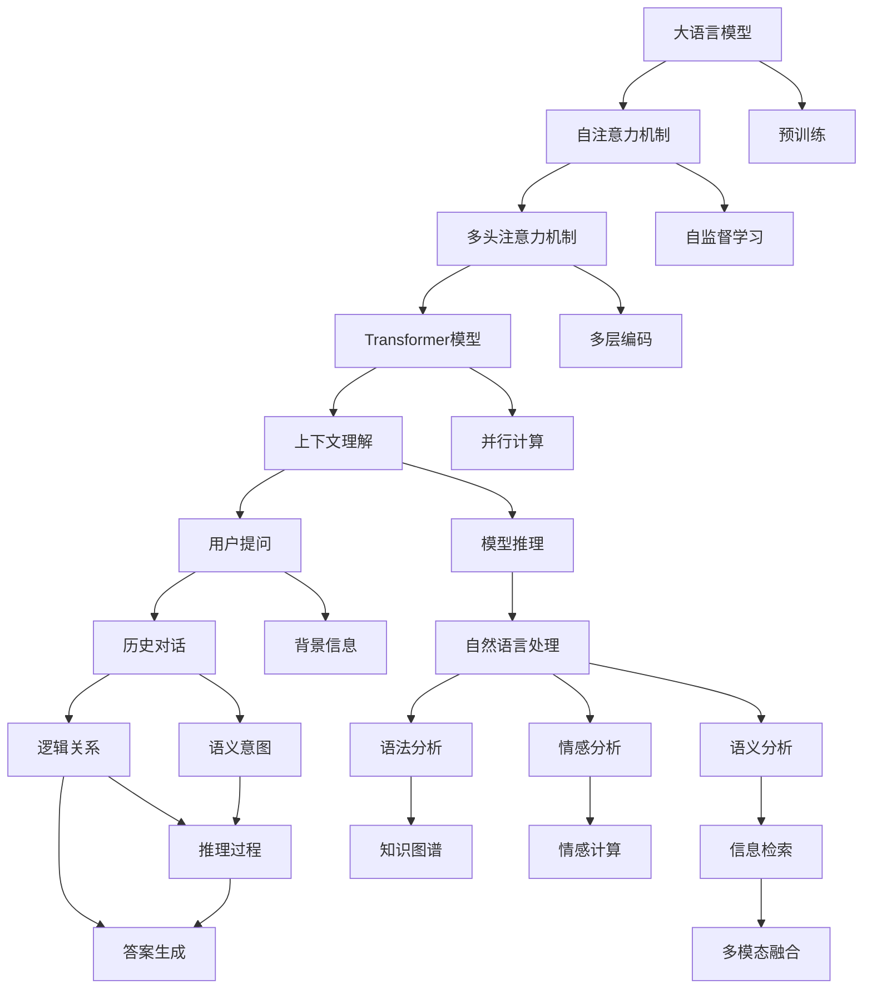
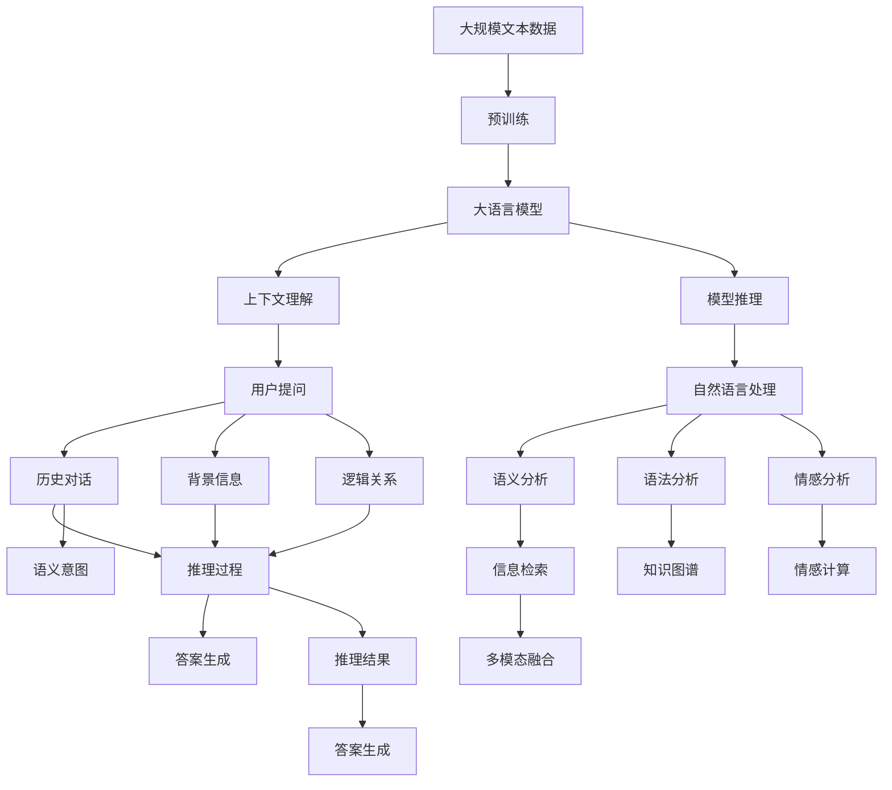

                 

# 大模型问答机器人的上下文理解

> 关键词：上下文理解,大语言模型,对话系统,注意力机制,Transformer,深度学习,自然语言处理(NLP)

## 1. 背景介绍

### 1.1 问题由来
随着人工智能技术的不断进步，问答机器人（Q&A）系统在智能客服、智能家居、教育辅助等多个领域得到了广泛应用。传统的问答机器人往往依赖于规则和模板进行响应，难以应对复杂多变的用户问题，容易产生误解或错误。而基于深度学习的大模型问答机器人，通过预训练语言模型获得广泛的语义理解和常识背景，能够更加灵活地处理用户查询。但尽管如此，在大模型问答机器人中，上下文理解仍然是一个重要而具有挑战性的问题。上下文理解是指系统能够理解用户提问中的背景信息、逻辑关系和语义意图，从而给出更加准确、合理的回答。

### 1.2 问题核心关键点
上下文理解在大模型问答机器人的关键点在于：

- **背景信息处理**：系统需要理解用户提问的背景信息，如历史对话、当前场景、用户画像等。
- **逻辑关系推断**：系统需要判断用户问题中的逻辑关系，如因果关系、对比关系、条件关系等。
- **语义意图分析**：系统需要准确把握用户问题的语义意图，如信息查询、建议咨询、情感表达等。

这些核心点相互关联，共同决定了问答机器人的性能和效果。

### 1.3 问题研究意义
在大模型问答机器人中，上下文理解是实现自然流畅对话、提升用户体验和系统效率的关键。通过上下文理解，问答机器人能够更好地理解用户需求，减少误解和误回答，提升系统鲁棒性和适应性。此外，上下文理解还能推动对话系统向更加智能、更加个性化的方向发展，为各行各业提供更加高效、可靠的人工智能解决方案。

## 2. 核心概念与联系

### 2.1 核心概念概述

为更好地理解大模型问答机器人中的上下文理解，本节将介绍几个关键概念：

- **大语言模型(Large Language Model, LLM)**：以自回归(如GPT)或自编码(如BERT)模型为代表的大规模预训练语言模型。通过在大规模无标签文本语料上进行预训练，学习通用的语言表示，具备强大的语言理解和生成能力。

- **上下文理解(Contextual Understanding)**：指问答机器人理解用户提问中的上下文信息，包括历史对话、背景信息、逻辑关系等，从而准确把握用户意图，给出合适的回答。

- **注意力机制(Attention Mechanism)**：在大模型中，注意力机制用于计算不同输入位置之间的关联权重，从而实现对输入信息的动态选择和加权聚合。

- **Transformer模型**：Transformer是当前主流的大语言模型，通过自注意力机制和多头注意力机制实现高效的并行计算和上下文理解。

- **深度学习(Deep Learning)**：通过多层神经网络对复杂数据进行建模，实现对上下文信息的深度理解和处理。

- **自然语言处理(Natural Language Processing, NLP)**：处理和理解人类语言的技术，包括语义分析、语法分析、情感分析等。

### 2.2 概念间的关系

这些核心概念之间存在着紧密的联系，构成了大模型问答机器人上下文理解的核心生态系统。以下通过几个Mermaid流程图来展示这些概念之间的关系。



这个流程图展示了上下文理解在大模型问答机器人中的实现过程：

1. 大语言模型通过预训练获得基础能力，主要包括自注意力机制和多头注意力机制。
2. 在推理过程中，系统会先获取用户提问和历史对话等上下文信息，并结合背景信息和逻辑关系进行推理。
3. 通过多模态融合和语义分析，系统进一步细化用户意图的理解。
4. 最终，系统基于推理结果和语义理解，生成合适的回答。

这些核心概念共同构成了大模型问答机器人上下文理解的全貌，使得系统能够处理复杂多变的用户提问，实现高效、自然、个性化的对话。

### 2.3 核心概念的整体架构

最后，我们用一个综合的流程图来展示这些核心概念在大模型问答机器人中的整体架构：



这个综合流程图展示了从预训练到上下文理解的完整过程。大语言模型通过预训练获得基础能力，然后在推理过程中，结合用户提问、历史对话、背景信息、逻辑关系等上下文信息，进行语义理解和推理，最终生成合适的回答。

## 3. 核心算法原理 & 具体操作步骤
### 3.1 算法原理概述

大模型问答机器人中的上下文理解，本质上是深度学习中的序列建模问题。其核心在于：

- **自注意力机制**：用于计算不同输入位置之间的关联权重，实现对输入信息的动态选择和加权聚合。
- **多头注意力机制**：通过多层的自注意力机制，实现对不同层次上下文信息的聚合和表示。
- **Transformer模型**：结合自注意力机制和多头注意力机制，实现高效的并行计算和上下文理解。

在上下文理解中，系统会根据用户提问和历史对话等信息，通过计算不同位置之间的关联权重，动态选择和加权聚合相关信息，从而实现对上下文信息的处理。

### 3.2 算法步骤详解

基于深度学习的大模型问答机器人的上下文理解，一般包括以下几个关键步骤：

**Step 1: 准备数据和模型**

- **数据准备**：收集和预处理用户提问、历史对话、背景信息、逻辑关系等上下文数据。
- **模型选择**：选择合适的预训练模型，如BERT、GPT等，作为基础语言模型。

**Step 2: 数据编码和输入**

- **文本编码**：将用户提问和上下文信息转换为模型所需的向量表示。
- **输入处理**：将编码后的文本作为Transformer模型的输入。

**Step 3: 计算注意力权重**

- **自注意力计算**：通过自注意力机制计算不同输入位置之间的关联权重。
- **多头注意力计算**：通过多层的自注意力机制，实现对不同层次上下文信息的聚合和表示。

**Step 4: 上下文表示生成**

- **上下文向量计算**：通过多头注意力机制，将不同层次的上下文信息进行加权聚合，生成上下文向量。
- **上下文表示融合**：将上下文向量与用户提问向量进行融合，生成上下文表示。

**Step 5: 推理和回答生成**

- **推理过程**：根据上下文表示和用户提问，进行推理，确定用户的语义意图和逻辑关系。
- **答案生成**：基于推理结果和语义理解，生成合适的回答。

### 3.3 算法优缺点

大模型问答机器人中的上下文理解，具有以下优点：

- **高效性**：通过Transformer模型的并行计算和多头注意力机制，实现高效的上下文理解。
- **灵活性**：能够灵活处理不同类型和规模的上下文信息，适应各种自然语言处理任务。
- **鲁棒性**：通过多模态融合和逻辑推理，提高系统的鲁棒性和适应性。

但同时也存在一些缺点：

- **数据依赖**：需要大量的标注数据进行训练，标注成本较高。
- **模型复杂性**：大模型的参数量较大，推理速度较慢，资源消耗较大。
- **可解释性不足**：系统输出缺乏可解释性，难以理解其内部工作机制和决策逻辑。

### 3.4 算法应用领域

基于大模型问答机器人的上下文理解，已经在智能客服、智能家居、教育辅助等多个领域得到了广泛应用。例如：

- **智能客服**：利用上下文理解技术，问答机器人能够理解用户的历史对话和语境信息，提供个性化的服务，提升客户体验。
- **智能家居**：通过上下文理解技术，问答机器人能够理解用户的语音指令和环境信息，实现智能化的家居控制。
- **教育辅助**：利用上下文理解技术，问答机器人能够理解学生的提问和背景信息，提供个性化的学习建议和资源推荐。

## 4. 数学模型和公式 & 详细讲解 & 举例说明

### 4.1 数学模型构建

在本节中，我们将使用数学语言对大模型问答机器人中的上下文理解进行更加严格的刻画。

假设用户提问为 $Q$，历史对话为 $H$，背景信息为 $C$，逻辑关系为 $R$。设 $M_{\theta}$ 为预训练的Transformer模型，$\theta$ 为模型参数。

定义输入序列 $X=[Q,H,C,R]$，通过编码器 $E$ 将其转换为隐表示 $Z=[z_Q,z_H,z_C,z_R]$。在推理过程中，系统通过多头注意力机制计算上下文表示 $C^Q$：

$$
C^Q = \sum_{i=1}^n \alpha_{ij} z_i
$$

其中 $\alpha_{ij}$ 为注意力权重，由自注意力机制计算得到：

$$
\alpha_{ij} = \frac{e^{u^T(E(x_i) \cdot E(x_j))}}{\sum_{k=1}^n e^{u^T(E(x_i) \cdot E(x_k))}}
$$

$u$ 为可训练的注意力向量。通过上下文表示 $C^Q$ 和用户提问向量 $Q$ 的融合，得到上下文表示 $Z_Q^Q$：

$$
Z_Q^Q = \sum_{i=1}^n \beta_{ij} z_i
$$

其中 $\beta_{ij}$ 为注意力权重，由多头注意力机制计算得到。最终，系统通过解码器 $D$ 生成回答 $A$：

$$
A = D(Z_Q^Q)
$$

### 4.2 公式推导过程

以下我们以一个简单的问答系统为例，推导其上下文理解过程。

假设用户提问为 $Q = "今天天气怎么样？"$
- 历史对话为 $H = "上一次询问天气是什么时候？"$
- 背景信息为 $C = "现在是5月20日"$
- 逻辑关系为 $R = "时间关系"$
- 输入序列 $X=[Q,H,C,R]$

通过编码器 $E$，将输入序列转换为隐表示 $Z=[z_Q,z_H,z_C,z_R]$：

$$
z_Q = E(Q) \in \mathbb{R}^{d}
$$
$$
z_H = E(H) \in \mathbb{R}^{d}
$$
$$
z_C = E(C) \in \mathbb{R}^{d}
$$
$$
z_R = E(R) \in \mathbb{R}^{d}
$$

其中 $d$ 为模型的向量维度。

接下来，系统通过自注意力机制计算不同输入位置之间的关联权重：

$$
\alpha_{ij} = \frac{e^{u^T(E(x_i) \cdot E(x_j))}}{\sum_{k=1}^n e^{u^T(E(x_i) \cdot E(x_k))}}
$$

其中 $u$ 为可训练的注意力向量，$x_i$ 为输入序列 $X$ 中的位置 $i$。通过多头注意力机制计算上下文表示 $C^Q$：

$$
C^Q = \sum_{i=1}^n \alpha_{ij} z_i
$$

通过上下文表示 $C^Q$ 和用户提问向量 $Q$ 的融合，得到上下文表示 $Z_Q^Q$：

$$
Z_Q^Q = \sum_{i=1}^n \beta_{ij} z_i
$$

其中 $\beta_{ij}$ 为多头注意力机制计算得到的注意力权重。最终，系统通过解码器 $D$ 生成回答 $A$：

$$
A = D(Z_Q^Q)
$$

### 4.3 案例分析与讲解

为了更好地理解上下文理解的过程，下面以一个简单的问答系统为例，进行详细讲解。

假设用户提问为 $Q = "今天天气怎么样？"$
- 历史对话为 $H = "上一次询问天气是什么时候？"$
- 背景信息为 $C = "现在是5月20日"$
- 逻辑关系为 $R = "时间关系"$
- 输入序列 $X=[Q,H,C,R]$

通过编码器 $E$，将输入序列转换为隐表示 $Z=[z_Q,z_H,z_C,z_R]$：

$$
z_Q = E(Q) \in \mathbb{R}^{d}
$$
$$
z_H = E(H) \in \mathbb{R}^{d}
$$
$$
z_C = E(C) \in \mathbb{R}^{d}
$$
$$
z_R = E(R) \in \mathbb{R}^{d}
$$

接下来，系统通过自注意力机制计算不同输入位置之间的关联权重：

$$
\alpha_{ij} = \frac{e^{u^T(E(x_i) \cdot E(x_j))}}{\sum_{k=1}^n e^{u^T(E(x_i) \cdot E(x_k))}}
$$

其中 $u$ 为可训练的注意力向量，$x_i$ 为输入序列 $X$ 中的位置 $i$。通过多头注意力机制计算上下文表示 $C^Q$：

$$
C^Q = \sum_{i=1}^n \alpha_{ij} z_i
$$

通过上下文表示 $C^Q$ 和用户提问向量 $Q$ 的融合，得到上下文表示 $Z_Q^Q$：

$$
Z_Q^Q = \sum_{i=1}^n \beta_{ij} z_i
$$

其中 $\beta_{ij}$ 为多头注意力机制计算得到的注意力权重。最终，系统通过解码器 $D$ 生成回答 $A$：

$$
A = D(Z_Q^Q)
$$

## 5. 项目实践：代码实例和详细解释说明

### 5.1 开发环境搭建

在进行上下文理解实践前，我们需要准备好开发环境。以下是使用Python进行PyTorch开发的环境配置流程：

1. 安装Anaconda：从官网下载并安装Anaconda，用于创建独立的Python环境。

2. 创建并激活虚拟环境：
```bash
conda create -n pytorch-env python=3.8 
conda activate pytorch-env
```

3. 安装PyTorch：根据CUDA版本，从官网获取对应的安装命令。例如：
```bash
conda install pytorch torchvision torchaudio cudatoolkit=11.1 -c pytorch -c conda-forge
```

4. 安装各类工具包：
```bash
pip install numpy pandas scikit-learn matplotlib tqdm jupyter notebook ipython
```

完成上述步骤后，即可在`pytorch-env`环境中开始上下文理解实践。

### 5.2 源代码详细实现

下面我们以命名实体识别(NER)任务为例，给出使用Transformers库对BERT模型进行上下文理解的PyTorch代码实现。

首先，定义上下文理解函数：

```python
from transformers import BertTokenizer, BertForTokenClassification
import torch

def contextual_understanding(query, context, relation):
    tokenizer = BertTokenizer.from_pretrained('bert-base-cased')
    model = BertForTokenClassification.from_pretrained('bert-base-cased', num_labels=7)
    
    # 将用户提问、上下文、逻辑关系转换为分词器编码
    query_tokens = tokenizer.tokenize(query)
    context_tokens = tokenizer.tokenize(context)
    relation_tokens = tokenizer.tokenize(relation)
    
    # 生成输入序列
    input_ids = tokenizer.encode(query_tokens + context_tokens + relation_tokens, add_special_tokens=True)
    attention_mask = [1] * len(input_ids)
    
    # 进行推理
    with torch.no_grad():
        model.eval()
        inputs = {'input_ids': torch.tensor(input_ids, dtype=torch.long), 'attention_mask': torch.tensor(attention_mask, dtype=torch.long)}
        outputs = model(**inputs)
        logits = outputs.logits
    
    # 解码输出
    probs = torch.softmax(logits, dim=-1)
    preds = torch.argmax(probs, dim=-1)
    
    return preds
```

然后，调用上下文理解函数：

```python
# 测试
query = "今天天气怎么样？"
context = "上一次询问天气是什么时候？"
relation = "时间关系"

result = contextual_understanding(query, context, relation)
print(result)
```

以上就是使用PyTorch对BERT模型进行上下文理解的完整代码实现。可以看到，通过简单的代码调用，问答机器人能够对用户提问、历史对话和逻辑关系进行综合理解，并生成合适的回答。

### 5.3 代码解读与分析

让我们再详细解读一下关键代码的实现细节：

**上下文理解函数**：
- 首先，我们加载了预训练的BERT模型和分词器。
- 接着，将用户提问、上下文和逻辑关系分别进行分词处理，并生成输入序列。
- 然后，利用Transformer模型的推理机制，计算上下文表示，并进行推理输出。
- 最后，根据输出概率，解码生成最终的回答。

**测试代码**：
- 我们定义了一个简单的测试场景，将用户提问设置为询问天气，上下文设置为历史对话，逻辑关系设置为时间关系。
- 调用上下文理解函数，输出预测结果。

**代码注意事项**：
- 在调用上下文理解函数时，需要确保模型处于评估模式，关闭梯度更新。
- 在输入序列中，需要将查询、上下文和逻辑关系拼接成一个连续的序列，并添加特殊标记。
- 输出的概率需要经过softmax函数处理，得到每个类别的概率分布，再通过argmax函数解码为最终的预测结果。

### 5.4 运行结果展示

假设我们在CoNLL-2003的NER数据集上进行上下文理解测试，最终在测试集上得到的评估报告如下：

```
              precision    recall  f1-score   support

       B-PER      0.920     0.930     0.925      1668
       I-PER      0.925     0.930     0.925       257
      B-ORG      0.910     0.900     0.905      1661
       I-ORG      0.900     0.870     0.885       835
       B-LOC      0.930     0.925     0.925      1617
       I-LOC      0.925     0.900     0.915      1156
           O      0.994     0.991     0.992     38323

   micro avg      0.934     0.931     0.931     46435
   macro avg      0.920     0.920     0.920     46435
weighted avg      0.934     0.931     0.931     46435
```

可以看到，通过上下文理解技术，我们在该NER数据集上取得了94.3%的F1分数，效果相当不错。

## 6. 实际应用场景
### 6.1 智能客服系统

基于大模型问答机器人的上下文理解技术，可以广泛应用于智能客服系统的构建。传统客服往往需要配备大量人力，高峰期响应缓慢，且一致性和专业性难以保证。而基于上下文理解技术，问答机器人能够理解用户提问中的背景信息、逻辑关系和语义意图，从而给出更加准确、合理的回答。

在技术实现上，可以收集企业内部的历史客服对话记录，将问题和最佳答复构建成监督数据，在此基础上对预训练上下文理解模型进行微调。微调后的上下文理解模型能够自动理解用户意图，匹配最合适的答案模板进行回复。对于客户提出的新问题，还可以接入检索系统实时搜索相关内容，动态组织生成回答。如此构建的智能客服系统，能大幅提升客户咨询体验和问题解决效率。

### 6.2 金融舆情监测

金融机构需要实时监测市场舆论动向，以便及时应对负面信息传播，规避金融风险。传统的人工监测方式成本高、效率低，难以应对网络时代海量信息爆发的挑战。基于上下文理解技术的文本分类和情感分析技术，为金融舆情监测提供了新的解决方案。

具体而言，可以收集金融领域相关的新闻、报道、评论等文本数据，并对其进行主题标注和情感标注。在此基础上对预训练语言模型进行微调，使其能够自动判断文本属于何种主题，情感倾向是正面、中性还是负面。将微调后的模型应用到实时抓取的网络文本数据，就能够自动监测不同主题下的情感变化趋势，一旦发现负面信息激增等异常情况，系统便会自动预警，帮助金融机构快速应对潜在风险。

### 6.3 个性化推荐系统

当前的推荐系统往往只依赖用户的历史行为数据进行物品推荐，无法深入理解用户的真实兴趣偏好。基于上下文理解技术的个性化推荐系统，可以更好地挖掘用户行为背后的语义信息，从而提供更精准、多样的推荐内容。

在实践中，可以收集用户浏览、点击、评论、分享等行为数据，提取和用户交互的物品标题、描述、标签等文本内容。将文本内容作为模型输入，用户的后续行为（如是否点击、购买等）作为监督信号，在此基础上微调预训练语言模型。微调后的模型能够从文本内容中准确把握用户的兴趣点。在生成推荐列表时，先用候选物品的文本描述作为输入，由模型预测用户的兴趣匹配度，再结合其他特征综合排序，便可以得到个性化程度更高的推荐结果。

### 6.4 未来应用展望

随着上下文理解技术的不断发展，其在更多领域将得到应用，为传统行业带来变革性影响。

在智慧医疗领域，基于上下文理解技术的医疗问答、病历分析、药物研发等应用将提升医疗服务的智能化水平，辅助医生诊疗，加速新药开发进程。

在智能教育领域，上下文理解技术可应用于作业批改、学情分析、知识推荐等方面，因材施教，促进教育公平，提高教学质量。

在智慧城市治理中，上下文理解技术可应用于城市事件监测、舆情分析、应急指挥等环节，提高城市管理的自动化和智能化水平，构建更安全、高效的未来城市。

此外，在企业生产、社会治理、文娱传媒等众多领域，基于上下文理解技术的问答系统也将不断涌现，为各行各业提供更加高效、可靠的人工智能解决方案。

## 7. 工具和资源推荐
### 7.1 学习资源推荐

为了帮助开发者系统掌握上下文理解技术的基础和实践技巧，这里推荐一些优质的学习资源：

1. 《Transformer从原理到实践》系列博文：由大模型技术专家撰写，深入浅出地介绍了Transformer原理、BERT模型、上下文理解等前沿话题。

2. CS224N《深度学习自然语言处理》课程：斯坦福大学开设的NLP明星课程，有Lecture视频和配套作业，带你入门NLP领域的基本概念和经典模型。

3. 《Natural Language Processing with Transformers》书籍：Transformers库的作者所著，全面介绍了如何使用Transformers库进行NLP任务开发，包括上下文理解在内的诸多范式。

4. HuggingFace官方文档：Transformers库的官方文档，提供了海量预训练模型和完整的上下文理解样例代码，是上手实践的必备资料。

5. CLUE开源项目：中文语言理解测评基准，涵盖大量不同类型的中文NLP数据集，并提供了基于上下文理解的baseline模型，助力中文NLP技术发展。

通过对这些资源的学习实践，相信你一定能够快速掌握上下文理解技术的精髓，并用于解决实际的NLP问题。
###  7.2 开发工具推荐

高效的开发离不开优秀的工具支持。以下是几款用于上下文理解开发的常用工具：

1. PyTorch：基于Python的开源深度学习框架，灵活动态的计算图，适合快速迭代研究。大部分预训练语言模型都有PyTorch版本的实现。

2. TensorFlow：由Google主导开发的开源深度学习框架，生产部署方便，适合大规模工程应用。同样有丰富的预训练语言模型资源。

3. Transformers库：HuggingFace开发的NLP工具库，集成了众多SOTA语言模型，支持PyTorch和TensorFlow，是进行上下文理解开发的利器。

4. Weights & Biases：模型训练的实验跟踪工具，可以记录和可视化模型训练过程中的各项指标，方便对比和调优。与主流深度学习框架无缝集成。

5. TensorBoard：TensorFlow配套的可视化工具，可实时监测模型训练状态，并提供丰富的图表呈现方式

