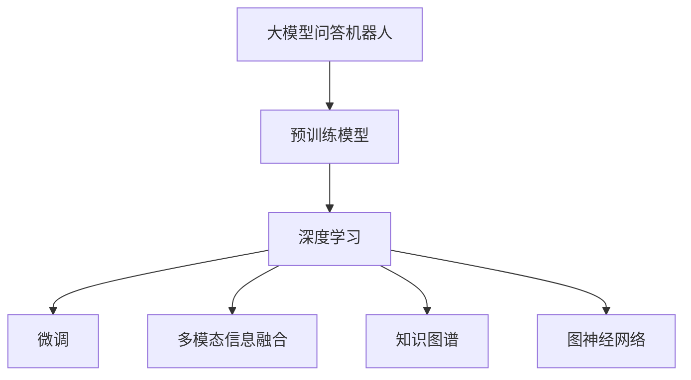
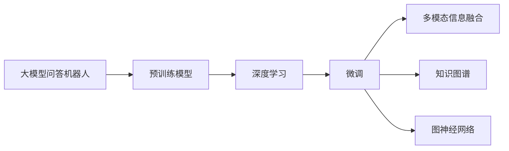
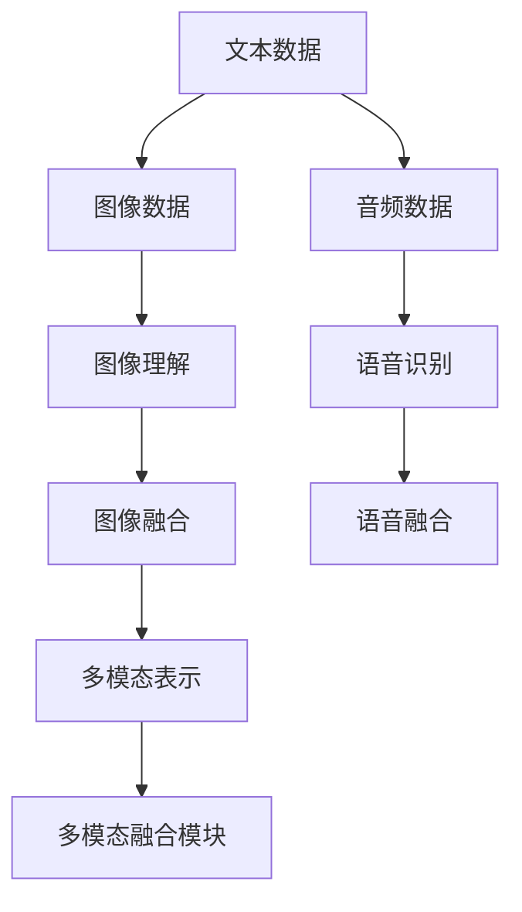
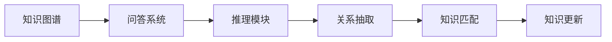
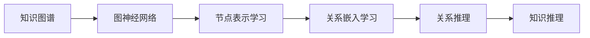
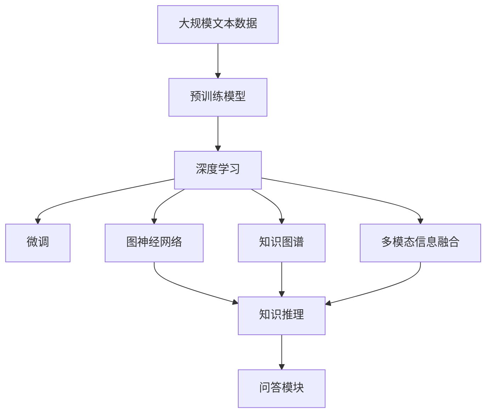

                 

# 大模型问答机器人的深度学习技术

> 关键词：大模型问答,深度学习,自然语言处理(NLP),预训练模型,多模态信息,知识图谱,图神经网络(GNN)

## 1. 背景介绍

### 1.1 问题由来
随着人工智能技术的快速发展，问答机器人(Chatbot)作为人工智能与自然语言处理(NLP)的重要应用，在智能客服、在线教育、智能家居等多个领域得到了广泛应用。传统问答系统主要基于规则或模板驱动，依赖于人工构建的问答规则库，难以覆盖多变的用户问题和场景。而基于深度学习的问答机器人，尤其是大模型问答机器人，通过在大规模无标签文本语料上进行预训练，学习到丰富的语言知识和语义表示，能够更灵活、高效地处理各种自然语言问答任务。

近年来，预训练大语言模型（如GPT、BERT等）在各种NLP任务上取得了卓越的性能，推动了问答机器人技术的快速发展。在GPT-3、T5等大模型的基础上，研究人员和开发者不断探索新的深度学习技术，提升问答机器人的智能水平和应用效果。

### 1.2 问题核心关键点
大模型问答机器人的核心在于如何通过深度学习技术，将预训练模型转换为适合问答任务的模型。通常包括以下几个步骤：

1. **预训练**：在大规模无标签文本语料上进行自监督学习，学习到丰富的语言知识。
2. **微调**：在问答任务的标注数据上进行有监督学习，优化模型在问答任务上的性能。
3. **多模态融合**：将文本、图像、音频等多模态信息进行融合，提升问答系统的理解能力。
4. **知识图谱整合**：将知识图谱与问答系统进行整合，增强对复杂问题的网络推理能力。
5. **图神经网络**：利用图神经网络处理问答任务中的复杂关系，提升系统的推理能力。

这些步骤共同构成了大模型问答机器人的核心技术体系，使问答系统能够更好地理解和回答用户问题。

### 1.3 问题研究意义
大模型问答机器人的深度学习技术，对于提升自然语言理解能力、优化用户交互体验、推动智能应用发展具有重要意义：

1. **提升理解能力**：通过大模型预训练和微调，问答系统能够理解更加复杂多变的语言表达，处理自然语言问答任务。
2. **优化用户体验**：问答系统能够根据用户的历史互动和语境信息，提供更加个性化、智能的回复，提升用户满意度。
3. **推动应用发展**：问答机器人在智能客服、智能家居、在线教育等领域的应用，能够提升服务效率，降低人工成本。
4. **促进知识共享**：问答系统可以将用户的疑问与知识图谱进行匹配，提供准确、权威的信息，促进知识的传播和共享。
5. **探索前沿技术**：问答系统是深度学习技术的重要应用场景，推动了多模态融合、知识图谱整合、图神经网络等前沿技术的发展。

## 2. 核心概念与联系

### 2.1 核心概念概述

为更好地理解大模型问答机器人的深度学习技术，本节将介绍几个密切相关的核心概念：

- **大模型问答机器人**：以大语言模型为基础，通过预训练和微调技术，实现自然语言问答任务的深度学习系统。
- **深度学习**：一种基于多层神经网络的学习方法，通过不断迭代优化网络参数，学习输入与输出之间的映射关系。
- **预训练模型**：通过在大规模无标签文本语料上自监督学习，学习到通用的语言知识和语义表示的模型。
- **多模态信息融合**：将文本、图像、音频等多模态信息进行融合，提升系统的理解能力和任务性能。
- **知识图谱**：由实体、关系、属性等信息构成的图形结构，用于存储和推理知识。
- **图神经网络**：利用图结构对节点和关系进行建模，学习节点之间的关系和特征，增强系统的推理能力。

这些核心概念之间的逻辑关系可以通过以下Mermaid流程图来展示：



这个流程图展示了大模型问答机器人的核心概念及其之间的关系：

1. 大模型问答机器人以预训练模型为基础。
2. 预训练模型通过深度学习技术学习语言知识。
3. 深度学习模型通过微调技术优化问答性能。
4. 多模态信息融合提升理解能力。
5. 知识图谱整合增强网络推理能力。
6. 图神经网络处理复杂关系，提升推理性能。

### 2.2 概念间的关系

这些核心概念之间存在着紧密的联系，形成了大模型问答机器人的完整技术体系。下面我们通过几个Mermaid流程图来展示这些概念之间的关系。

#### 2.2.1 问答机器人的学习范式



这个流程图展示了大模型问答机器人的学习范式，即通过预训练模型学习通用语言知识，通过微调技术优化问答性能，通过多模态信息融合和知识图谱整合增强系统的理解和推理能力。

#### 2.2.2 多模态融合与知识图谱



这个流程图展示了多模态信息融合的基本流程，即通过文本、图像、音频等多模态数据的处理和融合，构建多模态表示，用于提升问答系统的理解能力。

#### 2.2.3 知识图谱与问答系统



这个流程图展示了知识图谱与问答系统的关系，即通过知识图谱中的实体和关系进行推理，增强问答系统的网络推理能力。

#### 2.2.4 图神经网络



这个流程图展示了图神经网络的基本流程，即通过节点和关系的表示学习，增强系统的关系推理能力，用于处理复杂问答任务。

### 2.3 核心概念的整体架构

最后，我们用一个综合的流程图来展示这些核心概念在大模型问答机器人中的整体架构：



这个综合流程图展示了从预训练到微调，再到多模态融合、知识图谱整合和图神经网络处理，最终实现问答系统的完整过程。通过这些流程图，我们可以更清晰地理解大模型问答机器人的核心概念及其关系，为后续深入讨论具体的技术细节奠定基础。

## 3. 核心算法原理 & 具体操作步骤
### 3.1 算法原理概述

大模型问答机器人的深度学习技术，核心在于通过预训练模型学习通用语言知识，然后在问答任务的标注数据上进行微调，优化模型在问答任务上的性能。同时，通过多模态信息融合、知识图谱整合和图神经网络处理等技术，进一步提升问答系统的理解能力和推理能力。

具体而言，大模型问答机器人通常包含以下几个步骤：

1. **预训练**：在大规模无标签文本语料上进行自监督学习，学习到丰富的语言知识和语义表示。
2. **微调**：在问答任务的标注数据上进行有监督学习，优化模型在问答任务上的性能。
3. **多模态融合**：将文本、图像、音频等多模态信息进行融合，提升系统的理解能力和任务性能。
4. **知识图谱整合**：将知识图谱与问答系统进行整合，增强对复杂问题的网络推理能力。
5. **图神经网络**：利用图结构对节点和关系进行建模，学习节点之间的关系和特征，增强系统的推理能力。

### 3.2 算法步骤详解

#### 3.2.1 预训练

预训练是大模型问答机器人的基础步骤，通常采用自监督学习任务，在大规模无标签文本语料上进行预训练。预训练的目标是学习到通用的语言知识和语义表示，使得模型能够更好地理解自然语言。

预训练过程中，通常使用语言模型作为预训练任务。常见的预训练任务包括：

- **自回归语言模型**：通过预测下一词的概率分布，学习语言的知识。
- **自编码语言模型**：通过预测原始输入序列的概率分布，学习语言的语义表示。
- **掩码语言模型**：通过预测掩码位置的词，学习语言的知识。

预训练模型的参数通常在几亿甚至几十亿规模，可以通过大规模并行计算加速训练。预训练完成后，模型可以用于各种下游任务。

#### 3.2.2 微调

微调是优化问答系统性能的关键步骤，通常在问答任务的标注数据上进行有监督学习。微调的目标是使模型能够更好地理解问题和回答，适应特定任务的需求。

微调过程中，通常需要调整模型的输出层和损失函数，以匹配问答任务的标注数据。具体步骤如下：

1. **输出层设计**：根据问答任务的类型，设计合适的输出层结构。例如，对于分类任务，通常添加线性分类器；对于生成任务，通常使用语言模型的解码器。
2. **损失函数选择**：根据输出层的结构，选择合适的损失函数。例如，交叉熵损失函数适用于分类任务，均方误差损失函数适用于回归任务。
3. **优化器选择**：选择合适的优化算法及其参数，如Adam、SGD等，设置学习率、批大小、迭代轮数等。
4. **正则化技术**：应用正则化技术如L2正则、Dropout、Early Stopping等，防止模型过度适应小规模训练集。
5. **参数更新**：使用梯度下降等优化算法，更新模型参数，最小化损失函数，使得模型输出逼近真实标签。

#### 3.2.3 多模态融合

多模态融合是将文本、图像、音频等多模态信息进行融合，提升系统的理解能力和任务性能。多模态融合通常包括以下步骤：

1. **特征提取**：通过文本、图像、音频等不同模态的特征提取器，分别提取不同模态的特征向量。
2. **融合表示**：将不同模态的特征向量进行拼接或加权融合，构建多模态表示。
3. **联合训练**：将多模态表示与其他模态的数据联合训练，提升系统的综合理解能力。

#### 3.2.4 知识图谱整合

知识图谱整合是将知识图谱与问答系统进行整合，增强对复杂问题的网络推理能力。知识图谱整合通常包括以下步骤：

1. **知识图谱构建**：构建知识图谱，包括实体、关系、属性等信息。
2. **知识图谱嵌入**：将知识图谱中的实体和关系嵌入到向量空间，得到实体和关系的表示。
3. **图神经网络**：利用图神经网络处理知识图谱中的复杂关系，学习节点之间的关系和特征。
4. **知识推理**：通过知识图谱中的推理规则，对复杂问题进行推理，得到最终答案。

#### 3.2.5 图神经网络

图神经网络利用图结构对节点和关系进行建模，学习节点之间的关系和特征，增强系统的推理能力。图神经网络通常包括以下步骤：

1. **图结构构建**：构建知识图谱或其他图结构，表示节点和关系。
2. **节点表示学习**：通过神经网络学习节点表示，表示节点的特征。
3. **关系嵌入学习**：通过神经网络学习关系嵌入，表示节点之间的关系。
4. **关系推理**：通过神经网络进行关系推理，得到节点之间的关系和特征。

### 3.3 算法优缺点

大模型问答机器人的深度学习技术，具有以下优点：

1. **通用性**：大模型问答机器人可以处理各种自然语言问答任务，具有良好的通用性。
2. **可扩展性**：通过预训练和微调，大模型问答机器人可以适应不同的任务和领域，具有良好的可扩展性。
3. **鲁棒性**：大模型问答机器人通过多模态融合、知识图谱整合和图神经网络处理等技术，具备较强的鲁棒性，能够处理各种复杂多变的自然语言问题。
4. **高效性**：大模型问答机器人通过并行计算加速训练，具备较高的训练和推理效率。

同时，该方法也存在一些缺点：

1. **数据需求高**：大模型问答机器人需要大量标注数据进行微调，数据获取成本较高。
2. **模型复杂**：大模型问答机器人通常包含大量的神经网络参数，训练和推理复杂度较高。
3. **计算资源需求高**：大模型问答机器人需要大量的计算资源进行训练和推理，对硬件设备要求较高。
4. **解释性不足**：大模型问答机器人通常被视为"黑盒"模型，难以解释其内部工作机制和决策逻辑。

尽管存在这些局限性，但大模型问答机器人的深度学习技术在NLP领域的应用前景广阔，相信随着技术的发展，这些挑战终将得到解决。

### 3.4 算法应用领域

大模型问答机器人的深度学习技术，已经在智能客服、智能家居、在线教育等多个领域得到了广泛应用，具体包括：

1. **智能客服**：基于大模型问答机器人，构建智能客服系统，能够7x24小时不间断服务，快速响应客户咨询，提升客户满意度。
2. **智能家居**：通过大模型问答机器人，实现智能语音助手功能，能够理解用户指令，执行各种智能家居控制操作。
3. **在线教育**：基于大模型问答机器人，构建智能教学系统，能够解答学生问题，推荐学习资源，提升教学效果。
4. **智能医疗**：通过大模型问答机器人，构建智能医疗咨询系统，能够提供医疗建议，辅助医生诊疗，提升医疗服务水平。
5. **智能金融**：基于大模型问答机器人，构建智能金融咨询系统，能够提供金融建议，帮助用户进行投资理财。
6. **智能交通**：通过大模型问答机器人，实现智能交通导航系统，能够解答交通问题，提供实时交通信息。

此外，大模型问答机器人还在更多领域得到了创新性应用，如智能仓储、智能旅游、智能游戏等，为各行各业带来了新的变革。

## 4. 数学模型和公式 & 详细讲解 & 举例说明

### 4.1 数学模型构建

本节将使用数学语言对大模型问答机器人的深度学习技术进行更加严格的刻画。

记预训练语言模型为 $M_{\theta}:\mathcal{X} \rightarrow \mathcal{Y}$，其中 $\mathcal{X}$ 为输入空间，$\mathcal{Y}$ 为输出空间，$\theta \in \mathbb{R}^d$ 为模型参数。假设问答任务的训练集为 $D=\{(x_i,y_i)\}_{i=1}^N, x_i \in \mathcal{X}, y_i \in \mathcal{Y}$。

定义模型 $M_{\theta}$ 在输入 $x$ 上的损失函数为 $\ell(M_{\theta}(x),y)$，则在数据集 $D$ 上的经验风险为：

$$
\mathcal{L}(\theta) = \frac{1}{N} \sum_{i=1}^N \ell(M_{\theta}(x_i),y_i)
$$

微调的优化目标是最小化经验风险，即找到最优参数：

$$
\theta^* = \mathop{\arg\min}_{\theta} \mathcal{L}(\theta)
$$

在实践中，我们通常使用基于梯度的优化算法（如Adam、SGD等）来近似求解上述最优化问题。设 $\eta$ 为学习率，$\lambda$ 为正则化系数，则参数的更新公式为：

$$
\theta \leftarrow \theta - \eta \nabla_{\theta}\mathcal{L}(\theta) - \eta\lambda\theta
$$

其中 $\nabla_{\theta}\mathcal{L}(\theta)$ 为损失函数对参数 $\theta$ 的梯度，可通过反向传播算法高效计算。

### 4.2 公式推导过程

以下我们以问答任务为例，推导交叉熵损失函数及其梯度的计算公式。

假设模型 $M_{\theta}$ 在输入 $x$ 上的输出为 $\hat{y}=M_{\theta}(x) \in [0,1]$，表示样本属于正类的概率。真实标签 $y \in \{0,1\}$。则二分类交叉熵损失函数定义为：

$$
\ell(M_{\theta}(x),y) = -[y\log \hat{y} + (1-y)\log (1-\hat{y})]
$$

将其代入经验风险公式，得：

$$
\mathcal{L}(\theta) = -\frac{1}{N}\sum_{i=1}^N [y_i\log M_{\theta}(x_i)+(1-y_i)\log(1-M_{\theta}(x_i))]
$$

根据链式法则，损失函数对参数 $\theta_k$ 的梯度为：

$$
\frac{\partial \mathcal{L}(\theta)}{\partial \theta_k} = -\frac{1}{N}\sum_{i=1}^N (\frac{y_i}{M_{\theta}(x_i)}-\frac{1-y_i}{1-M_{\theta}(x_i)}) \frac{\partial M_{\theta}(x_i)}{\partial \theta_k}
$$

其中 $\frac{\partial M_{\theta}(x_i)}{\partial \theta_k}$ 可进一步递归展开，利用自动微分技术完成计算。

在得到损失函数的梯度后，即可带入参数更新公式，完成模型的迭代优化。重复上述过程直至收敛，最终得到适应问答任务的最优模型参数 $\theta^*$。

### 4.3 案例分析与讲解

以命名实体识别(NER)任务为例，展示基于大模型问答机器人的NER系统的构建和训练过程。

首先，定义NER任务的数据处理函数：

```python
from transformers import BertTokenizer
from torch.utils.data import Dataset
import torch

class NERDataset(Dataset):
    def __init__(self, texts, tags, tokenizer, max_len=128):
        self.texts = texts
        self.tags = tags
        self.tokenizer = tokenizer
        self.max_len = max_len
        
    def __len__(self):
        return len(self.texts)
    
    def __getitem__(self, item):
        text = self.texts[item]
        tags = self.tags[item]
        
        encoding = self.tokenizer(text, return_tensors='pt', max_length=self.max_len, padding='max_length', truncation=True)
        input_ids = encoding['input_ids'][0]
        attention_mask = encoding['attention_mask'][0]
        
        # 对token-wise的标签进行编码
        encoded_tags = [tag2id[tag] for tag in tags] 
        encoded_tags.extend([tag2id['O']] * (self.max_len - len(encoded_tags)))
        labels = torch.tensor(encoded_tags, dtype=torch.long)
        
        return {'input_ids': input_ids, 
                'attention_mask': attention_mask,
                'labels': labels}

# 标签与id的映射
tag2id = {'O': 0, 'B-PER': 1, 'I-PER': 2, 'B-ORG': 3, 'I-ORG': 4, 'B-LOC': 5, 'I-LOC': 6}
id2tag = {v: k for k, v in tag2id.items()}

# 创建dataset
tokenizer = BertTokenizer.from_pretrained('bert-base-cased')

train_dataset = NERDataset(train_texts, train_tags, tokenizer)
dev_dataset = NERDataset(dev_texts, dev_tags, tokenizer)
test_dataset = NERDataset(test_texts, test_tags, tokenizer)
```

然后，定义模型和优化器：

```python
from transformers import BertForTokenClassification, AdamW

model = BertForTokenClassification.from_pretrained('bert-base-cased', num_labels=len(tag2id))

optimizer = AdamW(model.parameters(), lr=2e-5)
```

接着，定义训练和评估函数：

```python
from torch.utils.data import DataLoader
from tqdm import tqdm
from sklearn.metrics import classification_report

device = torch.device('cuda') if torch.cuda.is_available() else torch.device('cpu')
model.to(device)

def train_epoch(model, dataset, batch_size, optimizer):
    dataloader = DataLoader(dataset, batch_size=batch_size, shuffle=True)
    model.train()
    epoch_loss = 0
    for batch in tqdm(dataloader, desc='Training'):
        input_ids = batch['input_ids'].to(device)
        attention_mask = batch['attention_mask'].to(device)
        labels = batch['labels'].to(device)
        model.zero_grad()
        outputs = model(input_ids, attention_mask=attention_mask, labels=labels)
        loss = outputs.loss
        epoch_loss += loss.item()
        loss.backward()
        optimizer.step()
    return epoch_loss / len(dataloader)

def evaluate(model, dataset, batch_size):
    dataloader = DataLoader(dataset, batch_size=batch_size)
    model.eval()
    preds, labels = [], []
    with torch.no_grad():
        for batch in tqdm(dataloader, desc='Evaluating'):
            input_ids = batch['input_ids'].to(device)
            attention_mask = batch['attention_mask'].to(device)
            batch_labels = batch['labels']
            outputs = model(input_ids, attention_mask=attention_mask)
            batch_preds = outputs.logits.argmax(dim=2).to('cpu').tolist()
            batch_labels = batch_labels.to('cpu').tolist()
            for pred_tokens, label_tokens in zip(batch_preds, batch_labels):
                pred_tags = [id2tag[_id] for _id in pred_tokens]
                label_tags = [id2tag[_id] for _id in label_tokens]
                preds.append(pred_tags[:len(label_tags)])
                labels.append(label_tags)
                
    print(classification_report(labels, preds))
```

最后，启动训练流程并在测试集上评估：

```python
epochs = 5
batch_size = 16

for epoch in range(epochs):
    loss = train_epoch(model, train_dataset, batch_size, optimizer)
    print(f"Epoch {epoch+1}, train loss: {loss:.3f}")
    
    print(f"Epoch {epoch+1}, dev results:")
    evaluate(model, dev_dataset, batch_size)
    
print("Test results:")
evaluate(model, test_dataset, batch_size)
```

以上就是使用PyTorch对BERT进行命名实体识别任务微调的完整代码实现。可以看到，得益于Transformers库的强大封装，我们可以用相对简洁的代码完成BERT模型的加载和微调。

## 5. 项目实践：代码实例和详细解释说明
### 5.1 开发环境搭建

在进行微调实践前，我们需要准备好开发环境。以下是使用Python进行PyTorch开发的环境配置流程：

1. 安装Anaconda：从官网下载并安装Anaconda，用于创建独立的Python环境。

2. 创建并激活虚拟环境：
```bash
conda create -n pytorch-env python=3.8 
conda activate pytorch-env
```

3. 安装PyTorch：根据CUDA版本，从官网获取对应的安装命令。例如：
```bash
conda install pytorch torchvision torchaudio cudatoolkit=11.1 -c pytorch -c conda-forge
```

4. 安装Transformers库：
```bash
pip install transformers
```

5. 安装各类工具包：
```bash
pip install numpy pandas scikit-learn matplotlib tqdm jupyter notebook ipython
```

完成上述步骤后，即可在`pytorch-env`环境中开始微调实践。

### 5.2 源代码详细实现

下面我们以命名实体识别(NER)任务为例，给出使用Transformers库对BERT模型进行微调的PyTorch代码实现。

首先，定义NER任务的数据处理函数：

```python
from transformers import BertTokenizer
from torch.utils.data import Dataset
import torch

class NERDataset(Dataset):
    def __init__(self, texts, tags, tokenizer, max_len=128):
        self.texts = texts
        self.tags = tags
        self.tokenizer = tokenizer
        self.max_len = max_len
        
    def __len__(self):
        return len(self.texts)
    
    def __getitem__(self, item):
        text = self.texts[item]
        tags = self.tags[item]
        
        encoding = self.tokenizer(text, return_tensors='pt', max_length=self.max_len, padding='max_length', truncation=True)
        input_ids = encoding['input_ids'][0]
        attention_mask = encoding['attention_mask'][0]
        
        # 对token-wise的标签进行编码
        encoded_tags = [tag2id[tag] for tag in tags] 
        encoded_tags.extend([tag2id['O']] * (self.max_len - len(encoded_tags)))
        labels = torch.tensor(encoded_tags,

