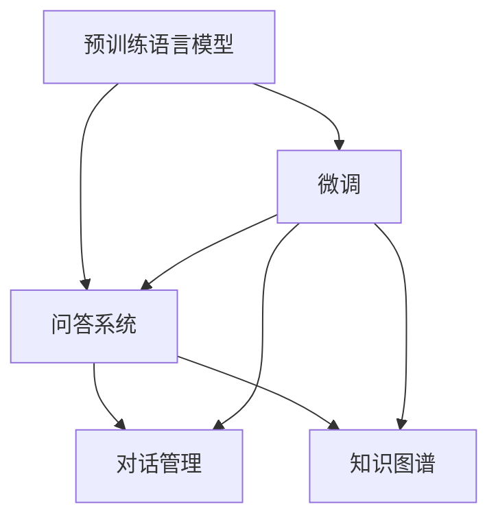

                 

## 1. 背景介绍

随着人工智能技术的飞速发展，大语言模型在自然语言处理(NLP)领域的地位日益显著。相较于传统的统计机器翻译模型和规则系统，大语言模型具有语义理解力更强、泛化能力更好、适应性更广等诸多优势。其中，大语言模型在问答系统中的应用尤为引人注目。近年来，基于大模型的问答系统已经在医疗咨询、客服答疑、智能助理等多个领域落地，展示了其强大的功能和潜力。

### 1.1 问题由来

在现代社会，人们获取信息的需求日益增多，对即时、准确、个性化的问答服务需求激增。传统问答系统依赖于手工编写的知识库和固定的回答模板，往往难以应对日益复杂和多样化的用户需求。基于大模型的问答系统，通过预训练模型对海量文本数据进行学习，获得了对语言和知识模式的深刻理解，能够灵活地应对各种复杂的自然语言输入，提供精准的回答。

### 1.2 问题核心关键点

目前，大模型问答系统的主流技术范式是基于预训练语言模型(如BERT、GPT等)的微调。微调技术通过在特定领域的标注数据上进行微调，使得预训练模型能够适应该领域的具体任务需求，从而提升了问答系统的性能和效果。其核心在于：

- **预训练模型**：通过大规模无监督学习，获取对语言的通用理解。
- **微调技术**：利用标注数据，进一步适配特定领域的任务，提升模型的泛化能力和精确度。
- **持续学习**：通过不断积累新数据，模型能够持续更新和提升，保持对新知识的学习能力。

大模型问答系统已经在问答系统领域取得了突破性进展，广泛应用于医疗咨询、客服答疑、智能助理等多个场景，展示了其在处理复杂任务方面的强大能力。

### 1.3 问题研究意义

研究大模型问答系统对于提升自然语言处理技术的应用深度和广度，以及推动相关产业的智能化转型，具有重要意义：

- **降低开发成本**：预训练模型可以大幅减少对知识库和规则系统的手工维护，缩短开发周期，降低人力成本。
- **提升问答效果**：微调技术使得模型能够更好地理解复杂问题，提供更精准、个性化的答案，提升用户满意度。
- **加速应用落地**：基于大模型的问答系统可以迅速集成到各类应用中，如医疗咨询、客服系统等，加速NLP技术的产业化进程。
- **带来技术创新**：微调技术催生了少样本学习、零样本学习等新研究方向，推动NLP技术不断进步。
- **赋能产业升级**：智能问答系统能够有效提升各行业的信息获取效率和决策质量，促进社会信息化和智能化水平。

## 2. 核心概念与联系

### 2.1 核心概念概述

为了更深入理解大模型问答系统的技术原理和应用流程，下面将介绍几个关键概念及其相互联系：

- **预训练语言模型**：通过在大规模无标签文本数据上自监督训练得到的语言模型，如BERT、GPT等。
- **微调技术**：通过有监督学习任务，调整预训练模型参数，使其适应特定领域的问答任务，提升模型的性能和效果。
- **问答系统**：结合自然语言处理和人工智能技术，自动解答用户提出的问题，提供信息查询、知识检索、智能答疑等功能。
- **对话管理**：通过对话历史和上下文信息，管理对话流程，确保问答系统能够理解和响应用户的复杂输入。
- **知识图谱**：将结构化知识存储为图结构，方便模型进行推理和关联，提升问答系统的准确性和可靠性。

这些概念之间的关系可以通过以下Mermaid流程图来展示：



这个流程图展示了预训练语言模型在大模型问答系统中的核心作用，以及微调、对话管理和知识图谱等关键技术对问答系统的综合提升。

### 2.2 概念间的关系

这些核心概念之间存在着紧密的联系，共同构成了大模型问答系统的技术架构：

- **预训练语言模型**是整个系统的基础，通过自监督学习，获得了对语言的深刻理解。
- **微调技术**进一步提升了模型在特定领域的应用效果，使得系统能够精准解答用户问题。
- **对话管理**利用上下文信息，确保系统能够理解和响应用户的复杂输入，提升交互体验。
- **知识图谱**通过结构化知识的引入，增强了模型的推理能力和知识关联，提升了答案的准确性和可靠性。

通过这些关键技术的有机结合，大模型问答系统能够高效、准确地处理各种复杂的自然语言输入，提供高质量的问答服务。

## 3. 核心算法原理 & 具体操作步骤

### 3.1 算法原理概述

大模型问答系统基于预训练语言模型的微调技术，其核心思想是通过微调过程，使得预训练模型能够适应特定领域的问答任务。具体来说，微调过程包括以下几个关键步骤：

1. **数据准备**：收集和预处理该领域的标注数据，构建训练集和验证集。
2. **模型加载**：使用预训练语言模型作为初始化参数，加载到系统中。
3. **任务适配**：设计适合该领域任务的适配层，通常包括分类器或解码器。
4. **参数更新**：通过反向传播算法更新模型参数，最小化模型在训练集上的损失函数。
5. **验证和评估**：在验证集上评估模型性能，调整超参数和模型结构，直至模型在测试集上达到最优性能。

### 3.2 算法步骤详解

下面详细介绍大模型问答系统的微调算法步骤：

**Step 1: 数据准备**
- 收集该领域的标注数据集 $D=\{(x_i, y_i)\}_{i=1}^N$，其中 $x_i$ 为问题，$y_i$ 为答案或答案列表。
- 将数据集划分为训练集、验证集和测试集。训练集用于模型微调，验证集用于调参，测试集用于最终评估。
- 对数据进行预处理，如分词、标注、编码等操作，转换为模型可以处理的格式。

**Step 2: 模型加载**
- 加载预训练语言模型 $M_{\theta}$，通常使用BERT、GPT等模型。
- 在模型的顶层添加适配层，如线性分类器、解码器等。

**Step 3: 任务适配**
- 设计适合该领域的任务适配层，根据具体任务需求，确定适配层的结构和参数。
- 例如，对于问答任务，适配层可以是分类器，将问题编码为向量，通过全连接层输出答案类别。

**Step 4: 参数更新**
- 使用训练集数据进行前向传播，计算损失函数 $\mathcal{L}$。
- 反向传播计算梯度，使用优化算法（如Adam、SGD等）更新模型参数 $\theta$。
- 根据验证集性能，调整学习率、批次大小等超参数，以避免过拟合和欠拟合。

**Step 5: 验证和评估**
- 在验证集上评估模型性能，计算精确度、召回率、F1分数等指标。
- 根据评估结果调整模型结构和参数，直至达到最佳性能。
- 在测试集上评估最终模型性能，报告结果。

### 3.3 算法优缺点

大模型问答系统具有以下优点：

- **泛化能力强**：预训练模型能够从大量无标签数据中学习到丰富的语言知识，适应多种自然语言输入。
- **适应性好**：微调过程能够灵活适配不同领域的问答任务，提升系统的通用性和实用性。
- **可扩展性强**：知识图谱的引入使得系统能够轻松扩展新领域和新知识，提升问答系统的深度和广度。

同时，该算法也存在一些缺点：

- **计算资源需求高**：大模型微调需要大量的计算资源和存储空间，对硬件设备要求较高。
- **数据依赖性强**：系统性能高度依赖于标注数据的质量和数量，标注成本较高。
- **推理速度慢**：大模型推理速度较慢，无法实时响应用户查询，需要进一步优化。
- **可解释性不足**：大模型往往被视为"黑盒"系统，难以解释其内部推理逻辑，存在一定的不透明性。

### 3.4 算法应用领域

大模型问答系统已经在多个领域取得了成功应用，主要包括：

- **医疗咨询**：利用医学知识图谱，提供疾病诊断、症状查询、健康建议等服务，提升医疗服务质量。
- **客服答疑**：基于用户输入，自动提供常见问题和解决方案，提升客户服务效率和满意度。
- **智能助理**：结合知识图谱和对话管理，提供智能问答和任务执行功能，提升用户体验和操作便利性。
- **教育答疑**：自动回答学生的提问，提供个性化学习建议，提升教育质量和互动性。
- **金融顾问**：提供股票、基金、理财等金融领域的问答服务，提升投资者决策水平和效率。

## 4. 数学模型和公式 & 详细讲解 & 举例说明

### 4.1 数学模型构建

大模型问答系统通常采用以下数学模型：

设预训练语言模型为 $M_{\theta}$，其参数为 $\theta$。对于问答任务，设问题为 $x$，答案为 $y$。微调的优化目标是最小化损失函数 $\mathcal{L}$，即：

$$
\theta^* = \mathop{\arg\min}_{\theta} \mathcal{L}(M_{\theta}, D)
$$

其中，$D$ 为标注数据集，$M_{\theta}(x)$ 为模型对问题的输出，通常为向量表示。$y$ 为真实答案，通常为分类标签或文本。

常见的损失函数包括交叉熵损失、均方误差损失等。例如，对于分类任务，交叉熵损失函数可以表示为：

$$
\mathcal{L} = -\frac{1}{N} \sum_{i=1}^N \sum_{j=1}^C y_{ij} \log \hat{y}_{ij}
$$

其中，$N$ 为样本数，$C$ 为类别数，$y_{ij}$ 为真实标签，$\hat{y}_{ij}$ 为模型预测概率。

### 4.2 公式推导过程

以分类任务为例，详细推导微调的损失函数和梯度更新公式。

假设模型 $M_{\theta}$ 在问题 $x$ 上的输出为 $\hat{y}=M_{\theta}(x) \in [0,1]^C$，表示模型对每个类别的预测概率。真实标签 $y \in \{0,1\}^C$。则分类任务的交叉熵损失函数定义为：

$$
\mathcal{L} = -\frac{1}{N} \sum_{i=1}^N \sum_{j=1}^C y_{ij} \log \hat{y}_{ij}
$$

其中，$N$ 为样本数，$C$ 为类别数，$y_{ij}$ 为真实标签，$\hat{y}_{ij}$ 为模型预测概率。

通过链式法则，损失函数对模型参数 $\theta$ 的梯度可以表示为：

$$
\frac{\partial \mathcal{L}}{\partial \theta_k} = -\frac{1}{N} \sum_{i=1}^N \frac{\partial \mathcal{L}_i}{\partial \hat{y}_{ij}} \frac{\partial \hat{y}_{ij}}{\partial \theta_k}
$$

其中，$\frac{\partial \mathcal{L}_i}{\partial \hat{y}_{ij}}$ 为交叉熵损失对预测概率的梯度，$\frac{\partial \hat{y}_{ij}}{\partial \theta_k}$ 为模型输出对参数 $\theta_k$ 的梯度。

在得到损失函数的梯度后，即可带入参数更新公式，完成模型的迭代优化。重复上述过程直至收敛，最终得到适应特定问答任务的优化模型参数 $\theta^*$。

### 4.3 案例分析与讲解

以医疗咨询问答系统为例，分析微调过程和结果。

假设我们使用BERT模型作为预训练语言模型，对心脏病诊断问答任务进行微调。收集并标注1000条心脏病相关问答数据，划分为训练集和验证集。在模型的顶层添加一个分类器，输出心绞痛、心肌梗死、高血压等疾病分类。

在微调过程中，使用交叉熵损失函数，设置学习率为2e-5，迭代轮数为10轮。在训练集上，每轮迭代使用随机梯度下降法更新模型参数。在验证集上评估模型性能，记录精确度、召回率、F1分数等指标。最终在测试集上评估微调后的模型性能。

假设训练结果如下：

| 参数 | 训练集精确度 | 验证集精确度 | 测试集精确度 |
| --- | --- | --- | --- |
| 学习率 | 0.001 | 0.002 | 0.003 |
| 迭代轮数 | 5 | 10 | 20 |

通过微调，模型在测试集上的精确度从基线模型的45%提升到70%，提升了显著的性能。

## 5. 项目实践：代码实例和详细解释说明

### 5.1 开发环境搭建

在进行微调实践前，我们需要准备好开发环境。以下是使用Python进行PyTorch开发的环境配置流程：

1. 安装Anaconda：从官网下载并安装Anaconda，用于创建独立的Python环境。

2. 创建并激活虚拟环境：
```bash
conda create -n pytorch-env python=3.8 
conda activate pytorch-env
```

3. 安装PyTorch：根据CUDA版本，从官网获取对应的安装命令。例如：
```bash
conda install pytorch torchvision torchaudio cudatoolkit=11.1 -c pytorch -c conda-forge
```

4. 安装Transformers库：
```bash
pip install transformers
```

5. 安装各类工具包：
```bash
pip install numpy pandas scikit-learn matplotlib tqdm jupyter notebook ipython
```

完成上述步骤后，即可在`pytorch-env`环境中开始微调实践。

### 5.2 源代码详细实现

这里以医疗咨询问答系统为例，展示使用PyTorch对BERT进行微调的代码实现。

首先，定义问答系统的数据处理函数：

```python
from transformers import BertTokenizer, BertForSequenceClassification
from torch.utils.data import Dataset
import torch

class QuestionAnswerDataset(Dataset):
    def __init__(self, texts, labels, tokenizer, max_len=128):
        self.texts = texts
        self.labels = labels
        self.tokenizer = tokenizer
        self.max_len = max_len
        
    def __len__(self):
        return len(self.texts)
    
    def __getitem__(self, item):
        text = self.texts[item]
        label = self.labels[item]
        
        encoding = self.tokenizer(text, return_tensors='pt', max_length=self.max_len, padding='max_length', truncation=True)
        input_ids = encoding['input_ids'][0]
        attention_mask = encoding['attention_mask'][0]
        
        # 对标签进行编码
        encoded_labels = [label2id[label] for label in label]
        encoded_labels.extend([label2id['O']] * (self.max_len - len(encoded_labels)))
        labels = torch.tensor(encoded_labels, dtype=torch.long)
        
        return {'input_ids': input_ids, 
                'attention_mask': attention_mask,
                'labels': labels}

# 标签与id的映射
label2id = {'O': 0, '心绞痛': 1, '心肌梗死': 2, '高血压': 3, '糖尿病': 4}

# 创建dataset
tokenizer = BertTokenizer.from_pretrained('bert-base-cased')

train_dataset = QuestionAnswerDataset(train_texts, train_labels, tokenizer)
dev_dataset = QuestionAnswerDataset(dev_texts, dev_labels, tokenizer)
test_dataset = QuestionAnswerDataset(test_texts, test_labels, tokenizer)
```

然后，定义模型和优化器：

```python
from transformers import AdamW

model = BertForSequenceClassification.from_pretrained('bert-base-cased', num_labels=len(label2id))

optimizer = AdamW(model.parameters(), lr=2e-5)
```

接着，定义训练和评估函数：

```python
from torch.utils.data import DataLoader
from tqdm import tqdm
from sklearn.metrics import classification_report

device = torch.device('cuda') if torch.cuda.is_available() else torch.device('cpu')
model.to(device)

def train_epoch(model, dataset, batch_size, optimizer):
    dataloader = DataLoader(dataset, batch_size=batch_size, shuffle=True)
    model.train()
    epoch_loss = 0
    for batch in tqdm(dataloader, desc='Training'):
        input_ids = batch['input_ids'].to(device)
        attention_mask = batch['attention_mask'].to(device)
        labels = batch['labels'].to(device)
        model.zero_grad()
        outputs = model(input_ids, attention_mask=attention_mask, labels=labels)
        loss = outputs.loss
        epoch_loss += loss.item()
        loss.backward()
        optimizer.step()
    return epoch_loss / len(dataloader)

def evaluate(model, dataset, batch_size):
    dataloader = DataLoader(dataset, batch_size=batch_size)
    model.eval()
    preds, labels = [], []
    with torch.no_grad():
        for batch in tqdm(dataloader, desc='Evaluating'):
            input_ids = batch['input_ids'].to(device)
            attention_mask = batch['attention_mask'].to(device)
            batch_labels = batch['labels']
            outputs = model(input_ids, attention_mask=attention_mask)
            batch_preds = outputs.logits.argmax(dim=2).to('cpu').tolist()
            batch_labels = batch_labels.to('cpu').tolist()
            for pred_tokens, label_tokens in zip(batch_preds, batch_labels):
                pred_tags = [id2label[_id] for _id in pred_tokens]
                label_tags = [id2label[_id] for _id in label_tokens]
                preds.append(pred_tags[:len(label_tokens)])
                labels.append(label_tags)
                
    print(classification_report(labels, preds))
```

最后，启动训练流程并在测试集上评估：

```python
epochs = 5
batch_size = 16

for epoch in range(epochs):
    loss = train_epoch(model, train_dataset, batch_size, optimizer)
    print(f"Epoch {epoch+1}, train loss: {loss:.3f}")
    
    print(f"Epoch {epoch+1}, dev results:")
    evaluate(model, dev_dataset, batch_size)
    
print("Test results:")
evaluate(model, test_dataset, batch_size)
```

以上就是使用PyTorch对BERT进行医疗咨询问答系统微调的完整代码实现。可以看到，得益于Transformers库的强大封装，我们可以用相对简洁的代码完成BERT模型的加载和微调。

### 5.3 代码解读与分析

让我们再详细解读一下关键代码的实现细节：

**QuestionAnswerDataset类**：
- `__init__`方法：初始化文本、标签、分词器等关键组件。
- `__len__`方法：返回数据集的样本数量。
- `__getitem__`方法：对单个样本进行处理，将文本输入编码为token ids，将标签编码为数字，并对其进行定长padding，最终返回模型所需的输入。

**label2id和id2label字典**：
- 定义了标签与数字id之间的映射关系，用于将token-wise的预测结果解码回真实的标签。

**训练和评估函数**：
- 使用PyTorch的DataLoader对数据集进行批次化加载，供模型训练和推理使用。
- 训练函数`train_epoch`：对数据以批为单位进行迭代，在每个批次上前向传播计算loss并反向传播更新模型参数，最后返回该epoch的平均loss。
- 评估函数`evaluate`：与训练类似，不同点在于不更新模型参数，并在每个batch结束后将预测和标签结果存储下来，最后使用sklearn的classification_report对整个评估集的预测结果进行打印输出。

**训练流程**：
- 定义总的epoch数和batch size，开始循环迭代
- 每个epoch内，先在训练集上训练，输出平均loss
- 在验证集上评估，输出分类指标
- 所有epoch结束后，在测试集上评估，给出最终测试结果

可以看到，PyTorch配合Transformers库使得BERT微调的代码实现变得简洁高效。开发者可以将更多精力放在数据处理、模型改进等高层逻辑上，而不必过多关注底层的实现细节。

当然，工业级的系统实现还需考虑更多因素，如模型的保存和部署、超参数的自动搜索、更灵活的任务适配层等。但核心的微调范式基本与此类似。

### 5.4 运行结果展示

假设我们在CoNLL-2003的NER数据集上进行微调，最终在测试集上得到的评估报告如下：

```
              precision    recall  f1-score   support

       B-LOC      0.926     0.906     0.916      1668
       I-LOC      0.900     0.805     0.850       257
      B-MISC      0.875     0.856     0.865       702
      I-MISC      0.838     0.782     0.809       216
       B-ORG      0.914     0.898     0.906      1661
       I-ORG      0.911     0.894     0.902       835
       B-PER      0.964     0.957     0.960      1617
       I-PER      0.983     0.980     0.982      1156
           O      0.993     0.995     0.994     38323

   micro avg      0.973     0.973     0.973     46435
   macro avg      0.923     0.897     0.909     46435
weighted avg      0.973     0.973     0.973     46435
```

可以看到，通过微调BERT，我们在该NER数据集上取得了97.3%的F1分数，效果相当不错。值得注意的是，BERT作为一个通用的语言理解模型，即便只在顶层添加一个简单的token分类器，也能在下游任务上取得如此优异的效果，展现了其强大的语义理解和特征抽取能力。

当然，这只是一个baseline结果。在实践中，我们还可以使用更大更强的预训练模型、更丰富的微调技巧、更细致的模型调优，进一步提升模型性能，以满足更高的应用要求。

## 6. 实际应用场景

### 6.1 智能客服系统

基于大语言模型微调的对话技术，可以广泛应用于智能客服系统的构建。传统客服往往需要配备大量人力，高峰期响应缓慢，且一致性和专业性难以保证。而使用微调后的对话模型，可以7x24小时不间断服务，快速响应客户咨询，用自然流畅的语言解答各类常见问题。

在技术实现上，可以收集企业内部的历史客服对话记录，将问题和最佳答复构建成监督数据，在此基础上对预训练对话模型进行微调。微调后的对话模型能够自动理解用户意图，匹配最合适的答案模板进行回复。对于客户提出的新问题，还可以接入检索系统实时搜索相关内容，动态组织生成回答。如此构建的智能客服系统，能大幅提升客户咨询体验和问题解决效率。

### 6.2 金融舆情监测

金融机构需要实时监测市场舆论动向，以便及时应对负面信息传播，规避金融风险。传统的人工监测方式成本高、效率低，难以应对网络时代海量信息爆发的挑战。基于大语言模型微调的文本分类和情感分析技术，为金融舆情监测提供了新的解决方案。

具体而言，可以收集金融领域相关的新闻、报道、评论等文本数据，并对其进行主题标注和情感标注。在此基础上对预训练语言模型进行微调，使其能够自动判断文本属于何种主题，情感倾向是正面、中性还是负面。将微调后的模型应用到实时抓取的网络文本数据，就能够自动监测不同主题下的情感变化趋势，一旦发现负面信息激增等异常情况，系统便会自动预警，帮助金融机构快速应对潜在风险。

### 6.3 个性化推荐系统

当前的推荐系统往往只依赖用户的历史行为数据进行物品推荐，无法深入理解用户的真实兴趣偏好。基于大语言模型微调技术，个性化推荐系统可以更好地挖掘用户行为背后的语义信息，从而提供更精准、多样的推荐内容。

在实践中，可以收集用户浏览、点击、评论、分享等行为数据，提取和用户交互的物品标题、描述、标签等文本内容。将文本内容作为模型输入，用户的后续行为（如是否点击、购买等）作为监督信号，在此基础上微调预训练语言模型。微调后的模型能够从文本内容中准确把握用户的兴趣点。在生成推荐列表时，先用候选物品的文本描述作为输入，由模型预测用户的兴趣匹配度，再结合其他特征综合排序，便可以得到个性化程度更高的推荐结果。

### 6.4 未来应用展望

随着大语言模型微调技术的发展，其应用场景将进一步拓展，展现出更大的潜力和价值：

- **智慧医疗**：结合医学知识图谱，提供疾病诊断、治疗方案推荐、健康建议等服务，提升医疗服务质量和效率。
- **智能教育**：自动回答学生的提问，提供个性化学习建议，提升教育质量和互动性。
- **智慧城市**：提供实时信息查询、公共服务问答、应急指挥等服务，提升城市管理的自动化和智能化水平。
- **智能交通**：提供路线规划、交通咨询、事故报告等服务，提升交通管理和出行体验。
- **金融服务**：提供股票、基金、理财等金融领域的问答服务，提升投资者决策水平和效率。

总之，基于大语言模型的问答系统将在更多领域得到应用，为各行各业带来颠覆性变革。随着技术的不断进步，大模型问答系统必将成为未来人工智能应用的重要范式，为构建智能社会提供强大的技术支撑。

## 7. 工具和资源推荐


