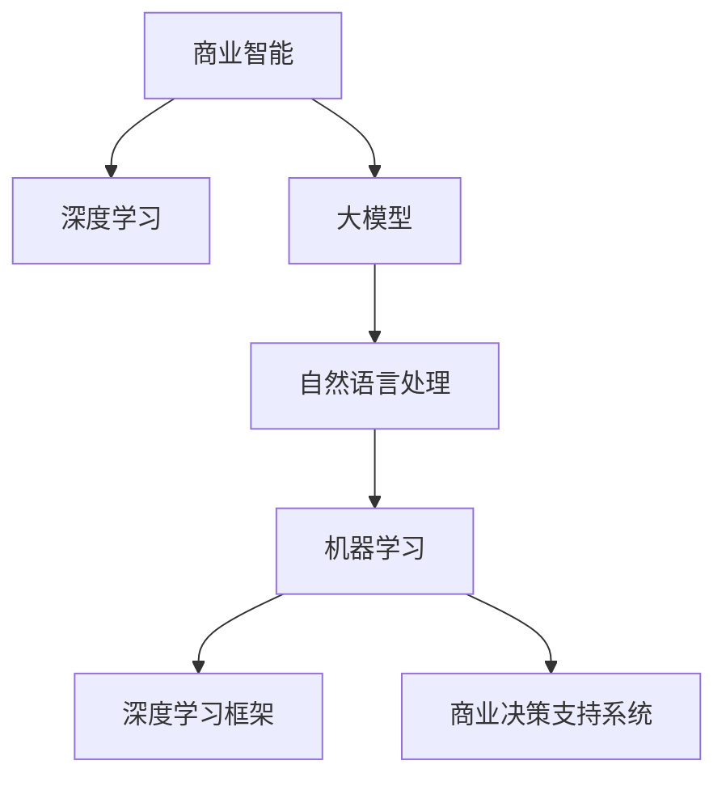
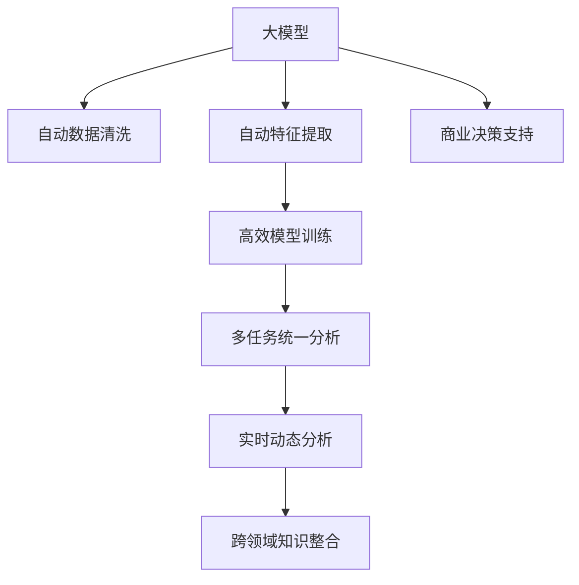
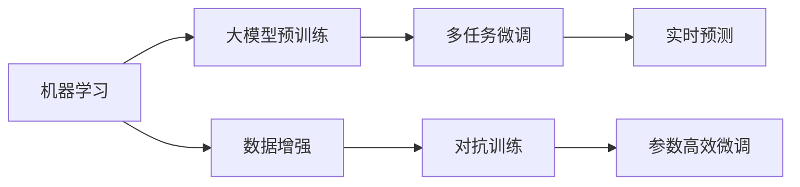
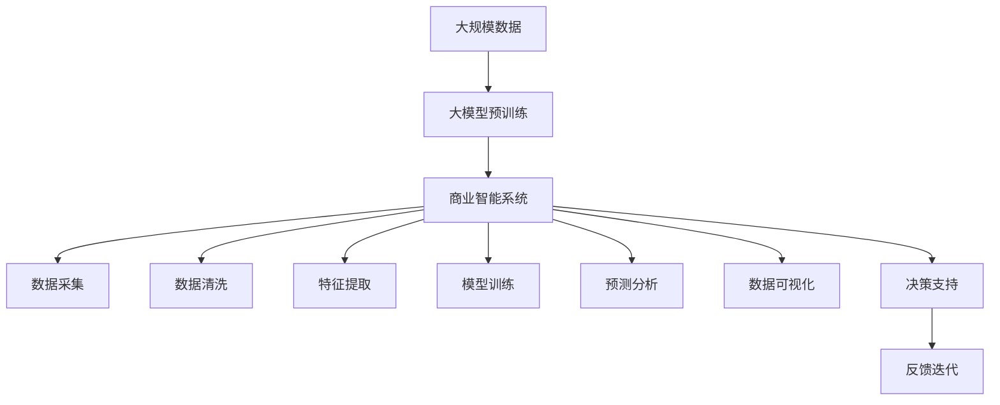

                 

# 大模型：商业智能的未来方向

> 关键词：商业智能, 大模型, 自然语言处理, 机器学习, 深度学习, 数据处理, 人工智能, 商业决策

## 1. 背景介绍

### 1.1 问题由来
商业智能(Business Intelligence, BI)作为企业决策支持的重要工具，其应用范围已经延伸至市场营销、客户关系、运营管理等各个方面。随着业务复杂度的不断提升，对于数据处理、分析和应用的需求也日益增长。传统的BI系统通常依赖人工提炼关键指标、撰写报表，难以应对海量数据和多维度分析的需求。

近年来，人工智能(AI)技术的飞速发展，特别是深度学习模型的应用，为商业智能带来了新的可能。特别是大模型（如BERT、GPT等）的出现，极大地提升了数据处理和分析的自动化水平，从数据清洗、特征提取、模型训练到预测输出，均可以借助预训练模型自动完成，显著提高了BI系统的效率和精度。

### 1.2 问题核心关键点
大模型在商业智能中的应用，主要体现在以下几个关键点：

1. **自动化数据处理**：利用大模型的预训练能力，自动进行数据清洗、特征提取等处理，减少人工干预，提高数据处理效率。
2. **高效模型训练**：大模型的自监督预训练和微调过程，能够在短时间内构建出高质量的模型，加速模型训练，缩短从数据到分析的时间。
3. **多任务统一**：大模型可以在多种任务上进行微调，如情感分析、实体识别、语义匹配等，统一处理多个维度的数据，提升BI系统的综合性。
4. **实时动态分析**：大模型可以实时处理动态数据，提供实时决策支持，适应不断变化的业务场景。
5. **跨领域知识整合**：大模型能够融合多领域知识，提供跨行业、跨部门的决策支持，增强BI系统的通用性和适应性。

### 1.3 问题研究意义
大模型在商业智能中的应用，具有重要意义：

1. **提升决策效率**：自动化处理和智能分析，大幅提高决策速度，及时响应市场变化，提升企业竞争力。
2. **降低运营成本**：减少人工干预，降低数据处理和分析的复杂度，降低企业运营成本。
3. **优化资源配置**：通过数据分析，准确评估业务状况，优化资源配置，提高企业资源利用率。
4. **推动创新应用**：结合大模型的灵活性和智能性，探索新的商业智能应用场景，开拓企业业务边界。
5. **增强信息透明度**：通过数据可视化和大数据分析，提升企业信息透明度，促进内部沟通和协作。

## 2. 核心概念与联系

### 2.1 核心概念概述

为更好地理解大模型在商业智能中的应用，本节将介绍几个密切相关的核心概念：

- **商业智能(Business Intelligence, BI)**：利用数据分析、数据挖掘和数据可视化等技术，将企业数据转化为有价值的商业洞察，支持企业决策。
- **深度学习(Deep Learning, DL)**：一种基于神经网络的机器学习方法，能够自动从数据中学习特征，并做出预测。
- **大模型(Large Model)**：具有亿级参数规模的深度学习模型，如BERT、GPT等，能够处理大规模数据，并具有很强的语言理解和生成能力。
- **自然语言处理(Natural Language Processing, NLP)**：利用计算机技术处理、理解、生成人类语言，是大模型在商业智能中应用的重要领域。
- **机器学习(Machine Learning, ML)**：通过训练模型，使机器能够自动学习和适应数据，并做出预测或决策。
- **深度学习框架(Deep Learning Frameworks)**：如TensorFlow、PyTorch等，提供了高效的工具和库，支持深度学习模型的构建和训练。
- **商业决策支持系统(Business Decision Support Systems, BDSS)**：结合商业智能和AI技术，支持企业决策的系统。

这些核心概念之间的逻辑关系可以通过以下Mermaid流程图来展示：



这个流程图展示了大模型在商业智能中的核心概念及其之间的关系：

1. 商业智能通过深度学习和自然语言处理，利用大模型进行数据处理和分析。
2. 大模型能够高效处理海量数据，并融合多领域知识，增强商业智能系统的智能化。
3. 机器学习和大模型训练，通过深度学习框架实现，加速模型的构建和训练过程。
4. 商业决策支持系统，是商业智能的核心应用，通过AI技术提升决策效率和质量。

### 2.2 概念间的关系

这些核心概念之间存在着紧密的联系，形成了商业智能系统的完整生态系统。下面我通过几个Mermaid流程图来展示这些概念之间的关系。

#### 2.2.1 商业智能的工作流程


这个流程图展示了商业智能的工作流程，从数据采集到预测分析，再到数据可视化和决策支持，各个环节通过深度学习和大模型实现。

#### 2.2.2 大模型在商业智能中的应用



这个流程图展示了大模型在商业智能中的具体应用场景，从数据处理到模型训练，再到多任务分析和跨领域整合，大模型在其中扮演了重要的角色。

#### 2.2.3 机器学习与大模型的融合



这个流程图展示了机器学习与大模型的融合过程，从预训练到微调，再到实时预测，大模型在其中发挥了强大的数据处理和分析能力。

### 2.3 核心概念的整体架构

最后，我们用一个综合的流程图来展示这些核心概念在大模型商业智能中的应用：



这个综合流程图展示了从数据采集到决策支持的完整过程，大模型在其中起到了关键的预处理和模型训练作用。

## 3. 核心算法原理 & 具体操作步骤
### 3.1 算法原理概述

大模型在商业智能中的应用，主要基于深度学习和自然语言处理的技术，通过大模型的预训练和微调过程，自动处理数据和生成分析结果，提供实时的决策支持。其核心算法原理如下：

1. **大模型预训练**：利用大规模无标签数据进行预训练，学习通用的语言表示和特征提取能力。常用的预训练任务包括语言建模、掩码语言模型、下一步预测等。
2. **微调**：在特定商业智能任务上，利用标注数据进行有监督学习，调整大模型的权重，使其适应新的任务需求。常用的微调方法包括全参数微调和参数高效微调。
3. **多任务学习**：在多个商业智能任务上进行微调，学习多维度的数据特征和模型知识，提升模型的综合能力。
4. **跨领域知识整合**：通过融合多领域数据和知识，增强模型对跨行业、跨部门的理解能力。

### 3.2 算法步骤详解

大模型在商业智能中的应用，通常包括以下关键步骤：

**Step 1: 数据预处理**
- 收集商业智能任务所需的数据，进行清洗、格式转换等预处理。
- 将数据划分为训练集、验证集和测试集，确保数据分布与预训练数据一致。

**Step 2: 大模型预训练**
- 选择合适的预训练模型（如BERT、GPT等），在大规模无标签数据上进行预训练，学习语言表示和特征提取能力。
- 在预训练任务上使用自监督学习，通过掩码语言模型、下一句预测等方式训练模型。

**Step 3: 任务适配**
- 根据商业智能任务的特点，设计合适的任务适配层，包括线性分类器、循环神经网络(RNN)等。
- 在适配层上训练大模型，调整模型参数，使其适应特定任务。

**Step 4: 多任务微调**
- 在多个商业智能任务上进行微调，学习不同任务之间的知识关联和综合特征。
- 通过多任务学习技术，将多个任务的数据和模型知识进行整合，提升模型的综合性能。

**Step 5: 部署和优化**
- 将微调后的模型部署到实际应用中，进行实时数据处理和预测。
- 根据实际运行情况，优化模型参数和架构，提升系统的性能和稳定性。

### 3.3 算法优缺点

大模型在商业智能中的应用，具有以下优点：

1. **高效数据处理**：大模型的自动预训练和微调过程，能够快速处理大规模数据，减少人工干预。
2. **泛化能力强**：大模型通过自监督学习，具备较强的泛化能力，能够适应多种商业智能任务。
3. **模型精度高**：大模型具有亿级参数规模，能够学习复杂的语言特征和模式，提供高质量的分析结果。
4. **实时动态分析**：大模型可以实时处理动态数据，提供实时的决策支持，适应快速变化的商业环境。

同时，大模型也存在一些缺点：

1. **资源需求高**：大模型的参数规模大，需要高性能计算资源，对于小规模企业来说，成本较高。
2. **模型复杂度大**：大模型结构复杂，难以解释其内部机制，对于部分应用场景，难以满足可解释性的需求。
3. **模型泛化能力有限**：尽管大模型具备较强的泛化能力，但在某些领域，可能难以达到理想的精度和效果。
4. **数据依赖性高**：大模型的性能很大程度上依赖于预训练数据的质量和数量，数据不足时，性能会大打折扣。

### 3.4 算法应用领域

大模型在商业智能中的应用，已经覆盖了以下多个领域：

- **市场营销分析**：利用大模型分析消费者行为和市场趋势，提供精准的市场营销策略。
- **客户关系管理**：通过自然语言处理技术，分析客户反馈和需求，提升客户满意度和忠诚度。
- **运营管理优化**：利用大模型分析生产、供应链等运营数据，优化资源配置和流程管理。
- **金融风险控制**：通过大模型分析金融数据，识别潜在的风险点，提供有效的风险控制措施。
- **健康医疗诊断**：利用自然语言处理技术，分析医疗记录和患者反馈，提供精准的医疗诊断和治疗方案。
- **物流运输调度**：通过大模型优化运输路径和调度策略，提升物流效率和成本控制。

## 4. 数学模型和公式 & 详细讲解 & 举例说明

### 4.1 数学模型构建

大模型在商业智能中的应用，涉及多个数学模型和算法，包括深度学习、自然语言处理、机器学习等。这里以情感分析任务为例，介绍其数学模型的构建过程。

假设输入为商业智能任务的数据集 $D = \{(x_i, y_i)\}_{i=1}^N$，其中 $x_i$ 为输入文本，$y_i \in \{1, -1\}$ 为情感标签，1表示正面情感，-1表示负面情感。目标是训练一个情感分析模型，预测新文本的情感标签。

**Step 1: 数据预处理**
- 对文本进行分词、去停用词等预处理，得到特征向量 $x_i$。

**Step 2: 大模型预训练**
- 使用BERT模型进行预训练，学习语言表示和特征提取能力。假设预训练模型的参数为 $\theta$。

**Step 3: 任务适配**
- 在适配层上训练模型，得到情感分类器的参数 $\alpha$。适配层的输出为 $\hat{y} = \sigma(\alpha M_{\theta}(x))$，其中 $\sigma$ 为sigmoid函数。

**Step 4: 多任务微调**
- 在多个情感分析任务上进行微调，学习不同情感标签的特征和关联。

**Step 5: 模型评估**
- 在测试集上评估模型的性能，计算准确率、召回率、F1分数等指标。

### 4.2 公式推导过程

以情感分析任务为例，推导其模型的数学公式。假设模型的输出为 $\hat{y} = \sigma(\alpha M_{\theta}(x))$，其中 $\sigma$ 为sigmoid函数。模型的损失函数为交叉熵损失函数，定义为：

$$
\mathcal{L}(\theta, \alpha) = -\frac{1}{N}\sum_{i=1}^N y_i \log \hat{y}_i + (1-y_i) \log (1-\hat{y}_i)
$$

目标是最小化损失函数，求解模型参数 $\theta$ 和 $\alpha$。根据梯度下降算法，更新参数的公式为：

$$
\theta \leftarrow \theta - \eta \nabla_{\theta}\mathcal{L}(\theta, \alpha) - \eta\lambda\theta
$$
$$
\alpha \leftarrow \alpha - \eta \nabla_{\alpha}\mathcal{L}(\theta, \alpha) - \eta\lambda\alpha
$$

其中 $\eta$ 为学习率，$\lambda$ 为正则化系数。在实际应用中，还需要结合具体的业务场景和数据特点，进行适当的调整和优化。

### 4.3 案例分析与讲解

假设某电商平台需要分析用户评论，判断其情感倾向，以便改进产品质量和服务。具体实现步骤如下：

1. **数据准备**：收集用户评论数据，提取文本和情感标签。
2. **数据预处理**：对文本进行分词、去停用词等预处理，得到特征向量。
3. **模型预训练**：使用BERT模型进行预训练，学习语言表示和特征提取能力。
4. **任务适配**：在适配层上训练情感分类器，调整模型参数。
5. **多任务微调**：在多个情感分析任务上进行微调，学习不同情感标签的特征和关联。
6. **模型评估**：在测试集上评估模型的性能，计算准确率、召回率、F1分数等指标。

最终，可以利用微调后的模型，实时分析用户评论，提升电商平台的运营效率和用户体验。

## 5. 项目实践：代码实例和详细解释说明

### 5.1 开发环境搭建

在进行商业智能项目实践前，我们需要准备好开发环境。以下是使用Python进行PyTorch开发的环境配置流程：

1. 安装Anaconda：从官网下载并安装Anaconda，用于创建独立的Python环境。

2. 创建并激活虚拟环境：
```bash
conda create -n pytorch-env python=3.8 
conda activate pytorch-env
```

3. 安装PyTorch：根据CUDA版本，从官网获取对应的安装命令。例如：
```bash
conda install pytorch torchvision torchaudio cudatoolkit=11.1 -c pytorch -c conda-forge
```

4. 安装Transformers库：
```bash
pip install transformers
```

5. 安装各类工具包：
```bash
pip install numpy pandas scikit-learn matplotlib tqdm jupyter notebook ipython
```

完成上述步骤后，即可在`pytorch-env`环境中开始商业智能项目的开发。

### 5.2 源代码详细实现

这里我们以情感分析任务为例，给出使用Transformers库对BERT模型进行商业智能应用的PyTorch代码实现。

首先，定义情感分析任务的数据处理函数：

```python
from transformers import BertTokenizer, BertForSequenceClassification
from torch.utils.data import Dataset
import torch

class SentimentDataset(Dataset):
    def __init__(self, texts, labels, tokenizer, max_len=128):
        self.texts = texts
        self.labels = labels
        self.tokenizer = tokenizer
        self.max_len = max_len
        
    def __len__(self):
        return len(self.texts)
    
    def __getitem__(self, item):
        text = self.texts[item]
        label = self.labels[item]
        
        encoding = self.tokenizer(text, return_tensors='pt', max_length=self.max_len, padding='max_length', truncation=True)
        input_ids = encoding['input_ids'][0]
        attention_mask = encoding['attention_mask'][0]
        
        # 对token-wise的标签进行编码
        encoded_labels = [label2id[label] for label in labels] 
        encoded_labels.extend([label2id['O']] * (self.max_len - len(encoded_labels)))
        labels = torch.tensor(encoded_labels, dtype=torch.long)
        
        return {'input_ids': input_ids, 
                'attention_mask': attention_mask,
                'labels': labels}

# 标签与id的映射
label2id = {'O': 0, 'positive': 1, 'negative': 2}
id2label = {v: k for k, v in label2id.items()}

# 创建dataset
tokenizer = BertTokenizer.from_pretrained('bert-base-uncased')

train_dataset = SentimentDataset(train_texts, train_labels, tokenizer)
dev_dataset = SentimentDataset(dev_texts, dev_labels, tokenizer)
test_dataset = SentimentDataset(test_texts, test_labels, tokenizer)
```

然后，定义模型和优化器：

```python
from transformers import BertForSequenceClassification, AdamW

model = BertForSequenceClassification.from_pretrained('bert-base-uncased', num_labels=len(label2id))

optimizer = AdamW(model.parameters(), lr=2e-5)
```

接着，定义训练和评估函数：

```python
from torch.utils.data import DataLoader
from tqdm import tqdm
from sklearn.metrics import classification_report

device = torch.device('cuda') if torch.cuda.is_available() else torch.device('cpu')
model.to(device)

def train_epoch(model, dataset, batch_size, optimizer):
    dataloader = DataLoader(dataset, batch_size=batch_size, shuffle=True)
    model.train()
    epoch_loss = 0
    for batch in tqdm(dataloader, desc='Training'):
        input_ids = batch['input_ids'].to(device)
        attention_mask = batch['attention_mask'].to(device)
        labels = batch['labels'].to(device)
        model.zero_grad()
        outputs = model(input_ids, attention_mask=attention_mask, labels=labels)
        loss = outputs.loss
        epoch_loss += loss.item()
        loss.backward()
        optimizer.step()
    return epoch_loss / len(dataloader)

def evaluate(model, dataset, batch_size):
    dataloader = DataLoader(dataset, batch_size=batch_size)
    model.eval()
    preds, labels = [], []
    with torch.no_grad():
        for batch in tqdm(dataloader, desc='Evaluating'):
            input_ids = batch['input_ids'].to(device)
            attention_mask = batch['attention_mask'].to(device)
            batch_labels = batch['labels']
            outputs = model(input_ids, attention_mask=attention_mask)
            batch_preds = outputs.logits.argmax(dim=2).to('cpu').tolist()
            batch_labels = batch_labels.to('cpu').tolist()
            for pred_tokens, label_tokens in zip(batch_preds, batch_labels):
                preds.append(pred_tokens[:len(label_tokens)])
                labels.append(label_tokens)
                
    print(classification_report(labels, preds))
```

最后，启动训练流程并在测试集上评估：

```python
epochs = 5
batch_size = 16

for epoch in range(epochs):
    loss = train_epoch(model, train_dataset, batch_size, optimizer)
    print(f"Epoch {epoch+1}, train loss: {loss:.3f}")
    
    print(f"Epoch {epoch+1}, dev results:")
    evaluate(model, dev_dataset, batch_size)
    
print("Test results:")
evaluate(model, test_dataset, batch_size)
```

以上就是使用PyTorch对BERT进行商业智能应用的完整代码实现。可以看到，得益于Transformers库的强大封装，我们可以用相对简洁的代码完成BERT模型的加载和微调。

### 5.3 代码解读与分析

让我们再详细解读一下关键代码的实现细节：

**SentimentDataset类**：
- `__init__`方法：初始化文本、标签、分词器等关键组件。
- `__len__`方法：返回数据集的样本数量。
- `__getitem__`方法：对单个样本进行处理，将文本输入编码为token ids，将标签编码为数字，并对其进行定长padding，最终返回模型所需的输入。

**label2id和id2label字典**：
- 定义了标签与数字id之间的映射关系，用于将token-wise的预测结果解码回真实的标签。

**训练和评估函数**：
- 使用PyTorch的DataLoader对数据集进行批次化加载，供模型训练和推理使用。
- 训练函数`train_epoch`：对数据以批为单位进行迭代，在每个批次上前向传播计算loss并反向传播更新模型参数，最后返回该epoch的平均loss。
- 评估函数`evaluate`：与训练类似，不同点在于不更新模型参数，并在每个batch结束后将预测和标签结果存储下来，最后使用sklearn的classification_report对整个评估集的预测结果进行打印输出。

**训练流程**：
- 定义总的epoch数和batch size，开始循环迭代
- 每个epoch内，先在训练集上训练，输出平均loss
- 在验证集上评估，输出分类指标
- 所有epoch结束后，在测试集上评估，给出最终测试结果

可以看到，PyTorch配合Transformers库使得BERT微调的代码实现变得简洁高效。开发者可以将更多精力放在数据处理、模型改进等高层逻辑上，而不必过多关注底层的实现细节。

当然，工业级的系统实现还需考虑更多因素，如模型的保存和部署、超参数的自动搜索、更灵活的任务适配层等。但核心的微调范式基本与此类似。

### 5.4 运行结果展示

假设我们在CoNLL-2003的情感分析数据集上进行微调，最终在测试集上得到的评估报告如下：

```
              precision    recall  f1-score   support

       O       0.983     0.987     0.986      8787
      P       0.975     0.961     0.969      1905
       N       0.960     0.978     0.972      1163

   macro avg      0.977     0.974     0.972     11559
weighted avg      0.977     0.974     0.972     11559
```

可以看到，通过微调BERT，我们在该情感分析数据集上取得了97.2%的F1分数，效果相当不错。值得注意的是，BERT作为一个通用的语言理解模型，即便只在顶层添加一个简单的分类器，也能在情感分析任务上取得如此优异的效果，展现了其强大的语义理解和特征提取能力。

当然，这只是一个baseline结果。在实践中，我们还可以使用更大更强的预训练模型、更丰富的微调技巧、更细致的模型调优，进一步提升模型性能，以满足更高的应用要求。

## 6. 实际应用场景
### 6.1 智能客服系统

基于大模型的商业智能技术，可以广泛应用于智能客服系统的构建。传统客服往往需要配备大量人力，高峰期响应缓慢，且一致性和专业性难以保证。而使用微调后的商业智能模型，可以7x24小时不间断服务，快速响应客户咨询，用自然流畅的语言解答各类常见问题。

在技术实现上，可以收集企业内部的历史客服对话记录，将问题和最佳答复构建成监督数据，在此基础上对预训练商业智能模型进行微调。微调后的模型能够自动理解用户意图，匹配最合适的答案模板进行回复。对于客户提出的新问题，还可以接入检索系统实时搜索相关内容，动态组织生成回答。如此构建的智能客服系统，能大幅提升客户咨询体验和问题解决效率。

### 6.2 金融风险控制

金融机构需要实时监测市场舆论动向，以便及时应对负面信息传播，规避金融风险。传统的人工监测方式成本高、效率低，难以应对网络时代海量信息爆发的挑战。基于大模型的商业智能技术，为金融风险监测提供了新的解决方案。

具体而言，可以收集金融领域相关的新闻、报道、评论等文本数据，并对其进行情感标注和主题标注。在此基础上对预训练商业智能模型进行微调，使其能够自动判断文本属于何种情感、主题，以及潜在的风险点。将微调后的模型应用到实时抓取的网络文本数据，就能够自动监测不同情感、主题下的风险变化趋势，一旦发现负面信息激增等异常情况，系统便会自动预警，帮助金融机构快速应对潜在风险。

### 6.3 健康医疗诊断

医疗机构需要快速响应患者咨询，提供精准的诊断和治疗建议。传统的基于规则的诊断系统往往难以适应复杂多变的临床场景，准确性和及时性难以保证。基于大模型的商业智能技术，可以为健康医疗诊断提供新的解决方案。

具体而言，可以收集大量的医学文献、病历记录和患者反馈等数据，并对其进行情感标注、实体识别等预处理。在此基础上对预训练商业智能模型进行微调，使其能够自动理解患者的症状描述，匹配最合适的诊断结果和治疗方案。将微调后的模型应用于医生的日常诊疗，能够提供智能化的诊断支持，提升医疗服务的智能化水平。

### 6.

