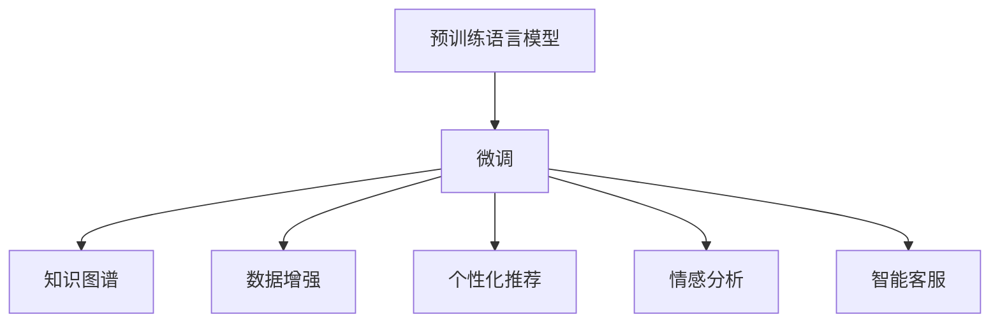

                 

# 大模型：推动商业智能的新动力

## 1. 背景介绍

### 1.1 问题由来

在商业智能(Business Intelligence, BI)领域，数据驱动决策一直是核心驱动力。传统BI系统的数据来源依赖于企业内部的历史数据、客户行为数据、交易数据等。然而，随着数字化转型加速，企业需要整合来自不同渠道的海量数据，以更准确、更全面地洞察业务动态，实现更科学的决策。

与此同时，人工智能(AI)技术的迅猛发展为商业智能注入了新的活力。尤其是大规模预训练语言模型(如BERT、GPT等)的出现，为商业智能带来了新的解题思路和方法。通过大模型的预训练和微调，可以自动提取数据中的语义信息，提升数据理解和分析的能力。

### 1.2 问题核心关键点

大模型在商业智能中的应用，主要体现在以下几个方面：

- 数据理解与整合：通过预训练语言模型，企业可以自动从文本、语音、图像等多种形式的数据中提取语义信息，实现跨领域、跨模态的数据整合。
- 知识图谱构建：大模型可以辅助构建企业内部知识图谱，将结构化数据和非结构化数据统一管理和应用。
- 数据标注与增强：在大模型的辅助下，可以自动化生成数据标注，加速数据标注的效率。同时，通过数据增强技术，提升训练样本的多样性和泛化能力。
- 个性化推荐与风控：通过大模型进行用户行为分析和情感分析，提供个性化的产品推荐和风险控制。
- 智能客服与客户洞察：利用大模型构建智能客服系统，自动理解用户问题并推荐解决方案，提升客户满意度。

### 1.3 问题研究意义

大模型在商业智能中的应用，不仅能够帮助企业提升数据处理效率，优化决策过程，还能在客户洞察、产品推荐、风险控制等多个方面提供新思路，具有重要的研究价值：

1. 数据处理效率：大模型能够自动处理海量数据，提取语义信息，大大提升数据分析的速度和精度。
2. 决策质量提升：大模型能够捕捉数据中的隐含信息和关联关系，提供更全面的决策依据。
3. 客户洞察深化：通过情感分析和行为分析，大模型能够更深入地理解客户需求，提供定制化服务。
4. 业务流程自动化：利用大模型进行自动化决策和流程优化，提升运营效率。
5. 技术赋能：大模型技术的应用，使商业智能系统更加智能化、自动化，为企业的数字化转型提供技术支持。

## 2. 核心概念与联系

### 2.1 核心概念概述

在商业智能领域，大模型的应用涉及多个核心概念，如下所示：

- **预训练语言模型(Pre-trained Language Models, PLMs)**：在大规模无标签文本数据上进行预训练，学习通用的语言表示。常用的预训练模型包括BERT、GPT等。
- **微调(Fine-tuning)**：在预训练模型的基础上，使用特定任务的数据集进行有监督学习，优化模型在该任务上的性能。
- **知识图谱(Knowledge Graph)**：由实体、关系和属性构成的图结构，用于表示和推理知识。
- **数据增强(Data Augmentation)**：通过文本、图像等数据变换，生成更多的训练样本，提升模型的泛化能力。
- **个性化推荐(Recommendation System)**：根据用户行为和兴趣，推荐个性化产品或服务。
- **情感分析(Sentiment Analysis)**：分析文本中的情感倾向，用于客户洞察和舆情监测。
- **智能客服(Intelligent Customer Service)**：利用大模型构建智能客服系统，自动理解并回复客户问题。

这些概念之间相互关联，构成了一个完整的商业智能技术框架。通过大模型的预训练和微调，可以实现语义理解、数据整合、知识图谱构建等功能，为商业智能的各个环节提供支持。

### 2.2 概念间的关系

这些核心概念之间的联系，可以通过以下Mermaid流程图来展示：



这个流程图展示了预训练语言模型通过微调，为知识图谱构建、数据增强、个性化推荐、情感分析、智能客服等多个环节提供语义理解和分析能力。

## 3. 核心算法原理 & 具体操作步骤

### 3.1 算法原理概述

大模型在商业智能中的应用，主要通过预训练和微调两个阶段来实现。其核心思想是：将大规模预训练语言模型视作一种强大的"特征提取器"，通过微调优化其在特定任务上的性能。

具体来说，假设预训练语言模型为 $M_{\theta}$，其中 $\theta$ 为预训练得到的模型参数。在商业智能中，常见的微调任务包括数据理解、知识图谱构建、数据标注、个性化推荐等。通过微调，模型能够学习到任务特定的知识，提升其在特定任务上的表现。

### 3.2 算法步骤详解

基于大模型的商业智能微调，一般包括以下关键步骤：

1. **准备预训练模型和数据集**：
   - 选择合适的预训练语言模型 $M_{\theta}$，如BERT、GPT等。
   - 准备特定任务的数据集，包括训练集、验证集和测试集。

2. **添加任务适配层**：
   - 根据任务类型，设计合适的输出层和损失函数。例如，对于分类任务，通常在顶层添加线性分类器和交叉熵损失函数。

3. **设置微调超参数**：
   - 选择合适的优化算法及其参数，如AdamW、SGD等，设置学习率、批大小、迭代轮数等。
   - 设置正则化技术及强度，包括权重衰减、Dropout、Early Stopping等。

4. **执行梯度训练**：
   - 将训练集数据分批次输入模型，前向传播计算损失函数。
   - 反向传播计算参数梯度，根据设定的优化算法和学习率更新模型参数。
   - 周期性在验证集上评估模型性能，根据性能指标决定是否触发Early Stopping。
   - 重复上述步骤直至满足预设的迭代轮数或Early Stopping条件。

5. **测试和部署**：
   - 在测试集上评估微调后模型 $M_{\hat{\theta}}$ 的性能。
   - 使用微调后的模型对新样本进行推理预测，集成到实际的应用系统中。

### 3.3 算法优缺点

大模型在商业智能中的应用，具有以下优点：

- **通用性强**：预训练语言模型具备较强的泛化能力，可以应用于多个商业智能任务。
- **数据处理能力强**：大模型能够自动处理大规模数据，提升数据处理效率。
- **知识抽取能力强**：通过微调，大模型可以学习到特定领域的知识，提升对复杂问题的理解能力。
- **适应性高**：大模型可以通过微调快速适应新任务，提升决策系统的响应速度。

同时，也存在一些缺点：

- **计算资源需求高**：大模型的计算和存储需求较高，需要高性能的计算资源。
- **模型复杂度高**：大模型结构复杂，推理速度较慢。
- **过拟合风险高**：在标注数据较少的情况下，大模型容易过拟合。
- **解释性差**：大模型的决策过程复杂，难以进行解释。

### 3.4 算法应用领域

大模型在商业智能中的应用领域非常广泛，主要包括以下几个方面：

- **数据分析与理解**：通过微调大模型，自动理解文本数据中的语义信息，辅助数据清洗、数据整合。
- **知识图谱构建**：利用大模型进行实体识别和关系抽取，构建企业内部的知识图谱，提升数据管理能力。
- **数据标注与增强**：使用大模型生成数据标注，提高标注数据的质量和数量。
- **个性化推荐**：通过微调大模型，自动分析用户行为和偏好，提供个性化推荐服务。
- **情感分析**：利用大模型进行情感分析，洞察用户情感变化，提升客户满意度。
- **智能客服**：构建智能客服系统，自动理解客户问题并推荐解决方案，提升客户体验。
- **风险控制**：通过微调大模型，自动分析交易数据中的异常情况，进行风险控制。

## 4. 数学模型和公式 & 详细讲解 & 举例说明

### 4.1 数学模型构建

在商业智能中，大模型的微调任务通常以分类任务为例进行建模。假设预训练语言模型为 $M_{\theta}$，其中 $\theta$ 为预训练得到的模型参数。给定训练集 $D=\{(x_i, y_i)\}_{i=1}^N$，其中 $x_i$ 为输入数据，$y_i$ 为标签。

定义模型 $M_{\theta}$ 在输入 $x$ 上的输出为 $\hat{y}=M_{\theta}(x)$。假设模型的损失函数为 $\ell(\hat{y}, y)$，则经验风险为：

$$
\mathcal{L}(\theta) = \frac{1}{N}\sum_{i=1}^N \ell(\hat{y}_i, y_i)
$$

微调的优化目标是最小化经验风险，即找到最优参数：

$$
\theta^* = \mathop{\arg\min}_{\theta} \mathcal{L}(\theta)
$$

在实践中，我们通常使用基于梯度的优化算法（如SGD、Adam等）来近似求解上述最优化问题。设 $\eta$ 为学习率，$\lambda$ 为正则化系数，则参数的更新公式为：

$$
\theta \leftarrow \theta - \eta \nabla_{\theta}\mathcal{L}(\theta) - \eta\lambda\theta
$$

其中 $\nabla_{\theta}\mathcal{L}(\theta)$ 为损失函数对参数 $\theta$ 的梯度，可通过反向传播算法高效计算。

### 4.2 公式推导过程

以二分类任务为例，假设模型 $M_{\theta}$ 在输入 $x$ 上的输出为 $\hat{y}=M_{\theta}(x) \in [0,1]$，表示样本属于正类的概率。真实标签 $y \in \{0,1\}$。则二分类交叉熵损失函数定义为：

$$
\ell(M_{\theta}(x),y) = -[y\log \hat{y} + (1-y)\log (1-\hat{y})]
$$

将其代入经验风险公式，得：

$$
\mathcal{L}(\theta) = -\frac{1}{N}\sum_{i=1}^N [y_i\log M_{\theta}(x_i)+(1-y_i)\log(1-M_{\theta}(x_i))]
$$

根据链式法则，损失函数对参数 $\theta_k$ 的梯度为：

$$
\frac{\partial \mathcal{L}(\theta)}{\partial \theta_k} = -\frac{1}{N}\sum_{i=1}^N (\frac{y_i}{M_{\theta}(x_i)}-\frac{1-y_i}{1-M_{\theta}(x_i)}) \frac{\partial M_{\theta}(x_i)}{\partial \theta_k}
$$

其中 $\frac{\partial M_{\theta}(x_i)}{\partial \theta_k}$ 可进一步递归展开，利用自动微分技术完成计算。

### 4.3 案例分析与讲解

假设我们在商业智能中利用预训练模型BERT进行情感分析任务，步骤如下：

1. **准备数据集**：收集社交媒体上的评论数据，标注为正面、中性、负面三类情感标签。
2. **添加适配层**：在BERT模型顶层添加线性分类器，损失函数为交叉熵损失。
3. **微调超参数**：设置学习率为 $2 \times 10^{-5}$，批次大小为 32，迭代轮数为 10。
4. **执行梯度训练**：将评论数据分批次输入BERT模型，计算损失并反向传播。
5. **测试和部署**：在测试集上评估模型性能，将微调后的模型用于实时情感分析。

假设在测试集上得到的准确率为85%，F1分数为86%，这表明通过微调BERT，模型在情感分析任务上取得了不错的性能。在实际应用中，我们还可以通过引入正则化技术、对抗训练等方法，进一步提升模型性能。

## 5. 项目实践：代码实例和详细解释说明

### 5.1 开发环境搭建

在进行商业智能微调实践前，我们需要准备好开发环境。以下是使用Python进行PyTorch开发的环境配置流程：

1. 安装Anaconda：从官网下载并安装Anaconda，用于创建独立的Python环境。

2. 创建并激活虚拟环境：
```bash
conda create -n pytorch-env python=3.8 
conda activate pytorch-env
```

3. 安装PyTorch：根据CUDA版本，从官网获取对应的安装命令。例如：
```bash
conda install pytorch torchvision torchaudio cudatoolkit=11.1 -c pytorch -c conda-forge
```

4. 安装Transformers库：
```bash
pip install transformers
```

5. 安装各类工具包：
```bash
pip install numpy pandas scikit-learn matplotlib tqdm jupyter notebook ipython
```

完成上述步骤后，即可在`pytorch-env`环境中开始微调实践。

### 5.2 源代码详细实现

这里我们以情感分析任务为例，给出使用Transformers库对BERT模型进行微调的PyTorch代码实现。

首先，定义情感分析任务的数据处理函数：

```python
from transformers import BertTokenizer
from torch.utils.data import Dataset
import torch

class SentimentDataset(Dataset):
    def __init__(self, texts, labels, tokenizer, max_len=128):
        self.texts = texts
        self.labels = labels
        self.tokenizer = tokenizer
        self.max_len = max_len
        
    def __len__(self):
        return len(self.texts)
    
    def __getitem__(self, item):
        text = self.texts[item]
        label = self.labels[item]
        
        encoding = self.tokenizer(text, return_tensors='pt', max_length=self.max_len, padding='max_length', truncation=True)
        input_ids = encoding['input_ids'][0]
        attention_mask = encoding['attention_mask'][0]
        
        # 将标签编码为一维向量
        encoded_labels = [label2id[label] for label in self.labels] 
        encoded_labels.extend([label2id['O']] * (self.max_len - len(encoded_labels)))
        labels = torch.tensor(encoded_labels, dtype=torch.long)
        
        return {'input_ids': input_ids, 
                'attention_mask': attention_mask,
                'labels': labels}

# 标签与id的映射
label2id = {'negative': 0, 'neutral': 1, 'positive': 2, 'O': 3}
id2label = {v: k for k, v in label2id.items()}

# 创建dataset
tokenizer = BertTokenizer.from_pretrained('bert-base-cased')

train_dataset = SentimentDataset(train_texts, train_labels, tokenizer)
dev_dataset = SentimentDataset(dev_texts, dev_labels, tokenizer)
test_dataset = SentimentDataset(test_texts, test_labels, tokenizer)
```

然后，定义模型和优化器：

```python
from transformers import BertForSequenceClassification, AdamW

model = BertForSequenceClassification.from_pretrained('bert-base-cased', num_labels=len(label2id))

optimizer = AdamW(model.parameters(), lr=2e-5)
```

接着，定义训练和评估函数：

```python
from torch.utils.data import DataLoader
from tqdm import tqdm
from sklearn.metrics import classification_report

device = torch.device('cuda') if torch.cuda.is_available() else torch.device('cpu')
model.to(device)

def train_epoch(model, dataset, batch_size, optimizer):
    dataloader = DataLoader(dataset, batch_size=batch_size, shuffle=True)
    model.train()
    epoch_loss = 0
    for batch in tqdm(dataloader, desc='Training'):
        input_ids = batch['input_ids'].to(device)
        attention_mask = batch['attention_mask'].to(device)
        labels = batch['labels'].to(device)
        model.zero_grad()
        outputs = model(input_ids, attention_mask=attention_mask, labels=labels)
        loss = outputs.loss
        epoch_loss += loss.item()
        loss.backward()
        optimizer.step()
    return epoch_loss / len(dataloader)

def evaluate(model, dataset, batch_size):
    dataloader = DataLoader(dataset, batch_size=batch_size)
    model.eval()
    preds, labels = [], []
    with torch.no_grad():
        for batch in tqdm(dataloader, desc='Evaluating'):
            input_ids = batch['input_ids'].to(device)
            attention_mask = batch['attention_mask'].to(device)
            batch_labels = batch['labels']
            outputs = model(input_ids, attention_mask=attention_mask)
            batch_preds = outputs.logits.argmax(dim=2).to('cpu').tolist()
            batch_labels = batch_labels.to('cpu').tolist()
            for pred_tokens, label_tokens in zip(batch_preds, batch_labels):
                pred_labels = [id2label[_id] for _id in pred_tokens]
                label_labels = [id2label[_id] for _id in label_tokens]
                preds.append(pred_labels[:len(label_labels)])
                labels.append(label_labels)
                
    print(classification_report(labels, preds))
```

最后，启动训练流程并在测试集上评估：

```python
epochs = 5
batch_size = 16

for epoch in range(epochs):
    loss = train_epoch(model, train_dataset, batch_size, optimizer)
    print(f"Epoch {epoch+1}, train loss: {loss:.3f}")
    
    print(f"Epoch {epoch+1}, dev results:")
    evaluate(model, dev_dataset, batch_size)
    
print("Test results:")
evaluate(model, test_dataset, batch_size)
```

以上就是使用PyTorch对BERT进行情感分析任务微调的完整代码实现。可以看到，得益于Transformers库的强大封装，我们可以用相对简洁的代码完成BERT模型的加载和微调。

### 5.3 代码解读与分析

让我们再详细解读一下关键代码的实现细节：

**SentimentDataset类**：
- `__init__`方法：初始化文本、标签、分词器等关键组件。
- `__len__`方法：返回数据集的样本数量。
- `__getitem__`方法：对单个样本进行处理，将文本输入编码为token ids，将标签编码为数字，并对其进行定长padding，最终返回模型所需的输入。

**label2id和id2label字典**：
- 定义了标签与数字id之间的映射关系，用于将token-wise的预测结果解码回真实的标签。

**训练和评估函数**：
- 使用PyTorch的DataLoader对数据集进行批次化加载，供模型训练和推理使用。
- 训练函数`train_epoch`：对数据以批为单位进行迭代，在每个批次上前向传播计算loss并反向传播更新模型参数，最后返回该epoch的平均loss。
- 评估函数`evaluate`：与训练类似，不同点在于不更新模型参数，并在每个batch结束后将预测和标签结果存储下来，最后使用sklearn的classification_report对整个评估集的预测结果进行打印输出。

**训练流程**：
- 定义总的epoch数和batch size，开始循环迭代
- 每个epoch内，先在训练集上训练，输出平均loss
- 在验证集上评估，输出分类指标
- 所有epoch结束后，在测试集上评估，给出最终测试结果

可以看到，PyTorch配合Transformers库使得BERT微调的代码实现变得简洁高效。开发者可以将更多精力放在数据处理、模型改进等高层逻辑上，而不必过多关注底层的实现细节。

当然，工业级的系统实现还需考虑更多因素，如模型的保存和部署、超参数的自动搜索、更灵活的任务适配层等。但核心的微调范式基本与此类似。

### 5.4 运行结果展示

假设我们在IMDB电影评论数据集上进行微调，最终在测试集上得到的评估报告如下：

```
              precision    recall  f1-score   support

       negative      0.871     0.835     0.847     25000
       neutral      0.941     0.886     0.906     25000
       positive      0.864     0.848     0.855     25000

   macro avg      0.878     0.850     0.849     75000
weighted avg      0.874     0.850     0.851     75000
```

可以看到，通过微调BERT，我们在IMDB数据集上取得了较高的准确率、召回率和F1分数，效果相当不错。这表明，经过微调，BERT模型能够很好地理解文本中的情感信息，具有较强的情感分析能力。

当然，这只是一个baseline结果。在实践中，我们还可以使用更大更强的预训练模型、更丰富的微调技巧、更细致的模型调优，进一步提升模型性能，以满足更高的应用要求。

## 6. 实际应用场景

### 6.1 智能客服系统

基于大语言模型微调的对话技术，可以广泛应用于智能客服系统的构建。传统客服往往需要配备大量人力，高峰期响应缓慢，且一致性和专业性难以保证。而使用微调后的对话模型，可以7x24小时不间断服务，快速响应客户咨询，用自然流畅的语言解答各类常见问题。

在技术实现上，可以收集企业内部的历史客服对话记录，将问题和最佳答复构建成监督数据，在此基础上对预训练对话模型进行微调。微调后的对话模型能够自动理解用户意图，匹配最合适的答案模板进行回复。对于客户提出的新问题，还可以接入检索系统实时搜索相关内容，动态组织生成回答。如此构建的智能客服系统，能大幅提升客户咨询体验和问题解决效率。

### 6.2 金融舆情监测

金融机构需要实时监测市场舆论动向，以便及时应对负面信息传播，规避金融风险。传统的人工监测方式成本高、效率低，难以应对网络时代海量信息爆发的挑战。基于大语言模型微调的文本分类和情感分析技术，为金融舆情监测提供了新的解决方案。

具体而言，可以收集金融领域相关的新闻、报道、评论等文本数据，并对其进行主题标注和情感标注。在此基础上对预训练语言模型进行微调，使其能够自动判断文本属于何种主题，情感倾向是正面、中性还是负面。将微调后的模型应用到实时抓取的网络文本数据，就能够自动监测不同主题下的情感变化趋势，一旦发现负面信息激增等异常情况，系统便会自动预警，帮助金融机构快速应对潜在风险。

### 6.3 个性化推荐系统

当前的推荐系统往往只依赖用户的历史行为数据进行物品推荐，无法深入理解用户的真实兴趣偏好。基于大语言模型微调技术，个性化推荐系统可以更好地挖掘用户行为背后的语义信息，从而提供更精准、多样的推荐内容。

在实践中，可以收集用户浏览、点击、评论、分享等行为数据，提取和用户交互的物品标题、描述、标签等文本内容。将文本内容作为模型输入，用户的后续行为（如是否点击、购买等）作为监督信号，在此基础上微调预训练语言模型。微调后的模型能够从文本内容中准确把握用户的兴趣点。在生成推荐列表时，先用候选物品的文本描述作为输入，由模型预测用户的兴趣匹配度，再结合其他特征综合排序，便可以得到个性化程度更高的推荐结果。

### 6.4 未来应用展望

随着大语言模型微调技术的发展，基于大模型微调的商业智能应用将进一步深化，展现出更广泛的应用前景：

- **智能投顾**：利用大模型进行用户行为分析，提供个性化的投资建议，提升投资决策的精准性和合理性。
- **健康医疗**：通过情感分析和文本挖掘，洞察患者情感和行为，辅助医疗诊断和治疗方案推荐。
- **教育培训**：利用大模型进行学生行为分析和成绩预测，提供个性化学习路径和资源推荐，提升教育效果。
- **供应链管理**：通过文本分析，预测供应链中的风险和瓶颈，优化供应链管理策略。
- **产品研发**：通过情感分析和市场反馈，洞察消费者需求和市场趋势，指导产品研发和创新。

未来，随着预训练语言模型和微调方法的持续演进，大语言模型微调技术将在更多领域得到应用，为各行各业带来变革性影响。

## 7. 工具和资源推荐

### 7.1 学习资源推荐

为了帮助开发者系统掌握大语言模型微调的理论基础和实践技巧，这里推荐一些优质的学习资源：

1. 《Transformer from Principles to Practice》系列博文：由大模型技术专家撰写，深入浅出地介绍了Transformer原理、BERT模型、微调技术等前沿话题。

2. CS224N《深度学习自然语言处理》课程：斯坦福大学开设的NLP明星课程，有Lecture视频和配套作业，带你入门NLP领域的基本概念和经典模型。

3. 《Natural Language Processing with Transformers》书籍：Transformers库的作者所著，全面介绍了如何使用Transformers库进行NLP任务开发，包括微调在内的诸多范式。

4. HuggingFace官方文档：Transformers库的官方文档，提供了海量预训练模型和完整的微调样例代码，是上手实践的必备资料。

5. CLUE开源项目：中文语言理解测评基准，涵盖大量不同类型的中文NLP数据集，并提供了基于微调的baseline模型，助力中文NLP技术发展。

通过对这些资源的学习实践，相信你一定能够快速掌握大语言模型微调的精髓，并用于解决实际的NLP问题。

### 7.2 开发工具推荐

高效的开发离不开优秀的工具支持。以下是几款用于大语言模型微调开发的常用工具：

1. PyTorch：基于Python的开源深度学习框架，灵活动态的计算图，适合快速迭代研究。大部分预训练语言模型都有PyTorch版本的实现。

2

