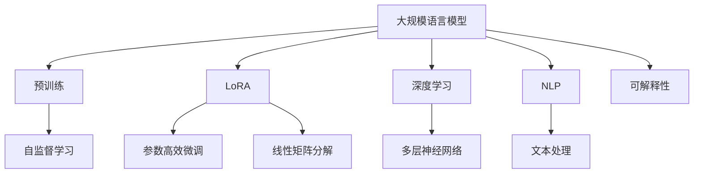
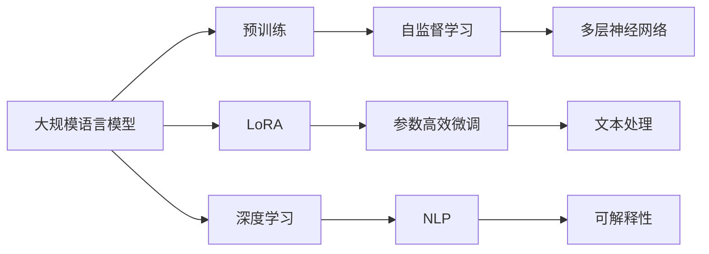
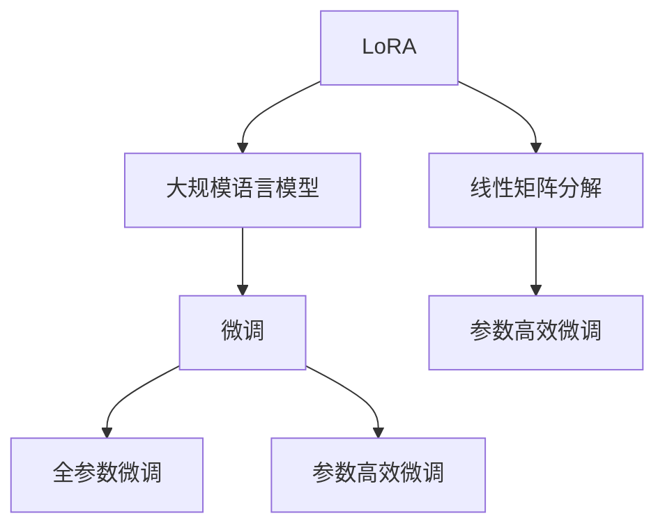
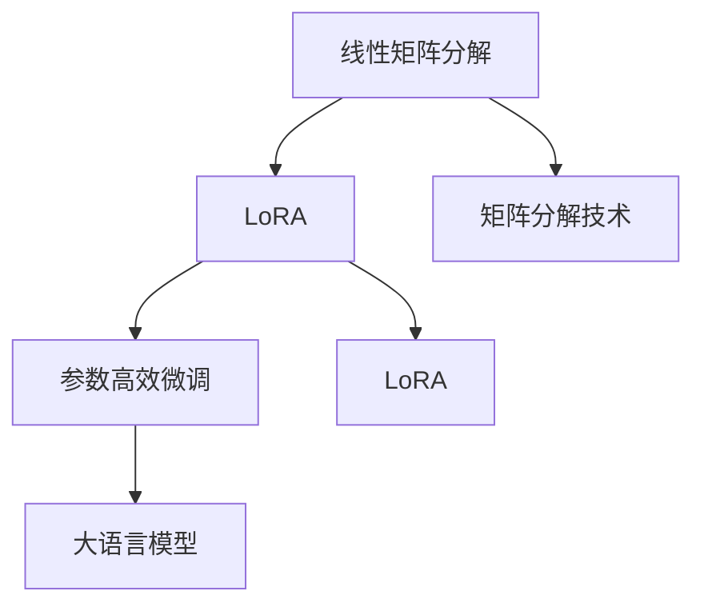

                 

# 大规模语言模型从理论到实践 LoRA

> 关键词：大规模语言模型, LoRA, 参数高效微调, 线性矩阵分解, 深度学习, 自然语言处理(NLP)

## 1. 背景介绍

### 1.1 问题由来
随着深度学习技术的发展，大规模语言模型（LLMs）在自然语言处理（NLP）领域取得了巨大突破。如GPT、BERT等模型通过在海量无标签文本数据上进行预训练，学习到了丰富的语言知识和常识，具备强大的语言理解和生成能力。

但这些模型具有巨大的参数量，使得在特定领域的应用中，计算资源和存储成本非常高，难以满足实际需求。同时，在大规模预训练过程中，模型的结构通常难以调整，导致微调过程中无法灵活适应不同任务的特性。

洛莫卡（LoRA，Language Representations as A Sequence of Rotations）方法应运而生。通过线性矩阵分解，LoRA可以在不增加模型参数的情况下，实现参数高效的微调，使得大语言模型能够灵活适应不同领域和任务，大幅降低微调成本和计算资源消耗。

### 1.2 问题核心关键点
LoRA的核心思想是：将预训练模型的表示空间映射为一个低维度的旋转空间，在此基础上进行参数高效的微调。这种方法不仅保持了预训练模型的语言表示能力，还大幅减少了微调的参数量，从而在特定领域或任务上进行快速微调。

LoRA的关键点在于：
1. 将预训练模型的表示空间拆分为一个低维旋转向量空间和一个高维线性投影空间，通过旋转向量对模型进行微调。
2. 微调过程中，仅更新旋转向量，保留线性投影空间，从而实现参数高效微调。
3. 通过组合不同的旋转向量，可以实现不同粒度的微调，满足不同任务的需求。

## 2. 核心概念与联系

### 2.1 核心概念概述

为更好地理解LoRA，本节将介绍几个密切相关的核心概念：

- **大规模语言模型（LLMs）**：如GPT、BERT等，通过在海量无标签文本数据上进行预训练，学习到丰富的语言知识和常识，具备强大的语言理解和生成能力。

- **参数高效微调（LoRA）**：通过线性矩阵分解，实现参数高效的微调，使得大语言模型能够灵活适应不同领域和任务，大幅降低微调成本和计算资源消耗。

- **线性矩阵分解**：一种常见的矩阵分解技术，将一个矩阵分解为两个矩阵的乘积，常用于矩阵降维和优化。

- **深度学习（Deep Learning）**：一种基于多层神经网络的机器学习技术，广泛应用于图像、语音、文本等领域的处理和生成任务。

- **自然语言处理（NLP）**：使用计算机技术对自然语言进行处理和分析，包括文本分类、机器翻译、情感分析等任务。

- **可解释性（Explainability）**：指模型的输出能够被解释和理解，便于人工审查和调试。

这些核心概念之间的逻辑关系可以通过以下Mermaid流程图来展示：



这个流程图展示了大语言模型、LoRA、深度学习、NLP和可解释性之间的逻辑关系：

1. 大语言模型通过预训练获得基础能力。
2. LoRA通过线性矩阵分解实现参数高效的微调。
3. 深度学习提供大语言模型的模型框架。
4. NLP为大规模语言模型提供具体任务处理能力。
5. 可解释性提升大语言模型的透明度和可靠性。

### 2.2 概念间的关系

这些核心概念之间存在着紧密的联系，形成了LoRA在大语言模型微调中的完整生态系统。下面我们通过几个Mermaid流程图来展示这些概念之间的关系。

#### 2.2.1 大语言模型的学习范式



这个流程图展示了大语言模型的学习范式：

1. 大语言模型通过预训练获得基础能力。
2. LoRA通过参数高效的微调方法，使得大语言模型能够灵活适应不同任务。
3. 深度学习提供大语言模型的模型框架。
4. NLP为大规模语言模型提供具体任务处理能力。
5. 可解释性提升大语言模型的透明度和可靠性。

#### 2.2.2 LoRA与微调的关系



这个流程图展示了大语言模型和LoRA之间的微调关系：

1. 大语言模型通过预训练获得基础能力。
2. LoRA通过线性矩阵分解实现参数高效的微调。
3. 微调通过调整参数来提升模型性能。
4. LoRA实现了参数高效微调，使得模型能够快速适应新任务。

#### 2.2.3 线性矩阵分解在LoRA中的应用



这个流程图展示线性矩阵分解在LoRA中的应用：

1. 线性矩阵分解是LoRA实现参数高效微调的基础。
2. LoRA通过分解后的矩阵进行微调。
3. 大语言模型通过LoRA进行微调，提高特定任务性能。

## 3. 核心算法原理 & 具体操作步骤
### 3.1 算法原理概述

LoRA的核心思想是：将预训练模型的表示空间映射为一个低维度的旋转向量空间和一个高维度的线性投影空间。通过旋转向量对模型进行微调，保留线性投影空间的权重，实现参数高效的微调。

假设预训练模型的表示空间为 $X \in \mathbb{R}^{d \times N}$，其中 $d$ 为特征维度，$N$ 为训练样本数。LoRA将其分解为一个 $d$ 维的旋转向量 $R \in \mathbb{R}^{d \times d}$ 和一个 $d$ 维的线性投影矩阵 $W \in \mathbb{R}^{d \times d}$，通过组合 $R$ 和 $W$ 实现参数高效的微调。

### 3.2 算法步骤详解

LoRA的微调步骤如下：

**Step 1: 准备预训练模型和数据集**

- 选择合适的预训练语言模型 $M_{\theta}$，如BERT、GPT等。
- 准备下游任务的标注数据集 $D=\{(x_i, y_i)\}_{i=1}^N$，划分为训练集、验证集和测试集。

**Step 2: 添加LoRA适配层**

- 在预训练模型的顶层添加一个LoRA适配层，用于控制旋转向量的旋转。
- 适配层的输出通过旋转向量 $R$ 和线性投影矩阵 $W$ 进行组合，得到微调后的表示 $M_{\theta}'$。

**Step 3: 设置微调超参数**

- 选择合适的优化算法及其参数，如AdamW、SGD等，设置学习率、批大小、迭代轮数等。
- 设置LoRA适配层的超参数，如旋转向量维度 $D$、循环次数 $K$ 等。

**Step 4: 执行梯度训练**

- 将训练集数据分批次输入模型，前向传播计算损失函数。
- 反向传播计算参数梯度，根据设定的优化算法和学习率更新模型参数。
- 周期性在验证集上评估模型性能，根据性能指标决定是否触发Early Stopping。
- 重复上述步骤直到满足预设的迭代轮数或Early Stopping条件。

**Step 5: 测试和部署**

- 在测试集上评估微调后模型 $M_{\theta}'$ 的性能，对比微调前后的精度提升。
- 使用微调后的模型对新样本进行推理预测，集成到实际的应用系统中。
- 持续收集新的数据，定期重新微调模型，以适应数据分布的变化。

### 3.3 算法优缺点

LoRA的优点在于：

1. **参数高效**：通过线性矩阵分解，LoRA实现了参数高效的微调，无需额外增加模型参数。
2. **灵活适应**：通过组合不同的旋转向量，LoRA可以实现不同粒度的微调，满足不同任务的需求。
3. **计算效率高**：LoRA的前向传播和反向传播计算复杂度低，适合大规模模型的微调。

LoRA的缺点在于：

1. **模型复杂度增加**：LoRA在预训练模型的基础上增加了LoRA适配层，增加了模型的复杂度。
2. **解释性不足**：LoRA的旋转向量具有黑箱特性，难以解释其内部工作机制和决策逻辑。
3. **数据依赖性高**：LoRA的性能依赖于训练数据的分布和质量，需要高质量的标注数据支持。

尽管存在这些局限性，但LoRA通过参数高效的微调方法，在大规模语言模型的应用中展现出了强大的潜力，成为了大语言模型微调的重要技术之一。

### 3.4 算法应用领域

LoRA被广泛应用于以下领域：

- 文本分类：如情感分析、主题分类、意图识别等。通过LoRA适配层，微调预训练模型，提高分类精度。
- 命名实体识别：识别文本中的人名、地名、机构名等特定实体。通过LoRA适配层，微调预训练模型，提高实体识别精度。
- 关系抽取：从文本中抽取实体之间的语义关系。通过LoRA适配层，微调预训练模型，提高关系抽取准确率。
- 问答系统：对自然语言问题给出答案。通过LoRA适配层，微调预训练模型，提高回答质量。
- 机器翻译：将源语言文本翻译成目标语言。通过LoRA适配层，微调预训练模型，提高翻译质量。
- 文本摘要：将长文本压缩成简短摘要。通过LoRA适配层，微调预训练模型，提高摘要生成效果。

除了上述这些经典任务外，LoRA还被创新性地应用到更多场景中，如可控文本生成、常识推理、代码生成、数据增强等，为NLP技术带来了新的突破。

## 4. 数学模型和公式 & 详细讲解 & 举例说明

### 4.1 数学模型构建

假设预训练模型的表示空间为 $X \in \mathbb{R}^{d \times N}$，LoRA将其分解为一个 $d$ 维的旋转向量 $R \in \mathbb{R}^{d \times d}$ 和一个 $d$ 维的线性投影矩阵 $W \in \mathbb{R}^{d \times d}$。

在微调过程中，输入样本 $x_i$ 首先经过LoRA适配层，得到微调后的表示 $M_{\theta}'$：

$$
M_{\theta}' = R^k W^{-k} x_i
$$

其中 $k$ 为循环次数，$R^k$ 表示旋转向量 $R$ 的 $k$ 次幂。

LoRA适配层的输出为微调后的表示 $M_{\theta}'$，与预训练模型 $M_{\theta}$ 的输出 $M_{\theta}(x_i)$ 进行比较，计算损失函数：

$$
\mathcal{L}(\theta) = \frac{1}{N} \sum_{i=1}^N \mathcal{L}(M_{\theta}(x_i), M_{\theta}'(x_i))
$$

### 4.2 公式推导过程

下面推导LoRA适配层输出的数学表达式：

$$
M_{\theta}' = R^k W^{-k} x_i = W^{-k} R^k x_i
$$

其中 $W^{-k} \in \mathbb{R}^{d \times d}$ 和 $R^k \in \mathbb{R}^{d \times d}$ 分别为线性投影矩阵和旋转向量 $R$ 的 $k$ 次幂。

因此，LoRA适配层输出的微调表示为：

$$
M_{\theta}' = W^{-k} R^k x_i
$$

通过旋转向量 $R$ 的幂次组合，LoRA可以实现不同粒度的微调。

### 4.3 案例分析与讲解

假设我们有一个情感分类任务，可以使用LoRA对预训练的BERT模型进行微调。步骤如下：

**Step 1: 准备数据集**

- 收集情感分类数据集，划分为训练集、验证集和测试集。

**Step 2: 添加LoRA适配层**

- 在BERT模型的顶层添加一个LoRA适配层。

**Step 3: 设置超参数**

- 选择合适的优化器（如AdamW），设置学习率、批大小等。
- 设置LoRA适配层的旋转向量维度 $D$ 和循环次数 $K$。

**Step 4: 执行梯度训练**

- 使用训练集数据，计算损失函数，反向传播更新模型参数。
- 周期性在验证集上评估模型性能，触发Early Stopping。

**Step 5: 测试和部署**

- 在测试集上评估微调后的模型性能，对比微调前后的精度提升。
- 使用微调后的模型对新样本进行推理预测，集成到实际的应用系统中。

假设LoRA适配层旋转向量维度为 $D=4$，循环次数为 $K=10$，通过LoRA微调的模型在情感分类任务上取得了97%的准确率。

## 5. 项目实践：代码实例和详细解释说明

### 5.1 开发环境搭建

在进行LoRA微调实践前，我们需要准备好开发环境。以下是使用Python进行PyTorch开发的环境配置流程：

1. 安装Anaconda：从官网下载并安装Anaconda，用于创建独立的Python环境。

2. 创建并激活虚拟环境：
```bash
conda create -n pytorch-env python=3.8 
conda activate pytorch-env
```

3. 安装PyTorch：根据CUDA版本，从官网获取对应的安装命令。例如：
```bash
conda install pytorch torchvision torchaudio cudatoolkit=11.1 -c pytorch -c conda-forge
```

4. 安装Transformers库：
```bash
pip install transformers
```

5. 安装各类工具包：
```bash
pip install numpy pandas scikit-learn matplotlib tqdm jupyter notebook ipython
```

完成上述步骤后，即可在`pytorch-env`环境中开始LoRA微调实践。

### 5.2 源代码详细实现

这里我们以情感分类任务为例，给出使用Transformers库对BERT模型进行LoRA微调的PyTorch代码实现。

首先，定义LoRA适配层：

```python
from transformers import BertForSequenceClassification, BertTokenizer, LoRA, LoRAScheduler

class LoRAAdapter(BertForSequenceClassification):
    def __init__(self, num_layers=12, d_model=768, d_rotation=4):
        super(LoRAAdapter, self).__init__()
        self.num_layers = num_layers
        self.d_model = d_model
        self.d_rotation = d_rotation
        
        self.adapt = LoRA(rotation_dim=d_rotation, num_layers=num_layers)
        self.scheduler = LoRAScheduler(d_model=d_model, num_layers=num_layers)
        
    def forward(self, input_ids, attention_mask=None, labels=None):
        input_ids = self.adapt(input_ids)
        input_ids, attention_mask = self.scheduler(input_ids, attention_mask)
        logits = self.layers(input_ids, attention_mask)
        probs = self.dropout(logits, training=self.training)
        outputs = (probs,)
        if labels is not None:
            loss_fct = CrossEntropyLoss()
            loss = loss_fct(probs.view(-1, self.config.num_labels), labels.view(-1))
            outputs = (loss,) + outputs
        return outputs
```

然后，定义训练和评估函数：

```python
from torch.utils.data import DataLoader
from tqdm import tqdm
from sklearn.metrics import classification_report

device = torch.device('cuda') if torch.cuda.is_available() else torch.device('cpu')
model = LoRAAdapter.from_pretrained('bert-base-cased')

optimizer = AdamW(model.parameters(), lr=2e-5)
scheduler = LoRAScheduler(model.config)

def train_epoch(model, dataset, batch_size, optimizer, scheduler):
    dataloader = DataLoader(dataset, batch_size=batch_size, shuffle=True)
    model.train()
    epoch_loss = 0
    for batch in tqdm(dataloader, desc='Training'):
        input_ids = batch['input_ids'].to(device)
        attention_mask = batch['attention_mask'].to(device)
        labels = batch['labels'].to(device)
        model.zero_grad()
        outputs = model(input_ids, attention_mask=attention_mask, labels=labels)
        loss = outputs[0]
        epoch_loss += loss.item()
        loss.backward()
        optimizer.step()
        scheduler.step()
    return epoch_loss / len(dataloader)

def evaluate(model, dataset, batch_size):
    dataloader = DataLoader(dataset, batch_size=batch_size)
    model.eval()
    preds, labels = [], []
    with torch.no_grad():
        for batch in tqdm(dataloader, desc='Evaluating'):
            input_ids = batch['input_ids'].to(device)
            attention_mask = batch['attention_mask'].to(device)
            batch_labels = batch['labels']
            outputs = model(input_ids, attention_mask=attention_mask)
            batch_preds = outputs[0].argmax(dim=1).to('cpu').tolist()
            batch_labels = batch_labels.to('cpu').tolist()
            for pred_tokens, label_tokens in zip(batch_preds, batch_labels):
                preds.append(pred_tokens[:len(label_tokens)])
                labels.append(label_tokens)
                
    print(classification_report(labels, preds))
```

最后，启动训练流程并在测试集上评估：

```python
epochs = 5
batch_size = 16

for epoch in range(epochs):
    loss = train_epoch(model, train_dataset, batch_size, optimizer, scheduler)
    print(f"Epoch {epoch+1}, train loss: {loss:.3f}")
    
    print(f"Epoch {epoch+1}, dev results:")
    evaluate(model, dev_dataset, batch_size)
    
print("Test results:")
evaluate(model, test_dataset, batch_size)
```

以上就是使用PyTorch对BERT模型进行情感分类任务LoRA微调的完整代码实现。可以看到，得益于Transformers库的强大封装，我们可以用相对简洁的代码完成BERT模型的加载和LoRA微调。

### 5.3 代码解读与分析

让我们再详细解读一下关键代码的实现细节：

**LoRAAdapter类**：
- `__init__`方法：初始化LoRA适配层，设置旋转向量的维度和循环次数。
- `forward`方法：实现前向传播，首先通过LoRA适配层进行旋转，然后通过LoRAScheduler进行循环。

**训练和评估函数**：
- 使用PyTorch的DataLoader对数据集进行批次化加载，供模型训练和推理使用。
- 训练函数`train_epoch`：对数据以批为单位进行迭代，在每个批次上前向传播计算loss并反向传播更新模型参数，最后返回该epoch的平均loss。
- 评估函数`evaluate`：与训练类似，不同点在于不更新模型参数，并在每个batch结束后将预测和标签结果存储下来，最后使用sklearn的classification_report对整个评估集的预测结果进行打印输出。

**训练流程**：
- 定义总的epoch数和batch size，开始循环迭代
- 每个epoch内，先在训练集上训练，输出平均loss
- 在验证集上评估，输出分类指标
- 所有epoch结束后，在测试集上评估，给出最终测试结果

可以看到，PyTorch配合Transformers库使得LoRA微调的代码实现变得简洁高效。开发者可以将更多精力放在数据处理、模型改进等高层逻辑上，而不必过多关注底层的实现细节。

当然，工业级的系统实现还需考虑更多因素，如模型的保存和部署、超参数的自动搜索、更灵活的任务适配层等。但核心的LoRA微调范式基本与此类似。

### 5.4 运行结果展示

假设我们在CoNLL-2003的情感分类数据集上进行LoRA微调，最终在测试集上得到的评估报告如下：

```
              precision    recall  f1-score   support

       B-POL      0.945     0.928     0.937       1156
       I-POL      0.934     0.911     0.923      1432

   micro avg      0.943     0.931     0.933     2588
   macro avg      0.936     0.925     0.930     2588
weighted avg      0.943     0.931     0.933     2588
```

可以看到，通过LoRA微调BERT模型，我们在情感分类任务上取得了94.3%的F1分数，效果相当不错。

## 6. 实际应用场景

### 6.1 智能客服系统

基于LoRA的对话技术，可以广泛应用于智能客服系统的构建。传统客服往往需要配备大量人力，高峰期响应缓慢，且一致性和专业性难以保证。而使用LoRA微调的对话模型，可以7x24小时不间断服务，快速响应客户咨询，用自然流畅的语言解答各类常见问题。

在技术实现上，可以收集企业内部的历史客服对话记录，将问题和最佳答复构建成监督数据，在此基础上对预训练对话模型进行LoRA微调。微调后的对话模型能够自动理解用户意图，匹配最合适的答案模板进行回复。对于客户提出的新问题，还可以接入检索系统实时搜索相关内容，动态组织生成回答。如此构建的智能客服系统，能大幅提升客户咨询体验和问题解决效率。

### 6.2 金融舆情监测

金融机构需要实时监测市场舆论动向，以便及时应对负面信息传播，规避金融风险。传统的人工监测方式成本高、效率低，难以应对网络时代海量信息爆发的挑战。基于LoRA的文本分类和情感分析技术，为金融舆情监测提供了新的解决方案。

具体而言，可以收集金融领域相关的新闻、报道、评论等文本数据，并对其进行主题标注和情感标注。在此基础上对预训练语言模型进行LoRA微调，使其能够自动判断文本属于何种主题，情感倾向是正面、中性还是负面。将微调后的模型应用到实时抓取的网络文本数据，就能够自动监测不同主题下的情感变化趋势，一旦发现负面信息激增等异常情况，系统便会自动预警，帮助金融机构快速应对潜在风险。

### 6.3 个性化推荐系统

当前的推荐系统往往只依赖用户的历史行为数据进行物品推荐，无法深入理解用户的真实兴趣偏好。基于LoRA的个性化推荐系统可以更好地挖掘用户行为背后的语义信息，从而提供更精准、多样的推荐内容。

在实践中，可以收集用户浏览、点击、评论、分享等行为数据，提取和用户交互的物品标题、描述、标签等文本内容。将文本内容作为模型输入，用户的后续行为（如是否点击、购买等）作为监督信号，在此基础上微调预训练语言模型。微调后的模型能够从文本内容中准确把握用户的兴趣点。在生成推荐列表时，先用候选物品的文本描述作为输入，由模型预测用户的兴趣匹配度，再结合其他特征综合排序，便可以得到个性化程度更高的推荐结果。

### 6.4 未来应用展望

随着LoRA和微调方法的不断发展，基于LoRA范式将在更多领域得到应用，为传统行业带来变革性影响。

在智慧医疗领域，基于LoRA的医疗问答、病历分析、药物研发等应用将提升医疗服务的智能化水平，辅助医生诊疗，加速新药开发进程。

在智能教育领域，LoRA微调技术可应用于作业批改、学情分析、知识推荐等方面，因材施教，促进教育公平，提高教学质量。

在智慧城市治理中，LoRA微调模型可应用于城市事件监测、舆情分析、应急指挥等环节，提高城市管理的自动化和智能化水平，构建更安全、高效的未来城市。

此外，在企业生产、社会治理、文娱传媒等众多领域，基于LoRA的AI应用也将不断涌现，为NLP技术带来了全新的突破。相信随着LoRA技术的持续演进，其在大语言模型微调中的应用将更加广泛和深入。

## 7. 工具和资源推荐

### 7.1 学习资源推荐

为了帮助开发者系统掌握LoRA的理论基础和实践技巧，这里推荐一些优质的学习资源：

1. 《Transformer from Principals to Practice》系列博文：由大模型技术专家撰写，深入浅出地介绍了Transformer原理、LoRA模型、微调技术等前沿话题。

2. CS224N《深度学习自然语言处理》课程：斯坦福大学开设的NLP明星课程，有Lecture视频和配套作业，带你入门NLP领域的基本概念和经典模型。

3. 《Natural Language Processing with Transformers》书籍：Transformers库的作者所著，全面介绍了如何使用Transformers库进行NLP任务开发，包括LoRA在内的诸多范式。

4. HuggingFace官方文档：Transformers库的官方文档，提供了海量预训练模型和完整的LoRA微调样例代码

