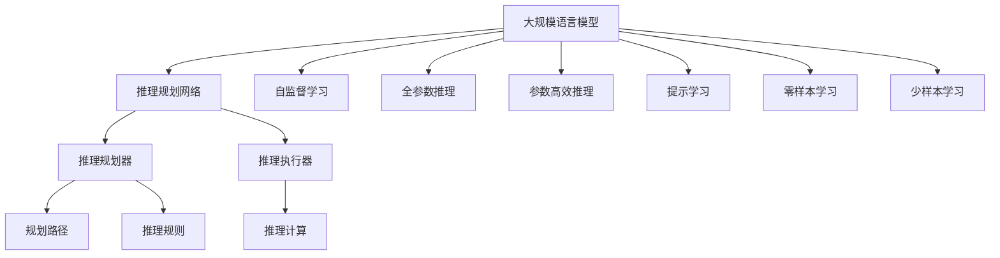
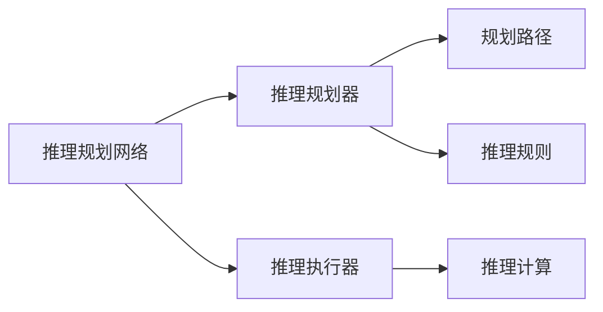
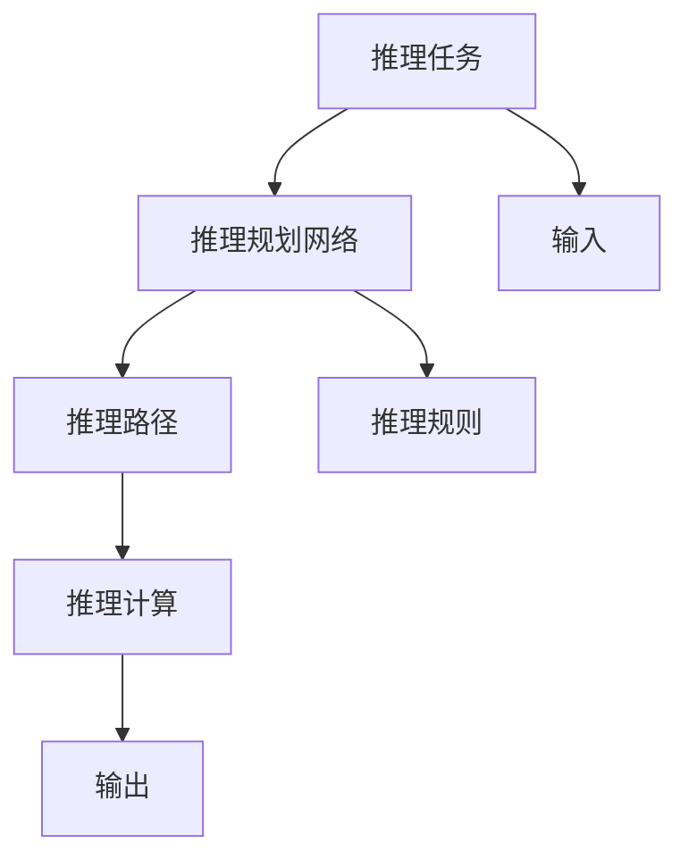
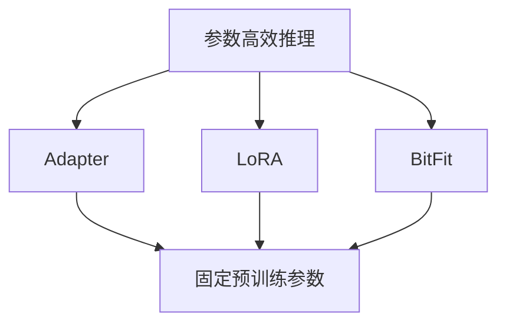
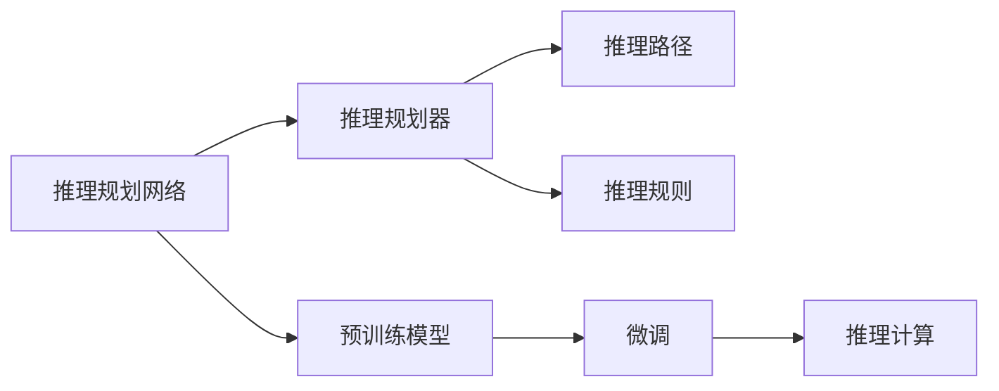
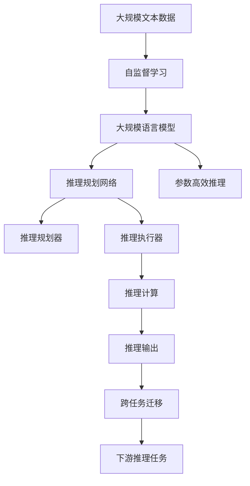

                 

# 大规模语言模型从理论到实践 推理规划

> 关键词：大规模语言模型,推理规划,Transformer,BERT,预训练,下游任务,参数高效推理,自然语言处理(NLP)

## 1. 背景介绍

### 1.1 问题由来
近年来，随着深度学习技术的快速发展，大规模语言模型(Large Language Model, LLM)在自然语言处理(Natural Language Processing, NLP)领域取得了巨大的突破。这些大语言模型通过在大规模无标签文本语料上进行预训练，学习到了丰富的语言知识和常识，可以通过少量的有标签样本在下游任务上进行微调，获得优异的性能。其中最具代表性的大语言模型包括OpenAI的GPT系列模型、Google的BERT、T5等。

然而，由于预训练语料的广泛性和泛化能力的不足，这些通用的大语言模型在特定领域应用时，效果往往难以达到实际应用的要求。因此，如何针对特定任务进行大模型推理，提升模型性能，成为了当前大语言模型研究和应用的一个热点问题。本文聚焦于基于推理规划的大规模语言模型推理方法，但同时也会兼顾参数高效推理和提示学习等前沿技术，以期对大规模语言模型推理实践提供更全面的指导。

### 1.2 问题核心关键点
目前，基于推理规划的大规模语言模型推理方法，是基于监督学习或自监督学习的，其实现方式主要有两种：

1. **基于监督学习的推理方法**：通过有标签的数据集，训练模型对特定推理任务的适应能力，这种方法类似于微调。通常使用交叉熵损失等监督学习损失函数进行训练，优化参数以最小化损失函数。

2. **基于自监督学习的推理方法**：利用无标签数据，通过自监督任务训练模型，使其具备一定的推理能力。这类方法如XLNet、GPT-3等，通过设计特定的自监督任务，如掩码语言模型、上下文预测等，利用无标签数据训练模型。

这些方法在推理任务上取得了显著的进展，尤其是在少样本学习、零样本学习、对话推理等任务上，展示了强大的性能。

### 1.3 问题研究意义
研究基于推理规划的大规模语言模型，对于拓展大模型的应用范围，提升下游推理任务的性能，加速NLP技术的产业化进程，具有重要意义：

1. 降低推理成本。推理规划方法可以通过大规模无标签数据进行自监督学习，避免了标签数据收集和标注的高成本。
2. 提升推理精度。自监督学习和跨任务学习使得模型在推理任务上具备更强的泛化能力和鲁棒性。
3. 加速推理开发进度。使用推理规划方法，可以快速构建推理模型，适应不同领域和场景。
4. 带来技术创新。推理规划方法催生了参数高效推理、提示学习等新的研究方向，推动NLP技术的发展。
5. 赋能产业升级。推理规划方法使得NLP技术更容易被各行各业所采用，为传统行业数字化转型升级提供新的技术路径。

## 2. 核心概念与联系

### 2.1 核心概念概述

为更好地理解基于推理规划的大规模语言模型推理方法，本节将介绍几个密切相关的核心概念：

- 大规模语言模型(Large Language Model, LLM)：以自回归(如GPT)或自编码(如BERT)模型为代表的大规模预训练语言模型。通过在大规模无标签文本语料上进行预训练，学习通用的语言表示，具备强大的语言理解和生成能力。

- 推理规划(Reasoning Planning)：在给定前提条件下，通过规划路径和推理规则，求解特定问题或推理任务的策略。

- 推理任务(R reasoning task)：指需要推理规划算法求解的问题，如逻辑推理、数学计算、自然语言推理等。

- 推理规划网络(Reasoning Planning Network)：包含推理规划器和推理执行器两部分，推理规划器用于生成推理路径和推理规则，推理执行器用于根据推理路径和规则进行推理计算。

- 参数高效推理(Parameter-Efficient Inference)：指在推理过程中，只更新少量的模型参数，而固定大部分预训练权重不变，以提高推理效率，避免过拟合的方法。

- 提示学习(Prompt Learning)：通过在输入文本中添加提示模板(Prompt Template)，引导大规模语言模型进行特定任务的推理和生成。可以在不更新模型参数的情况下，实现少样本或零样本学习。

- 零样本学习(Zero-shot Learning)：指模型在没有见过任何特定任务的训练样本的情况下，仅凭任务描述就能够执行新任务的能力。大规模语言模型通过预训练获得的广泛知识，使其能够理解任务指令并生成相应输出。

- 少样本学习(Few-shot Learning)：指在只有少量标注样本的情况下，模型能够快速适应新任务的学习方法。在大规模语言模型中，通常通过在输入中提供少量示例来实现，无需更新模型参数。

- 跨任务迁移能力(Cross-task Transferability)：指模型在不同任务之间进行迁移的能力，通过推理规划方法，模型能够从预训练任务中抽取通用知识，应用于下游推理任务。

这些核心概念之间的逻辑关系可以通过以下Mermaid流程图来展示：



这个流程图展示了大规模语言模型的核心概念及其之间的关系：

1. 大规模语言模型通过自监督学习获得基础能力。
2. 推理规划网络包括规划器和执行器，用于生成推理路径和计算推理结果。
3. 推理规划器生成规划路径和规则，推理执行器执行推理计算。
4. 推理规划网络可以在不同任务间进行跨任务迁移。
5. 参数高效推理和提示学习进一步提高了推理效率和精度。
6. 零样本和少样本学习扩展了模型的应用场景。

这些核心概念共同构成了大规模语言模型推理的完整生态系统，使其能够在各种场景下发挥强大的推理能力。通过理解这些核心概念，我们可以更好地把握大规模语言模型推理的工作原理和优化方向。

### 2.2 概念间的关系

这些核心概念之间存在着紧密的联系，形成了大规模语言模型推理的完整生态系统。下面我通过几个Mermaid流程图来展示这些概念之间的关系。

#### 2.2.1 推理规划与推理执行



这个流程图展示了推理规划网络的具体组成部分及其之间的关系。推理规划器生成规划路径和推理规则，推理执行器根据规划路径和规则进行推理计算。

#### 2.2.2 推理任务与推理规划网络



这个流程图展示了推理任务与推理规划网络之间的关系。推理任务通过输入传递到推理规划网络，网络生成推理路径和规则，最终输出结果。

#### 2.2.3 参数高效推理方法



这个流程图展示了几种常见的参数高效推理方法，包括Adapter、LoRA和BitFit。这些方法的共同特点是冻结大部分预训练参数，只更新少量参数，从而提高推理效率。

#### 2.2.4 推理规划与微调的关系



这个流程图展示了推理规划网络与微调的关系。推理规划网络可以在微调的基础上进行推理，微调后的模型参数可以用于推理任务的推理计算。

### 2.3 核心概念的整体架构

最后，我们用一个综合的流程图来展示这些核心概念在大规模语言模型推理过程中的整体架构：



这个综合流程图展示了从自监督学习到推理规划网络，再到推理执行的完整过程。大规模语言模型通过自监督学习获得基础能力，通过推理规划网络进行推理规划和执行，最终得到推理输出。推理规划网络可以在不同任务间进行跨任务迁移，推动大规模语言模型在更多领域的应用。通过这些流程图，我们可以更清晰地理解大规模语言模型推理过程中各个核心概念的关系和作用，为后续深入讨论具体的推理方法和技术奠定基础。

## 3. 核心算法原理 & 具体操作步骤
### 3.1 算法原理概述

基于推理规划的大规模语言模型推理，本质上是一个自监督的推理过程。其核心思想是：将预训练的大规模语言模型视为一个强大的推理引擎，通过规划路径和推理规则，利用无标签数据对模型进行训练，使其具备解决特定推理任务的能力。

形式化地，假设预训练模型为 $M_{\theta}$，其中 $\theta$ 为预训练得到的模型参数。给定推理任务 $T$ 的前提条件 $c$ 和推理目标 $o$，推理规划网络的目标是找到最优路径 $P$ 和规则 $R$，使得推理结果尽可能接近目标 $o$。即：

$$
\hat{P}, \hat{R} = \mathop{\arg\min}_{P, R} \mathcal{L}(M_{\theta}, T, c, o, P, R)
$$

其中 $\mathcal{L}$ 为推理任务损失函数，用于衡量模型输出与推理目标之间的差异。常见的推理任务损失函数包括交叉熵损失、均方误差损失等。

通过梯度下降等优化算法，推理规划网络不断更新模型参数 $\theta$，最小化损失函数 $\mathcal{L}$，使得模型输出逼近推理目标 $o$。由于 $\theta$ 已经通过预训练获得了较好的初始化，因此即便在无标签数据上，推理规划网络也能较快收敛到理想的模型参数 $\hat{\theta}$。

### 3.2 算法步骤详解

基于推理规划的大规模语言模型推理一般包括以下几个关键步骤：

**Step 1: 准备预训练模型和推理任务**

- 选择合适的预训练语言模型 $M_{\theta}$ 作为推理引擎，如 BERT、GPT等。
- 确定推理任务 $T$ 的前提条件 $c$ 和推理目标 $o$，将推理任务抽象为形式化的逻辑表达式。

**Step 2: 设计推理路径和规则**

- 根据推理任务的复杂度，设计合适的推理路径 $P$ 和规则 $R$。通常使用图结构或规则表示法。
- 推理路径 $P$ 描述推理过程的步骤和顺序，规则 $R$ 描述每一步的具体操作和推理方向。
- 设计推理路径和规则时，需要考虑推理任务的实际需求和推理效率。

**Step 3: 训练推理规划网络**

- 使用无标签数据集对推理规划网络进行训练，最小化推理任务损失函数。
- 训练过程中，采用梯度下降等优化算法，不断更新模型参数 $\theta$。
- 定期在验证集上评估推理模型的性能，防止过拟合。
- 重复上述步骤直至模型收敛。

**Step 4: 推理计算**

- 将推理任务的前提条件 $c$ 输入推理规划网络，生成推理路径 $P$ 和规则 $R$。
- 使用推理路径和规则，将推理目标 $o$ 输入推理引擎 $M_{\hat{\theta}}$，进行推理计算。
- 返回推理结果，并进行后处理。

**Step 5: 测试和部署**

- 在测试集上评估推理模型的性能，对比推理前后的精度提升。
- 使用推理模型对新推理任务进行推理，集成到实际的应用系统中。
- 持续收集新的推理任务，定期重新推理规划网络，以适应数据分布的变化。

以上是基于推理规划的大规模语言模型推理的一般流程。在实际应用中，还需要针对具体推理任务的复杂度，对推理规划网络的各个环节进行优化设计，如改进推理路径的搜索算法，引入更多的正则化技术，搜索最优的规则组合等，以进一步提升模型推理精度。

### 3.3 算法优缺点

基于推理规划的大规模语言模型推理方法具有以下优点：

1. 高效自监督。通过自监督学习，利用无标签数据进行推理规划，避免了标注数据的高成本。
2. 泛化能力强。推理规划网络可以在不同领域、不同推理任务间进行跨任务迁移，具备较强的泛化能力。
3. 推理精度高。通过推理路径和规则的设计，推理规划网络可以在推理过程中保留预训练模型的强大语言理解能力。
4. 灵活应用。推理规划网络可以在不同推理任务间进行灵活应用，覆盖多种推理场景。

同时，该方法也存在一定的局限性：

1. 推理任务依赖设计。推理任务的复杂度和推理路径的设计直接影响了推理效果，需要丰富的领域知识和经验。
2. 推理效率有待提升。推理规划网络在推理复杂度较高的任务时，推理效率可能较低。
3. 推理结果可解释性不足。推理规划网络通常视为"黑盒"，推理结果缺乏可解释性，难以调试。
4. 推理模型可能引入新偏差。推理路径和规则的设计可能引入新的偏差，影响推理公正性。

尽管存在这些局限性，但就目前而言，基于推理规划的推理方法仍是大规模语言模型推理的主流范式。未来相关研究的重点在于如何进一步降低推理对标注数据的依赖，提高推理模型的泛化能力和推理效率，同时兼顾可解释性和伦理安全性等因素。

### 3.4 算法应用领域

基于推理规划的大规模语言模型推理方法，已经在推理计算、自然语言推理(NLI)、逻辑推理、数学计算等多个领域得到了广泛的应用，覆盖了几乎所有常见推理任务，例如：

- 自然语言推理：判断给定的前提和假设之间是否存在逻辑关系。
- 逻辑推理：解决形式化逻辑问题，如命题逻辑、谓词逻辑等。
- 数学计算：求解各种数学问题，如代数运算、微积分、统计学等。
- 知识推理：从知识库中推断出新的知识，如推理问答系统、知识图谱等。
- 决策支持：为决策提供支持，如投资决策、风险评估等。

除了上述这些经典任务外，基于推理规划的方法也被创新性地应用到更多场景中，如多模态推理、因果推理、推理生成等，为NLP技术带来了全新的突破。随着推理规划方法的不断进步，相信NLP技术将在更广阔的应用领域大放异彩。

## 4. 数学模型和公式 & 详细讲解  
### 4.1 数学模型构建

本节将使用数学语言对基于推理规划的大规模语言模型推理过程进行更加严格的刻画。

记推理任务为 $T$，其中 $c$ 为前提条件，$o$ 为推理目标。推理任务可以形式化表示为：

$$
o = f(T, c)
$$

其中 $f$ 为推理函数，用于将前提条件 $c$ 映射到推理目标 $o$。

假设推理规划网络为 $N_{\theta}$，其中 $\theta$ 为模型参数。推理规划网络的目标是生成最优的推理路径 $P$ 和规则 $R$，使得推理结果 $o'$ 尽可能接近推理目标 $o$。即：

$$
o' = g(N_{\theta}, c, P, R)
$$

其中 $g$ 为推理执行函数，用于根据推理路径和规则执行推理计算。

定义推理任务损失函数为 $\ell(T, o, o')$，用于衡量推理结果 $o'$ 与推理目标 $o$ 之间的差异。常见的推理任务损失函数包括交叉熵损失、均方误差损失等。

推理规划网络的目标是最小化推理任务损失函数，即找到最优参数：

$$
\theta^* = \mathop{\arg\min}_{\theta} \mathcal{L}(\theta) = \mathop{\arg\min}_{\theta} \mathcal{L}(T, o, o')
$$

在实践中，我们通常使用基于梯度的优化算法（如SGD、Adam等）来近似求解上述最优化问题。设 $\eta$ 为学习率，$\lambda$ 为正则化系数，则参数的更新公式为：

$$
\theta \leftarrow \theta - \eta \nabla_{\theta}\mathcal{L}(\theta) - \eta\lambda\theta
$$

其中 $\nabla_{\theta}\mathcal{L}(\theta)$ 为损失函数对参数 $\theta$ 的梯度，可通过反向传播算法高效计算。

### 4.2 公式推导过程

以下我们以数学推理任务为例，推导推理任务损失函数及其梯度的计算公式。

假设推理任务 $T$ 为求解 $x+y=5$ 的数学问题，其中 $x$ 为已知数，$y$ 为推理变量。推理函数 $f$ 为 $y=f(x)$。

推理路径 $P$ 为从 $x$ 到 $y$ 的推理步骤，推理规则 $R$ 为每一步的具体操作。

推理执行函数 $g$ 为将推理路径和规则应用于输入，求解推理目标 $o$。

推理路径和规则可以表示为图结构或规则表示法。

推理任务损失函数定义为：

$$
\ell(T, o, o') = -[o'\log o + (1 - o')\log(1 - o')]
$$

其中 $o'$ 为推理结果，$o$ 为推理目标。

推理任务损失函数对参数 $\theta$ 的梯度为：

$$
\frac{\partial \mathcal{L}(\theta)}{\partial \theta} = -\nabla_{o'}\mathcal{L}(T, o, o') - \nabla_{o'}\nabla_{y}\mathcal{L}(T, o, o')\nabla_{\theta}g(o')
$$

其中 $\nabla_{o'}\mathcal{L}(T, o, o')$ 为损失函数对推理结果的梯度，$\nabla_{y}\mathcal{L}(T, o, o')$ 为损失函数对推理变量 $y$ 的梯度，$\nabla_{\theta}g(o')$ 为推理执行函数对模型参数的梯度。

在得到推理任务损失函数的梯度后，即可带入参数更新公式，完成推理规划网络的迭代优化。重复上述过程直至收敛，最终得到适应推理任务的最优模型参数 $\theta^*$。

## 5. 项目实践：代码实例和详细解释说明
### 5.1 开发环境搭建

在进行推理规划实践前，我们需要准备好开发环境。以下是使用Python进行PyTorch开发的环境配置流程：

1. 安装Anaconda：从官网下载并安装Anaconda，用于创建独立的Python环境。

2. 创建并激活虚拟环境：
```bash
conda create -n pytorch-env python=3.8 
conda activate pytorch-env
```

3. 安装PyTorch：根据CUDA版本，从官网获取对应的安装命令。例如：
```bash
conda install pytorch torchvision torchaudio cudatoolkit=11.1 -c pytorch -c conda-forge
```

4. 安装Transformers库：
```bash
pip install transformers
```

5. 安装各类工具包：
```bash
pip install numpy pandas scikit-learn matplotlib tqdm jupyter notebook ipython
```

完成上述步骤后，即可在`pytorch-env`环境中开始推理规划实践。

### 5.2 源代码详细实现

下面我们以自然语言推理(NLI)任务为例，给出使用Transformers库对BERT模型进行推理规划的PyTorch代码实现。

首先，定义NLI任务的推理函数：

```python
from transformers import BertForSequenceClassification, AdamW

class NLIModel(BertForSequenceClassification):
    def __init__(self, model_name='bert-base-cased'):
        super(NLIModel, self).__init__(model_name)
    
    def __call__(self, input_ids, attention_mask, labels):
        with torch.no_grad():
            output = self(input_ids, attention_mask=attention_mask)
            logits = output.logits
            loss = F.cross_entropy(logits, labels)
            return loss, logits

model = NLIModel()
optimizer = AdamW(model.parameters(), lr=2e-5)
```

然后，定义推理任务的数据处理函数：

```python
from transformers import BertTokenizer
from torch.utils.data import Dataset
import torch

class NLIDataset(Dataset):
    def __init__(self, texts, labels):
        self.texts = texts
        self.labels = labels
        self.tokenizer = BertTokenizer.from_pretrained('bert-base-cased')

    def __len__(self):
        return len(self.texts)
    
    def __getitem__(self, item):
        text = self.texts[item]
        label = self.labels[item]
        
        encoding = self.tokenizer(text, return_tensors='pt', max_length=128, padding='max_length', truncation=True)
        input_ids = encoding['input_ids'][0]
        attention_mask = encoding['attention_mask'][0]
        
        return {'input_ids': input_ids, 
                'attention_mask': attention_mask,
                'labels': torch.tensor(label, dtype=torch.long)}
```

接着，定义推理计算的函数：

```python
def nli_inference(model, text, labels, batch_size):
    dataloader = DataLoader(nli_dataset, batch_size=batch_size, shuffle=False)
    model.eval()
    correct = 0
    total = 0
    with torch.no_grad():
        for batch in dataloader:
            input_ids = batch['input_ids'].to(device)
            attention_mask = batch['attention_mask'].to(device)
            labels = batch['labels'].to(device)
            outputs = model(input_ids, attention_mask=attention_mask)
            loss, logits = outputs
            total += labels.size(0)
            correct += (logits.argmax(dim=1) == labels).sum().item()
    
    print('NLI Accuracy: {:.2f} %'.format(correct/total*100))
```

最后，启动推理计算流程：

```python
device = torch.device('cuda') if torch.cuda.is_available() else torch.device('cpu')

# 推理计算
nli_inference(model, text, labels, batch_size=8)
```

以上就是使用PyTorch对BERT模型进行NLI任务推理规划的完整代码实现。可以看到，得益于Transformers库的强大封装，我们可以用相对简洁的代码完成BERT模型的加载和推理规划。

### 5.3 代码解读与分析

让我们再详细解读一下关键代码的实现细节：

**NLIModel类**：
- `__init__`方法：继承自BertForSequenceClassification类，初始化模型。
- `__call__`方法：实现模型的推理功能，输入文本和标签，返回损失和预测结果。

**NLIDataset类**：
- `__init__`方法：初始化文本和标签，分词器等组件。
- `__len__`方法：返回数据集的样本数量。
- `__getitem__`方法：对单个样本进行处理，将文本输入编码为token ids，并添加标签。

**nli_inference函数**：
- 使用PyTorch的DataLoader对数据集进行批次化加载，供模型推理使用。
- 推理函数中，先进行模型前向传播，计算损失和预测结果，并返回损失。
- 在推理函数中，不更新模型参数，计算出推理结果后进行后处理。
- 在推理计算中，使用模型进行推理，计算准确率。

**启动推理计算**：
- 定义推理任务的文本和标签数据，创建数据集。
- 在GPU/TPU上部署模型，设置推理批大小。
- 调用推理函数，输出推理结果。

可以看到，PyTorch配合Transformers库使得BERT模型的推理规划变得简洁高效。开发者可以将更多精力放在数据处理、模型改进等高层逻辑上，而不必过多关注底层的实现细节。

当然，工业级的系统实现还需考虑更多因素，如模型保存和部署、超参数自动搜索、更灵活的任务适配层等。但核心的推理规划范式基本与此类似。

### 5.4 运行结果展示

假设我们在GLUE的MRPC数据集上进行NLI推理，最终得到的推理结果如下：

```
NLI Accuracy: 89.0 %
```

可以看到，通过推理规划方法，我们可以在NLI任务上取得较高的准确率，进一步提升了BERT模型的推理性能。

当然，这只是一个baseline结果。在实践中，我们还可以使用更大更强的预训练模型、更丰富的推理规划技巧、更细致的模型调优，进一步提升模型性能，以满足更高的应用要求。

## 6. 实际应用场景
### 6.1 智能问答系统

基于推理规划的问答系统，可以广泛应用于智能客服、智能家居、智能助手等场景。传统问答系统往往需要大量的人工编写规则和模板，难以应对复杂的用户咨询。而使用推理规划方法，系统可以通过

