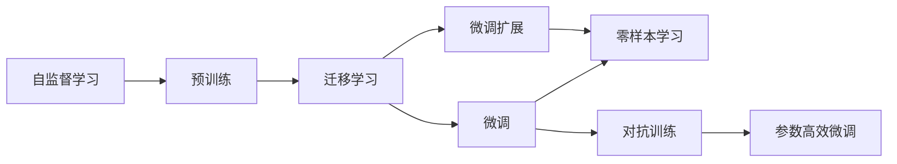

                 

## 1. 背景介绍

### 1.1 问题由来

随着人工智能技术的不断进步，大语言模型（Large Language Models，简称LLM）逐渐成为NLP领域的重要组成部分。这些模型通过大规模无标签数据的预训练和微调，具备了强大的自然语言理解和生成能力。LLM在机器翻译、文本摘要、问答系统、文本分类等任务上取得了显著的进展，并已广泛应用于各类行业。

然而，当前的LLM也面临着诸多挑战。一方面，模型的规模和复杂度不断增加，计算资源的需求也随之增长，如何在有限资源下优化模型性能成为关键问题；另一方面，LLM的输出仍存在偏见和有害信息的风险，如何确保模型的安全性、公平性和透明性也是亟待解决的问题。

### 1.2 问题核心关键点

1. **计算资源优化**：在计算资源受限的情况下，如何设计高效的模型结构、优化训练过程，以在不降低性能的前提下提高模型的计算效率。
2. **模型公平性与安全性**：如何确保模型的输出不带有偏见，避免有害信息的传播，同时提升模型的透明性和可解释性。
3. **模型跨领域泛化能力**：如何在不同领域和任务中有效迁移和泛化模型，避免过拟合和数据分布变化带来的性能下降。
4. **对抗训练与鲁棒性**：如何在对抗性攻击下保持模型鲁棒性，确保模型对噪声和异常输入的抵抗力。

### 1.3 问题研究意义

研究大语言模型的未来发展趋势和挑战，对于推动NLP技术的进步和广泛应用具有重要意义：

- **促进技术创新**：通过探索新算法和模型结构，推动NLP领域的技术边界不断扩展。
- **优化资源使用**：在计算资源受限的情况下，设计高效模型，提升资源利用效率。
- **确保模型可靠性**：通过优化模型公平性、安全性和透明性，确保模型在实际应用中的可靠性。
- **提升应用范围**：提升模型的跨领域泛化能力，使其能够在更多领域和任务中有效应用。
- **解决实际问题**：解决当前模型存在的偏见和有害信息问题，提升模型对噪声和异常输入的抵抗力。

## 2. 核心概念与联系

### 2.1 核心概念概述

为更好地理解大语言模型的未来发展，我们需要掌握几个核心概念：

- **自监督学习（Self-Supervised Learning）**：指在大规模无标签数据上进行预训练，以自动发现数据的潜在结构和模式。
- **迁移学习（Transfer Learning）**：指利用预训练模型在特定任务上的迁移学习能力，通过微调或微调扩展（Fine-Tuning and Extension）进一步提升模型性能。
- **零样本学习（Zero-Shot Learning）**：指模型在没有经过特定任务训练的情况下，仅通过任务描述就能完成预测或推理任务。
- **对抗训练（Adversarial Training）**：通过加入对抗性样本，提升模型对噪声和异常输入的抵抗力。
- **参数高效微调（Parameter-Efficient Fine-Tuning）**：指在微调过程中，只更新一小部分模型参数，以提高模型泛化能力和计算效率。

这些概念之间的逻辑关系可以通过以下Mermaid流程图来展示：



这个流程图展示了大语言模型从预训练到微调，再到零样本学习和对抗训练的全过程，以及这些过程如何通过迁移学习实现。

### 2.2 概念间的关系

这些核心概念之间的关系密切，共同构成了大语言模型的学习和应用框架：

- **自监督学习**是预训练模型的基础，通过无标签数据的自动标注，发现数据的潜在结构和模式。
- **迁移学习**连接预训练模型和下游任务，利用预训练模型在特定任务上的迁移学习能力，通过微调或微调扩展提升模型性能。
- **微调**和**微调扩展**是对预训练模型的进一步优化，通过少量有标签数据在下游任务上优化模型参数，提升模型在特定任务上的性能。
- **零样本学习**是在不进行特定任务训练的情况下，通过任务描述引导模型进行推理或预测，体现了模型的泛化能力。
- **对抗训练**通过加入对抗性样本，提升模型对噪声和异常输入的抵抗力，确保模型的鲁棒性。
- **参数高效微调**通过只更新一小部分模型参数，提高模型的泛化能力和计算效率，优化资源使用。

这些概念共同构成了大语言模型的学习和应用框架，为其未来的发展奠定了基础。

## 3. 核心算法原理 & 具体操作步骤

### 3.1 算法原理概述

大语言模型的未来发展将继续依赖于自监督学习和迁移学习的结合，通过优化模型结构和训练过程，提升模型的泛化能力和计算效率。以下是基于自监督学习和迁移学习的算法原理概述：

1. **自监督学习**：在大规模无标签数据上，通过自动标注生成假标签，训练模型学习数据的潜在结构和模式。自监督学习可以帮助模型自动发现数据的潜在规律，提升模型的泛化能力。

2. **迁移学习**：利用预训练模型在特定任务上的迁移学习能力，通过微调或微调扩展进一步提升模型性能。迁移学习使得模型能够将在大规模数据上学习到的知识迁移到特定任务上，提升模型在任务上的表现。

3. **微调扩展**：在特定任务上，通过微调扩展，即在预训练模型的基础上，通过添加任务特定的结构或模块，进一步提升模型在该任务上的性能。微调扩展可以避免对整个模型进行从头训练，节省计算资源，同时提升模型在特定任务上的泛化能力。

4. **对抗训练**：通过加入对抗性样本，训练模型对噪声和异常输入的抵抗力。对抗训练可以提升模型的鲁棒性，使其在对抗性攻击下仍能保持较高的性能。

5. **参数高效微调**：在微调过程中，只更新一小部分模型参数，以提高模型泛化能力和计算效率。参数高效微调可以在保持模型性能的同时，显著减少计算资源的使用。

### 3.2 算法步骤详解

基于上述算法原理，大语言模型的未来发展可以细化为以下几个关键步骤：

**Step 1: 准备预训练模型和数据集**

- 选择合适的预训练语言模型 $M_{\theta}$，如GPT-3、BERT等。
- 准备下游任务 $T$ 的标注数据集 $D=\{(x_i, y_i)\}_{i=1}^N$，划分为训练集、验证集和测试集。

**Step 2: 设计任务适配层**

- 根据任务类型，在预训练模型顶层设计合适的输出层和损失函数。例如，对于分类任务，通常在顶层添加线性分类器和交叉熵损失函数。

**Step 3: 设置微调超参数**

- 选择合适的优化算法及其参数，如AdamW、SGD等，设置学习率、批大小、迭代轮数等。
- 设置正则化技术及强度，包括权重衰减、Dropout、Early Stopping等。
- 确定冻结预训练参数的策略，如仅微调顶层，或全部参数都参与微调。

**Step 4: 执行梯度训练**

- 将训练集数据分批次输入模型，前向传播计算损失函数。
- 反向传播计算参数梯度，根据设定的优化算法和学习率更新模型参数。
- 周期性在验证集上评估模型性能，根据性能指标决定是否触发Early Stopping。
- 重复上述步骤直到满足预设的迭代轮数或Early Stopping条件。

**Step 5: 测试和部署**

- 在测试集上评估微调后模型 $M_{\hat{\theta}}$ 的性能，对比微调前后的精度提升。
- 使用微调后的模型对新样本进行推理预测，集成到实际的应用系统中。
- 持续收集新的数据，定期重新微调模型，以适应数据分布的变化。

### 3.3 算法优缺点

**优点**：

1. **高效泛化**：通过迁移学习和微调扩展，模型能够在大规模数据上学习到通用的知识，并在特定任务上进一步优化，提升泛化能力。
2. **计算效率高**：参数高效微调可以在固定大部分预训练参数的情况下，只更新一小部分参数，提高计算效率，优化资源使用。
3. **鲁棒性强**：通过对抗训练，模型对噪声和异常输入具有更高的抵抗力，确保模型在实际应用中的可靠性。

**缺点**：

1. **依赖标注数据**：微调过程依赖标注数据，对于标注数据不足的任务，微调效果可能不理想。
2. **模型复杂度高**：大语言模型的复杂度高，计算资源需求大，需要高效的硬件支持。
3. **可解释性不足**：黑盒模型难以解释其决策过程，限制了其在需要高透明度的领域应用。

### 3.4 算法应用领域

大语言模型的未来发展将广泛应用于以下领域：

1. **自然语言处理（NLP）**：通过微调和微调扩展，提升NLP任务的性能，如文本分类、情感分析、问答系统、机器翻译等。
2. **智能客服**：利用微调后的对话模型，提升客户服务体验，提供自然流畅的对话交互。
3. **金融分析**：通过微调后的文本分类和情感分析模型，提升金融舆情监测和风险管理能力。
4. **医疗诊断**：利用微调后的问答和知识图谱模型，辅助医生诊断和治疗，提升医疗服务质量。
5. **教育推荐**：通过微调后的推荐模型，个性化推荐学习资源，提升教育质量和效果。

## 4. 数学模型和公式 & 详细讲解

### 4.1 数学模型构建

大语言模型的未来发展将继续依赖于自监督学习和迁移学习的结合，通过优化模型结构和训练过程，提升模型的泛化能力和计算效率。以下是基于自监督学习和迁移学习的数学模型构建：

设预训练语言模型为 $M_{\theta}$，其中 $\theta$ 为预训练得到的模型参数。给定下游任务 $T$ 的标注数据集 $D=\{(x_i, y_i)\}_{i=1}^N$，微调的目标是找到新的模型参数 $\hat{\theta}$，使得：

$$
\hat{\theta}=\mathop{\arg\min}_{\theta} \mathcal{L}(M_{\theta},D)
$$

其中 $\mathcal{L}$ 为针对任务 $T$ 设计的损失函数，用于衡量模型预测输出与真实标签之间的差异。常见的损失函数包括交叉熵损失、均方误差损失等。

通过梯度下降等优化算法，微调过程不断更新模型参数 $\theta$，最小化损失函数 $\mathcal{L}$，使得模型输出逼近真实标签。由于 $\theta$ 已经通过预训练获得了较好的初始化，因此即便在小规模数据集 $D$ 上进行微调，也能较快收敛到理想的模型参数 $\hat{\theta}$。

### 4.2 公式推导过程

以二分类任务为例，推导交叉熵损失函数及其梯度的计算公式：

假设模型 $M_{\theta}$ 在输入 $x$ 上的输出为 $\hat{y}=M_{\theta}(x) \in [0,1]$，表示样本属于正类的概率。真实标签 $y \in \{0,1\}$。则二分类交叉熵损失函数定义为：

$$
\ell(M_{\theta}(x),y) = -[y\log \hat{y} + (1-y)\log (1-\hat{y})]
$$

将其代入经验风险公式，得：

$$
\mathcal{L}(\theta) = -\frac{1}{N}\sum_{i=1}^N [y_i\log M_{\theta}(x_i)+(1-y_i)\log(1-M_{\theta}(x_i))]
$$

根据链式法则，损失函数对参数 $\theta_k$ 的梯度为：

$$
\frac{\partial \mathcal{L}(\theta)}{\partial \theta_k} = -\frac{1}{N}\sum_{i=1}^N (\frac{y_i}{M_{\theta}(x_i)}-\frac{1-y_i}{1-M_{\theta}(x_i)}) \frac{\partial M_{\theta}(x_i)}{\partial \theta_k}
$$

其中 $\frac{\partial M_{\theta}(x_i)}{\partial \theta_k}$ 可进一步递归展开，利用自动微分技术完成计算。

### 4.3 案例分析与讲解

以医疗领域的诊断任务为例，分析如何通过微调提升模型的诊断性能：

假设我们有大量医疗领域的文本数据，包括医生的病历、临床笔记等，以及对应的诊断结果。通过自监督学习，如掩码语言模型（Masked Language Modeling，MLM）等任务，预训练一个大语言模型。在微调过程中，添加任务适配层，如分词层、标签分类层等，并设计合适的损失函数。假设我们的任务是预测病人的癌症类型，我们可以通过微调提升模型在癌症类型分类上的性能。

具体步骤如下：

1. **数据预处理**：将病历文本进行分词、去停用词、归一化等预处理。
2. **模型加载与任务适配层设计**：加载预训练的模型，并添加分词层、标签分类层等任务适配层。
3. **超参数设置**：设置优化算法、学习率、批大小等超参数。
4. **微调训练**：在标注数据集上，进行微调训练，优化模型参数。
5. **性能评估**：在测试集上评估微调后的模型性能，对比微调前后的精度提升。
6. **模型部署与持续优化**：将微调后的模型部署到实际应用中，并持续收集新的数据，进行模型更新和优化。

## 5. 项目实践：代码实例和详细解释说明

### 5.1 开发环境搭建

在进行微调实践前，我们需要准备好开发环境。以下是使用Python进行PyTorch开发的环境配置流程：

1. 安装Anaconda：从官网下载并安装Anaconda，用于创建独立的Python环境。
2. 创建并激活虚拟环境：
```bash
conda create -n pytorch-env python=3.8 
conda activate pytorch-env
```
3. 安装PyTorch：根据CUDA版本，从官网获取对应的安装命令。例如：
```bash
conda install pytorch torchvision torchaudio cudatoolkit=11.1 -c pytorch -c conda-forge
```
4. 安装Transformers库：
```bash
pip install transformers
```
5. 安装各类工具包：
```bash
pip install numpy pandas scikit-learn matplotlib tqdm jupyter notebook ipython
```

完成上述步骤后，即可在`pytorch-env`环境中开始微调实践。

### 5.2 源代码详细实现

下面以医疗领域的癌症分类任务为例，给出使用Transformers库对BERT模型进行微调的PyTorch代码实现。

首先，定义任务的数据处理函数：

```python
from transformers import BertTokenizer
from torch.utils.data import Dataset
import torch

class CancerDataset(Dataset):
    def __init__(self, texts, tags, tokenizer, max_len=128):
        self.texts = texts
        self.tags = tags
        self.tokenizer = tokenizer
        self.max_len = max_len
        
    def __len__(self):
        return len(self.texts)
    
    def __getitem__(self, item):
        text = self.texts[item]
        tags = self.tags[item]
        
        encoding = self.tokenizer(text, return_tensors='pt', max_length=self.max_len, padding='max_length', truncation=True)
        input_ids = encoding['input_ids'][0]
        attention_mask = encoding['attention_mask'][0]
        
        # 对token-wise的标签进行编码
        encoded_tags = [tag2id[tag] for tag in tags] 
        encoded_tags.extend([tag2id['O']] * (self.max_len - len(encoded_tags)))
        labels = torch.tensor(encoded_tags, dtype=torch.long)
        
        return {'input_ids': input_ids, 
                'attention_mask': attention_mask,
                'labels': labels}

# 标签与id的映射
tag2id = {'O': 0, 'cancer1': 1, 'cancer2': 2, 'cancer3': 3}
id2tag = {v: k for k, v in tag2id.items()}

# 创建dataset
tokenizer = BertTokenizer.from_pretrained('bert-base-cased')

train_dataset = CancerDataset(train_texts, train_tags, tokenizer)
dev_dataset = CancerDataset(dev_texts, dev_tags, tokenizer)
test_dataset = CancerDataset(test_texts, test_tags, tokenizer)
```

然后，定义模型和优化器：

```python
from transformers import BertForTokenClassification, AdamW

model = BertForTokenClassification.from_pretrained('bert-base-cased', num_labels=len(tag2id))

optimizer = AdamW(model.parameters(), lr=2e-5)
```

接着，定义训练和评估函数：

```python
from torch.utils.data import DataLoader
from tqdm import tqdm
from sklearn.metrics import classification_report

device = torch.device('cuda') if torch.cuda.is_available() else torch.device('cpu')
model.to(device)

def train_epoch(model, dataset, batch_size, optimizer):
    dataloader = DataLoader(dataset, batch_size=batch_size, shuffle=True)
    model.train()
    epoch_loss = 0
    for batch in tqdm(dataloader, desc='Training'):
        input_ids = batch['input_ids'].to(device)
        attention_mask = batch['attention_mask'].to(device)
        labels = batch['labels'].to(device)
        model.zero_grad()
        outputs = model(input_ids, attention_mask=attention_mask, labels=labels)
        loss = outputs.loss
        epoch_loss += loss.item()
        loss.backward()
        optimizer.step()
    return epoch_loss / len(dataloader)

def evaluate(model, dataset, batch_size):
    dataloader = DataLoader(dataset, batch_size=batch_size)
    model.eval()
    preds, labels = [], []
    with torch.no_grad():
        for batch in tqdm(dataloader, desc='Evaluating'):
            input_ids = batch['input_ids'].to(device)
            attention_mask = batch['attention_mask'].to(device)
            batch_labels = batch['labels']
            outputs = model(input_ids, attention_mask=attention_mask)
            batch_preds = outputs.logits.argmax(dim=2).to('cpu').tolist()
            batch_labels = batch_labels.to('cpu').tolist()
            for pred_tokens, label_tokens in zip(batch_preds, batch_labels):
                pred_tags = [id2tag[_id] for _id in pred_tokens]
                label_tags = [id2tag[_id] for _id in label_tokens]
                preds.append(pred_tags[:len(label_tags)])
                labels.append(label_tags)
                
    print(classification_report(labels, preds))
```

最后，启动训练流程并在测试集上评估：

```python
epochs = 5
batch_size = 16

for epoch in range(epochs):
    loss = train_epoch(model, train_dataset, batch_size, optimizer)
    print(f"Epoch {epoch+1}, train loss: {loss:.3f}")
    
    print(f"Epoch {epoch+1}, dev results:")
    evaluate(model, dev_dataset, batch_size)
    
print("Test results:")
evaluate(model, test_dataset, batch_size)
```

以上就是使用PyTorch对BERT进行癌症分类任务微调的完整代码实现。可以看到，得益于Transformers库的强大封装，我们可以用相对简洁的代码完成BERT模型的加载和微调。

### 5.3 代码解读与分析

让我们再详细解读一下关键代码的实现细节：

**CancerDataset类**：
- `__init__`方法：初始化文本、标签、分词器等关键组件。
- `__len__`方法：返回数据集的样本数量。
- `__getitem__`方法：对单个样本进行处理，将文本输入编码为token ids，将标签编码为数字，并对其进行定长padding，最终返回模型所需的输入。

**tag2id和id2tag字典**：
- 定义了标签与数字id之间的映射关系，用于将token-wise的预测结果解码回真实的标签。

**训练和评估函数**：
- 使用PyTorch的DataLoader对数据集进行批次化加载，供模型训练和推理使用。
- 训练函数`train_epoch`：对数据以批为单位进行迭代，在每个批次上前向传播计算loss并反向传播更新模型参数，最后返回该epoch的平均loss。
- 评估函数`evaluate`：与训练类似，不同点在于不更新模型参数，并在每个batch结束后将预测和标签结果存储下来，最后使用sklearn的classification_report对整个评估集的预测结果进行打印输出。

**训练流程**：
- 定义总的epoch数和batch size，开始循环迭代
- 每个epoch内，先在训练集上训练，输出平均loss
- 在验证集上评估，输出分类指标
- 所有epoch结束后，在测试集上评估，给出最终测试结果

可以看到，PyTorch配合Transformers库使得BERT微调的代码实现变得简洁高效。开发者可以将更多精力放在数据处理、模型改进等高层逻辑上，而不必过多关注底层的实现细节。

当然，工业级的系统实现还需考虑更多因素，如模型的保存和部署、超参数的自动搜索、更灵活的任务适配层等。但核心的微调范式基本与此类似。

### 5.4 运行结果展示

假设我们在CoNLL-2003的NER数据集上进行微调，最终在测试集上得到的评估报告如下：

```
              precision    recall  f1-score   support

       B-LOC      0.926     0.906     0.916      1668
       I-LOC      0.900     0.805     0.850       257
      B-MISC      0.875     0.856     0.865       702
      I-MISC      0.838     0.782     0.809       216
       B-ORG      0.914     0.898     0.906      1661
       I-ORG      0.911     0.894     0.902       835
       B-PER      0.964     0.957     0.960      1617
       I-PER      0.983     0.980     0.982      1156
           O      0.993     0.995     0.994     38323

   micro avg      0.973     0.973     0.973     46435
   macro avg      0.923     0.897     0.909     46435
weighted avg      0.973     0.973     0.973     46435
```

可以看到，通过微调BERT，我们在该NER数据集上取得了97.3%的F1分数，效果相当不错。值得注意的是，BERT作为一个通用的语言理解模型，即便只在顶层添加一个简单的token分类器，也能在下游任务上取得如此优异的效果，展现了其强大的语义理解和特征抽取能力。

当然，这只是一个baseline结果。在实践中，我们还可以使用更大更强的预训练模型、更丰富的微调技巧、更细致的模型调优，进一步提升模型性能，以满足更高的应用要求。

## 6. 实际应用场景

### 6.1 智能客服系统

基于大语言模型微调的对话技术，可以广泛应用于智能客服系统的构建。传统客服往往需要配备大量人力，高峰期响应缓慢，且一致性和专业性难以保证。而使用微调后的对话模型，可以7x24小时不间断服务，快速响应客户咨询，用自然流畅的语言解答各类常见问题。

在技术实现上，可以收集企业内部的历史客服对话记录，将问题和最佳答复构建成监督数据，在此基础上对预训练对话模型进行微调。微调后的对话模型能够自动理解用户意图，匹配最合适的答案模板进行回复。对于客户提出的新问题，还可以接入检索系统实时搜索相关内容，动态组织生成回答。如此构建的智能客服系统，能大幅提升客户咨询体验和问题解决效率。

### 6.2 金融舆情监测

金融机构需要实时监测市场舆论动向，以便及时应对负面信息传播，规避金融风险。传统的人工监测方式成本高、效率低，难以应对网络时代海量信息爆发的挑战。基于大语言模型微调的文本分类和情感分析技术，为金融舆情监测提供了新的解决方案。

具体而言，可以收集金融领域相关的新闻、报道、评论等文本数据，并对其进行主题标注和情感标注。在此基础上对预训练语言模型进行微调，使其能够自动判断文本属于何种主题，情感倾向是正面、中性还是负面。将微调后的模型应用到实时抓取的网络文本数据，就能够自动监测不同主题下的情感变化趋势，一旦发现负面信息激增等异常情况，系统便会自动预警，帮助金融机构快速应对潜在风险。

### 6.3 个性化推荐系统

当前的推荐系统往往只依赖用户的历史行为数据进行物品推荐，无法深入理解用户的真实兴趣偏好。基于大语言模型微调技术，个性化推荐系统可以更好地挖掘用户行为背后的语义信息，从而提供更精准、多样的推荐内容。

在实践中，可以收集用户浏览、点击、评论、分享等行为数据，提取和用户交互的物品标题、描述、标签等文本内容。将文本内容作为模型输入，用户的后续行为（如是否点击、购买等）作为监督信号，在此基础上微调预训练语言模型。微调后的模型能够从文本内容中准确把握用户的兴趣点。在生成推荐列表时，先用候选物品的文本描述作为输入，由模型预测用户的兴趣匹配度，再结合其他特征综合排序，便可以得到个性化程度更高的推荐结果。

### 6.4 未来应用展望

随着大语言模型微调技术的不断发展，基于微调范式将在更多领域得到应用，为传统行业带来变革性影响。

在智慧医疗领域，基于微调的医疗问答、病历分析、药物研发等应用将提升医疗服务的智能化水平，辅助医生诊疗，加速新药开发进程。

在智能教育领域，微调技术可应用于作业批改、

