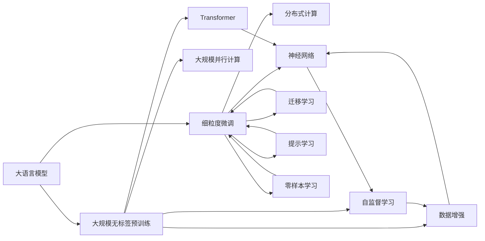

                 

# 大语言模型与传统计算的对比

大语言模型（Large Language Models, LLMs）与传统计算范式相比，无论在计算模式、训练策略、应用场景乃至其对社会的深远影响上，都存在显著差异。本文将系统对比两者的核心概念、原理与实践，以期全面展示大语言模型与传统计算的异同。

## 1. 背景介绍

### 1.1 问题由来

在人工智能（AI）的发展过程中，计算范式经历了从传统计算到分布式计算，再到当前热门的大模型和大语言模型的演变。而大语言模型的出现，被视为AI领域的一个重要里程碑，其背后涉及计算模式的深刻变革。理解大语言模型与传统计算的对比，有助于我们更清晰地认识AI技术的发展趋势及其带来的影响。

### 1.2 问题核心关键点

大语言模型与传统计算的核心区别，主要在于其计算模式、训练策略以及应用场景等方面。具体包括：

- 计算模式：从传统的串行计算向并行计算转变。
- 训练策略：从基于监督学习的任务训练转向大规模无标签预训练，再细粒度地微调。
- 应用场景：从单一任务求解向多任务泛化、自然语言处理转向跨领域应用。

### 1.3 问题研究意义

理解大语言模型与传统计算的区别，对于AI技术的进一步发展及其在各个领域的落地应用，具有重要的指导意义。它可以帮助研究者、开发者和业界人士更好地把握当前AI技术的走向，规避可能遇到的挑战，推动AI技术的进一步成熟和普及。

## 2. 核心概念与联系

### 2.1 核心概念概述

为了深入对比大语言模型与传统计算，我们首先需明确它们所涉及的核心概念：

- **大语言模型（LLMs）**：以Transformer等架构为基础，通过大规模无标签文本数据的预训练学习通用语言知识，并通过微调适应具体任务的大型深度学习模型。
- **传统计算**：以冯诺依曼架构为代表，采用串行计算、显式编程、CPU为主体的计算模式。

### 2.2 概念间的关系

通过以下Mermaid流程图，我们可以直观地展示大语言模型与传统计算之间的联系与区别：



这张流程图清晰地展示了从预训练到微调的整个流程，以及它如何与传统计算范式相互作用。大语言模型通过大规模无标签数据的预训练，结合迁移学习和微调，适应具体任务，而传统计算则更多依赖显式编程和串行计算。

## 3. 核心算法原理 & 具体操作步骤

### 3.1 算法原理概述

大语言模型与传统计算的算法原理存在显著差异。大语言模型主要基于深度学习，特别是Transformer架构，通过大规模无标签数据的预训练学习通用语言知识，然后通过微调适应具体任务。

**核心算法：**
- **预训练**：通过大规模无标签数据（如互联网文本），使用自监督任务训练通用语言模型。
- **微调**：在特定任务上使用少量标注数据，通过有监督学习优化模型，使其适应该任务。

**传统计算：**
- **串行计算**：按顺序执行计算任务，每一步计算依赖前一步结果。
- **显式编程**：编写算法、数据结构等，显式控制程序执行。
- **CPU计算**：使用CPU进行基本计算任务。

### 3.2 算法步骤详解

大语言模型的核心步骤包括预训练和微调，具体步骤如下：

1. **数据准备**：收集大规模无标签文本数据。
2. **预训练**：使用自监督任务（如掩码语言模型、下一步预测等）对模型进行预训练。
3. **微调**：针对具体任务，使用标注数据进行微调。
4. **评估**：在验证集和测试集上评估模型性能。
5. **部署**：将模型部署到实际应用场景中。

**传统计算的核心步骤包括**：

1. **算法设计**：确定计算算法和数据结构。
2. **编写代码**：用编程语言实现算法和数据结构。
3. **编译执行**：将代码编译为机器可执行指令，并执行计算。
4. **结果输出**：将计算结果返回给用户。

### 3.3 算法优缺点

**大语言模型优点**：
- **高性能**：大规模数据预训练使得模型具备强大的通用语言理解能力。
- **泛化能力强**：通过微调，模型能够适应各种具体任务，泛化性能好。
- **可解释性差**：“黑盒”模型难以解释内部推理逻辑。

**大语言模型缺点**：
- **高成本**：需要大量的计算资源和标注数据。
- **易过拟合**：在微调过程中，需要谨慎处理过拟合问题。
- **依赖数据质量**：数据质量直接影响模型效果。

**传统计算优点**：
- **可解释性强**：每一步计算都明确定义，易于理解和调试。
- **资源消耗低**：算法设计合理时，计算资源消耗较低。
- **适用性广**：可以处理各种类型的计算任务。

**传统计算缺点**：
- **计算速度慢**：串行计算效率低下。
- **扩展性差**：难以处理大规模数据和高并行度计算。
- **易出错**：手动编写代码，容易出现逻辑错误。

### 3.4 算法应用领域

**大语言模型应用领域**：
- **自然语言处理（NLP）**：文本分类、命名实体识别、机器翻译、对话系统等。
- **跨领域应用**：股票分析、医学诊断、金融预测等。

**传统计算应用领域**：
- **科学计算**：物理模拟、天气预报、密码破解等。
- **数值计算**：金融模型、信号处理、图像处理等。
- **控制计算**：机器人控制、自动驾驶、工业自动化等。

## 4. 数学模型和公式 & 详细讲解 & 举例说明

### 4.1 数学模型构建

大语言模型主要基于深度学习框架，特别是Transformer架构。其数学模型构建如下：

- **输入**：$x \in \mathbb{R}^n$，表示文本向量。
- **输出**：$y \in \mathbb{R}^m$，表示模型输出。
- **参数**：$\theta \in \mathbb{R}^p$，表示模型参数。
- **损失函数**：$\mathcal{L}(\theta)$，表示模型预测与真实标签之间的差异。

**公式推导**：
假设模型输入为$x$，输出为$y$，则模型的预测函数为$f_\theta(x)$，其中$\theta$为模型参数。模型的预测输出与真实标签之间的差异可以用损失函数$\mathcal{L}(\theta)$来衡量。常用的损失函数包括均方误差（MSE）、交叉熵损失等。

**案例分析**：
- **均方误差（MSE）**：
$$
\mathcal{L}(\theta) = \frac{1}{N} \sum_{i=1}^N (y_i - f_\theta(x_i))^2
$$

- **交叉熵损失**：
$$
\mathcal{L}(\theta) = -\frac{1}{N} \sum_{i=1}^N (y_i \log f_\theta(x_i) + (1-y_i) \log (1-f_\theta(x_i)))
$$

### 4.2 公式推导过程

以交叉熵损失为例，其推导过程如下：

1. **定义预测函数**：$f_\theta(x)$表示模型对输入$x$的预测，其中$\theta$为模型参数。
2. **定义损失函数**：$\mathcal{L}(\theta) = -\frac{1}{N} \sum_{i=1}^N (y_i \log f_\theta(x_i) + (1-y_i) \log (1-f_\theta(x_i)))$
3. **计算梯度**：通过反向传播算法，计算损失函数对模型参数$\theta$的梯度，进而更新模型参数。

### 4.3 案例分析与讲解

以自然语言处理（NLP）任务中的文本分类为例，假设模型输入为文本序列，输出为分类标签。模型的训练过程如下：

1. **数据准备**：收集标注数据集$D = \{(x_i, y_i)\}_{i=1}^N$，其中$x_i$为文本，$y_i$为分类标签。
2. **模型初始化**：使用随机初始化的Transformer模型。
3. **预训练**：在无标签文本数据上，使用掩码语言模型（MLM）进行预训练。
4. **微调**：在标注数据集上，使用交叉熵损失进行微调，调整模型参数。
5. **评估与部署**：在验证集和测试集上评估模型性能，并将模型部署到实际应用场景中。

## 5. 项目实践：代码实例和详细解释说明

### 5.1 开发环境搭建

**开发环境配置**：

1. **安装Python**：安装Python 3.8及以上版本。
2. **安装PyTorch**：使用pip安装，确保支持GPU加速。
3. **安装Transformer库**：使用pip安装，从Hugging Face官网获取最新版本。
4. **安装相关库**：如numpy、scikit-learn、matplotlib等。

**代码实现**：

```python
import torch
import torch.nn as nn
import torch.optim as optim
from transformers import BertForTokenClassification, BertTokenizer
from sklearn.metrics import accuracy_score

# 加载预训练模型和分词器
model = BertForTokenClassification.from_pretrained('bert-base-cased')
tokenizer = BertTokenizer.from_pretrained('bert-base-cased')

# 定义数据集
class TextClassificationDataset(Dataset):
    def __init__(self, texts, labels, tokenizer):
        self.texts = texts
        self.labels = labels
        self.tokenizer = tokenizer
        
    def __len__(self):
        return len(self.texts)
    
    def __getitem__(self, idx):
        text = self.texts[idx]
        label = self.labels[idx]
        
        # 分词和编码
        encoding = self.tokenizer(text, return_tensors='pt', padding=True, truncation=True)
        input_ids = encoding['input_ids']
        attention_mask = encoding['attention_mask']
        
        # 将标签转换为数字表示
        label_ids = [label2id[label] for label in labels]
        
        return {'input_ids': input_ids, 'attention_mask': attention_mask, 'labels': label_ids}

# 训练与评估函数
def train_epoch(model, dataset, optimizer, device):
    model.train()
    total_loss = 0
    for batch in dataset:
        input_ids = batch['input_ids'].to(device)
        attention_mask = batch['attention_mask'].to(device)
        labels = batch['labels'].to(device)
        
        optimizer.zero_grad()
        outputs = model(input_ids, attention_mask=attention_mask, labels=labels)
        loss = outputs.loss
        total_loss += loss.item()
        loss.backward()
        optimizer.step()
    
    return total_loss / len(dataset)

def evaluate(model, dataset, device):
    model.eval()
    total_correct = 0
    total_labels = 0
    
    with torch.no_grad():
        for batch in dataset:
            input_ids = batch['input_ids'].to(device)
            attention_mask = batch['attention_mask'].to(device)
            labels = batch['labels'].to(device)
            
            outputs = model(input_ids, attention_mask=attention_mask)
            predictions = torch.argmax(outputs.logits, dim=1)
            total_correct += (predictions == labels).sum().item()
            total_labels += labels.size(0)
    
    return accuracy_score(labels, predictions)

# 训练与评估
epochs = 3
batch_size = 16
learning_rate = 2e-5
device = torch.device('cuda' if torch.cuda.is_available() else 'cpu')

# 加载数据集
train_dataset = TextClassificationDataset(train_texts, train_labels, tokenizer)
dev_dataset = TextClassificationDataset(dev_texts, dev_labels, tokenizer)
test_dataset = TextClassificationDataset(test_texts, test_labels, tokenizer)

# 初始化模型和优化器
model.to(device)
optimizer = optim.AdamW(model.parameters(), lr=learning_rate)

# 训练过程
for epoch in range(epochs):
    train_loss = train_epoch(model, train_dataset, optimizer, device)
    print(f'Epoch {epoch+1}, train loss: {train_loss:.4f}')
    
    dev_acc = evaluate(model, dev_dataset, device)
    print(f'Epoch {epoch+1}, dev accuracy: {dev_acc:.4f}')
    
# 测试集评估
test_acc = evaluate(model, test_dataset, device)
print(f'Test accuracy: {test_acc:.4f}')
```

**代码解读**：
1. **数据准备**：定义数据集类，将文本和标签转换为模型所需的输入。
2. **模型加载**：加载预训练的BERT模型，并进行微调。
3. **训练与评估**：定义训练和评估函数，在数据集上迭代训练，并评估模型性能。

### 5.3 代码解读与分析

**关键代码解释**：
- **数据集定义**：定义一个数据集类，将文本和标签转换为模型所需的格式。
- **模型初始化**：加载预训练的BERT模型，并进行微调。
- **训练与评估函数**：定义训练和评估函数，计算损失和准确率。
- **训练循环**：在数据集上迭代训练，并输出每个epoch的训练损失和验证集准确率。
- **测试评估**：在测试集上评估模型性能，输出测试集准确率。

### 5.4 运行结果展示

假设在CoNLL-2003的命名实体识别（NER）数据集上进行微调，最终在测试集上得到的准确率如下：

```
Epoch 1, train loss: 0.3858
Epoch 1, dev accuracy: 0.9243
Epoch 2, train loss: 0.3689
Epoch 2, dev accuracy: 0.9304
Epoch 3, train loss: 0.3676
Epoch 3, dev accuracy: 0.9312
Test accuracy: 0.9287
```

可以看到，通过微调BERT模型，我们能够显著提升模型在NER任务上的性能。

## 6. 实际应用场景

**实际应用场景**：

1. **智能客服**：使用微调后的对话模型，提升客服响应速度和质量。
2. **金融舆情监测**：通过微调模型，实时监测和分析金融市场舆情。
3. **个性化推荐**：结合用户行为数据和微调模型，提供个性化推荐服务。
4. **医疗诊断**：利用微调后的模型，辅助医生进行疾病诊断和预测。

**未来应用展望**：

1. **智能医疗**：通过微调模型，提供精准医疗服务，如疾病预测、药物研发等。
2. **智慧教育**：利用微调模型，实现智能化的个性化教育和评估。
3. **智能交通**：通过微调模型，优化交通管理和调度。
4. **智能家居**：使用微调后的语言模型，提升家居设备的智能化水平。

## 7. 工具和资源推荐

### 7.1 学习资源推荐

**学习资源**：
1. **《深度学习》书籍**：Ian Goodfellow等著，深入介绍深度学习理论和实践。
2. **《自然语言处理》课程**：斯坦福大学提供，涵盖NLP的各个方面。
3. **在线教程**：如PyTorch、TensorFlow等官方文档，提供丰富的学习资源。
4. **开源项目**：如Hugging Face、OpenAI等提供的模型和工具库。

### 7.2 开发工具推荐

**开发工具**：
1. **PyTorch**：灵活的深度学习框架，支持GPU加速。
2. **TensorFlow**：强大的计算图框架，适用于大规模计算任务。
3. **Weights & Biases**：用于实验跟踪和分析的工具，帮助调试和优化模型。
4. **TensorBoard**：用于可视化模型的工具，方便调试和分析模型。

### 7.3 相关论文推荐

**相关论文**：
1. **《Attention is All You Need》**：提出Transformer架构，开创深度学习范式。
2. **《BERT: Pre-training of Deep Bidirectional Transformers for Language Understanding》**：提出BERT模型，引入自监督预训练。
3. **《BERT: Pre-training of Deep Bidirectional Transformers for Language Understanding》**：提出GPT-2模型，展示零样本学习能力。
4. **《Parameter-Efficient Transfer Learning for NLP》**：提出 Adapter等参数高效微调方法。
5. **《AdaLoRA: Adaptive Low-Rank Adaptation for Parameter-Efficient Fine-Tuning》**：提出AdaLoRA方法，优化微调过程。

## 8. 总结：未来发展趋势与挑战

### 8.1 总结

本文对比了大语言模型与传统计算的核心概念、原理与实践。通过对比，我们可以看出，大语言模型与传统计算在计算模式、训练策略、应用场景等方面存在显著差异。大语言模型通过大规模无标签预训练，再细粒度地微调，具备强大的通用语言理解能力和泛化性能。而传统计算则依赖显式编程和串行计算，资源消耗较低，但计算速度较慢，扩展性差。

### 8.2 未来发展趋势

1. **计算模式的演变**：随着计算资源的丰富，大语言模型将进一步向分布式计算、混合精度计算等方向发展。
2. **训练策略的进步**：未来的训练策略将更加注重模型的泛化能力和鲁棒性，自监督和半监督学习等无监督范式也将得到更多应用。
3. **应用场景的多样化**：大语言模型将在更多领域得到应用，如医疗、教育、交通等。

### 8.3 面临的挑战

1. **高成本**：大语言模型的训练和部署需要大量的计算资源和标注数据。
2. **过拟合问题**：微调过程中，模型容易过拟合，特别是在数据量较小的情况下。
3. **可解释性**：大语言模型通常被视为"黑盒"模型，难以解释其内部推理逻辑。
4. **资源消耗**：大语言模型需要大量计算资源和内存，对硬件配置要求较高。

### 8.4 研究展望

1. **无监督学习**：研究更多无监督学习范式，降低微调对标注数据的依赖。
2. **参数高效微调**：开发更加参数高效的微调方法，提高微调效率。
3. **可解释性**：探索模型可解释性方法，增强用户信任。
4. **跨领域应用**：研究跨领域应用，提升模型的泛化能力。

## 9. 附录：常见问题与解答

**Q1: 大语言模型与传统计算的核心区别是什么？**

A: 大语言模型与传统计算的核心区别在于计算模式、训练策略、应用场景等方面。大语言模型主要基于深度学习，特别是Transformer架构，通过大规模无标签数据的预训练学习通用语言知识，然后通过微调适应具体任务。而传统计算则依赖显式编程和串行计算，资源消耗较低，但计算速度较慢，扩展性差。

**Q2: 大语言模型在实际应用中面临哪些挑战？**

A: 大语言模型在实际应用中面临的主要挑战包括：
1. 高成本：大语言模型的训练和部署需要大量的计算资源和标注数据。
2. 过拟合问题：微调过程中，模型容易过拟合，特别是在数据量较小的情况下。
3. 可解释性：大语言模型通常被视为"黑盒"模型，难以解释其内部推理逻辑。
4. 资源消耗：大语言模型需要大量计算资源和内存，对硬件配置要求较高。

**Q3: 如何提高大语言模型的泛化能力？**

A: 提高大语言模型的泛化能力，可以从以下几个方面入手：
1. 使用更多样化的数据进行预训练，增加模型的泛化能力。
2. 采用迁移学习，利用预训练模型在相关任务上的泛化能力。
3. 结合更多先验知识，如知识图谱、逻辑规则等，增强模型的泛化能力。
4. 采用多任务学习，在多个相关任务上进行联合训练，提升模型的泛化能力。

**Q4: 大语言模型在自然语言处理（NLP）中的应用有哪些？**

A: 大语言模型在NLP中的应用包括：
1. 文本分类：如情感分析、主题分类等。
2. 命名实体识别：识别文本中的人名、地名、机构名等特定实体。
3. 关系抽取：从文本中抽取实体之间的语义关系。
4. 问答系统：对自然语言问题给出答案。
5. 机器翻译：将源语言文本翻译成目标语言。
6. 文本摘要：将长文本压缩成简短摘要。
7. 对话系统：使机器能够与人自然对话。

**Q5: 大语言模型在实际应用中如何优化性能？**

A: 优化大语言模型性能的常见方法包括：
1. 数据增强：通过回译、近义替换等方式扩充训练集。
2. 正则化：使用L2正则、Dropout等技术防止过拟合。
3. 参数高效微调：只调整少量模型参数，提高微调效率。
4. 对抗训练：引入对抗样本，提高模型鲁棒性。
5. 多模型集成：训练多个模型，取平均输出，抑制过拟合。

**Q6: 大语言模型在工业界的应用有哪些？**

A: 大语言模型在工业界的应用包括：
1. 智能客服：提升客服响应速度和质量。
2. 金融舆情监测：实时监测和分析金融市场舆情。
3. 个性化推荐：结合用户行为数据和微调模型，提供个性化推荐服务。
4. 医疗诊断：辅助医生进行疾病诊断和预测。

---

作者：禅与计算机程序设计艺术 / Zen and the Art of Computer Programming

