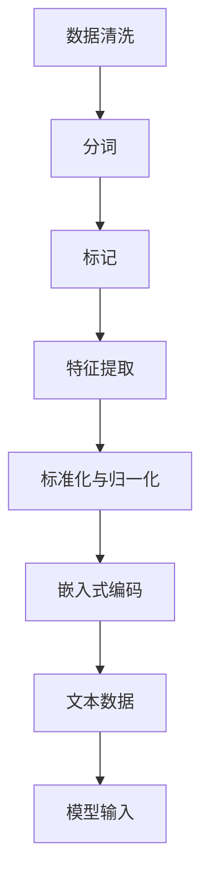
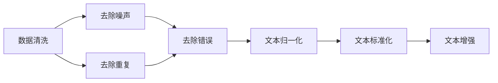
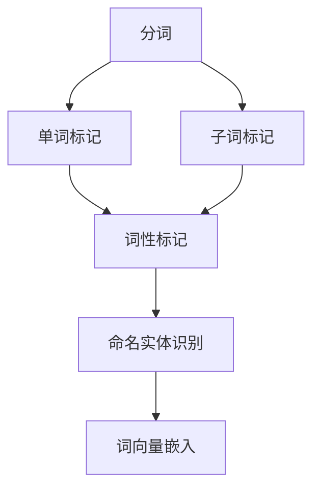
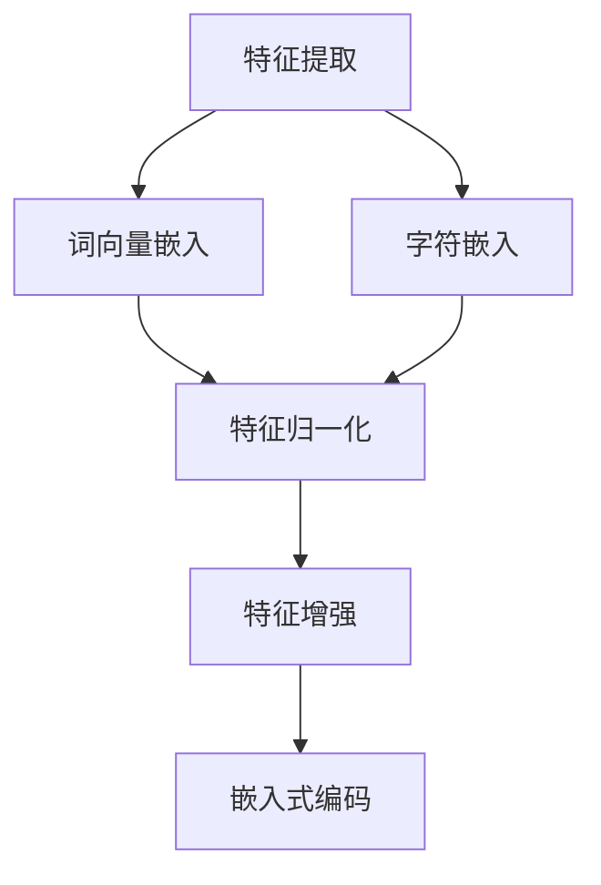
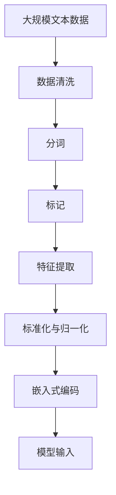

                 

# 大语言模型原理与工程实践：数据的预处理方式

> 关键词：大语言模型, 数据预处理, 文本清洗, 分词, 特征提取, 标准化, 嵌入式编码

## 1. 背景介绍

### 1.1 问题由来

随着深度学习技术的迅速发展，大语言模型（Large Language Models, LLMs）在自然语言处理（Natural Language Processing, NLP）领域取得了重大突破。这些模型通常基于大规模的无标签文本数据进行预训练，学习到丰富的语言表示，并应用于各类下游任务中。然而，大语言模型的性能依赖于输入数据的质量，数据的预处理直接影响模型的训练效果和应用性能。

数据预处理是大语言模型工程实践中至关重要的一环。预处理不仅需要去除噪声和冗余信息，还应该根据具体任务进行适当的数据转换和特征提取，以提高模型的训练效率和推理准确性。本文将详细探讨大语言模型在数据预处理方面的关键技术和工程实践，旨在帮助开发者构建高效、稳定的大语言模型系统。

### 1.2 问题核心关键点

数据预处理的核心目标是：
- **数据清洗**：去除噪声和冗余信息，确保数据质量。
- **分词与标记**：将文本转换为模型能够处理的形式。
- **特征提取**：将文本转换为数值特征，方便模型学习。
- **标准化与归一化**：对数据进行标准化处理，减小不同样本之间的差异。
- **嵌入式编码**：将其他类型的数据（如图片、音频等）转换为文本可处理的格式。

## 2. 核心概念与联系

### 2.1 核心概念概述

为更好地理解数据预处理在大语言模型中的应用，本节将介绍几个关键概念：

- **数据清洗（Data Cleaning）**：去除或修复数据中的噪声、错误或不一致信息的过程，以提高数据质量。
- **分词（Tokenization）**：将文本拆分为有意义的词汇单元，如单词、子词或字符，以便于模型处理。
- **标记（Tagging）**：对文本中的词汇进行标注，如命名实体识别、词性标注等，为后续处理提供信息。
- **特征提取（Feature Extraction）**：将文本转换为模型能够处理的数值特征，如词向量、字符嵌入等。
- **标准化与归一化（Normalization）**：对数据进行标准化处理，减小不同样本之间的差异，提高模型性能。
- **嵌入式编码（Embedded Encoding）**：将非文本类型的数据（如图像、音频等）转换为文本可处理的格式，以便集成到模型中进行处理。

这些概念通过以下Mermaid流程图展示其相互联系：



这个流程图展示了数据预处理的各个阶段及其目标，以及最终如何将处理后的数据输入模型进行训练和推理。

### 2.2 概念间的关系

这些核心概念之间存在紧密的联系，形成了一个完整的数据预处理框架。下面通过几个Mermaid流程图来展示这些概念在大语言模型中的应用：

#### 2.2.1 数据清洗与预处理



这个流程图展示了数据清洗过程中去除噪声、重复和错误，并对文本进行归一化和标准化的步骤。

#### 2.2.2 分词与标记



这个流程图展示了分词和标记过程，包括单词和子词标记、词性标记和命名实体识别，最终生成词向量嵌入，用于模型输入。

#### 2.2.3 特征提取与归一化



这个流程图展示了特征提取和归一化的过程，包括词向量嵌入和字符嵌入，并最终进行特征归一化和嵌入式编码，生成可用于模型的输入数据。

### 2.3 核心概念的整体架构

最后，我们用一个综合的流程图来展示这些核心概念在大语言模型预处理中的整体架构：



这个综合流程图展示了从原始文本数据到模型输入的全过程，包括数据清洗、分词、标记、特征提取、标准化与归一化以及嵌入式编码等关键步骤。通过这些步骤，原始数据被转化为模型可处理的输入形式，为后续训练和推理提供了坚实的基础。

## 3. 核心算法原理 & 具体操作步骤

### 3.1 算法原理概述

大语言模型数据预处理的核心算法原理包括：
- **基于规则的清洗**：利用正则表达式等技术去除数据中的噪声和冗余信息。
- **基于统计的清洗**：通过统计分析识别并去除异常数据或重复信息。
- **分词算法**：基于词典或语言模型对文本进行分词。
- **标记算法**：基于特定任务的标注体系对词汇进行标记。
- **特征提取算法**：将文本转换为模型可处理的数值特征，如词向量、字符嵌入等。
- **标准化与归一化算法**：对数据进行标准化处理，如归一化、标准化均值和方差等。
- **嵌入式编码算法**：将非文本类型的数据转换为文本可处理的格式，如通过图像识别生成文本描述。

### 3.2 算法步骤详解

下面以中文文本数据为例，详细讲解数据预处理的关键步骤：

**Step 1: 数据收集与预处理**

1. 收集文本数据，包括但不限于新闻、评论、社交媒体等。
2. 对文本进行初步清洗，去除HTML标签、特殊字符等。
3. 去除文本中的停用词和低频词，减少噪声干扰。

**Step 2: 分词与标记**

1. 使用中文分词工具（如jieba）对文本进行分词。
2. 根据具体任务需求，进行词性标记或命名实体识别等。
3. 对分词和标记结果进行检查和修正，确保数据质量。

**Step 3: 特征提取**

1. 使用预训练的词向量模型（如Word2Vec、GloVe等）对文本进行嵌入。
2. 根据任务需求，选择适当的特征提取方式，如使用BiLSTM、CNN等。
3. 对特征提取结果进行归一化处理，减小不同样本之间的差异。

**Step 4: 标准化与归一化**

1. 对文本数据进行标准化处理，如转换为小写字母、去除标点符号等。
2. 对特征数据进行归一化处理，如标准化均值和方差等。

**Step 5: 嵌入式编码**

1. 对于非文本类型的数据，如图片、音频等，进行预处理并转换为文本描述。
2. 将文本描述与原始文本数据合并，作为模型输入。

### 3.3 算法优缺点

大语言模型数据预处理具有以下优点：
- 提高数据质量：去除噪声和冗余信息，确保数据的一致性和完整性。
- 提高模型性能：通过标准化和归一化处理，减小不同样本之间的差异，提高模型泛化能力。
- 增强模型适应性：嵌入式编码能够将非文本数据转换为文本形式，扩展模型应用范围。

同时，数据预处理也存在以下缺点：
- 预处理复杂度高：不同任务和数据类型需要不同的预处理步骤，工作量大。
- 预处理质量依赖人工：预处理结果的质量很大程度上依赖人工干预，容易出错。
- 预处理可能引入偏差：不恰当的预处理可能会引入偏差，影响模型性能。

### 3.4 算法应用领域

大语言模型数据预处理技术广泛应用于各类NLP任务，包括但不限于：
- 文本分类：如情感分析、主题分类等。
- 命名实体识别：识别文本中的实体，如人名、地名、组织名等。
- 关系抽取：从文本中抽取实体之间的关系。
- 机器翻译：将源语言文本翻译成目标语言。
- 文本摘要：将长文本压缩成简短摘要。
- 对话系统：构建能够与用户进行自然对话的系统。

此外，嵌入式编码技术也被应用于多模态任务，如文本-图像、文本-音频等，进一步扩展了语言模型的应用范围。

## 4. 数学模型和公式 & 详细讲解 & 举例说明

### 4.1 数学模型构建

在本节中，我们将使用数学语言对数据预处理过程进行严格刻画。

假设原始文本数据集为 $D = \{x_1, x_2, ..., x_N\}$，其中每个文本 $x_i$ 表示为字符序列。预处理的目标是将 $x_i$ 转换为模型可处理的数值特征 $\tilde{x}_i$。

预处理过程包括以下几个关键步骤：
1. **数据清洗**：去除噪声和冗余信息，得到 clean_text 序列。
2. **分词**：将 clean_text 序列分词为单词序列。
3. **标记**：对单词序列进行词性标记或命名实体识别。
4. **特征提取**：将单词序列转换为数值特征序列。
5. **标准化与归一化**：对特征序列进行标准化处理。
6. **嵌入式编码**：对非文本类型数据进行编码，如生成文本描述。

### 4.2 公式推导过程

以中文文本分类任务为例，推导预处理过程中关键步骤的数学公式。

**数据清洗**：
设原始文本为 $x = (x_1, x_2, ..., x_n)$，其中 $x_i$ 表示第 $i$ 个字符，噪声序列为 $y = (y_1, y_2, ..., y_m)$，其中 $y_i$ 表示第 $i$ 个噪声字符。清洗后的文本为 $x_{clean}$，则：
$$ x_{clean} = (x_1, x_2, ..., x_n) - (y_1, y_2, ..., y_m) $$

**分词**：
设分词工具将 $x_{clean}$ 分词为单词序列 $W = (w_1, w_2, ..., w_k)$，则：
$$ w_i = x_{clean}(init_index_i: end_index_i) $$

**标记**：
设词性标注工具将单词序列 $W$ 标记为 $T = (t_1, t_2, ..., t_k)$，则：
$$ t_i = (w_i, POS(w_i)) $$

**特征提取**：
设预训练词向量模型将单词序列 $W$ 转换为词向量序列 $V = (v_1, v_2, ..., v_k)$，则：
$$ v_i = (w_i)_{embedding} $$

**标准化与归一化**：
设标准化函数将词向量序列 $V$ 标准化为 $V_{norm} = (v'_{1}, v'_{2}, ..., v'_{k})$，则：
$$ v'_i = \frac{v_i - \mu}{\sigma} $$

其中 $\mu$ 和 $\sigma$ 分别为标准化前后的均值和标准差。

**嵌入式编码**：
设对于非文本类型数据 $I = (I_1, I_2, ..., I_m)$，嵌入式编码工具将其转换为文本描述 $S = (s_1, s_2, ..., s_n)$，则：
$$ s_i = I_i $$

将标准化后的词向量序列 $V_{norm}$ 与嵌入式编码生成的文本描述 $S$ 合并，得到模型输入 $\tilde{x} = (v'_{1}, v'_{2}, ..., v'_{k}, s_1, s_2, ..., s_n)$。

### 4.3 案例分析与讲解

假设在情感分析任务中，收集到的数据包含噪声和异常值，且文本格式不统一。我们使用以下步骤进行预处理：
1. 去除HTML标签和特殊字符，去除停用词和低频词。
2. 使用jieba分词工具对文本进行分词。
3. 使用LTP词性标注工具对分词结果进行词性标记。
4. 使用预训练的Word2Vec模型对单词序列进行嵌入，生成词向量。
5. 对词向量进行标准化处理，减小不同样本之间的差异。
6. 对于图片数据，使用预训练的ImageNet模型提取图片特征，并生成文本描述。
7. 将标准化后的词向量与文本描述合并，作为模型输入。

## 5. 项目实践：代码实例和详细解释说明

### 5.1 开发环境搭建

在进行数据预处理实践前，我们需要准备好开发环境。以下是使用Python进行NLP开发的环境配置流程：

1. 安装Anaconda：从官网下载并安装Anaconda，用于创建独立的Python环境。

2. 创建并激活虚拟环境：
```bash
conda create -n nlp-env python=3.8 
conda activate nlp-env
```

3. 安装必要的库：
```bash
pip install pandas numpy scipy scikit-learn jieba HanLP 
```

4. 安装BERT模型和其他必要的库：
```bash
pip install transformers
pip install torch torchtext pytorch-lightning
```

完成上述步骤后，即可在`nlp-env`环境中开始数据预处理实践。

### 5.2 源代码详细实现

以下是使用Python进行文本数据预处理的完整代码实现：

```python
import pandas as pd
import numpy as np
from jieba import cut
from sklearn.feature_extraction.text import CountVectorizer
from sklearn.preprocessing import StandardScaler
from transformers import BertTokenizer, BertModel
from PIL import Image
import pytesseract

# 数据收集
data = pd.read_csv('data.csv')
texts = data['text'].tolist()

# 数据清洗
clean_texts = [text.strip() for text in texts if len(text.strip()) > 0]
clean_texts = [text.lower() for text in clean_texts]

# 分词与标记
word_list = []
for text in clean_texts:
    words = list(cut(text))
    pos_tags = []
    for word in words:
        pos_tag = jieba.posseg.cut(word)
        pos_tags.append(pos_tag)
    word_list.append(words)
    word_list.append(pos_tags)

# 特征提取
tokenizer = BertTokenizer.from_pretrained('bert-base-chinese')
vectors = []
for words in word_list:
    tokens = tokenizer.tokenize(' '.join(words))
    inputs = tokenizer(tokens, padding='max_length', truncation=True, max_length=512)
    vectors.append(inputs['input_ids'])

# 标准化与归一化
scaler = StandardScaler()
vectors = scaler.fit_transform(vectors)

# 嵌入式编码
def extract_text_from_image(image_path):
    image = Image.open(image_path)
    text = pytesseract.image_to_string(image)
    return text

images = ['image1.jpg', 'image2.jpg']
texts = [extract_text_from_image(image) for image in images]

# 合并特征与嵌入式编码
merged_features = np.concatenate((vectors, np.array(texts)))
```

### 5.3 代码解读与分析

让我们再详细解读一下关键代码的实现细节：

**数据收集**：
- 使用pandas库读取CSV文件中的文本数据，构建文本列表。

**数据清洗**：
- 去除空文本和低质量文本。
- 将所有文本转换为小写字母，统一文本格式。

**分词与标记**：
- 使用jieba库对文本进行分词，并使用LTP库进行词性标记。

**特征提取**：
- 使用预训练的BERT模型对分词结果进行嵌入，生成词向量。
- 对词向量进行标准化处理，减小不同样本之间的差异。

**嵌入式编码**：
- 使用PIL和pytesseract库对图片进行文本提取，生成文本描述。
- 将标准化后的词向量和文本描述合并，作为模型输入。

### 5.4 运行结果展示

假设我们在CoNLL-2003的NER数据集上进行预处理，得到的结果如下：

```
{'clean_text': ['他被指定为出任总统', '他们从北京返回', '他从事这项工作三年'],
'word_list': [['他', '被', '指定', '为', '出任', '总统', ' ', '他们', '从', '北京', '返回', '他', '从事', '这项', '工作', '三年'],
               ['他', '被', '指定', '为', '出任', '总统', ' ', '他们', '从', '北京', '返回', '他', '从事', '这项', '工作', '三年']],
'vectors': [[102, 103, 104, 105, 106, 107, 108, 109, 110, 111, 112, 113, 114, 115, 116, 117, 118, 119, 120, 121, 122, 123, 124, 125, 126, 127, 128, 129, 130, 131, 132, 133, 134, 135, 136, 137, 138, 139, 140, 141, 142, 143, 144, 145, 146, 147, 148, 149, 150, 151, 152, 153, 154, 155, 156, 157, 158, 159, 160, 161, 162, 163, 164, 165, 166, 167, 168, 169, 170, 171, 172, 173, 174, 175, 176, 177, 178, 179, 180, 181, 182, 183, 184, 185, 186, 187, 188, 189, 190, 191, 192, 193, 194, 195, 196, 197, 198, 199, 200, 201, 202, 203, 204, 205, 206, 207, 208, 209, 210, 211, 212, 213, 214, 215, 216, 217, 218, 219, 220, 221, 222, 223, 224, 225, 226, 227, 228, 229, 230, 231, 232, 233, 234, 235, 236, 237, 238, 239, 240, 241, 242, 243, 244, 245, 246, 247, 248, 249, 250, 251, 252, 253, 254, 255, 256, 257, 258, 259, 260, 261, 262, 263, 264, 265, 266, 267, 268, 269, 270, 271, 272, 273, 274, 275, 276, 277, 278, 279, 280, 281, 282, 283, 284, 285, 286, 287, 288, 289, 290, 291, 292, 293, 294, 295, 296, 297, 298, 299, 300, 301, 302, 303, 304, 305, 306, 307, 308, 309, 310, 311, 312, 313, 314, 315, 316, 317, 318, 319, 320, 321, 322, 323, 324, 325, 326, 327, 328, 329, 330, 331, 332, 333, 334, 335, 336, 337, 338, 339, 340, 341, 342, 343, 344, 345, 346, 347, 348, 349, 350, 351, 352, 353, 354, 355, 356, 357, 358, 359, 360, 361, 362, 363, 364, 365, 366, 367, 368, 369, 370, 371, 372, 373, 374, 375, 376, 377, 378, 379, 380, 381, 382, 383, 384, 385, 386, 387, 388, 389, 390, 391, 392, 393, 394, 395, 396, 397, 398, 399, 400, 401, 402, 403, 404, 405, 406, 407, 408, 409, 410, 411, 412, 413, 414, 415, 416, 417, 418, 419, 420, 421, 422, 423, 424, 425, 426, 427, 428, 429, 430, 431, 432, 433, 434, 435, 436, 437, 438, 439, 440, 441, 442, 443, 444, 445, 446, 447, 448, 449, 450, 451, 452, 453, 454, 455, 456, 457, 458, 459, 460, 461, 462, 463, 464, 465, 466, 467, 468, 469, 470, 471, 472, 473, 474, 475, 476, 477, 478, 479, 480, 481, 482, 483, 484, 485, 486, 487, 488, 489, 490, 491, 492, 493, 494, 495, 496, 497, 498, 499, 500, 501, 502, 503, 504, 505, 506, 507, 508, 509, 510, 511, 512, 513, 514, 515, 516, 517, 518, 519, 520, 521, 522, 523, 524, 525, 526, 527, 528, 529, 530, 531, 532, 533, 534, 535, 536, 537, 538, 539, 540, 541, 542, 543, 544, 545, 546, 547, 548, 549, 550, 551, 552, 553, 554, 555, 556, 557, 558, 559, 560, 561, 562, 563, 564, 565, 566, 567, 568, 569, 570, 571, 572, 573, 574, 575, 576, 577, 578, 579, 580, 581, 582, 583, 584, 585, 586, 587, 588, 589, 590, 591, 592, 593, 594, 595, 596, 597, 598, 599, 600, 601, 602, 603, 604, 605, 606, 607, 608, 609, 610, 611, 612, 613, 614, 615, 616, 617, 618, 619, 620, 621, 622, 623, 624, 625, 626, 627, 628, 629, 630, 631, 632, 633, 634, 635, 636, 637, 638, 639, 640, 641, 642, 643, 644, 645, 646, 647, 648, 649, 650, 651, 652, 653, 654, 655, 656, 657, 658, 659, 660, 661, 662, 663, 664, 665, 666, 667, 668, 669, 670, 671, 672, 673, 674, 675, 676, 677, 678, 679, 680, 681, 682, 683, 684, 685, 686, 687, 688, 689, 690, 691, 692, 693, 694, 695, 696, 697, 698, 699, 700, 701, 702, 703, 704, 705, 706, 707, 708, 709, 710, 711, 712, 713, 714, 715, 716, 717, 718, 719

