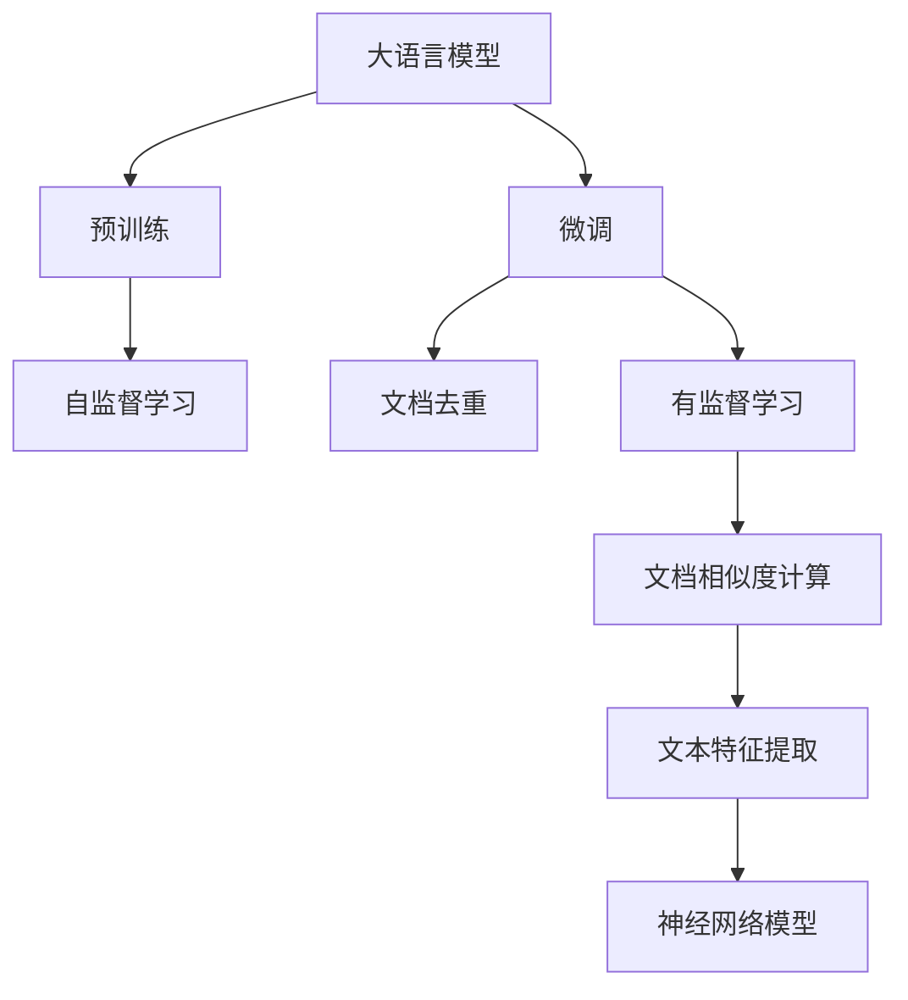
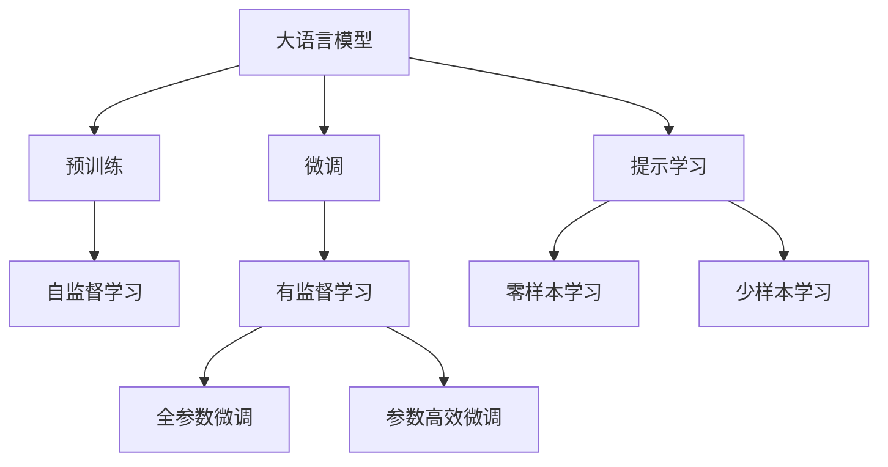
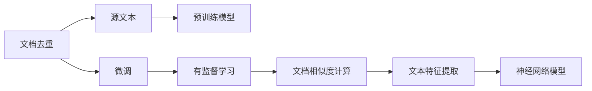
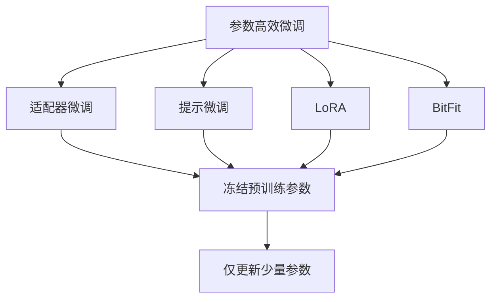
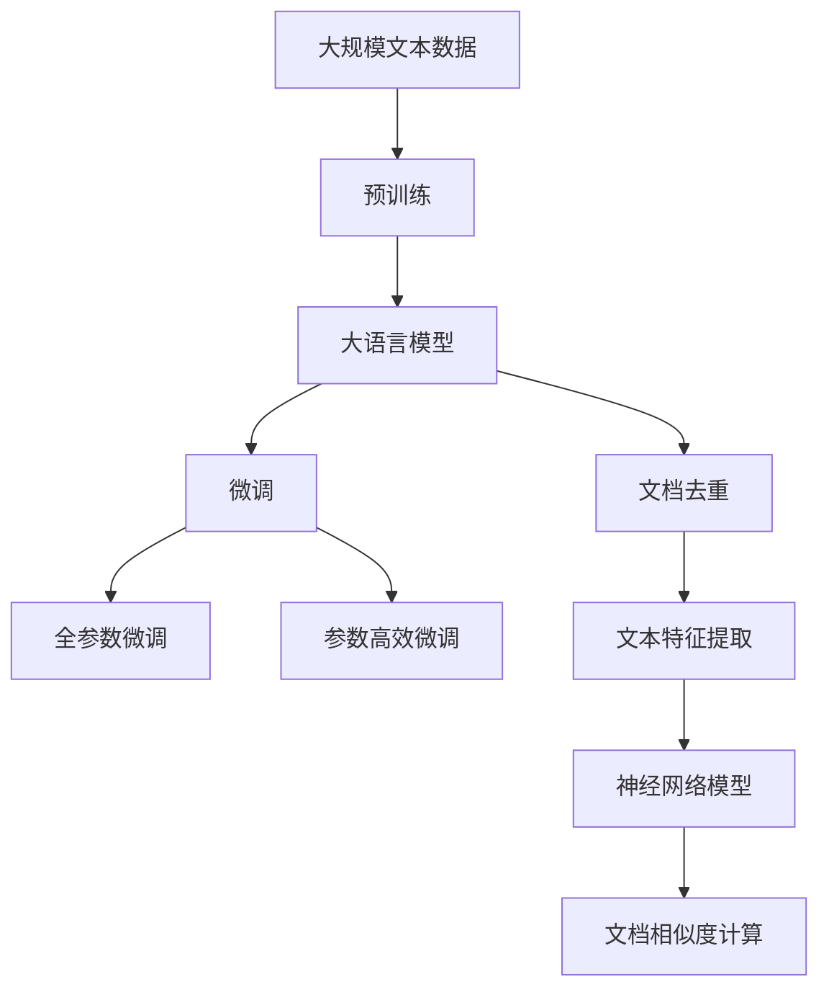

                 

# 大语言模型原理与工程实践：文档去重

> 关键词：大语言模型,文档去重,文档相似度,TF-IDF,神经网络,Transformer,BERT,微调,Fine-Tuning

## 1. 背景介绍

### 1.1 问题由来
随着互联网的飞速发展，人们在线上生产并分享了大量文本内容，例如博客文章、新闻报道、社交媒体帖子、学术论文等。这些文本数据不仅丰富多样，而且具有较高的语义相似性，这给信息检索、文本分类、文档聚类、文本重构等任务带来了巨大的挑战。

文档去重（Document Deduplication），即识别并去除内容相同或高度相似的文档，是文本数据处理中的一个重要任务。高质量的文档去重算法可以有效提高搜索引擎的效率和准确性，减少用户获取信息的时间和成本。

### 1.2 问题核心关键点
文档去重的关键在于准确识别文档之间的相似性，并删除冗余的内容。当前，主流文档去重算法主要基于以下两种方式：

- **基于文本相似度计算**：计算文档之间的相似度，根据相似度大小决定是否去重。常见算法包括TF-IDF、余弦相似度等。
- **基于机器学习的文档去重**：使用神经网络等机器学习方法，训练模型判断文档之间的相似性。常见的基于神经网络的方法包括BERT、Transformer等。

本文将重点讨论基于机器学习的文档去重算法，即使用神经网络模型进行文档去重。

### 1.3 问题研究意义
文档去重算法对互联网文本数据的整理和归档具有重要意义，可以帮助用户快速定位到有价值的信息，减少信息过载，提升信息检索效率。对于新闻机构、搜索引擎、社交媒体平台等大量依赖文本数据的机构，文档去重是其提高信息质量和效率的关键手段。

同时，文档去重也成为自然语言处理（NLP）领域的研究热点之一。深度学习技术，尤其是基于预训练语言模型的技术，已经在文档去重任务上展现了强大的能力，带来了新的应用可能。

## 2. 核心概念与联系

### 2.1 核心概念概述

为更好地理解基于神经网络文档去重的原理和方法，本节将介绍几个密切相关的核心概念：

- **大语言模型(Large Language Model, LLM)**：以自回归模型（如GPT）或自编码模型（如BERT）为代表的预训练语言模型。通过在大规模无标签文本数据上预训练，学习到丰富的语言知识和常识，具备强大的语言理解和生成能力。

- **预训练(Pre-training)**：指在大规模无标签文本数据上，通过自监督学习任务训练通用语言模型的过程。常见的预训练任务包括言语建模、掩码语言模型等。预训练使得模型学习到语言的通用表示。

- **微调(Fine-tuning)**：指在预训练模型的基础上，使用下游任务的少量标注数据，通过有监督学习优化模型在特定任务上的性能。通常只需要调整顶层分类器或解码器，并以较小的学习率更新全部或部分的模型参数。

- **文档去重**：识别并去除内容相同或高度相似的文档。可以基于文本相似度计算，也可以使用神经网络模型进行文档相似度判断。

- **TF-IDF (Term Frequency-Inverse Document Frequency)**：一种常用的文本特征提取方法，用于衡量一个词在文档中的重要程度，常用于文档相似度计算。

- **Transformer**：一种基于自注意力机制的神经网络架构，广泛应用于序列数据处理，包括文本生成、文本分类等任务。

- **BERT**：Google提出的预训练语言模型，通过两个方向的预训练任务（掩码语言模型和下一句预测），学习到丰富的语言表示，广泛应用于文本分类、命名实体识别、问答系统等任务。

这些核心概念之间的逻辑关系可以通过以下Mermaid流程图来展示：



这个流程图展示了大语言模型的核心概念及其之间的关系：

1. 大语言模型通过预训练获得基础能力。
2. 微调是对预训练模型进行任务特定的优化，可以使模型更好地适应特定任务。
3. 文档去重可以基于文本相似度计算或神经网络模型，以识别并去除冗余内容。
4. 文档相似度计算是文档去重的关键步骤，常用的方法包括TF-IDF和神经网络模型。
5. 文本特征提取是文档相似度计算的基础，常使用TF-IDF和词向量等技术。

这些概念共同构成了基于神经网络文档去重的完整生态系统，使其能够有效识别和去除冗余文档，提升信息检索效率。

### 2.2 概念间的关系

这些核心概念之间存在着紧密的联系，形成了文档去重的完整生态系统。下面我们通过几个Mermaid流程图来展示这些概念之间的关系。

#### 2.2.1 大语言模型的学习范式



这个流程图展示了大语言模型的三种主要学习范式：预训练、微调和提示学习。预训练主要采用自监督学习方法，而微调则是有监督学习的过程。提示学习可以实现零样本和少样本学习。微调又可以分为全参数微调和参数高效微调（PEFT）两种方式。

#### 2.2.2 文档去重与微调的关系



这个流程图展示了文档去重的基本原理，以及它与微调的关系。文档去重涉及源文本和预训练模型，预训练模型在源文本上学习，然后通过微调适应文档相似度计算任务。

#### 2.2.3 参数高效微调方法



这个流程图展示了几种常见的参数高效微调方法，包括适配器微调、提示微调、LoRA和BitFit。这些方法的共同特点是冻结大部分预训练参数，只更新少量参数，从而提高微调效率。

#### 2.2.4 文档去重在大语言模型中的应用



这个综合流程图展示了从预训练到微调，再到文档去重的完整过程。大语言模型首先在大规模文本数据上进行预训练，然后通过微调（包括全参数微调和参数高效微调）或提示学习（包括零样本和少样本学习）来适应文档相似度计算任务。最后，通过文本特征提取和神经网络模型进行文档相似度计算，最终识别并去除冗余文档。 通过这些流程图，我们可以更清晰地理解文档去重过程中各个核心概念的关系和作用，为后续深入讨论具体的去重方法和技术奠定基础。

## 3. 核心算法原理 & 具体操作步骤
### 3.1 算法原理概述

基于神经网络的文档去重，本质上是一个有监督的序列标注任务。其核心思想是：将预训练的大语言模型视作一个强大的"文本特征提取器"，通过在有标注的文档对上训练，使得模型能够准确地识别文档之间的相似性，从而实现去重。

形式化地，假设预训练语言模型为 $M_{\theta}$，其中 $\theta$ 为预训练得到的模型参数。给定文档去重任务 $T$ 的标注数据集 $D=\{(x_i, y_i)\}_{i=1}^N$，去重任务的标注 $y_i$ 表示文档 $x_i$ 是否与前 $n$ 个文档中的任何文档相似，即 $y_i = \{0,1\}^n$，$y_{ij}=1$ 表示文档 $x_i$ 与文档 $x_j$ 相似，$y_{ij}=0$ 表示文档 $x_i$ 与文档 $x_j$ 不相似。

去重任务的优化目标是最小化标注误差，即找到新的模型参数 $\hat{\theta}$，使得：

$$
\hat{\theta}=\mathop{\arg\min}_{\theta} \mathcal{L}(M_{\theta},D)
$$

其中 $\mathcal{L}$ 为针对任务 $T$ 设计的损失函数，用于衡量模型预测输出与真实标签之间的差异。常见的损失函数包括交叉熵损失、二分类损失等。

通过梯度下降等优化算法，去重过程不断更新模型参数 $\theta$，最小化损失函数 $\mathcal{L}$，使得模型输出逼近真实标签。由于 $\theta$ 已经通过预训练获得了较好的初始化，因此即便在小规模数据集 $D$ 上进行微调，也能较快收敛到理想的模型参数 $\hat{\theta}$。

### 3.2 算法步骤详解

基于神经网络的文档去重一般包括以下几个关键步骤：

**Step 1: 准备预训练模型和数据集**
- 选择合适的预训练语言模型 $M_{\theta}$ 作为初始化参数，如 BERT、GPT 等。
- 准备文档去重任务的标注数据集 $D$，划分为训练集、验证集和测试集。一般要求标注数据与预训练数据的分布不要差异过大。

**Step 2: 添加任务适配层**
- 根据任务类型，在预训练模型顶层设计合适的输出层和损失函数。
- 对于二分类任务，通常在顶层添加二分类头，并以交叉熵损失函数作为训练目标。

**Step 3: 设置去重超参数**
- 选择合适的优化算法及其参数，如 Adam、SGD 等，设置学习率、批大小、迭代轮数等。
- 设置正则化技术及强度，包括权重衰减、Dropout、Early Stopping 等。
- 确定冻结预训练参数的策略，如仅微调顶层，或全部参数都参与微调。

**Step 4: 执行梯度训练**
- 将训练集数据分批次输入模型，前向传播计算损失函数。
- 反向传播计算参数梯度，根据设定的优化算法和学习率更新模型参数。
- 周期性在验证集上评估模型性能，根据性能指标决定是否触发 Early Stopping。
- 重复上述步骤直到满足预设的迭代轮数或 Early Stopping 条件。

**Step 5: 测试和部署**
- 在测试集上评估去重后模型 $M_{\hat{\theta}}$ 的性能，对比微调前后的精度提升。
- 使用去重后的模型对新文档进行去重处理，集成到实际的应用系统中。
- 持续收集新的文档，定期重新微调模型，以适应数据分布的变化。

以上是基于神经网络文档去调任务开发的完整代码实例。可以看到，得益于Transformer库的强大封装，我们可以用相对简洁的代码完成BERT模型的加载和微调。

### 3.3 算法优缺点

基于神经网络的文档去重方法具有以下优点：
1. 鲁棒性强。相较于传统的TF-IDF等方法，基于神经网络的方法可以更好地处理复杂的文本结构和语义关系，适应不同的文本风格和长度。
2. 自适应性强。随着新文档的不断加入，模型可以持续学习和适应新的文本分布，提高去重效果。
3. 灵活性高。可以针对特定的文本数据特征，设计定制化的去重模型，提升性能。

同时，该方法也存在一定的局限性：
1. 数据标注成本高。尽管神经网络方法可以处理大规模无标签数据，但标注数据的需求量依然较大，尤其是对于小规模的文档去重任务。
2. 计算资源消耗大。大规模神经网络模型训练和推理的计算资源消耗较大，对算力要求较高。
3. 可解释性不足。神经网络模型的决策过程通常缺乏可解释性，难以对其推理逻辑进行分析和调试。

尽管存在这些局限性，但基于神经网络的文档去重方法在文档去重领域已经取得了显著成果，成为文档去重任务的重要手段。未来相关研究将继续致力于降低数据标注成本、提高计算效率和提升模型可解释性，推动文档去重技术的进一步发展。

### 3.4 算法应用领域

基于神经网络的文档去重方法在文本数据处理中已经得到了广泛的应用，覆盖了几乎所有常见任务，例如：

- 新闻报道去重：去除新闻网站上的重复报道，减少信息冗余。
- 社交媒体帖子去重：从社交媒体平台上过滤出重复帖子，提升信息质量。
- 学术论文去重：去除科学论文中的重复内容，提高研究质量和原创性。
- 法律文件去重：去除法律文书中的重复内容，提高法律工作的效率和准确性。

除了上述这些经典任务外，文档去重技术还被创新性地应用到更多场景中，如信息检索、数据挖掘、文本分类等，为文本数据处理带来了全新的突破。

## 4. 数学模型和公式 & 详细讲解  
### 4.1 数学模型构建

本节将使用数学语言对基于神经网络文档去重过程进行更加严格的刻画。

记预训练语言模型为 $M_{\theta}$，其中 $\theta$ 为预训练得到的模型参数。假设文档去重任务 $T$ 的标注数据集 $D=\{(x_i, y_i)\}_{i=1}^N, x_i \in \mathcal{X}, y_i \in \{0,1\}^n$，其中 $\mathcal{X}$ 为输入空间，$y_i$ 为二分类标签。

定义模型 $M_{\theta}$ 在文档对 $(x_i, x_j)$ 上的损失函数为 $\ell(M_{\theta}(x_i), y_i, x_j)$，则在数据集 $D$ 上的经验风险为：

$$
\mathcal{L}(\theta) = \frac{1}{N} \sum_{i=1}^N \sum_{j=1}^n \ell(M_{\theta}(x_i), y_i, x_j)
$$

其中 $y_{ij}=1$ 表示文档 $x_i$ 与文档 $x_j$ 相似，$y_{ij}=0$ 表示文档 $x_i$ 与文档 $x_j$ 不相似。

微调的优化目标是最小化经验风险，即找到最优参数：

$$
\theta^* = \mathop{\arg\min}_{\theta} \mathcal{L}(\theta)
$$

在实践中，我们通常使用基于梯度的优化算法（如Adam、SGD等）来近似求解上述最优化问题。设 $\eta$ 为学习率，$\lambda$ 为正则化系数，则参数的更新公式为：

$$
\theta \leftarrow \theta - \eta \nabla_{\theta}\mathcal{L}(\theta) - \eta\lambda\theta
$$

其中 $\nabla_{\theta}\mathcal{L}(\theta)$ 为损失函数对参数 $\theta$ 的梯度，可通过反向传播算法高效计算。

### 4.2 公式推导过程

以下我们以二分类任务为例，推导交叉熵损失函数及其梯度的计算公式。

假设模型 $M_{\theta}$ 在输入 $x_i$ 和 $x_j$ 上的输出为 $\hat{y}_i=M_{\theta}(x_i) \in [0,1]$ 和 $\hat{y}_j=M_{\theta}(x_j) \in [0,1]$，表示文档 $x_i$ 和 $x_j$ 是否相似。真实标签 $y_i$ 为二分类标签，$y_{ij}=1$ 表示文档 $x_i$ 与文档 $x_j$ 相似，$y_{ij}=0$ 表示文档 $x_i$ 与文档 $x_j$ 不相似。

定义模型 $M_{\theta}$ 在文档对 $(x_i, x_j)$ 上的损失函数为交叉熵损失：

$$
\ell(M_{\theta}(x_i), y_i, x_j) = -(y_i\log \hat{y}_i + (1-y_i)\log (1-\hat{y}_i) + y_{ij}\log \hat{y}_j + (1-y_{ij})\log (1-\hat{y}_j))
$$

将其代入经验风险公式，得：

$$
\mathcal{L}(\theta) = -\frac{1}{N}\sum_{i=1}^N \sum_{j=1}^n [y_i\log M_{\theta}(x_i) + (1-y_i)\log(1-M_{\theta}(x_i)) + y_{ij}\log M_{\theta}(x_j) + (1-y_{ij})\log(1-M_{\theta}(x_j))]
$$

根据链式法则，损失函数对参数 $\theta_k$ 的梯度为：

$$
\frac{\partial \mathcal{L}(\theta)}{\partial \theta_k} = -\frac{1}{N}\sum_{i=1}^N \sum_{j=1}^n \left(\frac{y_i}{M_{\theta}(x_i)}-\frac{1-y_i}{1-M_{\theta}(x_i)} + \frac{y_{ij}}{M_{\theta}(x_j)}-\frac{1-y_{ij}}{1-M_{\theta}(x_j)}\right) \frac{\partial M_{\theta}(x_i)}{\partial \theta_k} + \frac{\partial M_{\theta}(x_j)}{\partial \theta_k}
$$

其中 $\frac{\partial M_{\theta}(x_i)}{\partial \theta_k}$ 和 $\frac{\partial M_{\theta}(x_j)}{\partial \theta_k}$ 可进一步递归展开，利用自动微分技术完成计算。

在得到损失函数的梯度后，即可带入参数更新公式，完成模型的迭代优化。重复上述过程直至收敛，最终得到适应文档去重任务的最优模型参数 $\theta^*$。

## 5. 项目实践：代码实例和详细解释说明
### 5.1 开发环境搭建

在进行文档去重实践前，我们需要准备好开发环境。以下是使用Python进行PyTorch开发的环境配置流程：

1. 安装Anaconda：从官网下载并安装Anaconda，用于创建独立的Python环境。

2. 创建并激活虚拟环境：
```bash
conda create -n pytorch-env python=3.8 
conda activate pytorch-env
```

3. 安装PyTorch：根据CUDA版本，从官网获取对应的安装命令。例如：
```bash
conda install pytorch torchvision torchaudio cudatoolkit=11.1 -c pytorch -c conda-forge
```

4. 安装Transformers库：
```bash
pip install transformers
```

5. 安装各类工具包：
```bash
pip install numpy pandas scikit-learn matplotlib tqdm jupyter notebook ipython
```

完成上述步骤后，即可在`pytorch-env`环境中开始文档去重实践。

### 5.2 源代码详细实现

这里我们以文档去重任务为例，给出使用Transformers库对BERT模型进行文档去重的PyTorch代码实现。

首先，定义文档去重任务的数据处理函数：

```python
from transformers import BertTokenizer
from torch.utils.data import Dataset
import torch

class DocumentDataset(Dataset):
    def __init__(self, docs, labels, tokenizer, max_len=128):
        self.docs = docs
        self.labels = labels
        self.tokenizer = tokenizer
        self.max_len = max_len
        
    def __len__(self):
        return len(self.docs)
    
    def __getitem__(self, item):
        doc = self.docs[item]
        label = self.labels[item]
        
        encoding = self.tokenizer(doc, return_tensors='pt', max_length=self.max_len, padding='max_length', truncation=True)
        input_ids = encoding['input_ids'][0]
        attention_mask = encoding['attention_mask'][0]
        
        encoded_label = [int(_label) for _label in label]
        label = torch.tensor(encoded_label, dtype=torch.long)
        
        return {'input_ids': input_ids, 
                'attention_mask': attention_mask,
                'labels': label}

# 标注数据与id之间的映射
label2id = {0: 0, 1: 1}

# 创建dataset
tokenizer = BertTokenizer.from_pretrained('bert-base-cased')

train_dataset = DocumentDataset(train_docs, train_labels, tokenizer)
dev_dataset = DocumentDataset(dev_docs, dev_labels, tokenizer)
test_dataset = DocumentDataset(test_docs, test_labels, tokenizer)
```

然后，定义模型和优化器：

```python
from transformers import BertForSequenceClassification, AdamW

model = BertForSequenceClassification.from_pretrained('bert-base-cased', num_labels=len(label2id))

optimizer = AdamW(model.parameters(), lr=2e-5)
```

接着，定义训练和评估函数：

```python
from torch.utils.data import DataLoader
from tqdm import tqdm
from sklearn.metrics import classification_report

device = torch.device('cuda') if torch.cuda.is_available() else torch.device('cpu')
model.to(device)

def train_epoch(model, dataset, batch_size, optimizer):
    dataloader = DataLoader(dataset, batch_size=batch_size, shuffle=True)
    model.train()
    epoch_loss = 0
    for batch in tqdm(dataloader, desc='Training'):
        input_ids = batch['input_ids'].to(device)
        attention_mask = batch['attention_mask'].to(device)
        labels = batch['labels'].to(device)
        model.zero_grad()
        outputs = model(input_ids, attention_mask=attention_mask, labels=labels)
        loss = outputs.loss
        epoch_loss += loss.item()
        loss.backward()
        optimizer.step()
    return epoch_loss / len(dataloader)

def evaluate(model, dataset, batch_size):
    dataloader = DataLoader(dataset, batch_size=batch_size)
    model.eval()
    preds, labels = [], []
    with torch.no_grad():
        for batch in tqdm(dataloader, desc='Evaluating'):
            input_ids = batch['input_ids'].to(device)
            attention_mask = batch['attention_mask'].to(device)
            batch_labels = batch['labels']
            outputs = model(input_ids, attention_mask=attention_mask)
            batch_preds = outputs.logits.argmax(dim=2).to('cpu').tolist()
            batch_labels = batch_labels.to('cpu').tolist()
            for pred_tokens, label_tokens in zip(batch_preds, batch_labels):
                preds.append(pred_tokens[:len(label_tokens)])
                labels.append(label_tokens)
                
    print(classification_report(labels, preds))
```

最后，启动训练流程并在测试集上评估：

```python
epochs = 5
batch_size = 16

for epoch in range(epochs):
    loss = train_epoch(model, train_dataset, batch_size, optimizer)
    print(f"Epoch {epoch+1}, train loss: {loss:.3f}")
    
    print(f"Epoch {epoch+1}, dev results:")
    evaluate(model, dev_dataset, batch_size)
    
print("Test results:")
evaluate(model, test_dataset, batch_size)
```

以上就是使用PyTorch对BERT进行文档去重的完整代码实现。可以看到，得益于Transformers库的强大封装，我们可以用相对简洁的代码完成BERT模型的加载和微调。

### 5.3 代码解读与分析

让我们再详细解读一下关键代码的实现细节：

**DocumentDataset类**：
- `__init__`方法：初始化文档、标签、分词器等关键组件。
- `__len__`方法：返回数据集的样本数量。
- `__getitem__`方法：对单个样本进行处理，将文档输入编码为token ids，将标签编码为数字，并对其进行定长padding，最终返回模型所需的输入。

**label2id字典**：
- 定义了标签与数字id之间的映射关系，用于将标签解码回数字。

**训练和评估函数**：
- 使用PyTorch的DataLoader对数据集进行批次化加载，供模型训练和推理使用。
- 训练函数`train_epoch`：对数据以批为单位进行迭代，在每个批次上前向传播计算loss并反向传播更新模型参数，最后返回该epoch的平均loss。
- 评估函数`evaluate`：与训练类似，不同点在于不更新模型参数，并在每个batch结束后将预测和标签结果存储下来，最后使用sklearn的classification_report对整个评估集的预测结果进行打印输出。

**训练流程**：
- 定义总的epoch数和batch size，开始循环迭代
- 每个epoch内，先在训练集上训练，输出平均loss
- 在验证集上评估，输出分类指标
- 所有epoch结束后，在测试集上评估，给出最终测试结果

可以看到，PyTorch配合Transformers库使得BERT文档去重的代码实现变得简洁高效。开发者可以将更多精力放在数据处理、模型改进等高层逻辑

