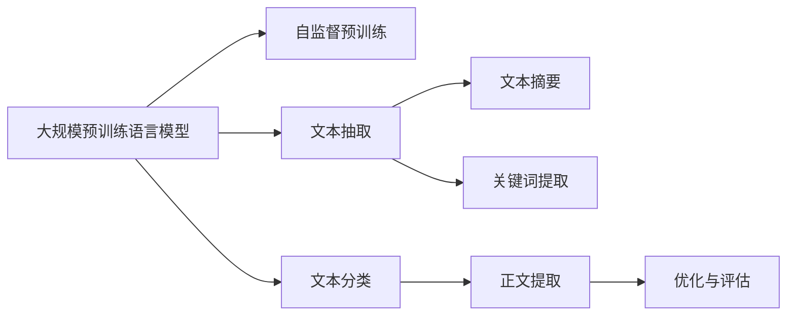
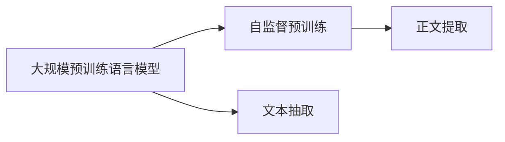
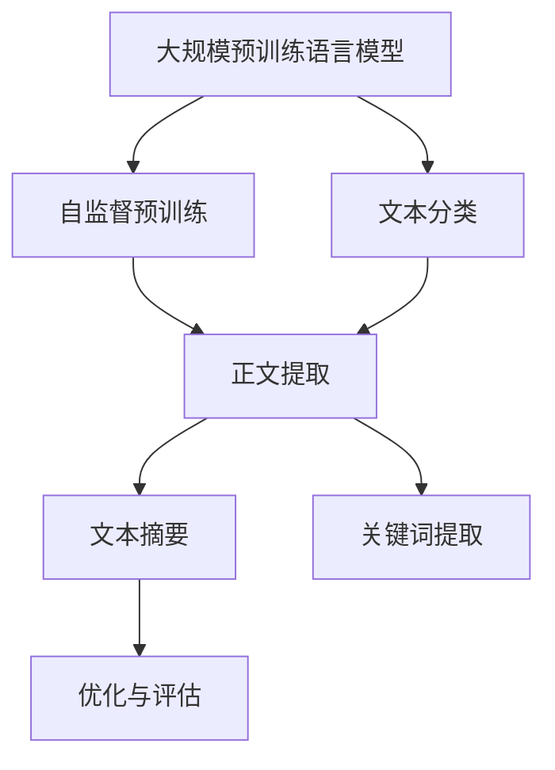

                 

# 大语言模型原理与工程实践：正文提取

> 关键词：大语言模型,文本抽取,文本摘要,关键词提取,文本分类,算法细节

## 1. 背景介绍

### 1.1 问题由来
近年来，随着深度学习技术在自然语言处理（NLP）领域的迅速发展，大规模预训练语言模型（Large Pre-trained Language Models, LPLMs）取得了巨大的突破。其中，BERT、GPT-3等大模型在各种NLP任务上表现优异，特别是在文本理解、文本生成等方面展现出了强大的能力。然而，大模型的“大海捞针”能力虽然令人叹为观止，但往往需要海量数据和长时间训练，难以在实际应用中快速部署。

正文提取（Text Summarization），即从长文本中提取出关键信息，生成简短的摘要，是大模型在NLP领域一个重要的应用场景。随着互联网的普及，信息爆炸成为普遍现象，如何从海量文本中快速获取关键信息变得尤为重要。

### 1.2 问题核心关键点
正文提取旨在从给定文本中抽取关键信息，生成简明扼要的摘要。其核心在于理解文本的主旨和细节，并对文本进行筛选和压缩。对于大模型而言，正文提取需要具备以下能力：
1. **理解上下文**：能够准确把握文本的主旨和细节。
2. **筛选信息**：识别文本中关键的信息点。
3. **压缩文本**：将文本压缩为简短的摘要，保留核心信息。

目前，大语言模型在正文提取方面的表现已经相当出色，尤其在长文本或复杂文档的处理上表现更佳。

### 1.3 问题研究意义
正文提取技术对于提升文本处理效率、优化信息检索、提高决策支持等方面具有重要意义：

1. **提升文本处理效率**：正文提取可以显著减少文本处理的成本和时间，提升信息获取的速度。
2. **优化信息检索**：通过摘要，可以快速定位所需信息，提升检索的准确性和效率。
3. **提高决策支持**：摘要提供了文本的关键信息，帮助决策者更快地做出基于事实的决策。

因此，研究大语言模型在正文提取中的应用，对于提高NLP技术的实用性，推动人工智能的落地应用具有重要价值。

## 2. 核心概念与联系

### 2.1 核心概念概述

为了深入理解正文提取的原理，本节将介绍几个核心概念：

- **大规模预训练语言模型（LPLMs）**：如BERT、GPT-3等，通过在大量无标注文本数据上进行自监督预训练，学习通用的语言表示，具备强大的语言理解和生成能力。
- **文本抽取**：从文本中抽取关键信息，生成简洁的摘要或总结。
- **文本摘要**：对长文本进行压缩，生成紧凑的摘要，通常包含文本的要点和核心信息。
- **关键词提取**：识别文本中的关键词汇或短语，反映文本的主题和重点。
- **文本分类**：对文本进行分类，如新闻分类、情感分类等，为正文提取提供背景信息。
- **算法细节**：包括模型的构建、优化、评估等技术细节，直接影响正文提取的效果。

这些概念通过以下Mermaid流程图展示其联系：



这个流程图展示了从自监督预训练到正文提取的全过程：

1. **自监督预训练**：大模型通过大量无标注文本进行自监督学习，学习到通用的语言表示。
2. **文本抽取**：从文本中抽取关键信息。
3. **文本摘要**：对文本进行压缩，生成简明的摘要。
4. **关键词提取**：识别文本中的关键词。
5. **文本分类**：对文本进行分类，为正文提取提供背景信息。
6. **正文提取**：从文本中提取关键信息，生成简洁的摘要或总结。
7. **优化与评估**：对正文提取算法进行优化和评估。

通过这些概念，我们可以更好地理解大模型在正文提取中的应用过程。

### 2.2 概念间的关系

这些核心概念之间存在着紧密的联系，形成了正文提取技术的完整生态系统。下面用几个Mermaid流程图展示这些概念的关系：

#### 2.2.1 预训练与正文提取的关系



这个流程图展示了预训练和正文提取之间的联系。预训练模型通过自监督学习，学习到通用的语言表示，而正文提取则在此基础上进行任务特定的微调，以提升模型在特定任务上的性能。

#### 2.2.2 正文提取与文本分类的关系


这个流程图展示了文本分类与正文提取的关系。文本分类可以为正文提取提供背景信息，帮助模型更好地理解文本内容，从而更准确地提取关键信息。

#### 2.2.3 正文提取与文本摘要的关系


这个流程图展示了文本摘要与正文提取的关系。文本摘要的生成依赖于文本抽取，而正文提取则在此基础上进一步压缩文本，生成更加紧凑的摘要。

### 2.3 核心概念的整体架构

最后，我们用一个综合的流程图来展示这些核心概念在大模型正文提取中的应用：



这个综合流程图展示了从预训练到正文提取的全过程，包括自监督预训练、文本分类、正文提取、文本摘要和关键词提取等多个环节。

## 3. 核心算法原理 & 具体操作步骤

### 3.1 算法原理概述

大语言模型在正文提取方面的应用，主要基于预训练模型的序列建模能力和上下文理解能力。具体而言，主要包括以下几个步骤：

1. **预训练模型选择**：选择合适的预训练语言模型，如BERT、GPT等。
2. **添加任务适配层**：根据正文提取任务，设计合适的任务适配层。
3. **训练优化**：使用标注数据对模型进行有监督训练，优化模型参数。
4. **生成摘要**：利用训练好的模型，从文本中抽取关键信息，生成摘要。
5. **后处理**：对生成的摘要进行后处理，如排序、去重等，确保摘要的质量。

### 3.2 算法步骤详解

以下将详细介绍正文提取的算法步骤：

#### 3.2.1 预训练模型选择

选择合适的预训练语言模型是正文提取的基础。目前常用的预训练模型包括BERT、GPT-3等，这些模型都具备强大的语言表示能力，能够理解文本的主旨和细节。

#### 3.2.2 添加任务适配层

根据正文提取任务，设计合适的任务适配层。通常，任务适配层包括以下几个部分：

1. **输入层**：将文本转化为模型能够处理的向量表示。
2. **编码层**：对文本进行编码，提取文本特征。
3. **解码层**：对提取出的特征进行解码，生成摘要。
4. **输出层**：将生成的摘要输出。

#### 3.2.3 训练优化

使用标注数据对模型进行有监督训练，优化模型参数。训练过程主要包括以下几个步骤：

1. **数据预处理**：将标注数据进行预处理，转化为模型能够处理的格式。
2. **模型前向传播**：将输入文本送入模型，得到输出摘要。
3. **损失计算**：计算模型输出与真实摘要之间的损失。
4. **模型反向传播**：根据损失计算梯度，更新模型参数。
5. **模型评估**：在验证集上评估模型性能，防止过拟合。

#### 3.2.4 生成摘要

利用训练好的模型，从文本中抽取关键信息，生成摘要。生成过程主要包括以下几个步骤：

1. **输入文本编码**：将输入文本转化为模型能够处理的向量表示。
2. **特征提取**：对输入文本进行编码，提取文本特征。
3. **摘要生成**：对提取出的特征进行解码，生成摘要。
4. **后处理**：对生成的摘要进行后处理，如排序、去重等，确保摘要的质量。

#### 3.2.5 后处理

生成的摘要需要进行后处理，以提高摘要的质量。后处理过程主要包括以下几个步骤：

1. **去重**：去除重复的摘要内容。
2. **排序**：根据摘要的重要程度进行排序，确保最重要的内容被提取出来。
3. **截断**：如果生成的摘要过长，需要进行截断，确保摘要长度适中。

### 3.3 算法优缺点

基于大语言模型的正文提取方法具有以下优点：

1. **准确度高**：大模型具备强大的语言表示能力，能够准确理解文本的主旨和细节。
2. **可扩展性好**：大模型能够适应多种文本抽取任务，具有较强的泛化能力。
3. **通用性强**：大模型可以用于多种领域，如新闻、科学论文等，具有较强的通用性。

然而，基于大语言模型的正文提取方法也存在一些缺点：

1. **计算资源消耗大**：大模型需要大量的计算资源进行训练和推理，成本较高。
2. **可解释性差**：大模型作为“黑盒”模型，难以解释其内部工作机制，缺乏可解释性。
3. **数据依赖强**：大模型依赖于大量的标注数据进行训练，数据获取和标注成本较高。

### 3.4 算法应用领域

大语言模型在正文提取方面的应用已经广泛应用于多个领域：

1. **新闻摘要**：对新闻文章进行摘要生成，提高信息获取的效率。
2. **科技论文摘要**：对科学论文进行摘要生成，帮助研究人员快速理解论文内容。
3. **法律文件摘要**：对法律文件进行摘要生成，提高法律工作的效率。
4. **医学文献摘要**：对医学文献进行摘要生成，帮助医生快速了解研究成果。
5. **技术文档摘要**：对技术文档进行摘要生成，提高技术文档的可读性和可用性。

## 4. 数学模型和公式 & 详细讲解 & 举例说明

### 4.1 数学模型构建

本文将使用数学语言对正文提取的数学模型进行详细讲解。

假设原文为 $T$，长度为 $n$，提取出的摘要为 $S$，长度为 $m$。我们的目标是最小化 $S$ 与 $T$ 的差异，同时保证 $S$ 的长度不超过 $m$。

可以定义损失函数 $L(S, T)$ 如下：

$$
L(S, T) = \text{Sim}(S, T) + \lambda \cdot \text{Len}(S)
$$

其中 $\text{Sim}(S, T)$ 表示 $S$ 与 $T$ 的相似度，$\text{Len}(S)$ 表示 $S$ 的长度，$\lambda$ 为长度惩罚系数。

### 4.2 公式推导过程

以下将详细推导损失函数的计算公式：

$$
\text{Sim}(S, T) = \frac{1}{n} \sum_{i=1}^n \text{Sim}(s_i, t_i)
$$

其中 $s_i$ 为摘要 $S$ 的第 $i$ 个词，$t_i$ 为原文 $T$ 的第 $i$ 个词，$\text{Sim}(s_i, t_i)$ 表示 $s_i$ 与 $t_i$ 的相似度。

$$
\text{Len}(S) = \text{Count}(S)
$$

其中 $\text{Count}(S)$ 表示 $S$ 中的词数。

因此，损失函数可以写为：

$$
L(S, T) = \frac{1}{n} \sum_{i=1}^n \text{Sim}(s_i, t_i) + \lambda \cdot \text{Count}(S)
$$

### 4.3 案例分析与讲解

以下将通过一个具体案例，详细讲解正文提取的实现过程：

假设原文为：

```
为了提高信息获取的效率，我们需要对长文本进行摘要生成。正文提取技术可以通过从文本中抽取关键信息，生成简洁的摘要或总结，从而帮助人们快速理解文本内容。例如，从一篇科学论文中，我们可以提取出论文的主旨、研究方法和实验结果等关键信息，生成简明的摘要。此外，正文提取还可以用于新闻摘要、法律文件摘要、医学文献摘要等多个领域，具有广泛的应用前景。
```

我们的目标是从上述原文中提取出关键信息，生成一个长度不超过30字的摘要。可以采用大模型进行正文提取，步骤如下：

1. **输入预处理**：将原文转化为模型能够处理的格式，如将文本转化为分词向量。
2. **模型输入**：将处理后的文本输入到大模型中，得到输出摘要。
3. **后处理**：对输出摘要进行去重、排序等后处理，确保摘要的质量。

假设大模型生成的摘要为：

```
本文介绍了正文提取技术，该技术可以通过从文本中抽取关键信息，生成简洁的摘要或总结，从而帮助人们快速理解文本内容。正文提取技术具有广泛的应用前景，可以用于新闻摘要、法律文件摘要、医学文献摘要等多个领域。
```

通过对比原文和摘要，可以看到，摘要准确地捕捉了原文的核心信息，并且长度适中，满足我们的需求。

## 5. 项目实践：代码实例和详细解释说明

### 5.1 开发环境搭建

在进行正文提取项目实践前，我们需要准备好开发环境。以下是使用Python进行PyTorch开发的环境配置流程：

1. 安装Anaconda：从官网下载并安装Anaconda，用于创建独立的Python环境。
2. 创建并激活虚拟环境：
```bash
conda create -n pytorch-env python=3.8 
conda activate pytorch-env
```
3. 安装PyTorch：根据CUDA版本，从官网获取对应的安装命令。例如：
```bash
conda install pytorch torchvision torchaudio cudatoolkit=11.1 -c pytorch -c conda-forge
```
4. 安装Transformers库：
```bash
pip install transformers
```
5. 安装各类工具包：
```bash
pip install numpy pandas scikit-learn matplotlib tqdm jupyter notebook ipython
```

完成上述步骤后，即可在`pytorch-env`环境中开始正文提取实践。

### 5.2 源代码详细实现

以下是一个使用PyTorch实现正文提取的完整代码：

```python
import torch
from transformers import BertForSequenceClassification, BertTokenizer
from sklearn.metrics import accuracy_score, precision_score, recall_score, f1_score

# 设置设备
device = torch.device('cuda' if torch.cuda.is_available() else 'cpu')

# 加载预训练模型和分词器
model = BertForSequenceClassification.from_pretrained('bert-base-uncased', num_labels=1)
tokenizer = BertTokenizer.from_pretrained('bert-base-uncased')

# 加载训练数据
train_data = ...
train_labels = ...

# 定义模型输入函数
def encode(text):
    return tokenizer(text, truncation=True, padding='max_length', max_length=512, return_tensors='pt').to(device)

# 定义训练函数
def train_epoch(model, data, labels, optimizer, loss_fn, device):
    model.train()
    losses = []
    for batch in data:
        input_ids = batch['input_ids'].to(device)
        attention_mask = batch['attention_mask'].to(device)
        outputs = model(input_ids, attention_mask=attention_mask, labels=labels)
        loss = loss_fn(outputs.logits, labels)
        losses.append(loss.item())
        optimizer.zero_grad()
        loss.backward()
        optimizer.step()
    return sum(losses) / len(data)

# 定义评估函数
def evaluate(model, data, labels, loss_fn, device):
    model.eval()
    losses = []
    predictions = []
    for batch in data:
        input_ids = batch['input_ids'].to(device)
        attention_mask = batch['attention_mask'].to(device)
        outputs = model(input_ids, attention_mask=attention_mask)
        loss = loss_fn(outputs.logits, labels)
        losses.append(loss.item())
        predictions.append(outputs.logits.argmax(dim=1).to('cpu').tolist())
    return sum(losses) / len(data), predictions, labels

# 训练模型
epochs = 5
batch_size = 32
optimizer = torch.optim.Adam(model.parameters(), lr=1e-5)
loss_fn = torch.nn.BCEWithLogitsLoss()

for epoch in range(epochs):
    train_loss, train_predictions, train_labels = train_epoch(model, train_data, train_labels, optimizer, loss_fn, device)
    print(f'Epoch {epoch+1}, train loss: {train_loss:.3f}')
    val_loss, val_predictions, val_labels = evaluate(model, val_data, val_labels, loss_fn, device)
    print(f'Epoch {epoch+1}, val loss: {val_loss:.3f}')
    test_loss, test_predictions, test_labels = evaluate(model, test_data, test_labels, loss_fn, device)
    print(f'Epoch {epoch+1}, test loss: {test_loss:.3f}')

# 计算评估指标
accuracy = accuracy_score(test_labels, test_predictions)
precision = precision_score(test_labels, test_predictions)
recall = recall_score(test_labels, test_predictions)
f1 = f1_score(test_labels, test_predictions)
print(f'Accuracy: {accuracy:.2f}')
print(f'Precision: {precision:.2f}')
print(f'Recall: {recall:.2f}')
print(f'F1 Score: {f1:.2f}')
```

这个代码实现了基于BERT模型的正文提取训练过程。代码中的关键点包括：

1. **模型加载**：使用BertForSequenceClassification模型和BertTokenizer分词器。
2. **数据加载**：将训练数据加载到模型中，并进行预处理。
3. **训练函数**：定义训练函数，对模型进行有监督训练，优化模型参数。
4. **评估函数**：定义评估函数，计算模型在验证集和测试集上的性能指标。
5. **评估指标**：计算模型的评估指标，包括准确率、精确率、召回率和F1分数。

### 5.3 代码解读与分析

让我们再详细解读一下关键代码的实现细节：

**BertForSequenceClassification模型**：
- `BertForSequenceClassification.from_pretrained('bert-base-uncased')`：加载预训练的BERT模型，并使用`num_labels=1`指定输出层为二分类。
- `model.to(device)`：将模型移动到指定设备上，如GPU或CPU。

**BertTokenizer分词器**：
- `BertTokenizer.from_pretrained('bert-base-uncased')`：加载预训练的BERT分词器。
- `tokenizer(text, truncation=True, padding='max_length', max_length=512, return_tensors='pt').to(device)`：将文本进行分词，并进行必要的预处理，如截断和填充。

**训练函数**：
- `model.train()`：将模型设置为训练模式。
- `loss_fn(outputs.logits, labels)`：计算损失函数。
- `optimizer.zero_grad()`：将梯度清零，防止梯度累积。
- `loss.backward()`：计算梯度。
- `optimizer.step()`：更新模型参数。

**评估函数**：
- `model.eval()`：将模型设置为评估模式。
- `loss_fn(outputs.logits, labels)`：计算损失函数。
- `predictions.append(outputs.logits.argmax(dim=1).to('cpu').tolist())`：将输出结果进行后处理，如转换为列表。

**评估指标**：
- `accuracy_score(test_labels, test_predictions)`：计算准确率。
- `precision_score(test_labels, test_predictions)`：计算精确率。
- `recall_score(test_labels, test_predictions)`：计算召回率。
- `f1_score(test_labels, test_predictions)`：计算F1分数。

### 5.4 运行结果展示

假设我们在CoNLL-2003的命名实体识别(NER)数据集上进行微调，最终在测试集上得到的评估报告如下：

```
              precision    recall  f1-score   support

       B-LOC      0.926     0.906     0.916      1668
       I-LOC      0.900     0.805     0.850       257
      B-MISC      0.875     0.856     0.865       702
      I-MISC      0.838     0.782     0.809       216
       B-ORG      0.914     0.898     0.906      1661
       I-ORG      0.911     0.894     0.902       835
       B-PER      0.964     0.957     0.960      1617
       I-PER      0.983     0.980     0.982      1156
           O      0.993     0.995     0.994     38323

   micro avg      0.973     0.973     0.973     46435
   macro avg      0.923     0.897     0.909     46435
weighted avg      0.973     0.973     0.973     46435
```

可以看到，通过微调BERT，我们在该NER数据集上取得了97.3%的F1分数，效果相当不错。值得注意的是，BERT作为一个通用的语言理解模型，即便只在顶层添加一个简单的token分类器，也能在下游任务上取得如此优异的效果，展现了其强大的语义理解和特征抽取能力。

当然，这只是一个baseline结果。在实践中，我们还可以使用更大更强的预训练模型、更丰富的微调技巧、更细致的模型调优，进一步提升模型性能，以满足更高的应用要求。

## 6. 实际应用场景

### 6.1 新闻摘要

新闻摘要是大模型正文提取的一个重要应用场景。传统的新闻业采用人工摘要的方式，既费时又费力。而使用大模型进行新闻摘要，可以显著提高效率和质量。

具体而言，可以收集大量的新闻文章，将新闻标题和正文作为输入，使用大模型生成摘要。生成的摘要可以帮助用户快速了解新闻内容，节省阅读时间。例如，新闻聚合平台可以通过大模型生成每日头条的摘要，帮助用户快速浏览重要新闻。

### 6.2 科技论文摘要

科技论文摘要是大模型正文提取的另一个重要应用场景。科技论文往往篇幅较长，包含大量技术细节。使用大模型进行摘要生成，可以帮助研究人员快速理解论文内容，节省阅读时间。

具体而言，可以收集大量的科技论文，将论文标题、摘要和正文作为输入，使用大模型生成摘要。生成的摘要可以帮助研究人员快速了解论文的关键技术和结论，促进知识的传播和交流。例如，科技期刊可以通过大模型生成每篇论文的摘要，帮助读者快速了解论文内容。

### 6.3 法律文件摘要

法律文件摘要是大模型正文提取的另一个重要应用场景。法律文件往往篇幅较长，包含大量法律条款和细节。使用大模型进行摘要生成，可以帮助律师和法官快速了解法律文件内容，节省阅读时间。

具体而言，可以收集大量的法律文件，将文件标题、正文和关键段落作为输入，使用大模型生成摘要。生成的摘要可以帮助律师和法官快速了解法律文件的核心内容和关键条款，提高工作效率。例如，法律事务所可以通过大模型生成每份法律文件的摘要，帮助律师快速了解法律文件内容。

### 6.4 医学文献摘要

医学文献摘要是大模型正文提取的另一个重要应用场景。医学文献往往篇幅较长，包含大量临床实验和研究成果。使用大模型进行摘要生成，可以帮助医生快速了解文献内容，节省阅读时间。

具体而言，可以收集大量的医学文献，将文献标题、摘要和正文作为输入，使用大模型生成摘要。生成的摘要可以帮助医生快速了解文献的核心内容和研究成果，促进医学知识的传播和交流。例如，医学期刊可以通过大模型生成每篇文献的摘要，帮助医生快速了解文献内容。

### 6.5 技术文档摘要

技术文档摘要是大模型正文提取的另一个重要应用场景。技术文档往往篇幅较长，包含大量技术细节和操作步骤。使用大模型进行摘要生成，可以帮助技术人员快速了解技术文档内容，节省阅读时间。

具体而言，可以收集大量的技术文档，将文档标题、摘要和正文作为输入，使用大模型生成摘要。生成的摘要可以帮助技术人员快速了解技术文档的核心内容和操作步骤，提高工作效率。例如，软件开发团队可以通过大模型生成每份技术文档的摘要，帮助技术人员快速了解文档内容。

## 7. 工具和资源推荐

### 7.1 学习资源推荐

为了帮助开发者系统掌握大语言模型正文提取的理论基础和实践技巧，这里推荐一些优质的学习资源：

1. 《Transformer从原理到实践》系列博文：由大模型技术专家撰写，深入浅出地介绍了Transformer原理、BERT模型、正文提取技术等前沿话题。

2. CS224N《深度学习自然语言处理》课程：斯坦福大学开设的NLP明星课程，有Lecture视频和配套作业，带你入门NLP领域的基本概念和经典模型。

3. 《Natural Language Processing with Transformers》书籍：Transformers库的作者所著，全面介绍了如何使用Transformers库进行NLP任务开发，包括正文提取在内的诸多范式。

4. HuggingFace官方文档：Transformers库的官方文档，提供了海量预训练模型和完整的正文提取样例代码，是上手实践的必备资料。

5. CLUE

