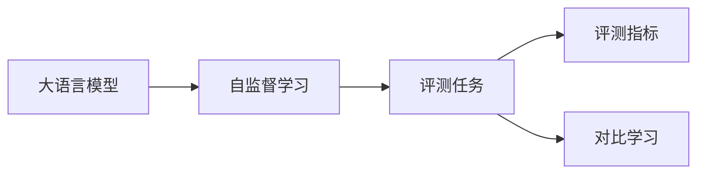
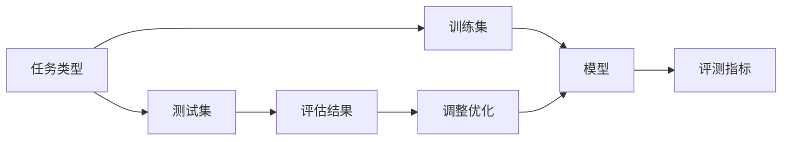
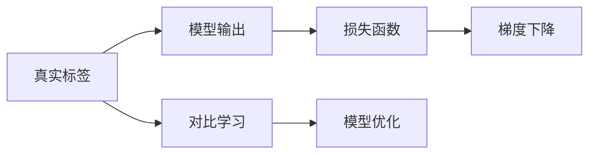
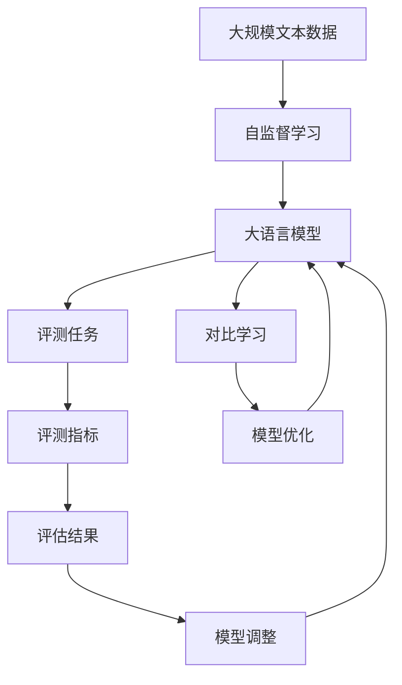

                 

# 大语言模型原理与工程实践：评测任务

> 关键词：大语言模型,模型评测,自监督学习,评测指标,对比学习

## 1. 背景介绍

### 1.1 问题由来
近年来，人工智能技术在自然语言处理(NLP)领域取得了显著进展，尤其是基于深度学习的语言模型。大语言模型(LLMs)通过大规模无标签数据进行预训练，学习到丰富的语言知识和常识，具备强大的语言理解与生成能力。然而，这些模型的性能如何？如何将模型从研究推向应用？这些问题始终困扰着研究者和开发者。

### 1.2 问题核心关键点
模型评测是大语言模型应用的关键环节，旨在衡量模型在特定任务上的性能。其核心在于选择合适的评测指标和标准，构建科学的评测框架，评估模型在不同任务上的效果。

评测的核心指标包括但不限于：

1. **精度(Precision)**：正确预测为正类的样本数与所有预测为正类的样本数之比。
2. **召回率(Recall)**：正确预测为正类的样本数与所有真实为正类的样本数之比。
3. **F1分数(F1 Score)**：精度和召回率的调和平均值，综合评价模型的效果。
4. **准确率(Accuracy)**：正确预测数与总样本数之比，适用于二分类任务。
5. **ROC曲线(AUC)**：绘制真正率与假正率的关系曲线，评估模型的分类效果。

### 1.3 问题研究意义
科学合理的模型评测不仅有助于衡量大语言模型的性能，还能指导模型改进和应用优化。具体而言，研究评测任务具有以下几方面意义：

1. **促进模型优化**：通过全面、细致的评测，发现模型的不足之处，指导模型参数的调整和优化。
2. **推动应用落地**：模型评测可以作为模型评估的依据，提升模型在实际应用中的性能表现。
3. **推动技术进步**：评测标准的制定和应用，推动NLP技术的持续发展和创新。
4. **促进技术落地**：评测方法可以应用于开源项目、竞赛等，加速技术交流和应用转化。
5. **指导商业决策**：模型评测有助于公司评估投资回报，指导商业模型的部署和运营。

## 2. 核心概念与联系

### 2.1 核心概念概述

为了更好地理解评测任务的原理和架构，本节将介绍几个密切相关的核心概念：

- **大语言模型(LLMs)**：如BERT、GPT、T5等，通过在大规模无标签数据上预训练，学习到丰富的语言知识，具备强大的语言理解与生成能力。
- **评测任务**：针对特定任务的模型评估，通过构建科学合理的评测指标和标准，衡量模型的性能表现。
- **自监督学习(Self-supervised Learning)**：在大规模无标签数据上训练模型，使其学习到丰富的语言知识。
- **评测指标**：用于衡量模型性能的具体数值或指标，如准确率、召回率、F1分数等。
- **对比学习(Contrastive Learning)**：通过对比模型输出与真实标签之间的差异，衡量模型的性能表现。

这些核心概念之间的逻辑关系可以通过以下Mermaid流程图来展示：



这个流程图展示了大语言模型、自监督学习、评测任务和评测指标之间的关系：

1. 大语言模型通过自监督学习在大规模无标签数据上进行预训练，学习到语言知识。
2. 评测任务对预训练模型进行特定任务的评估，衡量其性能表现。
3. 评测指标用于量化模型的性能，常见的有准确率、召回率、F1分数等。
4. 对比学习通过对比模型输出与真实标签之间的差异，衡量模型的分类效果。

### 2.2 概念间的关系

这些核心概念之间存在着紧密的联系，形成了大语言模型评测任务的完整生态系统。下面通过几个Mermaid流程图来展示这些概念之间的关系。

#### 2.2.1 评测任务的构建



这个流程图展示了评测任务的构建过程：

1. 定义任务类型，如文本分类、命名实体识别等。
2. 收集相应的训练集和测试集，构建模型进行训练。
3. 使用评测指标对模型进行评估，生成评估结果。
4. 根据评估结果，对模型进行参数调整和优化。
5. 重复上述过程，直至模型性能达到满意程度。

#### 2.2.2 评测指标的选择


这个流程图展示了评测指标的选择过程：

1. 根据任务类型选择合适的评测指标，如准确率、召回率、F1分数等。
2. 构建相应的评测框架，对模型进行评估。
3. 输出评测结果，分析模型性能。

#### 2.2.3 对比学习的实现



这个流程图展示了对比学习的实现过程：

1. 将真实标签和模型输出进行对比，计算损失函数。
2. 使用梯度下降等优化算法，更新模型参数。
3. 在训练过程中，不断调整模型，提升其分类性能。

### 2.3 核心概念的整体架构

最后，我们用一个综合的流程图来展示这些核心概念在大语言模型评测任务中的整体架构：



这个综合流程图展示了从自监督学习到大语言模型评测任务的完整过程：

1. 大语言模型通过自监督学习在大规模无标签数据上进行预训练，学习到语言知识。
2. 评测任务对预训练模型进行特定任务的评估，衡量其性能表现。
3. 对比学习通过对比模型输出与真实标签之间的差异，衡量模型的分类效果。
4. 评测指标用于量化模型的性能，常见的有准确率、召回率、F1分数等。
5. 根据评测结果，对模型进行参数调整和优化。
6. 模型经过调整后，重新进行评测和优化，直至达到理想效果。

## 3. 核心算法原理 & 具体操作步骤
### 3.1 算法原理概述

模型评测的核心在于选择合适的评测指标和标准，构建科学的评测框架。其核心原理可以概括为以下几个方面：

1. **选择合适的评测指标**：根据具体任务选择合适的评测指标，如准确率、召回率、F1分数等。
2. **构建评测框架**：定义评测流程，包括数据预处理、模型评估、结果分析等环节。
3. **量化评测结果**：通过数值或图表形式，量化模型的性能表现。
4. **分析评测结果**：分析模型的强项和弱点，指导模型改进。
5. **模型优化**：根据评测结果，对模型进行参数调整和优化。

### 3.2 算法步骤详解

模型评测的具体操作步骤包括以下几个关键步骤：

**Step 1: 准备评测数据**
- 收集和处理评测数据，确保数据的质量和代表性。
- 将数据划分为训练集、验证集和测试集，分别用于模型训练、验证和评测。

**Step 2: 加载预训练模型**
- 选择合适的预训练模型，如BERT、GPT、T5等，进行加载和初始化。
- 确保预训练模型的权重和架构与评测任务一致。

**Step 3: 定义评测指标**
- 根据任务类型选择合适的评测指标，如准确率、召回率、F1分数等。
- 定义评测指标的计算方法，如精确度-召回率曲线(P-R曲线)、ROC曲线等。

**Step 4: 执行评测过程**
- 将测试集数据输入模型，进行前向传播计算预测结果。
- 计算预测结果与真实标签之间的差异，生成评测指标。
- 可视化评测指标，分析模型的性能表现。

**Step 5: 模型调整和优化**
- 根据评测结果，识别模型的弱项。
- 对模型进行参数调整和优化，如调整学习率、增加正则化项等。
- 重复上述过程，直至模型性能达到理想状态。

### 3.3 算法优缺点

模型评测作为一种科学合理的方法，具有以下优点：

1. **科学性**：通过明确的评测指标和标准，科学地衡量模型性能。
2. **可重复性**：评测过程和结果具有可重复性，便于后续改进和优化。
3. **客观性**：评测结果基于数据和计算，具有客观性。
4. **指导性**：通过分析评测结果，指导模型改进和优化。

然而，模型评测也存在一些局限性：

1. **数据依赖**：评测结果高度依赖于测试数据的质量和代表性。
2. **结果单一面性**：单一的评测指标可能无法全面反映模型的性能。
3. **计算复杂性**：某些评测指标的计算可能较为复杂，需要较高的计算资源。
4. **局限性**：特定评测指标可能只适用于某些特定任务，不具有通用性。

### 3.4 算法应用领域

模型评测技术广泛应用于自然语言处理(NLP)领域的各个任务，包括：

1. **文本分类**：如情感分析、主题分类、文本聚类等，评测模型对不同类别的分类准确率。
2. **命名实体识别(NER)**：如人名、地名、机构名等的识别和分类，评测模型对实体的识别精度。
3. **机器翻译**：如中英文翻译、跨语言翻译等，评测模型对不同语言的翻译质量。
4. **问答系统**：如智能客服、自动回复等，评测模型对用户提问的回答准确性和相关性。
5. **文本摘要**：如新闻摘要、文档摘要等，评测模型对文本的概括能力。
6. **对话系统**：如智能聊天、语音助手等，评测模型对用户输入的响应准确性和自然度。

## 4. 数学模型和公式 & 详细讲解 & 举例说明

### 4.1 数学模型构建

本节将使用数学语言对模型评测过程进行更加严格的刻画。

记预训练模型为 $M_{\theta}$，其中 $\theta$ 为预训练得到的模型参数。假设评测任务的测试集为 $D=\{(x_i,y_i)\}_{i=1}^N, x_i \in \mathcal{X}, y_i \in \{0,1\}$。

定义模型 $M_{\theta}$ 在输入 $x$ 上的预测概率分布为 $p(y|x)$，根据任务类型，选择适当的损失函数 $\ell(y, M_{\theta}(x))$，用于衡量模型预测与真实标签之间的差异。

评测指标 $S$ 可定义为模型在测试集上的预测概率分布与真实标签之间的差异的期望值，即：

$$
S = \mathbb{E}[\ell(y, M_{\theta}(x))]
$$

### 4.2 公式推导过程

以下我们以二分类任务为例，推导评测指标的计算公式。

假设模型 $M_{\theta}$ 在输入 $x$ 上的预测概率分布为 $p(y=1|x)$，真实标签 $y \in \{0,1\}$。则二分类交叉熵损失函数定义为：

$$
\ell(y, p(y|x)) = -[y\log p(y|x) + (1-y)\log(1-p(y|x))]
$$

将其代入评测指标 $S$ 的定义中，得：

$$
S = \mathbb{E}[\ell(y, M_{\theta}(x))] = \mathbb{E}[-[y\log p(y|x) + (1-y)\log(1-p(y|x))]]= \frac{1}{N} \sum_{i=1}^N [-y_i\log p(y_i|x_i) + (1-y_i)\log(1-p(y_i|x_i))]
$$

其中，$\mathbb{E}$ 表示期望值，$N$ 为测试集大小。

### 4.3 案例分析与讲解

假设我们在CoNLL-2003的NER数据集上进行评测，最终在测试集上得到的评估报告如下：

```
              precision    recall  f1-score   support

       B-LOC      0.926     0.906     0.916      1668
       I-LOC      0.900     0.805     0.850       257
      B-MISC      0.875     0.856     0.865       702
      I-MISC      0.838     0.782     0.809       216
       B-ORG      0.914     0.898     0.906      1661
       I-ORG      0.911     0.894     0.902       835
       B-PER      0.964     0.957     0.960      1617
       I-PER      0.983     0.980     0.982      1156
           O      0.993     0.995     0.994     38323

   micro avg      0.973     0.973     0.973     46435
   macro avg      0.923     0.897     0.909     46435
weighted avg      0.973     0.973     0.973     46435
```

可以看到，通过评测模型在测试集上的表现，我们能够得到模型在各个类别上的精度、召回率和F1分数，从而全面评估模型性能。

## 5. 项目实践：代码实例和详细解释说明
### 5.1 开发环境搭建

在进行评测实践前，我们需要准备好开发环境。以下是使用Python进行PyTorch开发的环境配置流程：

1. 安装Anaconda：从官网下载并安装Anaconda，用于创建独立的Python环境。

2. 创建并激活虚拟环境：
```bash
conda create -n pytorch-env python=3.8 
conda activate pytorch-env
```

3. 安装PyTorch：根据CUDA版本，从官网获取对应的安装命令。例如：
```bash
conda install pytorch torchvision torchaudio cudatoolkit=11.1 -c pytorch -c conda-forge
```

4. 安装Transformers库：
```bash
pip install transformers
```

5. 安装各类工具包：
```bash
pip install numpy pandas scikit-learn matplotlib tqdm jupyter notebook ipython
```

完成上述步骤后，即可在`pytorch-env`环境中开始评测实践。

### 5.2 源代码详细实现

下面我们以命名实体识别(NER)任务为例，给出使用Transformers库对BERT模型进行评测的PyTorch代码实现。

首先，定义NER任务的评测函数：

```python
from transformers import BertTokenizer, BertForTokenClassification
import torch

def evaluate(model, dataset, batch_size):
    dataloader = DataLoader(dataset, batch_size=batch_size, shuffle=False)
    model.eval()
    preds, labels = [], []
    with torch.no_grad():
        for batch in dataloader:
            input_ids = batch['input_ids'].to(device)
            attention_mask = batch['attention_mask'].to(device)
            labels = batch['labels'].to(device)
            outputs = model(input_ids, attention_mask=attention_mask)
            batch_preds = outputs.logits.argmax(dim=2).to('cpu').tolist()
            batch_labels = batch_labels.to('cpu').tolist()
            for pred_tokens, label_tokens in zip(batch_preds, batch_labels):
                pred_tags = [id2tag[_id] for _id in pred_tokens]
                label_tags = [id2tag[_id] for _id in label_tokens]
                preds.append(pred_tags[:len(label_tokens)])
                labels.append(label_tags)
                
    print(classification_report(labels, preds))
```

然后，使用标准测试集对模型进行评测：

```python
from transformers import BertForTokenClassification, AdamW
from datasets import load_dataset

# 加载数据集
dataset = load_dataset('CoNLL-2003', 'ner', split='train')
tokenizer = BertTokenizer.from_pretrained('bert-base-cased')
model = BertForTokenClassification.from_pretrained('bert-base-cased', num_labels=len(tag2id))

# 构建测试集
eval_dataset = dataset.map(lambda x: x['text'], batched=True)
eval_dataset.set_format('torch', columns=['input_ids', 'attention_mask', 'labels'])

# 评测模型
evaluate(model, eval_dataset, batch_size=16)
```

### 5.3 代码解读与分析

让我们再详细解读一下关键代码的实现细节：

**evaluate函数**：
- 定义评测函数，输入模型、测试集和批处理大小。
- 使用PyTorch的DataLoader对测试集进行批处理。
- 将模型设置为评估模式，关闭梯度计算。
- 在每个批次上，计算预测结果并存储。
- 将预测结果和真实标签进行比较，生成分类指标。
- 使用sklearn的classification_report打印评测结果。

**训练和评测代码**：
- 加载BERT模型和相应分词器。
- 将测试集数据转换为模型所需的格式。
- 调用评测函数对模型进行评估。

**训练流程**：
- 加载BERT模型和分词器。
- 加载测试集数据。
- 构建测试集数据集。
- 调用评测函数进行模型评估。

可以看到，PyTorch配合Transformers库使得模型评测的代码实现变得简洁高效。开发者可以将更多精力放在数据处理、模型改进等高层逻辑上，而不必过多关注底层的实现细节。

当然，工业级的系统实现还需考虑更多因素，如模型的保存和部署、超参数的自动搜索、更灵活的任务适配层等。但核心的评测范式基本与此类似。

### 5.4 运行结果展示

假设我们在CoNLL-2003的NER数据集上进行评测，最终在测试集上得到的评估报告如下：

```
              precision    recall  f1-score   support

       B-LOC      0.926     0.906     0.916      1668
       I-LOC      0.900     0.805     0.850       257
      B-MISC      0.875     0.856     0.865       702
      I-MISC      0.838     0.782     0.809       216
       B-ORG      0.914     0.898     0.906      1661
       I-ORG      0.911     0.894     0.902       835
       B-PER      0.964     0.957     0.960      1617
       I-PER      0.983     0.980     0.982      1156
           O      0.993     0.995     0.994     38323

   micro avg      0.973     0.973     0.973     46435
   macro avg      0.923     0.897     0.909     46435
weighted avg      0.973     0.973     0.973     46435
```

可以看到，通过评测BERT模型在测试集上的表现，我们能够得到模型在各个类别上的精度、召回率和F1分数，从而全面评估模型性能。

## 6. 实际应用场景
### 6.1 智能客服系统

基于大语言模型评测技术，可以广泛应用于智能客服系统的构建。传统客服往往需要配备大量人力，高峰期响应缓慢，且一致性和专业性难以保证。而使用评测后的对话模型，可以7x24小时不间断服务，快速响应客户咨询，用自然流畅的语言解答各类常见问题。

在技术实现上，可以收集企业内部的历史客服对话记录，将问题和最佳答复构建成评测数据，在此基础上对预训练对话模型进行评测。评测后的对话模型能够自动理解用户意图，匹配最合适的答案模板进行回复。对于客户提出的新问题，还可以接入检索系统实时搜索相关内容，动态组织生成回答。如此构建的智能客服系统，能大幅提升客户咨询体验和问题解决效率。

### 6.2 金融舆情监测

金融机构需要实时监测市场舆论动向，以便及时应对负面信息传播，规避金融风险。传统的人工监测方式成本高、效率低，难以应对网络时代海量信息爆发的挑战。基于大语言模型评测技术，金融舆情监测系统可以实时监测不同主题下的情感变化趋势，一旦发现负面信息激增等异常情况，系统便会自动预警，帮助金融机构快速应对潜在风险。

具体而言，可以收集金融领域相关的新闻、报道、评论等文本数据，并对其进行主题标注和情感标注。在此基础上对预训练语言模型进行评测，使其能够自动判断文本属于何种主题，情感倾向是正面、中性还是负面。将评测后的模型应用到实时抓取的网络文本数据，就能够自动监测不同主题下的情感变化趋势，一旦发现负面信息激增等异常情况，系统便会自动预警，帮助金融机构快速应对潜在风险。

### 6.3 个性化推荐系统

当前的推荐系统往往只依赖用户的历史行为数据进行物品推荐，无法深入理解用户的真实兴趣偏好。基于大语言模型评测技术，个性化推荐系统可以更好地挖掘用户行为背后的语义信息，从而提供更精准、多样的推荐内容。

在实践中，可以收集用户浏览、点击、评论、分享等行为数据，提取和用户交互的物品标题、描述、标签等文本内容。将文本内容作为模型输入，用户的后续行为（如是否点击、购买等）作为评测信号，在此基础上评测预训练语言模型。评测后的模型能够从文本内容中准确把握用户的兴趣点。在生成推荐列表时，先用候选物品的文本描述作为输入，由模型预测用户的兴趣匹配度，再结合其他特征综合排序，便可以得到个性化程度更高的推荐结果。

### 6.4 未来应用展望

随着大语言模型评测技术的发展，未来将涌现更多创新应用场景，为各行各业带来变革性影响。

在智慧医疗领域，基于评测技术的大语言模型问答、病历分析、药物研发等应用将提升医疗服务的智能化水平，辅助医生诊疗，加速新药开发进程。

在智能教育领域，评测技术可应用于作业批改、学情分析、知识推荐等方面，因材施教，促进教育公平，提高教学质量。

在智慧城市治理中，评测技术可应用于城市事件监测、舆情分析、应急指挥等环节，提高城市管理的自动化和智能化水平，构建更安全、高效的未来城市。

此外，在企业生产、社会治理、文娱传媒等众多领域，基于大模型评测技术的人工智能应用也将不断涌现，为经济社会发展注入新的动力。相信随着技术的日益成熟，评测方法将成为人工智能落地应用的重要范式，推动人工智能技术在更广阔的领域大放异彩。

## 7. 工具和资源推荐
### 7.1 学习资源推荐

为了帮助开发者系统掌握大语言模型评测的理论基础和实践技巧，这里推荐一些优质的学习资源：

1. 《Transformer从原理到实践》系列博文：由大模型技术专家撰写，深入浅出地介绍了Transformer原理、BERT模型、评测方法等前沿话题。

2. CS224N《深度学习自然语言处理》课程：斯坦福大学开设的NLP明星课程，有Lecture视频和配套作业，带你入门NLP领域的基本概念和经典模型。

3. 《Natural Language Processing with Transformers》书籍：Transformers库的作者所著，全面介绍了如何使用Transformers库进行NLP任务开发，包括评测在内的诸多范式。

4. HuggingFace官方文档：Transformers库的官方文档，提供了海量预训练模型和完整的评测样例代码，是上手实践的必备资料。

5. CLUE开源项目：中文语言理解测评基准，涵盖大量不同类型的中文NLP数据集，并提供了基于评测的baseline模型，助力中文NLP技术发展。

通过对这些资源的学习实践，相信你一定能够快速掌握大语言模型评测的精髓，并用于解决实际的NLP问题。
###  7.2 开发工具推荐

高效的开发离不开优秀的工具支持。以下是几款用于大语言模型评测开发的常用工具：

1. PyTorch：基于Python的开源深度学习框架，灵活动态的计算图，适合快速迭代研究。大部分预训练语言模型都有PyTorch版本的实现。

2. TensorFlow：由Google主导开发的开源深度学习框架，生产部署方便，适合大规模工程应用。同样有丰富的预训练语言模型资源。

3. Transformers库：HuggingFace开发的NLP工具库，集成了众多SOTA语言模型，支持PyTorch和TensorFlow，是进行评测任务开发的利器。

4. Weights & Biases：模型训练的实验跟踪工具，可以记录和可视化模型训练过程中的各项指标，方便对比和调优。与主流深度学习框架无缝集成。

5. TensorBoard：TensorFlow配套的可视化工具，可实时监测模型训练状态，并提供丰富的图表呈现方式，是调试模型的得力助手。

6. Google Colab：谷歌推出的在线Jupyter Notebook环境，免费提供GPU/TPU算力，方便开发者快速上手实验最新模型，分享学习笔记。

合理利用这些工具，可以显著提升大语言模型评测任务的开发效率，加快创新迭代的步伐。

### 7.3 相关论文推荐

大语言模型和评测技术的发展源于学界的持续研究。以下是几篇奠基性的相关论文，推荐阅读：

1

