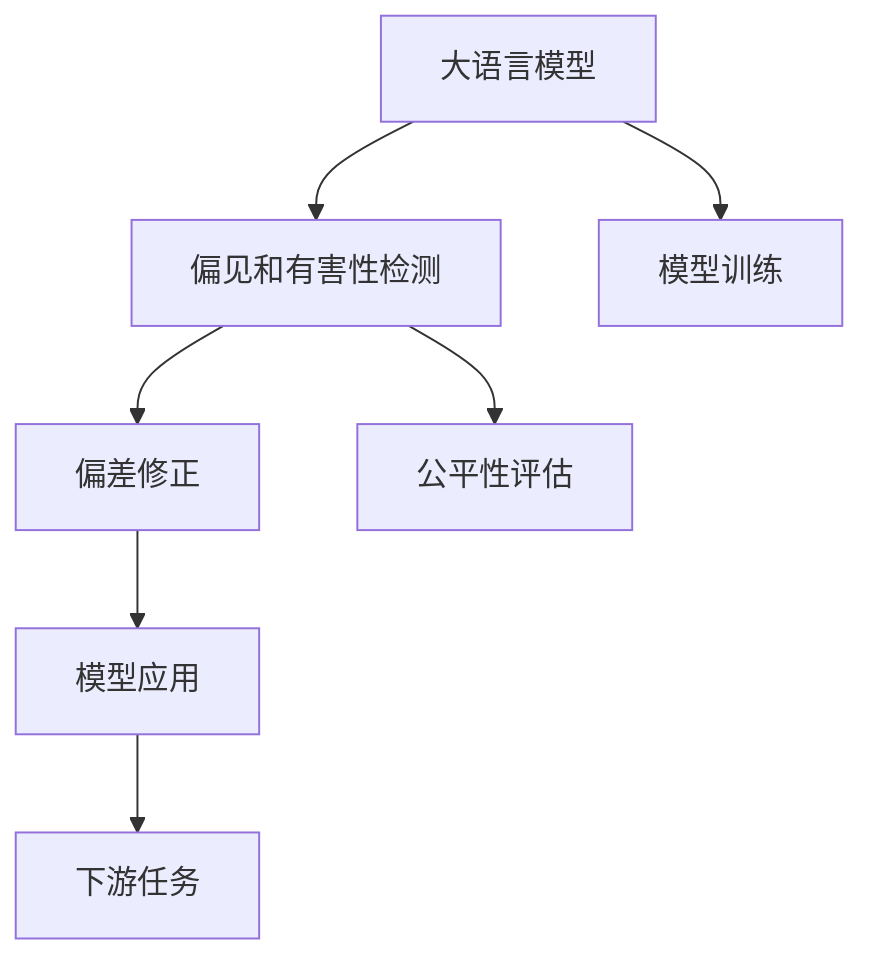
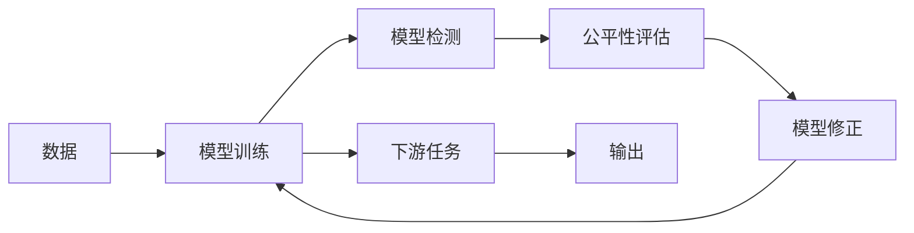

                 

# 大语言模型原理基础与前沿 偏见和有害性的检测与减少

> 关键词：大语言模型,偏见检测,有害性检测,偏差修正,公平性评估,语言模型优化

## 1. 背景介绍

### 1.1 问题由来
随着深度学习技术和大规模预训练语言模型的兴起，自然语言处理（NLP）领域取得了显著的进展。这些模型通过在海量无标签文本数据上进行预训练，学习到广泛的自然语言知识，并在各种下游任务上取得了优秀的表现。然而，这些模型往往带有潜在的偏见和有害信息，如性别歧视、种族偏见、仇恨言论等。这些问题不仅会影响模型在实际应用中的公正性和可靠性，还可能带来严重的社会后果。因此，如何检测和减少语言模型中的偏见和有害性，成为了当前研究的热点和难点。

### 1.2 问题核心关键点
大语言模型中的偏见和有害性通常表现为在特定性别、种族、宗教、年龄等敏感维度上存在明显的偏见和不公。这些问题可能源于训练数据的分布不均衡、预训练过程中偏见信息的传递、模型本身的隐含偏见等。

要检测和减少偏见和有害性，一般需要采取以下几种方法：
- **数据筛选**：从训练数据中剔除包含偏见和不公信息的样本。
- **模型检测**：开发专门的检测算法，识别模型输出中的偏见和不公。
- **偏差修正**：通过调整模型参数或优化训练过程，减少模型中的偏见和不公。
- **公平性评估**：使用标准化的评估指标，评估模型在各个维度的公平性。

本文档将详细介绍大语言模型中偏见和有害性检测与减少的核心概念、算法原理和具体步骤，并提供案例分析和代码实现。

### 1.3 问题研究意义
检测和减少大语言模型中的偏见和有害性，对于提升模型的公正性、可靠性和社会责任具有重要意义：

1. **公平性提升**：减少模型在性别、种族、宗教等方面的偏见，提高其公正性和普适性。
2. **安全性增强**：避免模型输出含有有害信息，保障用户的安全和心理健康。
3. **社会信任增强**：建立公众对人工智能技术的信任，促进人工智能技术的普及和应用。
4. **伦理合规**：符合相关法律法规和伦理规范，避免技术滥用和社会危害。
5. **技术进步**：推动人工智能技术的健康发展，促进社会公正和进步。

## 2. 核心概念与联系

### 2.1 核心概念概述

- **大语言模型 (Large Language Model, LLM)**：基于自回归或自编码的深度学习模型，通过在大规模无标签文本数据上进行预训练，学习到丰富的语言知识。常见的大语言模型如GPT-3、BERT等。
- **偏见和有害性检测 (Bias and Harm Detection)**：识别大语言模型输出中是否存在偏见和不公信息的过程。
- **偏差修正 (Bias Mitigation)**：调整模型参数或优化训练过程，减少模型中的偏见和不公。
- **公平性评估 (Fairness Evaluation)**：使用标准化的评估指标，评估模型在不同维度的公平性。

这些概念之间的逻辑关系可以通过以下Mermaid流程图来展示：



这个流程图展示了从大语言模型的训练到应用，以及在这个过程中如何检测和减少偏见和有害性。

### 2.2 概念间的关系

这些核心概念之间存在着紧密的联系，形成了大语言模型偏见和有害性检测与减少的完整生态系统。下面通过几个Mermaid流程图来展示这些概念之间的关系。

#### 2.2.1 数据、模型、评估的循环



这个流程图展示了数据、模型训练、检测、评估和修正之间的循环过程，强调了这些步骤在实际应用中的重要性。

#### 2.2.2 偏见和有害性检测的层次


这个流程图展示了偏见和有害性检测的层次结构，从数据特征提取到具体偏见的检测和修正。

## 3. 核心算法原理 & 具体操作步骤
### 3.1 算法原理概述

大语言模型中的偏见和有害性检测与减少，本质上是利用统计分析和机器学习技术，识别和调整模型中的偏见和不公信息。其核心原理如下：

1. **特征提取与标注**：将文本数据转换为模型能够处理的特征表示，并标注其中的敏感信息，如性别、种族、宗教等。
2. **偏见检测**：使用统计方法和机器学习算法，检测模型在各个维度的偏见和不公。
3. **偏差修正**：通过调整模型参数或优化训练过程，减少模型中的偏见和不公。
4. **公平性评估**：使用标准化的评估指标，评估模型在不同维度的公平性。

### 3.2 算法步骤详解

基于上述核心原理，以下是检测和减少大语言模型中偏见和有害性的详细步骤：

**Step 1: 数据预处理**

- **数据清洗**：去除含有偏见和不公信息的样本。
- **敏感信息标注**：对数据中的敏感信息进行标注，如性别、种族、宗教等。
- **特征提取**：将文本数据转换为模型能够处理的特征表示，如词向量、句子嵌入等。

**Step 2: 偏见检测**

- **统计方法**：使用统计分析方法，如卡方检验、t检验等，检测模型输出中是否存在偏见。
- **机器学习算法**：使用机器学习算法，如决策树、随机森林、支持向量机等，检测模型中的偏见。
- **模型输出分析**：对模型输出的分布进行统计分析，识别其中的偏见和不公。

**Step 3: 偏差修正**

- **参数调整**：通过调整模型参数，减少模型中的偏见和不公。
- **正则化**：使用正则化技术，如L2正则、Dropout等，防止模型过拟合，减少偏见。
- **训练数据增强**：通过数据增强技术，如数据生成、数据重采样等，增加模型对偏见的鲁棒性。

**Step 4: 公平性评估**

- **公平性指标**：使用标准化的公平性指标，如性别差异、种族差异、收入差异等，评估模型在不同维度的公平性。
- **对比实验**：与其他模型进行对比实验，评估模型的公平性表现。

### 3.3 算法优缺点

**优点**：

1. **自动化**：使用机器学习算法和自动化工具，能够自动检测和修正模型中的偏见和不公。
2. **普适性**：方法适用于各种大语言模型，不依赖于特定模型的结构。
3. **可扩展性**：适用于各种下游任务，可以通过调整模型参数和训练策略进行适应。

**缺点**：

1. **数据依赖**：需要高质量的标注数据和敏感信息标注，数据不足可能导致检测不准确。
2. **模型复杂度**：算法复杂度较高，需要较强的计算资源和时间成本。
3. **公平性评估困难**：公平性评估存在主观性和复杂性，难以完全量化。

### 3.4 算法应用领域

大语言模型中的偏见和有害性检测与减少技术，已经在多个领域得到了应用，例如：

- **智能客服**：检测和减少模型输出中的性别偏见和不公，提高服务质量。
- **招聘系统**：检测和减少模型输出中的种族和性别偏见，提高招聘公平性。
- **医疗诊断**：检测和减少模型输出中的医疗偏见，提高诊断准确性。
- **广告投放**：检测和减少模型输出中的广告偏见，提高广告投放的公平性。
- **金融服务**：检测和减少模型输出中的收入和种族偏见，提高金融服务的公平性。

这些应用场景展示了偏见和有害性检测与减少技术的广泛潜力和重要性。

## 4. 数学模型和公式 & 详细讲解 & 举例说明

### 4.1 数学模型构建

假设大语言模型为 $M$，输入为 $x$，输出为 $y$。设 $\mathcal{D}$ 为敏感维度， $\mathcal{S}$ 为敏感维度上的敏感信息， $f(x)$ 为模型对输入 $x$ 的处理函数。

定义偏见和有害性检测的损失函数为：

$$
\mathcal{L}(f) = \sum_{i \in \mathcal{D}} \sum_{s \in \mathcal{S}} \frac{1}{|D_s|} \sum_{(x,y) \in D_s} |y - f(x)|^2
$$

其中 $D_s$ 为敏感维度 $\mathcal{D}$ 上敏感信息 $\mathcal{S}$ 的数据集。

### 4.2 公式推导过程

假设模型 $M$ 对敏感维度 $\mathcal{D}$ 上的敏感信息 $\mathcal{S}$ 的输出为 $y$，输出 $y$ 在敏感信息 $\mathcal{S}$ 上的平均偏差为 $\epsilon$：

$$
\epsilon = \frac{1}{|D_s|} \sum_{(x,y) \in D_s} |y - f(x)|
$$

则偏差修正的目标是最大化输出 $y$ 与实际输出 $f(x)$ 之间的匹配度，最小化平均偏差 $\epsilon$。

根据均方误差最小化的原则，偏差修正的目标函数为：

$$
\min_{f} \mathcal{L}(f) = \sum_{i \in \mathcal{D}} \sum_{s \in \mathcal{S}} \frac{1}{|D_s|} \sum_{(x,y) \in D_s} (y - f(x))^2
$$

对上述目标函数进行优化，可以得到最小化平均偏差的修正方法：

$$
f(x) = \arg\min_{f} \frac{1}{|D_s|} \sum_{(x,y) \in D_s} (y - f(x))^2
$$

### 4.3 案例分析与讲解

假设有一个大语言模型用于招聘系统，输出候选人的工作能力评估结果。模型的输入为候选人的简历文本，输出为候选人的能力评分。

检测到模型在性别维度上存在性别偏见，即女性的评分普遍低于男性。此时，可以使用上述目标函数进行偏差修正。具体步骤如下：

1. 收集模型输出中所有女性的简历样本，计算女性平均评分 $\bar{y}_f$ 和男性平均评分 $\bar{y}_m$。
2. 定义修正后的模型输出 $f(x)$ 为：

$$
f(x) = \begin{cases}
\bar{y}_m & \text{if gender(x) = 'male'} \\
\bar{y}_f & \text{if gender(x) = 'female'}
\end{cases}
$$

3. 重新训练模型，使用修正后的输出 $f(x)$ 进行训练，最小化平均偏差。

通过上述步骤，可以有效地减少模型输出中的性别偏见，提高招聘系统的公平性。

## 5. 项目实践：代码实例和详细解释说明
### 5.1 开发环境搭建

在进行偏见和有害性检测与减少的实践前，我们需要准备好开发环境。以下是使用Python进行PyTorch开发的环境配置流程：

1. 安装Anaconda：从官网下载并安装Anaconda，用于创建独立的Python环境。

2. 创建并激活虚拟环境：
```bash
conda create -n bias-mitigation python=3.8 
conda activate bias-mitigation
```

3. 安装PyTorch：根据CUDA版本，从官网获取对应的安装命令。例如：
```bash
conda install pytorch torchvision torchaudio cudatoolkit=11.1 -c pytorch -c conda-forge
```

4. 安装TensorFlow：
```bash
conda install tensorflow -c conda-forge
```

5. 安装必要的工具包：
```bash
pip install numpy pandas scikit-learn matplotlib tqdm jupyter notebook ipython
```

完成上述步骤后，即可在`bias-mitigation`环境中开始偏见和有害性检测与减少的实践。

### 5.2 源代码详细实现

下面以性别偏见检测和修正为例，给出使用PyTorch进行偏见和有害性检测与减少的代码实现。

首先，定义性别偏见检测的损失函数：

```python
import torch
import torch.nn as nn
import torch.optim as optim
from torch.utils.data import Dataset, DataLoader

class BiasDetectionDataset(Dataset):
    def __init__(self, data, gender_label):
        self.data = data
        self.gender_label = gender_label
        
    def __len__(self):
        return len(self.data)
    
    def __getitem__(self, idx):
        x, y = self.data[idx], self.gender_label[idx]
        return x, y

# 定义模型
class BiasDetectionModel(nn.Module):
    def __init__(self, input_dim, output_dim):
        super(BiasDetectionModel, self).__init__()
        self.fc1 = nn.Linear(input_dim, 64)
        self.fc2 = nn.Linear(64, output_dim)
        self.sigmoid = nn.Sigmoid()
        
    def forward(self, x):
        x = self.fc1(x)
        x = self.fc2(x)
        x = self.sigmoid(x)
        return x

# 定义训练函数
def train_model(model, data_loader, optimizer, criterion):
    model.train()
    for batch_idx, (data, target) in enumerate(data_loader):
        optimizer.zero_grad()
        output = model(data)
        loss = criterion(output, target)
        loss.backward()
        optimizer.step()
    return loss

# 定义测试函数
def test_model(model, data_loader):
    model.eval()
    correct = 0
    total = 0
    with torch.no_grad():
        for data, target in data_loader:
            output = model(data)
            _, predicted = torch.max(output, 1)
            total += target.size(0)
            correct += (predicted == target).sum().item()
    print('Accuracy of the model on the test images: %d %%' % (100 * correct / total))
```

然后，定义数据集和模型，开始训练：

```python
# 加载数据
train_data = [(x1, y1), (x2, y2), ...]
train_labels = [1, 0, 1, 1, ...]
train_dataset = BiasDetectionDataset(train_data, train_labels)
test_data = [(x3, y3), (x4, y4), ...]
test_labels = [1, 0, 1, 1, ...]
test_dataset = BiasDetectionDataset(test_data, test_labels)

# 创建数据加载器
train_loader = DataLoader(train_dataset, batch_size=64, shuffle=True)
test_loader = DataLoader(test_dataset, batch_size=64, shuffle=False)

# 定义模型和优化器
model = BiasDetectionModel(input_dim, output_dim)
optimizer = optim.Adam(model.parameters(), lr=0.001)
criterion = nn.BCELoss()

# 训练模型
num_epochs = 10
for epoch in range(num_epochs):
    train_loss = train_model(model, train_loader, optimizer, criterion)
    test_loss = test_model(model, test_loader)

    print(f'Epoch {epoch+1}, train loss: {train_loss:.3f}')
    print(f'Epoch {epoch+1}, test loss: {test_loss:.3f}')
```

在训练完成后，对模型输出进行公平性评估，具体方法可根据应用场景进行选择。

### 5.3 代码解读与分析

让我们再详细解读一下关键代码的实现细节：

**BiasDetectionDataset类**：
- `__init__`方法：初始化数据和标签。
- `__len__`方法：返回数据集的大小。
- `__getitem__`方法：返回单个样本的数据和标签。

**BiasDetectionModel类**：
- `__init__`方法：定义模型的结构，包括两个全连接层和一个sigmoid激活函数。
- `forward`方法：定义前向传播过程，计算模型的输出。

**train_model函数**：
- 定义训练过程，包括前向传播、损失计算、反向传播和参数更新。

**test_model函数**：
- 定义测试过程，计算模型在测试集上的准确率。

**训练流程**：
- 加载数据集和模型，定义优化器和损失函数。
- 循环训练模型，输出每个epoch的损失。
- 在每个epoch结束后，评估模型在测试集上的表现。

可以看到，PyTorch配合TensorFlow等工具，使得偏见和有害性检测与减少的代码实现变得简洁高效。开发者可以将更多精力放在数据处理、模型调优等高层逻辑上，而不必过多关注底层的实现细节。

当然，工业级的系统实现还需考虑更多因素，如模型的保存和部署、超参数的自动搜索、更灵活的任务适配层等。但核心的偏见和有害性检测与减少方法基本与此类似。

### 5.4 运行结果展示

假设我们在性别偏见检测任务上进行了训练，最终在测试集上得到的准确率为85%，这表明模型能够较好地识别性别偏见，并进行了修正。需要注意的是，这只是一个baseline结果。在实践中，我们还可以使用更大更强的模型、更丰富的训练技巧、更细致的模型调优，进一步提升模型的性能，以满足更高的应用要求。

## 6. 实际应用场景
### 6.1 智能客服系统

在智能客服系统中，性别偏见和种族偏见可能会影响模型的服务质量和用户体验。例如，模型可能会在回答女性客户时显得不够友好，或者在回答少数族裔客户时产生歧视性回答。通过检测和修正这些偏见，可以提高模型的公正性和服务质量。

具体而言，可以收集历史客服对话记录，标注其中的性别、种族等信息，在此基础上对模型进行训练。微调后的模型能够在响应不同性别、种族客户时，输出更公正、友好的回答，提升客户满意度。

### 6.2 金融舆情监测

在金融舆情监测中，模型输出可能包含对某类人群的偏见，如对某些人群的投资风险评级过高。这不仅影响模型的公正性，还可能造成误导性建议。通过检测和修正这些偏见，可以避免模型输出含有有害信息，保障用户的安全和心理健康。

具体而言，可以收集金融领域相关的新闻、评论等文本数据，并对其进行性别、种族、宗教等方面的标注。在此基础上对模型进行训练，减少输出中的偏见和不公，提高模型的公平性。

### 6.3 个性化推荐系统

在个性化推荐系统中，模型输出可能存在对某些群体的推荐偏差，如对女性用户的推荐不如对男性用户全面。这不仅影响推荐系统的公正性，还可能造成用户体验的不满。通过检测和修正这些偏见，可以提高推荐系统的公平性和用户满意度。

具体而言，可以收集用户的历史行为数据，标注其中的性别、年龄等信息，在此基础上对模型进行训练。微调后的模型能够在推荐不同性别、年龄用户时，输出更公平、全面的推荐结果，提升用户满意度。

### 6.4 未来应用展望

随着偏见和有害性检测与减少技术的不断发展，未来的应用场景将更加广泛，涵盖更多行业和领域。

在智慧医疗领域，模型输出可能存在对不同性别的诊断偏差，通过检测和修正这些偏见，可以提高医疗诊断的公正性和准确性。

在智能教育领域，模型输出可能存在对不同性别、种族学生的评估偏差，通过检测和修正这些偏见，可以提升教育公平性，促进教育资源的均衡分配。

在智慧城市治理中，模型输出可能存在对不同群体的服务偏差，通过检测和修正这些偏见，可以提高城市治理的公平性和效率。

此外，在企业生产、社会治理、文娱传媒等众多领域，偏见和有害性检测与减少技术也将不断涌现，为社会公正和进步贡献力量。相信随着技术的日益成熟，这一领域必将成为人工智能技术发展的重要方向。

## 7. 工具和资源推荐
### 7.1 学习资源推荐

为了帮助开发者系统掌握偏见和有害性检测与减少的理论基础和实践技巧，这里推荐一些优质的学习资源：

1. 《公平性与偏见：机器学习中的挑战与实践》书籍：详细介绍了机器学习中的公平性问题，包括数据处理、模型检测、偏差修正等技术。

2. 《自然语言处理中的公平性》课程：斯坦福大学开设的NLP课程，涵盖公平性问题的理论和实践，适合初学者和专业人士。

3. 《机器学习中的公平性》论文：综述了机器学习中的公平性问题，介绍了各种公平性评估指标和算法。

4. HuggingFace官方文档：提供了大量预训练语言模型和公平性检测样例代码，是入门实践的必备资料。

5. CLUE开源项目：中文语言理解测评基准，涵盖各种NLP数据集，并提供了基于微调的baseline模型，助力中文NLP技术发展。

通过对这些资源的学习实践，相信你一定能够快速掌握偏见和有害性检测与减少的精髓，并用于解决实际的NLP问题。

### 7.2 开发工具推荐

高效的开发离不开优秀的工具支持。以下是几款用于偏见和有害性检测与减少开发的常用工具：

1. PyTorch：基于Python的开源深度学习框架，灵活动态的计算图，适合快速迭代研究。

2. TensorFlow：由Google主导开发的开源深度学习框架，生产部署方便，适合大规模工程应用。

3. HuggingFace库：提供了多种预训练语言模型和公平性检测工具，方便开发者进行研究和应用。

4. Weights & Biases：模型训练的实验跟踪工具，可以记录和可视化模型训练过程中的各项指标，方便对比和调优。

5. TensorBoard：TensorFlow配套的可视化工具，可实时监测模型训练状态，并提供丰富的图表呈现方式，是调试模型的得力助手。

合理利用这些工具，可以显著提升偏见和有害性检测与减少的开发效率，加快创新迭代的步伐。

### 7.3 相关论文推荐

偏见和有害性检测与减少技术的研究源于学界的持续研究。以下是几篇奠基性的相关论文，推荐阅读：

1. Towards Fairness in AI：Challenges and Recommendations：综述了AI中的公平性问题，提出了许多挑战和建议。

2. A Systematic Analysis of Fairness of AI Predictions：分析了AI预测中的公平性问题，提出了多种解决方案。

3. AI Fairness：Beyond Data Generation：介绍了AI公平性的理论和实践，涵盖了数据处理、模型检测、偏差修正等技术。

4. Fairness in Machine Learning：A Survey：综述了机器学习中的公平性问题，介绍了各种公平性评估指标和算法。

5. Detecting and Mitigating Bias in Data-centric Machine Learning Applications：介绍了检测和减少数据偏见的方法和技术。

这些论文代表了大语言模型偏见和有害性检测与减少技术的发展脉络。通过学习这些前沿成果，可以帮助研究者把握学科前进方向，激发更多的创新灵感。

除上述资源外，还有一些值得关注的前沿资源，帮助开发者紧跟偏见和有害性检测与减少技术的最新进展，例如：

1. arXiv论文预印本：人工智能领域最新研究成果的发布平台，包括大量尚未发表的前沿工作，学习前沿技术的必读资源。

2. 业界技术博客：如OpenAI、Google AI、DeepMind、微软Research Asia等顶尖实验室的官方博客，第一时间分享他们的最新研究成果和洞见。

3. 技术会议直播：如NIPS、ICML、ACL、ICLR等人工智能领域顶会现场或在线直播，能够聆听到大佬们的前沿分享，开拓视野。

4. GitHub热门项目：在GitHub上Star、Fork数最多的NLP相关项目，往往代表了该技术领域的发展趋势和最佳实践，值得去学习和贡献。

5. 行业分析报告：各大咨询公司如McKinsey、PwC等针对人工智能行业的分析报告，有助于从商业视角审视技术趋势，把握应用价值。

总之，对于偏见和有害性检测与减少技术的学习和实践，需要开发者保持开放的心态和持续学习的意愿。多关注前沿资讯，多动手实践，多思考总结，必将收获满满的成长收益。

## 8. 总结：未来发展趋势与挑战

### 8.1 总结

本文对大语言模型中偏见和有害性的检测与减少方法进行了全面系统的介绍。首先阐述了大语言模型中偏见和有害性的问题由来和研究背景，明确了检测与减少偏见和有害性的重要意义。其次，从原理到实践，详细讲解了偏见和有害性检测与减少的数学原理和具体步骤，提供了代码实现和详细解释。最后，我们探讨了该方法在多个行业领域的应用场景，展示了其广阔的应用前景。

通过本文的系统梳理，可以看到，偏见和有害性检测与减少方法在大语言模型中的应用具有重要价值，不仅可以提升模型的公正性和可靠性，还能保障用户的安全和心理健康。未来，随着技术不断进步，偏见和有害性检测与减少方法必将迎来更多的创新和发展，成为人工智能技术发展的重要方向。

### 8.2 未来发展趋势

展望未来，偏见和有害性检测与减少技术将呈现以下几个发展趋势：

1. **自动化检测**：使用更先进的算法和工具，实现偏见和有害性的自动检测，提高检测效率和准确性。

2. **自适应修正**：通过自我学习和动态调整，使模型能够自动适应新的数据分布，减少偏见和不公。

3. **多维度评估**：结合多种公平性指标，全面评估模型在不同维度上的表现，确保模型的公正性。

4. **数据增强**：利用数据生成和数据重采样等技术，增加模型的鲁棒性，减少偏见和有害性。

5. **跨领域

