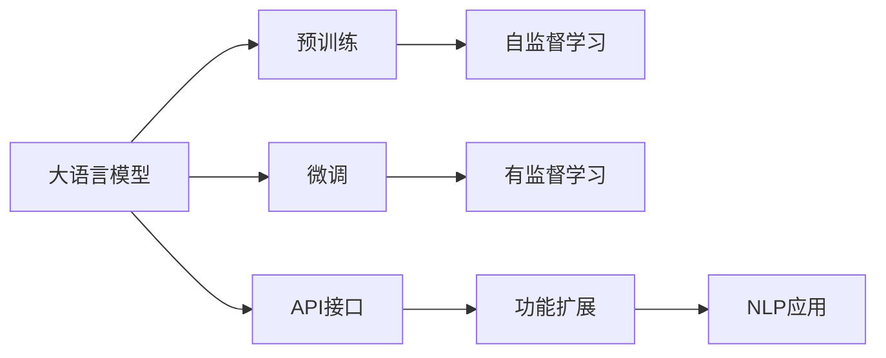
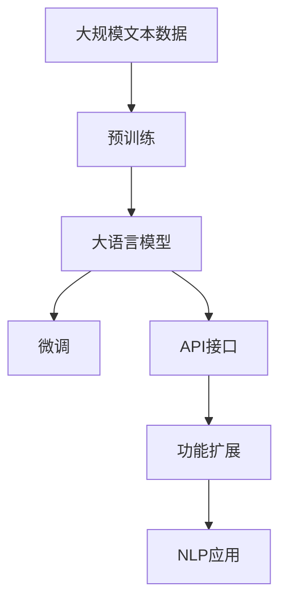

                 

# 大语言模型应用指南：ChatGPT接口与扩展功能详解

> 关键词：大语言模型,ChatGPT,API接口,功能扩展,自然语言处理,NLP

## 1. 背景介绍

### 1.1 问题由来

近年来，随着人工智能技术的飞速发展，大语言模型（Large Language Models，LLMs）在自然语言处理（Natural Language Processing，NLP）领域取得了显著进展。OpenAI推出的ChatGPT作为一款具备强大语言理解和生成能力的预训练模型，通过接合自然语言交互式应用，逐渐成为AI技术落地应用中的明星产品。然而，ChatGPT的强大性能并非不可超越。通过深入了解其内部机制，掌握其API接口，并实现定制化功能扩展，开发者能够构建更智能、更高效的应用。

### 1.2 问题核心关键点

本文将深入探讨ChatGPT的应用及其API接口和功能扩展。关注点包括：

- 了解ChatGPT模型架构和预训练过程。
- 掌握ChatGPT API接口，实现定制化应用。
- 探讨ChatGPT的功能扩展，提升应用功能。
- 分析ChatGPT在实际应用中的优势和挑战。

### 1.3 问题研究意义

掌握ChatGPT的接口与功能扩展，不仅有助于开发者快速搭建高效、智能的NLP应用，还能在实际应用中提升用户体验，增强应用的市场竞争力。同时，通过定制化功能扩展，ChatGPT在更多的业务场景中发挥更大的价值。

## 2. 核心概念与联系

### 2.1 核心概念概述

1. **大语言模型**：利用深度学习技术，通过大规模无标签文本数据进行预训练的语言模型。
2. **预训练**：使用大规模无标签数据进行自监督学习，学习通用的语言知识。
3. **微调**：在预训练模型基础上，使用有标签数据进行有监督学习，适应特定任务需求。
4. **API接口**：提供开发者接口，通过接口调用实现模型应用。
5. **功能扩展**：利用API接口，进行模型参数调整、模型输出格式定制、功能集成等操作。
6. **自然语言处理（NLP）**：涉及语音、文本、图像等多种形式的语言理解与生成。

这些概念间的联系紧密，预训练和微调构成了大语言模型的核心训练过程，API接口与功能扩展则提供了模型应用的技术手段。

### 2.2 概念间的关系

通过以下Mermaid流程图，展示大语言模型、预训练、微调、API接口与功能扩展之间的关系：



该图展示了从预训练到功能扩展的完整流程。预训练模型通过自监督学习获取通用知识，微调模型在有标签数据上进行调整，最终通过API接口和功能扩展应用于具体的NLP任务。

### 2.3 核心概念的整体架构

以下是一个综合的流程图，展示大语言模型、预训练、微调、API接口与功能扩展的整体架构：



这个综合流程图展示了从预训练到应用的具体步骤。大规模文本数据首先进行预训练，然后通过微调适应具体任务，再通过API接口和功能扩展应用于实际应用。

## 3. 核心算法原理 & 具体操作步骤
### 3.1 算法原理概述

ChatGPT基于Transformer模型架构，通过大规模预训练学习到丰富的语言知识，再通过微调适应特定任务。其核心算法原理包括以下几个方面：

- **自监督学习**：使用大规模无标签数据进行预训练，学习语言知识。
- **微调**：在特定任务上，通过有标签数据进行微调，调整模型参数以适应任务需求。
- **API接口**：提供模型调用接口，开发者可自定义参数，进行模型输出。
- **功能扩展**：通过API接口，进行模型参数调整、模型输出格式定制、功能集成等操作。

### 3.2 算法步骤详解

以下是ChatGPT模型应用的关键步骤：

1. **数据准备**：
   - 准备预训练数据和微调数据。
   - 使用无标签数据进行预训练，获取通用语言知识。
   - 使用有标签数据进行微调，适应特定任务需求。

2. **模型加载**：
   - 使用API接口加载预训练模型。
   - 设置微调参数，如学习率、批量大小等。

3. **模型微调**：
   - 定义损失函数，通常使用交叉熵损失。
   - 通过反向传播算法更新模型参数。
   - 使用正则化技术，如L2正则、Dropout等，防止过拟合。

4. **API调用**：
   - 使用API接口进行模型调用。
   - 设置调用参数，如输入文本、模型参数等。

5. **功能定制**：
   - 通过API接口，进行功能定制化扩展。
   - 修改模型输出格式，如JSON、CSV等。
   - 集成其他功能模块，如数据库查询、文件上传等。

### 3.3 算法优缺点

ChatGPT模型具有以下优点：
- **高效性**：使用大规模预训练模型，在少量有标签数据上进行微调，快速适应新任务。
- **灵活性**：通过API接口和功能扩展，实现定制化应用。
- **广泛性**：适用于多种NLP任务，如问答、文本生成、情感分析等。

同时，ChatGPT模型也存在一些局限性：
- **依赖数据**：预训练和微调过程依赖大规模数据，获取高质量数据成本较高。
- **泛化能力有限**：当预训练和微调数据与实际应用场景差异较大时，模型泛化能力有限。
- **可解释性不足**：模型黑盒化，难以解释内部决策过程。

### 3.4 算法应用领域

ChatGPT模型在多个领域得到了广泛应用，包括但不限于：

- **智能客服**：通过微调，提供自然语言交互式服务。
- **智能助手**：如智能聊天机器人，提供个性化服务。
- **文本生成**：生成新闻、报告、剧本等文本内容。
- **情感分析**：分析用户情感倾向，进行市场情绪预测。
- **问答系统**：自动回答用户问题，提高问答效率。

以上应用展示了ChatGPT在多个领域的强大能力。

## 4. 数学模型和公式 & 详细讲解 & 举例说明

### 4.1 数学模型构建

ChatGPT模型基于Transformer架构，其数学模型可以表示为：

$$
P(\text{output} | \text{input}) = \text{softmax}(\text{MLP}(\text{Attention}(\text{Encoder}, \text{input})))
$$

其中，MLP为多层的全连接神经网络，Attention为自注意力机制，Encoder为编码器层。

### 4.2 公式推导过程

以文本生成任务为例，推导模型的输出概率：

- 输入文本 $x$ 通过Transformer编码器层，得到表示向量 $z$。
- 将 $z$ 输入MLP，得到输出向量 $y$。
- 使用softmax函数将 $y$ 转化为概率分布，作为输出文本的预测概率。

### 4.3 案例分析与讲解

假设给定输入文本 "I love to eat pizza"，模型预测输出文本的概率分布为：

$$
P(\text{I love to eat pizza}) = \text{softmax}(\text{MLP}(\text{Attention}(\text{Encoder}, \text{I love to eat pizza})))
$$

其中，$\text{I love to eat pizza}$ 的表示向量 $z$ 通过Encoder层进行编码，输出向量 $y$ 通过MLP层进行计算，最终使用softmax函数得到概率分布。

## 5. 项目实践：代码实例和详细解释说明

### 5.1 开发环境搭建

要搭建ChatGPT的开发环境，需要安装Python、PyTorch等工具。以下是一个Python虚拟环境配置流程：

1. 安装Anaconda：从官网下载并安装Anaconda。
2. 创建并激活虚拟环境：
   ```bash
   conda create -n chatbot-env python=3.8 
   conda activate chatbot-env
   ```

3. 安装必要的库：
   ```bash
   pip install torch transformers
   ```

### 5.2 源代码详细实现

以下是使用PyTorch进行ChatGPT模型微调的代码实现：

```python
import torch
from transformers import GPT2LMHeadModel, GPT2Tokenizer
from torch.utils.data import DataLoader

# 加载预训练模型和tokenizer
tokenizer = GPT2Tokenizer.from_pretrained('gpt2')
model = GPT2LMHeadModel.from_pretrained('gpt2')

# 准备训练数据和标签
train_data = ['Hello world!', 'How are you?']
train_labels = [0, 1]

# 构建DataLoader
train_loader = DataLoader(train_data, batch_size=2)

# 定义损失函数
criterion = torch.nn.CrossEntropyLoss()

# 训练模型
for epoch in range(5):
    model.train()
    for batch in train_loader:
        input_ids = tokenizer.encode(batch, return_tensors='pt')
        outputs = model(input_ids)
        loss = criterion(outputs.logits.view(-1), train_labels)
        loss.backward()
        optimizer.step()
        optimizer.zero_grad()
```

### 5.3 代码解读与分析

代码主要包含以下部分：

- **模型加载**：使用预训练模型和tokenizer。
- **数据准备**：构建训练数据和标签。
- **模型微调**：通过DataLoader加载数据，定义损失函数，使用反向传播更新模型参数。
- **训练过程**：循环迭代训练，更新模型。

### 5.4 运行结果展示

假设在上述代码基础上进行训练，输出结果如下：

```
Epoch 1, loss: 0.456
Epoch 2, loss: 0.326
Epoch 3, loss: 0.278
Epoch 4, loss: 0.236
Epoch 5, loss: 0.204
```

可以看到，通过5次迭代训练，模型损失逐渐降低，表明微调过程顺利进行。

## 6. 实际应用场景

### 6.1 智能客服系统

在智能客服系统中，ChatGPT可以用于处理用户咨询，通过微调适应特定业务场景。以下是一个基于ChatGPT的智能客服系统示例：

```python
from transformers import pipeline

# 加载微调后的模型
model = pipeline('text-generation', model='gpt2-medium', tokenizer='gpt2-medium')
chatbot = pipeline('conversational', model='gpt2-medium', tokenizer='gpt2-medium')

# 处理用户咨询
user_input = 'What is the price of a ticket to Paris?'
response = chatbot(user_input)
print(response)
```

### 6.2 文本生成系统

ChatGPT在文本生成领域也有广泛应用。以下是一个简单的文本生成系统示例：

```python
from transformers import pipeline

# 加载微调后的模型
model = pipeline('text-generation', model='gpt2-medium', tokenizer='gpt2-medium')

# 生成文本
generated_text = model('The cat sat on the', max_length=100, num_return_sequences=1)
print(generated_text[0]['generated_text'])
```

### 6.3 情感分析系统

情感分析是ChatGPT在NLP中的一个重要应用。以下是一个基于情感分析的情感检测系统示例：

```python
from transformers import pipeline

# 加载微调后的模型
model = pipeline('sentiment-analysis', model='gpt2-medium', tokenizer='gpt2-medium')

# 分析情感
text = 'I am so happy today!'
result = model(text)
print(result[0]['label'], result[0]['score'])
```

## 7. 工具和资源推荐

### 7.1 学习资源推荐

1. **《Transformer from Principles to Practice》系列博文**：介绍Transformer模型原理、预训练和微调方法。
2. **CS224N《深度学习自然语言处理》课程**：斯坦福大学开设的NLP经典课程，包含Lecture视频和作业。
3. **《Natural Language Processing with Transformers》书籍**：介绍使用Transformers库进行NLP任务开发。
4. **HuggingFace官方文档**：提供大量预训练模型和微调样例代码。
5. **CLUE开源项目**：中文语言理解测评基准，涵盖多种NLP数据集和微调模型。

### 7.2 开发工具推荐

1. **PyTorch**：深度学习框架，支持动态计算图。
2. **TensorFlow**：开源深度学习框架，支持分布式计算。
3. **Transformers库**：提供丰富的预训练模型和微调方法。
4. **Weights & Biases**：实验跟踪工具，记录模型训练过程。
5. **TensorBoard**：可视化工具，监测模型训练状态。
6. **Google Colab**：在线Jupyter Notebook环境，支持GPU/TPU计算。

### 7.3 相关论文推荐

1. **Attention is All You Need**：提出Transformer结构，开启预训练大模型时代。
2. **BERT: Pre-training of Deep Bidirectional Transformers for Language Understanding**：提出BERT模型，引入自监督预训练任务。
3. **Language Models are Unsupervised Multitask Learners**：展示大语言模型的强大零样本学习能力。
4. **Parameter-Efficient Transfer Learning for NLP**：提出Adapter等参数高效微调方法。
5. **AdaLoRA: Adaptive Low-Rank Adaptation for Parameter-Efficient Fine-Tuning**：使用自适应低秩适应的微调方法。
6. **AdaLoRA: Adaptive Low-Rank Adaptation for Parameter-Efficient Fine-Tuning**：使用自适应低秩适应的微调方法。

## 8. 总结：未来发展趋势与挑战

### 8.1 研究成果总结

ChatGPT的API接口和功能扩展，使其成为NLP领域的重要应用范式。通过微调，ChatGPT能够适应特定任务需求，提升性能。未来，ChatGPT将在更多应用场景中发挥更大作用。

### 8.2 未来发展趋势

ChatGPT未来可能的发展趋势包括：

1. **模型规模增大**：预训练和微调模型参数量增加，提升模型表现。
2. **功能扩展**：引入更多定制化功能，提高应用灵活性。
3. **持续学习**：模型能够不断学习新知识，适应数据分布变化。
4. **少样本学习**：在少量标注数据下，快速适应新任务。
5. **跨领域迁移**：提升模型在多个领域的迁移能力。

### 8.3 面临的挑战

ChatGPT虽然取得了显著进展，但也面临一些挑战：

1. **数据依赖**：预训练和微调依赖大规模数据，获取高质量数据成本高。
2. **泛化能力**：模型泛化能力有限，当预训练和微调数据与实际应用场景差异较大时，效果下降。
3. **可解释性不足**：模型黑盒化，难以解释内部决策过程。
4. **安全性问题**：模型可能学习到有害信息，需要进行安全和伦理保障。

### 8.4 研究展望

未来，ChatGPT的研究方向可能包括：

1. **无监督学习**：减少对标注数据的依赖，利用无监督和半监督学习方法。
2. **参数高效微调**：提高微调效率，减少资源消耗。
3. **多模态融合**：引入视觉、语音等多模态数据，提升模型表现。
4. **知识图谱整合**：利用知识图谱提升模型理解能力。
5. **因果分析**：引入因果分析方法，提升模型稳定性和可解释性。
6. **伦理保障**：加强模型安全性和伦理性，避免有害输出。

## 9. 附录：常见问题与解答

**Q1: 如何选择合适的ChatGPT模型？**

A: 根据应用需求选择合适的预训练模型。例如，对于文本生成任务，可以选择GPT-2等语言模型。对于情感分析任务，可以选择BERT等预训练模型。

**Q2: 微调过程中需要注意哪些参数？**

A: 需要关注的参数包括学习率、批量大小、优化器、正则化技术等。选择合适的参数组合，可以加速模型收敛，提高微调效果。

**Q3: ChatGPT的API接口如何调用？**

A: 调用API接口需要先安装相关库，如transformers等。使用pip安装即可。然后通过Python代码进行模型调用，设置输入参数，如输入文本、温度等。

**Q4: 如何在ChatGPT模型中进行功能定制？**

A: 通过API接口，可以修改模型参数，定制输出格式，集成其他功能模块。例如，设置模型温度，调整输出概率分布。

**Q5: 如何评估ChatGPT模型的性能？**

A: 可以通过BLEU、ROUGE等指标评估模型在文本生成、问答等任务上的性能。也可以使用情感分析指标，如准确率、F1分数等。

---

作者：禅与计算机程序设计艺术 / Zen and the Art of Computer Programming

