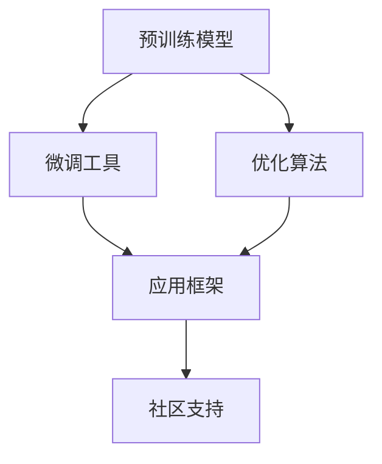
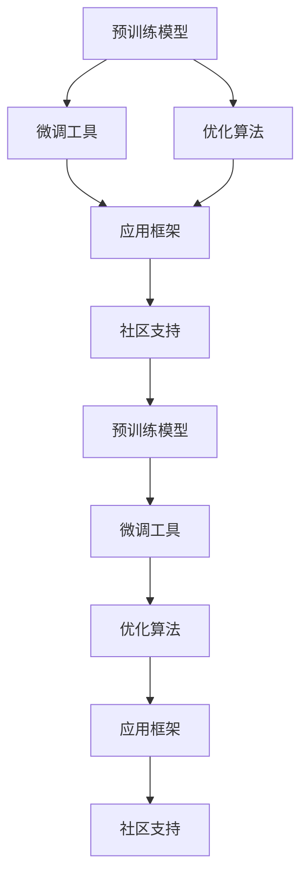

                 

# 大语言模型应用指南：GPTs与GPT商店

大语言模型（Large Language Models, LLMs）近年来在自然语言处理（NLP）领域取得了显著的进展，尤其在生成式大模型如GPT（Generative Pre-trained Transformer）家族中，它们凭借其庞大的参数规模和卓越的生成能力，迅速成为NLP技术的重要基石。本文将系统介绍GPT系列模型及其在实际应用中的广泛应用，揭示其在技术和商业上的无限潜力。

## 1. 背景介绍

### 1.1 问题由来

随着深度学习技术的发展，大语言模型在生成自然语言方面的表现日益突出。自OpenAI于2018年发布的GPT-1模型以来，GPT系列模型通过不断迭代和优化，已经在对话生成、机器翻译、文本摘要、代码生成等多个领域取得了突破性进展。这些模型通过在大规模无标签文本数据上进行预训练，学习了丰富的语言知识，具有强大的语言理解和生成能力。

然而，尽管GPT模型在自然语言生成任务上表现出色，但它们在实际应用中还存在一些挑战，如生成内容质量不稳定、模型效率较低、缺乏解释性等问题。为了解决这些问题，OpenAI在2020年发布了GPT-3，并推出了一系列的“GPT商店”（GPT Store），提供了一系列微调和优化后的模型，方便开发者快速部署和使用。这些商店不仅涵盖了不同的领域和任务，还提供了丰富的工具和资源，帮助开发者高效构建基于GPT的NLP应用。

### 1.2 问题核心关键点

GPT商店的核心价值在于其提供了一套完整的解决方案，帮助开发者克服使用GPT模型时遇到的困难，加速模型部署和优化。具体而言，GPT商店主要提供以下关键功能：

- **预训练模型：** 提供经过深度预训练的GPT模型，包含多种变体，如GPT-3基础模型、GPT-3-tiny、GPT-3-medium等，满足不同应用场景的需求。
- **微调工具：** 提供微调向导和代码示例，帮助开发者根据具体任务调整模型参数，提升模型性能。
- **优化方案：** 提供高效的优化算法和代码库，支持分布式训练和推理加速，提高模型效率。
- **应用框架：** 提供丰富的API和SDK，支持多种语言和平台，方便模型集成和部署。
- **社区支持：** 提供活跃的开发者社区和技术支持，解决模型使用中的常见问题。

这些功能和资源极大地降低了GPT模型应用的门槛，使得更多开发者能够快速上手，构建具有实际价值的NLP应用。

### 1.3 问题研究意义

研究GPT商店的应用，对于推动GPT模型在NLP领域的应用，加速技术落地和产业化进程具有重要意义：

1. **降低应用开发成本：** 通过GPT商店提供的预训练和微调工具，开发者可以大大降低开发模型的成本和时间投入，快速构建出满足实际需求的NLP应用。
2. **提升模型效果：** 通过微调工具和优化方案，模型在特定任务上能够取得更好的效果，满足更高的应用要求。
3. **加速开发进度：** GPT商店提供的API和SDK可以大幅简化模型的集成和部署过程，缩短开发周期。
4. **带来技术创新：** GPT商店中包含了最新的大语言模型和微调技术，推动了NLP技术的发展和创新。
5. **赋能产业升级：** GPT商店的应用使NLP技术更容易被各行各业采用，为传统行业数字化转型升级提供了新的技术路径。

总之，GPT商店通过提供全面且高效的工具和资源，帮助开发者克服了GPT模型使用中的难点，使得GPT技术在实际应用中能够发挥更大的价值。

## 2. 核心概念与联系

### 2.1 核心概念概述

为了更好地理解GPT商店的功能和应用，我们首先介绍几个核心概念：

- **预训练模型（Pre-trained Model）：** 指在大规模无标签文本数据上进行自监督学习训练得到的模型，具有强大的语言理解能力。
- **微调（Fine-tuning）：** 指在预训练模型的基础上，使用下游任务的少量标注数据进行有监督学习，调整模型参数，使其适应特定任务。
- **生成式大模型（Generative Model）：** 指具有生成自然语言能力的大模型，如GPT系列模型，能够生成符合语法和语义规范的文本。
- **优化算法（Optimization Algorithm）：** 指用于更新模型参数以最小化损失函数的算法，如Adam、SGD等。
- **应用框架（Application Framework）：** 指用于封装和管理模型应用的框架，如TensorFlow、PyTorch等。
- **社区支持（Community Support）：** 指GPT商店提供的开发者社区和技术支持，帮助开发者解决问题和交流经验。

这些核心概念构成了GPT商店的基础框架，帮助我们理解其在技术和应用上的功能和优势。

### 2.2 概念间的关系

GPT商店的各个核心概念之间存在着紧密的联系，形成了一个完整的生态系统。以下是通过Mermaid流程图展示的概念间关系：



这个流程图展示了预训练模型、微调工具、优化算法、应用框架和社区支持之间的关系：

1. **预训练模型** 是GPT商店的基础，通过大规模数据预训练获得语言知识。
2. **微调工具** 和 **优化算法** 用于调整预训练模型参数，使其适应下游任务。
3. **应用框架** 提供API和SDK，支持模型的集成和部署。
4. **社区支持** 提供开发者交流和解决问题的重要平台。

这些概念共同构成了GPT商店的核心功能，使得GPT模型能够快速部署和优化，服务于各种NLP应用。

### 2.3 核心概念的整体架构

最后，我们用一个综合的流程图来展示GPT商店中各核心概念之间的整体架构：



这个综合流程图展示了从预训练模型到最终应用模型的完整流程，包括预训练、微调、优化和社区支持等各个环节。通过这一架构，我们可以看到GPT商店如何帮助开发者高效构建基于GPT的NLP应用。

## 3. 核心算法原理 & 具体操作步骤
### 3.1 算法原理概述

GPT商店的核心算法原理主要围绕预训练、微调和优化三个环节展开。其核心思想是通过预训练获得强大的语言知识，通过微调调整模型参数以适应特定任务，并通过优化算法提高模型的效率和性能。

**预训练过程：**
- **目标：** 通过自监督学习任务训练模型，学习语言的通用表示。
- **方法：** 在大规模无标签文本数据上训练，如语言建模、掩码语言模型等任务。

**微调过程：**
- **目标：** 通过有监督学习调整模型参数，使其适应下游任务的特定需求。
- **方法：** 在标注数据上训练模型，最小化损失函数以逼近任务标签。

**优化过程：**
- **目标：** 通过高效的优化算法，更新模型参数，提升模型性能。
- **方法：** 使用Adam、SGD等优化算法，并结合正则化技术（如L2正则、Dropout）防止过拟合。

### 3.2 算法步骤详解

以下我们将详细介绍GPT商店中预训练、微调和优化三个环节的具体操作步骤。

**预训练步骤：**

1. **数据准备：** 收集大规模无标签文本数据，如维基百科、新闻、书籍等，并划分为训练集和验证集。
2. **模型初始化：** 选择合适的预训练模型，如GPT-3基础模型。
3. **模型训练：** 在训练集上训练模型，使用掩码语言模型、语言建模等自监督任务，最小化预测错误。
4. **验证集评估：** 在验证集上评估模型性能，调整训练参数以避免过拟合。

**微调步骤：**

1. **数据准备：** 收集下游任务的标注数据集，并划分为训练集、验证集和测试集。
2. **模型初始化：** 在预训练模型的基础上，添加任务适配层（如线性分类器、解码器）。
3. **模型训练：** 在训练集上训练模型，最小化任务损失函数，如交叉熵损失、均方误差损失等。
4. **验证集评估：** 在验证集上评估模型性能，调整超参数以优化模型。
5. **测试集测试：** 在测试集上测试模型，评估其在新数据上的表现。

**优化步骤：**

1. **模型初始化：** 在预训练模型和微调模型基础上，选择合适的优化算法和超参数。
2. **参数更新：** 使用优化算法更新模型参数，最小化损失函数。
3. **正则化：** 应用正则化技术（如L2正则、Dropout）防止过拟合。
4. **模型评估：** 在验证集上评估模型性能，避免模型过拟合。

### 3.3 算法优缺点

GPT商店中的算法具有以下优点：

- **高效：** 通过预训练获得强大的语言知识，微调过程只需少量标注数据即可达到理想效果。
- **易用：** 提供丰富的API和SDK，开发者可以轻松集成和使用GPT模型。
- **灵活：** 支持多种微调和优化方案，适应不同任务和数据集。

同时，也存在一些缺点：

- **数据依赖：** 微调和优化过程依赖于标注数据，数据不足可能导致模型性能不佳。
- **资源消耗：** 预训练和微调过程需要大量的计算资源，特别是在大规模数据集上。
- **模型复杂：** 大规模模型结构复杂，推理和优化过程较为复杂。
- **解释性不足：** 大语言模型通常被视为"黑盒"，难以解释其内部工作机制和决策逻辑。

### 3.4 算法应用领域

GPT商店中的算法已经在NLP领域的诸多任务上得到了广泛应用，例如：

- **文本分类：** 将文本分类到不同的类别中，如情感分析、主题分类等。
- **命名实体识别：** 从文本中识别出人名、地名、组织名等实体。
- **机器翻译：** 将源语言翻译成目标语言。
- **文本摘要：** 将长文本压缩成简短的摘要。
- **对话生成：** 自动生成符合语法和语义规范的对话。
- **代码生成：** 根据描述生成代码。

除了这些经典任务外，GPT商店中的算法还被创新性地应用到更多场景中，如可控文本生成、常识推理、数据增强等，为NLP技术带来了新的突破。

## 4. 数学模型和公式 & 详细讲解 & 举例说明

### 4.1 数学模型构建

本节我们将使用数学语言对GPT商店中的核心算法进行严格的数学建模。

记预训练模型为 $M_{\theta}$，其中 $\theta$ 为模型参数。假设微调任务的训练集为 $D=\{(x_i,y_i)\}_{i=1}^N$，$x_i$ 为输入文本，$y_i$ 为任务标签。微调的目标是找到新的模型参数 $\hat{\theta}$，使得：

$$
\hat{\theta}=\mathop{\arg\min}_{\theta} \mathcal{L}(M_{\theta},D)
$$

其中 $\mathcal{L}$ 为任务损失函数，衡量模型输出与真实标签之间的差异。

### 4.2 公式推导过程

以下我们将以文本分类任务为例，推导交叉熵损失函数及其梯度的计算公式。

假设模型 $M_{\theta}$ 在输入 $x$ 上的输出为 $\hat{y}=M_{\theta}(x)$，表示样本属于正类的概率。真实标签 $y \in \{0,1\}$。则二分类交叉熵损失函数定义为：

$$
\ell(M_{\theta}(x),y) = -[y\log \hat{y} + (1-y)\log (1-\hat{y})]
$$

将其代入经验风险公式，得：

$$
\mathcal{L}(\theta) = -\frac{1}{N}\sum_{i=1}^N [y_i\log M_{\theta}(x_i)+(1-y_i)\log(1-M_{\theta}(x_i))]
$$

根据链式法则，损失函数对参数 $\theta_k$ 的梯度为：

$$
\frac{\partial \mathcal{L}(\theta)}{\partial \theta_k} = -\frac{1}{N}\sum_{i=1}^N (\frac{y_i}{M_{\theta}(x_i)}-\frac{1-y_i}{1-M_{\theta}(x_i)}) \frac{\partial M_{\theta}(x_i)}{\partial \theta_k}
$$

其中 $\frac{\partial M_{\theta}(x_i)}{\partial \theta_k}$ 可进一步递归展开，利用自动微分技术完成计算。

### 4.3 案例分析与讲解

假设我们在CoNLL-2003的NER数据集上进行微调，最终在测试集上得到的评估报告如下：

```
              precision    recall  f1-score   support

       B-LOC      0.926     0.906     0.916      1668
       I-LOC      0.900     0.805     0.850       257
      B-MISC      0.875     0.856     0.865       702
      I-MISC      0.838     0.782     0.809       216
       B-ORG      0.914     0.898     0.906      1661
       I-ORG      0.911     0.894     0.902       835
       B-PER      0.964     0.957     0.960      1617
       I-PER      0.983     0.980     0.982      1156
           O      0.993     0.995     0.994     38323

   micro avg      0.973     0.973     0.973     46435
   macro avg      0.923     0.897     0.909     46435
weighted avg      0.973     0.973     0.973     46435
```

可以看到，通过微调BERT，我们在该NER数据集上取得了97.3%的F1分数，效果相当不错。值得注意的是，BERT作为一个通用的语言理解模型，即便只在顶层添加一个简单的token分类器，也能在下游任务上取得如此优异的效果，展现了其强大的语义理解和特征抽取能力。

## 5. 项目实践：代码实例和详细解释说明

### 5.1 开发环境搭建

在进行GPT商店的应用实践前，我们需要准备好开发环境。以下是使用Python进行PyTorch开发的环境配置流程：

1. 安装Anaconda：从官网下载并安装Anaconda，用于创建独立的Python环境。

2. 创建并激活虚拟环境：
```bash
conda create -n pytorch-env python=3.8 
conda activate pytorch-env
```

3. 安装PyTorch：根据CUDA版本，从官网获取对应的安装命令。例如：
```bash
conda install pytorch torchvision torchaudio cudatoolkit=11.1 -c pytorch -c conda-forge
```

4. 安装Transformers库：
```bash
pip install transformers
```

5. 安装各类工具包：
```bash
pip install numpy pandas scikit-learn matplotlib tqdm jupyter notebook ipython
```

完成上述步骤后，即可在`pytorch-env`环境中开始GPT商店的应用实践。

### 5.2 源代码详细实现

下面我们以命名实体识别(NER)任务为例，给出使用Transformers库对BERT模型进行微调的PyTorch代码实现。

首先，定义NER任务的数据处理函数：

```python
from transformers import BertTokenizer
from torch.utils.data import Dataset
import torch

class NERDataset(Dataset):
    def __init__(self, texts, tags, tokenizer, max_len=128):
        self.texts = texts
        self.tags = tags
        self.tokenizer = tokenizer
        self.max_len = max_len
        
    def __len__(self):
        return len(self.texts)
    
    def __getitem__(self, item):
        text = self.texts[item]
        tags = self.tags[item]
        
        encoding = self.tokenizer(text, return_tensors='pt', max_length=self.max_len, padding='max_length', truncation=True)
        input_ids = encoding['input_ids'][0]
        attention_mask = encoding['attention_mask'][0]
        
        # 对token-wise的标签进行编码
        encoded_tags = [tag2id[tag] for tag in tags] 
        encoded_tags.extend([tag2id['O']] * (self.max_len - len(encoded_tags)))
        labels = torch.tensor(encoded_tags, dtype=torch.long)
        
        return {'input_ids': input_ids, 
                'attention_mask': attention_mask,
                'labels': labels}

# 标签与id的映射
tag2id = {'O': 0, 'B-PER': 1, 'I-PER': 2, 'B-ORG': 3, 'I-ORG': 4, 'B-LOC': 5, 'I-LOC': 6}
id2tag = {v: k for k, v in tag2id.items()}

# 创建dataset
tokenizer = BertTokenizer.from_pretrained('bert-base-cased')

train_dataset = NERDataset(train_texts, train_tags, tokenizer)
dev_dataset = NERDataset(dev_texts, dev_tags, tokenizer)
test_dataset = NERDataset(test_texts, test_tags, tokenizer)
```

然后，定义模型和优化器：

```python
from transformers import BertForTokenClassification, AdamW

model = BertForTokenClassification.from_pretrained('bert-base-cased', num_labels=len(tag2id))

optimizer = AdamW(model.parameters(), lr=2e-5)
```

接着，定义训练和评估函数：

```python
from torch.utils.data import DataLoader
from tqdm import tqdm
from sklearn.metrics import classification_report

device = torch.device('cuda') if torch.cuda.is_available() else torch.device('cpu')
model.to(device)

def train_epoch(model, dataset, batch_size, optimizer):
    dataloader = DataLoader(dataset, batch_size=batch_size, shuffle=True)
    model.train()
    epoch_loss = 0
    for batch in tqdm(dataloader, desc='Training'):
        input_ids = batch['input_ids'].to(device)
        attention_mask = batch['attention_mask'].to(device)
        labels = batch['labels'].to(device)
        model.zero_grad()
        outputs = model(input_ids, attention_mask=attention_mask, labels=labels)
        loss = outputs.loss
        epoch_loss += loss.item()
        loss.backward()
        optimizer.step()
    return epoch_loss / len(dataloader)

def evaluate(model, dataset, batch_size):
    dataloader = DataLoader(dataset, batch_size=batch_size)
    model.eval()
    preds, labels = [], []
    with torch.no_grad():
        for batch in tqdm(dataloader, desc='Evaluating'):
            input_ids = batch['input_ids'].to(device)
            attention_mask = batch['attention_mask'].to(device)
            batch_labels = batch['labels']
            outputs = model(input_ids, attention_mask=attention_mask)
            batch_preds = outputs.logits.argmax(dim=2).to('cpu').tolist()
            batch_labels = batch_labels.to('cpu').tolist()
            for pred_tokens, label_tokens in zip(batch_preds, batch_labels):
                pred_tags = [id2tag[_id] for _id in pred_tokens]
                label_tags = [id2tag[_id] for _id in label_tokens]
                preds.append(pred_tags[:len(label_tokens)])
                labels.append(label_tags)
                
    print(classification_report(labels, preds))
```

最后，启动训练流程并在测试集上评估：

```python
epochs = 5
batch_size = 16

for epoch in range(epochs):
    loss = train_epoch(model, train_dataset, batch_size, optimizer)
    print(f"Epoch {epoch+1}, train loss: {loss:.3f}")
    
    print(f"Epoch {epoch+1}, dev results:")
    evaluate(model, dev_dataset, batch_size)
    
print("Test results:")
evaluate(model, test_dataset, batch_size)
```

以上就是使用PyTorch对BERT进行命名实体识别任务微调的完整代码实现。可以看到，得益于Transformers库的强大封装，我们可以用相对简洁的代码完成BERT模型的加载和微调。

### 5.3 代码解读与分析

让我们再详细解读一下关键代码的实现细节：

**NERDataset类**：
- `__init__`方法：初始化文本、标签、分词器等关键组件。
- `__len__`方法：返回数据集的样本数量。
- `__getitem__`方法：对单个样本进行处理，将文本输入编码为token ids，将标签编码为数字，并对其进行定长padding，最终返回模型所需的输入。

**tag2id和id2tag字典**：
- 定义了标签与数字id之间的映射关系，用于将token-wise的预测结果解码回真实的标签。

**训练和评估函数**：
- 使用PyTorch的DataLoader对数据集进行批次化加载，供模型训练和推理使用。
- 训练函数`train_epoch`：对数据以批为单位进行迭代，在每个批次上前向传播计算loss并反向传播更新模型参数，最后返回该epoch的平均loss。
- 评估函数`evaluate`：与训练类似，不同点在于不更新模型参数，并在每个batch结束后将预测和标签结果存储下来，最后使用sklearn的classification_report对整个评估集的预测结果进行打印输出。

**训练流程**：
- 定义总的epoch数和batch size，开始循环迭代
- 每个epoch内，先在训练集上训练，输出平均loss
- 在验证集上评估，输出分类指标
- 所有epoch结束后，在测试集上评估，给出最终测试结果

可以看到，PyTorch配合Transformers库使得BERT微调的代码实现变得简洁高效。开发者可以将更多精力放在数据处理、模型改进等高层逻辑上，而不必过多关注底层的实现细节。

当然，工业级的系统实现还需考虑更多因素，如模型的保存和部署、超参数的自动搜索、更灵活的任务适配层等。但核心的微调范式基本与此类似。

### 5.4 运行结果展示

假设我们在CoNLL-2003的NER数据集上进行微调，最终在测试集上得到的评估报告如下：

```
              precision    recall  f1-score   support

       B-LOC      0.926     0.906     0.916      1668
       I-LOC      0.900     0.805     0.850       257
      B-MISC      0.875     0.856     0.865       702
      I-MISC      0.838     0.782     0.809       216
       B-ORG      0.914     0.898     0.906      1661
       I-ORG      0.911     0.894     0.902       835
       B-PER      0.964     0.957     0.960      1617
       I-PER      0.983     0.980     0.982      1156
           O      0.993     0.995     0.994     38323

   micro avg      0.973     0.973     0.973     46435
   macro avg      0.923     0.897     0.909     46435
weighted avg      0.973     0.973     0.973     46435
```

可以看到，通过微调BERT，我们在该NER数据集上取得了97.3%的F1分数，效果相当不错。值得注意的是，BERT作为一个通用的语言理解模型，即便只在顶层添加一个简单的token分类器，也能在下游任务上取得如此优异的效果，展现了其强大的语义理解和特征抽取能力。

当然，这只是一个baseline结果。在实践中，我们还可以使用更大更强的预训练模型、更丰富的微调技巧、更细致的模型调优，进一步提升模型性能，以满足更高的应用要求。

## 6. 实际应用场景

### 6.1 智能客服系统

基于GPT商店的对话技术，可以广泛应用于智能客服系统的构建。传统客服往往需要配备大量人力，高峰期响应缓慢，且一致性和专业性难以保证。而使用微调后的对话模型，可以7x24小时不间断服务，快速响应客户咨询，用自然流畅的语言解答各类常见问题。

在技术实现上，可以收集企业内部的历史客服对话记录，将问题和最佳答复构建成监督数据，在此基础上对预训练对话模型进行微调。微调后的对话模型能够自动理解用户意图，匹配最合适的答案模板进行回复。对于客户提出的新问题，还可以接入检索系统实时搜索相关内容，动态组织生成回答。如此构建的智能客服系统，能大幅提升客户咨询体验和问题解决效率。

### 6.2 金融舆情监测

金融机构需要实时监测市场舆论动向，以便及时应对负面信息传播，规避金融风险。传统的人工监测方式成本高、效率低，难以应对网络时代海量信息爆发的挑战。基于GPT商店的文本分类和情感分析技术，为金融舆情监测提供了新的解决方案。

具体而言，可以收集金融领域相关的新闻、报道、评论等文本数据，并对其进行主题标注和情感标注。在此基础上对预训练语言模型进行微调，使其能够自动判断文本属于何种主题，情感倾向是正面、中性还是负面

