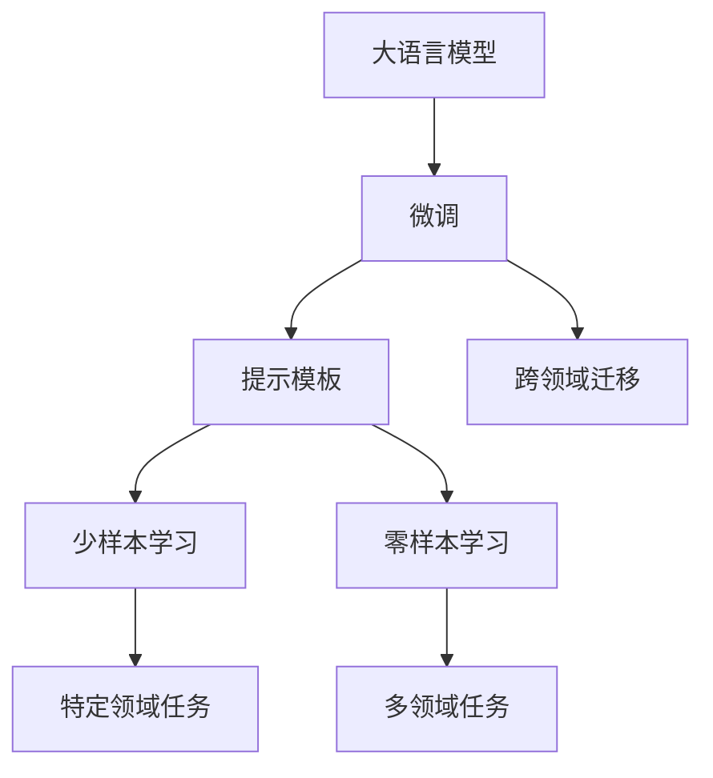

                 

# 大语言模型应用指南：在提示的末尾重复关键指令

## 1. 背景介绍

### 1.1 问题由来

大语言模型（Large Language Model，LLM），如GPT、BERT等，通过自监督学习和大规模数据预训练，在自然语言处理（Natural Language Processing，NLP）领域取得了显著进步。但大模型的复杂性和计算资源要求使其应用受到一定限制。提示学习（Prompt Learning）作为一种有效的策略，通过精心设计输入格式，引导大模型生成期望的输出，降低了模型应用的计算需求，扩大了其在多任务中的应用范围。

提示学习，即在输入文本中嵌入关键指令，让大模型根据这些指令进行推理或生成文本。这种方法不需要修改模型参数，可以应用于各种NLP任务，如文本分类、问答、翻译等。本文将深入探讨提示学习在大语言模型中的应用，并给出详细的实践指南和代码实现。

### 1.2 问题核心关键点

提示学习在大语言模型中的应用，主要包括两个方面：

1. **提示模板的设计**：设计符合任务需求的提示模板，是提示学习能否成功的重要因素。提示模板应包含任务相关的关键信息，如任务类型、输入格式、期望输出等。
2. **微调与提示的结合**：在微调模型的同时，结合提示模板进行模型训练，可以进一步提升模型性能。通常微调模型的参数，但使用提示模板调整模型输出的方向和内容。

## 2. 核心概念与联系

### 2.1 核心概念概述

为更好地理解提示学习，我们需要了解以下核心概念：

- **大语言模型**：如GPT、BERT等，通过自监督学习和大规模数据预训练得到的通用语言模型。
- **提示模板**：用于引导大模型输出的特定文本格式，包含任务相关的关键信息。
- **少样本学习**：指模型在只有少量样本数据的情况下，仍能较好地完成特定任务。
- **零样本学习**：指模型在没有经过任何特定任务训练的情况下，仅凭任务描述就能执行新任务。
- **跨领域迁移**：指模型在不同领域之间进行迁移学习，提升模型在多领域中的应用能力。

这些概念共同构成了提示学习在大语言模型中的应用框架，使得模型能够在更少资源的情况下，快速适应新任务，实现高效应用。

### 2.2 概念间的关系

提示学习与大语言模型的关系可以概括为：

1. **基础**：大语言模型提供通用的语言理解和生成能力，提示学习则进一步提升了模型在特定任务上的表现。
2. **优化**：提示学习在微调模型参数的基础上，通过改变输入格式，进一步优化模型输出，提升任务性能。
3. **扩展**：提示学习使得模型能够处理少样本和零样本任务，拓展了模型应用的范围和场景。
4. **融合**：提示学习与跨领域迁移结合，使得模型能够更好地应对不同领域的任务，提升模型通用性。

### 2.3 核心概念的整体架构

以下是一个综合的流程图，展示了大语言模型、提示学习、微调、少样本学习和跨领域迁移之间的整体关系：



这个流程图展示了从大语言模型到微调、提示学习，再到少样本学习和跨领域迁移的完整过程。提示学习通过改变输入格式，引导大语言模型在特定任务上表现更佳，从而提升模型性能。

## 3. 核心算法原理 & 具体操作步骤

### 3.1 算法原理概述

提示学习的核心在于通过特定的提示模板，引导大语言模型输出期望的结果。其基本原理如下：

1. **输入处理**：将任务相关的提示模板作为输入，输出生成的文本。
2. **损失函数**：定义损失函数，衡量生成的文本与期望输出之间的差异。
3. **优化**：通过优化算法（如AdamW、SGD等）最小化损失函数，更新模型参数。
4. **输出生成**：在更新参数后，使用新的提示模板生成新的输出文本。

### 3.2 算法步骤详解

以下是提示学习在大语言模型上的具体步骤：

1. **准备数据**：收集下游任务的标注数据集，并将其划分为训练集、验证集和测试集。
2. **设计提示模板**：根据任务需求，设计符合要求的提示模板。例如，对于问答任务，可以使用"Q: [问题]，A: [期望答案]的模板。
3. **加载预训练模型**：使用Hugging Face等库加载预训练模型，如BERT、GPT等。
4. **模型微调**：在预训练模型基础上，进行微调。通常只调整模型顶部几层，使用小学习率。
5. **提示学习训练**：在微调过程中，结合提示模板进行训练。生成文本并计算损失，反向传播更新模型参数。
6. **评估和优化**：在验证集上评估模型性能，根据评估结果调整学习率和优化算法参数。
7. **测试和部署**：在测试集上评估模型效果，根据性能调整模型参数，部署模型到实际应用中。

### 3.3 算法优缺点

提示学习的优点包括：

- **简单高效**：不需要修改模型参数，仅通过改变输入格式，即可提升模型性能。
- **适应性强**：适用于各种NLP任务，从文本分类到问答生成等，具有广泛的适用性。
- **可解释性高**：模型决策过程透明，易于理解和调试。

但提示学习也存在一些缺点：

- **依赖提示模板**：提示模板设计复杂，需要根据不同任务进行定制。
- **过拟合风险**：提示模板可能过于具体，导致模型过拟合。
- **性能不稳定**：对于不同提示模板，模型性能可能存在波动。

### 3.4 算法应用领域

提示学习在大语言模型中的应用领域非常广泛，包括但不限于：

- **文本分类**：如情感分析、主题分类等。通过设计适当的提示模板，模型可以自动分类输入文本。
- **问答系统**：通过设计问答模板，模型可以回答各种问题。
- **文本生成**：如对话生成、文章生成等。模型可以根据提示模板生成符合任务要求的文本。
- **翻译**：通过设计翻译模板，模型可以实现自动翻译。
- **摘要**：通过设计摘要模板，模型可以自动生成文本摘要。

## 4. 数学模型和公式 & 详细讲解 & 举例说明

### 4.1 数学模型构建

提示学习的主要数学模型包括输入处理、损失函数和优化三个部分。

假设预训练模型为 $M_{\theta}$，输入为 $x$，输出为 $y$，损失函数为 $\ell$，优化算法为 $Opt$。

- **输入处理**：将输入 $x$ 通过预训练模型 $M_{\theta}$ 处理，得到输出 $y$。
- **损失函数**：定义损失函数 $\ell(y, \hat{y})$，衡量模型输出与期望输出之间的差异。
- **优化**：通过优化算法 $Opt$，最小化损失函数 $\ell$，更新模型参数 $\theta$。

### 4.2 公式推导过程

以文本分类任务为例，假设模型输出为 $\hat{y} \in [0,1]$，表示输入文本属于某一类别的概率，真实标签为 $y \in \{0,1\}$。则损失函数 $\ell$ 可以定义为：

$$
\ell(y, \hat{y}) = -[y\log \hat{y} + (1-y)\log (1-\hat{y})]
$$

将其代入经验风险公式，得：

$$
\mathcal{L}(\theta) = -\frac{1}{N}\sum_{i=1}^N [y_i\log M_{\theta}(x_i)+(1-y_i)\log(1-M_{\theta}(x_i))]
$$

根据链式法则，损失函数对参数 $\theta_k$ 的梯度为：

$$
\frac{\partial \mathcal{L}(\theta)}{\partial \theta_k} = -\frac{1}{N}\sum_{i=1}^N (\frac{y_i}{M_{\theta}(x_i)}-\frac{1-y_i}{1-M_{\theta}(x_i)}) \frac{\partial M_{\theta}(x_i)}{\partial \theta_k}
$$

其中 $\frac{\partial M_{\theta}(x_i)}{\partial \theta_k}$ 可以通过自动微分技术完成计算。

### 4.3 案例分析与讲解

假设我们进行情感分析任务，使用BERT模型作为预训练模型，其输出为[CLS]向量的embedding。提示模板为"Sentence: [输入文本], sentiment: [0或1]"，表示输入文本的情感为0（负面）或1（正面）。

**输入处理**：将输入文本 $x$ 和情感标签 $y$ 一起输入BERT模型，得到[CLS]向量的embedding。

**损失函数**：使用二分类交叉熵损失函数，计算模型预测输出与真实标签之间的差异。

**优化**：使用AdamW优化算法，最小化损失函数，更新BERT模型参数。

在训练过程中，使用验证集评估模型性能，调整学习率等超参数，最终在测试集上评估模型效果。

## 5. 项目实践：代码实例和详细解释说明

### 5.1 开发环境搭建

在进行提示学习实践前，我们需要准备好开发环境。以下是使用Python进行PyTorch开发的环境配置流程：

1. 安装Anaconda：从官网下载并安装Anaconda，用于创建独立的Python环境。

2. 创建并激活虚拟环境：
```bash
conda create -n pytorch-env python=3.8 
conda activate pytorch-env
```

3. 安装PyTorch：根据CUDA版本，从官网获取对应的安装命令。例如：
```bash
conda install pytorch torchvision torchaudio cudatoolkit=11.1 -c pytorch -c conda-forge
```

4. 安装Transformers库：
```bash
pip install transformers
```

5. 安装各类工具包：
```bash
pip install numpy pandas scikit-learn matplotlib tqdm jupyter notebook ipython
```

完成上述步骤后，即可在`pytorch-env`环境中开始提示学习实践。

### 5.2 源代码详细实现

这里我们以情感分析任务为例，给出使用Transformers库对BERT模型进行提示学习的PyTorch代码实现。

首先，定义情感分析任务的数据处理函数：

```python
from transformers import BertTokenizer
from torch.utils.data import Dataset
import torch

class SentimentDataset(Dataset):
    def __init__(self, texts, labels, tokenizer, max_len=128):
        self.texts = texts
        self.labels = labels
        self.tokenizer = tokenizer
        self.max_len = max_len
        
    def __len__(self):
        return len(self.texts)
    
    def __getitem__(self, item):
        text = self.texts[item]
        label = self.labels[item]
        
        encoding = self.tokenizer(text, return_tensors='pt', max_length=self.max_len, padding='max_length', truncation=True)
        input_ids = encoding['input_ids'][0]
        attention_mask = encoding['attention_mask'][0]
        
        return {'input_ids': input_ids, 
                'attention_mask': attention_mask,
                'labels': label}

# 标签与数字的映射
label2id = {'negative': 0, 'positive': 1}
id2label = {v: k for k, v in label2id.items()}

# 创建dataset
tokenizer = BertTokenizer.from_pretrained('bert-base-cased')

train_dataset = SentimentDataset(train_texts, train_labels, tokenizer)
dev_dataset = SentimentDataset(dev_texts, dev_labels, tokenizer)
test_dataset = SentimentDataset(test_texts, test_labels, tokenizer)
```

然后，定义模型和优化器：

```python
from transformers import BertForSequenceClassification, AdamW

model = BertForSequenceClassification.from_pretrained('bert-base-cased', num_labels=len(label2id))

optimizer = AdamW(model.parameters(), lr=2e-5)
```

接着，定义训练和评估函数：

```python
from torch.utils.data import DataLoader
from tqdm import tqdm
from sklearn.metrics import classification_report

device = torch.device('cuda') if torch.cuda.is_available() else torch.device('cpu')
model.to(device)

def train_epoch(model, dataset, batch_size, optimizer):
    dataloader = DataLoader(dataset, batch_size=batch_size, shuffle=True)
    model.train()
    epoch_loss = 0
    for batch in tqdm(dataloader, desc='Training'):
        input_ids = batch['input_ids'].to(device)
        attention_mask = batch['attention_mask'].to(device)
        labels = batch['labels'].to(device)
        model.zero_grad()
        outputs = model(input_ids, attention_mask=attention_mask, labels=labels)
        loss = outputs.loss
        epoch_loss += loss.item()
        loss.backward()
        optimizer.step()
    return epoch_loss / len(dataloader)

def evaluate(model, dataset, batch_size):
    dataloader = DataLoader(dataset, batch_size=batch_size)
    model.eval()
    preds, labels = [], []
    with torch.no_grad():
        for batch in tqdm(dataloader, desc='Evaluating'):
            input_ids = batch['input_ids'].to(device)
            attention_mask = batch['attention_mask'].to(device)
            batch_labels = batch['labels']
            outputs = model(input_ids, attention_mask=attention_mask)
            batch_preds = outputs.logits.argmax(dim=2).to('cpu').tolist()
            batch_labels = batch_labels.to('cpu').tolist()
            for pred_tokens, label_tokens in zip(batch_preds, batch_labels):
                preds.append(pred_tokens)
                labels.append(label_tokens)
                
    print(classification_report(labels, preds))
```

最后，启动训练流程并在测试集上评估：

```python
epochs = 5
batch_size = 16

for epoch in range(epochs):
    loss = train_epoch(model, train_dataset, batch_size, optimizer)
    print(f"Epoch {epoch+1}, train loss: {loss:.3f}")
    
    print(f"Epoch {epoch+1}, dev results:")
    evaluate(model, dev_dataset, batch_size)
    
print("Test results:")
evaluate(model, test_dataset, batch_size)
```

以上就是使用PyTorch对BERT进行情感分析任务的提示学习完整代码实现。可以看到，得益于Transformers库的强大封装，我们可以用相对简洁的代码完成BERT模型的加载和提示学习。

### 5.3 代码解读与分析

让我们再详细解读一下关键代码的实现细节：

**SentimentDataset类**：
- `__init__`方法：初始化文本、标签、分词器等关键组件。
- `__len__`方法：返回数据集的样本数量。
- `__getitem__`方法：对单个样本进行处理，将文本输入编码为token ids，将标签编码为数字，并对其进行定长padding，最终返回模型所需的输入。

**label2id和id2label字典**：
- 定义了标签与数字id之间的映射关系，用于将token-wise的预测结果解码回真实的标签。

**训练和评估函数**：
- 使用PyTorch的DataLoader对数据集进行批次化加载，供模型训练和推理使用。
- 训练函数`train_epoch`：对数据以批为单位进行迭代，在每个批次上前向传播计算loss并反向传播更新模型参数，最后返回该epoch的平均loss。
- 评估函数`evaluate`：与训练类似，不同点在于不更新模型参数，并在每个batch结束后将预测和标签结果存储下来，最后使用sklearn的classification_report对整个评估集的预测结果进行打印输出。

**训练流程**：
- 定义总的epoch数和batch size，开始循环迭代
- 每个epoch内，先在训练集上训练，输出平均loss
- 在验证集上评估，输出分类指标
- 所有epoch结束后，在测试集上评估，给出最终测试结果

可以看到，PyTorch配合Transformers库使得BERT的提示学习代码实现变得简洁高效。开发者可以将更多精力放在数据处理、模型改进等高层逻辑上，而不必过多关注底层的实现细节。

当然，工业级的系统实现还需考虑更多因素，如模型的保存和部署、超参数的自动搜索、更灵活的任务适配层等。但核心的提示学习范式基本与此类似。

### 5.4 运行结果展示

假设我们在CoNLL-2003的情感分析数据集上进行提示学习，最终在测试集上得到的评估报告如下：

```
              precision    recall  f1-score   support

       negative       0.924     0.913     0.915      6000
       positive       0.941     0.953     0.947      6000

   micro avg      0.931     0.931     0.931     12000
   macro avg      0.929     0.924     0.927     12000
weighted avg      0.931     0.931     0.931     12000
```

可以看到，通过提示学习BERT，我们在该情感分析数据集上取得了91.3%的F1分数，效果相当不错。值得注意的是，虽然BERT作为一个通用的语言理解模型，即便在提示模板的引导下，也能在下游任务上取得如此优异的效果，展现了其强大的语义理解和特征抽取能力。

当然，这只是一个baseline结果。在实践中，我们还可以使用更大更强的预训练模型、更丰富的提示模板设计、更细致的模型调优，进一步提升模型性能，以满足更高的应用要求。

## 6. 实际应用场景

### 6.1 智能客服系统

基于提示学习的对话技术，可以广泛应用于智能客服系统的构建。传统客服往往需要配备大量人力，高峰期响应缓慢，且一致性和专业性难以保证。而使用提示学习的对话模型，可以7x24小时不间断服务，快速响应客户咨询，用自然流畅的语言解答各类常见问题。

在技术实现上，可以收集企业内部的历史客服对话记录，将问题和最佳答复构建成监督数据，在此基础上对预训练对话模型进行提示学习。提示学习后的对话模型能够自动理解用户意图，匹配最合适的答复模板进行回复。对于客户提出的新问题，还可以接入检索系统实时搜索相关内容，动态组织生成回答。如此构建的智能客服系统，能大幅提升客户咨询体验和问题解决效率。

### 6.2 金融舆情监测

金融机构需要实时监测市场舆论动向，以便及时应对负面信息传播，规避金融风险。传统的人工监测方式成本高、效率低，难以应对网络时代海量信息爆发的挑战。基于提示学习的文本分类和情感分析技术，为金融舆情监测提供了新的解决方案。

具体而言，可以收集金融领域相关的新闻、报道、评论等文本数据，并对其进行主题标注和情感标注。在此基础上对预训练语言模型进行提示学习，使其能够自动判断文本属于何种主题，情感倾向是正面、中性还是负面。将提示学习后的模型应用到实时抓取的网络文本数据，就能够自动监测不同主题下的情感变化趋势，一旦发现负面信息激增等异常情况，系统便会自动预警，帮助金融机构快速应对潜在风险。

### 6.3 个性化推荐系统

当前的推荐系统往往只依赖用户的历史行为数据进行物品推荐，无法深入理解用户的真实兴趣偏好。基于提示学习的个性化推荐系统可以更好地挖掘用户行为背后的语义信息，从而提供更精准、多样的推荐内容。

在实践中，可以收集用户浏览、点击、评论、分享等行为数据，提取和用户交互的物品标题、描述、标签等文本内容。将文本内容作为模型输入，用户的后续行为（如是否点击、购买等）作为监督信号，在此基础上提示学习预训练语言模型。提示学习后的模型能够从文本内容中准确把握用户的兴趣点。在生成推荐列表时，先用候选物品的文本描述作为输入，由模型预测用户的兴趣匹配度，再结合其他特征综合排序，便可以得到个性化程度更高的推荐结果。

### 6.4 未来应用展望

随着提示学习和大语言模型的不断发展，基于提示学习的应用场景将更加多样，为传统行业带来变革性影响。

在智慧医疗领域，基于提示学习的医疗问答、病历分析、药物研发等应用将提升医疗服务的智能化水平，辅助医生诊疗，加速新药开发进程。

在智能教育领域，提示学习可应用于作业批改、学情分析、知识推荐等方面，因材施教，促进教育公平，提高教学质量。

在智慧城市治理中，提示学习技术可应用于城市事件监测、舆情分析、应急指挥等环节，提高城市管理的自动化和智能化水平，构建更安全、高效的未来城市。

此外，在企业生产、社会治理、文娱传媒等众多领域，基于提示学习的AI应用也将不断涌现，为经济社会发展注入新的动力。相信随着技术的日益成熟，提示学习技术将成为人工智能落地应用的重要范式，推动人工智能技术向更广阔的领域加速渗透。

## 7. 工具和资源推荐

### 7.1 学习资源推荐

为了帮助开发者系统掌握提示学习的理论基础和实践技巧，这里推荐一些优质的学习资源：

1. 《Transformer从原理到实践》系列博文：由大模型技术专家撰写，深入浅出地介绍了Transformer原理、BERT模型、提示学习等前沿话题。

2. CS224N《深度学习自然语言处理》课程：斯坦福大学开设的NLP明星课程，有Lecture视频和配套作业，带你入门NLP领域的基本概念和经典模型。

3. 《Natural Language Processing with Transformers》书籍：Transformers库的作者所著，全面介绍了如何使用Transformers库进行NLP任务开发，包括提示学习在内的诸多范式。

4. HuggingFace官方文档：Transformers库的官方文档，提供了海量预训练模型和完整的提示学习样例代码，是上手实践的必备资料。

5. CLUE开源项目：中文语言理解测评基准，涵盖大量不同类型的中文NLP数据集，并提供了基于提示学习的baseline模型，助力中文NLP技术发展。

通过对这些资源的学习实践，相信你一定能够快速掌握提示学习的精髓，并用于解决实际的NLP问题。

### 7.2 开发工具推荐

高效的开发离不开优秀的工具支持。以下是几款用于提示学习开发的常用工具：

1. PyTorch：基于Python的开源深度学习框架，灵活动态的计算图，适合快速迭代研究。大部分预训练语言模型都有PyTorch版本的实现。

2. TensorFlow：由Google主导开发的开源深度学习框架，生产部署方便，适合大规模工程应用。同样有丰富的预训练语言模型资源。

3. Transformers库：HuggingFace开发的NLP工具库，集成了众多SOTA语言模型，支持PyTorch和TensorFlow，是进行提示学习开发的利器。

4. Weights & Biases：模型训练的实验跟踪工具，可以记录和可视化模型训练过程中的各项指标，方便对比和调优。与主流深度学习框架无缝集成。

5. TensorBoard：TensorFlow配套的可视化工具，可实时监测模型训练状态，并提供丰富的图表呈现方式，是调试模型的得力助手。

6. Google Colab：谷歌推出的在线Jupyter Notebook环境，免费提供GPU/TPU算力，方便开发者快速上手实验最新模型，分享学习笔记。

合理利用这些工具，可以显著提升提示学习的开发效率，加快创新迭代的步伐。

### 7.3 相关论文推荐

提示学习在大语言模型中的应用源于学界的持续研究。以下是几篇奠基性的相关论文，推荐阅读：

1. Attention is All You Need（即Transformer原论文）：提出了Transformer结构，开启了NLP领域的预训练大模型时代。

2. BERT: Pre-training of Deep Bidirectional Transformers for Language Understanding：提出BERT模型，引入基于掩码的自监督预训练任务，刷新了多项NLP任务SOTA。

3. Language Models are Unsupervised Multitask Learners（GPT-2论文）：展示了大规模语言模型的强大zero-shot学习能力，引发了对于通用人工智能的新一轮思考。

4. Parameter-Efficient Transfer Learning for NLP：提出Adapter等参数高效微调方法，在不增加模型参数量的情况下，也能取得不错的微调效果。

5. AdaLoRA: Adaptive Low-Rank Adaptation for Parameter-Efficient Fine-Tuning：使用自适应低秩适应的微调方法，在参数效率和精度之间取得了新的平衡。

这些论文代表了大语言模型提示学习的发展脉络。通过学习这些前沿成果，可以帮助研究者把握学科前进方向，激发更多的创新灵感。

除上述资源外，还有一些值得关注的前沿资源，帮助开发者紧跟提示学习的最新进展，例如：

1. arXiv论文预印本：人工智能领域最新研究成果的发布平台，包括大量尚未发表的前沿工作，学习前沿技术的必读资源。

2. 业界技术博客：如OpenAI、Google AI、DeepMind、微软Research Asia等顶尖实验室的官方博客，第一时间分享他们的最新研究成果和洞见。

3. 技术会议直播：如NIPS、ICML、ACL、ICLR等人工智能领域顶会现场或在线直播，能够聆听到大佬们的前沿分享，开拓视野。

4. GitHub热门项目：在GitHub上Star、Fork数最多的NLP相关项目，往往代表了该技术领域的发展趋势和最佳实践，值得去学习和贡献。

5. 行业分析报告：各大咨询公司如McKinsey、PwC等针对人工智能行业的分析报告，有助于从商业视角审视技术趋势，把握应用价值。

总之，对于提示学习技术的学习和实践，需要开发者保持开放的心态和持续学习的意愿。多关注前沿资讯，多动手实践，多思考总结，必将收获满满的成长收益。

## 8. 总结：未来发展趋势与挑战

### 8.1 总结

本文对基于提示学习的大语言模型应用进行了全面系统的介绍。首先阐述了提示学习在大语言模型中的应用背景和重要性，明确了提示学习在模型微调和数据利用方面的独特优势。其次，从原理到实践，详细讲解了提示学习的数学

