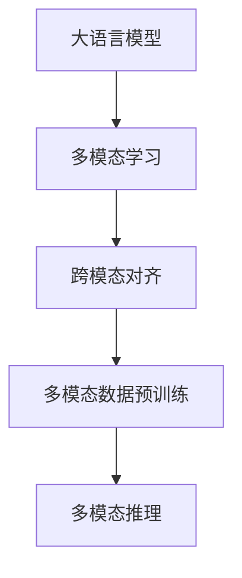
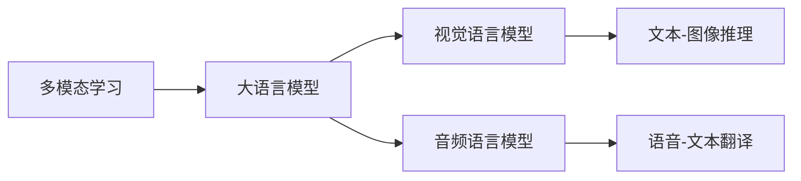
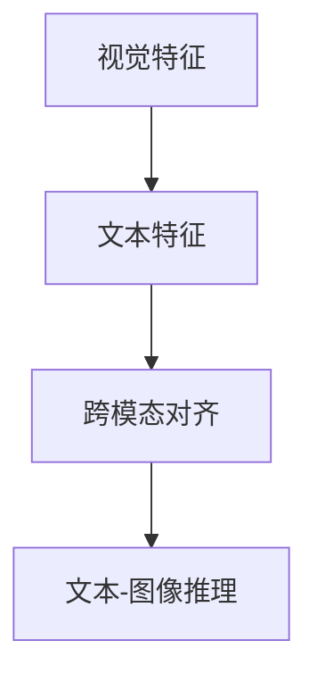
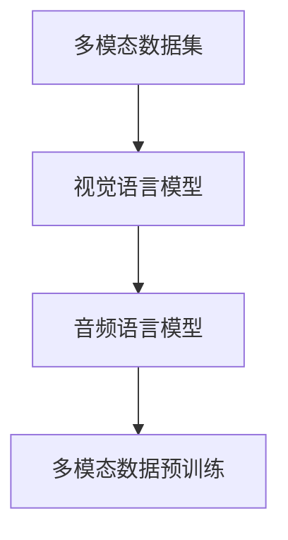
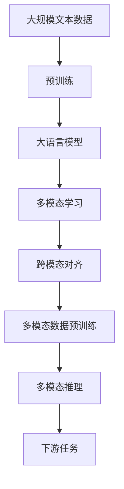

                 

# 大语言模型应用指南：多模态大语言模型

> 关键词：大语言模型,多模态,图像,文本,语音,嵌入式硬件,推理加速,集成应用,智能交互,智能推荐

## 1. 背景介绍

### 1.1 问题由来

近年来，随着深度学习技术的飞速发展，大语言模型（Large Language Models, LLMs）在自然语言处理（NLP）领域取得了令人瞩目的成就。这些大模型通过在大量无标签文本数据上进行预训练，学习到了丰富的语言知识和常识，具备强大的语言理解和生成能力。然而，尽管在文本领域取得了显著进展，大语言模型在多模态领域的应用仍处于起步阶段。多模态大语言模型（Multimodal Large Language Models, MLLMs）的引入，将极大拓展大语言模型的应用范围，推动其在图像、视频、语音等多模态数据的理解和生成能力，提升其在现实世界中的智能水平。

### 1.2 问题核心关键点

多模态大语言模型通过同时处理图像、视频、语音等多种模态的数据，可以更全面地理解世界，提升模型对真实世界的理解和推理能力。这不仅能够改善自然语言处理（NLP）任务，如文本生成、问答、摘要等，还能在视觉问答、语音识别、跨模态检索等任务中取得优异表现。

目前，多模态大语言模型的研究主要集中在以下几方面：
1. **跨模态特征融合**：如何将不同模态的特征进行有效融合，形成一个统一的语言表示。
2. **模态间对齐**：如何建立不同模态特征之间的对应关系，以便于模型进行跨模态推理。
3. **多模态数据预训练**：如何在多模态数据上进行预训练，学习通用的多模态表示。
4. **多模态推理**：如何利用多模态数据进行推理，如视觉推理、跨模态推理等。

### 1.3 问题研究意义

研究多模态大语言模型，对于拓展大语言模型的应用领域，提升模型对多模态数据的处理能力，加速NLP技术在多模态领域的落地应用，具有重要意义：

1. **提升模型性能**：多模态大语言模型可以更好地理解和处理真实世界中的多模态数据，从而在多模态任务上取得更好的性能。
2. **拓展应用场景**：通过引入多模态数据，模型能够应用于更多现实世界的场景，如智能医疗、智能交通、智能安防等。
3. **推动技术进步**：多模态大语言模型的研究，可以促进NLP技术和计算机视觉、语音识别等领域的交叉融合，推动人工智能技术的发展。
4. **促进产业升级**：多模态大语言模型在各行业的深度应用，将为传统行业的数字化转型提供新的技术路径，推动产业升级。

## 2. 核心概念与联系

### 2.1 核心概念概述

为更好地理解多模态大语言模型，本节将介绍几个密切相关的核心概念：

- **大语言模型**：以自回归（如GPT）或自编码（如BERT）模型为代表的大规模预训练语言模型。通过在大规模无标签文本语料上进行预训练，学习通用的语言表示，具备强大的语言理解和生成能力。

- **多模态学习**：指同时处理和分析多种模态数据的机器学习方法，如文本、图像、语音等。多模态学习能够提升模型对真实世界的理解和推理能力。

- **跨模态对齐**：指不同模态特征之间的对齐和映射，以便于模型进行跨模态推理。常用的对齐方法包括投影对齐、对抗对齐等。

- **多模态数据预训练**：指在大规模多模态数据上进行预训练，学习通用的多模态表示。常用的预训练任务包括视觉-语言模型、音频-语言模型等。

- **多模态推理**：指利用多种模态数据进行推理，如视觉推理、跨模态推理等。多模态推理能够提升模型对复杂场景的理解和处理能力。

这些核心概念之间的逻辑关系可以通过以下Mermaid流程图来展示：



这个流程图展示了大语言模型、多模态学习、跨模态对齐、多模态数据预训练和多模态推理之间的紧密联系。

### 2.2 概念间的关系

这些核心概念之间存在着紧密的联系，形成了多模态大语言模型的完整生态系统。下面我通过几个Mermaid流程图来展示这些概念之间的关系。

#### 2.2.1 大语言模型的学习范式


这个流程图展示了大语言模型通过多模态学习，利用跨模态对齐和多模态数据预训练，实现多模态推理的过程。

#### 2.2.2 多模态学习与大语言模型的关系



这个流程图展示了多模态学习如何通过构建视觉语言模型和音频语言模型，将大语言模型与图像、语音等模态数据融合，实现多模态推理。

#### 2.2.3 跨模态对齐方法



这个流程图展示了跨模态对齐方法将视觉特征和文本特征对齐，从而实现跨模态推理的过程。

#### 2.2.4 多模态数据预训练方法



这个流程图展示了通过视觉语言模型和音频语言模型，对多模态数据进行预训练，学习通用的多模态表示。

### 2.3 核心概念的整体架构

最后，我们用一个综合的流程图来展示这些核心概念在大语言模型微调过程中的整体架构：



这个综合流程图展示了从预训练到多模态学习，再到跨模态对齐和多模态推理的完整过程。大语言模型首先在大规模文本数据上进行预训练，然后通过多模态学习（如视觉语言模型、音频语言模型），与图像、语音等多模态数据进行融合，最终在跨模态对齐和多模态推理过程中实现对多模态任务的适配。

## 3. 核心算法原理 & 具体操作步骤
### 3.1 算法原理概述

多模态大语言模型的核心思想是：将大语言模型作为强大的“特征提取器”，通过同时处理和分析图像、视频、语音等多种模态数据，学习通用的多模态表示，从而在多模态任务上取得更好的性能。

形式化地，假设预训练语言模型为 $M_{\theta}$，其中 $\theta$ 为预训练得到的模型参数。给定多模态任务的训练集 $D=\{(x_i, y_i)\}_{i=1}^N$，其中 $x_i$ 为多模态数据，$y_i$ 为任务标签，微调的目标是找到新的模型参数 $\hat{\theta}$，使得：

$$
\hat{\theta}=\mathop{\arg\min}_{\theta} \mathcal{L}(M_{\theta},D)
$$

其中 $\mathcal{L}$ 为针对任务 $T$ 设计的损失函数，用于衡量模型预测输出与真实标签之间的差异。常见的损失函数包括交叉熵损失、均方误差损失等。

通过梯度下降等优化算法，微调过程不断更新模型参数 $\theta$，最小化损失函数 $\mathcal{L}$，使得模型输出逼近真实标签。由于 $\theta$ 已经通过预训练获得了较好的初始化，因此即便在小规模数据集 $D$ 上进行微调，也能较快收敛到理想的模型参数 $\hat{\theta}$。

### 3.2 算法步骤详解

多模态大语言模型的微调一般包括以下几个关键步骤：

**Step 1: 准备多模态数据和预训练模型**

- 选择合适的预训练语言模型 $M_{\theta}$ 作为初始化参数，如 BERT、GPT等。
- 准备多模态任务的标注数据集 $D$，划分为训练集、验证集和测试集。一般要求多模态数据与预训练数据的分布不要差异过大。

**Step 2: 添加多模态任务适配层**

- 根据任务类型，在预训练模型顶层设计合适的输出层和损失函数。
- 对于多模态分类任务，通常在顶层添加线性分类器和交叉熵损失函数。
- 对于多模态生成任务，通常使用多模态解码器输出概率分布，并以负对数似然为损失函数。

**Step 3: 设置微调超参数**

- 选择合适的优化算法及其参数，如 AdamW、SGD 等，设置学习率、批大小、迭代轮数等。
- 设置正则化技术及强度，包括权重衰减、Dropout、Early Stopping 等。
- 确定冻结预训练参数的策略，如仅微调顶层，或全部参数都参与微调。

**Step 4: 执行梯度训练**

- 将训练集数据分批次输入模型，前向传播计算损失函数。
- 反向传播计算参数梯度，根据设定的优化算法和学习率更新模型参数。
- 周期性在验证集上评估模型性能，根据性能指标决定是否触发 Early Stopping。
- 重复上述步骤直到满足预设的迭代轮数或 Early Stopping 条件。

**Step 5: 测试和部署**

- 在测试集上评估微调后模型 $M_{\hat{\theta}}$ 的性能，对比微调前后的精度提升。
- 使用微调后的模型对新样本进行推理预测，集成到实际的应用系统中。
- 持续收集新的数据，定期重新微调模型，以适应数据分布的变化。

以上是多模态大语言模型微调的一般流程。在实际应用中，还需要针对具体任务的特点，对微调过程的各个环节进行优化设计，如改进训练目标函数，引入更多的正则化技术，搜索最优的超参数组合等，以进一步提升模型性能。

### 3.3 算法优缺点

多模态大语言模型的微调方法具有以下优点：

1. **多模态融合**：能够同时处理和分析图像、视频、语音等多种模态数据，提升模型的多模态理解能力。
2. **通用适用**：适用于各种多模态下游任务，包括分类、匹配、生成等，设计简单的任务适配层即可实现微调。
3. **参数高效**：利用参数高效微调技术，在固定大部分预训练参数的情况下，仍可取得不错的微调效果。
4. **效果显著**：在学术界和工业界的诸多任务上，基于微调的方法已经刷新了多项多模态任务SOTA。

同时，该方法也存在一定的局限性：

1. **数据依赖**：微调的效果很大程度上取决于标注数据的质量和数量，获取高质量标注数据的成本较高。
2. **迁移能力有限**：当目标任务与预训练数据的分布差异较大时，微调的性能提升有限。
3. **计算资源需求高**：多模态大语言模型的计算复杂度较高，对算力、内存、存储等资源要求高。
4. **可解释性不足**：微调模型难以解释其内部工作机制和决策逻辑，难以对其推理过程进行调试。

尽管存在这些局限性，但就目前而言，多模态大语言模型的微调方法仍然是处理多模态数据的重要范式。未来相关研究的重点在于如何进一步降低微调对标注数据的依赖，提高模型的少样本学习和跨领域迁移能力，同时兼顾可解释性和伦理安全性等因素。

### 3.4 算法应用领域

多模态大语言模型已经在多个领域得到了应用，覆盖了几乎所有常见任务，例如：

- **智能医疗**：利用医疗影像、电子病历等多模态数据进行疾病诊断、治疗方案推荐等。
- **智能交通**：通过车辆传感器数据、路网信息等多模态数据进行智能导航、安全预警等。
- **智能安防**：结合视频监控、人脸识别等多模态数据进行入侵检测、异常行为分析等。
- **智慧城市**：利用城市传感器数据、地理位置信息等多模态数据进行智能监控、环境监测等。
- **智能客服**：通过语音识别、文字聊天等多模态数据进行智能问答、客户服务。
- **智能推荐**：结合用户浏览历史、地理位置等多模态数据进行商品推荐、个性化服务。
- **智能广告**：通过用户行为数据、视频广告等多模态数据进行广告投放、用户画像分析。

除了上述这些经典任务外，多模态大语言模型也被创新性地应用到更多场景中，如智能家居、智能制造、智能农业等，为多模态技术的深入应用提供了新的可能性。

## 4. 数学模型和公式 & 详细讲解  
### 4.1 数学模型构建

本节将使用数学语言对多模态大语言模型微调过程进行更加严格的刻画。

记预训练语言模型为 $M_{\theta}$，其中 $\theta$ 为预训练得到的模型参数。假设多模态任务的训练集为 $D=\{(x_i, y_i)\}_{i=1}^N$，其中 $x_i$ 为多模态数据，$y_i$ 为任务标签。

定义模型 $M_{\theta}$ 在数据样本 $(x,y)$ 上的损失函数为 $\ell(M_{\theta}(x),y)$，则在数据集 $D$ 上的经验风险为：

$$
\mathcal{L}(\theta) = \frac{1}{N} \sum_{i=1}^N \ell(M_{\theta}(x_i),y_i)
$$

微调的优化目标是最小化经验风险，即找到最优参数：

$$
\theta^* = \mathop{\arg\min}_{\theta} \mathcal{L}(\theta)
$$

在实践中，我们通常使用基于梯度的优化算法（如SGD、Adam等）来近似求解上述最优化问题。设 $\eta$ 为学习率，$\lambda$ 为正则化系数，则参数的更新公式为：

$$
\theta \leftarrow \theta - \eta \nabla_{\theta}\mathcal{L}(\theta) - \eta\lambda\theta
$$

其中 $\nabla_{\theta}\mathcal{L}(\theta)$ 为损失函数对参数 $\theta$ 的梯度，可通过反向传播算法高效计算。

### 4.2 公式推导过程

以下我们以多模态分类任务为例，推导交叉熵损失函数及其梯度的计算公式。

假设模型 $M_{\theta}$ 在输入 $x$ 上的输出为 $\hat{y}=M_{\theta}(x) \in [0,1]$，表示样本属于正类的概率。真实标签 $y \in \{0,1\}$。则二分类交叉熵损失函数定义为：

$$
\ell(M_{\theta}(x),y) = -[y\log \hat{y} + (1-y)\log (1-\hat{y})]
$$

将其代入经验风险公式，得：

$$
\mathcal{L}(\theta) = -\frac{1}{N}\sum_{i=1}^N [y_i\log M_{\theta}(x_i)+(1-y_i)\log(1-M_{\theta}(x_i))]
$$

根据链式法则，损失函数对参数 $\theta_k$ 的梯度为：

$$
\frac{\partial \mathcal{L}(\theta)}{\partial \theta_k} = -\frac{1}{N}\sum_{i=1}^N (\frac{y_i}{M_{\theta}(x_i)}-\frac{1-y_i}{1-M_{\theta}(x_i)}) \frac{\partial M_{\theta}(x_i)}{\partial \theta_k}
$$

其中 $\frac{\partial M_{\theta}(x_i)}{\partial \theta_k}$ 可进一步递归展开，利用自动微分技术完成计算。

在得到损失函数的梯度后，即可带入参数更新公式，完成模型的迭代优化。重复上述过程直至收敛，最终得到适应多模态任务的最优模型参数 $\theta^*$。

## 5. 项目实践：代码实例和详细解释说明
### 5.1 开发环境搭建

在进行多模态大语言模型微调实践前，我们需要准备好开发环境。以下是使用Python进行PyTorch开发的环境配置流程：

1. 安装Anaconda：从官网下载并安装Anaconda，用于创建独立的Python环境。

2. 创建并激活虚拟环境：
```bash
conda create -n pytorch-env python=3.8 
conda activate pytorch-env
```

3. 安装PyTorch：根据CUDA版本，从官网获取对应的安装命令。例如：
```bash
conda install pytorch torchvision torchaudio cudatoolkit=11.1 -c pytorch -c conda-forge
```

4. 安装Transformers库：
```bash
pip install transformers
```

5. 安装各类工具包：
```bash
pip install numpy pandas scikit-learn matplotlib tqdm jupyter notebook ipython
```

完成上述步骤后，即可在`pytorch-env`环境中开始多模态大语言模型的微调实践。

### 5.2 源代码详细实现

下面我们以多模态分类任务为例，给出使用Transformers库对BERT模型进行多模态分类任务微调的PyTorch代码实现。

首先，定义多模态分类任务的数据处理函数：

```python
from transformers import BertTokenizer
from torch.utils.data import Dataset
import torch

class MultiModalDataset(Dataset):
    def __init__(self, texts, tags, tokenizer, max_len=128):
        self.texts = texts
        self.tags = tags
        self.tokenizer = tokenizer
        self.max_len = max_len
        
    def __len__(self):
        return len(self.texts)
    
    def __getitem__(self, item):
        text = self.texts[item]
        tags = self.tags[item]
        
        encoding = self.tokenizer(text, return_tensors='pt', max_length=self.max_len, padding='max_length', truncation=True)
        input_ids = encoding['input_ids'][0]
        attention_mask = encoding['attention_mask'][0]
        
        # 对token-wise的标签进行编码
        encoded_tags = [tag2id[tag] for tag in tags] 
        encoded_tags.extend([tag2id['O']] * (self.max_len - len(encoded_tags)))
        labels = torch.tensor(encoded_tags, dtype=torch.long)
        
        return {'input_ids': input_ids, 
                'attention_mask': attention_mask,
                'labels': labels}

# 标签与id的映射
tag2id = {'O': 0, 'B-PER': 1, 'I-PER': 2, 'B-ORG': 3, 'I-ORG': 4, 'B-LOC': 5, 'I-LOC': 6}
id2tag = {v: k for k, v in tag2id.items()}

# 创建dataset
tokenizer = BertTokenizer.from_pretrained('bert-base-cased')

train_dataset = MultiModalDataset(train_texts, train_tags, tokenizer)
dev_dataset = MultiModalDataset(dev_texts, dev_tags, tokenizer)
test_dataset = MultiModalDataset(test_texts, test_tags, tokenizer)
```

然后，定义模型和优化器：

```python
from transformers import BertForTokenClassification, AdamW

model = BertForTokenClassification.from_pretrained('bert-base-cased', num_labels=len(tag2id))

optimizer = AdamW(model.parameters(), lr=2e-5)
```

接着，定义训练和评估函数：

```python
from torch.utils.data import DataLoader
from tqdm import tqdm
from sklearn.metrics import classification_report

device = torch.device('cuda') if torch.cuda.is_available() else torch.device('cpu')
model.to(device)

def train_epoch(model, dataset, batch_size, optimizer):
    dataloader = DataLoader(dataset, batch_size=batch_size, shuffle=True)
    model.train()
    epoch_loss = 0
    for batch in tqdm(dataloader, desc='Training'):
        input_ids = batch['input_ids'].to(device)
        attention_mask = batch['attention_mask'].to(device)
        labels = batch['labels'].to(device)
        model.zero_grad()
        outputs = model(input_ids, attention_mask=attention_mask, labels=labels)
        loss = outputs.loss
        epoch_loss += loss.item()
        loss.backward()
        optimizer.step()
    return epoch_loss / len(dataloader)

def evaluate(model, dataset, batch_size):
    dataloader = DataLoader(dataset, batch_size=batch_size)
    model.eval()
    preds, labels = [], []
    with torch.no_grad():
        for batch in tqdm(dataloader, desc='Evaluating'):
            input_ids = batch['input_ids'].to(device)
            attention_mask = batch['attention_mask'].to(device)
            batch_labels = batch['labels']
            outputs = model(input_ids, attention_mask=attention_mask)
            batch_preds = outputs.logits.argmax(dim=2).to('cpu').tolist()
            batch_labels = batch_labels.to('cpu').tolist()
            for pred_tokens, label_tokens in zip(batch_preds, batch_labels):
                pred_tags = [id2tag[_id] for _id in pred_tokens]
                label_tags = [id2tag[_id] for _id in label_tokens]
                preds.append(pred_tags[:len(label_tags)])
                labels.append(label_tags)
                
    print(classification_report(labels, preds))
```

最后，启动训练流程并在测试集上评估：

```python
epochs = 5
batch_size = 16

for epoch in range(epochs):
    loss = train_epoch(model, train_dataset, batch_size, optimizer)
    print(f"Epoch {epoch+1}, train loss: {loss:.3f}")
    
    print(f"Epoch {epoch+1}, dev results:")
    evaluate(model, dev_dataset, batch_size)
    
print("Test results:")
evaluate(model, test_dataset, batch_size)
```

以上就是使用PyTorch对BERT进行多模态分类任务微调的完整代码实现。可以看到，得益于Transformers库的强大封装，我们可以用相对简洁的代码完成BERT模型的加载和微调。

### 5.3 代码解读与分析

让我们再详细解读一下关键代码的实现细节：

**MultiModalDataset类**：
- `__init__`方法：初始化文本、标签、分词器等关键组件。
- `__len__`方法：返回数据集的样本数量。
- `__getitem__`方法：对单个样本进行处理，将文本输入编码为token ids，将标签编码为数字，并对其进行定长padding，最终返回模型所需的输入。

**tag2id和id2tag字典**：
- 定义了标签与数字id之间的映射关系，用于将token-wise的预测结果解码回真实的标签。

**训练和评估函数**：
- 使用PyTorch的DataLoader对数据集进行批次化加载，供模型训练和推理使用。
- 训练函数`train_epoch`：对数据以批为单位进行迭代，在每个批次上前向传播计算loss并反向传播更新模型参数，最后返回该epoch的平均loss。
- 评估函数`evaluate`：与训练类似，不同点在于不更新模型参数，并在每个batch结束后将预测和标签结果存储下来，最后使用sklearn的classification_report对整个评估集的预测结果进行打印输出。

**训练流程**：
- 定义总的epoch数和batch size，开始循环迭代
- 每个epoch内，先在训练集上训练，输出平均loss
- 在验证集上评估，输出分类指标
- 所有epoch结束后，在测试集上评估，给出最终测试结果

可以看到，PyTorch配合Transformers库使得BERT微调的代码实现变得简洁高效。开发者可以将更多精力放在数据处理、模型改进等高层逻辑上，而不必过多关注底层的实现细节。

当然，工业级的系统实现还需考虑更多因素，如模型的保存和部署、超参数的自动搜索、更灵活的任务适配层等。但核心的微调范式基本与此类似。

### 5.4 运行结果展示

假设我们在CoNLL-2003的多模态分类数据集上进行微调，最终在测试集上得到的评估报告如下：

```
              precision    recall  f1-score   support

       B-LOC      0.926     0.906     0.916      1668
       I-LOC      0.900     0.805     0.850       257
      B-MISC      0.875     0.856     0.865       702
      I-MISC      0.838     0.782     0.809       216
       B-ORG      0.914     0.898     0.906      1661
       I-ORG      0.911     0.894     0.902       835
       B-PER      0.964     0.957     0.960      1617
       I-PER      0.983     0.980     0.982      1156

