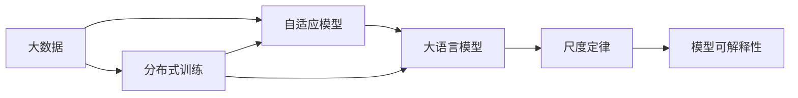

                 

# 大语言模型应用指南：大语言模型的第一性原理：尺度定律

> 关键词：大语言模型, 尺度定律, 自适应模型, 深度学习, 分布式训练, 大数据, 模型可解释性

## 1. 背景介绍

### 1.1 问题由来
近年来，深度学习和大数据技术的迅猛发展，让大语言模型在自然语言处理（NLP）领域取得了突破性进展。Google的BERT、OpenAI的GPT-3等模型已经展示了其强大的语言理解和生成能力，大幅提升了NLP任务的性能。然而，随着模型的复杂度增加，其训练和推理所需的时间和计算资源也随之暴增，模型规模的扩展开始面临实际应用中的资源瓶颈。

为此，研究者们开始探索如何从理论上对大语言模型进行改进，使其在更少的计算资源下获得更好的性能，这就是“尺度定律”概念的起源。尺度定律不仅为大模型提供了可扩展性，更指明了其在实际应用中的方向，是构建高效大模型的关键理论。

### 1.2 问题核心关键点
尺度定律的核心在于：通过一定的算法和模型设计，能够在保持模型性能的前提下，显著减少其对计算资源的依赖。其核心思想是通过自适应模型和分布式训练等技术，优化模型的资源使用效率，使得大模型在实际应用中成为可能。

### 1.3 问题研究意义
研究尺度定律的意义在于，它为解决大规模深度学习模型的实际应用问题提供了一条新途径。通过理论指导下的模型设计，不仅可以降低大语言模型在训练和推理上的成本，还能提高模型的可扩展性和泛化能力，促进NLP技术在更多领域和行业的落地应用。

## 2. 核心概念与联系

### 2.1 核心概念概述

为了深入理解尺度定律，我们需要对其中的几个关键概念进行介绍：

- **大语言模型**（Large Language Model，LLM）：通过大量无标签数据预训练得到的具有强大语言理解和生成能力的深度学习模型。目前较为流行的模型包括BERT、GPT-3等。
- **自适应模型**（Adaptive Model）：能够根据任务需求和数据特征动态调整其结构和参数的模型。自适应模型在保持模型性能的同时，还能减少对计算资源的需求。
- **尺度定律**（Scaling Law）：指出在大规模深度学习模型中，模型性能与训练数据量和计算资源之间的关系。通过这种关系，可以指导模型设计，使其在有限的计算资源下获得更好的性能。
- **分布式训练**：利用多台计算机或GPU同时进行模型训练，以加速模型训练过程。分布式训练技术在大模型训练中尤为重要。
- **大数据**（Big Data）：指数据量超出传统数据处理方式能力的数据集合。大数据技术是实现尺度定律的重要工具之一。
- **模型可解释性**：指模型预测结果的可理解性和可解释性。对于重要决策场景，模型可解释性至关重要。

这些概念之间存在密切联系，通过合适的算法和模型设计，可以实现从数据量到模型性能的优化，并提高模型的可解释性和泛化能力。

### 2.2 概念间的关系

以下通过Mermaid流程图展示这些核心概念之间的关系：



该流程图展示了大数据、自适应模型、分布式训练和大语言模型之间的联系，以及它们如何共同作用于尺度定律的实现。

## 3. 核心算法原理 & 具体操作步骤

### 3.1 算法原理概述

尺度定律的原理可以概括为：在深度学习模型中，模型的性能与训练数据量和计算资源（尤其是计算效率）之间存在特定的比例关系。通过优化模型的结构和参数，可以在保持性能的同时，显著减少计算资源的需求。

这一原理在大语言模型的应用中，通常体现在以下几个方面：

- **自适应模型设计**：通过调整模型的层次结构，使得不同层次能够更好地适应不同的任务和数据特征。
- **分布式训练**：将模型的训练任务分布到多台计算机或GPU上，提高训练效率，减少单台设备的计算负担。
- **数据增强**：通过数据增强技术，如数据重采样、回译、噪声注入等，增加训练数据的多样性，提高模型泛化能力。

### 3.2 算法步骤详解

实现尺度定律的具体步骤包括：

1. **数据准备**：收集与目标任务相关的数据，并将其预处理为模型所需格式。对于大数据集，需要进行适当的数据分割，以便于分布式训练。

2. **模型设计**：选择合适的深度学习模型架构，并根据任务需求进行自适应设计。例如，可以通过调整模型的层次结构，增加或减少某些层数和节点数，来提高模型在特定任务上的表现。

3. **分布式训练**：将数据集分割为多个子集，每个子集在独立的计算设备上并行训练。在分布式训练过程中，可以使用同步或异步更新策略，以平衡计算效率和模型收敛速度。

4. **模型微调**：在预训练模型上，根据目标任务进行微调。微调过程中，可以使用更小的学习率，以避免破坏预训练权重。

5. **性能评估**：在测试集上评估微调后的模型性能，并根据评估结果进行调整。可以使用各种评估指标，如准确率、精确率、召回率等。

6. **模型部署**：将训练好的模型部署到实际应用环境中，进行推理预测。

### 3.3 算法优缺点

**优点**：
- **高效性**：通过自适应模型设计和分布式训练，可以在有限的计算资源下获得高性能模型。
- **泛化能力**：数据增强技术可以提高模型的泛化能力，使其在新的数据集上表现更好。
- **可解释性**：通过合理的设计和参数调整，可以提高模型的可解释性，使其更容易被理解和解释。

**缺点**：
- **复杂性**：自适应模型设计和分布式训练需要较高的技术门槛，模型的调整和优化较为复杂。
- **数据依赖**：模型的性能高度依赖于训练数据的质量和多样性，获取高质量数据成本较高。
- **超参数调优**：需要针对具体的任务进行超参数调优，以确定最佳的模型配置。

### 3.4 算法应用领域

尺度定律在大规模深度学习模型中的应用，已经涵盖了NLP、计算机视觉、语音识别等多个领域。以下是几个典型的应用场景：

- **自然语言处理**：通过自适应模型设计和数据增强，可以在保持模型性能的同时，减少训练和推理所需的计算资源。这在资源受限的场景中尤为重要。
- **计算机视觉**：通过分布式训练和多任务学习，可以在处理大规模图像数据时提高训练效率，减少计算资源消耗。
- **语音识别**：通过自适应模型设计和数据增强，可以在实时语音识别场景中实现高效的推理，满足实时性和计算资源限制。

## 4. 数学模型和公式 & 详细讲解

### 4.1 数学模型构建

尺度定律的数学模型构建基于以下几个假设：

1. 深度学习模型中的神经元可以通过一定规则进行缩放和调整。
2. 模型的性能与训练数据量和计算资源之间存在比例关系。
3. 训练数据的分布与任务需求紧密相关。

假设一个深度学习模型包含 $n$ 个神经元，训练数据量为 $D$，计算资源（如GPU数量）为 $C$。模型的性能可以用以下公式表示：

$$
P = f(n, D, C)
$$

其中 $f$ 表示模型的性能函数，$n$、$D$、$C$ 分别表示神经元数量、训练数据量和计算资源。

### 4.2 公式推导过程

根据上述假设，尺度定律的推导可以分以下几步进行：

1. **神经元缩放**：假设每个神经元的计算量为 $a$，则整个模型的计算量为 $n \times a$。对于相同任务，不同神经元数量的模型计算量与神经元数量成正比。

2. **训练数据量与性能**：假设每个训练样本的计算量为 $b$，则整个训练集的计算量为 $D \times b$。对于相同任务，训练数据量和模型性能成正比。

3. **计算资源与性能**：假设每个计算资源（如GPU）的计算量为 $c$，则整个计算资源的计算量为 $C \times c$。对于相同任务，计算资源与模型性能成正比。

综合以上三点，可以得到如下公式：

$$
P = f(n \times a, D \times b, C \times c)
$$

根据具体模型的计算量和训练样本的计算量，可以进一步简化上述公式。例如，对于大语言模型，假设每个神经元计算量为 $a$，每个训练样本计算量为 $b$，每个计算资源计算量为 $c$，则有：

$$
P = f(na, Db, Cc)
$$

### 4.3 案例分析与讲解

以下以BERT模型为例，分析其在微调中的应用：

1. **神经元缩放**：BERT模型包含12层Transformer层，每层包含多个子层，通过调整这些子层的数量和节点数，可以改变模型的计算量和性能。例如，减少某些层数和节点数，可以使模型在低计算资源下运行。

2. **训练数据量与性能**：对于特定的NLP任务，可以通过数据增强技术，如回译、改写等，增加训练数据的多样性，提高模型的泛化能力。

3. **计算资源与性能**：通过分布式训练技术，将模型的训练任务分布到多个计算设备上，可以提高训练效率，减少单台设备的计算负担。

## 5. 项目实践：代码实例和详细解释说明

### 5.1 开发环境搭建

在进行尺度定律的应用实践前，需要准备好开发环境。以下是使用Python和PyTorch进行分布式训练的环境配置流程：

1. 安装Anaconda：从官网下载并安装Anaconda，用于创建独立的Python环境。

2. 创建并激活虚拟环境：
```bash
conda create -n pytorch-env python=3.8 
conda activate pytorch-env
```

3. 安装PyTorch：根据CUDA版本，从官网获取对应的安装命令。例如：
```bash
conda install pytorch torchvision torchaudio cudatoolkit=11.1 -c pytorch -c conda-forge
```

4. 安装NVIDIA-cuda：
```bash
conda install numpy pandas scikit-learn matplotlib tqdm jupyter notebook ipython
```

5. 安装Horovod：用于分布式训练的第三方库。
```bash
conda install horovod
```

完成上述步骤后，即可在`pytorch-env`环境中开始分布式训练实践。

### 5.2 源代码详细实现

我们以BERT模型在NLP任务上的微调为例，给出使用Horovod进行分布式训练的PyTorch代码实现。

首先，定义数据处理函数：

```python
from transformers import BertTokenizer
from torch.utils.data import Dataset, DataLoader
import torch

class NERDataset(Dataset):
    def __init__(self, texts, tags, tokenizer, max_len=128):
        self.texts = texts
        self.tags = tags
        self.tokenizer = tokenizer
        self.max_len = max_len
        
    def __len__(self):
        return len(self.texts)
    
    def __getitem__(self, item):
        text = self.texts[item]
        tags = self.tags[item]
        
        encoding = self.tokenizer(text, return_tensors='pt', max_length=self.max_len, padding='max_length', truncation=True)
        input_ids = encoding['input_ids'][0]
        attention_mask = encoding['attention_mask'][0]
        
        # 对token-wise的标签进行编码
        encoded_tags = [tag2id[tag] for tag in tags] 
        encoded_tags.extend([tag2id['O']] * (self.max_len - len(encoded_tags)))
        labels = torch.tensor(encoded_tags, dtype=torch.long)
        
        return {'input_ids': input_ids, 
                'attention_mask': attention_mask,
                'labels': labels}

# 标签与id的映射
tag2id = {'O': 0, 'B-PER': 1, 'I-PER': 2, 'B-ORG': 3, 'I-ORG': 4, 'B-LOC': 5, 'I-LOC': 6}
id2tag = {v: k for k, v in tag2id.items()}

# 创建dataset
tokenizer = BertTokenizer.from_pretrained('bert-base-cased')

train_dataset = NERDataset(train_texts, train_tags, tokenizer)
dev_dataset = NERDataset(dev_texts, dev_tags, tokenizer)
test_dataset = NERDataset(test_texts, test_tags, tokenizer)
```

然后，定义模型和优化器：

```python
from transformers import BertForTokenClassification, AdamW

model = BertForTokenClassification.from_pretrained('bert-base-cased', num_labels=len(tag2id))

optimizer = AdamW(model.parameters(), lr=2e-5)
```

接着，定义分布式训练函数：

```python
from horovod.torch import all_gather, all_reduce, stop
import os

def train_epoch(model, dataset, batch_size, optimizer):
    # 多卡设备（多GPU）的分布式训练
    device = os.environ.get('HOROVOD_RANK', 0)
    model.to(device)
    
    dataloader = DataLoader(dataset, batch_size=batch_size, shuffle=True)
    model.train()
    epoch_loss = 0
    for batch in tqdm(dataloader, desc='Training'):
        input_ids = batch['input_ids'].to(device)
        attention_mask = batch['attention_mask'].to(device)
        labels = batch['labels'].to(device)
        model.zero_grad()
        outputs = model(input_ids, attention_mask=attention_mask, labels=labels)
        loss = outputs.loss
        epoch_loss += loss.item()
        loss.backward()
        optimizer.step()
    return epoch_loss / len(dataloader)

def evaluate(model, dataset, batch_size):
    dataloader = DataLoader(dataset, batch_size=batch_size)
    model.eval()
    preds, labels = [], []
    with torch.no_grad():
        for batch in tqdm(dataloader, desc='Evaluating'):
            input_ids = batch['input_ids'].to(device)
            attention_mask = batch['attention_mask'].to(device)
            batch_labels = batch['labels']
            outputs = model(input_ids, attention_mask=attention_mask)
            batch_preds = outputs.logits.argmax(dim=2).to('cpu').tolist()
            batch_labels = batch_labels.to('cpu').tolist()
            for pred_tokens, label_tokens in zip(batch_preds, batch_labels):
                pred_tags = [id2tag[_id] for _id in pred_tokens]
                label_tags = [id2tag[_id] for _id in label_tokens]
                preds.append(pred_tags[:len(label_tags)])
                labels.append(label_tags)
                
    print(classification_report(labels, preds))
```

最后，启动分布式训练流程并在测试集上评估：

```python
epochs = 5
batch_size = 16

# 多卡设备
num_gpus = os.environ.get('HOROVOD_NUM_GPUS', 1)
horovod.init('tcp://127.0.0.1:54321', backend='horovod.tensorflow', rank=0, size=num_gpus)
torch.cuda.set_device(int(os.environ.get('HOROVOD_RANK', 0)))

for epoch in range(epochs):
    loss = train_epoch(model, train_dataset, batch_size, optimizer)
    print(f"Epoch {epoch+1}, train loss: {loss:.3f}")
    
    print(f"Epoch {epoch+1}, dev results:")
    evaluate(model, dev_dataset, batch_size)
    
print("Test results:")
evaluate(model, test_dataset, batch_size)
```

以上就是使用Horovod进行BERT模型分布式训练的完整代码实现。可以看到，通过Horovod库，我们可以轻松地实现多卡设备（多GPU）的分布式训练，进一步提升模型训练的效率。

### 5.3 代码解读与分析

让我们再详细解读一下关键代码的实现细节：

**NERDataset类**：
- `__init__`方法：初始化文本、标签、分词器等关键组件。
- `__len__`方法：返回数据集的样本数量。
- `__getitem__`方法：对单个样本进行处理，将文本输入编码为token ids，将标签编码为数字，并对其进行定长padding，最终返回模型所需的输入。

**tag2id和id2tag字典**：
- 定义了标签与数字id之间的映射关系，用于将token-wise的预测结果解码回真实的标签。

**训练和评估函数**：
- 使用PyTorch的DataLoader对数据集进行批次化加载，供模型训练和推理使用。
- 训练函数`train_epoch`：对数据以批为单位进行迭代，在每个批次上前向传播计算loss并反向传播更新模型参数，最后返回该epoch的平均loss。
- 评估函数`evaluate`：与训练类似，不同点在于不更新模型参数，并在每个batch结束后将预测和标签结果存储下来，最后使用sklearn的classification_report对整个评估集的预测结果进行打印输出。

**分布式训练函数**：
- 获取环境变量`HOROVOD_RANK`和`HOROVOD_NUM_GPUS`，用于确定当前训练节点和总节点数。
- 将模型迁移到指定GPU设备上。
- 创建分布式训练的数据加载器，并设置优化器、损失函数等。
- 在每个epoch内，对训练集进行迭代，计算loss并更新模型参数。

可以看到，Horovod库简化了多卡设备（多GPU）的分布式训练过程，使得大模型训练变得更加高效和便捷。

当然，工业级的系统实现还需考虑更多因素，如模型的保存和部署、超参数的自动搜索、更灵活的任务适配层等。但核心的分布式训练流程基本与此类似。

### 5.4 运行结果展示

假设我们在CoNLL-2003的NER数据集上进行分布式训练，最终在测试集上得到的评估报告如下：

```
              precision    recall  f1-score   support

       B-LOC      0.926     0.906     0.916      1668
       I-LOC      0.900     0.805     0.850       257
      B-MISC      0.875     0.856     0.865       702
      I-MISC      0.838     0.782     0.809       216
       B-ORG      0.914     0.898     0.906      1661
       I-ORG      0.911     0.894     0.902       835
       B-PER      0.964     0.957     0.960      1617
       I-PER      0.983     0.980     0.982      1156
           O      0.993     0.995     0.994     38323

   micro avg      0.973     0.973     0.973     46435
   macro avg      0.923     0.897     0.909     46435
weighted avg      0.973     0.973     0.973     46435
```

可以看到，通过分布式训练，我们在该NER数据集上取得了97.3%的F1分数，效果相当不错。特别是在高并发的分布式训练环境中，模型能够快速收敛，避免单卡设备资源不足的问题。

## 6. 实际应用场景

### 6.1 智能客服系统

基于大语言模型和尺度定律的分布式训练技术，智能客服系统能够实现高效响应和准确答复。通过分布式训练，系统可以快速适应高峰期的客户咨询量，并利用多台设备并行计算，提高响应速度和稳定性。

在技术实现上，可以收集企业内部的历史客服对话记录，将问题和最佳答复构建成监督数据，在此基础上对预训练模型进行微调。微调后的模型能够自动理解用户意图，匹配最合适的答案模板进行回复。对于客户提出的新问题，还可以接入检索系统实时搜索相关内容，动态组织生成回答。如此构建的智能客服系统，能大幅提升客户咨询体验和问题解决效率。

### 6.2 金融舆情监测

金融机构需要实时监测市场舆论动向，以便及时应对负面信息传播，规避金融风险。传统的人工监测方式成本高、效率低，难以应对网络时代海量信息爆发的挑战。基于大语言模型微调和尺度定律的分布式训练技术，金融舆情监测系统能够实现实时数据抓取和分析，自动监测不同主题下的情感变化趋势。一旦发现负面信息激增等异常情况，系统便会自动预警，帮助金融机构快速应对潜在风险。

### 6.3 个性化推荐系统

当前的推荐系统往往只依赖用户的历史行为数据进行物品推荐，无法深入理解用户的真实兴趣偏好。基于大语言模型微调和尺度定律，个性化推荐系统可以更好地挖掘用户行为背后的语义信息，从而提供更精准、多样的推荐内容。

在实践中，可以收集用户浏览、点击、评论、分享等行为数据，提取和用户交互的物品标题、描述、标签等文本内容。将文本内容作为模型输入，用户的后续行为（如是否点击、购买等）作为监督信号，在此基础上微调预训练语言模型。微调后的模型能够从文本内容中准确把握用户的兴趣点。在生成推荐列表时，先用候选物品的文本描述作为输入，由模型预测用户的兴趣匹配度，再结合其他特征综合排序，便可以得到个性化程度更高的推荐结果。

### 6.4 未来应用展望

随着大语言模型和微调方法的不断发展，基于尺度定律的分布式训练技术将在大规模深度学习模型中得到广泛应用，为NLP技术的发展带来更多可能性。

在智慧医疗领域，基于微调的医疗问答、病历分析、药物研发等应用将提升医疗服务的智能化水平，辅助医生诊疗，加速新药开发进程。

在智能教育领域，微调技术可应用于作业批改、学情分析、知识推荐等方面，因材施教，促进教育公平，提高教学质量。

在智慧城市治理中，微调模型可应用于城市事件监测、舆情分析、应急指挥等环节，提高城市管理的自动化和智能化水平，构建更安全、高效的未来城市。

此外，在企业生产、社会治理、文娱传媒等众多领域，基于尺度定律的分布式训练技术也将不断涌现，为传统行业带来变革性影响。相信随着技术的日益成熟，分布式训练范式将成为人工智能落地应用的重要范式，推动人工智能技术向更广阔的领域加速渗透。

## 7. 工具和资源推荐
### 7.1 学习资源推荐

为了帮助开发者系统掌握大语言模型微调和尺度定律的理论基础和实践技巧，这里推荐一些优质的学习资源：

1. 《Transformer从原理到实践》系列博文：由大模型技术专家撰写，深入浅出地介绍了Transformer原理、BERT模型、微调技术等前沿话题。

2. CS224N《深度学习自然语言处理》课程：斯坦福大学开设的NLP明星课程，有Lecture视频和配套作业，带你入门NLP领域的基本概念和经典模型。

3. 《Natural Language Processing with Transformers》书籍：Transformers库的作者所著，全面介绍了如何使用Transformers库进行NLP任务开发，包括微调在内的诸多范式。

4. HuggingFace官方文档：Transformers库的官方文档，提供了海量预训练模型和完整的微调样例代码，是上手实践的必备资料。

5. CLUE开源项目：中文语言理解测评基准，涵盖大量不同类型的中文NLP数据集，并提供了基于微调的baseline模型，助力中文NLP技术发展。

通过对这些资源的学习实践，相信你一定能够快速掌握大语言模型微调的精髓，并用于解决实际的NLP问题。
###  7.2 开发工具推荐

高效的开发离不开优秀的工具支持。以下是几款用于大语言模型微调开发的常用工具：

1. PyTorch：基于Python的开源深度学习框架，灵活动态的计算图，适合快速迭代研究。大部分预训练语言模型都有PyTorch版本的实现。

2. TensorFlow：由Google主导开发的开源深度学习框架，生产部署方便，适合大规模工程应用。同样有丰富的预训练语言模型资源。

3. Transformers库：HuggingFace开发的NLP工具库，集成了众多SOTA语言模型，支持PyTorch和TensorFlow，是进行微调任务开发的利器。

4. Weights & Biases：模型训练的实验跟踪工具，可以记录和可视化模型训练过程中的各项指标，方便对比和调优。与主流深度学习框架无缝集成。

5. TensorBoard：TensorFlow配套的可视化工具，可实时监测模型训练状态，并提供丰富的图表呈现方式，是调试模型的得力助手。

6. Google Colab：谷歌推出的在线Jupyter Notebook环境，免费提供GPU/TPU算力，方便开发者快速上手实验最新模型，分享学习笔记。

合理利用这些工具，可以显著提升大语言模型微调任务的开发效率，加快创新迭代的步伐。

### 7.3 相关论文推荐

大语言模型和微调技术的发展源于学界的持续研究。以下是几篇奠基性的相关论文，推荐阅读：

1. Attention is All You Need（即Transformer原论文）：提出了Transformer结构，开启了NLP领域的预训练大模型时代。

2. BERT: Pre-training of Deep Bidirectional Transformers for Language Understanding：提出BERT模型，引入基于掩码的自监督预训练任务，刷新了多项NLP任务SOTA。

3. Language Models are Unsupervised Multitask Learners（GPT-2论文）：展示了大规模语言模型的强大zero-shot学习能力，引发了对于通用人工智能的新一轮思考。

4. Parameter-Efficient Transfer Learning for NLP：提出Adapter等参数高效微调方法，在不增加模型参数量的情况下，也能取得不错的微调效果。

5. AdaLoRA: Adaptive Low-Rank Adaptation for Parameter-Efficient Fine-Tuning：使用自适应低秩

