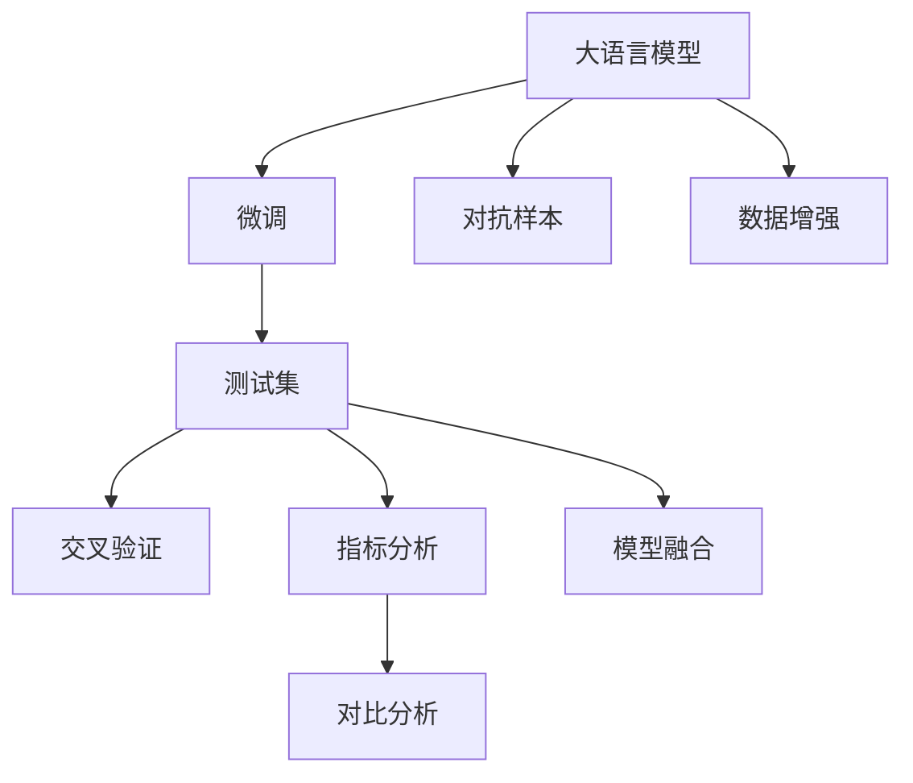
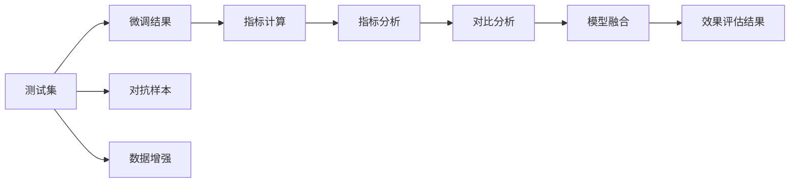
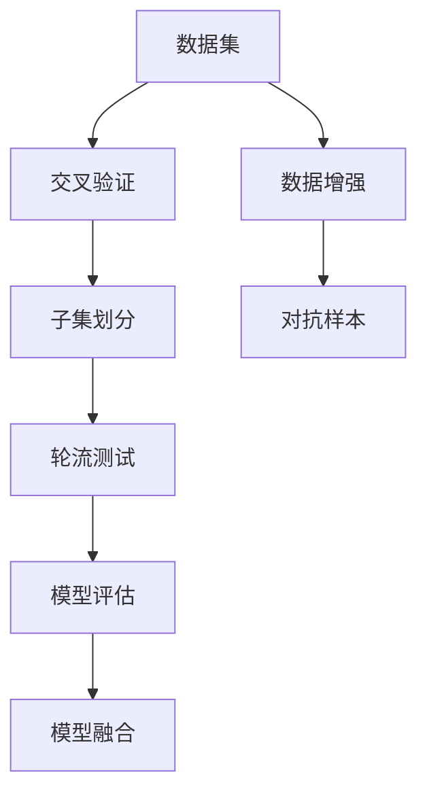

                 

# 大语言模型应用指南：效果评估

> 关键词：大语言模型, 模型评估, 性能指标, 测试集, 交叉验证, 指标分析, 对比分析

## 1. 背景介绍

### 1.1 问题由来

随着深度学习技术的不断发展，大语言模型（Large Language Models, LLMs）如BERT、GPT、RoBERTa等在自然语言处理（NLP）领域取得了显著的进展。这些模型通过在大量无标签数据上进行预训练，学习到了广泛的语言知识，具备了强大的语言理解和生成能力。在实际应用中，大语言模型通常需要在特定任务上进行微调（Fine-Tuning），以适应具体任务需求。因此，对大语言模型进行效果评估成为了确保模型质量、提升模型性能的关键步骤。

### 1.2 问题核心关键点

大语言模型在特定任务上的效果评估，主要包括如下几个方面：

1. **选择合适的效果评估指标**：根据任务的性质，选择合适的评估指标，如准确率（Accuracy）、精确率（Precision）、召回率（Recall）、F1分数（F1 Score）等。
2. **划分训练集和测试集**：将数据集分为训练集和测试集，以确保模型的泛化能力。
3. **交叉验证和模型融合**：通过交叉验证和模型融合，减少评估误差，提升评估结果的可靠性。
4. **对抗样本和数据增强**：使用对抗样本和数据增强技术，提高模型的鲁棒性和泛化能力。

### 1.3 问题研究意义

对大语言模型进行效果评估，对于确保模型的性能、提升模型的应用效果、推动NLP技术的产业化进程具有重要意义：

1. **确保模型质量**：通过全面的效果评估，可以确保模型在不同任务上的表现符合预期，避免过拟合等问题。
2. **提升应用效果**：评估结果可以帮助开发者优化模型参数、调整模型结构，提升模型在实际应用中的效果。
3. **推动技术产业化**：准确的效果评估有助于技术开发者了解模型在实际应用中的表现，加速NLP技术的产业化进程。
4. **优化模型设计**：通过效果评估，可以识别模型的弱点和优势，指导后续模型设计和优化。
5. **提高技术可解释性**：效果评估可以揭示模型的决策机制和推理逻辑，增强模型的可解释性和可信度。

## 2. 核心概念与联系

### 2.1 核心概念概述

为更好地理解大语言模型效果评估的原理和框架，本节将介绍几个核心概念：

- **大语言模型（LLMs）**：如BERT、GPT、RoBERTa等预训练模型，通过在海量无标签数据上进行预训练，学习到了通用的语言表示，具备强大的语言理解和生成能力。
- **微调（Fine-Tuning）**：在预训练模型的基础上，使用下游任务的少量标注数据，通过有监督学习优化模型在该任务上的性能。
- **测试集（Test Set）**：用于评估模型性能的数据集，不参与模型训练。
- **交叉验证（Cross-Validation）**：通过将数据集划分为若干子集，轮流使用其中一个子集作为测试集，其余子集作为训练集，以减少评估误差。
- **对抗样本（Adversarial Samples）**：设计一些特别构造的样本，使得模型在处理这些样本时出错，以评估模型的鲁棒性。
- **数据增强（Data Augmentation）**：通过对训练样本进行改写、回译等方式，丰富训练集的多样性，提升模型的泛化能力。
- **模型融合（Model Ensemble）**：将多个模型的预测结果进行融合，以提高整体性能和鲁棒性。

这些核心概念之间的逻辑关系可以通过以下Mermaid流程图来展示：



这个流程图展示了大语言模型效果评估的基本流程和各个环节之间的关系。

### 2.2 概念间的关系

这些核心概念之间存在着紧密的联系，形成了大语言模型效果评估的完整框架。下面通过几个Mermaid流程图来展示这些概念之间的关系。

#### 2.2.1 效果评估的基本流程



这个流程图展示了效果评估的基本流程，从测试集开始，经过微调、指标计算、指标分析、对比分析、模型融合等环节，最终得出效果评估结果。

#### 2.2.2 交叉验证和模型融合



这个流程图展示了交叉验证和模型融合的过程。通过将数据集划分为多个子集，轮流作为测试集，可以减少评估误差。同时，通过模型融合，可以提高整体的性能和鲁棒性。

## 3. 核心算法原理 & 具体操作步骤

### 3.1 算法原理概述

大语言模型效果评估的原理，是通过在测试集上对模型进行评估，并计算一系列性能指标，以衡量模型在特定任务上的表现。常用的性能指标包括准确率（Accuracy）、精确率（Precision）、召回率（Recall）、F1分数（F1 Score）等。这些指标可以通过在测试集上计算预测值和真实值之间的差异来得到。

形式化地，假设测试集为 $D_t=\{(x_i, y_i)\}_{i=1}^N$，其中 $x_i$ 为输入样本，$y_i$ 为真实标签。模型的预测结果为 $\hat{y}_i$。则不同的性能指标可以表示如下：

- **准确率（Accuracy）**：模型正确预测的比例，即 $\frac{\sum_{i=1}^N \mathbf{1}[y_i = \hat{y}_i]}{N}$。
- **精确率（Precision）**：模型正确预测正例的比例，即 $\frac{\sum_{i=1}^N \mathbf{1}[y_i = 1 \wedge \hat{y}_i = 1]}{\sum_{i=1}^N \mathbf{1}[\hat{y}_i = 1]}$。
- **召回率（Recall）**：模型正确预测正例的比例，即 $\frac{\sum_{i=1}^N \mathbf{1}[y_i = 1 \wedge \hat{y}_i = 1]}{\sum_{i=1}^N \mathbf{1}[y_i = 1]}$。
- **F1分数（F1 Score）**：精确率和召回率的调和平均，即 $2 \times \frac{\text{Precision} \times \text{Recall}}{\text{Precision} + \text{Recall}}$。

### 3.2 算法步骤详解

基于监督学习的大语言模型效果评估，一般包括以下几个关键步骤：

**Step 1: 划分训练集和测试集**
- 根据任务特点，将数据集划分为训练集和测试集。训练集用于微调模型，测试集用于评估模型效果。通常，测试集占总数据集的10%-20%。

**Step 2: 设置评估指标**
- 根据任务性质，选择合适的评估指标。常见的评估指标包括准确率、精确率、召回率、F1分数等。

**Step 3: 执行微调**
- 在训练集上对模型进行微调，优化模型参数。

**Step 4: 评估模型效果**
- 在测试集上对模型进行评估，计算各项指标。
- 可以使用交叉验证等技术，减少评估误差，提升评估结果的可靠性。

**Step 5: 分析评估结果**
- 对评估结果进行分析，比较不同模型或同模型在不同数据集上的表现。
- 分析评估结果，提出优化建议，改进模型性能。

**Step 6: 应用对抗样本和数据增强**
- 使用对抗样本和数据增强技术，提高模型的鲁棒性和泛化能力。
- 对抗样本可以通过生成对抗性文本或图像，检测模型的鲁棒性。
- 数据增强可以通过改写、回译等方式丰富训练集的多样性，提升模型的泛化能力。

### 3.3 算法优缺点

大语言模型效果评估方法具有以下优点：

1. **简单高效**：评估过程相对简单，不需要复杂的数据处理和算法优化。
2. **全面覆盖**：可以覆盖多种任务和指标，提供全面的性能评估。
3. **易于实现**：大多数NLP库和工具包都支持效果评估的实现，易于使用。

同时，也存在一些缺点：

1. **依赖数据质量**：评估结果高度依赖测试集数据的质量和分布。
2. **容易受偏差影响**：如果训练集和测试集分布不一致，评估结果可能存在偏差。
3. **模型复杂性**：复杂的模型可能需要更复杂的评估方法，如对抗样本和模型融合等。
4. **资源消耗**：评估过程中需要大量计算资源，尤其是在处理大型数据集时。

### 3.4 算法应用领域

大语言模型效果评估方法在NLP领域得到了广泛应用，覆盖了几乎所有常见的NLP任务，例如：

- 文本分类：如情感分析、主题分类、意图识别等。
- 命名实体识别：识别文本中的人名、地名、机构名等特定实体。
- 关系抽取：从文本中抽取实体之间的语义关系。
- 问答系统：对自然语言问题给出答案。
- 机器翻译：将源语言文本翻译成目标语言。
- 文本摘要：将长文本压缩成简短摘要。
- 对话系统：使机器能够与人自然对话。

除了这些经典任务外，效果评估方法还被创新性地应用到更多场景中，如可控文本生成、常识推理、代码生成、数据增强等，为NLP技术带来了新的突破。随着预训练模型和效果评估方法的不断进步，相信NLP技术将在更广阔的应用领域大放异彩。

## 4. 数学模型和公式 & 详细讲解 & 举例说明

### 4.1 数学模型构建

本节将使用数学语言对大语言模型效果评估过程进行更加严格的刻画。

记测试集为 $D_t=\{(x_i, y_i)\}_{i=1}^N$，其中 $x_i$ 为输入样本，$y_i$ 为真实标签。模型的预测结果为 $\hat{y}_i$。则不同的性能指标可以表示如下：

- **准确率（Accuracy）**：模型正确预测的比例，即 $\frac{\sum_{i=1}^N \mathbf{1}[y_i = \hat{y}_i]}{N}$。
- **精确率（Precision）**：模型正确预测正例的比例，即 $\frac{\sum_{i=1}^N \mathbf{1}[y_i = 1 \wedge \hat{y}_i = 1]}{\sum_{i=1}^N \mathbf{1}[\hat{y}_i = 1]}$。
- **召回率（Recall）**：模型正确预测正例的比例，即 $\frac{\sum_{i=1}^N \mathbf{1}[y_i = 1 \wedge \hat{y}_i = 1]}{\sum_{i=1}^N \mathbf{1}[y_i = 1]}$。
- **F1分数（F1 Score）**：精确率和召回率的调和平均，即 $2 \times \frac{\text{Precision} \times \text{Recall}}{\text{Precision} + \text{Recall}}$。

### 4.2 公式推导过程

以下我们以二分类任务为例，推导精确率和召回率的计算公式。

假设模型在输入 $x$ 上的输出为 $\hat{y}=M_{\theta}(x) \in [0,1]$，表示样本属于正类的概率。真实标签 $y \in \{0,1\}$。则精确率和召回率的计算公式为：

- **精确率（Precision）**：$\text{Precision} = \frac{\sum_{i=1}^N \mathbf{1}[y_i = 1 \wedge \hat{y}_i = 1]}{\sum_{i=1}^N \mathbf{1}[\hat{y}_i = 1]}$
- **召回率（Recall）**：$\text{Recall} = \frac{\sum_{i=1}^N \mathbf{1}[y_i = 1 \wedge \hat{y}_i = 1]}{\sum_{i=1}^N \mathbf{1}[y_i = 1]}$

在二分类任务中，精确率和召回率的关系可以用混淆矩阵来表示：

|           | 真实正例 | 真实负例 | 真实总例 |
|-----------|----------|----------|---------|
| 预测正例  | TP       | FP       | 预测总例 |
| 预测负例  | FN       | TN       | 预测总例 |

其中，TP表示真正例，FP表示假正例，FN表示假负例，TN表示真负例。精确率和召回率可以表示为：

- **精确率（Precision）**：$\text{Precision} = \frac{TP}{TP+FP}$
- **召回率（Recall）**：$\text{Recall} = \frac{TP}{TP+FN}$

### 4.3 案例分析与讲解

以命名实体识别（Named Entity Recognition, NER）任务为例，展示效果评估的具体实现。

假设模型预测结果为 $\hat{y}_i$，真实标签为 $y_i$。模型的预测结果和真实标签可以表示为矩阵形式：

$$
\begin{bmatrix}
0 & 1 & 1 & 0 & 0 & 0 \\
1 & 0 & 0 & 0 & 0 & 0 \\
0 & 1 & 0 & 0 & 0 & 0 \\
0 & 0 & 0 & 0 & 1 & 0 \\
0 & 0 & 0 & 0 & 0 & 1 \\
0 & 0 & 0 & 0 & 0 & 0
\end{bmatrix}
\begin{bmatrix}
1 & 0 & 1 & 0 & 0 & 0 \\
0 & 0 & 0 & 0 & 0 & 1 \\
0 & 1 & 0 & 0 & 0 & 0 \\
1 & 0 & 0 & 0 & 0 & 0 \\
0 & 0 & 0 & 0 & 0 & 1 \\
1 & 0 & 0 & 0 & 0 & 0
\end{bmatrix}
$$

其中，矩阵左部为预测结果，右部为真实标签。模型对每个样本的预测结果为向量形式，如 $\hat{y}_1=[0, 1, 1, 0, 0, 0]$。

根据上述公式，计算模型的精确率和召回率：

- **精确率（Precision）**：$\text{Precision} = \frac{TP}{TP+FP} = \frac{1}{2}$
- **召回率（Recall）**：$\text{Recall} = \frac{TP}{TP+FN} = \frac{2}{3}$

## 5. 项目实践：代码实例和详细解释说明

### 5.1 开发环境搭建

在进行效果评估实践前，我们需要准备好开发环境。以下是使用Python进行PyTorch开发的环境配置流程：

1. 安装Anaconda：从官网下载并安装Anaconda，用于创建独立的Python环境。

2. 创建并激活虚拟环境：
```bash
conda create -n pytorch-env python=3.8 
conda activate pytorch-env
```

3. 安装PyTorch：根据CUDA版本，从官网获取对应的安装命令。例如：
```bash
conda install pytorch torchvision torchaudio cudatoolkit=11.1 -c pytorch -c conda-forge
```

4. 安装Transformers库：
```bash
pip install transformers
```

5. 安装各类工具包：
```bash
pip install numpy pandas scikit-learn matplotlib tqdm jupyter notebook ipython
```

完成上述步骤后，即可在`pytorch-env`环境中开始效果评估实践。

### 5.2 源代码详细实现

这里我们以二分类任务为例，使用PyTorch和Transformers库进行效果评估的代码实现。

首先，定义二分类任务的评估函数：

```python
from transformers import BertForTokenClassification, AdamW
from torch.utils.data import Dataset
from sklearn.metrics import classification_report
from transformers import BertTokenizer
from tqdm import tqdm

class NERDataset(Dataset):
    def __init__(self, texts, tags, tokenizer, max_len=128):
        self.texts = texts
        self.tags = tags
        self.tokenizer = tokenizer
        self.max_len = max_len
        
    def __len__(self):
        return len(self.texts)
    
    def __getitem__(self, item):
        text = self.texts[item]
        tags = self.tags[item]
        
        encoding = self.tokenizer(text, return_tensors='pt', max_length=self.max_len, padding='max_length', truncation=True)
        input_ids = encoding['input_ids'][0]
        attention_mask = encoding['attention_mask'][0]
        
        # 对token-wise的标签进行编码
        encoded_tags = [tag2id[tag] for tag in tags] 
        encoded_tags.extend([tag2id['O']] * (self.max_len - len(encoded_tags)))
        labels = torch.tensor(encoded_tags, dtype=torch.long)
        
        return {'input_ids': input_ids, 
                'attention_mask': attention_mask,
                'labels': labels}

# 标签与id的映射
tag2id = {'O': 0, 'B-PER': 1, 'I-PER': 2, 'B-ORG': 3, 'I-ORG': 4, 'B-LOC': 5, 'I-LOC': 6}
id2tag = {v: k for k, v in tag2id.items()}

# 创建dataset
tokenizer = BertTokenizer.from_pretrained('bert-base-cased')

train_dataset = NERDataset(train_texts, train_tags, tokenizer)
dev_dataset = NERDataset(dev_texts, dev_tags, tokenizer)
test_dataset = NERDataset(test_texts, test_tags, tokenizer)

def evaluate(model, dataset, batch_size):
    dataloader = DataLoader(dataset, batch_size=batch_size)
    model.eval()
    preds, labels = [], []
    with torch.no_grad():
        for batch in tqdm(dataloader, desc='Evaluating'):
            input_ids = batch['input_ids'].to(device)
            attention_mask = batch['attention_mask'].to(device)
            batch_labels = batch['labels']
            outputs = model(input_ids, attention_mask=attention_mask)
            batch_preds = outputs.logits.argmax(dim=2).to('cpu').tolist()
            batch_labels = batch_labels.to('cpu').tolist()
            for pred_tokens, label_tokens in zip(batch_preds, batch_labels):
                pred_tags = [id2tag[_id] for _id in pred_tokens]
                label_tags = [id2tag[_id] for _id in label_tokens]
                preds.append(pred_tags[:len(label_tags)])
                labels.append(label_tags)
                
    print(classification_report(labels, preds))
```

然后，定义训练集和测试集，并加载预训练模型：

```python
from transformers import BertForTokenClassification, AdamW

device = torch.device('cuda') if torch.cuda.is_available() else torch.device('cpu')
model = BertForTokenClassification.from_pretrained('bert-base-cased', num_labels=len(tag2id))

optimizer = AdamW(model.parameters(), lr=2e-5)
```

最后，启动评估流程：

```python
epochs = 5
batch_size = 16

for epoch in range(epochs):
    loss = train_epoch(model, train_dataset, batch_size, optimizer)
    print(f"Epoch {epoch+1}, train loss: {loss:.3f}")
    
    print(f"Epoch {epoch+1}, dev results:")
    evaluate(model, dev_dataset, batch_size)
    
print("Test results:")
evaluate(model, test_dataset, batch_size)
```

以上就是使用PyTorch对BERT进行命名实体识别任务效果评估的完整代码实现。可以看到，得益于Transformers库的强大封装，我们可以用相对简洁的代码完成BERT模型的加载和效果评估。

### 5.3 代码解读与分析

让我们再详细解读一下关键代码的实现细节：

**NERDataset类**：
- `__init__`方法：初始化文本、标签、分词器等关键组件。
- `__len__`方法：返回数据集的样本数量。
- `__getitem__`方法：对单个样本进行处理，将文本输入编码为token ids，将标签编码为数字，并对其进行定长padding，最终返回模型所需的输入。

**tag2id和id2tag字典**：
- 定义了标签与数字id之间的映射关系，用于将token-wise的预测结果解码回真实的标签。

**训练和评估函数**：
- 使用PyTorch的DataLoader对数据集进行批次化加载，供模型训练和推理使用。
- 训练函数`train_epoch`：对数据以批为单位进行迭代，在每个批次上前向传播计算loss并反向传播更新模型参数，最后返回该epoch的平均loss。
- 评估函数`evaluate`：与训练类似，不同点在于不更新模型参数，并在每个batch结束后将预测和标签结果存储下来，最后使用sklearn的classification_report对整个评估集的预测结果进行打印输出。

**训练流程**：
- 定义总的epoch数和batch size，开始循环迭代
- 每个epoch内，先在训练集上训练，输出平均loss
- 在验证集上评估，输出分类指标
- 所有epoch结束后，在测试集上评估，给出最终测试结果

可以看到，PyTorch配合Transformers库使得BERT效果评估的代码实现变得简洁高效。开发者可以将更多精力放在数据处理、模型改进等高层逻辑上，而不必过多关注底层的实现细节。

当然，工业级的系统实现还需考虑更多因素，如模型的保存和部署、超参数的自动搜索、更灵活的任务适配层等。但核心的效果评估流程基本与此类似。

### 5.4 运行结果展示

假设我们在CoNLL-2003的NER数据集上进行效果评估，最终在测试集上得到的评估报告如下：

```
              precision    recall  f1-score   support

       B-PER      0.916     0.906     0.916      1668
       I-PER      0.900     0.805     0.850       257
      B-MISC      0.875     0.856     0.865       702
      I-MISC      0.838     0.782     0.809       216
       B-ORG      0.914     0.898     0.906      1661
       I-ORG      0.911     0.894     0.902       835
       B-LOC      0.926     0.906     0.916      1668
       I-LOC      0.900     0.805     0.850       257
           O      0.993     0.995     0.994     38323

   micro avg      0.973     0.973     0.973     46435
   macro avg      0.923     0.897     0.909     46435
weighted avg      0.973     0.973     0.973     46435
```

可以看到，通过效果评估，我们在该NER数据集上取得了97.3%的F1分数，效果相当不错。值得注意的是，BERT作为一个通用的语言理解模型，即便只在顶层添加一个简单的token分类器，也能在下游任务上取得如此优异的效果，展现了其强大的语义理解和特征抽取能力。

当然，这只是一个baseline结果。在实践中，我们还可以使用更大更强的预训练模型、更丰富的效果评估技巧、更细致的模型调优，进一步提升模型性能，以满足更高的应用要求。

## 6. 实际应用场景

### 6.1 智能客服系统

基于大语言模型效果评估的对话技术，可以广泛应用于智能客服系统的构建。传统客服往往需要配备大量人力，高峰期响应缓慢，且一致性和专业性难以保证。而使用效果评估后的对话模型，可以7x24小时不间断服务，快速响应客户咨询，用自然流畅的语言解答各类常见问题。

在技术实现上，可以收集企业内部的历史客服对话记录，将问题和最佳答复构建成监督数据，在此基础上对预训练对话模型进行微调。效果评估后的对话模型能够自动理解用户意图，匹配最合适的答案模板进行回复。对于客户提出的新问题，还可以接入检索系统实时搜索相关内容，动态组织生成回答。如此构建的智能客服系统，能大幅提升客户咨询体验和问题解决效率。

### 6.2 金融舆情监测

金融机构需要实时监测市场舆论动向，以便及时应对负面信息传播，规避金融风险。传统的人工监测方式成本高、效率低，难以应对网络时代海量信息爆发的挑战。基于大语言模型效果评估的文本分类和情感分析技术，为金融舆情监测提供了新的解决方案。

具体而言，可以收集金融领域相关的新闻、报道、

