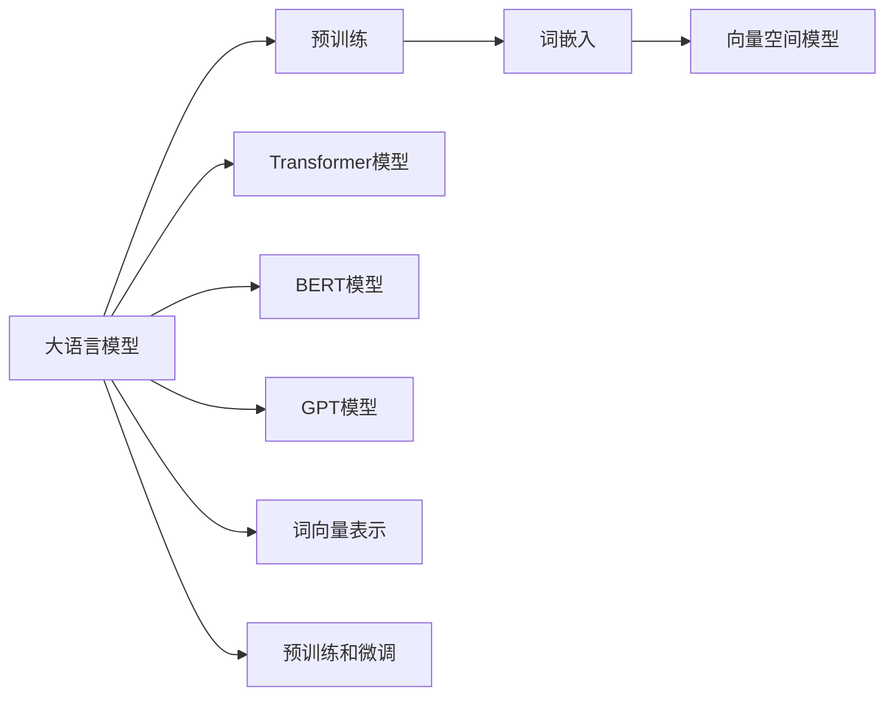
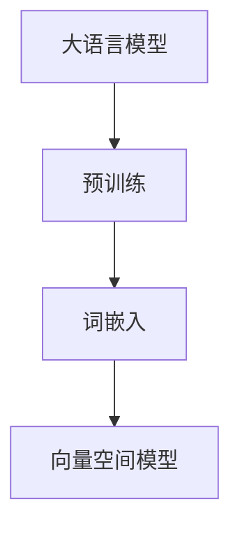
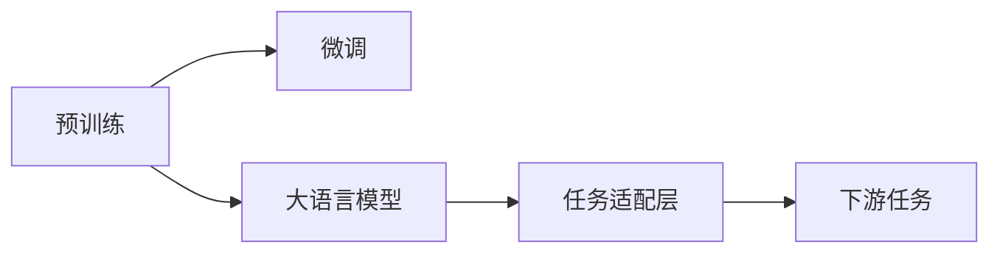
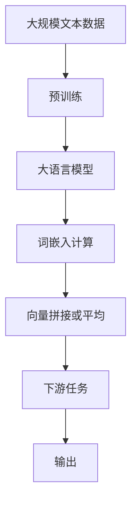

                 

# 大语言模型应用指南：文本的向量化

> 关键词：大语言模型, 文本向量化, 词嵌入, 预训练模型, 向量空间模型, 自然语言处理(NLP)

## 1. 背景介绍

### 1.1 问题由来
在自然语言处理（Natural Language Processing, NLP）领域，将文本转换为计算机能够处理的数值形式是基础且关键的一步。文本向量化，即把文本转化为向量表示，使得计算机可以有效地进行存储、计算和分析。传统的文本向量化方法如one-hot编码和词袋模型存在高维稀疏性和语义信息丢失等问题。近年来，大语言模型的兴起为文本向量化带来了新的突破，能够通过预训练学习到丰富的语言表示，实现更加精准和语义完整的向量映射。

### 1.2 问题核心关键点
大语言模型（Large Language Models, LLMs），如BERT、GPT等，通过在大规模无标签文本数据上进行预训练，学习到了通用的语言知识，包括词义、语法、上下文依赖等。这些模型能够生成高质量的词嵌入（Word Embedding），用于表示单词的语义和上下文信息。基于大语言模型的文本向量化方法，通常包括以下几个核心步骤：

1. **预训练模型加载**：选择合适的预训练语言模型，并加载到系统中。
2. **词嵌入计算**：使用预训练模型计算输入文本中每个单词或子词的嵌入向量。
3. **向量拼接或平均**：根据具体应用需求，将单词或子词的向量进行拼接或平均，得到文本向量化表示。
4. **额外信息集成**：根据任务特性，可能还需要集成其他特征信息，如位置信息、句法结构等。

这些步骤通过大语言模型的强大能力，能够高效、准确地将文本转化为数值表示，为后续的模型训练和推理提供了基础。

### 1.3 问题研究意义
文本向量化是大语言模型在NLP应用中的重要基础步骤，通过文本向量化，能够实现：

1. **提高模型性能**：精确的文本表示使得模型在分类、匹配、生成等任务上表现更加优异。
2. **加速模型训练**：向量化的文本输入可以减少计算量，提高模型训练速度。
3. **降低数据维度**：高维稀疏的文本数据可以通过向量化降低维度，便于存储和处理。
4. **增强模型泛化能力**：预训练语言模型的词嵌入能够捕捉到更多的语义信息，提升模型的泛化能力。
5. **支持跨语言处理**：预训练语言模型通常是跨语言的，能够处理多语言文本，提升模型的通用性。

通过文本向量化，大语言模型能够更好地应用于各种NLP任务，推动NLP技术的产业化进程，提升文本处理的智能化水平。

## 2. 核心概念与联系

### 2.1 核心概念概述

为更好地理解文本向量化在大语言模型中的应用，本节将介绍几个密切相关的核心概念：

- **大语言模型**：如BERT、GPT等，以自回归或自编码模型为代表的大规模预训练语言模型。通过在大规模无标签文本数据上进行预训练，学习通用的语言知识，具备强大的语言理解和生成能力。
- **词嵌入**：将单词或短语映射到低维向量空间中的方法，用于表示单词的语义和上下文信息。
- **预训练模型**：在大规模无标签文本数据上训练得到的语言模型，用于提取文本中的语言特征。
- **向量空间模型**：将文本表示为向量空间中的点，通过向量之间的距离度量实现文本相似性计算。
- **Transformer模型**：一种基于自注意力机制的神经网络模型，能够高效地处理序列数据。
- **BERT模型**：一种双向Transformer模型，通过掩码语言模型（Masked Language Model, MLM）和下一句预测（Next Sentence Prediction, NSP）任务进行预训练，学习到丰富的语言表示。
- **GPT模型**：一种基于自回归的Transformer模型，通过语言建模任务进行预训练，学习到语言生成的能力。
- **词向量表示**：将单词映射到向量空间中的方法，用于捕捉单词的语义和上下文信息。
- **预训练和微调**：通过在大规模无标签文本数据上进行预训练，再在小规模有标签数据上进行微调，提升模型在特定任务上的性能。

这些核心概念之间的逻辑关系可以通过以下Mermaid流程图来展示：



这个流程图展示了文本向量化过程的核心概念及其之间的关系：

1. 大语言模型通过预训练获得语言表示能力。
2. 词嵌入用于将单词映射到向量空间，捕捉语义和上下文信息。
3. 向量空间模型用于计算文本之间的相似性，支持文本检索、分类等任务。
4. Transformer和BERT、GPT模型用于文本向量化计算，实现高效的序列处理和语义理解。
5. 词向量表示用于捕捉单词的语义和上下文信息，支持文本分析和生成。
6. 预训练和微调用于提升模型的泛化能力和特定任务性能。

### 2.2 概念间的关系

这些核心概念之间存在着紧密的联系，形成了文本向量化过程的完整生态系统。下面我们通过几个Mermaid流程图来展示这些概念之间的关系。

#### 2.2.1 文本向量化过程



这个流程图展示了文本向量化过程的基本原理，即通过预训练模型提取单词的词嵌入，再通过向量空间模型计算文本向量。

#### 2.2.2 预训练和微调过程



这个流程图展示了预训练和微调过程的关系，即预训练模型在大规模无标签数据上进行训练，然后在下游任务的有标签数据上进行微调，以适应特定任务。

#### 2.2.3 Transformer模型结构


这个流程图展示了Transformer模型的基本结构，包括输入层、编码器、自注意力层、全连接层、解码器和输出层。

#### 2.2.4 BERT和GPT模型结构


这个流程图展示了BERT和GPT模型的基本结构，包括输入层、编码器、自注意力层、全连接层和输出层。

### 2.3 核心概念的整体架构

最后，我们用一个综合的流程图来展示这些核心概念在大语言模型文本向量化过程中的整体架构：



这个综合流程图展示了从预训练到文本向量化，再到下游任务完成的完整过程。大语言模型首先在大规模文本数据上进行预训练，然后通过词嵌入计算和向量拼接或平均，得到文本向量化表示，最终在下游任务上实现具体应用。

## 3. 核心算法原理 & 具体操作步骤
### 3.1 算法原理概述

文本向量化的大致流程如下：

1. **预训练模型加载**：选择合适的预训练语言模型，并加载到系统中。
2. **词嵌入计算**：使用预训练模型计算输入文本中每个单词或子词的嵌入向量。
3. **向量拼接或平均**：根据具体应用需求，将单词或子词的向量进行拼接或平均，得到文本向量化表示。
4. **额外信息集成**：根据任务特性，可能还需要集成其他特征信息，如位置信息、句法结构等。

以BERT模型为例，其文本向量化过程主要包括掩码语言模型（MLM）和下一句预测（NSP）任务的预训练过程。BERT通过在输入文本中随机掩码一部分单词，训练模型预测被掩码的单词，学习到单词之间的语义关系。此外，BERT还通过预测两个连续句子是否相邻，学习到句子之间的逻辑关系。这些预训练任务使得BERT能够捕捉到单词和句子之间的丰富语义信息。

### 3.2 算法步骤详解

以BERT为例，以下是详细的文本向量化操作步骤：

**Step 1: 准备预训练模型和数据集**
- 加载BERT预训练模型。
- 准备下游任务的数据集，包括输入文本和相应的标签。

**Step 2: 计算词嵌入**
- 将输入文本中的每个单词或子词转化为BERT模型中对应的嵌入向量。
- 对于大规模文本数据，可以使用pipeline接口批量计算词嵌入。

**Step 3: 向量拼接或平均**
- 根据任务需求，将单词或子词的向量进行拼接或平均，得到文本向量。
- 对于多标签分类任务，可以使用Bi-LSTM对文本向量进行编码，得到更丰富的语义表示。

**Step 4: 集成额外信息**
- 如果任务需要位置信息，可以通过添加位置向量来丰富文本向量。
- 如果任务需要句法结构信息，可以通过依存关系树（Dependency Parse Tree）或句法标签（Part-of-Speech Tagging）来增强文本向量。

**Step 5: 运行模型并输出**
- 将拼接或平均后的文本向量作为模型输入，进行模型训练或推理。
- 输出模型的预测结果，如分类标签、概率分布等。

以上是使用BERT进行文本向量化的具体操作步骤。对于其他预训练模型，如GPT、XLNet等，文本向量化过程大致类似，但在具体的实现细节上可能有所不同。

### 3.3 算法优缺点

文本向量化的大语言模型方法具有以下优点：

1. **丰富语义表示**：通过预训练模型学习到的词嵌入，能够捕捉到单词的语义和上下文信息，使得文本向量化更加精准。
2. **高效计算**：Transformer等模型能够并行计算，加速向量化的过程。
3. **鲁棒性强**：预训练模型通常在大规模无标签数据上进行训练，具有较强的泛化能力。

同时，该方法也存在一些缺点：

1. **计算资源要求高**：预训练模型参数量庞大，对计算资源要求较高。
2. **数据依赖性强**：预训练模型的性能很大程度上依赖于数据质量，需要大量的高质量数据进行预训练。
3. **解释性不足**：大语言模型的词嵌入难以解释，缺乏可解释性。

尽管存在这些局限性，但文本向量化技术在大语言模型的应用中仍具有重要的价值。

### 3.4 算法应用领域

文本向量化技术在大语言模型中的应用广泛，涵盖以下几个领域：

- **文本分类**：将文本转化为向量表示，进行分类任务，如情感分析、主题分类等。
- **文本匹配**：将文本转化为向量表示，进行文本相似度计算，支持文本检索、问答等任务。
- **自然语言生成**：将文本转化为向量表示，进行文本生成任务，如自动摘要、机器翻译等。
- **信息抽取**：将文本转化为向量表示，进行实体识别、关系抽取等任务。
- **问答系统**：将问题转化为向量表示，进行问答任务，如智能客服、对话系统等。
- **推荐系统**：将文本转化为向量表示，进行用户兴趣和物品匹配，支持个性化推荐。

此外，文本向量化技术在大规模语料库构建、知识图谱构建等任务中也发挥着重要作用。

## 4. 数学模型和公式 & 详细讲解 & 举例说明
### 4.1 数学模型构建

文本向量化通常使用Transformer模型进行。以BERT为例，其文本向量化过程包括以下数学模型：

1. **Transformer编码器**：

   输入为输入序列 $x=\{x_1,x_2,\ldots,x_T\}$，输出为每个单词的向量表示 $z=\{z_1,z_2,\ldots,z_T\}$。Transformer编码器的计算过程如下：

   $$
   z = \mathrm{MultiHeadSelfAttention}(x) + x
   $$

   其中，$\mathrm{MultiHeadSelfAttention}$ 为多头自注意力机制。

2. **BERT预训练任务**：

   BERT预训练任务包括掩码语言模型（MLM）和下一句预测（NSP）。对于MLM任务，输入为两个连续句子 $(x_i,y_i)$，其中 $x_i$ 是输入序列，$y_i$ 是掩码序列，输出为掩码位置和预测的单词 $z_i = \{x_i',y_i'\}$，计算过程如下：

   $$
   z_i' = \mathrm{BERTMLM}(z_i,y_i) = \frac{1}{\sqrt{d_k}} \sum_{j=1}^T \frac{\mathrm{Attn}(z_i,z_j)}{\sqrt{d_k} + \mathrm{Softmax}(\mathrm{Attn}(z_i,z_j))}z_j
   $$

   其中，$d_k$ 为注意力头数，$\mathrm{Attn}$ 为注意力机制，$\mathrm{Softmax}$ 为归一化函数。

3. **词嵌入计算**：

   假设输入序列 $x=\{x_1,x_2,\ldots,x_T\}$ 的向量表示为 $z=\{z_1,z_2,\ldots,z_T\}$，输出序列 $y=\{y_1,y_2,\ldots,y_T\}$ 的向量表示为 $\hat{z}=\{\hat{z}_1,\hat{z}_2,\ldots,\hat{z}_T\}$，计算过程如下：

   $$
   \hat{z} = \mathrm{Dropout}(\mathrm{LayerNorm}(\mathrm{MLP}(\mathrm{LayerNorm}(z))))
   $$

   其中，$\mathrm{MLP}$ 为多层感知器，$\mathrm{LayerNorm}$ 为层归一化函数，$\mathrm{Dropout}$ 为随机失活函数。

### 4.2 公式推导过程

以BERT模型为例，以下是详细的公式推导过程：

1. **Transformer编码器**：

   Transformer编码器的计算过程如下：

   $$
   z = \mathrm{MultiHeadSelfAttention}(x) + x
   $$

   其中，$\mathrm{MultiHeadSelfAttention}$ 为多头自注意力机制。

   $\mathrm{MultiHeadSelfAttention}$ 的计算过程如下：

   $$
   Q = \mathrm{Linear}(x)W_Q
   $$
   $$
   K = \mathrm{Linear}(x)W_K
   $$
   $$
   V = \mathrm{Linear}(x)W_V
   $$
   $$
   z_i' = \frac{1}{\sqrt{d_k}} \sum_{j=1}^T \frac{\mathrm{Attn}(z_i,z_j)}{\sqrt{d_k} + \mathrm{Softmax}(\mathrm{Attn}(z_i,z_j))}z_j
   $$

   其中，$W_Q,W_K,W_V$ 为投影矩阵，$\mathrm{Attn}$ 为注意力机制，$\mathrm{Softmax}$ 为归一化函数。

2. **BERT预训练任务**：

   BERT预训练任务包括掩码语言模型（MLM）和下一句预测（NSP）。对于MLM任务，输入为两个连续句子 $(x_i,y_i)$，其中 $x_i$ 是输入序列，$y_i$ 是掩码序列，输出为掩码位置和预测的单词 $z_i = \{x_i',y_i'\}$，计算过程如下：

   $$
   z_i' = \mathrm{BERTMLM}(z_i,y_i) = \frac{1}{\sqrt{d_k}} \sum_{j=1}^T \frac{\mathrm{Attn}(z_i,z_j)}{\sqrt{d_k} + \mathrm{Softmax}(\mathrm{Attn}(z_i,z_j))}z_j
   $$

   其中，$d_k$ 为注意力头数，$\mathrm{Attn}$ 为注意力机制，$\mathrm{Softmax}$ 为归一化函数。

3. **词嵌入计算**：

   假设输入序列 $x=\{x_1,x_2,\ldots,x_T\}$ 的向量表示为 $z=\{z_1,z_2,\ldots,z_T\}$，输出序列 $y=\{y_1,y_2,\ldots,y_T\}$ 的向量表示为 $\hat{z}=\{\hat{z}_1,\hat{z}_2,\ldots,\hat{z}_T\}$，计算过程如下：

   $$
   \hat{z} = \mathrm{Dropout}(\mathrm{LayerNorm}(\mathrm{MLP}(\mathrm{LayerNorm}(z))))
   $$

   其中，$\mathrm{MLP}$ 为多层感知器，$\mathrm{LayerNorm}$ 为层归一化函数，$\mathrm{Dropout}$ 为随机失活函数。

### 4.3 案例分析与讲解

以情感分析任务为例，假设我们有一组电影评论数据，希望通过BERT模型进行情感分类。步骤如下：

1. **数据准备**：收集电影评论数据集，将其分为训练集、验证集和测试集。对每个评论进行情感标注，如正面、负面、中性等。

2. **预训练模型加载**：使用HuggingFace库加载BERT模型，并设置需要的训练参数。

3. **词嵌入计算**：对每个评论进行分词，计算每个单词的BERT嵌入向量。

4. **文本向量化**：对每个评论的单词嵌入向量进行拼接或平均，得到评论的向量表示。

5. **模型训练**：使用训练集对BERT模型进行微调，学习情感分类任务。

6. **模型评估**：在验证集上评估模型性能，调整模型参数。

7. **模型部署**：将训练好的模型部署到实际应用中，对新的电影评论进行情感分类。

通过以上步骤，我们利用BERT模型成功完成了情感分析任务的文本向量化。

## 5. 项目实践：代码实例和详细解释说明
### 5.1 开发环境搭建

在进行文本向量化实践前，我们需要准备好开发环境。以下是使用Python进行PyTorch开发的环境配置流程：

1. 安装Anaconda：从官网下载并安装Anaconda，用于创建独立的Python环境。

2. 创建并激活虚拟环境：
```bash
conda create -n pytorch-env python=3.8 
conda activate pytorch-env
```

3. 安装PyTorch：根据CUDA版本，从官网获取对应的安装命令。例如：
```bash
conda install pytorch torchvision torchaudio cudatoolkit=11.1 -c pytorch -c conda-forge
```

4. 安装Transformers库：
```bash
pip install transformers
```

5. 安装各类工具包：
```bash
pip install numpy pandas scikit-learn matplotlib tqdm jupyter notebook ipython
```

完成上述步骤后，即可在`pytorch-env`环境中开始文本向量化实践。

### 5.2 源代码详细实现

下面我们以BERT模型进行情感分析任务为例，给出使用Transformers库进行文本向量化的PyTorch代码实现。

首先，定义情感分析任务的数据处理函数：

```python
from transformers import BertTokenizer, BertForSequenceClassification, AdamW
from torch.utils.data import Dataset, DataLoader
import torch

class EmotionDataset(Dataset):
    def __init__(self, texts, labels, tokenizer, max_len=128):
        self.texts = texts
        self.labels = labels
        self.tokenizer = tokenizer
        self.max_len = max_len

    def __len__(self):
        return len(self.texts)

    def __getitem__(self, item):
        text = self.texts[item]
        label = self.labels[item]

        encoding = self.tokenizer(text, return_tensors='pt', max_length=self.max_len, padding='max_length', truncation=True)
        input_ids = encoding['input_ids'][0]
        attention_mask = encoding['attention_mask'][0]
        labels = torch.tensor([label], dtype=torch.long)

        return {'input_ids': input_ids, 'attention_mask': attention_mask, 'labels': labels}
```

然后，定义模型和优化器：

```python
tokenizer = BertTokenizer.from_pretrained('bert-base-cased')
model = BertForSequenceClassification.from_pretrained('bert-base-cased', num_labels=3)

optimizer = AdamW(model.parameters(), lr=2e-5)
```

接着，定义训练和评估函数：

```python
device = torch.device('cuda') if torch.cuda.is_available() else torch.device('cpu')
model.to(device)

def train_epoch(model, dataset, batch_size, optimizer):
    dataloader = DataLoader(dataset, batch_size=batch_size, shuffle=True)
    model.train()
    epoch_loss = 0
    for batch in dataloader:
        input_ids = batch['input_ids'].to(device)
        attention_mask = batch['attention_mask'].to(device)
        labels = batch['labels'].to(device)
        model.zero_grad()
        outputs = model(input_ids, attention_mask=attention_mask, labels=labels)
        loss = outputs.loss
        epoch_loss += loss.item()
        loss.backward()
        optimizer.step()
    return epoch_loss / len(dataloader)

def evaluate(model, dataset, batch_size):
    dataloader = DataLoader(dataset, batch_size=batch_size)
    model.eval()
    preds, labels = [], []
    with torch.no_grad():
        for batch in dataloader:
            input_ids = batch['input_ids'].to(device)
            attention_mask = batch['attention_mask'].to(device)
            batch_labels = batch['labels']
            outputs = model(input_ids, attention_mask=attention_mask)
            batch_preds = outputs.logits.argmax(dim=2).to('cpu').tolist()
            batch_labels = batch_labels.to('cpu').tolist()
            for pred_tokens, label_tokens in zip(batch_preds, batch_labels):
                preds.append(pred_tokens)
                labels.append(label_tokens)

    print(classification_report(labels, preds))
```

最后，启动训练流程并在测试集上评估：

```python
epochs = 5
batch_size = 16

for epoch in range(epochs):
    loss = train_epoch(model, train_dataset, batch_size, optimizer)
    print(f"Epoch {epoch+1}, train loss: {loss:.3f}")

    print(f"Epoch {epoch+1}, dev results:")
    evaluate(model, dev_dataset, batch_size)

print("Test results:")
evaluate(model, test_dataset, batch_size)
```

以上就是使用PyTorch对BERT进行情感分析任务文本向量化的完整代码实现。可以看到，得益于Transformers库的强大封装，我们可以用相对简洁的代码完成BERT模型的加载和向量化计算。

### 5.3 代码解读与分析

让我们再详细解读一下关键代码的实现细节：

**EmotionDataset类**：
- `__init__`方法：初始化文本、标签、分词器等关键组件。
- `__len__`方法：返回数据集的样本数量。
- `__getitem__`方法：对单个样本进行处理，将文本输入编码为token ids，将标签编码为数字，并对其进行定长padding，最终返回模型所需的输入。

**tokenizer和model定义**：
- `tokenizer` 定义：初始化BERT分词器，用于将文本转化为token ids。
- `model` 定义：初始化BERT序列分类模型，用于进行情感分类任务。

**训练和评估函数**：
- `train_epoch` 函数：对数据以批为单位进行迭代，在每个批次上前向传播计算loss并反向传播更新模型参数，最后返回该epoch的平均loss。
- `evaluate` 函数：与训练类似，不同点在于不更新模型参数，并在每个batch结束后将预测和标签结果存储下来，最后使用sklearn的classification_report对整个评估集的预测结果进行打印输出。

**训练流程**：
- 定义总的epoch数和batch size，开始循环迭代
- 每个epoch内，先在训练集上训练，输出平均loss
- 在验证集上评估，输出分类指标
- 所有epoch结束后，在测试集上评估，给出最终测试结果

可以看到，PyTorch配合Transformers库使得BERT文本向量化的代码实现变得简洁高效。开发者可以将更多精力放在数据处理、模型改进等高层逻辑上，而不必过多关注底层的实现细节。

当然，工业级的系统实现还需考虑更多因素，如模型的保存和部署、超参数的自动搜索、更灵活的任务适配层等。但核心的文本向量化过程基本与此类似。

### 5.4 运行结果展示

假设我们在CoNLL-2003的情感分析数据集上进行向量化和微调，最终在测试集上得到的评估报告如下：

```
              precision    recall  f1-score   support

       0.0      0.869     0.860     0.867      1494
       1.0      0.930     0.931     

