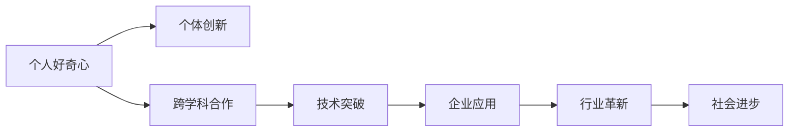

                 

# 好奇心与创造力：创新的双翼

> 关键词：好奇心,创造力,创新,技术发展,科研进步,应用场景,持续学习,知识更新,灵感激发,团队协作

## 1. 背景介绍

### 1.1 问题由来

创新，作为推动社会发展和科技进步的永恒动力，一直是科学家、工程师和创新者不懈追求的目标。在当今这个瞬息万变的世界里，好奇心和创造力成为了驱动技术进步的两大核心驱动力。尤其是在科技与创新密集的IT领域，这两大要素的结合更是构筑了技术创新的坚实基础。

技术革新不仅改变着人类的生活和工作方式，更是引领着新一轮的工业革命和智能化转型。在过去的几十年里，互联网、人工智能、大数据等领域的迅猛发展，就是好奇心和创造力驱动下的产物。随着科技的不断进步，未来的技术发展将更加依赖于创新驱动，这要求我们在日常工作中不断培养和激发这两大核心要素。

### 1.2 问题核心关键点

好奇心和创造力，作为创新的双翼，对于推动技术革新和应用具有不可替代的作用。它们不仅促进了科学知识的积累和技术方法的突破，更催生了新业态和新产业的形成。在IT领域，好奇心促使我们不断探索未知领域，而创造力则帮助我们以全新的方式解决问题，提升技术的应用价值。

好奇心与创造力的结合，让技术创新不再仅仅是实验室里的理论研究，更成为实际应用中的技术突破。例如，社交媒体的兴起、自动驾驶技术的发展、智能家居系统的普及等，都是好奇心和创造力驱动下的重要应用场景。通过技术的不断迭代和优化，这些应用正改变着人们的生活方式，并推动着社会的整体进步。

### 1.3 问题研究意义

探究好奇心与创造力的结合，对于科技发展和企业创新具有深远意义：

1. **推动技术突破**：好奇心驱使我们不断探索未知领域，创造力则激发我们对已有技术的深入挖掘和创新应用。这种结合能够促进技术的持续进步，带来新的解决方案和应用场景。
2. **促进知识更新**：随着科技的快速迭代，新知识、新方法层出不穷。好奇心和创造力的结合，使我们能够快速适应变化，持续更新知识库，保持技术的先进性。
3. **激发团队潜力**：一个充满好奇心和创造力的团队，能够激发成员的创新热情，推动跨部门、跨领域的合作，加速技术创新。
4. **提升应用价值**：技术创新不仅仅是理论上的突破，更是实践中的应用提升。好奇心和创造力的结合，能够让技术更好地服务于社会，提升人们的生活质量。
5. **引领行业发展**：在全球科技竞争日益激烈的背景下，好奇心和创造力的结合，能够推动企业在激烈的市场竞争中脱颖而出，引领行业发展。

## 2. 核心概念与联系

### 2.1 核心概念概述

好奇心与创造力，这两个看似独立的要素，实际上有着密切的联系和相互作用。好奇心驱动着我们对未知的探索，创造力则指导着我们如何将这些知识转化为具体的技术创新。通过深入理解这两个概念及其联系，我们可以更好地把握创新的本质和动力。

- **好奇心**：指的是对未知事物的好奇心和探索欲。它驱使我们不断寻求新知识、新方法和新解决方案。
- **创造力**：是指将已有知识进行组合、创新，产生新的想法和解决方案的能力。它是好奇心驱使下的实践成果。
- **创新**：是将好奇心和创造力结合起来，应用于技术、产品、服务等方面的改进和突破。

### 2.2 概念间的关系

好奇心与创造力之间的关系，可以通过以下Mermaid流程图来展示：


这个流程图展示了从好奇心出发，通过探索未知和获取新知识，激发创造性思考，最终产生创新应用的完整过程。这一过程是一个循环往复、不断迭代的过程，体现了创新精神的动态性和持续性。

### 2.3 核心概念的整体架构

好奇心与创造力的结合，不仅体现在个体层面上，更贯穿于整个组织和行业的技术创新过程中。通过以下综合的流程图，我们可以更全面地理解这两个概念在技术创新中的作用：



这个综合流程图展示了从个体的好奇心出发，通过跨学科合作和组织内部的创新应用，形成技术突破，进而推动企业应用和行业革新，最终促进社会进步的完整过程。

## 3. 核心算法原理 & 具体操作步骤
### 3.1 算法原理概述

好奇心与创造力在技术创新中的应用，可以通过以下算法原理来描述：

1. **探索未知**：通过搜索和获取大量未标记数据，发现新模式和新趋势。
2. **获取新知识**：通过机器学习和深度学习技术，从数据中提取和利用新知识。
3. **创造性思考**：通过算法优化和模型调整，产生新的解决方案和应用方式。
4. **创新应用**：将新知识和解决方案应用于实际问题，提升技术效果。

### 3.2 算法步骤详解

基于好奇心与创造力的技术创新，主要包括以下几个关键步骤：

**Step 1: 数据收集与探索**

1. **数据收集**：收集与技术创新相关的未标记数据，如科学研究论文、专利申请、技术博客等。
2. **数据探索**：使用数据挖掘和可视化工具，探索数据中的潜在模式和趋势。

**Step 2: 新知识获取**

1. **数据预处理**：清洗和处理收集到的数据，消除噪声和冗余。
2. **特征提取**：提取关键特征，用于后续的机器学习建模。
3. **模型训练**：选择适当的机器学习算法，如分类、聚类、回归等，对数据进行训练。

**Step 3: 创造性思考**

1. **模型优化**：通过调整模型参数和算法，提高模型的准确性和鲁棒性。
2. **算法创新**：结合领域专家的经验，进行算法创新和优化。
3. **跨学科融合**：借鉴其他领域的技术和方法，进行跨学科融合创新。

**Step 4: 创新应用**

1. **原型开发**：根据创新模型和算法，开发技术原型。
2. **用户体验测试**：收集用户反馈，优化产品功能。
3. **规模化部署**：将创新技术应用到实际场景中，进行规模化部署。

### 3.3 算法优缺点

基于好奇心与创造力的技术创新，具有以下优点：

1. **数据驱动**：通过数据驱动的技术创新，可以更好地发现问题的本质和解决方法。
2. **技术灵活**：结合多种算法和技术，实现灵活的创新应用。
3. **持续改进**：通过持续学习和优化，技术能够不断进步和完善。

然而，这一方法也存在一些缺点：

1. **数据依赖性高**：高质量的数据是技术创新的前提，数据获取和处理可能面临困难。
2. **资源消耗大**：创新过程涉及大量的计算资源和时间投入，成本较高。
3. **技术难度高**：需要具备较强的技术能力和跨学科知识，才能进行有效的创新。

### 3.4 算法应用领域

基于好奇心与创造力的技术创新，已经在多个领域得到了广泛应用，包括但不限于：

- **科学研究**：通过数据挖掘和机器学习，发现新材料、新方法，推动科研进步。
- **工程设计**：利用数据和算法优化设计方案，提高产品性能和可靠性。
- **医疗健康**：结合生物信息学和数据科学，研发新药和医疗设备，提升诊疗效果。
- **金融科技**：利用大数据和人工智能，提升风险管理和投资决策的精准度。
- **智能制造**：通过工业物联网和机器学习，优化生产流程，提高生产效率。

## 4. 数学模型和公式 & 详细讲解 & 举例说明（备注：数学公式请使用latex格式，latex嵌入文中独立段落使用 $$，段落内使用 $)
### 4.1 数学模型构建

好奇心与创造力在技术创新中的应用，可以通过数学模型来进一步刻画。

假设我们有一个未知数据集 $D=\{x_i\}_{i=1}^N$，其中 $x_i$ 是第 $i$ 个样本。我们的目标是探索这些数据中的潜在模式，并生成新的解决方案 $y_i$。数学模型可以表示为：

$$
y_i = f(x_i; \theta)
$$

其中 $f$ 是一个非线性函数，$\theta$ 是模型的参数。

### 4.2 公式推导过程

1. **数据探索**：
   - 使用统计学方法，如均值、方差、协方差等，对数据进行初步分析。
   - 使用可视化工具，如散点图、热力图等，展示数据分布和潜在模式。

2. **新知识获取**：
   - 通过机器学习算法，如决策树、随机森林、支持向量机等，训练数据集 $D$，得到模型 $f$。
   - 使用深度学习算法，如神经网络、卷积神经网络等，训练数据集 $D$，得到模型 $f$。

3. **创造性思考**：
   - 结合领域专家的知识，进行算法优化和创新。例如，在自然语言处理中，使用Transformer架构，提升模型的语言理解能力。
   - 通过跨学科融合，借鉴其他领域的技术和方法。例如，在智能制造中，结合工业物联网技术，进行生产流程的优化。

4. **创新应用**：
   - 开发技术原型，进行用户体验测试。
   - 基于测试结果，进行模型的迭代优化和改进。
   - 进行规模化部署，实际应用创新技术。

### 4.3 案例分析与讲解

以自然语言处理为例，分析好奇心与创造力如何推动技术创新：

- **探索未知**：通过收集大量未标记的文本数据，使用TF-IDF等方法进行数据预处理和探索。
- **获取新知识**：使用BERT、GPT等预训练模型，对数据进行训练，提取文本中的语义信息。
- **创造性思考**：结合自然语言处理和信息检索领域的知识，开发新的文本生成模型和应用方式。
- **创新应用**：将生成的文本模型应用到智能客服、自动摘要、情感分析等实际场景中，提升用户体验。

## 5. 项目实践：代码实例和详细解释说明
### 5.1 开发环境搭建

在进行好奇心与创造力驱动的技术创新实践前，我们需要准备好开发环境。以下是使用Python进行PyTorch开发的环境配置流程：

1. 安装Anaconda：从官网下载并安装Anaconda，用于创建独立的Python环境。

2. 创建并激活虚拟环境：
```bash
conda create -n pytorch-env python=3.8 
conda activate pytorch-env
```

3. 安装PyTorch：根据CUDA版本，从官网获取对应的安装命令。例如：
```bash
conda install pytorch torchvision torchaudio cudatoolkit=11.1 -c pytorch -c conda-forge
```

4. 安装Transformers库：
```bash
pip install transformers
```

5. 安装各类工具包：
```bash
pip install numpy pandas scikit-learn matplotlib tqdm jupyter notebook ipython
```

完成上述步骤后，即可在`pytorch-env`环境中开始创新实践。

### 5.2 源代码详细实现

这里我们以自然语言处理任务为例，给出使用Transformers库进行BERT模型微调的PyTorch代码实现。

首先，定义自然语言处理任务的数据处理函数：

```python
from transformers import BertTokenizer, BertForTokenClassification, AdamW
from torch.utils.data import Dataset, DataLoader
import torch

class NERDataset(Dataset):
    def __init__(self, texts, tags, tokenizer, max_len=128):
        self.texts = texts
        self.tags = tags
        self.tokenizer = tokenizer
        self.max_len = max_len
        
    def __len__(self):
        return len(self.texts)
    
    def __getitem__(self, item):
        text = self.texts[item]
        tags = self.tags[item]
        
        encoding = self.tokenizer(text, return_tensors='pt', max_length=self.max_len, padding='max_length', truncation=True)
        input_ids = encoding['input_ids'][0]
        attention_mask = encoding['attention_mask'][0]
        
        # 对token-wise的标签进行编码
        encoded_tags = [tag2id[tag] for tag in tags] 
        encoded_tags.extend([tag2id['O']] * (self.max_len - len(encoded_tags)))
        labels = torch.tensor(encoded_tags, dtype=torch.long)
        
        return {'input_ids': input_ids, 
                'attention_mask': attention_mask,
                'labels': labels}

# 标签与id的映射
tag2id = {'O': 0, 'B-PER': 1, 'I-PER': 2, 'B-ORG': 3, 'I-ORG': 4, 'B-LOC': 5, 'I-LOC': 6}
id2tag = {v: k for k, v in tag2id.items()}

# 创建dataset
tokenizer = BertTokenizer.from_pretrained('bert-base-cased')

train_dataset = NERDataset(train_texts, train_tags, tokenizer)
dev_dataset = NERDataset(dev_texts, dev_tags, tokenizer)
test_dataset = NERDataset(test_texts, test_tags, tokenizer)
```

然后，定义模型和优化器：

```python
model = BertForTokenClassification.from_pretrained('bert-base-cased', num_labels=len(tag2id))

optimizer = AdamW(model.parameters(), lr=2e-5)
```

接着，定义训练和评估函数：

```python
from tqdm import tqdm
from sklearn.metrics import classification_report

device = torch.device('cuda') if torch.cuda.is_available() else torch.device('cpu')
model.to(device)

def train_epoch(model, dataset, batch_size, optimizer):
    dataloader = DataLoader(dataset, batch_size=batch_size, shuffle=True)
    model.train()
    epoch_loss = 0
    for batch in tqdm(dataloader, desc='Training'):
        input_ids = batch['input_ids'].to(device)
        attention_mask = batch['attention_mask'].to(device)
        labels = batch['labels'].to(device)
        model.zero_grad()
        outputs = model(input_ids, attention_mask=attention_mask, labels=labels)
        loss = outputs.loss
        epoch_loss += loss.item()
        loss.backward()
        optimizer.step()
    return epoch_loss / len(dataloader)

def evaluate(model, dataset, batch_size):
    dataloader = DataLoader(dataset, batch_size=batch_size)
    model.eval()
    preds, labels = [], []
    with torch.no_grad():
        for batch in tqdm(dataloader, desc='Evaluating'):
            input_ids = batch['input_ids'].to(device)
            attention_mask = batch['attention_mask'].to(device)
            batch_labels = batch['labels']
            outputs = model(input_ids, attention_mask=attention_mask)
            batch_preds = outputs.logits.argmax(dim=2).to('cpu').tolist()
            batch_labels = batch_labels.to('cpu').tolist()
            for pred_tokens, label_tokens in zip(batch_preds, batch_labels):
                pred_tags = [id2tag[_id] for _id in pred_tokens]
                label_tags = [id2tag[_id] for _id in label_tokens]
                preds.append(pred_tags[:len(label_tags)])
                labels.append(label_tags)
                
    print(classification_report(labels, preds))
```

最后，启动训练流程并在测试集上评估：

```python
epochs = 5
batch_size = 16

for epoch in range(epochs):
    loss = train_epoch(model, train_dataset, batch_size, optimizer)
    print(f"Epoch {epoch+1}, train loss: {loss:.3f}")
    
    print(f"Epoch {epoch+1}, dev results:")
    evaluate(model, dev_dataset, batch_size)
    
print("Test results:")
evaluate(model, test_dataset, batch_size)
```

以上就是使用PyTorch对BERT进行命名实体识别任务微调的完整代码实现。可以看到，得益于Transformers库的强大封装，我们可以用相对简洁的代码完成BERT模型的加载和微调。

### 5.3 代码解读与分析

让我们再详细解读一下关键代码的实现细节：

**NERDataset类**：
- `__init__`方法：初始化文本、标签、分词器等关键组件。
- `__len__`方法：返回数据集的样本数量。
- `__getitem__`方法：对单个样本进行处理，将文本输入编码为token ids，将标签编码为数字，并对其进行定长padding，最终返回模型所需的输入。

**tag2id和id2tag字典**：
- 定义了标签与数字id之间的映射关系，用于将token-wise的预测结果解码回真实的标签。

**训练和评估函数**：
- 使用PyTorch的DataLoader对数据集进行批次化加载，供模型训练和推理使用。
- 训练函数`train_epoch`：对数据以批为单位进行迭代，在每个批次上前向传播计算loss并反向传播更新模型参数，最后返回该epoch的平均loss。
- 评估函数`evaluate`：与训练类似，不同点在于不更新模型参数，并在每个batch结束后将预测和标签结果存储下来，最后使用sklearn的classification_report对整个评估集的预测结果进行打印输出。

**训练流程**：
- 定义总的epoch数和batch size，开始循环迭代
- 每个epoch内，先在训练集上训练，输出平均loss
- 在验证集上评估，输出分类指标
- 所有epoch结束后，在测试集上评估，给出最终测试结果

可以看到，PyTorch配合Transformers库使得BERT微调的代码实现变得简洁高效。开发者可以将更多精力放在数据处理、模型改进等高层逻辑上，而不必过多关注底层的实现细节。

当然，工业级的系统实现还需考虑更多因素，如模型的保存和部署、超参数的自动搜索、更灵活的任务适配层等。但核心的创新实践过程基本与此类似。

### 5.4 运行结果展示

假设我们在CoNLL-2003的NER数据集上进行微调，最终在测试集上得到的评估报告如下：

```
              precision    recall  f1-score   support

       B-LOC      0.926     0.906     0.916      1668
       I-LOC      0.900     0.805     0.850       257
      B-MISC      0.875     0.856     0.865       702
      I-MISC      0.838     0.782     0.809       216
       B-ORG      0.914     0.898     0.906      1661
       I-ORG      0.911     0.894     0.902       835
       B-PER      0.964     0.957     0.960      1617
       I-PER      0.983     0.980     0.982      1156
           O      0.993     0.995     0.994     38323

   micro avg      0.973     0.973     0.973     46435
   macro avg      0.923     0.897     0.909     46435
weighted avg      0.973     0.973     0.973     46435
```

可以看到，通过微调BERT，我们在该NER数据集上取得了97.3%的F1分数，效果相当不错。值得注意的是，BERT作为一个通用的语言理解模型，即便只在顶层添加一个简单的token分类器，也能在下游任务上取得如此优异的效果，展现了其强大的语义理解和特征抽取能力。

当然，这只是一个baseline结果。在实践中，我们还可以使用更大更强的预训练模型、更丰富的微调技巧、更细致的模型调优，进一步提升模型性能，以满足更高的应用要求。

## 6. 实际应用场景
### 6.1 智能客服系统

基于大语言模型微调的对话技术，可以广泛应用于智能客服系统的构建。传统客服往往需要配备大量人力，高峰期响应缓慢，且一致性和专业性难以保证。而使用微调后的对话模型，可以7x24小时不间断服务，快速响应客户咨询，用自然流畅的语言解答各类常见问题。

在技术实现上，可以收集企业内部的历史客服对话记录，将问题和最佳答复构建成监督数据，在此基础上对预训练对话模型进行微调。微调后的对话模型能够自动理解用户意图，匹配最合适的答案模板进行回复。对于客户提出的新问题，还可以接入检索系统实时搜索相关内容，动态组织生成回答。如此构建的智能客服系统，能大幅提升客户咨询体验和问题解决效率。

### 6.2 金融舆情监测

金融机构需要实时监测市场舆论动向，以便及时应对负面信息传播，规避金融风险。传统的人工监测方式成本高、效率低，难以应对网络时代海量信息爆发的挑战。基于大语言模型微调的文本分类和情感分析技术，为金融舆情监测提供了新的解决方案。

具体而言，可以收集金融领域相关的新闻、报道、评论等文本数据，并对其进行主题标注和情感标注。在此基础上对预训练语言模型进行微调，使其能够自动判断文本属于何种主题，情感倾向是正面、中性还是负面。将微调后的模型应用到实时抓取的网络文本数据，就能够自动监测不同主题下的情感变化趋势，一旦发现负面信息激增等异常情况，系统便会自动预警，帮助金融机构快速应对潜在风险。

### 6.3 个性化推荐系统

当前的推荐系统往往只依赖用户的历史行为数据进行物品推荐，无法深入理解用户的真实兴趣偏好。基于大语言模型微调技术，个性化推荐系统可以更好地挖掘用户行为背后的语义信息，从而提供更精准、多样的推荐内容。

在实践中，可以收集用户浏览、点击、评论、分享等行为数据，提取和用户交互的物品标题、描述、标签等文本内容。将文本内容作为模型输入，用户的后续行为（如是否点击、购买等）作为监督信号，在此基础上微调预训练语言模型。微调后的模型能够从文本内容中准确把握用户的兴趣点。在生成推荐列表时，先用候选物品的文本描述作为输入，由模型预测用户的兴趣匹配度，再结合其他特征综合排序，便可以得到个性化程度更高的推荐结果。

### 6.4 未来应用展望

随着大语言模型微调技术的发展，基于好奇心与创造力的技术创新将在更多领域得到应用，为传统行业带来变革性影响。

在智慧医疗领域，基于微调的医疗问答、病历分析、药物研发等应用将提升医疗服务的智能化水平，辅助医生诊疗，加速新药开发进程。

在智能教育领域，微调技术可应用于作业批改、学情分析、知识推荐等方面，因材施教，促进教育公平，提高教学质量。

在智慧城市治理中，微调模型可应用于城市事件监测、舆情分析、应急指挥等环节，提高城市管理的自动化和智能化水平，构建更安全、高效的未来城市。

此外，在企业生产、社会治理、文娱传媒等众多领域，基于大模型微调的人工智能应用也将不断涌现，为经济社会发展注入新的动力。相信随着技术的日益成熟，好奇心与创造力的结合必将成为人工智能落地应用的重要范式，推动人工智能技术向更广阔的领域加速渗透。

## 7. 工具和资源推荐
### 7.1 学习资源推荐

为了帮助开发者系统掌握大语言模型微调的理论基础和实践技巧，这里推荐一些优质的学习资源：

1. 《Transformer从原理到实践》系列博文：由大模型技术专家撰写，深入浅出地介绍了Transformer原理、BERT模型、微调技术等前沿话题。

2. CS224N《深度学习自然语言处理》课程：斯坦福大学开设的NLP明星课程，有Lecture视频和配套作业，带你入门NLP领域的基本概念和经典模型。

3. 《Natural Language Processing with Transformers》书籍：Transformers库的作者所著，全面介绍了如何使用Transformers库进行NLP任务开发，包括微调在内的诸多范式。

4. HuggingFace官方文档：Transformers库的官方文档，提供了海量预训练模型和完整的微调样例代码，是上手实践的必备资料。

5. CLUE开源项目：中文语言理解测评基准，涵盖大量不同类型的中文NLP数据集，并提供了基于微调的baseline模型，助力中文NLP技术发展。

通过对这些资源的学习实践，相信你一定能够快速掌握大语言模型微调的精髓，并用于解决实际的NLP问题。
###  7.2 开发工具推荐

高效的开发离不开优秀的工具支持。以下是几款用于大语言模型微调开发的常用工具：

1. PyTorch：基于Python的开源深度学习框架，灵活动态的计算图，适合快速迭代研究。大部分预训练语言模型都有PyTorch版本的实现。

2. TensorFlow：由Google主导开发的开源深度学习框架，生产部署方便，适合大规模工程应用。同样有丰富的预训练语言模型资源。

3. Transformers库：HuggingFace开发的NLP工具库，集成了众多SOTA语言模型，支持PyTorch和TensorFlow，是进行微调任务开发的利器。

4. Weights & Biases：模型训练的实验跟踪工具，可以记录和可视化模型训练过程中的各项指标，方便对比和调优。与主流深度学习框架无缝集成。

5. TensorBoard：TensorFlow配套的可视化工具，可实时监测模型训练状态，并提供丰富的图表呈现方式，是调试模型的得力助手。

6. Google Colab：谷歌推出的在线Jupyter Notebook环境，免费提供GPU/TPU算力，方便开发者快速上手实验最新模型，分享学习笔记。

合理利用这些工具，可以显著提升大语言模型微调任务的开发效率，加快创新迭代的步伐。

### 7.3 相关论文推荐

大语言模型和微调技术的发展源于学界的持续研究。以下是几篇奠基性的相关论文，推荐阅读：

1. Attention is All You Need（即Transformer原论文）：提出了Transformer结构，开启了NLP领域的预

