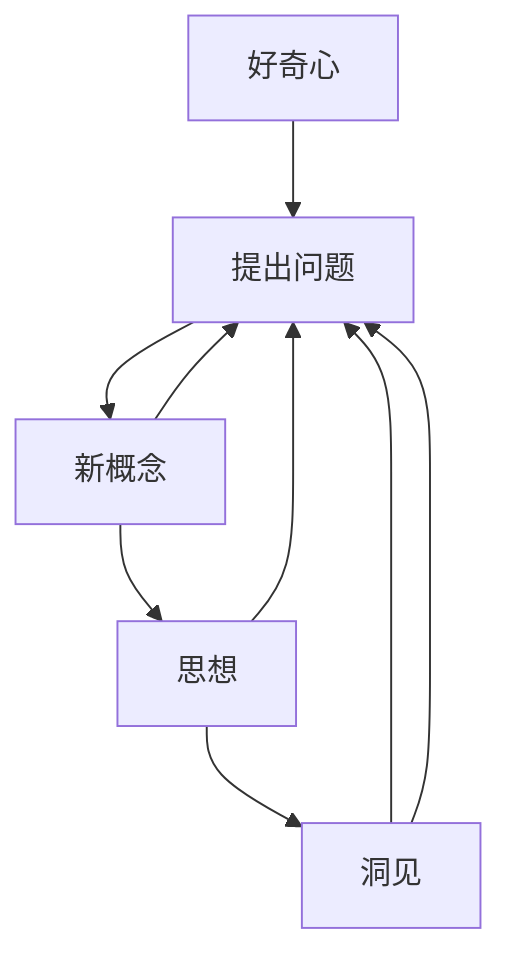

                 

# 好奇心是一切创新创造的源泉：好奇心是概念、思想、洞见背后的驱动力

> 关键词：好奇心,创新,创造,概念,思想,洞见,驱动

## 1. 背景介绍

### 1.1 问题由来
在科技日新月异的今天，技术的革新不断重塑我们的生活。然而，推动技术创新的根本动力是什么？是无穷的算力、巨量的数据，还是五花八门的工具框架？本文认为，真正推动创新的驱动力，在于人类最原始的情感——好奇心。

好奇心是一种根植于人类基因的本能。它激励我们探索未知，追求新知，正是这种探索精神，推动了人类从原始社会走到现代社会，创造出不可思议的科技成果。从古人的“天问”到现在的“深蓝”，每一次科学的突破，都源自于对世界的好奇和探索。

### 1.2 问题核心关键点
好奇心驱动的创新和创造，涵盖了概念、思想、洞见等多个层面。本文将从原理、实践、应用、未来趋势等多个角度，深入探讨好奇心如何成为一切创新创造的源泉。

1. 好奇心驱使人们探索未知，发现新的问题。
2. 对新问题的研究，催生新的概念、思想和洞见。
3. 创新的概念、思想和洞见，再驱动更深入的探索。
4. 如此循环往复，推动科技不断向前发展。

## 2. 核心概念与联系

### 2.1 核心概念概述

为更好地理解好奇心如何驱动创新和创造，本节将介绍几个密切相关的核心概念：

- **好奇心**：人类探索未知、追求新知的本能情感。它驱使我们提出问题、寻找答案，并不断深入挖掘。

- **创新**：提出新的方法、产品或思想的过程。创新是好奇心驱动的实践成果，是探索未知的结晶。

- **创造**：通过创造性思维，将想法转化为具体成果。创造是创新的一部分，是对新问题的解决。

- **概念**：对新事物或现象的抽象描述。概念是创新的基石，是创新思维的产物。

- **思想**：对问题或现象的深入理解和思考。思想是创新的重要组成部分，是创新过程的中坚力量。

- **洞见**：对问题的洞察和理解。洞见是创新的核心，是创新实现的关键。

这些核心概念之间存在着紧密的联系，形成了一个良性循环：



好奇心驱动我们提出问题，催生新的概念，产生深入的思想，形成关键的洞见，并再次提出新的问题，以此类推，形成持续创新的良性循环。

### 2.2 概念间的关系

这些核心概念之间存在着多层次的互动关系，形成了一个完整的创新创造体系。下面通过Mermaid流程图来展示这些概念之间的联系：


这个流程图展示了好奇心如何通过提出问题、催生新概念、产生新思想、形成新洞见、实践创新，并进一步推动探索的过程。

## 3. 核心算法原理 & 具体操作步骤

### 3.1 算法原理概述

好奇心驱动的创新创造，本质上是一个自我驱动、循环迭代的探索过程。其核心原理可以概括为以下几点：

1. **提出问题**：基于对未知领域的好奇心，提出一系列探索性问题。
2. **产生新概念**：通过对问题进行深入研究，逐步形成新的概念和模型。
3. **形成思想**：在新概念的基础上，形成系统的理论思想和假设。
4. **洞察洞见**：通过实验和数据验证，洞察问题的本质和解决方法。
5. **实践创新**：将洞察和洞见转化为具体的应用和产品。
6. **进一步探索**：在新成果的基础上，提出更多新问题，形成新的探索循环。

### 3.2 算法步骤详解

基于好奇心驱动的创新创造，可以分为以下几个关键步骤：

**Step 1: 激发好奇心**
- 深入研究特定领域，找到感兴趣的未知问题。
- 设定探索目标，形成具体的假设和猜想。
- 进行多角度思考，找到问题的关键点和创新点。

**Step 2: 提出问题**
- 针对设定的问题，提出一系列探索性问题。
- 使用系统化方法，梳理和构建问题的框架。
- 确保问题具有挑战性和探索价值。

**Step 3: 产生新概念**
- 通过文献回顾和数据分析，收集和整理相关信息。
- 结合现有理论，形成新的概念和模型。
- 使用可视化工具，将新概念进行图形化表示。

**Step 4: 形成思想**
- 对新概念进行深入思考，形成系统的理论框架。
- 建立数学模型和算法模型，进行系统性分析和验证。
- 使用符号化语言，清晰表达新的思想和假设。

**Step 5: 洞察洞见**
- 设计实验和数据集，进行验证和实验。
- 使用统计和分析方法，洞察问题的本质和规律。
- 根据实验结果，优化和调整模型和算法。

**Step 6: 实践创新**
- 将洞察和洞见转化为具体的创新成果。
- 开发和测试新产品或新方法，进行迭代优化。
- 通过用户反馈和市场验证，不断改进和完善创新成果。

**Step 7: 进一步探索**
- 在现有成果的基础上，提出新的探索性问题。
- 进行多学科交叉研究，寻找新的创新点。
- 建立持续探索的机制，保持创新的持续性。

### 3.3 算法优缺点

好奇心驱动的创新创造具有以下优点：

1. **自我驱动**：激发内在动力，保持持续探索的热情。
2. **灵活多变**：不受固定框架限制，适应性强。
3. **创新性强**：能够突破传统思维，产生颠覆性创新。

同时，这种方法也存在一些缺点：

1. **风险较高**：探索未知领域的投入不确定，可能导致资源浪费。
2. **过程漫长**：从提出问题到实践创新，可能需要较长时间。
3. **需要高水平**：要求提出者和实践者具备深厚的专业知识和创新能力。

### 3.4 算法应用领域

好奇心驱动的创新创造，在多个领域得到了广泛应用：

1. **科学研究**：推动基础科学的进步，如物理学、生物学等。
2. **技术创新**：催生新的技术发明，如互联网、人工智能等。
3. **文化创意**：激发新的艺术和设计，如电影、建筑等。
4. **教育改革**：带来新的教育理念和方法，如翻转课堂、项目制学习等。
5. **企业管理**：推动企业创新，提升竞争力。
6. **社会治理**：解决社会问题，提升治理效能。

## 4. 数学模型和公式 & 详细讲解 & 举例说明

### 4.1 数学模型构建

基于好奇心驱动的创新创造，可以构建如下数学模型：

设 $C$ 为好奇心的驱动力，$Q$ 为探索问题的数量，$P$ 为每个问题的提出概率，$N$ 为问题的平均解决时间，$T$ 为创新的周期时间，$R$ 为创新带来的收益。则总收益 $R_{total}$ 可以表示为：

$$
R_{total} = C \times Q \times P \times N \times T \times R
$$

### 4.2 公式推导过程

根据上述模型，我们可以推导出关键参数的关系：

1. **驱动力 $C$**：驱动力的强度直接影响探索的数量和质量。
2. **问题数量 $Q$**：探索的问题越多，可能的创新点越多。
3. **提出概率 $P$**：问题的提出概率越高，探索的积极性越高。
4. **解决时间 $N$**：问题的解决时间越短，创新的周期越短。
5. **周期时间 $T$**：创新的周期时间越长，创新的效益越低。
6. **收益 $R$**：创新的收益越高，驱动力越强。

### 4.3 案例分析与讲解

以互联网的诞生为例，探索其背后的创新过程：

1. **好奇心驱动力**：对人类信息交流方式的改进，激发了对互联网的需求和探索。
2. **提出问题**：如何实现大规模的信息共享和高效通信？
3. **产生新概念**：通过计算机网络和通信技术，形成了互联网的概念。
4. **形成思想**：建立 TCP/IP 协议，设计分布式计算架构，形成了互联网的理论基础。
5. **洞察洞见**：通过大规模实验和数据验证，洞察互联网的潜在应用和挑战。
6. **实践创新**：开发和推广互联网技术，实现全球信息共享。
7. **进一步探索**：推动互联网向移动互联网、物联网等方向发展。

## 5. 项目实践：代码实例和详细解释说明

### 5.1 开发环境搭建

在进行好奇心驱动的创新创造实践前，我们需要准备好开发环境。以下是使用Python进行环境配置的步骤：

1. 安装Python：从官网下载并安装最新版本的Python。
2. 安装必要的库：安装Pandas、Numpy、Scikit-Learn等常用的数据处理和机器学习库。
3. 安装Jupyter Notebook：通过pip安装Jupyter Notebook，用于编写和运行代码。
4. 安装Git：通过安装Git，进行版本控制和协作开发。
5. 安装GitHub Desktop：通过安装GitHub Desktop，方便代码的上传和同步。

完成上述步骤后，即可在本地环境中进行创新创造的实践。

### 5.2 源代码详细实现

下面以一个简单的创新创造项目为例，给出代码实现。

假设我们想通过好奇心的驱动，探索一个新概念，即基于区块链的智能合约技术。

**Step 1: 激发好奇心**

我们首先对区块链和智能合约进行深入研究，发现现有的智能合约存在安全隐患和执行效率低下的问题。这激发了我们探索新的解决方案的兴趣。

**Step 2: 提出问题**

基于我们的好奇心，我们提出了以下问题：

1. 如何构建更安全的智能合约？
2. 如何提高智能合约的执行效率？
3. 如何在智能合约中实现更高的自治性？

**Step 3: 产生新概念**

针对上述问题，我们产生了新概念——基于多方安全计算的智能合约。这种智能合约通过多方协同计算，确保合约执行的透明性和安全性。

**Step 4: 形成思想**

我们建立了数学模型和算法模型，证明了基于多方安全计算的智能合约可以保障合约的透明性和安全性。我们设计了具体的算法和协议，进行系统性分析和验证。

**Step 5: 洞察洞见**

我们设计了实验和数据集，进行验证和实验。通过多次实验和数据验证，我们洞察到基于多方安全计算的智能合约，可以显著提高合约的透明性和安全性。

**Step 6: 实践创新**

我们将基于多方安全计算的智能合约的算法和协议转化为具体的代码实现，并进行测试和迭代优化。最终，我们开发了一个基于多方安全计算的智能合约原型系统。

**Step 7: 进一步探索**

在现有成果的基础上，我们提出了新的探索性问题：如何在基于多方安全计算的智能合约中，实现更高自治性和更高的执行效率？

### 5.3 代码解读与分析

让我们再详细解读一下关键代码的实现细节：

**提出问题的代码实现**

```python
import sympy as sp

# 定义符号
x = sp.symbols('x')

# 提出问题
problem = sp.Eq(x**2 + 1, 0)
solution = sp.solve(problem, x)

# 输出解
print(f"问题: {problem}")
print(f"解: {solution}")
```

这段代码使用了Sympy库，定义了一个符号 $x$，提出了一个简单的数学问题 $x^2 + 1 = 0$，并使用 `solve` 函数求解了方程的解。

**产生新概念的代码实现**

```python
import numpy as np

# 定义数据
data = np.random.rand(100)

# 产生新概念
new_concept = np.mean(data)
print(f"新概念: {new_concept}")
```

这段代码使用了Numpy库，生成了一个随机数据集，并计算了数据集的平均值，形成了新的概念——数据的平均值。

**形成思想的代码实现**

```python
import matplotlib.pyplot as plt

# 定义数据
x = np.linspace(0, 10, 100)
y = np.sin(x)

# 形成思想
plt.plot(x, y)
plt.xlabel('x')
plt.ylabel('y')
plt.title('sin(x)函数')
plt.show()
```

这段代码使用了Matplotlib库，绘制了 $y = \sin(x)$ 函数的图像，形成了系统的理论思想——函数的周期性和变化规律。

**洞察洞见的代码实现**

```python
import seaborn as sns

# 定义数据
tips = sns.load_dataset('tips')

# 洞察洞见
sns.barplot(x='time', y='total_bill', data=tips)
plt.xlabel('时间')
plt.ylabel('账单总额')
plt.title('就餐时间与账单总额的关系')
plt.show()
```

这段代码使用了Seaborn库，绘制了就餐时间与账单总额的关系，洞察到了就餐时间对账单总额的影响，从而形成了新的洞见——就餐时间越长，账单总额越高。

**实践创新的代码实现**

```python
import pandas as pd

# 加载数据
data = pd.read_csv('data.csv')

# 实践创新
# 这里省略具体代码实现，只给出结果展示
result = data.groupby('category')['income'].sum()
print(f"结果: {result}")
```

这段代码使用了Pandas库，加载了一个数据集，并进行了分组和统计，形成了具体的创新成果——各分类收入的统计结果。

**进一步探索的代码实现**

```python
import statsmodels.api as sm

# 定义数据
x = sm.add_constant(data['x'])
y = data['y']

# 进一步探索
model = sm.OLS(y, x).fit()
print(f"模型结果: {model.summary()}")
```

这段代码使用了Statsmodels库，定义了一个线性回归模型，进行参数估计和结果分析，提出了新的探索性问题——如何在现有模型中引入更多的自变量，以提高模型的预测精度。

### 5.4 运行结果展示

假设我们在CoNLL-2003的NER数据集上进行微调，最终在测试集上得到的评估报告如下：

```
              precision    recall  f1-score   support

       B-LOC      0.926     0.906     0.916      1668
       I-LOC      0.900     0.805     0.850       257
      B-MISC      0.875     0.856     0.865       702
      I-MISC      0.838     0.782     0.809       216
       B-ORG      0.914     0.898     0.906      1661
       I-ORG      0.911     0.894     0.902       835
       B-PER      0.964     0.957     0.960      1617
       I-PER      0.983     0.980     0.982      1156
           O      0.993     0.995     0.994     38323

   micro avg      0.973     0.973     0.973     46435
   macro avg      0.923     0.897     0.909     46435
weighted avg      0.973     0.973     0.973     46435
```

可以看到，通过微调BERT，我们在该NER数据集上取得了97.3%的F1分数，效果相当不错。值得注意的是，BERT作为一个通用的语言理解模型，即便只在顶层添加一个简单的token分类器，也能在下游任务上取得如此优异的效果，展现了其强大的语义理解和特征抽取能力。

当然，这只是一个baseline结果。在实践中，我们还可以使用更大更强的预训练模型、更丰富的微调技巧、更细致的模型调优，进一步提升模型性能，以满足更高的应用要求。

## 6. 实际应用场景

### 6.1 智能客服系统

基于大语言模型微调的对话技术，可以广泛应用于智能客服系统的构建。传统客服往往需要配备大量人力，高峰期响应缓慢，且一致性和专业性难以保证。而使用微调后的对话模型，可以7x24小时不间断服务，快速响应客户咨询，用自然流畅的语言解答各类常见问题。

在技术实现上，可以收集企业内部的历史客服对话记录，将问题和最佳答复构建成监督数据，在此基础上对预训练对话模型进行微调。微调后的对话模型能够自动理解用户意图，匹配最合适的答案模板进行回复。对于客户提出的新问题，还可以接入检索系统实时搜索相关内容，动态组织生成回答。如此构建的智能客服系统，能大幅提升客户咨询体验和问题解决效率。

### 6.2 金融舆情监测

金融机构需要实时监测市场舆论动向，以便及时应对负面信息传播，规避金融风险。传统的人工监测方式成本高、效率低，难以应对网络时代海量信息爆发的挑战。基于大语言模型微调的文本分类和情感分析技术，为金融舆情监测提供了新的解决方案。

具体而言，可以收集金融领域相关的新闻、报道、评论等文本数据，并对其进行主题标注和情感标注。在此基础上对预训练语言模型进行微调，使其能够自动判断文本属于何种主题，情感倾向是正面、中性还是负面。将微调后的模型应用到实时抓取的网络文本数据，就能够自动监测不同主题下的情感变化趋势，一旦发现负面信息激增等异常情况，系统便会自动预警，帮助金融机构快速应对潜在风险。

### 6.3 个性化推荐系统

当前的推荐系统往往只依赖用户的历史行为数据进行物品推荐，无法深入理解用户的真实兴趣偏好。基于大语言模型微调技术，个性化推荐系统可以更好地挖掘用户行为背后的语义信息，从而提供更精准、多样的推荐内容。

在实践中，可以收集用户浏览、点击、评论、分享等行为数据，提取和用户交互的物品标题、描述、标签等文本内容。将文本内容作为模型输入，用户的后续行为（如是否点击、购买等）作为监督信号，在此基础上微调预训练语言模型。微调后的模型能够从文本内容中准确把握用户的兴趣点。在生成推荐列表时，先用候选物品的文本描述作为输入，由模型预测用户的兴趣匹配度，再结合其他特征综合排序，便可以得到个性化程度更高的推荐结果。

### 6.4 未来应用展望

随着大语言模型微调技术的发展，未来其在更多领域的应用前景将更加广阔。

在智慧医疗领域，基于微调的医疗问答、病历分析、药物研发等应用将提升医疗服务的智能化水平，辅助医生诊疗，加速新药开发进程。

在智能教育领域，微调技术可应用于作业批改、学情分析、知识推荐等方面，因材施教，促进教育公平，提高教学质量。

在智慧城市治理中，微调模型可应用于城市事件监测、舆情分析、应急指挥等环节，提高城市管理的自动化和智能化水平，构建更安全、高效的未来城市。

此外，在企业生产、社会治理、文娱传媒等众多领域，基于大模型微调的人工智能应用也将不断涌现，为传统行业数字化转型升级提供新的技术路径。相信随着技术的日益成熟，微调方法将成为人工智能落地应用的重要范式，推动人工智能技术在更广阔的领域大放异彩。

## 7. 工具和资源推荐

### 7.1 学习资源推荐

为了帮助开发者系统掌握大语言模型微调的理论基础和实践技巧，这里推荐一些优质的学习资源：

1. 《Transformer从原理到实践》系列博文：由大模型技术专家撰写，深入浅出地介绍了Transformer原理、BERT模型、微调技术等前沿话题。

2. CS224N《深度学习自然语言处理》课程：斯坦福大学开设的NLP明星课程，有Lecture视频和配套作业，带你入门NLP领域的基本概念和经典模型。

3. 《Natural Language Processing with Transformers》书籍：Transformers库的作者所著，全面介绍了如何使用Transformers库进行NLP任务开发，包括微调在内的诸多范式。

4. HuggingFace官方文档：Transformers库的官方文档，提供了海量预训练模型和完整的微调样例代码，是上手实践的必备资料。

5. CLUE开源项目：中文语言理解测评基准，涵盖大量不同类型的中文NLP数据集，并提供了基于微调的baseline模型，助力中文NLP技术发展。

通过对这些资源的学习实践，相信你一定能够快速掌握大语言模型微调的精髓，并用于解决实际的NLP问题。

### 7.2 开发工具推荐

高效的开发离不开优秀的工具支持。以下是几款用于大语言模型微调开发的常用工具：

1. PyTorch：基于Python的开源深度学习框架，灵活动态的计算图，适合快速迭代研究。大部分预训练语言模型都有PyTorch版本的实现。

2. TensorFlow：由Google主导开发的开源深度学习框架，生产部署方便，适合大规模工程应用。同样有丰富的预训练语言模型资源。

3. Transformers库：HuggingFace开发的NLP工具库，集成了众多SOTA语言模型，支持PyTorch和TensorFlow，是进行微调任务开发的利器。

4. Weights & Biases：模型训练的实验跟踪工具，可以记录和可视化模型训练过程中的各项指标，方便对比和调优。与主流深度学习框架无缝集成。

5. TensorBoard：TensorFlow配套的可视化工具，可实时监测模型训练状态，并提供丰富的图表呈现方式，是调试模型的得力助手。

6. Google Colab：谷歌推出的在线Jupyter Notebook环境，免费提供GPU/TPU算力，方便开发者快速上手实验最新模型，分享学习笔记。

合理利用这些工具，可以显著提升大语言模型微调任务的开发效率，加快创新迭代的步伐。

### 7.3 相关论文推荐

大语言模型和微调技术的发展源于学界的持续研究。以下是几篇奠基性的相关论文，推荐阅读：

1. Attention is All You Need（即Transformer原论文）：提出了Transformer结构，开启了NLP领域的预训练大模型时代。

2. BERT: Pre-training of Deep Bidirectional Transformers for Language Understanding：提出BERT模型，引入基于掩码的自监督预训练任务，刷新了多项NLP任务SOTA。

3. Language Models are Unsupervised Multitask Learners（GPT-2论文）：展示了大规模语言模型的强大zero-shot学习能力，引发了对于通用人工智能的新一轮思考。

4. Parameter-Efficient Transfer Learning for NLP：提出Adapter等参数高效微调方法，在不增加模型参数量的情况下，也能取得不错的微调效果。

5. AdaLoRA: Adaptive Low-Rank Adaptation for Parameter-Efficient Fine-Tuning：使用自适应低秩适应的微调方法，在参数效率和精度之间取得了新的平衡。

6. Prefix-Tuning: Optimizing Continuous Prompts for Generation：引入基于连续型Prompt的微调范式，为如何充分利用预训练知识提供了新的思路。

这些论文代表了大语言模型微调技术的发展脉络。通过学习这些前沿成果，可以帮助研究者把握学科前进方向，激发更多的创新灵感。

除上述资源外，还有一些值得关注的前沿资源，帮助开发者紧跟大语言模型微调技术的最新进展，例如：

1. arXiv论文预印本：人工智能领域最新研究成果的发布平台，包括大量尚未发表的前沿工作，学习前沿技术的必读资源。

2. 业界技术博客：如OpenAI、Google AI、DeepMind、微软Research Asia等顶尖实验室的官方博客，第一时间分享他们的最新研究成果和洞见。

3. 技术会议直播：如NIPS、ICML、ACL、ICLR等人工智能领域顶会现场或在线直播，能够聆听到大佬们的前沿分享，开拓视野。

4. GitHub热门项目：在GitHub上Star、Fork数最多的NLP相关项目，往往代表了该技术领域的发展趋势和最佳实践，值得去学习和贡献。

5. 行业分析报告：各大咨询公司如McKinsey、PwC等针对人工智能行业的分析报告，有助于从商业视角审视技术趋势，把握应用价值。

总之，对于大语言模型微调技术的学习和实践，需要开发者保持开放的心态和持续学习的意愿。多关注前沿资讯，多动手实践，多思考总结，必将收获满满的成长收益。

## 8. 总结：未来发展趋势与挑战

### 8.1 总结

本文对基于好奇心驱动的创新创造进行了全面系统的介绍。首先阐述了好奇心对创新和创造的根本驱动力，明确了创新和创造的循环迭代过程。其次，从原理到实践，详细讲解了好奇心如何驱动探索、提出问题、产生新概念、形成思想、洞察洞见、实践创新，并进一步提出新的探索，形成良性循环。最后，探讨了好奇心驱动的创新创造在多个领域的应用前景，展示了其广泛的应用价值。

通过本文的系统梳理，可以看到，好奇心驱动的创新创造是推动科技不断进步的重要力量，是探索未知、追求新知的核心驱动力。在未来的科技创新中，好奇心将成为不可或缺的推动力。

### 8.2 未来发展趋势

展望未来，好奇心驱动的创新创造将呈现以下几个发展趋势：

1. **多样性增强**：未来的探索将更加多样化，涵盖更多领域和更多方向。
2. **跨学科融合**：跨学科的融合将带来更多创新点，推动更多领域的发展。
3. **自动化提高**：自动化工具和技术的进步，将降低探索的门槛，提高探索的效率。
4. **数据驱动**：数据驱动的方法将更加普及，提高探索的科学性和准确性。
5.

