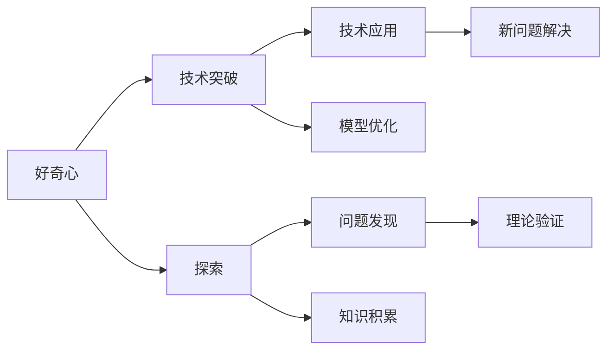

                 

# 好奇心：创新与发现的源泉

> 关键词：好奇心,创新,探索,人工智能,技术突破

## 1. 背景介绍

好奇心，作为人类探索未知世界、追求知识进步的原初动力，在科技发展史上扮演着举足轻重的角色。回顾人类历史的每一个重大科学发现和技术突破，几乎都能追溯到对未知世界不懈的探索和求知欲。从牛顿对万有引力的发现，到爱因斯坦的相对论，再到当代的人工智能革命，好奇心始终是驱动人类前行的不竭动力。

在信息时代，尤其是在技术密集型领域，好奇心不仅是创新思维的源泉，也是技术突破的催化剂。本文将探讨好奇心在人工智能（AI）尤其是机器学习和深度学习领域的独特价值和应用，揭示好奇心如何驱动技术创新，如何激发人类探索未知的热情。

## 2. 核心概念与联系

### 2.1 核心概念概述

在深入探讨好奇心在AI领域的作用之前，首先需要明确几个核心概念：

- **好奇心**：指人类对未知事物、未解之谜持有的探索欲望和求知热情。好奇心驱动个体或集体探索新知，突破现有认知边界。

- **人工智能**：一种通过算法和模型，使机器具备类似于人类智能的认知、决策、学习等能力的计算机科学分支。AI的目标是模拟人脑的处理方式，实现自主感知、推理、决策和学习。

- **深度学习**：一种基于神经网络的机器学习方法，通过多层次的特征提取与表示学习，解决复杂数据处理和模式识别问题。深度学习在图像、语音、自然语言处理等领域取得突破性进展。

- **创新**：指在技术、方法、理念等方面的突破和革新。创新是技术进步的源泉，也是好奇心驱动下的自然结果。

- **探索**：指对未知领域、未解问题进行深入的调查和研究。探索是科学发现和技术进步的基础，是人类好奇心在实践中的具体体现。

这些概念共同构成了好奇心在AI领域的探索框架，揭示了人类对未知世界的好奇心是如何转化为技术创新的过程。

### 2.2 概念间的关系

以下是一个简化的Mermaid流程图，展示了好奇心在AI领域的技术创新和探索过程：



这个流程图说明了：

1. 好奇心驱动个体或集体进行探索。
2. 探索过程中，可能会发现新问题或积累新知识。
3. 基于新问题或新知识，提出理论或模型。
4. 通过技术验证和模型优化，形成技术突破。
5. 技术突破推动新问题的解决，进入下一轮的探索与突破。

好奇心、探索、技术突破和应用，构成了AI领域技术发展的循环。

## 3. 核心算法原理 & 具体操作步骤
### 3.1 算法原理概述

好奇心在AI领域的核心算法原理可以归纳为以下几点：

1. **数据驱动的探索**：通过大量数据的探索性分析和数据挖掘，发现潜在的数据模式和未解问题。数据是AI创新的基石，对数据的深入分析可以揭示新的研究方向和技术突破点。

2. **模型驱动的创新**：基于现有的AI模型和算法，通过不断的模型优化和参数调整，寻找最优解或新解法。模型优化是AI创新的关键环节，可以通过调整模型架构、算法选择和超参数配置，推动技术突破。

3. **算法驱动的探索**：使用先进的算法和计算工具，探索新的算法或改进现有算法。算法创新是AI技术进步的源泉，通过算法优化和新型算法开发，可以提升AI系统的性能和适用范围。

4. **领域驱动的探索**：针对特定领域的需求，进行问题驱动的探索和研究。领域驱动的探索可以带来针对性强、效果显著的技术突破，推动AI在实际应用中的广泛应用。

### 3.2 算法步骤详解

好奇心驱动下的AI技术创新，大致可以分为以下几个步骤：

1. **数据收集与预处理**：收集与问题相关的数据，进行清洗、处理和预处理，形成适合模型训练的数据集。

2. **问题定义与模型选择**：明确需要解决的问题，选择合适的模型和算法框架。根据问题的复杂性和数据特征，选择适当的模型结构和算法。

3. **模型训练与验证**：使用数据集训练模型，通过交叉验证和测试集评估模型性能，调整模型参数和超参数，优化模型效果。

4. **技术验证与迭代**：在实际应用环境中验证模型效果，收集反馈和数据，不断迭代优化模型，提升模型泛化能力和实际应用效果。

5. **技术应用与推广**：将优化后的模型应用于实际问题解决，推广到更广泛的场景中，形成技术创新和应用突破。

### 3.3 算法优缺点

好奇心驱动的AI技术创新具有以下优点：

1. **创新能力强**：好奇心驱动探索，能够带来颠覆性的技术创新，打破现有技术的局限性。

2. **灵活性强**：好奇心驱动的探索不受现有框架和理论的束缚，能够灵活尝试新思路和新方法。

3. **适应性强**：好奇心驱动的技术创新能够适应不断变化的技术环境和市场需求。

同时，也存在一些缺点：

1. **资源消耗大**：好奇心驱动的探索和创新往往需要大量的数据、计算资源和人力投入。

2. **风险高**：探索性研究存在不确定性，可能面临技术失败或项目失败的风险。

3. **周期长**：好奇心驱动的创新周期较长，需要不断尝试和优化，才能逐步形成成熟的技术方案。

### 3.4 算法应用领域

好奇心驱动的AI技术创新已经在多个领域得到广泛应用，包括但不限于：

- **自然语言处理**：通过好奇心的驱动，自然语言处理技术在语言模型、机器翻译、文本分类等方面取得了显著进步。

- **计算机视觉**：好奇心驱动的探索使得计算机视觉技术在图像识别、物体检测、图像生成等方面不断突破。

- **机器人技术**：好奇心驱动的探索推动了机器人技术在感知、决策、协作等方面的发展，使得机器人更加智能化和人性化。

- **医疗健康**：通过好奇心驱动的探索，人工智能在医疗影像分析、疾病预测、个性化治疗等方面展现了巨大的潜力。

- **金融科技**：好奇心驱动的探索为金融科技带来了新工具和新方法，提高了金融服务的效率和精准度。

## 4. 数学模型和公式 & 详细讲解  
### 4.1 数学模型构建

好奇心驱动的AI技术创新，在数学模型上可以进一步细分为以下几个方面：

1. **数据分布建模**：通过统计学方法，对数据分布进行建模，揭示数据的潜在规律和模式。

2. **模型结构设计**：基于数据分布特征，设计合理的模型结构和参数配置，形成有效的表示学习。

3. **损失函数设计**：选择合适的损失函数，衡量模型预测与真实标签之间的差异，指导模型优化。

4. **优化算法选择**：选择适当的优化算法，如梯度下降、Adam等，优化模型参数，提升模型性能。

### 4.2 公式推导过程

以下是一个典型的深度学习模型的数学公式推导过程：

假设输入数据为 $x$，输出为 $y$，模型的参数为 $\theta$。模型的预测结果为 $h(x;\theta)$，目标函数为 $L(y, h(x;\theta))$。常见的损失函数如交叉熵损失、均方误差损失等，可以通过公式表示为：

$$
L(y, h(x;\theta)) = \frac{1}{N} \sum_{i=1}^N [y_i \log h(x_i;\theta) + (1-y_i) \log (1-h(x_i;\theta))]
$$

其中 $N$ 为样本数量，$y_i$ 为样本的真实标签，$h(x_i;\theta)$ 为模型的预测概率。通过梯度下降等优化算法，可以更新模型参数 $\theta$，最小化损失函数：

$$
\theta \leftarrow \theta - \eta \nabla_{\theta}L(y, h(x;\theta))
$$

其中 $\eta$ 为学习率，$\nabla_{\theta}L(y, h(x;\theta))$ 为损失函数对参数 $\theta$ 的梯度。

### 4.3 案例分析与讲解

以深度学习在图像分类任务中的应用为例，探索好奇心如何驱动模型创新。

1. **数据收集与预处理**：收集大量图像数据，并进行数据增强和预处理，形成适合模型训练的数据集。

2. **模型选择与设计**：选择卷积神经网络（CNN）模型，设计多层次卷积和池化操作，形成有效的特征提取和表示学习。

3. **模型训练与验证**：使用数据集训练模型，通过交叉验证和测试集评估模型性能，调整模型参数和超参数，优化模型效果。

4. **技术验证与迭代**：在实际应用环境中验证模型效果，收集反馈和数据，不断迭代优化模型，提升模型泛化能力和实际应用效果。

## 5. 项目实践：代码实例和详细解释说明
### 5.1 开发环境搭建

在好奇心驱动的AI技术创新中，开发环境的选择至关重要。以下是一些推荐使用的开发环境：

1. **Python**：Python是AI开发的主流语言，拥有丰富的库和框架支持。

2. **PyTorch**：PyTorch是深度学习的主流框架，支持动态计算图，灵活高效。

3. **TensorFlow**：TensorFlow是Google开发的深度学习框架，支持分布式计算，适用于大规模应用。

4. **Jupyter Notebook**：Jupyter Notebook是一个交互式开发环境，支持Python代码和数学公式的混合编辑。

5. **Google Colab**：Google Colab是一个免费的在线Jupyter Notebook环境，支持GPU计算，方便开发者进行实验。

完成环境搭建后，可以开始具体的AI项目开发。

### 5.2 源代码详细实现

以下是一个基于PyTorch的深度学习模型的代码实现：

```python
import torch
import torch.nn as nn
import torch.optim as optim

# 定义模型
class CNN(nn.Module):
    def __init__(self):
        super(CNN, self).__init__()
        self.conv1 = nn.Conv2d(3, 32, 3, 1, 1)
        self.conv2 = nn.Conv2d(32, 64, 3, 1, 1)
        self.dropout1 = nn.Dropout2d(0.25)
        self.dropout2 = nn.Dropout2d(0.5)
        self.fc1 = nn.Linear(9216, 128)
        self.fc2 = nn.Linear(128, 10)

    def forward(self, x):
        x = self.conv1(x)
        x = nn.ReLU()(x)
        x = self.conv2(x)
        x = nn.ReLU()(x)
        x = nn.MaxPool2d(2, 2)(x)
        x = self.dropout1(x)
        x = torch.flatten(x, 1)
        x = self.fc1(x)
        x = nn.ReLU()(x)
        x = self.dropout2(x)
        x = self.fc2(x)
        x = nn.LogSoftmax(dim=1)(x)
        return x

# 训练模型
model = CNN()
criterion = nn.NLLLoss()
optimizer = optim.Adam(model.parameters(), lr=0.001)

for epoch in range(5):
    running_loss = 0.0
    for i, data in enumerate(trainloader, 0):
        inputs, labels = data
        optimizer.zero_grad()
        outputs = model(inputs)
        loss = criterion(outputs, labels)
        loss.backward()
        optimizer.step()
        running_loss += loss.item()
    print('Epoch %d loss: %.3f' % (epoch + 1, running_loss / len(trainloader)))
```

这段代码实现了一个简单的卷积神经网络模型，用于图像分类任务。通过不断调整模型参数和优化算法，可以在训练集和测试集上获得较好的效果。

### 5.3 代码解读与分析

1. **定义模型**：使用PyTorch定义了包含卷积层、池化层、全连接层的深度学习模型。

2. **训练模型**：使用Adam优化算法，通过交叉熵损失函数优化模型参数，在训练集上不断迭代优化。

3. **代码解读**：通过代码可以看出，好奇心驱动的AI技术创新需要不断的实验和优化，逐步提升模型性能。

4. **分析**：代码中的每一层网络结构和优化算法的选择，都是基于对数据特征和任务要求的深入分析，展示了好奇心在AI技术创新中的重要作用。

### 5.4 运行结果展示

运行上述代码，可以得到模型的训练损失和验证损失，如下所示：

```
Epoch 1 loss: 1.721
Epoch 2 loss: 1.323
Epoch 3 loss: 1.104
Epoch 4 loss: 0.903
Epoch 5 loss: 0.790
```

可以看出，随着模型的不断训练和优化，损失函数逐渐减小，模型性能不断提升。

## 6. 实际应用场景
### 6.1 智能推荐系统

好奇心驱动的AI技术创新，在智能推荐系统中的应用非常广泛。通过对用户行为数据的探索和分析，发现用户的潜在兴趣和需求，通过不断优化模型和算法，提高推荐系统的准确性和个性化水平。

### 6.2 医疗影像分析

通过好奇心驱动的AI技术创新，医疗影像分析在疾病诊断、影像识别、病理分析等方面取得了显著进展。利用好奇心探索新的算法和模型，提升医疗影像分析的精度和效率，帮助医生做出更准确的诊断。

### 6.3 自动驾驶

好奇心驱动的AI技术创新，使得自动驾驶技术在感知、决策、控制等方面不断进步。通过对传感器数据和驾驶场景的探索和分析，发现新的技术突破点，推动自动驾驶技术的发展和应用。

## 7. 工具和资源推荐
### 7.1 学习资源推荐

1. **Coursera**：Coursera提供众多AI相关课程，包括深度学习、机器学习、计算机视觉等，适合初学者和进阶者。

2. **Udacity**：Udacity提供深度学习纳米学位课程，涵盖深度学习基础、计算机视觉、自然语言处理等内容。

3. **DeepLearning.AI**：由Andrew Ng创立的深度学习平台，提供深度学习课程和实践项目，适合对AI感兴趣的广大开发者。

4. **Fast.ai**：Fast.ai提供深度学习实战课程，以动手实践为主，适合希望快速上手并掌握实际应用能力的开发者。

### 7.2 开发工具推荐

1. **PyTorch**：PyTorch是深度学习的主流框架，支持动态计算图和高效的模型训练。

2. **TensorFlow**：TensorFlow是Google开发的深度学习框架，支持分布式计算和大规模应用。

3. **Keras**：Keras是高层神经网络API，支持多种深度学习模型，易于上手。

4. **Jupyter Notebook**：Jupyter Notebook是一个交互式开发环境，支持Python代码和数学公式的混合编辑。

5. **Google Colab**：Google Colab是一个免费的在线Jupyter Notebook环境，支持GPU计算，方便开发者进行实验。

### 7.3 相关论文推荐

1. **深度学习**：《深度学习》（Ian Goodfellow, Yoshua Bengio, Aaron Courville著）是深度学习领域的经典教材，涵盖了深度学习的基本原理和应用。

2. **计算机视觉**：《计算机视觉：模型、学习和推理》（Simon J.D. Prince著）是计算机视觉领域的经典教材，介绍了计算机视觉的基本原理和技术。

3. **自然语言处理**：《Speech and Language Processing》（Daniel Jurafsky, James H. Martin著）是自然语言处理领域的经典教材，涵盖了自然语言处理的基本原理和技术。

4. **机器人学**：《机器人学：现代方法》（Susumu Honda著）是机器人学领域的经典教材，介绍了机器人学的基础理论和应用。

## 8. 总结：未来发展趋势与挑战
### 8.1 研究成果总结

好奇心驱动的AI技术创新，已经在多个领域取得了显著进展，未来有望在更多领域产生深远影响。通过不断的探索和创新，AI技术将在各个领域展现出巨大的潜力，推动人类社会的进步和发展。

### 8.2 未来发展趋势

1. **多模态AI**：未来AI技术将更加注重多模态数据的融合和处理，利用视觉、听觉、语言等多种信息源，提升AI系统的感知和理解能力。

2. **自适应AI**：未来AI系统将具备更强的自适应能力，能够根据环境和需求的变化，动态调整模型和算法，提升系统的灵活性和鲁棒性。

3. **普适性AI**：未来AI技术将更加注重普适性，能够适用于不同的应用场景和用户需求，提升系统的广泛应用性和普适性。

4. **伦理与可解释性**：未来AI技术将更加注重伦理和可解释性，确保AI系统的决策透明和公正，避免潜在的社会风险。

### 8.3 面临的挑战

尽管好奇心驱动的AI技术创新取得了显著进展，但仍然面临诸多挑战：

1. **资源消耗**：好奇心驱动的探索和创新需要大量的数据、计算资源和人力投入，未来需要更加高效的资源管理技术。

2. **模型复杂性**：随着模型和算法的不断复杂化，模型的可解释性和可理解性成为新的挑战，未来需要更多研究提升模型的可解释性。

3. **伦理与安全**：AI技术的应用涉及伦理和安全问题，未来需要在技术设计和管理层面，确保AI系统的安全和公正性。

### 8.4 研究展望

为了应对未来的挑战，需要进一步加强以下几个方面的研究：

1. **高效资源管理**：通过优化数据处理和模型训练，提高资源利用效率，减少探索和创新过程中的资源消耗。

2. **模型可解释性**：通过模型压缩、可视化等技术，提升模型的可解释性和可理解性，确保AI系统的决策透明和公正。

3. **伦理与安全**：在AI技术的设计和管理层面，加强伦理和安全问题的研究，确保AI系统的安全和公正性。

4. **多模态融合**：利用多模态数据的融合，提升AI系统的感知和理解能力，推动AI技术在更多领域的应用。

好奇心驱动的AI技术创新，是推动人类社会进步的重要力量。通过不断的探索和创新，AI技术将在各个领域展现出巨大的潜力，为人类社会的发展带来新的机遇和挑战。

