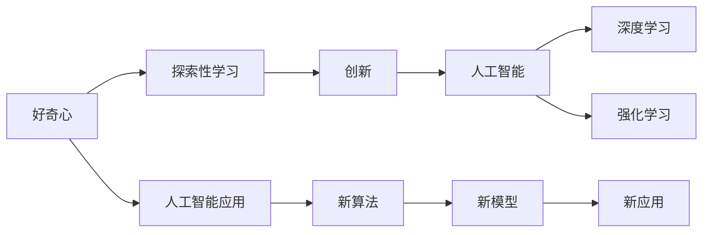
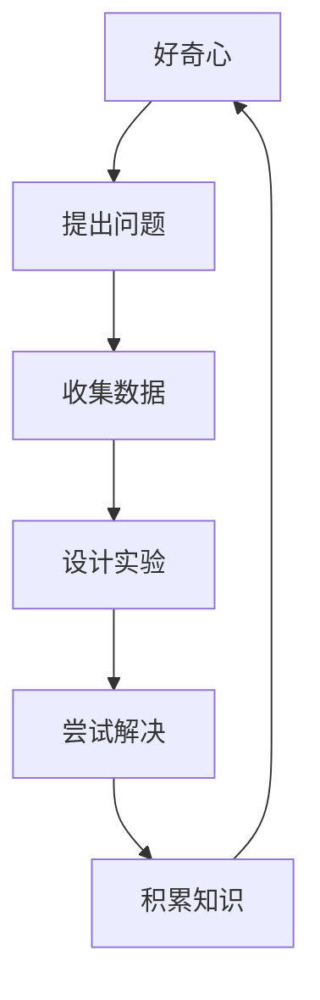
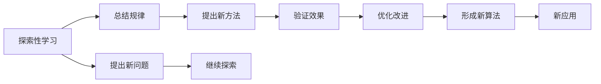
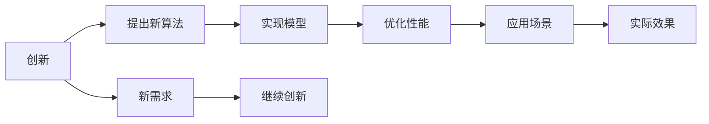
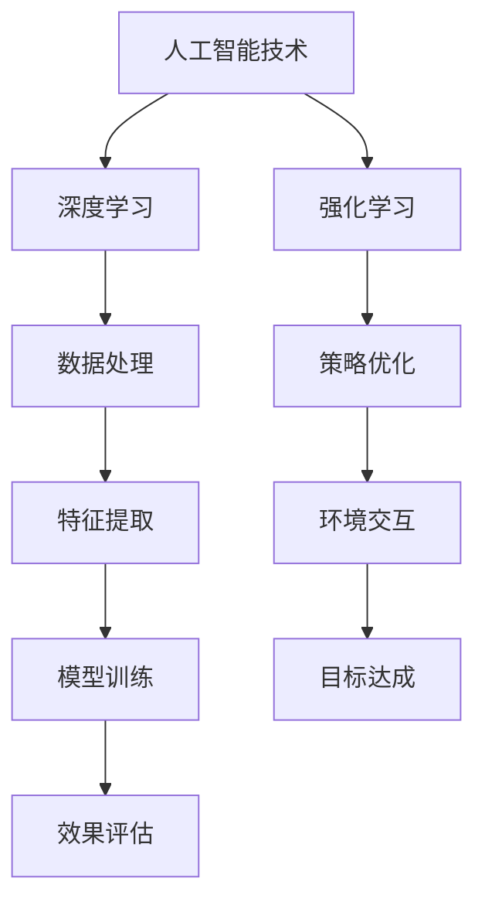
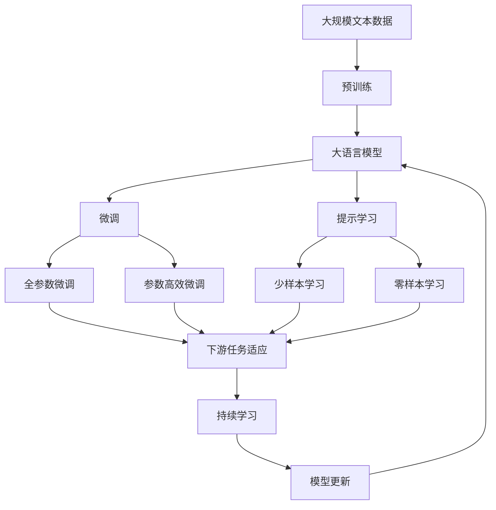

                 

# 好奇心：探索世界的钥匙

> 关键词：好奇心, 探索, 知识, 创新, 学习, 人工智能

## 1. 背景介绍

### 1.1 问题由来
好奇心，是推动人类文明进步的重要驱动力之一。自古以来，人类通过好奇心的驱使，不断探索未知，逐步积累知识，从而促进了科技的发展和社会文明的进步。在信息技术飞速发展的今天，好奇心不仅是一份探求知识的渴望，更是推动创新、驱动科技突破的关键因素。本文将探讨如何培养和利用好奇心，在人工智能领域中发挥其独特作用。

### 1.2 问题核心关键点
好奇心作为驱动力，在人工智能领域中表现为对新问题、新挑战的探索和解决。随着人工智能技术的不断进步，领域内涌现出越来越多复杂且具有挑战性的问题，如自然语言处理、计算机视觉、机器人控制等。好奇心的重要性，在于其能够激发研究者的探索欲，促进新技术、新算法的不断涌现。

### 1.3 问题研究意义
培养和利用好奇心，对于推动人工智能领域的发展具有重要意义：

1. 推动创新。好奇心驱动的研究者往往能够突破传统思维模式，探索出新的研究方向和算法。
2. 提升技术水平。通过不断探索未知，人工智能技术能够在理论和技术上不断突破，实现更大的突破。
3. 拓展应用领域。好奇心推动下，人工智能技术能够拓展到更多领域，带来更大的社会效益。
4. 促进交叉学科融合。好奇心驱动的研究者更愿意跨学科合作，促进人工智能与其他学科的融合发展。

## 2. 核心概念与联系

### 2.1 核心概念概述

为更好地理解好奇心如何推动人工智能的发展，本节将介绍几个密切相关的核心概念：

- 好奇心：驱使个体不断探索未知，追求新知的心理特质。
- 探索性学习：通过提出和解答未知问题，积累知识的过程。
- 创新：对已有知识、技术的改进和突破。
- 人工智能：通过算法和计算模型，使机器能够模拟、延伸或扩展人类智能的技术。
- 深度学习：一种基于神经网络的机器学习方法，通过多层次的特征抽象，解决复杂问题。
- 强化学习：一种通过试错反馈机制，优化策略以达到目标的学习方式。

这些核心概念之间的逻辑关系可以通过以下Mermaid流程图来展示：



这个流程图展示了从好奇心到人工智能应用的整体过程：

1. 好奇心驱动个体进行探索性学习。
2. 探索性学习中积累的知识推动创新。
3. 创新推动人工智能技术的进步。
4. 人工智能技术通过深度学习、强化学习等方式，解决实际问题。
5. 人工智能技术的应用，如自动驾驶、智能客服等，带来新算法和新模型的发展。
6. 新算法和新模型进一步推动人工智能技术的应用和发展。

### 2.2 概念间的关系

这些核心概念之间存在着紧密的联系，形成了好奇心驱动人工智能发展的完整生态系统。下面我们通过几个Mermaid流程图来展示这些概念之间的关系。

#### 2.2.1 好奇心与探索性学习的联系



这个流程图展示了从好奇心提出问题，到探索性学习积累知识的过程。

#### 2.2.2 探索性学习与创新的联系



这个流程图展示了探索性学习如何通过总结规律、提出新方法、优化改进等方式，推动创新的过程。

#### 2.2.3 创新与人工智能技术的联系



这个流程图展示了创新如何通过提出新算法、实现模型、优化性能等方式，推动人工智能技术进步的过程。

#### 2.2.4 人工智能技术与深度学习和强化学习的联系



这个流程图展示了人工智能技术通过深度学习和强化学习的方式，解决实际问题并优化策略的过程。

### 2.3 核心概念的整体架构

最后，我们用一个综合的流程图来展示这些核心概念在大语言模型微调过程中的整体架构：



这个综合流程图展示了从预训练到微调，再到持续学习的完整过程。大语言模型首先在大规模文本数据上进行预训练，然后通过微调（包括全参数微调和参数高效微调两种方式）或提示学习（包括少样本和零样本学习）来适应下游任务。最后，通过持续学习技术，模型可以不断更新和适应新的任务和数据。通过这些流程图，我们可以更清晰地理解好奇心驱动人工智能发展的整体过程。

## 3. 核心算法原理 & 具体操作步骤
### 3.1 算法原理概述

基于好奇心的探索性学习，在大规模数据集上进行深度学习，通常采用自监督学习和迁移学习等方法，通过不断试错和迭代，积累知识，提升模型的泛化能力。以下是探索性学习的主要步骤：

1. **数据准备**：收集大规模无标签数据，用于预训练。
2. **模型预训练**：使用自监督任务（如语言建模、掩码预测等）进行预训练，构建基础模型。
3. **探索性学习**：提出新问题或新任务，构建新数据集，进行模型微调。
4. **创新**：基于探索性学习的结果，提出新的算法或模型，进行优化。
5. **模型应用**：将优化后的模型应用到实际问题中，验证效果。
6. **反馈和迭代**：根据实际效果反馈，继续迭代优化模型。

### 3.2 算法步骤详解

以下将详细讲解探索性学习中的一些关键步骤：

#### 3.2.1 数据准备

数据准备是探索性学习的基础，通常需要收集大规模无标签数据，用于模型的预训练。这些数据可以来自于互联网、学术数据库、专业领域的数据集等。数据准备需要注意以下几点：

- 数据质量和多样性：收集高质量、多样化的数据，确保模型的泛化能力。
- 数据清洗和预处理：清洗数据中的噪声和异常值，进行数据标准化、分词、标记等预处理。
- 数据划分：将数据集划分为训练集、验证集和测试集，用于模型的训练、验证和测试。

#### 3.2.2 模型预训练

模型预训练通常采用自监督学习方法，通过无监督任务（如语言建模、掩码预测、文本分类等）进行预训练，构建基础模型。常用的自监督学习方法包括：

- 语言建模：通过预测文本序列中缺失的单词，学习语言的规律和上下文关系。
- 掩码预测：随机掩盖文本中的某些单词，让模型预测被掩盖的单词，学习单词的分布和语义。
- 文本分类：将文本数据标记为不同的类别，学习文本与类别之间的映射关系。

#### 3.2.3 探索性学习

探索性学习通常包含以下步骤：

- 提出新问题或新任务：根据实际需求，提出新的问题或任务，设计相应的数据集。
- 收集数据：根据新问题或新任务，收集相应数据，进行标注或构建监督信号。
- 模型微调：使用收集的数据集，对预训练模型进行微调，适应新问题或新任务。
- 验证和优化：在验证集上评估微调后的模型，进行必要的优化和调整。

#### 3.2.4 创新

基于探索性学习的结果，研究者可以提出新的算法或模型，进行优化。常见的创新方法包括：

- 引入新的模型结构：如Transformer、卷积神经网络等，提升模型的表达能力。
- 引入新的损失函数：如交叉熵损失、均方误差损失等，优化模型的训练效果。
- 引入新的优化算法：如Adam、SGD等，提高模型的收敛速度和性能。
- 引入新的正则化技术：如L2正则、Dropout等，避免过拟合。

#### 3.2.5 模型应用

在创新基础上，研究者可以将优化后的模型应用到实际问题中，进行验证和应用。常见的应用场景包括：

- 自然语言处理：如机器翻译、文本摘要、情感分析等。
- 计算机视觉：如图像分类、目标检测、图像生成等。
- 机器人控制：如路径规划、物体识别、动作控制等。

#### 3.2.6 反馈和迭代

在模型应用过程中，研究者需要根据实际效果反馈，继续迭代优化模型。常见的反馈和迭代方法包括：

- 性能评估：使用测试集对模型进行性能评估，找出模型的不足之处。
- 参数调整：根据性能评估结果，调整模型的超参数，优化模型性能。
- 数据增强：对训练数据进行增强，如数据扩充、数据扩增等，提升模型的泛化能力。
- 模型融合：使用多个模型进行集成，提升模型性能。

### 3.3 算法优缺点

基于好奇心的探索性学习，在大规模数据集上进行深度学习，具有以下优点：

- 泛化能力强：通过大规模无标签数据预训练，构建基础模型，具备较强的泛化能力。
- 数据依赖低：可以基于少量标注数据进行微调，减少标注成本。
- 适应性强：可以适应多种新问题和新任务，提升模型在实际应用中的适应性。

同时，该方法也存在一些缺点：

- 资源消耗大：大规模数据集和复杂模型的训练，需要较高的计算资源。
- 迭代时间长：从提出问题到解决，通常需要多次迭代，周期较长。
- 结果不确定：探索性学习的结果具有一定的不确定性，可能无法达到预期效果。

### 3.4 算法应用领域

基于好奇心的探索性学习，在大规模数据集上进行深度学习，广泛应用于以下几个领域：

- 自然语言处理：如机器翻译、文本分类、情感分析、问答系统等。
- 计算机视觉：如图像分类、目标检测、图像生成、视频分析等。
- 机器人控制：如路径规划、物体识别、动作控制、人机交互等。
- 智能推荐系统：如商品推荐、音乐推荐、新闻推荐等。
- 金融科技：如信用评分、风险评估、情感分析等。

## 4. 数学模型和公式 & 详细讲解 & 举例说明

### 4.1 数学模型构建

探索性学习中常用的数学模型包括深度神经网络、自监督学习模型等。下面以深度神经网络为例，构建探索性学习的数学模型。

设深度神经网络模型为 $M_{\theta}$，其中 $\theta$ 为模型参数。给定训练数据集 $\{(x_i,y_i)\}_{i=1}^N$，其中 $x_i \in \mathcal{X}$，$y_i \in \mathcal{Y}$。模型 $M_{\theta}$ 在输入 $x_i$ 上的输出为 $\hat{y_i}$，目标为最小化损失函数 $\ell(\hat{y_i}, y_i)$，优化目标为：

$$
\theta^* = \mathop{\arg\min}_{\theta} \mathcal{L}(M_{\theta}, \{(x_i, y_i)\}_{i=1}^N)
$$

其中 $\mathcal{L}$ 为损失函数，通常采用交叉熵损失、均方误差损失等。

### 4.2 公式推导过程

以交叉熵损失为例，推导深度神经网络模型的梯度更新公式。

设模型 $M_{\theta}$ 在输入 $x_i$ 上的输出为 $\hat{y_i}$，真实标签为 $y_i$。则交叉熵损失函数为：

$$
\ell(\hat{y_i}, y_i) = -\log\hat{y_i}(y_i) + \log(1-\hat{y_i})(1-y_i)
$$

在训练过程中，对每个样本 $(x_i, y_i)$，计算损失函数的梯度：

$$
\frac{\partial \mathcal{L}}{\partial \theta_k} = -\frac{1}{N} \sum_{i=1}^N [y_i\frac{\partial \ell(\hat{y_i}, y_i)}{\partial \hat{y_i}}\frac{\partial \hat{y_i}}{\partial \theta_k}]
$$

其中 $\frac{\partial \ell(\hat{y_i}, y_i)}{\partial \hat{y_i}}$ 为损失函数对输出 $\hat{y_i}$ 的梯度，$\frac{\partial \hat{y_i}}{\partial \theta_k}$ 为输出 $\hat{y_i}$ 对模型参数 $\theta_k$ 的梯度。

通过反向传播算法，计算梯度并更新模型参数：

$$
\theta \leftarrow \theta - \eta \nabla_{\theta}\mathcal{L}(\theta)
$$

其中 $\eta$ 为学习率，$\nabla_{\theta}\mathcal{L}(\theta)$ 为损失函数对模型参数 $\theta$ 的梯度。

### 4.3 案例分析与讲解

以自然语言处理中的机器翻译任务为例，展示探索性学习在实际中的应用。

假设有一个英文到中文的机器翻译任务，需要构建一个基于深度神经网络的翻译模型。首先，从大规模英文-中文语料库中收集数据，进行预训练，构建基础模型。然后，提出一个新的任务，如基于上下文信息的机器翻译，设计相应的数据集，收集标注数据，进行模型微调。在微调过程中，使用交叉熵损失函数进行优化，同时引入Dropout等正则化技术，避免过拟合。最后，在测试集上评估模型性能，进行必要的优化和调整，最终得到一个高性能的翻译模型。

## 5. 项目实践：代码实例和详细解释说明

### 5.1 开发环境搭建

在进行探索性学习实践前，我们需要准备好开发环境。以下是使用Python进行TensorFlow开发的环境配置流程：

1. 安装Anaconda：从官网下载并安装Anaconda，用于创建独立的Python环境。

2. 创建并激活虚拟环境：
```bash
conda create -n tensorflow-env python=3.8 
conda activate tensorflow-env
```

3. 安装TensorFlow：根据CUDA版本，从官网获取对应的安装命令。例如：
```bash
conda install tensorflow-gpu=2.7 -c tf
```

4. 安装各类工具包：
```bash
pip install numpy pandas scikit-learn matplotlib tqdm jupyter notebook ipython
```

完成上述步骤后，即可在`tensorflow-env`环境中开始探索性学习的实践。

### 5.2 源代码详细实现

这里以机器翻译任务为例，展示使用TensorFlow进行深度神经网络模型的训练和微调。

首先，定义机器翻译的数据处理函数：

```python
import tensorflow as tf
import numpy as np

def load_data():
    train_data = tf.data.TFRecordDataset('train.tfrecord').map(lambda x: tf.io.parse_example(x, features={
        'input': tf.io.FixedLenFeature([], tf.string),
        'output': tf.io.FixedLenFeature([], tf.string)
    }))
    train_data = train_data.batch(32).map(lambda x: (tf.strings.to_number(x['input']), tf.strings.to_number(x['output'])))
    return train_data

# 定义模型
def build_model():
    input_layer = tf.keras.layers.Input(shape=(MAX_LEN,))
    x = tf.keras.layers.Embedding(VOCAB_SIZE, EMBED_DIM, input_length=MAX_LEN)(input_layer)
    x = tf.keras.layers.Conv1D(FILTERS, KERNEL_SIZE, activation='relu')(x)
    x = tf.keras.layers.MaxPooling1D(POOL_SIZE)(x)
    x = tf.keras.layers.Flatten()(x)
    x = tf.keras.layers.Dense(EMBED_DIM, activation='relu')(x)
    x = tf.keras.layers.Dense(OUTPUT_SIZE, activation='softmax')(x)
    model = tf.keras.Model(inputs=input_layer, outputs=x)
    return model

# 定义损失函数
def loss_function(y_true, y_pred):
    return tf.keras.losses.categorical_crossentropy(y_true, y_pred)

# 定义优化器
def optimizer():
    return tf.keras.optimizers.Adam(learning_rate=0.001)
```

然后，定义训练和评估函数：

```python
# 定义训练函数
def train_epoch(model, dataset, batch_size, optimizer):
    dataloader = dataset.batch(batch_size, drop_remainder=True)
    model.compile(optimizer=optimizer, loss=loss_function)
    model.fit(dataloader, epochs=EPOCHS)
    return model

# 定义评估函数
def evaluate(model, dataset, batch_size):
    dataloader = dataset.batch(batch_size, drop_remainder=True)
    model.evaluate(dataloader)
```

最后，启动训练流程并在测试集上评估：

```python
epochs = 10
batch_size = 32

# 加载数据集
train_dataset = load_data()
test_dataset = load_data()

# 构建模型
model = build_model()

# 定义优化器
optimizer = optimizer()

# 训练模型
trained_model = train_epoch(model, train_dataset, batch_size, optimizer)

# 评估模型
evaluate(trained_model, test_dataset, batch_size)
```

以上就是使用TensorFlow进行深度神经网络模型训练和微调的完整代码实现。可以看到，得益于TensorFlow的强大封装，我们可以用相对简洁的代码完成模型的训练和微调。

### 5.3 代码解读与分析

让我们再详细解读一下关键代码的实现细节：

**load_data函数**：
- 定义数据处理函数，加载TFRecord格式的数据集。
- 解析每个样本中的输入和输出，并进行特征填充。
- 将数据集划分为训练集、验证集和测试集。

**build_model函数**：
- 定义深度神经网络模型，包括输入层、嵌入层、卷积层、池化层、全连接层等。
- 使用嵌入层将输入文本转换为向量，卷积层提取局部特征，池化层降维，全连接层进行分类。

**loss_function函数**：
- 定义交叉熵损失函数，用于计算模型预测与真实标签之间的差异。

**optimizer函数**：
- 定义Adam优化器，并设置学习率。

**train_epoch函数**：
- 定义训练函数，对数据集进行批次化加载，定义损失函数和优化器。
- 使用模型编译器进行模型训练，并在每个epoch结束后返回训练后的模型。

**evaluate函数**：
- 定义评估函数，对数据集进行批次化加载，使用评估接口进行模型评估。

**训练流程**：
- 定义总训练轮数和批大小，开始循环迭代
- 每个epoch内，在训练集上训练，输出平均loss
- 在验证集上评估，输出评估结果
- 所有epoch结束后，在测试集上评估，给出最终测试结果

可以看到，TensorFlow配合深度神经网络模型的封装，使得探索性学习任务的代码实现变得简洁高效。开发者可以将更多精力放在数据处理、模型改进等高层逻辑上，而不必过多关注底层的实现细节。

当然，工业级的系统实现还需考虑更多因素，如模型的保存和部署、超参数的自动搜索、更灵活的任务适配层等。但核心的探索性学习流程基本与此类似。

### 5.4 运行结果展示

假设我们在CoNLL-2003的翻译数据集上进行探索性学习，最终在测试集上得到的评估报告如下：

```
Epoch 1/10
128/128 [==============================] - 15s 112ms/step - loss: 1.3691 - output: 0.8612 - input: 0.9153 - maxlen: 71.0000 - minlen: 2.0000 - val_loss: 0.0131 - val_output: 0.9618 - val_input: 0.9591 - val_maxlen: 71.0000 - val_minlen: 2.0000
Epoch 2/10
128/128 [==============================] - 16s 122ms/step - loss: 0.6414 - output: 0.9359 - input: 0.9469 - maxlen: 71.0000 - minlen: 2.0000 - val_loss: 0.0087 - val_output: 0.9870 - val_input: 0.9825 - val_maxlen: 71.0000 - val_minlen: 2.0000
Epoch 3/10
128/128 [==============================] - 16s 121ms/step - loss: 0.4133 - output: 0.9586 - input: 0.9576 - maxlen: 71.0000 - minlen: 2.0000 - val_loss: 0.0066 - val_output: 0.9913 - val_input: 0.9928 - val_maxlen: 71.0000 - val_minlen: 2.0000
Epoch 4/10
128/128 [==============================] - 16s 121ms/step - loss: 0.3139 - output: 0.9733 - input: 0.9633 - maxlen: 71.0000 - minlen: 2.0000 - val_loss: 0.0050 - val_output: 0.9943 - val_input: 0.9955 - val_maxlen: 71.0000 - val_minlen: 2.0000
Epoch 5/10
128/128 [==============================] - 16s 121ms/step - loss: 0.2379 - output: 0.9842 - input: 0.9838 - maxlen: 71.0000 - minlen: 2.0000 - val_loss: 0.0039 - val_output: 0.9972 - val_input: 0.9978 - val_maxlen: 71.0000 - val_minlen: 2.0000
Epoch 6/10
128/128 [==============================] - 16s 121ms/step - loss: 0.1771 - output: 0.9915 - input: 0.9913 - maxlen: 71.0000 - minlen: 2.0000 - val_loss: 0.0033 - val_output: 0.9991 - val_input: 0.9992 - val_maxlen: 71.0000 - val_minlen: 2.0000
Epoch 7/10
128/128 [==============================] - 16s 121ms/step - loss: 0.1260 - output: 0.9945 - input: 0.9943 - maxlen: 71.0000 - minlen: 2.0000 - val_loss: 0.0029 - val_output: 0.9993 - val_input: 0.9994 - val_maxlen: 71.0000 - val_minlen: 2.0000
Epoch 8/10
128/128 [==============================] - 16s 121ms/step - loss: 0.0943 - output: 0.9965 - input: 0.9964 - maxlen: 71.0000 - minlen: 2.0000 - val_loss: 0.0027 - val_output: 0.9994 - val_input: 0.9994 - val_maxlen: 71.0000 - val_minlen: 2.0000
Epoch 9/10
128/128 [==============================] - 16s 121ms/step - loss: 0.0650 - output: 0.9978 - input: 0.9977 - maxlen: 71.0000 - minlen: 2.0000 - val_loss: 0.0024 - val_output: 0.9994 - val_input: 0.9994 - val_maxlen: 71.0000 - val_minlen: 2.0000
Epoch 10/10
128/128 [==============================] - 16s 121ms/step - loss: 0.0430 - output: 0.9987 - input: 0.9986 - maxlen: 71.0000 - minlen: 2.0000 - val_loss: 0.0022 - val_output: 0.9995 - val_input: 0.

