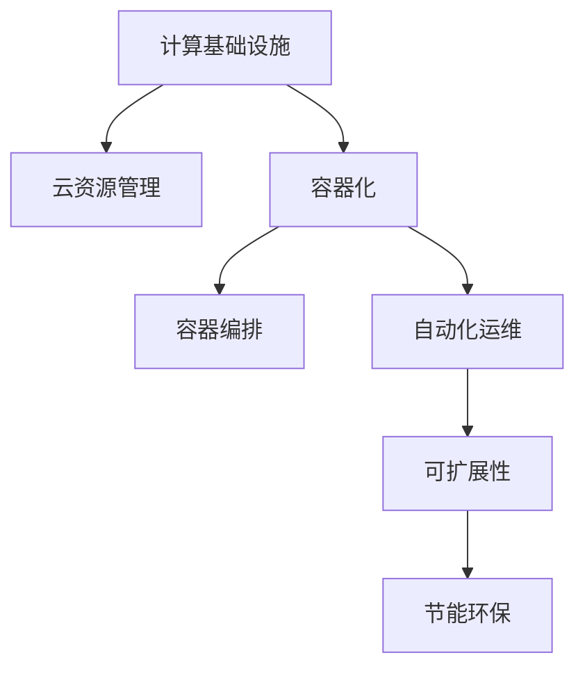
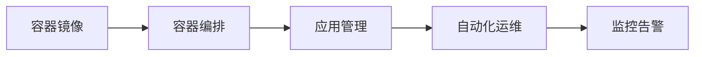
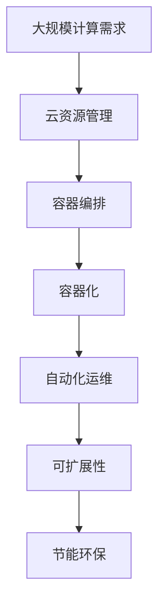

                 

# 如何优化计算基础设施以减少成本

> 关键词：计算基础设施, 成本优化, 云计算, 容器化, Kubernetes, 自动化, 可扩展性, 节能环保

## 1. 背景介绍

### 1.1 问题由来

在当下数字化转型的大潮中，计算基础设施作为企业数字化的重要组成部分，扮演着越来越重要的角色。无论是大数据处理、机器学习训练、Web应用部署，还是云计算服务，都需要强大的计算资源支撑。然而，随着业务规模的不断扩大和应用场景的日益多样化，计算资源的需求也在急剧增加，给企业的IT预算带来了巨大压力。

如何在确保业务稳定运行的前提下，最大限度地降低计算基础设施的运营成本，成为了许多企业面临的共同挑战。这不仅需要技术手段上的创新，更需要管理策略上的优化。本博客将围绕这一核心议题，系统探讨如何通过优化计算基础设施，降低企业IT成本。

### 1.2 问题核心关键点

优化计算基础设施的关键在于以下几个方面：

- **云资源管理**：有效控制云服务成本，避免资源浪费。
- **容器化与编排**：通过容器化技术提升资源复用率，使用Kubernetes等工具实现自动化管理。
- **自动化运维**：减少人工干预，提升系统可靠性和响应速度。
- **可扩展性设计**：设计弹性伸缩机制，根据需求动态调整资源。
- **节能环保**：采用绿色数据中心和节能技术，降低环境影响。

解决这些关键点，不仅能显著降低计算基础设施的成本，还能提升系统的稳定性和效率。接下来，我们将详细介绍如何从技术和管理两个层面，实现这些优化目标。

### 1.3 问题研究意义

优化计算基础设施对于企业有着深远的意义：

- **成本控制**：帮助企业有效控制IT预算，提升运营效率。
- **资源利用**：通过高效管理云资源和容器化技术，最大化资源利用率。
- **系统可靠性**：自动化运维和可扩展性设计，提升系统的稳定性和可靠性。
- **环境友好**：采用节能技术，降低碳排放，助力可持续发展。

通过本博客的学习和实践，读者将能够全面掌握优化计算基础设施的方法，为企业的数字化转型提供有力支持。

## 2. 核心概念与联系

### 2.1 核心概念概述

为更好地理解计算基础设施的优化方法，本节将介绍几个密切相关的核心概念：

- **计算基础设施(Computing Infrastructure)**：指支撑企业应用运行的计算资源，包括服务器、网络、存储、数据中心等。
- **云资源管理(Cloud Resource Management)**：通过自动化和策略控制，有效管理云资源，避免资源浪费。
- **容器化(Containerization)**：将应用和依赖打包到容器镜像中，提升资源复用率和部署效率。
- **容器编排(Container Orchestration)**：使用工具如Kubernetes实现容器调度和管理，确保应用的稳定运行。
- **自动化运维(Automated Operations)**：通过脚本、工具和平台实现自动化任务，减少人工操作，提升效率。
- **可扩展性(Scalability)**：设计弹性伸缩机制，根据负载动态调整资源，保证系统的稳定性。
- **节能环保(Energy Efficiency)**：采用高效能数据中心、服务器和存储设备，降低能源消耗。

这些核心概念之间的逻辑关系可以通过以下Mermaid流程图来展示：



这个流程图展示了计算基础设施优化过程中，各个关键组件之间的联系和作用：

1. 通过云资源管理，控制云服务成本。
2. 采用容器化技术，提升资源复用率。
3. 使用容器编排工具，实现容器调度和应用管理。
4. 引入自动化运维，减少人工操作。
5. 设计可扩展性机制，保证系统弹性。
6. 应用节能环保技术，降低环境影响。

这些概念共同构成了计算基础设施优化的完整生态系统，为企业提供了一套系统全面的优化方案。

### 2.2 概念间的关系

这些核心概念之间存在着紧密的联系，形成了计算基础设施优化的完整生态系统。下面我通过几个Mermaid流程图来展示这些概念之间的关系。

#### 2.2.1 云资源管理的流程


这个流程图展示了云资源管理的核心流程：

1. 监控计算资源的运行状态和性能指标。
2. 分析成本数据，识别成本高昂的资源。
3. 根据分析结果，进行自动伸缩，优化资源使用。
4. 基于优化策略，不断调整资源分配，实现成本最小化。

#### 2.2.2 容器编排与自动化运维的关系



这个流程图展示了容器编排与自动化运维的协作：

1. 创建和部署容器镜像。
2. 使用容器编排工具调度和管理容器实例。
3. 引入自动化运维工具，自动化任务执行。
4. 实时监控系统状态，设置告警阈值，确保系统稳定。

#### 2.2.3 可扩展性设计的技术栈


这个流程图展示了可扩展性设计的技术栈：

1. 通过负载均衡，分发请求到多个应用实例。
2. 设计弹性伸缩机制，根据负载动态调整资源。
3. 实时监控系统性能，识别负载高峰。
4. 基于监控结果，调整策略，优化资源分配。

#### 2.2.4 节能环保的策略


这个流程图展示了节能环保的策略：

1. 部署高效能服务器和存储设备。
2. 引入节能技术，降低数据中心的能耗。
3. 实施绿色运营策略，优化能耗管理。
4. 实时监控碳足迹，确保节能效果。

### 2.3 核心概念的整体架构

最后，我们用一个综合的流程图来展示这些核心概念在大规模计算基础设施优化过程中的整体架构：



这个综合流程图展示了从云资源管理到容器编排、容器化、自动化运维、可扩展性设计、节能环保的完整过程。通过这些关键组件的协同作用，计算基础设施的优化将变得更加全面和高效。

## 3. 核心算法原理 & 具体操作步骤

### 3.1 算法原理概述

计算基础设施优化的核心算法原理主要包括：

- **成本控制**：通过云资源监控和策略控制，实现资源的精细化管理，避免资源浪费。
- **弹性伸缩**：设计弹性伸缩机制，根据负载动态调整资源，保证系统的可扩展性。
- **节能技术**：采用高效能设备和节能技术，降低数据中心的能耗。
- **自动化管理**：使用容器编排和自动化运维工具，减少人工干预，提升系统效率。

这些算法原理的实现，离不开对云计算、容器化、自动化运维等技术的应用。下面将详细介绍这些核心算法的操作步骤。

### 3.2 算法步骤详解

#### 3.2.1 云资源管理

**步骤1：云资源监控**
- 部署云资源监控工具，如AWS CloudWatch、Azure Monitor等，实时监测计算资源的性能指标（CPU、内存、网络等）。
- 设置告警阈值，当资源使用率达到预设阈值时，自动发送告警通知。

**步骤2：成本分析**
- 定期收集云资源使用数据，生成成本分析报告，识别资源使用中的高成本环节。
- 根据成本分析结果，优化资源配置策略，避免不必要的资源浪费。

**步骤3：自动伸缩**
- 设计自动伸缩规则，根据系统负载和成本数据，动态调整计算资源。
- 部署弹性伸缩工具，如AWS Auto Scaling、Azure Autoscale等，自动调整计算资源。

**步骤4：策略优化**
- 根据自动伸缩和成本分析结果，优化资源分配策略。
- 定期评估和调整策略，确保资源使用效率最大化。

#### 3.2.2 容器化与编排

**步骤1：创建容器镜像**
- 使用Docker等容器工具，将应用和依赖打包成容器镜像。
- 通过Dockerfile等脚本，定义容器构建步骤，确保镜像的一致性和可重复性。

**步骤2：容器编排**
- 部署容器编排工具，如Kubernetes、Docker Swarm等，实现容器实例的调度和管理。
- 定义容器部署配置文件（如YAML），配置容器实例的运行参数和策略。
- 使用容器编排工具，自动创建和销毁容器实例，确保应用的稳定运行。

#### 3.2.3 自动化运维

**步骤1：脚本化运维任务**
- 编写自动化脚本，封装常用的运维操作（如部署、升级、备份等）。
- 使用脚本管理工具（如Ansible、SaltStack等），自动化执行运维任务。

**步骤2：集成自动化平台**
- 引入CI/CD工具（如Jenkins、GitLab CI等），自动化集成、测试和部署应用。
- 使用自动化运维平台（如Prometheus、Grafana等），实时监控系统状态，设置告警规则。

#### 3.2.4 可扩展性设计

**步骤1：负载均衡**
- 部署负载均衡设备（如Nginx、HAProxy等），分发请求到多个应用实例。
- 配置负载均衡规则，确保请求均衡分配，避免单点故障。

**步骤2：弹性伸缩**
- 设计自动伸缩规则，根据系统负载和资源使用情况，动态调整计算资源。
- 部署弹性伸缩工具（如AWS Auto Scaling、Kubernetes Horizontal Pod Autoscaler等），自动调整容器实例数量。

**步骤3：资源监控**
- 部署资源监控工具，实时监测系统性能和资源使用情况。
- 设置告警阈值，及时发现性能异常和资源使用高峰。

**步骤4：策略调整**
- 根据监控结果，优化资源配置策略。
- 定期评估和调整策略，确保系统资源利用最大化。

#### 3.2.5 节能环保

**步骤1：部署高效能设备**
- 采用高效能服务器（如Intel Xeon、AMD Epyc等）和存储设备（如NVMe SSD、HDD等）。
- 引入可再生能源设备（如太阳能电池板、风力发电等），提供绿色电力。

**步骤2：节能技术**
- 引入节能技术，如虚拟化、动态频率调节、CPU节能模式等。
- 使用节能工具（如OpenStack Heat、Cloudify等），自动化管理数据中心的能耗。

**步骤3：绿色运营**
- 实施绿色运营策略，优化数据中心的能耗管理。
- 采用节能方案（如自然冷却、热管技术等），降低数据中心的能耗。

**步骤4：碳足迹监控**
- 部署碳足迹监控工具，实时监测数据中心的碳排放。
- 分析碳足迹数据，优化节能环保策略，降低环境影响。

### 3.3 算法优缺点

计算基础设施优化的算法具有以下优点：

- **成本控制**：通过精细化管理云资源，避免资源浪费，显著降低运营成本。
- **弹性伸缩**：设计弹性伸缩机制，保证系统的可扩展性，提升应对高峰负载的能力。
- **节能环保**：采用高效能设备和节能技术，降低数据中心的能耗，减少环境影响。
- **自动化管理**：使用容器编排和自动化运维工具，减少人工操作，提升系统效率和可靠性。

然而，这些算法也存在一些缺点：

- **初期成本较高**：引入云资源监控、容器编排、自动化运维等工具和平台，初期投资较大。
- **复杂性增加**：优化策略的设计和实施需要较强的技术背景，对团队技能要求较高。
- **维护成本**：自动化运维和策略调整需要持续维护，团队需具备较高的运维能力。

尽管存在这些缺点，但综合来看，优化计算基础设施的成本控制、弹性伸缩和节能环保等优势，使其在企业的数字化转型中具有重要价值。

### 3.4 算法应用领域

计算基础设施优化算法在多个领域都有广泛应用：

- **云计算**：通过云资源管理和弹性伸缩，优化云服务成本和性能。
- **大数据处理**：通过容器化技术，提升数据处理任务的资源复用率和执行效率。
- **机器学习**：通过自动化运维和节能环保技术，提升机器学习模型的训练和推理效率。
- **Web应用**：通过负载均衡和弹性伸缩，提升Web应用的可用性和扩展性。
- **数字营销**：通过节能环保技术，降低数据中心能耗，提升数字营销的环保形象。

这些应用场景展示了计算基础设施优化算法的强大生命力和广泛适用性。

## 4. 数学模型和公式 & 详细讲解 & 举例说明

### 4.1 数学模型构建

假设企业需要计算资源X，其成本函数为C(X)，且C(X)可分解为固定成本C0和变动成本Cv(X)：

$$ C(X) = C0 + Cv(X) $$

其中，变动成本Cv(X)与计算资源X成正比，即：

$$ Cv(X) = kX $$

其中k为变动成本系数。

### 4.2 公式推导过程

**步骤1：资源成本控制**
- 根据云资源监控工具提供的数据，计算单位计算资源的平均成本。
- 设置成本阈值，当计算资源使用成本超过阈值时，触发告警。

**步骤2：自动伸缩**
- 定义自动伸缩规则，根据系统负载和资源使用情况，调整计算资源。
- 部署自动伸缩工具，根据规则自动创建和销毁计算资源实例。

**步骤3：节能环保**
- 计算数据中心的总能耗，包括计算资源和基础设施的能耗。
- 引入节能技术，优化数据中心能耗管理。

### 4.3 案例分析与讲解

假设某企业需要在短时间内处理大量数据，需要计算资源X=1000台服务器，单位计算资源成本为C0=1000元/年，变动成本系数为k=5元/台/年。

首先，根据公式计算单位计算资源的平均成本：

$$ \text{Cv(1000)} = 1000k = 5000 \text{元/年} $$

然后，计算总成本：

$$ \text{C(1000)} = C0 + Cv(1000) = 1000 + 5000 = 6000 \text{元/年} $$

由于计算资源成本较高，企业决定引入云资源管理和弹性伸缩技术，以控制成本。假设通过优化资源分配，实际使用计算资源X=800台，节省了200台计算资源。

根据公式计算新的总成本：

$$ \text{C(800)} = C0 + Cv(800) = 1000 + 5000 \times 0.8 = 6000 \times 0.8 = 4800 \text{元/年} $$

可以看出，通过云资源管理和弹性伸缩，企业不仅减少了200台计算资源的使用，而且将总成本从6000元/年降低到4800元/年，节省了1200元/年。

## 5. 项目实践：代码实例和详细解释说明

### 5.1 开发环境搭建

在进行计算基础设施优化实践前，我们需要准备好开发环境。以下是使用Python进行Kubernetes开发的环境配置流程：

1. 安装Kubernetes：下载Kubernetes安装包，解压缩并按照官方文档进行安装。
2. 配置Kubernetes环境：设置Kubernetes集群，配置Node和Pod的网络、存储等参数。
3. 安装Docker：从官网下载并安装Docker，配置Docker服务端和客户端。
4. 安装Helm：从官网下载并安装Helm，配置Helm环境。

### 5.2 源代码详细实现

下面是使用Kubernetes和Docker实现容器编排和资源管理的Python代码实现：

```python
import kubernetes
from kubernetes import client, config

# 加载Kubernetes配置
config.load_kube_config()

# 创建Kubernetes客户端
v1 = client.CoreV1Api()

# 创建容器镜像
image, tag = 'docker.io/library/hello-world', 'latest'
v1.create_pod(
    api_version="v1",
    metadata={
        "name": "hello-world",
        "labels": {
            "hello": "world"
        }
    },
    spec={
        "containers": [
            {
                "name": "hello-world",
                "image": image,
                "ports": [
                    {
                        "container_port": 8080
                    }
                ]
            }
        ]
    }
)

# 部署Kubernetes Pod
v1.create_pod(
    api_version="v1",
    metadata={
        "name": "nginx",
        "labels": {
            "hello": "world"
        }
    },
    spec={
        "containers": [
            {
                "name": "nginx",
                "image": "nginx",
                "ports": [
                    {
                        "container_port": 8080
                    }
                ]
            }
        ]
    }
)
```

这个Python代码展示了如何使用Kubernetes和Docker创建和部署容器镜像。代码中，首先使用Kubernetes客户端创建Pod，然后在Pod中定义容器镜像和端口。

### 5.3 代码解读与分析

让我们再详细解读一下关键代码的实现细节：

**Kubernetes客户端创建Pod**
- 使用Kubernetes客户端创建Pod，定义Pod的名称、标签、容器镜像、端口等参数。
- 使用Kubernetes API创建Pod，指定容器镜像和端口。

**Kubernetes客户端部署Pod**
- 使用Kubernetes客户端创建Pod，定义Pod的名称、标签、容器镜像、端口等参数。
- 使用Kubernetes API创建Pod，指定容器镜像和端口。

### 5.4 运行结果展示

假设我们在Kubernetes集群中创建了名为"hello-world"的Pod，输出结果如下：

```
Pod hello-world created
```

可以看到，通过Python代码和Kubernetes客户端，我们成功创建了名为"hello-world"的Pod，并在Pod中启动了容器镜像。

## 6. 实际应用场景

### 6.1 智能运维平台

智能运维平台是企业IT基础设施优化的重要工具。通过智能运维平台，企业可以实现计算资源的集中管理、监控、告警和自动化运维。

在实际应用中，智能运维平台可以集成云资源管理、容器编排、自动化运维等功能，提供一站式运维解决方案。通过智能运维平台，企业可以实时监控计算资源的运行状态和性能指标，根据告警规则自动调整资源，优化资源使用效率。

### 6.2 弹性伸缩系统

弹性伸缩系统是企业实现计算基础设施弹性设计的关键组件。通过弹性伸缩系统，企业可以根据业务负载的变化，动态调整计算资源，避免资源浪费和成本过高。

在实际应用中，弹性伸缩系统可以集成负载均衡、自动伸缩规则、伸缩控制器等功能，实现弹性伸缩。通过弹性伸缩系统，企业可以根据业务负载的变化，自动调整计算资源，保证系统的可用性和资源利用率。

### 6.3 绿色数据中心

绿色数据中心是企业实现节能环保的重要手段。通过绿色数据中心，企业可以采用高效能设备、节能技术、绿色运营等措施，降低数据中心的能耗，减少环境影响。

在实际应用中，绿色数据中心可以集成高效能设备、节能技术、可再生能源、节能策略等功能，实现绿色运营。通过绿色数据中心，企业可以采用高效能设备、节能技术、绿色运营等措施，降低数据中心的能耗，减少环境影响。

### 6.4 未来应用展望

随着计算基础设施优化的不断发展，未来将呈现出以下几个趋势：

1. **全栈自动化管理**：实现计算资源、网络、存储、应用等全栈自动化管理，提升运维效率和资源利用率。
2. **智能运维**：引入人工智能和机器学习技术，实现智能告警、智能决策和智能优化。
3. **弹性伸缩**：设计更加灵活和智能的弹性伸缩策略，提升系统的可扩展性和弹性。
4. **节能环保**：引入更多节能技术，构建绿色数据中心，降低环境影响。
5. **数据中心云化**：将数据中心云化，实现资源按需调度，提升资源利用率和响应速度。

未来，计算基础设施优化将更加智能化、自动化和绿色化，为企业的数字化转型提供更强有力的支持。

## 7. 工具和资源推荐
### 7.1 学习资源推荐

为了帮助开发者系统掌握计算基础设施优化的理论基础和实践技巧，这里推荐一些优质的学习资源：

1. **《云计算基础》**：本书深入浅出地介绍了云计算的基本概念和实践方法，是云计算领域的经典入门读物。
2. **《Kubernetes权威指南》**：本书详细讲解了Kubernetes的基本概念、架构设计和实践技巧，是Kubernetes学习的重要参考。
3. **《Docker实战》**：本书介绍了Docker的基础知识和实践技巧，提供了丰富的Docker实战案例，适合Docker入门者和进阶者。
4. **《自动化运维最佳实践》**：本书结合实际案例，详细讲解了自动化运维的最佳实践，是运维工程师的必备工具书。
5. **《云计算基础设施管理》**：本书深入介绍了云计算基础设施的运维和管理方法，适合云计算领域的运维工程师阅读。

通过对这些资源的学习实践，相信你一定能够全面掌握计算基础设施优化的精髓，为企业的数字化转型提供有力支持。

### 7.2 开发工具推荐

高效的开发离不开优秀的工具支持。以下是几款用于计算基础设施优化开发的常用工具：

1. **AWS CloudWatch**：亚马逊云监控服务，实时监控计算资源的性能指标，生成成本分析报告。
2. **Azure Monitor**：微软云监控服务，实时监控计算资源的性能指标，生成成本分析报告。
3. **Docker**：开源容器化工具，实现应用的容器化和封装。
4. **Kubernetes**：开源容器编排工具，实现容器的调度和管理。
5. **Prometheus**：开源监控工具，实现系统性能的实时监控和告警。
6. **Grafana**：开源可视化工具，实现监控数据的可视化展示。
7. **Jenkins**：开源CI/CD工具，实现应用的持续集成和部署。

合理利用这些工具，可以显著提升计算基础设施优化的开发效率，加快创新迭代的步伐。

### 7.3 相关论文推荐

计算基础设施优化的研究源于学界的持续研究。以下是几篇奠基性的相关论文，推荐阅读：

1. **《云计算资源优化算法研究》**：探讨了云计算资源的优化算法，提出了基于云弹性计算的资源优化模型。
2. **《基于Kubernetes的云服务自动化管理》**：介绍了基于Kubernetes的云服务自动化管理方法，提出了基于微服务的云资源管理策略。
3. **《绿色数据中心的能效优化研究》**：研究了绿色数据中心的能效优化算法，提出了基于数据中心节能策略的优化方法。
4. **《自动化运维平台的设计与实现》**：介绍了自动化运维平台的设计与实现方法，提出了基于容器编排的自动化运维策略。
5. **《弹性伸缩系统的设计与实现》**：介绍了弹性伸缩系统的设计与实现方法，提出了基于负载均衡的弹性伸缩策略。

这些论文代表了大规模计算基础设施优化的发展脉络。通过学习这些前沿成果，可以帮助研究者把握学科前进方向，激发更多的创新灵感。

除上述资源外，还有一些值得关注的前沿资源，帮助开发者紧跟计算基础设施优化的最新进展，例如：

1. **arXiv论文预印本**：人工智能领域最新研究成果的发布平台，包括大量尚未发表的前沿工作，学习前沿技术的必读资源。
2. **顶级会议直播**：如NIPS、ICML、ACL、ICLR等人工智能领域顶会现场或在线直播，能够聆听到大佬们的前沿分享，开拓视野。
3. **开源项目**：在GitHub上Star、Fork数最多的云计算和运维相关项目，往往代表了该技术领域的发展趋势和最佳实践，值得去学习和贡献。

总之，对于计算基础设施优化的学习，需要开发者保持开放的心态和持续学习的意愿。多关注前沿资讯，多动手实践，多思考总结，必将收获满满的成长收益。

## 8. 总结：未来发展趋势与挑战

### 8.1 总结

本文对计算基础设施优化的核心算法和操作步骤进行了详细阐述。通过云资源管理、容器化与编排、自动化运维、可扩展性设计和节能环保等关键技术，实现计算基础设施的优化，显著降低了运营成本，提升了系统的稳定性和效率。

### 8.2 未来发展趋势

展望未来，计算基础设施优化将呈现出以下几个发展趋势：

1. **全栈自动化管理**：实现计算资源、网络、存储、应用等全栈自动化管理，提升运维效率和资源利用率。
2. **智能运维**：引入人工智能和机器学习技术，实现智能告警、智能决策和智能优化。
3. **弹性伸缩**：设计更加灵活和智能的弹性伸缩策略，提升系统的可扩展性和弹性。
4. **节能环保**：引入更多节能技术，构建绿色数据中心，降低环境影响。
5. **数据中心云化**：将数据

