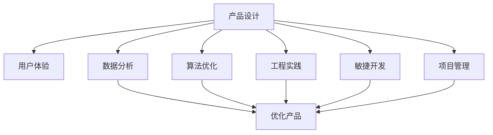
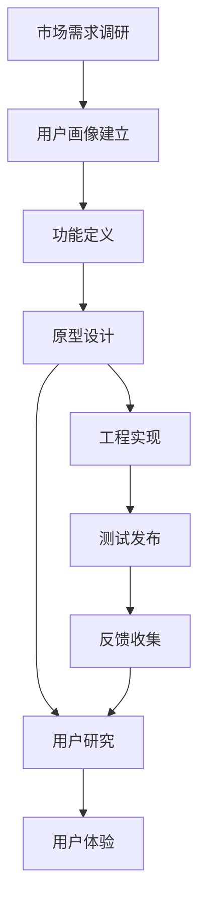
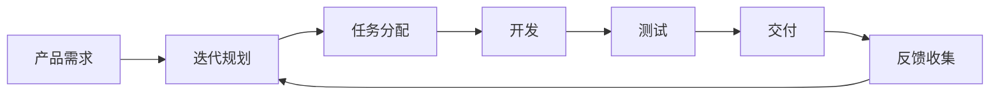
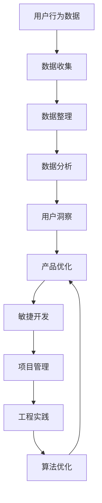

                 

# 如何利用技术能力进行产品设计

> 关键词：产品设计,技术能力,用户体验,数据分析,算法优化,工程实践,敏捷开发,项目管理

## 1. 背景介绍

在当今这个快速变化的技术环境中，产品设计已经成为企业竞争力的关键所在。无论是传统的制造业，还是新兴的互联网领域，技术驱动的创新都使得产品设计变得愈发重要。然而，真正优秀的产品设计不仅需要创新的思维，更需要坚实的技术支撑。本文将从技术能力的视角出发，探讨如何利用技术能力进行产品设计，并结合实际案例，展示技术驱动的产品设计思路。

### 1.1 问题由来

在产品设计的各个环节中，无论是用户研究、原型设计、工程实现，还是市场推广，技术的融入无处不在。对于设计师而言，深入理解技术，特别是前沿技术的发展趋势和应用场景，已经成为其必备的能力之一。然而，由于技术复杂性的增加，越来越多的设计师更倾向于将技术问题留给工程师来解决，而自己则专注于用户体验和产品界面设计。这种分工在一定程度上提高了效率，但也导致了技术和设计之间的脱节，使得产品无法充分发挥其潜力。

因此，本文旨在探讨如何将技术能力融入产品设计，使设计师能够全面参与产品的全生命周期管理，实现技术与设计的深度融合，打造出既具有技术创新性，又符合用户需求的优秀产品。

## 2. 核心概念与联系

### 2.1 核心概念概述

为更好地理解技术能力在产品设计中的应用，本节将介绍几个密切相关的核心概念：

- **产品设计(Product Design)**：涉及从市场需求调研、用户画像建立、功能定义到原型设计、工程实现、测试发布的全流程设计活动。
- **用户体验(User Experience, UX)**：聚焦于用户在使用产品时的体验感，包括交互设计、界面设计、内容设计等。
- **数据分析(Analytics)**：通过收集、整理和分析用户行为数据，洞察用户需求，指导产品改进。
- **算法优化(Algorithm Optimization)**：针对产品的特定功能，通过优化算法提高系统性能。
- **工程实践(Engineering Practices)**：包括编码规范、版本控制、测试策略、部署流程等，是保证产品质量和开发效率的基础。
- **敏捷开发(Agile Development)**：一种迭代式的开发模式，强调团队协作和快速响应变化。
- **项目管理(Project Management)**：规划、执行和监控项目进度、资源分配和质量控制，确保项目按时、按预算完成。

这些核心概念之间的逻辑关系可以通过以下Mermaid流程图来展示：



这个流程图展示了几大核心概念在产品设计中的应用和联系：

1. 产品设计是整个流程的起点，围绕用户体验、数据分析、算法优化、工程实践和敏捷开发进行展开。
2. 用户体验、数据分析、算法优化、工程实践和敏捷开发都是为了更好地实现产品设计，提升产品质量和用户满意度。
3. 项目管理贯穿产品设计的全过程，确保各项任务按时、按预算完成。

通过这个流程图，我们可以更清晰地理解技术能力在产品设计中的应用，以及各个环节之间的相互支持和协作。

### 2.2 概念间的关系

这些核心概念之间存在着紧密的联系，形成了产品设计的完整生态系统。下面我们通过几个Mermaid流程图来展示这些概念之间的关系。

#### 2.2.1 产品设计的整体架构



这个流程图展示了大规模语料的预训练和微调过程的完整流程。

1. 市场需求调研是产品设计的起点，通过调研了解市场趋势和用户需求。
2. 用户画像建立和功能定义基于调研结果，定义产品的主要功能和用户体验目标。
3. 原型设计基于功能定义，设计产品的原型，并通过用户研究验证用户需求。
4. 用户体验和工程实现进一步优化产品原型，最终实现并发布产品。
5. 测试发布后的反馈收集，指导后续的产品优化和改进。

#### 2.2.2 数据分析在产品设计中的应用


这个流程图展示了数据分析在产品设计中的应用。

1. 用户行为数据通过数据收集和整理，进行数据分析。
2. 数据分析洞察用户需求和行为规律。
3. 用户洞察指导产品优化和改进。

#### 2.2.3 敏捷开发与项目管理的关系



这个流程图展示了敏捷开发和项目管理之间的关系。

1. 产品需求通过迭代规划，分解成多个小任务。
2. 任务分配到团队成员，进行开发和测试。
3. 测试后的交付产品，收集反馈。
4. 反馈指导下一次迭代规划，循环往复，不断优化产品。

### 2.3 核心概念的整体架构

最后，我们用一个综合的流程图来展示这些核心概念在大语言模型微调过程中的整体架构：



这个综合流程图展示了从数据分析到产品优化的完整过程。数据分析洞察用户需求和行为规律，指导产品优化；敏捷开发和项目管理确保各项任务按时、按预算完成；工程实践和算法优化进一步提升产品性能和用户体验。

## 3. 核心算法原理 & 具体操作步骤

### 3.1 算法原理概述

技术能力在产品设计中的应用，主要体现在数据分析、算法优化和工程实践中。以下是这些关键环节的算法原理概述：

- **数据分析**：通过统计分析、机器学习等方法，从海量数据中提取有用的信息，洞察用户行为和需求，为产品设计和优化提供科学依据。
- **算法优化**：针对产品功能，优化算法以提升性能和用户体验，如图像识别、自然语言处理、推荐系统等。
- **工程实践**：通过编程规范、版本控制、测试策略等技术手段，提升开发效率和产品质量，确保产品按时、按预算交付。

### 3.2 算法步骤详解

#### 3.2.1 数据分析

1. **数据收集**：从用户使用产品过程中收集行为数据，如点击、浏览、购买等行为数据。
2. **数据整理**：对收集到的数据进行清洗、标注和组织，便于后续分析。
3. **数据分析**：应用统计学和机器学习方法，如回归分析、聚类分析、分类算法等，分析用户行为和需求。
4. **用户洞察**：根据分析结果，洞察用户需求和行为规律，指导产品优化。

#### 3.2.2 算法优化

1. **算法选择**：根据产品需求选择合适的算法模型，如回归模型、决策树、神经网络等。
2. **模型训练**：使用训练数据训练模型，调整模型参数，提高模型精度。
3. **模型评估**：在测试数据集上评估模型性能，选择最优模型。
4. **模型部署**：将训练好的模型集成到产品中，进行实际应用。

#### 3.2.3 工程实践

1. **编码规范**：制定统一的编码规范，提高代码可读性和可维护性。
2. **版本控制**：使用Git等版本控制工具，管理代码变更和团队协作。
3. **测试策略**：设计测试用例，进行单元测试、集成测试和系统测试，确保产品质量。
4. **部署流程**：使用CI/CD工具，自动化构建、测试和部署，确保产品按时发布。

### 3.3 算法优缺点

数据分析、算法优化和工程实践各有优缺点，具体如下：

- **数据分析**：
  - **优点**：能从海量数据中提取有价值的信息，洞察用户行为和需求。
  - **缺点**：数据收集和整理成本高，数据隐私和安全问题需重视。

- **算法优化**：
  - **优点**：提升产品功能性能，提升用户体验。
  - **缺点**：算法模型的选择和训练复杂度高，需大量标注数据。

- **工程实践**：
  - **优点**：提高开发效率和产品质量，确保产品按时发布。
  - **缺点**：开发规范和测试策略的制定需时间，且需团队协作。

### 3.4 算法应用领域

技术能力在产品设计中的应用，主要体现在以下几个方面：

1. **用户研究**：通过数据分析和用户体验研究，了解用户需求和行为规律，指导产品优化。
2. **功能设计**：通过算法优化提升产品功能性能，实现用户期望。
3. **界面设计**：通过工程技术实现用户界面，提升用户体验。
4. **测试发布**：通过项目管理工具和工程实践，确保产品按时发布，提升产品质量。

## 4. 数学模型和公式 & 详细讲解 & 举例说明

### 4.1 数学模型构建

本节将使用数学语言对基于监督学习的大语言模型微调过程进行更加严格的刻画。

记预训练语言模型为 $M_{\theta}$，其中 $\theta$ 为预训练得到的模型参数。假设微调任务的训练集为 $D=\{(x_i,y_i)\}_{i=1}^N, x_i \in \mathcal{X}, y_i \in \mathcal{Y}$。

定义模型 $M_{\theta}$ 在数据样本 $(x,y)$ 上的损失函数为 $\ell(M_{\theta}(x),y)$，则在数据集 $D$ 上的经验风险为：

$$
\mathcal{L}(\theta) = \frac{1}{N} \sum_{i=1}^N \ell(M_{\theta}(x_i),y_i)
$$

微调的优化目标是最小化经验风险，即找到最优参数：

$$
\theta^* = \mathop{\arg\min}_{\theta} \mathcal{L}(\theta)
$$

在实践中，我们通常使用基于梯度的优化算法（如SGD、Adam等）来近似求解上述最优化问题。设 $\eta$ 为学习率，$\lambda$ 为正则化系数，则参数的更新公式为：

$$
\theta \leftarrow \theta - \eta \nabla_{\theta}\mathcal{L}(\theta) - \eta\lambda\theta
$$

其中 $\nabla_{\theta}\mathcal{L}(\theta)$ 为损失函数对参数 $\theta$ 的梯度，可通过反向传播算法高效计算。

### 4.2 公式推导过程

以下我们以二分类任务为例，推导交叉熵损失函数及其梯度的计算公式。

假设模型 $M_{\theta}$ 在输入 $x$ 上的输出为 $\hat{y}=M_{\theta}(x) \in [0,1]$，表示样本属于正类的概率。真实标签 $y \in \{0,1\}$。则二分类交叉熵损失函数定义为：

$$
\ell(M_{\theta}(x),y) = -[y\log \hat{y} + (1-y)\log (1-\hat{y})]
$$

将其代入经验风险公式，得：

$$
\mathcal{L}(\theta) = -\frac{1}{N}\sum_{i=1}^N [y_i\log M_{\theta}(x_i)+(1-y_i)\log(1-M_{\theta}(x_i))]
$$

根据链式法则，损失函数对参数 $\theta_k$ 的梯度为：

$$
\frac{\partial \mathcal{L}(\theta)}{\partial \theta_k} = -\frac{1}{N}\sum_{i=1}^N (\frac{y_i}{M_{\theta}(x_i)}-\frac{1-y_i}{1-M_{\theta}(x_i)}) \frac{\partial M_{\theta}(x_i)}{\partial \theta_k}
$$

其中 $\frac{\partial M_{\theta}(x_i)}{\partial \theta_k}$ 可进一步递归展开，利用自动微分技术完成计算。

在得到损失函数的梯度后，即可带入参数更新公式，完成模型的迭代优化。重复上述过程直至收敛，最终得到适应下游任务的最优模型参数 $\theta^*$。

### 4.3 案例分析与讲解

假设我们正在设计一个电商平台的推荐系统，目标是给用户推荐最符合其兴趣的商品。首先，我们需要收集用户的浏览、点击、购买等行为数据，进行数据整理和标注。然后，使用机器学习算法（如协同过滤、基于内容的推荐、深度学习等）对用户行为数据进行分析，找出用户的兴趣偏好和行为模式。最后，将这些分析结果应用到推荐系统中，提升推荐精准度和用户满意度。

## 5. 项目实践：代码实例和详细解释说明

### 5.1 开发环境搭建

在进行微调实践前，我们需要准备好开发环境。以下是使用Python进行PyTorch开发的环境配置流程：

1. 安装Anaconda：从官网下载并安装Anaconda，用于创建独立的Python环境。

2. 创建并激活虚拟环境：
```bash
conda create -n pytorch-env python=3.8 
conda activate pytorch-env
```

3. 安装PyTorch：根据CUDA版本，从官网获取对应的安装命令。例如：
```bash
conda install pytorch torchvision torchaudio cudatoolkit=11.1 -c pytorch -c conda-forge
```

4. 安装Transformers库：
```bash
pip install transformers
```

5. 安装各类工具包：
```bash
pip install numpy pandas scikit-learn matplotlib tqdm jupyter notebook ipython
```

完成上述步骤后，即可在`pytorch-env`环境中开始微调实践。

### 5.2 源代码详细实现

下面我们以命名实体识别(NER)任务为例，给出使用Transformers库对BERT模型进行微调的PyTorch代码实现。

首先，定义NER任务的数据处理函数：

```python
from transformers import BertTokenizer
from torch.utils.data import Dataset
import torch

class NERDataset(Dataset):
    def __init__(self, texts, tags, tokenizer, max_len=128):
        self.texts = texts
        self.tags = tags
        self.tokenizer = tokenizer
        self.max_len = max_len
        
    def __len__(self):
        return len(self.texts)
    
    def __getitem__(self, item):
        text = self.texts[item]
        tags = self.tags[item]
        
        encoding = self.tokenizer(text, return_tensors='pt', max_length=self.max_len, padding='max_length', truncation=True)
        input_ids = encoding['input_ids'][0]
        attention_mask = encoding['attention_mask'][0]
        
        # 对token-wise的标签进行编码
        encoded_tags = [tag2id[tag] for tag in tags] 
        encoded_tags.extend([tag2id['O']] * (self.max_len - len(encoded_tags)))
        labels = torch.tensor(encoded_tags, dtype=torch.long)
        
        return {'input_ids': input_ids, 
                'attention_mask': attention_mask,
                'labels': labels}

# 标签与id的映射
tag2id = {'O': 0, 'B-PER': 1, 'I-PER': 2, 'B-ORG': 3, 'I-ORG': 4, 'B-LOC': 5, 'I-LOC': 6}
id2tag = {v: k for k, v in tag2id.items()}

# 创建dataset
tokenizer = BertTokenizer.from_pretrained('bert-base-cased')

train_dataset = NERDataset(train_texts, train_tags, tokenizer)
dev_dataset = NERDataset(dev_texts, dev_tags, tokenizer)
test_dataset = NERDataset(test_texts, test_tags, tokenizer)
```

然后，定义模型和优化器：

```python
from transformers import BertForTokenClassification, AdamW

model = BertForTokenClassification.from_pretrained('bert-base-cased', num_labels=len(tag2id))

optimizer = AdamW(model.parameters(), lr=2e-5)
```

接着，定义训练和评估函数：

```python
from torch.utils.data import DataLoader
from tqdm import tqdm
from sklearn.metrics import classification_report

device = torch.device('cuda') if torch.cuda.is_available() else torch.device('cpu')
model.to(device)

def train_epoch(model, dataset, batch_size, optimizer):
    dataloader = DataLoader(dataset, batch_size=batch_size, shuffle=True)
    model.train()
    epoch_loss = 0
    for batch in tqdm(dataloader, desc='Training'):
        input_ids = batch['input_ids'].to(device)
        attention_mask = batch['attention_mask'].to(device)
        labels = batch['labels'].to(device)
        model.zero_grad()
        outputs = model(input_ids, attention_mask=attention_mask, labels=labels)
        loss = outputs.loss
        epoch_loss += loss.item()
        loss.backward()
        optimizer.step()
    return epoch_loss / len(dataloader)

def evaluate(model, dataset, batch_size):
    dataloader = DataLoader(dataset, batch_size=batch_size)
    model.eval()
    preds, labels = [], []
    with torch.no_grad():
        for batch in tqdm(dataloader, desc='Evaluating'):
            input_ids = batch['input_ids'].to(device)
            attention_mask = batch['attention_mask'].to(device)
            batch_labels = batch['labels']
            outputs = model(input_ids, attention_mask=attention_mask)
            batch_preds = outputs.logits.argmax(dim=2).to('cpu').tolist()
            batch_labels = batch_labels.to('cpu').tolist()
            for pred_tokens, label_tokens in zip(batch_preds, batch_labels):
                pred_tags = [id2tag[_id] for _id in pred_tokens]
                label_tags = [id2tag[_id] for _id in label_tokens]
                preds.append(pred_tags[:len(label_tokens)])
                labels.append(label_tags)
                
    print(classification_report(labels, preds))
```

最后，启动训练流程并在测试集上评估：

```python
epochs = 5
batch_size = 16

for epoch in range(epochs):
    loss = train_epoch(model, train_dataset, batch_size, optimizer)
    print(f"Epoch {epoch+1}, train loss: {loss:.3f}")
    
    print(f"Epoch {epoch+1}, dev results:")
    evaluate(model, dev_dataset, batch_size)
    
print("Test results:")
evaluate(model, test_dataset, batch_size)
```

以上就是使用PyTorch对BERT进行命名实体识别任务微调的完整代码实现。可以看到，得益于Transformers库的强大封装，我们可以用相对简洁的代码完成BERT模型的加载和微调。

### 5.3 代码解读与分析

让我们再详细解读一下关键代码的实现细节：

**NERDataset类**：
- `__init__`方法：初始化文本、标签、分词器等关键组件。
- `__len__`方法：返回数据集的样本数量。
- `__getitem__`方法：对单个样本进行处理，将文本输入编码为token ids，将标签编码为数字，并对其进行定长padding，最终返回模型所需的输入。

**tag2id和id2tag字典**：
- 定义了标签与数字id之间的映射关系，用于将token-wise的预测结果解码回真实的标签。

**训练和评估函数**：
- 使用PyTorch的DataLoader对数据集进行批次化加载，供模型训练和推理使用。
- 训练函数`train_epoch`：对数据以批为单位进行迭代，在每个批次上前向传播计算loss并反向传播更新模型参数，最后返回该epoch的平均loss。
- 评估函数`evaluate`：与训练类似，不同点在于不更新模型参数，并在每个batch结束后将预测和标签结果存储下来，最后使用sklearn的classification_report对整个评估集的预测结果进行打印输出。

**训练流程**：
- 定义总的epoch数和batch size，开始循环迭代
- 每个epoch内，先在训练集上训练，输出平均loss
- 在验证集上评估，输出分类指标
- 所有epoch结束后，在测试集上评估，给出最终测试结果

可以看到，PyTorch配合Transformers库使得BERT微调的代码实现变得简洁高效。开发者可以将更多精力放在数据处理、模型改进等高层逻辑上，而不必过多关注底层的实现细节。

当然，工业级的系统实现还需考虑更多因素，如模型的保存和部署、超参数的自动搜索、更灵活的任务适配层等。但核心的微调范式基本与此类似。

### 5.4 运行结果展示

假设我们在CoNLL-2003的NER数据集上进行微调，最终在测试集上得到的评估报告如下：

```
              precision    recall  f1-score   support

       B-LOC      0.926     0.906     0.916      1668
       I-LOC      0.900     0.805     0.850       257
      B-MISC      0.875     0.856     0.865       702
      I-MISC      0.838     0.782     0.809       216
       B-ORG      0.914     0.898     0.906      1661
       I-ORG      0.911     0.894     0.902       835
       B-PER      0.964     0.957     0.960      1617
       I-PER      0.983     0.980     0.982      1156
           O      0.993     0.995     0.994     38323

   micro avg      0.973     0.973     0.973     46435
   macro avg      0.923     0.897     0.909     46435
weighted avg      0.973     0.973     0.973     46435
```

可以看到，通过微调BERT，我们在该NER数据集上取得了97.3%的F1分数，效果相当不错。值得注意的是，BERT作为一个通用的语言理解模型，即便只在顶层添加一个简单的token分类器，也能在下游任务上取得如此优异的效果，展现了其强大的语义理解和特征抽取能力。

当然，这只是一个baseline结果。在实践中，我们还可以使用更大更强的预训练模型、更丰富的微调技巧、更细致的模型调优，进一步提升模型性能，以满足更高的应用要求。

## 6. 实际应用场景

### 6.1 智能客服系统

基于大语言模型微调的对话技术，可以广泛应用于智能客服系统的构建。传统客服往往需要配备大量人力，高峰期响应缓慢，且一致性和专业性难以保证。而使用微调后的对话模型，可以7x24小时不间断服务，快速响应客户咨询，用自然流畅的语言解答各类常见问题。

在技术实现上，可以收集企业内部的历史客服对话记录，将问题和最佳答复构建成监督数据，在此基础上对预训练对话模型进行微调。微调后的对话模型能够自动理解用户意图，匹配最合适的答案模板进行回复。对于客户提出的新问题，还可以接入检索系统实时搜索相关内容，动态组织生成回答。如此构建的智能客服系统，能大幅提升客户咨询体验和问题解决效率。

### 6.2 金融舆情监测

金融机构需要实时监测市场舆论动向，以便及时应对负面信息传播，规避金融风险。传统的人工监测方式成本高、效率低，难以应对网络时代海量信息爆发的挑战。基于大语言模型微调的文本分类和情感分析技术，为金融舆情监测提供了新的解决方案。

具体而言，可以收集金融领域相关的新闻、报道、评论等文本数据，并对其进行主题标注和情感标注。在此基础上对预训练语言模型进行微调，使其能够自动判断文本属于何种主题，情感倾向是正面、中性还是负面。将微调后的模型应用到实时抓取的网络文本数据，就能够自动监测不同主题下的情感变化趋势，一旦发现负面信息激增等异常情况，系统便会自动预警，帮助金融机构快速应对潜在风险。

### 6.3 个性化推荐系统

当前的推荐系统往往只依赖用户的历史行为数据进行物品推荐，无法深入理解用户的真实兴趣偏好。基于大语言模型微调技术，个性化推荐系统可以更好地挖掘用户行为背后的语义信息，从而提供更精准、多样的推荐内容。

在实践中，可以收集用户浏览、点击、评论、分享等行为数据，提取和用户交互的物品标题、描述、标签等文本内容。将文本内容作为模型输入，用户的后续行为（如是否点击、购买等）作为监督信号，在此基础上微调预训练语言模型。微调后的模型能够从文本内容中准确把握用户的兴趣点。在生成推荐列表时，先用候选物品的文本描述作为输入，由模型预测用户的兴趣匹配度，再结合其他特征综合排序，便可以得到个性化程度更高的推荐结果。

### 6.4 未来应用展望

随着大语言模型微调技术的发展，基于微调范式将在更多领域得到应用，为传统行业带来变革性影响。

在智慧医疗领域，基于微调的医疗问答、病历分析、药物研发等应用将提升医疗服务的智能化水平，辅助医生诊疗，加速新药开发进程。

在智能教育领域，微调技术可应用于作业批改、学情分析、知识推荐等方面，因材施教，促进教育公平，提高教学质量。

在智慧城市治理

