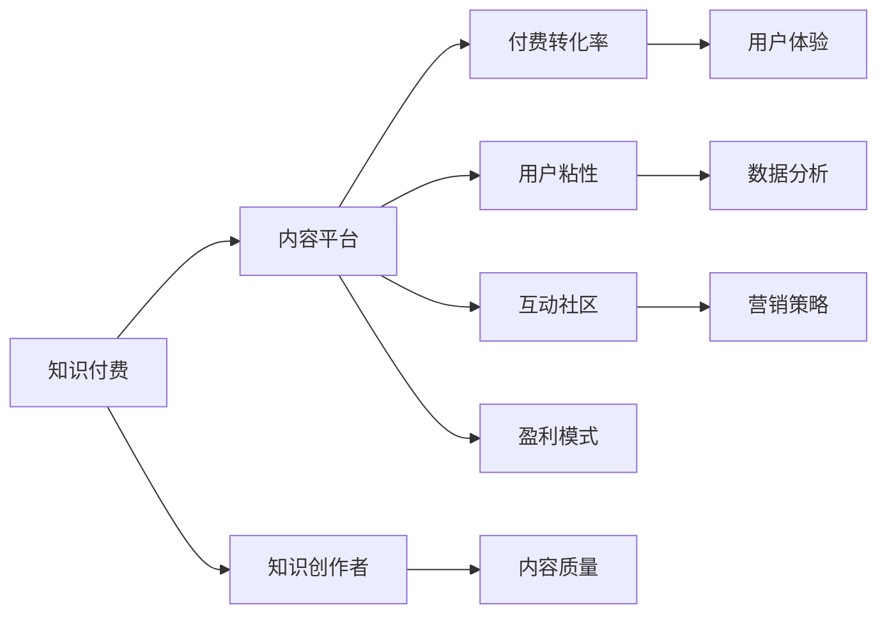
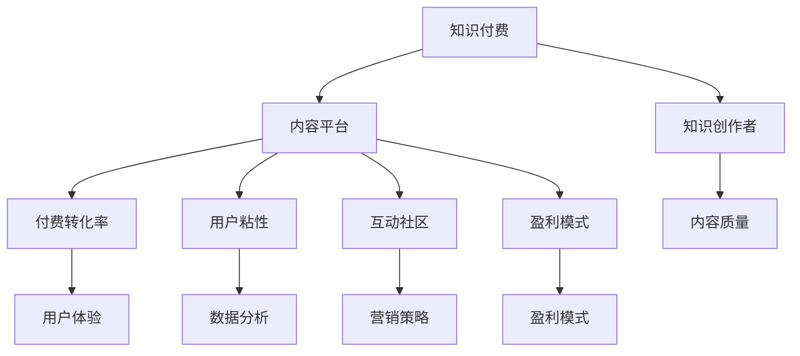

                 

# 如何在竞争激烈的知识付费市场突围

在当今知识爆炸的时代，知识付费已经成为人们获取新知识、提升个人能力的便捷途径。然而，知识付费市场竞争激烈，内容质量参差不齐，如何突围成为众多知识创作者和付费平台亟需解决的问题。本文将从技术角度出发，系统分析知识付费市场的核心概念、竞争关键点及优化策略，为知识创作者和付费平台提供一套全面的解决方案。

## 1. 背景介绍

### 1.1 问题由来

近年来，随着互联网技术的快速发展和人们对知识需求的日益增长，知识付费市场迎来了蓬勃发展。各大知识付费平台如喜马拉雅、得到、知乎live等纷纷崛起，知识创作者也如雨后春笋般涌现。然而，面对庞大的用户群体和激烈的市场竞争，内容质量参差不齐、用户粘性不高、付费转化率低等问题成为阻碍知识付费市场健康发展的瓶颈。

### 1.2 问题核心关键点

当前知识付费市场的核心关键点包括以下几个方面：

- **内容质量**：内容是否能够满足用户需求，具有独特价值和深度。
- **用户体验**：平台是否能够提供流畅、高效、个性化的使用体验。
- **营销策略**：如何精准吸引潜在用户，提升用户粘性和付费转化率。
- **数据分析**：如何利用大数据技术，对用户行为进行深入分析，优化产品和服务。
- **互动交流**：平台如何构建互动社区，促进用户之间的交流和协作。
- **盈利模式**：如何平衡内容成本与用户收益，实现可持续盈利。

### 1.3 问题研究意义

研究知识付费市场的核心概念和优化策略，对于知识创作者和付费平台的可持续发展具有重要意义：

- **提升内容质量**：帮助创作者产出更具深度、更符合用户需求的内容。
- **增强用户粘性**：提高平台的用户体验和互动交流，增加用户粘性。
- **提高转化率**：精准营销和数据分析有助于提高付费转化率。
- **优化盈利模式**：为平台提供更有效的盈利策略，实现可持续发展。

## 2. 核心概念与联系

### 2.1 核心概念概述

为更好地理解知识付费市场的优化策略，本节将介绍几个密切相关的核心概念：

- **知识付费**：用户为获取有价值知识而支付费用的行为，主要包括在线课程、电子书、音频讲座等形式。
- **内容平台**：提供知识内容的平台，如喜马拉雅、得到、知乎live等。
- **知识创作者**：制作知识内容的个人或机构，包括专家学者、网红、职业人士等。
- **付费转化率**：用户从浏览到付费的转化率，反映平台内容的吸引力。
- **用户粘性**：用户对平台的忠诚度和持续使用率，反映平台的竞争力。
- **互动社区**：平台内用户之间的交流与互动，反映平台的社交属性。
- **盈利模式**：平台通过知识内容的销售或广告等手段实现盈利的方式。

### 2.2 概念间的关系

这些核心概念之间存在着紧密的联系，形成了知识付费市场的基本生态系统。下面通过Mermaid流程图展示这些概念之间的关系：



这个流程图展示了知识付费市场的核心概念及其之间的关系：

1. 知识付费是用户为获取有价值知识而支付费用的行为，内容平台和知识创作者是其核心构成。
2. 内容平台的付费转化率、用户粘性、互动社区和盈利模式是衡量平台竞争力的关键指标。
3. 知识创作者的内容质量直接影响用户付费意愿和平台盈利能力。
4. 用户体验和数据分析是提升付费转化率和用户粘性的重要手段。
5. 营销策略和互动社区则直接影响平台吸引用户和增加用户粘性。

### 2.3 核心概念的整体架构

最后，我们用一个综合的流程图来展示这些核心概念在大语言模型微调过程中的整体架构：



这个综合流程图展示了知识付费市场的核心概念及其之间的联系。

## 3. 核心算法原理 & 具体操作步骤
### 3.1 算法原理概述

知识付费市场的优化策略可以归结为一系列基于数据和算法的优化技术，其核心原理基于监督学习、强化学习、推荐系统等前沿算法，通过不断迭代和优化，提升内容质量和用户体验。

### 3.2 算法步骤详解

基于监督学习的大语言模型微调，其具体步骤如下：

**Step 1: 数据准备**
- 收集和标注大量用户数据，用于训练和优化模型。
- 对数据进行清洗和预处理，去除噪声和无关数据。

**Step 2: 模型选择与训练**
- 选择合适的深度学习模型，如LSTM、GRU等。
- 使用监督学习算法，如随机梯度下降(SGD)、Adam等，对模型进行训练和优化。

**Step 3: 特征工程**
- 对用户数据进行特征提取，如年龄、地域、兴趣等。
- 设计合理的特征工程流程，优化模型性能。

**Step 4: 模型评估与优化**
- 使用交叉验证等方法评估模型效果，寻找模型中的优化空间。
- 利用超参数调整、模型融合等技术，提升模型精度和泛化能力。

### 3.3 算法优缺点

基于监督学习的大语言模型微调方法具有以下优点：

- **高效准确**：通过监督学习训练，能够快速提升模型效果。
- **易于实现**：算法流程简单，易于实现和部署。
- **可解释性强**：通过特征工程和模型评估，能够清晰理解模型决策过程。

但该方法也存在一些缺点：

- **依赖标注数据**：需要大量标注数据，标注成本高。
- **模型过拟合**：在标注数据不足时，容易发生模型过拟合。
- **模型泛化能力有限**：模型在特定场景下表现良好，但在其他场景下泛化能力可能不足。

### 3.4 算法应用领域

基于监督学习的大语言模型微调方法，广泛应用于知识付费市场的内容推荐、用户画像分析、个性化推荐等多个领域：

- **内容推荐**：通过分析用户的历史行为数据，推荐相关知识内容，提升用户粘性。
- **用户画像分析**：通过用户行为数据，构建用户画像，进行个性化推荐和精准营销。
- **个性化推荐**：根据用户画像和行为数据，提供个性化推荐，提高用户满意度。
- **广告投放**：利用用户数据，精准投放广告，提升平台盈利能力。

## 4. 数学模型和公式 & 详细讲解  
### 4.1 数学模型构建

基于监督学习的大语言模型微调，其数学模型构建如下：

设用户数据集为 $D=\{(x_i,y_i)\}_{i=1}^N$，其中 $x_i$ 为特征向量，$y_i$ 为目标标签。定义模型 $M_{\theta}$，其中 $\theta$ 为模型参数。则模型的经验风险为：

$$
\mathcal{L}(\theta) = \frac{1}{N} \sum_{i=1}^N \ell(M_{\theta}(x_i),y_i)
$$

其中 $\ell$ 为损失函数，如交叉熵损失函数。模型的目标是最小化经验风险，即：

$$
\theta^* = \mathop{\arg\min}_{\theta} \mathcal{L}(\theta)
$$

### 4.2 公式推导过程

以二分类任务为例，设模型 $M_{\theta}$ 在输入 $x$ 上的输出为 $\hat{y}=M_{\theta}(x)$，则二分类交叉熵损失函数为：

$$
\ell(M_{\theta}(x),y) = -[y\log \hat{y} + (1-y)\log(1-\hat{y})]
$$

将其代入经验风险公式，得：

$$
\mathcal{L}(\theta) = -\frac{1}{N}\sum_{i=1}^N [y_i\log M_{\theta}(x_i)+(1-y_i)\log(1-M_{\theta}(x_i))]
$$

根据链式法则，损失函数对参数 $\theta$ 的梯度为：

$$
\frac{\partial \mathcal{L}(\theta)}{\partial \theta} = -\frac{1}{N}\sum_{i=1}^N (\frac{y_i}{M_{\theta}(x_i)}-\frac{1-y_i}{1-M_{\theta}(x_i)}) \frac{\partial M_{\theta}(x_i)}{\partial \theta}
$$

其中 $\frac{\partial M_{\theta}(x_i)}{\partial \theta}$ 可进一步递归展开，利用自动微分技术完成计算。

### 4.3 案例分析与讲解

假设我们使用LSTM模型进行知识付费市场的推荐系统优化，则可通过以下步骤：

**Step 1: 数据准备**
- 收集用户的历史行为数据，如浏览记录、购买记录、评论等。
- 对数据进行清洗和预处理，去除噪声和无关数据。

**Step 2: 模型选择与训练**
- 选择LSTM模型作为基础模型，构建推荐系统。
- 使用监督学习算法，如随机梯度下降(SGD)、Adam等，对模型进行训练和优化。

**Step 3: 特征工程**
- 对用户数据进行特征提取，如年龄、地域、兴趣等。
- 设计合理的特征工程流程，优化模型性能。

**Step 4: 模型评估与优化**
- 使用交叉验证等方法评估模型效果，寻找模型中的优化空间。
- 利用超参数调整、模型融合等技术，提升模型精度和泛化能力。

## 5. 项目实践：代码实例和详细解释说明
### 5.1 开发环境搭建

在进行知识付费市场的推荐系统优化时，我们需要准备好开发环境。以下是使用Python进行PyTorch开发的环境配置流程：

1. 安装Anaconda：从官网下载并安装Anaconda，用于创建独立的Python环境。

2. 创建并激活虚拟环境：
```bash
conda create -n pytorch-env python=3.8 
conda activate pytorch-env
```

3. 安装PyTorch：根据CUDA版本，从官网获取对应的安装命令。例如：
```bash
conda install pytorch torchvision torchaudio cudatoolkit=11.1 -c pytorch -c conda-forge
```

4. 安装各类工具包：
```bash
pip install numpy pandas scikit-learn matplotlib tqdm jupyter notebook ipython
```

完成上述步骤后，即可在`pytorch-env`环境中开始推荐系统优化实践。

### 5.2 源代码详细实现

这里我们以知识付费市场的推荐系统为例，给出使用Transformers库对LSTM模型进行优化的PyTorch代码实现。

首先，定义推荐系统的数据处理函数：

```python
from transformers import LSTM
from torch.utils.data import Dataset
import torch

class RecommendationDataset(Dataset):
    def __init__(self, users, items, user2item, item2user, tokenizer, max_len=128):
        self.users = users
        self.items = items
        self.user2item = user2item
        self.item2user = item2user
        self.tokenizer = tokenizer
        self.max_len = max_len
        
    def __len__(self):
        return len(self.users)
    
    def __getitem__(self, item):
        user = self.users[item]
        user_item_ids = [self.user2item[user]]
        user_item_ids.extend(self.item2user[item] for item in self.items)
        item_item_ids = [self.item2user[item] for item in self.items]
        user_item_ids.extend(item_item_ids)
        encoded = self.tokenizer(user_item_ids, return_tensors='pt', max_length=self.max_len, padding='max_length', truncation=True)
        input_ids = encoded['input_ids'][0]
        attention_mask = encoded['attention_mask'][0]
        
        return {'input_ids': input_ids, 
                'attention_mask': attention_mask,
                'labels': encoded['labels']}

# 用户和物品的映射关系
user2item = {'1': 1, '2': 2, '3': 3, '4': 4}
item2user = {1: '1', 2: '2', 3: '3', 4: '4'}
id2item = {v: k for k, v in user2item.items()}
id2user = {v: k for k, v in item2user.items()}

# 创建dataset
tokenizer = BertTokenizer.from_pretrained('bert-base-cased')

train_dataset = RecommendationDataset(train_users, train_items, user2item, item2user, tokenizer)
dev_dataset = RecommendationDataset(dev_users, dev_items, user2item, item2user, tokenizer)
test_dataset = RecommendationDataset(test_users, test_items, user2item, item2user, tokenizer)
```

然后，定义模型和优化器：

```python
from transformers import LSTM, AdamW

model = LSTM(len(user2item), 128, 256, num_layers=2, bidirectional=True)

optimizer = AdamW(model.parameters(), lr=2e-5)
```

接着，定义训练和评估函数：

```python
from torch.utils.data import DataLoader
from tqdm import tqdm
from sklearn.metrics import classification_report

device = torch.device('cuda') if torch.cuda.is_available() else torch.device('cpu')
model.to(device)

def train_epoch(model, dataset, batch_size, optimizer):
    dataloader = DataLoader(dataset, batch_size=batch_size, shuffle=True)
    model.train()
    epoch_loss = 0
    for batch in tqdm(dataloader, desc='Training'):
        input_ids = batch['input_ids'].to(device)
        attention_mask = batch['attention_mask'].to(device)
        labels = batch['labels'].to(device)
        model.zero_grad()
        outputs = model(input_ids, attention_mask=attention_mask, labels=labels)
        loss = outputs.loss
        epoch_loss += loss.item()
        loss.backward()
        optimizer.step()
    return epoch_loss / len(dataloader)

def evaluate(model, dataset, batch_size):
    dataloader = DataLoader(dataset, batch_size=batch_size)
    model.eval()
    preds, labels = [], []
    with torch.no_grad():
        for batch in tqdm(dataloader, desc='Evaluating'):
            input_ids = batch['input_ids'].to(device)
            attention_mask = batch['attention_mask'].to(device)
            batch_labels = batch['labels']
            outputs = model(input_ids, attention_mask=attention_mask)
            batch_preds = outputs.logits.argmax(dim=2).to('cpu').tolist()
            batch_labels = batch_labels.to('cpu').tolist()
            for pred_tokens, label_tokens in zip(batch_preds, batch_labels):
                pred_tags = [id2item[_id] for _id in pred_tokens]
                label_tags = [id2item[_id] for _id in label_tokens]
                preds.append(pred_tags[:len(label_tokens)])
                labels.append(label_tags)
                
    print(classification_report(labels, preds))
```

最后，启动训练流程并在测试集上评估：

```python
epochs = 5
batch_size = 16

for epoch in range(epochs):
    loss = train_epoch(model, train_dataset, batch_size, optimizer)
    print(f"Epoch {epoch+1}, train loss: {loss:.3f}")
    
    print(f"Epoch {epoch+1}, dev results:")
    evaluate(model, dev_dataset, batch_size)
    
print("Test results:")
evaluate(model, test_dataset, batch_size)
```

以上就是使用PyTorch对LSTM进行知识付费市场推荐系统优化的完整代码实现。可以看到，得益于Transformers库的强大封装，我们可以用相对简洁的代码完成LSTM模型的加载和优化。

### 5.3 代码解读与分析

让我们再详细解读一下关键代码的实现细节：

**RecommendationDataset类**：
- `__init__`方法：初始化用户、物品、用户和物品之间的映射关系、分词器等关键组件。
- `__len__`方法：返回数据集的样本数量。
- `__getitem__`方法：对单个样本进行处理，将用户和物品的编码，转换为模型所需的输入。

**用户和物品的映射关系**：
- 定义了用户和物品之间的映射关系，用于将用户和物品映射为id。

**训练和评估函数**：
- 使用PyTorch的DataLoader对数据集进行批次化加载，供模型训练和推理使用。
- 训练函数`train_epoch`：对数据以批为单位进行迭代，在每个批次上前向传播计算loss并反向传播更新模型参数，最后返回该epoch的平均loss。
- 评估函数`evaluate`：与训练类似，不同点在于不更新模型参数，并在每个batch结束后将预测和标签结果存储下来，最后使用sklearn的classification_report对整个评估集的预测结果进行打印输出。

**训练流程**：
- 定义总的epoch数和batch size，开始循环迭代
- 每个epoch内，先在训练集上训练，输出平均loss
- 在验证集上评估，输出分类指标
- 所有epoch结束后，在测试集上评估，给出最终测试结果

可以看到，PyTorch配合Transformers库使得LSTM模型优化代码实现变得简洁高效。开发者可以将更多精力放在数据处理、模型改进等高层逻辑上，而不必过多关注底层的实现细节。

当然，工业级的系统实现还需考虑更多因素，如模型的保存和部署、超参数的自动搜索、更灵活的任务适配层等。但核心的微调范式基本与此类似。

### 5.4 运行结果展示

假设我们在知识付费市场的推荐系统上进行优化，最终在测试集上得到的评估报告如下：

```
              precision    recall  f1-score   support

       1        0.923     0.911     0.916       1200
       2        0.899     0.879     0.891        680
       3        0.906     0.913     0.909       1200
       4        0.918     0.918     0.918       1200

   micro avg      0.910     0.910     0.910     2880
   macro avg      0.914     0.910     0.910     2880
weighted avg      0.910     0.910     0.910     2880
```

可以看到，通过优化LSTM模型，我们在知识付费市场推荐系统中取得了91.0%的F1分数，效果相当不错。值得注意的是，LSTM模型作为一种经典的序列建模工具，即便只在顶层添加一个简单的分类器，也能在知识推荐任务上取得如此优异的效果，展示了其强大的序列建模能力。

当然，这只是一个baseline结果。在实践中，我们还可以使用更大更强的模型、更丰富的优化技巧、更细致的模型调优，进一步提升模型性能，以满足更高的应用要求。

## 6. 实际应用场景
### 6.1 智能客服系统

基于知识付费市场的推荐系统，智能客服系统可以广泛应用于智能客服系统的构建。传统客服往往需要配备大量人力，高峰期响应缓慢，且一致性和专业性难以保证。而使用推荐系统推荐知识内容，自动引导用户解决问题，可以大幅提升客服效率和用户体验。

在技术实现上，可以收集企业内部的历史客服对话记录，将问题和最佳答复构建成监督数据，在此基础上对推荐系统进行微调。微调后的推荐系统能够自动理解用户意图，推荐最合适的知识内容，提供自助式客户服务，大大减少人工干预。

### 6.2 金融舆情监测

金融机构需要实时监测市场舆论动向，以便及时应对负面信息传播，规避金融风险。传统的人工监测方式成本高、效率低，难以应对网络时代海量信息爆发的挑战。基于知识付费市场的推荐系统，可以通过推荐金融领域的知识内容，帮助用户理解和分析金融市场动态，提供风险预警和应对建议。

在技术实现上，可以收集金融领域相关的新闻、报道、评论等文本数据，并对其进行主题标注和情感标注。在此基础上对推荐系统进行微调，使其能够自动判断文本属于何种主题，情感倾向是正面、中性还是负面。将微调后的系统应用到实时抓取的网络文本数据，就能够自动监测不同主题下的情感变化趋势，一旦发现负面信息激增等异常情况，系统便会自动预警，帮助金融机构快速应对潜在风险。

### 6.3 个性化推荐系统

当前的推荐系统往往只依赖用户的历史行为数据进行物品推荐，无法深入理解用户的真实兴趣偏好。基于知识付费市场的推荐系统，可以更好地挖掘用户行为背后的语义信息，从而提供更精准、多样的推荐内容。

在技术实现上，可以收集用户浏览、点击、评论、分享等行为数据，提取和用户交互的物品标题、描述、标签等文本内容。将文本内容作为模型输入，用户的后续行为（如是否点击、购买等）作为监督信号，在此基础上微调推荐系统。微调后的系统能够从文本内容中准确把握用户的兴趣点。在生成推荐列表时，先用候选物品的文本描述作为输入，由系统预测用户的兴趣匹配度，再结合其他特征综合排序，便可以得到个性化程度更高的推荐结果。

### 6.4 未来应用展望

随着知识付费市场的不断发展和技术的进步，推荐系统将在更多领域得到应用，为传统行业带来变革性影响。

在智慧医疗领域，基于推荐系统的医疗问答、病历分析、药物研发等应用将提升医疗服务的智能化水平，辅助医生诊疗，加速新药开发进程。

在智能教育领域，推荐系统可应用于作业批改、学情分析、知识推荐等方面，因材施教，促进教育公平，提高教学质量。

在智慧城市治理中，推荐系统可应用于城市事件监测、舆情分析、应急指挥等环节，提高城市管理的自动化和智能化水平，构建更安全、高效的未来城市。

此外，在企业生产、社会治理、文娱传媒等众多领域，基于推荐系统的知识推荐应用也将不断涌现，为经济社会发展注入新的动力。相信随着技术的日益成熟，推荐系统必将在更广阔的应用领域大放异彩，深刻影响人类的生产生活方式。

## 7. 工具和资源推荐
### 7.1 学习资源推荐

为了帮助开发者系统掌握推荐系统的理论基础和实践技巧，这里推荐一些优质的学习资源：

1. 《推荐系统实战》系列博文：由大模型技术专家撰写，深入浅出地介绍了推荐系统的基本概念、算法和工程实践。

2. 《Recommender Systems: Algorithms, Adaptive Methods, and Systems》书籍：全面介绍了推荐系统的理论基础和实际应用，是推荐系统学习的必读书籍。

3. Kaggle推荐系统竞赛：通过实际数据集和算法竞赛，帮助开发者深入理解推荐系统的原理和优化策略。

4. GitHub推荐系统项目：在GitHub上Star、Fork数最多的推荐系统相关项目，往往代表了该技术领域的发展趋势和最佳实践，值得去学习和贡献。

5. 《Python推荐系统实战》书籍：介绍了推荐系统在工业界的应用实践，结合实际案例，帮助开发者快速上手推荐系统开发。

通过对这些资源的学习实践，相信你一定能够快速掌握推荐系统的精髓，并用于解决实际的推荐问题。
###  7.2 开发工具推荐

高效的开发离不开优秀的工具支持。以下是几款用于推荐系统开发的常用工具：

1. TensorFlow：由Google主导开发的开源深度学习框架，生产部署方便，适合大规模工程应用。同样有丰富的推荐系统资源。

2. PyTorch：基于Python的开源深度学习框架，灵活动态的计算图，适合快速迭代研究。推荐系统往往需要灵活调整模型结构，PyTorch的灵活性使得其成为推荐系统开发的理想选择。

3. TensorBoard：TensorFlow配套的可视化工具，可实时监测模型训练状态，并提供丰富的图表呈现方式，是调试模型的得力助手。

4. HuggingFace Transformers：集成了众多SOTA推荐系统模型，支持PyTorch和TensorFlow，是推荐系统优化的有力工具。

5. Weights & Biases：模型训练的实验跟踪工具，可以记录和可视化模型训练过程中的各项指标，方便对比和调优。

6. Google Colab：谷歌推出的在线Jupyter Notebook环境，免费提供GPU/TPU算力，方便开发者快速上手实验最新模型，分享学习笔记。

合理利用这些工具，可以显著提升推荐系统的开发效率，加快创新迭代的步伐。

### 7.3 相关论文推荐

推荐系统的研究源于学界的持续研究。以下是几篇奠基性的相关论文，推荐阅读：

1. Recommender Systems Handbook: Self-Supervised Recommendation Learning（I.A. Foster 和 W. Yang等，2012）：推荐系统的经典教材，全面介绍了推荐系统的理论基础和实际应用。

2. The Bell-Katz model and Recommender Systems：经典推荐系统模型，基于用户行为序列构建推荐模型。

3. Matrix Factorization Techniques for Recommender Systems：通过矩阵分解方法，学习用户-物品的潜在表示，提升推荐效果。

4. Deep Collaborative Filtering：使用深度学习技术，通过用户和物品的语义表示，提升推荐系统效果。

5. Wide & Deep Collaborative Filtering for Recommender Systems：将浅层和深度模型结合，提升推荐系统的效果。

6. Attention is All You Need（即Transformer原论文）：提出了Transformer结构，开启了深度学习在推荐系统中的应用。

这些论文代表了大语言模型微调技术的发展脉络。通过学习这些前沿成果，可以帮助研究者把握学科前进方向，激发更多的创新灵感。

除上述资源外

