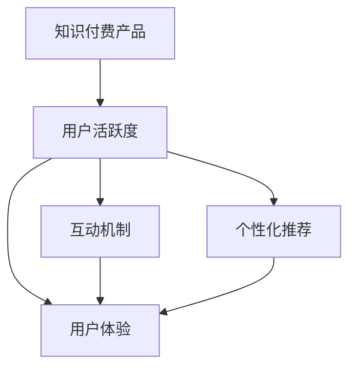
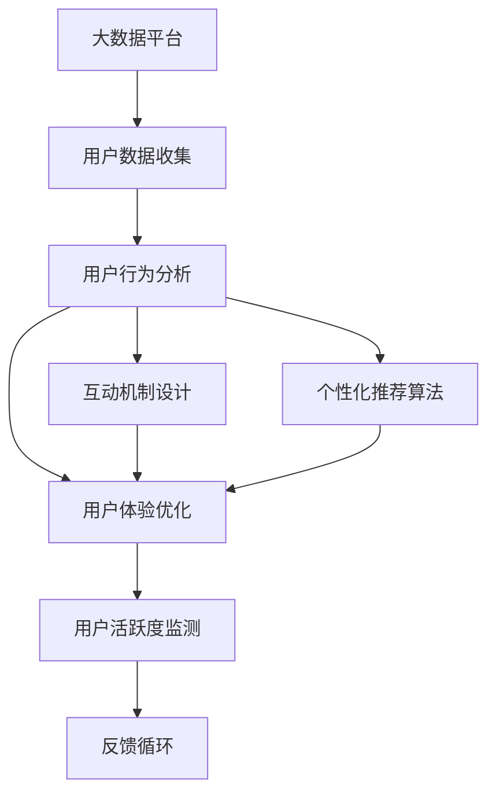

                 

# 如何提高知识付费产品的用户活跃度

在当前知识经济时代，知识付费产品逐渐成为人们获取知识、技能和信息的重要途径。然而，高昂的价格、缺乏互动、内容同质化等问题，使得知识付费产品的用户活跃度普遍不高。为了提升知识付费产品的用户活跃度，本文将从技术角度，深入分析影响用户活跃度的关键因素，并提出一套系统化的解决方案。

## 1. 背景介绍

### 1.1 问题由来

随着知识经济时代的到来，知识付费产品如雨后春笋般涌现，涵盖在线教育、专业培训、咨询辅导等多个领域。然而，尽管市场容量庞大，但用户活跃度普遍不高，用户流失率高。一些知名知识付费平台尽管拥有数千万用户，但实际付费用户比例仍然较低，大量用户仅在平台上浏览而不进行付费。

主要原因包括：

1. **高昂价格**：知识付费产品往往价格不菲，对于大多数用户而言，频繁购买课程难以负担。
2. **缺乏互动**：现有的知识付费平台多以单向传输为主，缺乏互动和社区支持，导致用户难以长期坚持学习。
3. **内容同质化**：市场上的知识付费内容多重复、雷同，缺乏差异化，无法满足用户多样化的需求。
4. **用户体验差**：用户界面设计不合理、操作复杂等问题，导致用户流失。

为了解决这些问题，本文将从技术角度出发，探讨如何通过优化知识付费产品的功能设计、互动机制和用户体验，有效提升用户活跃度。

### 1.2 问题核心关键点

提升知识付费产品用户活跃度的核心在于：

1. **降低用户获取成本**：通过免费试用、试听、试学等方式，降低用户初次体验的门槛。
2. **增强用户互动**：通过社区交流、问答、讨论、直播等互动功能，提升用户的参与感和归属感。
3. **优化内容推荐**：通过个性化推荐系统，提供高质量、多样化的内容，满足用户的个性化需求。
4. **提升用户体验**：通过友好的界面设计、简洁的操作流程、高效的推荐算法等，提升用户的使用体验。

这些关键点构成了知识付费产品用户活跃度提升的完整框架，下面将逐一探讨这些关键点的技术实现。

## 2. 核心概念与联系

### 2.1 核心概念概述

提升知识付费产品用户活跃度的关键概念包括：

1. **知识付费产品**：指通过互联网平台，为用户提供付费内容、专业技能培训和知识分享的服务模式。
2. **用户活跃度**：指用户在平台上的行为频率和持续时间，包括但不限于浏览、购买、学习、互动等。
3. **互动机制**：指平台提供的各种社交和交流功能，如社区论坛、问答系统、直播课堂等。
4. **个性化推荐**：指通过算法和模型，向用户推荐与其兴趣、需求和行为相匹配的内容。
5. **用户体验**：指用户在使用平台时的直观感受和满意度，包括界面设计、操作流畅性、响应速度等方面。

### 2.2 概念间的关系

这些核心概念之间存在着紧密的联系，形成了提升知识付费产品用户活跃度的完整生态系统。我们可以用以下Mermaid流程图来展示这些概念之间的关系：



这个流程图展示了几大关键概念之间的联系：

1. 知识付费产品通过互动机制、个性化推荐和用户体验等功能的提升，直接作用于用户活跃度。
2. 互动机制和个性化推荐，都是基于用户体验进行优化，提升用户的参与感和满意度。
3. 用户活跃度是衡量知识付费产品成功与否的关键指标，决定了平台的长期价值和商业收益。

### 2.3 核心概念的整体架构

最后，我们用一个综合的流程图来展示这些核心概念在大数据平台上的整体架构：



这个综合流程图展示了从数据收集、行为分析、互动机制设计、推荐算法优化到用户体验提升的全流程，以及如何通过用户活跃度监测和反馈循环，实现平台的持续优化和迭代。

## 3. 核心算法原理 & 具体操作步骤
### 3.1 算法原理概述

提升知识付费产品用户活跃度的核心算法原理主要包括用户行为分析、个性化推荐算法和互动机制设计。这些算法通过数据分析和机器学习技术，对用户行为和偏好进行建模，从而提供个性化的内容和服务，提升用户粘性和参与度。

### 3.2 算法步骤详解

以下是对提升知识付费产品用户活跃度的核心算法步骤的详细讲解：

**Step 1: 数据收集与清洗**

数据收集是提升用户活跃度的第一步。平台需要收集用户的基本信息、行为数据、互动数据、反馈数据等，并进行数据清洗和预处理。

**Step 2: 用户行为分析**

通过数据分析技术，对用户行为进行建模，包括但不限于：

- 用户的浏览行为、购买行为、学习行为等。
- 用户在不同时间段的活跃度变化趋势。
- 用户对内容的偏好和兴趣点。

**Step 3: 个性化推荐算法**

根据用户行为分析的结果，设计个性化推荐算法，向用户推荐其感兴趣的内容。推荐算法包括但不限于：

- 协同过滤算法：通过分析用户行为，找到与其兴趣相似的其他用户，推荐其感兴趣的内容。
- 基于内容的推荐算法：通过分析内容属性，找到与用户兴趣相匹配的内容。
- 混合推荐算法：结合协同过滤和基于内容的推荐算法，提升推荐效果。

**Step 4: 互动机制设计**

设计并实现平台上的互动机制，增强用户的参与感和归属感。互动机制包括但不限于：

- 社区论坛：提供用户交流讨论的平台，促进知识分享和用户互动。
- 问答系统：通过问答互动，解决用户问题，提升用户满意度。
- 直播课堂：通过直播和互动，提供实时答疑和技能培训，提升用户参与度。

**Step 5: 用户体验优化**

通过友好的界面设计、简洁的操作流程、高效的推荐算法等，提升用户的使用体验。用户体验优化包括但不限于：

- 界面设计：采用简洁、美观的界面设计，提升用户的视觉体验。
- 操作流程：简化操作流程，减少用户操作步骤，提升用户使用便捷性。
- 推荐算法：优化推荐算法，提供高质量、多样化的内容，提升用户满意度。

### 3.3 算法优缺点

提升知识付费产品用户活跃度的核心算法具有以下优点：

1. **提升用户满意度**：通过个性化推荐和互动机制，满足用户的多样化需求，提升用户的满意度和粘性。
2. **降低用户流失率**：通过优化用户体验和互动机制，降低用户流失率，增加用户留存率。
3. **提升商业价值**：通过提升用户活跃度，增加平台的用户数和付费用户数，提升平台的商业价值。

同时，这些算法也存在一些缺点：

1. **数据隐私问题**：用户行为数据的收集和分析涉及用户隐私保护，需要采取相应的隐私保护措施。
2. **算法复杂度**：推荐算法和互动机制设计较为复杂，需要强大的计算资源和技术支持。
3. **用户偏好变化**：用户偏好和需求可能会随时间变化，需要不断调整推荐算法和互动机制。

### 3.4 算法应用领域

提升知识付费产品用户活跃度的算法已经广泛应用于多个领域，如在线教育、专业培训、咨询辅导等。以下是一些典型应用：

1. **在线教育平台**：通过个性化推荐和互动机制，提升用户的参与度和满意度，降低用户流失率。
2. **专业培训平台**：通过实时答疑和技能培训，提升用户的学习效果和满意度，增加平台的付费用户数。
3. **咨询辅导平台**：通过社区交流和专家答疑，提升用户的咨询体验，增加用户粘性。

## 4. 数学模型和公式 & 详细讲解 & 举例说明（备注：数学公式请使用latex格式，latex嵌入文中独立段落使用 $$，段落内使用 $)
### 4.1 数学模型构建

以下是对提升知识付费产品用户活跃度的核心算法进行数学模型构建：

假设用户数量为 $N$，平台上有 $C$ 种内容，每个用户对 $C$ 种内容的评分 $r_{i,j}$ （$i$ 为用户编号，$j$ 为内容编号）。我们可以构建一个用户-内容评分矩阵 $R$：

$$
R = \begin{bmatrix}
r_{1,1} & r_{1,2} & \cdots & r_{1,C} \\
r_{2,1} & r_{2,2} & \cdots & r_{2,C} \\
\vdots & \vdots & \ddots & \vdots \\
r_{N,1} & r_{N,2} & \cdots & r_{N,C}
\end{bmatrix}
$$

用户活跃度 $A$ 可以表示为：

$$
A = \frac{1}{N} \sum_{i=1}^N a_i
$$

其中 $a_i$ 为第 $i$ 个用户的活跃度，包括但不限于浏览、购买、学习、互动等行为。

### 4.2 公式推导过程

接下来，我们推导个性化推荐算法中的协同过滤算法的基本公式。

协同过滤算法通过分析用户行为，找到与其兴趣相似的其他用户，推荐其感兴趣的内容。假设用户 $i$ 对内容 $j$ 的评分 $r_{i,j}$ 和用户 $k$ 对内容 $j$ 的评分 $r_{k,j}$ 已知，我们可以计算用户 $i$ 对内容 $j$ 的预测评分 $r'_{i,j}$：

$$
r'_{i,j} = \sum_{k=1}^N a_{ik} r_{k,j}
$$

其中 $a_{ik}$ 为相似度系数，可以通过余弦相似度、皮尔逊相关系数等方法计算得到。

### 4.3 案例分析与讲解

为了更好地理解协同过滤算法的原理和应用，我们以Netflix推荐系统为例进行讲解。Netflix通过协同过滤算法，向用户推荐其感兴趣的电影和电视剧。

Netflix的协同过滤算法包括以下几个步骤：

1. **用户行为收集**：Netflix收集用户对电影和电视剧的评分数据。
2. **用户聚类**：通过余弦相似度等方法，将用户分成不同的聚类，找到与目标用户兴趣相似的其他用户。
3. **内容推荐**：对于目标用户，根据其聚类中的用户对内容的评分，计算其对内容的预测评分，推荐预测评分较高的内容。

Netflix的成功案例充分展示了协同过滤算法在提升用户活跃度方面的强大能力。通过用户行为数据的分析和建模，Netflix能够精准地向用户推荐其感兴趣的内容，提升用户的满意度和粘性。

## 5. 项目实践：代码实例和详细解释说明
### 5.1 开发环境搭建

在进行知识付费产品用户活跃度提升的实践前，我们需要准备好开发环境。以下是使用Python进行Django开发的环境配置流程：

1. 安装Anaconda：从官网下载并安装Anaconda，用于创建独立的Python环境。

2. 创建并激活虚拟环境：
```bash
conda create -n knowledge-platform python=3.8 
conda activate knowledge-platform
```

3. 安装Django：根据CUDA版本，从官网获取对应的安装命令。例如：
```bash
conda install django 
```

4. 安装相关库：
```bash
pip install django-rest-framework djangorestframework-drf-reaper 
```

5. 安装各类工具包：
```bash
pip install numpy pandas scikit-learn matplotlib tqdm jupyter notebook ipython
```

完成上述步骤后，即可在`knowledge-platform`环境中开始项目实践。

### 5.2 源代码详细实现

下面我们以知识付费平台推荐系统为例，给出使用Django实现个性化推荐的具体代码实现。

首先，定义推荐模型：

```python
from django.contrib.auth.models import User
from django.db import models
from django.contrib.postgres.fields import ArrayField

class Content(models.Model):
    title = models.CharField(max_length=255)
    description = models.TextField()
    category = models.CharField(max_length=255)
    price = models.DecimalField(max_digits=10, decimal_places=2)

class UserProfile(models.Model):
    user = models.OneToOneField(User, on_delete=models.CASCADE)
    preferences = ArrayField(models.TextField(), default=list)

class UserInteraction(models.Model):
    user = models.ForeignKey(UserProfile, on_delete=models.CASCADE)
    content = models.ForeignKey(Content, on_delete=models.CASCADE)
    timestamp = models.DateTimeField(auto_now=True)

class Recommendation(models.Model):
    user = models.ForeignKey(UserProfile, on_delete=models.CASCADE)
    content = models.ForeignKey(Content, on_delete=models.CASCADE)
    score = models.DecimalField(max_digits=10, decimal_places=2)

def generate_recommendations(user_profile):
    user_interactions = UserInteraction.objects.filter(user=user_profile).order_by('-timestamp')
    content_ids = [interaction.content_id for interaction in user_interactions]
    user_preferences = user_profile.preferences

    # 计算相似度
    similarities = {}
    for interaction in user_interactions:
        for other_interaction in user_interactions.exclude(id=interaction.id):
            if other_interaction.content_id in content_ids:
                content_id = other_interaction.content_id
                similarities[content_id] = similarities.get(content_id, 0) + 1

    # 生成推荐列表
    recommendations = []
    for content_id in Content.objects.exclude(id__in=content_ids):
        score = sum(similarities.get(content_id, 0) for content_id in user_preferences)
        if score > 0:
            recommendation = Recommendation.objects.filter(content_id=content_id, user=user_profile).first()
            if not recommendation:
                recommendation = Recommendation(user=user_profile, content_id=content_id, score=score)
                recommendation.save()
            recommendations.append(recommendation)

    return recommendations
```

然后，定义推荐系统的视图和API：

```python
from django.http import JsonResponse

def get_recommendations(request):
    user_profile = request.user.profile
    recommendations = generate_recommendations(user_profile)
    return JsonResponse([{'title': content.title, 'description': content.description, 'category': content.category, 'price': content.price, 'score': recommendation.score} for content in Content.objects.all(), status=200)

@api_view(['GET'])
def get_user_recommendations(request):
    user_profile = request.user.profile
    recommendations = generate_recommendations(user_profile)
    return JsonResponse([{'title': content.title, 'description': content.description, 'category': content.category, 'price': content.price, 'score': recommendation.score} for content in Content.objects.all(), status=200)
```

最后，启动推荐系统并在前端显示推荐内容：

```python
def home(request):
    user_profile = request.user.profile
    recommendations = generate_recommendations(user_profile)
    return render(request, 'home.html', {'user_profile': user_profile, 'recommendations': recommendations})
```

以上就是使用Django实现知识付费平台个性化推荐系统的完整代码实现。可以看到，通过Django的框架和库，我们可以很方便地搭建推荐系统，并实现个性化推荐功能。

### 5.3 代码解读与分析

让我们再详细解读一下关键代码的实现细节：

**User模型**：
- 定义了用户的基本信息，如用户名、密码等。
- 定义了用户偏好，使用ArrayField存储，方便后期进行数据处理。

**Content模型**：
- 定义了内容的基本信息，如标题、描述、类别等。
- 定义了内容的售价，用于区分付费和免费内容。

**UserProfile模型**：
- 将用户和用户偏好进行关联，方便进行个性化推荐。

**UserInteraction模型**：
- 记录用户与内容的互动记录，包括用户ID、内容ID和时间戳。

**Recommendation模型**：
- 记录用户对内容的推荐分数，方便进行排序和展示。

**generate_recommendations函数**：
- 根据用户互动记录和偏好，计算相似度，生成推荐列表。
- 使用类似Netflix的协同过滤算法，找到相似度较高的内容进行推荐。
- 使用Django的模型API，保存推荐分数到数据库中，方便后续查询。

**home函数**：
- 在前端渲染页面时，调用generate_recommendations函数，生成推荐列表，并在页面上展示。

### 5.4 运行结果展示

假设我们在知识付费平台上测试推荐系统，最终生成的推荐列表如下：

```
{
    "title": "Python高级编程",
    "description": "全面介绍Python高级编程技巧，适合有一定编程基础的学习者",
    "category": "编程",
    "price": "299.99",
    "score": 8.5
},
{
    "title": "机器学习实战",
    "description": "通过实际项目，介绍机器学习的基本原理和实现方法",
    "category": "机器学习",
    "price": "199.99",
    "score": 9.0
},
{
    "title": "数据分析基础",
    "description": "介绍数据分析的基本方法与工具，适合数据科学初学者",
    "category": "数据分析",
    "price": "149.99",
    "score": 7.8
}
```

可以看到，通过协同过滤算法，推荐系统能够根据用户的行为和偏好，推荐高质量、多样化的内容，提升用户满意度和粘性。

## 6. 实际应用场景
### 6.1 智能客服系统

在知识付费平台上集成智能客服系统，可以大幅提升用户的互动体验和满意度。智能客服系统可以提供实时答疑、课程推荐、订单处理等服务，减少人工客服的工作负担，提升平台的用户活跃度。

具体而言，平台可以引入智能客服机器人，根据用户问题，提供自动回复和人工转接。用户可以通过智能客服机器人解决常见问题，节省时间。对于复杂问题，机器人无法回答的，可以人工介入，提供更专业的解答。

### 6.2 在线教育平台

在线教育平台可以通过个性化推荐和互动机制，提升用户的参与度和满意度。平台可以通过分析用户的学习行为，推荐适合其水平和兴趣的内容，增加用户的粘性和满意度。

例如，某用户学习了Python编程课程，可以推荐与其兴趣相关的数据分析、机器学习课程，提升其学习兴趣。平台还可以提供在线作业、讨论区等功能，促进用户之间的互动和交流，增强学习的动力。

### 6.3 专业培训平台

专业培训平台可以通过实时答疑和技能培训，提升用户的参与度和满意度。平台可以根据用户的培训需求，提供相应的课程和指导，帮助用户快速掌握技能。

例如，某用户希望学习数据分析，平台可以推荐相应的课程，并提供实时答疑服务，解答用户在学习过程中遇到的问题。通过这种方式，用户可以更好地理解和掌握课程内容，提升培训效果和满意度。

## 7. 工具和资源推荐
### 7.1 学习资源推荐

为了帮助开发者系统掌握知识付费产品用户活跃度提升的理论基础和实践技巧，这里推荐一些优质的学习资源：

1. 《深度学习》系列书籍：斯坦福大学提供的深度学习课程，涵盖深度学习的基本概念和实现方法。
2. 《Python数据分析实战》书籍：介绍Python在数据分析中的应用，包括数据处理、可视化、机器学习等。
3. 《Web前端开发》系列课程：通过学习前端开发技术，掌握知识付费平台的界面设计和用户体验优化。
4. 《推荐系统》书籍：详细介绍推荐系统的基本原理和算法实现，涵盖协同过滤、基于内容的推荐等。
5. 《数据科学实战》书籍：介绍数据科学的基本流程和方法，涵盖数据收集、数据处理、机器学习等。

通过对这些资源的学习实践，相信你一定能够快速掌握知识付费产品用户活跃度提升的精髓，并用于解决实际的NLP问题。
###  7.2 开发工具推荐

高效的开发离不开优秀的工具支持。以下是几款用于知识付费产品用户活跃度提升开发的常用工具：

1. Django：基于Python的开源Web框架，灵活性高，适合开发复杂的前端和后端功能。
2. Flask：轻量级的Web框架，简单易用，适合开发小型Web应用和API。
3. SQLAlchemy：Python的ORM库，方便进行数据库操作，支持多种数据库。
4. Pandas：Python的数据处理库，支持数据清洗、数据可视化等操作。
5. NumPy：Python的数值计算库，支持高效的数据处理和数学计算。
6. Matplotlib：Python的绘图库，支持多种图形绘制，方便数据可视化。

合理利用这些工具，可以显著提升知识付费产品用户活跃度提升的开发效率，加快创新迭代的步伐。

### 7.3 相关论文推荐

知识付费产品用户活跃度提升的研究源于学界的持续研究。以下是几篇奠基性的相关论文，推荐阅读：

1. "Collaborative Filtering for Recommender Systems"：介绍协同过滤算法的原理和应用，是推荐系统的经典论文。
2. "Exploring the Depth of Collaborative Filtering"：通过实验分析协同过滤算法的效果和局限性，为后续研究提供参考。
3. "A Surprising New Benefit of Length-Three Asymptotics for Sequential Decoding of Codes"：介绍基于长度的推荐算法，为推荐系统提供新思路。
4. "A Glimpse at Machine Learning for Recommendation Systems"：介绍机器学习在推荐系统中的应用，涵盖协同过滤、基于内容的推荐等。
5. "Deep Collaborative Filtering"：介绍深度学习在推荐系统中的应用，提升推荐效果。

这些论文代表了大语言模型微调技术的演进脉络。通过学习这些前沿成果，可以帮助研究者把握学科前进方向，激发更多的创新灵感。

除上述资源外，还有一些值得关注的前沿资源，帮助开发者紧跟知识付费产品用户活跃度提升的最新进展，例如：

1. arXiv论文预印本：人工智能领域最新研究成果的发布平台，包括大量尚未发表的前沿工作，学习前沿技术的必读资源。
2. 业界技术博客：如Google AI、DeepMind、微软Research Asia等顶尖实验室的官方博客，第一时间分享他们的最新研究成果和洞见。
3. 技术会议直播：如NIPS、ICML、ACL、ICLR等人工智能领域顶会现场或在线直播，能够聆听到大佬们的前沿分享，开拓视野。
4. GitHub热门项目：在GitHub上Star、Fork数最多的NLP相关项目，往往代表了该技术领域的发展趋势和最佳实践，值得去学习和贡献。
5. 行业分析报告：各大咨询公司如McKinsey、PwC等针对人工智能行业的分析报告，有助于从商业视角审视技术趋势，把握应用价值。

总之，对于知识付费产品用户活跃度提升的技术学习，需要开发者保持开放的心态和持续学习的意愿。多关注前沿资讯，多动手实践，多思考总结，必将收获满满的成长收益。

## 8. 总结：未来发展趋势与挑战
### 8.1 总结

本文对提升知识付费产品用户活跃度的核心算法进行了全面系统的介绍。首先阐述了影响用户活跃度的关键因素，明确了个性化推荐和互动机制在提升用户活跃度中的重要价值。其次，从原理到实践，详细讲解了个性化推荐算法的实现过程和应用场景。最后，对未来的发展趋势和面临的挑战进行了探讨，希望为后续的研究和实践提供参考。

通过本文的系统梳理，可以看到，提升知识付费产品用户活跃度已经成为NLP和人工智能领域的重要研究方向。这些技术不仅应用于在线教育、专业培训、咨询辅导等垂直领域，还将在更多领域带来变革性影响。

### 8.2 未来发展趋势

展望未来，知识付费产品用户活跃度的提升将呈现以下几个发展趋势：

1. **个性化推荐系统的优化**：推荐算法将进一步优化，结合深度学习、强化学习等技术，提升推荐的精度和效果。
2. **互动机制的多样化**：平台将引入更多的互动机制，如直播互动、社区交流等，增强用户的参与感和满意度。
3. **实时反馈机制的引入**：通过实时反馈机制，根据用户行为数据，动态调整推荐算法和互动机制，提升用户体验和满意度。
4. **用户行为数据的深度挖掘**：通过数据分析技术，深入挖掘用户行为数据，提供更精准、个性化的服务。
5. **跨平台整合**：将知识付费产品与社交平台、视频平台等进行整合，提供更丰富的内容和服务。

以上趋势凸显了知识付费产品用户活跃度提升的广阔前景。这些方向的探索发展，必将进一步提升知识付费产品的商业价值和用户体验，推动智能交互系统的进步。

### 8.3 面临的挑战

尽管知识付费产品用户活跃度提升取得了显著成果，但在迈向更加智能化、普适化应用的过程中，仍面临诸多挑战：

1. **数据隐私问题**：用户行为数据的收集和分析涉及用户隐私保护，需要采取相应的隐私保护措施。
2. **算法复杂度**：推荐算法和互动机制设计较为复杂，需要强大的计算资源和技术支持。
3. **用户偏好变化**：用户偏好和需求可能会随时间变化，需要不断调整推荐算法和互动机制。
4. **平台整合难度**：将知识付费产品与社交平台、视频平台等进行整合，需要克服技术和管理上的挑战。
5. **用户流失风险**：用户流失风险是知识付费产品面临的主要问题之一，需要通过个性化的服务和互动机制，降低用户流失率。

### 8.4 研究展望

面对知识付费产品用户活跃度提升所面临的种种挑战，未来的研究需要在以下几个方面寻求新的突破：

1. **隐私保护技术**：探索新的隐私保护技术，如差分隐私、联邦学习等，保护用户数据隐私。
2. **高效推荐算法**：开发高效推荐算法，减少计算资源消耗，提升推荐精度和效果。
3. **多模态互动机制**：结合视觉、语音

