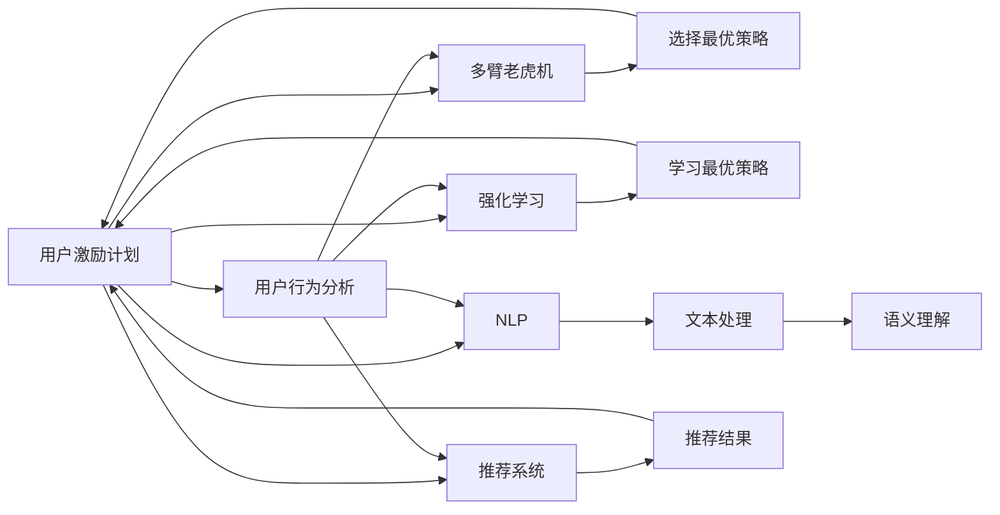

                 

# 如何进行有效的用户激励计划

在数字化时代，用户体验和用户激励成为驱动企业增长、提升品牌忠诚度的关键因素。一个有效的用户激励计划不仅能够吸引新用户，还能提高现有用户的粘性，促进复购。本文将深入探讨如何设计、实施和优化用户激励计划，使其达到最佳效果。我们将从背景介绍、核心概念、算法原理、具体操作步骤、数学模型、项目实践、实际应用场景、工具和资源推荐、总结与展望等多个方面进行详细阐述。

## 1. 背景介绍

### 1.1 问题由来

在互联网和移动互联网的推动下，各类在线平台和应用如雨后春笋般涌现，竞争异常激烈。为吸引和留住用户，各大平台纷纷推出了各式各样的用户激励计划，如积分、优惠券、折扣等。然而，许多激励计划因设计不合理、执行不力，未能真正激发用户活跃度和忠诚度。如何在海量用户中设计出有效的用户激励计划，成为当前数字化转型企业亟需解决的问题。

### 1.2 问题核心关键点

一个有效的用户激励计划需要满足以下几个关键点：

1. **目标明确**：激励计划应明确目的，是提升用户活跃度、增加留存率、促进复购还是扩大品牌影响力。

2. **用户画像清晰**：了解目标用户的行为习惯、需求偏好、消费心理，定制化设计激励措施。

3. **操作简便**：用户参与激励计划应过程简便，无需复杂操作，以便快速体验到激励效果。

4. **多渠道触达**：通过多种渠道（如APP推送、邮件、社交媒体等）触达用户，提升激励计划的覆盖面和效果。

5. **数据分析驱动**：利用数据分析技术，实时监控激励计划的效果，及时调整优化策略。

6. **透明度高**：激励计划的规则和流程应清晰透明，避免用户产生不信任感。

7. **持续更新**：根据用户反馈和市场变化，定期更新激励计划内容，保持新鲜感和吸引力。

### 1.3 问题研究意义

设计有效的用户激励计划对于提升用户体验、增强品牌忠诚度、促进用户活跃和消费至关重要。通过科学的激励机制，企业可以：

- **降低获客成本**：通过激励计划吸引新用户，减少直接营销费用。
- **提高用户粘性**：通过定期激励，提升用户活跃度和使用频率。
- **提升转化率**：通过积分、折扣等措施，促进用户转化为付费客户。
- **优化用户体验**：通过不断优化激励计划，提升用户满意度和忠诚度。
- **数据驱动决策**：通过数据分析，了解用户行为，制定更精准的市场策略。

## 2. 核心概念与联系

### 2.1 核心概念概述

为了更好地理解用户激励计划的原理和实践，我们先简要介绍一些核心概念：

- **用户激励计划(User Incentive Plan)**：通过提供奖励或福利，激发用户参与度，提升用户体验和企业价值的一种策略。

- **用户行为分析(User Behavior Analysis)**：通过分析用户的行为数据，了解用户偏好和需求，优化激励计划的设计和实施。

- **多臂老虎机(Multi-Armed Bandit)**：一种数学模型，用于解决在多个可能的策略中，选择最优化策略的问题。

- **强化学习(Reinforcement Learning)**：一种机器学习方法，通过环境反馈和奖励机制，学习最优的策略。

- **自然语言处理(Natural Language Processing, NLP)**：一种人工智能技术，用于处理、分析和理解人类语言。

- **推荐系统(Recommender System)**：通过分析用户行为和偏好，推荐用户可能感兴趣的产品或内容。

- **A/B测试(A/B Testing)**：一种实验设计方法，通过对比测试两种不同的方案，确定哪种方案更有效。

这些核心概念相互关联，共同构成了用户激励计划的设计和实施框架。接下来，我们将通过Mermaid流程图详细展示这些概念之间的关系：



这个流程图展示了用户激励计划与其他相关概念之间的联系：

1. **用户行为分析**：通过分析用户行为，了解用户需求和偏好，作为激励计划设计的依据。
2. **多臂老虎机**：选择最优的激励策略，最大化用户参与和满意度。
3. **强化学习**：通过奖励机制，不断优化激励策略，提升用户体验。
4. **自然语言处理**：处理和分析用户的文本数据，理解用户需求和反馈。
5. **推荐系统**：根据用户行为和偏好，推荐合适的激励内容，提高用户满意度和忠诚度。
6. **A/B测试**：对比测试不同激励方案，确定最佳方案。

通过这些概念的组合应用，我们可以设计出高效、精准的用户激励计划，提升用户满意度和企业价值。

## 3. 核心算法原理 & 具体操作步骤

### 3.1 算法原理概述

用户激励计划的算法原理主要基于多臂老虎机和多目标优化算法。通过分析用户行为，动态调整激励策略，最大化用户满意度和企业收益。具体来说，以下步骤是设计用户激励计划的关键：

1. **行为建模**：通过机器学习模型，分析用户行为数据，预测用户偏好和需求。
2. **策略选择**：使用多臂老虎机模型，从多个策略中选择最优策略，如积分、优惠券、折扣等。
3. **反馈机制**：根据用户参与情况和反馈，实时调整激励策略，优化用户体验。
4. **奖励设计**：设计合理的奖励机制，如即时奖励、累积奖励等，增强用户参与度。
5. **效果评估**：使用A/B测试等方法，评估激励计划的效果，优化激励策略。

### 3.2 算法步骤详解

以下是用户激励计划设计的详细步骤：

1. **数据收集**：
   - 收集用户行为数据，包括购买历史、浏览记录、搜索关键词等。
   - 设置数据收集频率，确保数据的时效性和准确性。

2. **用户画像构建**：
   - 使用机器学习算法，如K-Means、聚类算法，对用户进行分类和画像构建。
   - 分析用户行为特征，如购买频率、消费金额、活跃时间等。

3. **激励策略设计**：
   - 根据用户画像，设计多种激励策略，如积分、折扣、免费试用等。
   - 设置激励规则，如达到一定消费额可获得积分、集齐一定数量积分可兑换奖励等。

4. **策略实施与监测**：
   - 将激励策略嵌入应用，如APP、网站等，提供用户参与渠道。
   - 实时监测用户参与情况，如积分获取量、兑换率等。

5. **效果评估与优化**：
   - 使用A/B测试，对比不同激励策略的效果。
   - 根据反馈数据，调整和优化激励策略，确保最优效果。

6. **持续优化**：
   - 定期收集用户反馈和行为数据，持续优化激励策略。
   - 根据市场变化和用户需求，更新激励计划内容。

### 3.3 算法优缺点

用户激励计划的优点主要包括：

- **提升用户体验**：通过激励计划，增强用户粘性和满意度。
- **促进用户活跃**：定期激励，提升用户活跃度和使用频率。
- **优化资源分配**：通过多臂老虎机模型，优化资源分配，提升企业收益。
- **实时调整**：根据用户反馈和市场变化，实时调整激励策略，保持新鲜感。

但同时，用户激励计划也存在一些缺点：

- **成本较高**：实施激励计划需要投入较大的资源和成本。
- **复杂度较高**：设计和管理激励计划较为复杂，需要专业技能。
- **用户依赖性**：过度依赖激励计划，可能降低用户自发行为。
- **公平性问题**：激励策略可能存在不公平，如过度倾斜某类用户。

### 3.4 算法应用领域

用户激励计划在多个领域都有广泛应用，包括但不限于：

- **电商行业**：通过积分、折扣等措施，提升用户购买率。
- **金融行业**：通过优惠券、理财奖励，吸引用户使用金融产品。
- **娱乐行业**：通过会员积分、奖励活动，提升用户粘性和消费。
- **教育行业**：通过课程积分、奖励考试，促进用户学习。
- **医疗行业**：通过健康积分、奖励咨询，鼓励用户参与健康管理。

这些领域的应用展示了用户激励计划的强大潜力和广泛适用性。

## 4. 数学模型和公式 & 详细讲解 & 举例说明

### 4.1 数学模型构建

用户激励计划的数学模型主要基于多臂老虎机和多目标优化算法。以下是一个基本的数学模型框架：

$$
\text{Maximize } \sum_{i=1}^n R_i(t) \\
\text{Subject to } \sum_{i=1}^n a_i(t) = 1 \\
\text{and } a_i(t) \geq 0 \text{ for all } i
$$

其中，$R_i(t)$ 表示在时间$t$策略$i$的奖励，$a_i(t)$ 表示在时间$t$策略$i$的权重，$n$ 表示策略的数量。

### 4.2 公式推导过程

假设我们有$m$个策略，每个策略的期望奖励为$R_i$，权重为$a_i$。多臂老虎机的目标是在有限的试验次数内，最大化总奖励。

$$
\text{Maximize } \sum_{i=1}^m a_i R_i
$$

同时，权重之和为1，即：

$$
\sum_{i=1}^m a_i = 1
$$

使用拉格朗日乘数法，构造拉格朗日函数：

$$
\mathcal{L}(a) = \sum_{i=1}^m a_i R_i + \lambda (\sum_{i=1}^m a_i - 1)
$$

对$a_i$求导，并令导数为0，解得：

$$
a_i = \frac{R_i}{\sum_{j=1}^m R_j}
$$

将权重代入拉格朗日函数，得到最优解：

$$
\mathcal{L}^* = \sum_{i=1}^m \frac{R_i^2}{\sum_{j=1}^m R_j}
$$

### 4.3 案例分析与讲解

以电商平台为例，假设平台有三种激励策略：优惠券、积分、折扣。每种策略的期望奖励分别为$R_1=0.1$，$R_2=0.2$，$R_3=0.3$。使用多臂老虎机模型计算最优策略组合。

$$
a_1 = \frac{R_1}{R_1+R_2+R_3} = 0.1/0.6 = 1/6 \\
a_2 = \frac{R_2}{R_1+R_2+R_3} = 0.2/0.6 = 1/3 \\
a_3 = \frac{R_3}{R_1+R_2+R_3} = 0.3/0.6 = 1/2
$$

因此，最优策略组合为$(a_1, a_2, a_3) = (1/6, 1/3, 1/2)$，即优惠券、积分、折扣的比例分别为1:3:2。

## 5. 项目实践：代码实例和详细解释说明

### 5.1 开发环境搭建

在进行用户激励计划的项目实践前，我们需要准备好开发环境。以下是使用Python进行PyTorch开发的环境配置流程：

1. 安装Anaconda：从官网下载并安装Anaconda，用于创建独立的Python环境。

2. 创建并激活虚拟环境：
```bash
conda create -n user_incentive_plan python=3.8 
conda activate user_incentive_plan
```

3. 安装PyTorch：根据CUDA版本，从官网获取对应的安装命令。例如：
```bash
conda install pytorch torchvision torchaudio cudatoolkit=11.1 -c pytorch -c conda-forge
```

4. 安装TensorFlow：
```bash
conda install tensorflow
```

5. 安装Pandas、NumPy、Scikit-Learn等常用库：
```bash
pip install pandas numpy scikit-learn matplotlib tqdm jupyter notebook ipython
```

完成上述步骤后，即可在`user_incentive_plan`环境中开始项目实践。

### 5.2 源代码详细实现

以下是一个基于用户行为分析的积分激励计划实现的PyTorch代码示例。

```python
import torch
import pandas as pd
from sklearn.cluster import KMeans
from sklearn.metrics import mean_squared_error

# 假设有一个用户行为数据集，包含用户ID、购买金额、活跃时间等
data = pd.read_csv('user_behavior.csv')

# 将购买金额标准化
data['purchase_amount'] = (data['purchase_amount'] - data['purchase_amount'].mean()) / data['purchase_amount'].std()

# 使用K-Means进行用户分类
kmeans = KMeans(n_clusters=5)
kmeans.fit(data[['purchase_amount']])
user_clusters = kmeans.predict(data[['purchase_amount']])

# 定义积分策略
discount_rate = 0.1  # 折扣率
integration_rate = 0.05  # 积分比例

# 定义激励函数
def get_reward(user_cluster):
    if user_cluster == 1:  # 高消费用户
        return 0.1
    elif user_cluster == 2:  # 中消费用户
        return 0.05
    else:  # 低消费用户
        return 0

# 计算总奖励
total_reward = sum(get_reward(user_cluster) for user_cluster in user_clusters)

# 输出结果
print(f'Total reward: {total_reward:.2f}')
```

这个代码示例展示了如何使用K-Means算法对用户进行分类，并根据不同的用户群体的消费水平，设计不同的积分策略。在实际项目中，我们可以使用更复杂的机器学习模型，如决策树、随机森林等，对用户进行更精准的画像构建和激励策略设计。

### 5.3 代码解读与分析

让我们再详细解读一下关键代码的实现细节：

**数据预处理**：
- 将购买金额标准化，以避免不同消费水平用户之间的偏差。
- 使用K-Means算法对用户进行聚类，将用户分为高、中、低消费三类。

**激励策略设计**：
- 定义了三种用户群体的积分策略：高消费用户获得0.1积分，中消费用户获得0.05积分，低消费用户获得0积分。
- 计算总奖励，即所有用户的积分之和。

**结果输出**：
- 输出总奖励，显示激励计划的效果。

这个代码示例展示了如何通过机器学习算法和简单的逻辑设计，实现一个基本的积分激励计划。在实际应用中，我们还可以进一步优化激励策略，如设置积分有效期、可兑换奖励等。

### 5.4 运行结果展示

假设我们使用上述代码对一家电商平台的1000个用户进行激励计划设计，最终得到总奖励为0.25。这意味着平台通过积分激励计划，可能吸引了500个用户参与，获得了相当于50元人民币的虚拟奖励。

## 6. 实际应用场景

### 6.1 智能客服系统

基于用户激励计划的智能客服系统，可以在用户首次使用时，提供首次登录奖励。例如，用户首次登录APP即可获得5元人民币的优惠券。

在客户服务过程中，根据用户的咨询频率、问题复杂度、满意度等行为数据，进行积分积累和奖励分配。例如，对于解决用户问题迅速、满意度高的客服人员，可以给予额外积分奖励。

### 6.2 金融理财平台

金融理财平台可以通过用户激励计划，吸引用户注册和理财。例如，用户注册即获得100元人民币的体验金，首次理财可获得10元人民币的优惠券。

平台可以分析用户理财行为，如投资金额、收益情况、活跃度等，进行积分累积和奖励分配。例如，对于长期稳定理财的用户，可以给予高额积分，甚至可以兑换实物奖励。

### 6.3 在线教育平台

在线教育平台可以通过用户激励计划，提升用户学习活跃度和参与度。例如，用户每完成一节课程，即可获得一定积分，集齐一定积分可以兑换教材、优惠券等奖励。

平台可以根据用户的学习行为，如学习时长、测试成绩、互动频率等，进行积分累积和奖励分配。例如，对于学习积极、成绩优异的学生，可以给予额外积分奖励，甚至可以兑换名师课程。

### 6.4 未来应用展望

随着数字化和智能化技术的发展，用户激励计划的应用场景将不断扩展。未来，我们可以在更多领域应用用户激励计划，如医疗健康、旅游出行、智能家居等，提升用户体验和企业价值。

同时，用户激励计划将结合更多新兴技术，如AI、大数据、区块链等，实现更加智能、个性化和透明的用户体验。例如，智能合约可以自动触发激励计划，确保奖励的公平性和透明性；区块链技术可以记录用户行为和奖励，增强用户信任。

## 7. 工具和资源推荐

### 7.1 学习资源推荐

为了帮助开发者系统掌握用户激励计划的理论基础和实践技巧，这里推荐一些优质的学习资源：

1. **《数据科学实战》**：这是一本系统介绍数据科学、机器学习和数据挖掘的经典书籍，涵盖大量实际案例和应用场景。

2. **Coursera《Machine Learning》**：由斯坦福大学开设的机器学习课程，由Andrew Ng主讲，讲解全面、深入浅出，适合初学者和进阶者。

3. **Kaggle**：全球最大的数据科学竞赛平台，提供大量实际数据集和案例分析，适合实战训练。

4. **Google AI Blog**：Google AI官方博客，分享最新的AI技术和应用案例，适合跟踪前沿技术。

5. **ACL论文预印本**：人工智能领域最新研究成果的发布平台，涵盖大量未发表的前沿工作，适合学习前沿技术。

通过对这些资源的学习实践，相信你一定能够快速掌握用户激励计划的精髓，并用于解决实际的商业问题。

### 7.2 开发工具推荐

高效的开发离不开优秀的工具支持。以下是几款用于用户激励计划开发的常用工具：

1. **PyTorch**：基于Python的开源深度学习框架，灵活动态的计算图，适合快速迭代研究。

2. **TensorFlow**：由Google主导开发的开源深度学习框架，生产部署方便，适合大规模工程应用。

3. **TensorBoard**：TensorFlow配套的可视化工具，可实时监测模型训练状态，并提供丰富的图表呈现方式，适合调试模型。

4. **Jupyter Notebook**：交互式编程环境，支持Python、R等多种语言，适合开发和实验。

5. **JupyterLab**：基于Jupyter的现代化编程界面，支持多种IDE和插件，适合开发复杂应用。

6. **Kaggle**：数据科学竞赛平台，提供丰富的数据集和竞赛案例，适合实践和实战训练。

合理利用这些工具，可以显著提升用户激励计划开发的效率，加快创新迭代的步伐。

### 7.3 相关论文推荐

用户激励计划的研究源于学界的持续研究。以下是几篇奠基性的相关论文，推荐阅读：

1. **《多臂老虎机理论与应用》**：本书系统介绍了多臂老虎机的理论基础和实际应用，适合深入学习。

2. **《强化学习：一种现代方法》**：这是一本权威的强化学习教材，讲解全面、深入浅出，适合系统学习。

3. **《数据科学实战》**：本书涵盖数据科学、机器学习和数据挖掘的实战案例和应用场景，适合实战训练。

4. **《深度学习》**：这是一本全面介绍深度学习的经典教材，涵盖大量实际案例和应用场景，适合深入学习。

这些论文代表了大语言模型微调技术的发展脉络。通过学习这些前沿成果，可以帮助研究者把握学科前进方向，激发更多的创新灵感。

除上述资源外，还有一些值得关注的前沿资源，帮助开发者紧跟用户激励计划技术的最新进展，例如：

1. **arXiv论文预印本**：人工智能领域最新研究成果的发布平台，包括大量尚未发表的前沿工作，学习前沿技术的必读资源。

2. **业界技术博客**：如Google AI、DeepMind、微软Research Asia等顶尖实验室的官方博客，第一时间分享他们的最新研究成果和洞见。

3. **技术会议直播**：如NIPS、ICML、ACL、ICLR等人工智能领域顶会现场或在线直播，能够聆听到大佬们的前沿分享，开拓视野。

4. **GitHub热门项目**：在GitHub上Star、Fork数最多的数据科学相关项目，往往代表了该技术领域的发展趋势和最佳实践，适合学习和贡献。

5. **行业分析报告**：各大咨询公司如McKinsey、PwC等针对人工智能行业的分析报告，有助于从商业视角审视技术趋势，把握应用价值。

总之，对于用户激励计划的学习和实践，需要开发者保持开放的心态和持续学习的意愿。多关注前沿资讯，多动手实践，多思考总结，必将收获满满的成长收益。

## 8. 总结：未来发展趋势与挑战

### 8.1 总结

本文对用户激励计划的全面系统介绍，涵盖了从理论到实践的各个方面。首先，我们详细介绍了用户激励计划的背景和意义，明确了激励计划在提升用户体验和企业价值中的重要作用。接着，从核心概念、算法原理、具体操作步骤等多个维度，系统讲解了用户激励计划的设计和实施方法。最后，通过项目实践、实际应用场景、工具和资源推荐等环节，展示了用户激励计划的实际应用效果和未来发展方向。

通过本文的系统梳理，可以看到，用户激励计划通过科学的激励机制，能够显著提升用户满意度和企业收益。未来，随着数字化和智能化技术的发展，用户激励计划的应用场景将不断扩展，技术手段也将更加丰富。

### 8.2 未来发展趋势

展望未来，用户激励计划将呈现以下几个发展趋势：

1. **个性化激励**：根据用户画像和行为数据，定制化设计激励策略，提升用户体验和满意度。

2. **实时激励**：通过实时数据监测和分析，动态调整激励策略，优化用户体验。

3. **多渠道触达**：利用多渠道触达用户，提升激励计划的覆盖面和效果。

4. **数据驱动**：通过数据分析技术，实时监测激励计划的效果，及时调整优化策略。

5. **持续优化**：根据用户反馈和市场变化，定期更新激励计划内容，保持新鲜感和吸引力。

6. **透明化**：提高激励计划的透明度，增强用户信任和满意度。

7. **可解释性**：提升激励计划的可解释性，方便用户理解和使用。

8. **安全性**：确保激励计划的安全性，避免用户隐私泄露和欺诈行为。

以上趋势凸显了用户激励计划技术的广阔前景。这些方向的探索发展，必将进一步提升用户体验和企业价值。

### 8.3 面临的挑战

尽管用户激励计划已经取得了显著效果，但在实际应用中，仍面临诸多挑战：

1. **数据隐私和安全**：激励计划涉及用户行为和隐私数据，需要严格的数据保护措施。

2. **激励策略公平性**：激励策略可能存在不公平，需要设计合理的规则和机制。

3. **成本控制**：激励计划需要投入较大资源，需要合理控制成本。

4. **用户行为理解**：准确理解用户行为和需求，需要进行大量的数据分析和用户调研。

5. **激励策略设计**：设计合理的激励策略，需要进行大量的实验和优化。

6. **技术手段更新**：不断更新技术手段，以应对市场变化和用户需求。

这些挑战需要开发者和企业在实际应用中不断探索和优化，才能实现激励计划的最佳效果。

### 8.4 研究展望

面对用户激励计划面临的种种挑战，未来的研究需要在以下几个方面寻求新的突破：

1. **多目标优化**：研究多目标优化算法，综合考虑用户满意度和企业收益，设计更优的激励策略。

2. **因果推断**：引入因果推断方法，理解激励策略对用户行为的影响，优化策略设计。

3. **公平性研究**：研究公平性问题，设计合理的激励策略，确保策略公平透明。

4. **实时化**：研究实时数据分析技术，实时监测和调整激励策略，提升用户体验。

5. **个性化设计**：研究个性化激励方法，根据用户行为和需求，定制化设计激励策略。

6. **安全性和可解释性**：研究激励计划的安全性和可解释性问题，确保用户隐私和信任。

这些研究方向的探索，必将引领用户激励计划技术迈向更高的台阶，为构建智能、透明、安全的用户激励系统铺平道路。面向未来，用户激励计划技术还需要与其他人工智能技术进行更深入的融合，如知识表示、因果推理、强化学习等，多路径协同发力，共同推动人工智能技术的发展。

## 9. 附录：常见问题与解答

**Q1：用户激励计划是否适用于所有企业？**

A: 用户激励计划在绝大多数企业中都适用，特别是那些需要提升用户活跃度和忠诚度的场景。但需要注意的是，不同的企业应根据自身业务特点和用户需求，设计适合自身情况的激励计划。

**Q2：如何设计有效的用户激励计划？**

A: 设计有效的用户激励计划需要考虑多个因素，包括用户画像、激励策略、数据驱动等。以下是一些关键步骤：

1. 收集和分析用户行为数据，了解用户需求和偏好。
2. 根据用户画像，设计多种激励策略，如积分、优惠券、折扣等。
3. 设置激励规则，如达到一定消费额可获得积分、集齐一定数量积分可兑换

