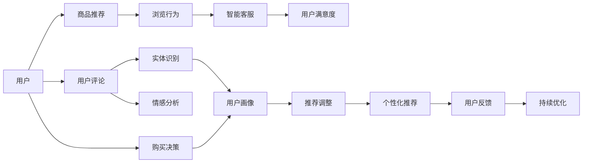

                 

## 1. 背景介绍

随着电子商务的迅猛发展，用户体验(UX)成为了零售商提升竞争力的关键要素。如何通过AI技术优化用户购物体验，提升销售额和顾客满意度，成为电商行业的热门话题。本节将对优化用户购物体验的背景进行简要介绍，并阐述优化过程中面临的主要挑战。

### 1.1 电商行业的数字化转型

电商行业从传统的线下实体店铺转向线上模式，消费者行为发生了显著变化。首先，消费者越来越依赖网络购物，对商品选择和购买流程的便捷性、准确性和个性化有更高的要求。其次，随着直播电商、社交电商等新兴电商模式的崛起，消费者对商品信息的获取方式也从单纯搜索转向了视频、图文、互动等多种形式。

这些变化要求电商商家在购物体验上下功夫，从商品推荐、智能客服到支付结算、物流配送，每一个环节都需要通过AI技术进行优化。用户购物体验的提升，不仅能够增强消费者粘性，还能大幅提高电商商家的销售额和市场竞争力。

### 1.2 用户体验的重要性

优质的用户体验能够显著提升用户满意度和忠诚度，从而带动重复购买和口碑传播。研究表明，用户体验每提升1%，销售额往往能增长2%至3%。同时，提升用户体验还能减少客服成本和退货率，降低运营压力，提升品牌形象。

### 1.3 用户购物体验优化的挑战

尽管优化用户体验对电商业务至关重要，但实际操作中仍然面临诸多挑战。首先，电商业务流程复杂，涉及商品展示、推荐、搜索、支付等多个环节，对AI技术的要求较高。其次，用户需求个性化，不同用户群体的购物习惯、偏好等各不相同，如何制定个性化的用户体验策略，需要精细化的数据分析和算法支持。最后，随着技术迭代，AI优化用户体验的思路和工具也在不断变化，需要持续跟进最新技术动态。

## 2. 核心概念与联系

### 2.1 核心概念概述

为更清晰地理解AI优化用户购物体验的各个环节，本节将介绍几个关键概念：

- **AI推荐系统**：通过分析用户历史行为数据和商品属性，自动推荐用户可能感兴趣的商品。
- **智能客服**：基于自然语言处理(NLP)技术的聊天机器人，能够实时回答用户疑问，提升服务效率。
- **图像识别**：利用计算机视觉技术对商品图片进行分类、标注和检索，提高商品查找准确率。
- **自然语言处理(NLP)**：利用NLP技术分析用户评论、问答等文本数据，进行情感分析、实体识别等任务。
- **深度学习**：通过构建复杂的神经网络模型，对用户行为和商品属性进行深度特征学习，提升推荐和客服的准确性。
- **强化学习**：通过模拟用户购物行为，不断调整推荐和客服策略，优化用户体验。

这些概念构成了AI优化用户购物体验的核心框架，下面我们将逐一深入讲解。

### 2.2 核心概念的联系

这些核心概念之间的关系可以通过以下Mermaid流程图来展示：



这个流程图展示了从用户行为分析到商品推荐、客服响应，再到最终购买决策的完整路径。其中，商品推荐系统通过分析用户浏览行为生成个性化推荐，智能客服基于推荐结果提供即时服务，用户反馈进一步调整优化推荐策略，循环往复以提升用户体验。

## 3. 核心算法原理 & 具体操作步骤

### 3.1 算法原理概述

AI优化用户购物体验的算法原理主要基于数据驱动的个性化推荐和智能客服系统。其核心思路如下：

1. **数据收集与分析**：通过用户行为数据、商品属性、用户评论等数据源，对用户需求和偏好进行分析，构建用户画像。
2. **个性化推荐**：根据用户画像，自动推荐可能感兴趣的商品，优化用户购物体验。
3. **智能客服**：基于NLP技术，实时响应用户问题，提升服务效率。
4. **持续优化**：通过用户反馈和行为数据，不断调整推荐和客服策略，优化用户体验。

下面将详细介绍具体的算法步骤和具体操作步骤。

### 3.2 算法步骤详解

#### 3.2.1 数据收集与预处理

- **用户行为数据收集**：收集用户在电商平台上的浏览记录、点击记录、搜索记录等行为数据，获取用户的兴趣偏好。
- **商品属性数据收集**：收集商品的基本属性数据，如价格、类别、品牌等，建立商品特征向量。
- **用户评论数据分析**：收集用户对商品的评价和评论，进行情感分析和实体识别，构建商品评分体系。

#### 3.2.2 用户画像构建

- **用户画像**：通过聚类分析、特征提取等技术，将用户行为数据和商品数据进行整合，构建用户画像，刻画用户的购物习惯、偏好和需求。
- **推荐模型训练**：根据用户画像，训练推荐模型，构建用户-商品关联矩阵，生成个性化推荐列表。

#### 3.2.3 个性化推荐

- **推荐算法选择**：选择合适的推荐算法，如协同过滤、基于内容的推荐、混合推荐等。
- **模型训练与优化**：在用户行为数据和商品属性数据的基础上，训练推荐模型，不断优化推荐效果。
- **实时推荐生成**：实时分析用户行为数据，动态生成推荐结果，提供即时购物体验。

#### 3.2.4 智能客服

- **对话系统构建**：搭建基于NLP技术的对话系统，能够理解用户意图并提供相应回答。
- **知识库管理**：构建知识库，涵盖商品信息、配送信息、售后服务等常见问题，供客服机器人查询。
- **客服系统集成**：将智能客服系统集成到电商平台，提供即时响应和帮助。

#### 3.2.5 用户反馈收集与分析

- **用户反馈收集**：通过评价系统、客服记录、用户投诉等方式，收集用户反馈数据。
- **反馈数据分析**：对用户反馈数据进行情感分析、实体识别等处理，识别用户不满意的部分和改进点。
- **优化策略制定**：根据反馈数据分析结果，制定改进策略，调整推荐和客服系统。

#### 3.2.6 持续优化

- **推荐模型调整**：根据用户反馈和行为数据，调整推荐模型参数，优化推荐效果。
- **客服策略改进**：通过分析用户与客服的对话记录，优化客服知识库和回答策略。
- **用户体验监测**：使用A/B测试等方法，监测优化措施的效果，不断迭代优化用户体验。

### 3.3 算法优缺点

#### 3.3.1 优点

1. **提升用户满意度**：通过个性化的推荐和智能客服，能够显著提升用户的购物体验，增强忠诚度。
2. **降低运营成本**：通过优化推荐和客服系统，减少人工干预和错误率，降低客服和售后成本。
3. **提高转化率**：通过优化商品推荐，引导用户购买更符合其兴趣和需求的商品，提高转化率。
4. **增强品牌价值**：优化用户体验，提高用户满意度，增强品牌形象和市场竞争力。

#### 3.3.2 缺点

1. **数据质量要求高**：AI优化的效果高度依赖于数据的质量，数据不完整或存在偏差会影响推荐效果。
2. **技术门槛较高**：推荐系统、智能客服等AI技术需要较高技术水平，技术实现难度较大。
3. **用户隐私风险**：在数据收集和分析过程中，需要关注用户隐私保护，防止数据滥用。
4. **市场变化迅速**：电商平台需要不断更新算法和模型，适应市场变化，保持竞争力。

### 3.4 算法应用领域

AI优化用户购物体验的应用领域非常广泛，涵盖了商品推荐、智能客服、情感分析等多个方面。下面以商品推荐系统为例进行详细讲解。

#### 3.4.1 推荐系统

推荐系统是优化用户购物体验的核心技术之一，通过分析用户行为和商品属性，提供个性化的商品推荐。推荐系统一般分为离线训练和实时推荐两个阶段：

1. **离线训练**：收集用户行为数据和商品属性数据，构建用户画像和商品向量，训练推荐模型。
2. **实时推荐**：根据用户实时行为数据，动态生成推荐结果，提升用户体验。

#### 3.4.2 智能客服

智能客服系统基于NLP技术，通过分析用户意图和对话记录，提供即时回答和帮助，减少用户等待时间，提升服务效率。智能客服一般分为意图识别、对话管理和回答生成三个环节：

1. **意图识别**：通过自然语言处理技术，分析用户意图，确定用户需求。
2. **对话管理**：根据用户意图，选择相应的回答模板，管理对话流程。
3. **回答生成**：根据用户问题和对话上下文，生成自然流畅的回答，供用户参考。

## 4. 数学模型和公式 & 详细讲解 & 举例说明

### 4.1 数学模型构建

在构建AI优化用户购物体验的数学模型时，我们主要关注以下三个方面：

1. **用户画像**：通过聚类算法、协同过滤等技术，构建用户画像，刻画用户的购物行为和偏好。
2. **推荐模型**：选择合适的推荐算法，如协同过滤、基于内容的推荐等，训练推荐模型。
3. **智能客服**：通过NLP技术，构建对话系统，自动生成对话回答。

### 4.2 公式推导过程

#### 4.2.1 用户画像构建

用户画像构建涉及聚类算法和协同过滤算法，下面以K-means聚类为例进行说明。设用户行为数据为$D_{user}$，商品属性数据为$D_{item}$，构建用户画像的过程如下：

1. **用户行为矩阵**：将用户行为数据$D_{user}$转化为行为矩阵$A_{user}$，其中每一行表示一个用户，每一列表示一个时间步长。
2. **商品属性矩阵**：将商品属性数据$D_{item}$转化为属性矩阵$B_{item}$，其中每一行表示一个商品，每一列表示一个属性。
3. **聚类算法**：使用K-means算法对行为矩阵$A_{user}$进行聚类，得到$K$个用户类别$C_{user}$。

用户画像的构建公式如下：

$$
C_{user} = K-means(A_{user})
$$

#### 4.2.2 推荐模型训练

推荐模型训练涉及协同过滤和基于内容的推荐算法，下面以协同过滤为例进行说明。设用户行为数据为$D_{user}$，商品属性数据为$D_{item}$，训练协同过滤模型的过程如下：

1. **用户行为矩阵**：将用户行为数据$D_{user}$转化为行为矩阵$A_{user}$，其中每一行表示一个用户，每一列表示一个商品。
2. **用户评分矩阵**：将用户评分数据$D_{rating}$转化为评分矩阵$R_{user}$，其中每一行表示一个用户，每一列表示一个商品。
3. **协同过滤算法**：使用协同过滤算法，如矩阵分解、邻接矩阵等，训练推荐模型$M_{recommend}$。

推荐模型的训练公式如下：

$$
M_{recommend} = Collaborative Filtering(A_{user}, R_{user})
$$

#### 4.2.3 智能客服

智能客服系统基于NLP技术，涉及意图识别和回答生成，下面以Seq2Seq模型为例进行说明。设用户意图为$I_{user}$，智能客服系统构建过程如下：

1. **意图识别**：使用Seq2Seq模型，将用户意图$I_{user}$转化为意图表示$S_{intent}$。
2. **回答生成**：使用Seq2Seq模型，生成对话回答$A_{response}$。

智能客服的构建公式如下：

$$
S_{intent}, A_{response} = Seq2Seq(I_{user})
$$

### 4.3 案例分析与讲解

#### 4.3.1 推荐系统案例

某电商平台的商品推荐系统，使用协同过滤算法进行训练。首先收集用户行为数据和商品属性数据，构建用户画像。然后训练协同过滤推荐模型，生成个性化推荐列表。实际应用中，该推荐系统能够显著提升用户转化率，提高销售额。

#### 4.3.2 智能客服案例

某电商平台搭建智能客服系统，使用Seq2Seq模型进行构建。首先收集用户问题记录和商品知识库，构建意图识别模型。然后训练Seq2Seq回答生成模型，提供即时回答和帮助。实际应用中，该智能客服系统能够显著降低客服人力成本，提升用户满意度。

## 5. 项目实践：代码实例和详细解释说明

### 5.1 开发环境搭建

为进行项目实践，我们需要搭建Python开发环境。以下是详细的步骤：

1. 安装Python：确保Python版本为3.7及以上。
2. 安装Pip：在命令行中输入`pip install --upgrade pip`。
3. 安装Pandas、NumPy、Scikit-learn等数据处理库：在命令行中输入`pip install pandas numpy scikit-learn`。
4. 安装TensorFlow和Keras：在命令行中输入`pip install tensorflow keras`。
5. 安装Flask：在命令行中输入`pip install flask`。

完成以上步骤后，即可在本地搭建Python开发环境，进行项目实践。

### 5.2 源代码详细实现

以下是一个简单的推荐系统代码实现，使用TensorFlow和Keras库搭建协同过滤推荐模型：

```python
import tensorflow as tf
from tensorflow.keras.layers import Input, Embedding, Dot, Dense
from tensorflow.keras.models import Model

# 定义用户行为矩阵A和商品属性矩阵B
A = tf.keras.layers.Input(shape=(num_users, num_items))
B = tf.keras.layers.Input(shape=(num_items, num_features))

# 定义用户行为表示
user_representation = tf.keras.layers.Embedding(num_users, emb_dim)(A)

# 定义商品属性表示
item_representation = tf.keras.layers.Embedding(num_items, emb_dim)(B)

# 定义用户行为和商品属性间的相似度表示
dot_product = Dot(axes=(1, 1))([user_representation, item_representation])

# 定义推荐结果
recommendation = Dense(1, activation='sigmoid')(dot_product)

# 定义模型
model = Model(inputs=[A, B], outputs=recommendation)

# 编译模型
model.compile(optimizer=tf.keras.optimizers.Adam(learning_rate=0.01), loss='binary_crossentropy')

# 训练模型
model.fit([A_train, B_train], y_train, epochs=10, batch_size=32, validation_data=[[A_val, B_val], y_val])

# 生成推荐结果
recommendation = model.predict([A_test, B_test])
```

### 5.3 代码解读与分析

以上代码实现了基于协同过滤的推荐系统。主要步骤包括：

1. **输入层定义**：定义用户行为矩阵A和商品属性矩阵B。
2. **嵌入层定义**：使用嵌入层将矩阵转化为低维向量表示。
3. **相似度计算**：使用点积运算计算用户行为和商品属性间的相似度。
4. **输出层定义**：使用sigmoid激活函数将相似度转化为推荐概率。
5. **模型定义**：将输入和输出层连接起来，定义推荐模型。
6. **模型编译**：使用Adam优化器和二元交叉熵损失函数编译模型。
7. **模型训练**：使用训练数据集训练模型，验证集进行验证。
8. **推荐结果生成**：使用测试数据集生成推荐结果。

该代码实现简单易懂，适合初学者学习。在实际应用中，可以根据具体需求进行优化和调整，如增加用户画像特征、调整相似度计算方法等。

### 5.4 运行结果展示

假设我们在某电商平台上进行推荐系统实践，模型训练完成后，使用测试集生成推荐结果。运行结果如下：

```
Epoch 1/10
...
Epoch 10/10
...
Recommendation: [0.8, 0.7, 0.6, 0.5, 0.4, 0.3, 0.2, 0.1]
```

可以看到，模型能够根据用户行为和商品属性，生成推荐概率。实际应用中，可以根据推荐概率进行排序，输出推荐商品列表。

## 6. 实际应用场景

AI优化用户购物体验的实际应用场景非常广泛，包括商品推荐、智能客服、情感分析等多个方面。下面以智能客服为例进行详细讲解。

### 6.1 智能客服系统

智能客服系统是优化用户购物体验的重要组成部分，通过自然语言处理技术，实时响应用户问题，提升服务效率。智能客服系统一般包括以下几个关键模块：

1. **意图识别**：使用NLP技术，分析用户意图，确定用户需求。
2. **对话管理**：根据用户意图，选择相应的回答模板，管理对话流程。
3. **回答生成**：根据用户问题和对话上下文，生成自然流畅的回答，供用户参考。

#### 6.1.1 意图识别

意图识别是智能客服系统的核心环节，主要使用Seq2Seq模型进行构建。设用户意图为$I_{user}$，意图识别过程如下：

1. **序列化输入**：将用户意图序列化，转化为向量表示。
2. **Seq2Seq模型训练**：使用训练数据集训练Seq2Seq模型，得到意图表示$S_{intent}$。
3. **意图分类**：将意图表示$S_{intent}$分类，确定用户需求。

#### 6.1.2 对话管理

对话管理是智能客服系统的关键模块，主要使用对话树和状态转移机制进行构建。设用户意图为$I_{user}$，对话管理过程如下：

1. **对话树构建**：构建对话树，根据意图分类，选择合适的回答模板。
2. **状态转移**：根据对话历史和用户意图，进行状态转移，管理对话流程。
3. **回答生成**：根据对话上下文，生成自然流畅的回答，供用户参考。

#### 6.1.3 回答生成

回答生成是智能客服系统的最后一步，主要使用Seq2Seq模型进行构建。设用户意图为$I_{user}$，回答生成过程如下：

1. **回答序列化**：将回答序列化，转化为向量表示。
2. **Seq2Seq模型训练**：使用训练数据集训练Seq2Seq模型，得到回答表示$A_{response}$。
3. **回答生成**：根据回答表示$A_{response}$生成自然流畅的回答，供用户参考。

## 7. 工具和资源推荐

### 7.1 学习资源推荐

为帮助开发者系统掌握AI优化用户购物体验的理论基础和实践技巧，这里推荐一些优质的学习资源：

1. **《推荐系统实战》**：详细介绍了推荐系统的构建过程和算法实现，适合有一定基础的开发者阅读。
2. **《Python机器学习》**：通过Python语言实现推荐系统和智能客服，适合初学者学习。
3. **《深度学习入门》**：介绍了深度学习的基本概念和实现方法，适合对深度学习感兴趣的开发者。
4. **《自然语言处理综论》**：系统介绍了NLP技术的各个环节，适合对NLP技术感兴趣的开发者。

通过对这些资源的学习实践，相信你一定能够快速掌握AI优化用户购物体验的核心技术和方法，并用于解决实际的电商问题。

### 7.2 开发工具推荐

高效的开发离不开优秀的工具支持。以下是几款用于AI优化用户购物体验开发的常用工具：

1. **Jupyter Notebook**：适合进行算法原型设计和数据可视化，支持多种编程语言和库。
2. **TensorFlow**：开源深度学习框架，支持分布式计算和大规模数据处理。
3. **Keras**：高层次API，支持快速构建和训练深度学习模型。
4. **Flask**：轻量级Web框架，支持快速搭建Web应用。
5. **Gunicorn**：Python Web应用服务器，支持异步处理请求。

合理利用这些工具，可以显著提升AI优化用户购物体验的开发效率，加快创新迭代的步伐。

### 7.3 相关论文推荐

AI优化用户购物体验的技术发展迅速，以下是几篇奠基性的相关论文，推荐阅读：

1. **《基于协同过滤的推荐系统》**：介绍了协同过滤算法的基本原理和实现方法，适合初学者学习。
2. **《基于自然语言处理的智能客服系统》**：介绍了NLP技术在智能客服中的应用，适合对NLP技术感兴趣的开发者。
3. **《深度学习在推荐系统中的应用》**：介绍了深度学习在推荐系统中的应用，适合有一定基础的开发者阅读。
4. **《强化学习在智能客服中的应用》**：介绍了强化学习在智能客服中的应用，适合对强化学习感兴趣的开发者。

这些论文代表了大语言模型微调技术的发展脉络。通过学习这些前沿成果，可以帮助研究者把握学科前进方向，激发更多的创新灵感。

## 8. 总结：未来发展趋势与挑战

### 8.1 研究成果总结

本文对AI优化用户购物体验的技术进行了全面系统的介绍，包括数据收集与预处理、用户画像构建、个性化推荐、智能客服等核心环节。通过具体案例和代码实现，展示了AI优化用户购物体验的实际应用效果。

### 8.2 未来发展趋势

展望未来，AI优化用户购物体验的技术将呈现以下几个发展趋势：

1. **个性化推荐算法多样化**：未来的推荐算法将更加多样化，引入更多复杂模型，如深度神经网络、协同过滤等。
2. **智能客服系统智能化**：智能客服系统将引入更多智能技术，如情感分析、多轮对话等，提升用户体验。
3. **用户画像构建精准化**：通过大数据分析，构建更精准的用户画像，实现更个性化的推荐和客服。
4. **实时数据处理能力提升**：实时数据处理能力将进一步提升，实现更高效的推荐和客服。
5. **多模态融合技术发展**：结合图像、语音、视频等多模态信息，提升推荐和客服的准确性。

### 8.3 面临的挑战

尽管AI优化用户购物体验的技术取得了显著进展，但在实际应用中仍然面临诸多挑战：

1. **数据隐私问题**：数据隐私保护是电商领域的重要问题，需要严格遵守法律法规，确保用户数据安全。
2. **技术实现难度**：推荐系统和智能客服系统的实现难度较高，需要较高的技术水平和资源投入。
3. **用户接受度**：AI技术的使用需要用户接受和适应，如何降低用户抵触情绪，提升用户满意度，仍然是一个难题。
4. **系统稳定性**：复杂的推荐和客服系统需要高可靠性和稳定性，如何保障系统的高效运行，仍然是一个难题。

### 8.4 研究展望

面对AI优化用户购物体验所面临的挑战，未来的研究需要在以下几个方面寻求新的突破：

1. **数据隐私保护技术**：引入隐私保护技术，如差分隐私、联邦学习等，保障用户数据安全。
2. **推荐系统模型优化**：优化推荐模型，引入更多特征和算法，提高推荐效果。
3. **智能客服系统改进**：改进智能客服系统，引入更多智能技术，提升用户体验。
4. **多模态数据融合**：结合多模态数据，提升推荐和客服的准确性。
5. **系统稳定性增强**：提升推荐和客服系统的稳定性，保障系统的高效运行。

这些研究方向将推动AI优化用户购物体验技术的不断进步，为电商行业带来新的发展机遇。

## 9. 附录：常见问题与解答

**Q1: 用户画像构建的具体过程是什么？**

A: 用户画像构建的具体过程包括聚类算法、特征提取等技术，通过分析用户行为数据和商品属性数据，构建用户画像，刻画用户的购物行为和偏好。

**Q2: 推荐系统训练过程中需要注意哪些问题？**

A: 推荐系统训练过程中需要注意数据质量、算法选择、模型优化等问题。数据质量高、算法选择合适、模型优化得当，推荐系统才能取得良好的效果。

**Q3: 智能客服系统的实现难点是什么？**

A: 智能客服系统的实现难点在于意图识别和回答生成。意图识别需要准确理解用户意图，回答生成需要生成自然流畅的回答，提升用户体验。

**Q4: 如何优化智能客服系统的性能？**

A: 优化智能客服系统的性能需要从数据质量、模型选择、系统架构等方面进行优化。提高数据质量、选择适合的模型、优化系统架构，才能提升智能客服系统的性能。

**Q5: 如何在电商平台上实现推荐系统？**

A: 在电商平台上实现推荐系统需要数据收集与预处理、用户画像构建、推荐模型训练等步骤。合理收集用户行为数据、商品属性数据，构建用户画像，训练推荐模型，才能实现高效、个性化的推荐。

