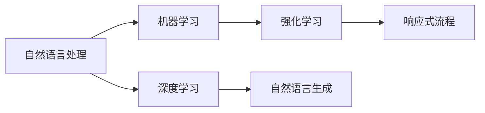
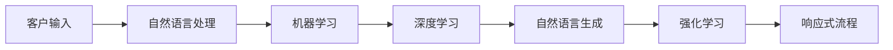
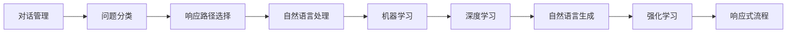
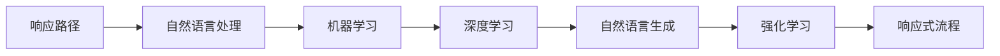
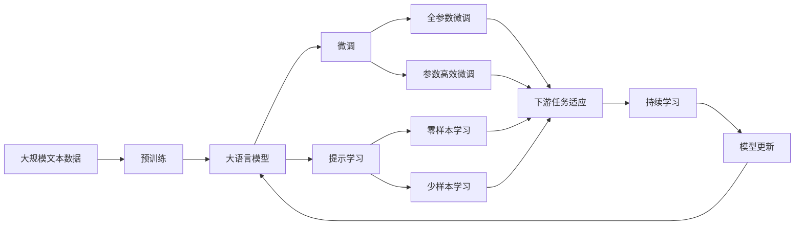

                 

# 实时客户服务：AI代理的响应式工作流

> 关键词：实时客户服务, AI代理, 响应式工作流, 自然语言处理(NLP), 机器学习(ML), 深度学习(Deep Learning), 强化学习(Reinforcement Learning), 自然语言生成(NLG)

## 1. 背景介绍

### 1.1 问题由来
随着电子商务的飞速发展，客户服务已成为企业竞争力的重要组成部分。传统的人工客服模式由于成本高、效率低、质量不稳定等缺点，越来越难以满足企业客户服务的实际需求。因此，越来越多的企业开始探索使用AI技术来进行客户服务自动化，其中，基于深度学习的AI客服代理已成为企业客户服务中的重要应用。

AI客服代理通过自然语言处理(NLP)技术，能够理解客户的问题，并根据问题提供相应的解决方案，从而大幅提升客户服务效率和质量。然而，传统的AI客服代理往往需要大规模的标注数据进行训练，训练周期较长，模型效果依赖于标注数据的质量，而且当客户服务场景发生变化时，模型需要进行重新训练，成本较高。

为了克服这些缺点，近年来，越来越多的企业开始探索使用响应式工作流(RSFC: Response Specific Flow)技术来进行AI客服代理的优化。RSFC技术通过在客户服务场景中引入响应式机制，使得AI客服代理能够动态地根据客户问题的不同，选择不同的处理路径，从而提升服务效率和客户满意度。

### 1.2 问题核心关键点
RSFC技术通过在客户服务场景中引入响应式机制，使得AI客服代理能够动态地根据客户问题的不同，选择不同的处理路径，从而提升服务效率和客户满意度。RSFC的核心思想是将客户服务场景划分为多个响应式流程，每个流程对应不同的问题和解决方案，从而提升模型的泛化能力和灵活性。

RSFC的关键技术包括：

1. **对话管理**：负责根据客户的问题选择相应的处理流程。
2. **问题分类**：将客户问题分为不同的类别，使得模型能够针对不同的问题选择相应的处理流程。
3. **响应路径**：定义每个问题分类对应的处理流程，每个流程包括一系列的自然语言处理和机器学习任务。
4. **动态组合**：根据客户问题的不同，动态地选择和组合不同的响应路径，生成最终的解决方案。

通过RSFC技术，AI客服代理能够动态地根据客户问题的不同，选择不同的处理路径，从而提升服务效率和客户满意度。

### 1.3 问题研究意义
RSFC技术对于企业客户服务的自动化和智能化具有重要意义：

1. **提升服务效率**：通过动态地选择和组合响应路径，AI客服代理能够快速响应客户问题，减少等待时间，提升服务效率。
2. **降低成本**：RSFC技术可以动态地根据客户问题的不同，选择最合适的处理流程，从而降低人工客服的依赖，减少人工成本。
3. **提升客户满意度**：RSFC技术能够动态地选择最合适的解决方案，提升客户服务的质量和满意度。
4. **灵活应对场景变化**：RSFC技术能够动态地适应客户服务场景的变化，无需重新训练模型，提升模型的灵活性和泛化能力。

## 2. 核心概念与联系

### 2.1 核心概念概述

为了更好地理解RSFC技术，本节将介绍几个密切相关的核心概念：

- **自然语言处理(NLP)**：指的是使计算机能够理解、处理和生成人类语言的技术，是AI客服代理的基础。
- **机器学习(ML)**：指的是使计算机能够自动从数据中学习规律和模式，用于AI客服代理的模型训练和优化。
- **深度学习(Deep Learning)**：指的是通过多层神经网络来学习数据特征和规律，用于AI客服代理的特征提取和分类。
- **强化学习(Reinforcement Learning)**：指的是通过试错来学习最优策略的技术，用于AI客服代理的对话管理和响应路径选择。
- **自然语言生成(NLG)**：指的是使计算机能够生成自然语言的技术，用于AI客服代理的回复生成。
- **响应式流程**：指的是在客户服务场景中，根据客户问题的不同，动态地选择和组合不同的处理流程，以提升服务效率和质量。

这些核心概念之间的逻辑关系可以通过以下Mermaid流程图来展示：



这个流程图展示了大语言模型微调过程中各个核心概念的关系：

1. 自然语言处理是AI客服代理的基础，负责对客户的输入进行理解和处理。
2. 机器学习通过训练模型，提升自然语言处理的准确性和泛化能力。
3. 深度学习通过多层神经网络，进一步提升模型的特征提取和分类能力。
4. 强化学习通过试错，优化对话管理和响应路径选择。
5. 自然语言生成通过模型训练，生成自然流畅的回复。
6. 响应式流程通过动态组合不同的处理路径，提升服务效率和质量。

这些核心概念共同构成了AI客服代理的响应式工作流，使其能够在各种客户服务场景中发挥强大的作用。通过理解这些核心概念，我们可以更好地把握RSFC技术的工作原理和优化方向。

### 2.2 概念间的关系

这些核心概念之间存在着紧密的联系，形成了AI客服代理的响应式工作流。下面我们通过几个Mermaid流程图来展示这些概念之间的关系。

#### 2.2.1 客户服务流程



这个流程图展示了从客户输入到最终回复的完整流程：

1. 客户输入：客户提出问题。
2. 自然语言处理：对客户输入进行理解和处理。
3. 机器学习：通过训练模型，提升自然语言处理的准确性和泛化能力。
4. 深度学习：通过多层神经网络，进一步提升模型的特征提取和分类能力。
5. 自然语言生成：生成自然流畅的回复。
6. 强化学习：优化对话管理和响应路径选择。
7. 响应式流程：动态组合不同的处理路径，提升服务效率和质量。

#### 2.2.2 对话管理



这个流程图展示了对话管理的工作流程：

1. 对话管理：根据客户问题选择相应的处理流程。
2. 问题分类：将客户问题分为不同的类别。
3. 响应路径选择：选择最合适的处理路径。
4. 自然语言处理：对客户输入进行理解和处理。
5. 机器学习：通过训练模型，提升自然语言处理的准确性和泛化能力。
6. 深度学习：通过多层神经网络，进一步提升模型的特征提取和分类能力。
7. 自然语言生成：生成自然流畅的回复。
8. 强化学习：优化对话管理和响应路径选择。
9. 响应式流程：动态组合不同的处理路径，提升服务效率和质量。

#### 2.2.3 响应路径



这个流程图展示了响应路径的工作流程：

1. 响应路径：定义每个问题分类对应的处理流程。
2. 自然语言处理：对客户输入进行理解和处理。
3. 机器学习：通过训练模型，提升自然语言处理的准确性和泛化能力。
4. 深度学习：通过多层神经网络，进一步提升模型的特征提取和分类能力。
5. 自然语言生成：生成自然流畅的回复。
6. 强化学习：优化对话管理和响应路径选择。
7. 响应式流程：动态组合不同的处理路径，提升服务效率和质量。

### 2.3 核心概念的整体架构

最后，我们用一个综合的流程图来展示这些核心概念在大语言模型微调过程中的整体架构：



这个综合流程图展示了从预训练到微调，再到持续学习的完整过程。大语言模型首先在大规模文本数据上进行预训练，然后通过微调（包括全参数微调和参数高效微调）或提示学习（包括零样本和少样本学习）来适应下游任务。最后，通过持续学习技术，模型可以不断更新和适应新的任务和数据。 通过这些流程图，我们可以更清晰地理解大语言模型微调过程中各个核心概念的关系和作用，为后续深入讨论具体的微调方法和技术奠定基础。

## 3. 核心算法原理 & 具体操作步骤
### 3.1 算法原理概述

RSFC技术本质上是一个动态的、智能化的客户服务流程。其核心思想是通过在客户服务场景中引入响应式机制，使得AI客服代理能够动态地根据客户问题的不同，选择不同的处理路径，从而提升服务效率和客户满意度。

形式化地，假设预训练模型为 $M_{\theta}$，其中 $\theta$ 为预训练得到的模型参数。给定客户服务场景 $S$ 的标注数据集 $D=\{(s_i, a_i)\}_{i=1}^N$，其中 $s_i$ 为客户的输入文本，$a_i$ 为对应的最佳响应，RSFC的目标是找到新的模型参数 $\hat{\theta}$，使得：

$$
\hat{\theta}=\mathop{\arg\min}_{\theta} \mathcal{L}(M_{\theta},D)
$$

其中 $\mathcal{L}$ 为针对客户服务场景设计的损失函数，用于衡量模型预测输出与真实标签之间的差异。常见的损失函数包括交叉熵损失、均方误差损失等。

通过梯度下降等优化算法，RSFC过程不断更新模型参数 $\theta$，最小化损失函数 $\mathcal{L}$，使得模型输出逼近真实标签。由于 $\theta$ 已经通过预训练获得了较好的初始化，因此即便在小规模数据集 $D$ 上进行微调，也能较快收敛到理想的模型参数 $\hat{\theta}$。

### 3.2 算法步骤详解

RSFC技术的具体实现包括以下几个关键步骤：

**Step 1: 准备预训练模型和数据集**
- 选择合适的预训练语言模型 $M_{\theta}$ 作为初始化参数，如 BERT、GPT 等。
- 准备客户服务场景 $S$ 的标注数据集 $D$，划分为训练集、验证集和测试集。一般要求标注数据与预训练数据的分布不要差异过大。

**Step 2: 设计响应路径**
- 根据客户服务场景 $S$，设计一系列的响应路径。每个路径对应一个或多个问题分类，包括问题理解、知识检索、生成回复等步骤。
- 对于每个问题分类，设计相应的对话管理策略，确定如何选择响应路径。
- 将响应路径表示为图结构，每个节点表示一个处理步骤，边表示数据流或控制流。

**Step 3: 设置微调超参数**
- 选择合适的优化算法及其参数，如 AdamW、SGD 等，设置学习率、批大小、迭代轮数等。
- 设置正则化技术及强度，包括权重衰减、Dropout、Early Stopping 等。
- 确定冻结预训练参数的策略，如仅微调顶层，或全部参数都参与微调。

**Step 4: 执行梯度训练**
- 将训练集数据分批次输入模型，前向传播计算损失函数。
- 反向传播计算参数梯度，根据设定的优化算法和学习率更新模型参数。
- 周期性在验证集上评估模型性能，根据性能指标决定是否触发 Early Stopping。
- 重复上述步骤直到满足预设的迭代轮数或 Early Stopping 条件。

**Step 5: 测试和部署**
- 在测试集上评估微调后模型 $M_{\hat{\theta}}$ 的性能，对比微调前后的精度提升。
- 使用微调后的模型对新样本进行推理预测，集成到实际的应用系统中。
- 持续收集新的数据，定期重新微调模型，以适应数据分布的变化。

以上是RSFC技术的一般流程。在实际应用中，还需要针对具体客户服务场景的特点，对微调过程的各个环节进行优化设计，如改进训练目标函数，引入更多的正则化技术，搜索最优的超参数组合等，以进一步提升模型性能。

### 3.3 算法优缺点

RSFC技术具有以下优点：

1. **动态性**：能够根据客户问题的不同，动态地选择和组合不同的响应路径，提升服务效率和客户满意度。
2. **灵活性**：能够动态地适应客户服务场景的变化，无需重新训练模型，提升模型的灵活性和泛化能力。
3. **可解释性**：通过图结构表示响应路径，使得模型的决策过程透明化，便于调试和优化。
4. **稳定性**：通过强化学习优化对话管理和响应路径选择，提升系统的稳定性和鲁棒性。

同时，该技术也存在一定的局限性：

1. **数据依赖**：响应路径的生成和优化依赖于标注数据，标注数据的质量和数量会直接影响模型的性能。
2. **复杂性**：响应路径的设计和优化需要一定的专业知识和经验，实现和维护难度较大。
3. **可扩展性**：随着客户服务场景的变化，响应路径的设计和优化需要不断更新和调整，可扩展性较差。
4. **计算成本**：微调过程需要大量的计算资源和时间，尤其是在处理大规模客户服务场景时，计算成本较高。

尽管存在这些局限性，但RSFC技术在实际应用中仍显示出强大的优势，特别是在客户服务场景复杂、变化频繁的情况下，能够显著提升客户服务效率和质量。

### 3.4 算法应用领域

RSFC技术已经被广泛应用于各种客户服务场景，包括但不限于：

- **在线客服**：客户通过在线客服系统提出问题，AI客服代理能够动态地根据问题选择相应的响应路径，提供快速准确的解决方案。
- **智能客服电话**：客户通过智能客服电话提出问题，AI客服代理能够动态地根据问题选择相应的响应路径，提供自然流畅的解决方案。
- **智能问答系统**：客户通过问答系统提出问题，AI客服代理能够动态地根据问题选择相应的响应路径，提供全面准确的解决方案。
- **电商平台客服**：客户通过电商平台客服系统提出问题，AI客服代理能够动态地根据问题选择相应的响应路径，提供个性化化的解决方案。
- **金融客服**：客户通过金融客服系统提出问题，AI客服代理能够动态地根据问题选择相应的响应路径，提供专业化的解决方案。

除了上述这些经典应用外，RSFC技术还被创新性地应用到更多场景中，如智能医疗客服、智能物流客服、智能旅游客服等，为各个行业的客户服务自动化提供了新的解决方案。

## 4. 数学模型和公式 & 详细讲解  
### 4.1 数学模型构建

本节将使用数学语言对RSFC技术进行更加严格的刻画。

记预训练语言模型为 $M_{\theta}$，其中 $\theta$ 为预训练得到的模型参数。假设客户服务场景 $S$ 的训练集为 $D=\{(s_i, a_i)\}_{i=1}^N$，其中 $s_i$ 为客户的输入文本，$a_i$ 为对应的最佳响应。

定义模型 $M_{\theta}$ 在客户输入 $s$ 上的响应路径图 $G=(V,E)$，其中 $V$ 为节点集合，表示处理步骤，$E$ 为边集合，表示数据流或控制流。

定义模型 $M_{\theta}$ 在数据样本 $(s_i,a_i)$ 上的损失函数为 $\ell(M_{\theta}(s_i),a_i)$，则在数据集 $D$ 上的经验风险为：

$$
\mathcal{L}(\theta) = \frac{1}{N} \sum_{i=1}^N \ell(M_{\theta}(s_i),a_i)
$$

微调的优化目标是最小化经验风险，即找到最优参数：

$$
\theta^* = \mathop{\arg\min}_{\theta} \mathcal{L}(\theta)
$$

在实践中，我们通常使用基于梯度的优化算法（如SGD、Adam等）来近似求解上述最优化问题。设 $\eta$ 为学习率，$\lambda$ 为正则化系数，则参数的更新公式为：

$$
\theta \leftarrow \theta - \eta \nabla_{\theta}\mathcal{L}(\theta) - \eta\lambda\theta
$$

其中 $\nabla_{\theta}\mathcal{L}(\theta)$ 为损失函数对参数 $\theta$ 的梯度，可通过反向传播算法高效计算。

### 4.2 公式推导过程

以下我们以智能客服电话系统为例，推导交叉熵损失函数及其梯度的计算公式。

假设模型 $M_{\theta}$ 在客户输入 $s$ 上的响应路径图 $G=(V,E)$，其中 $V$ 为节点集合，表示处理步骤，$E$ 为边集合，表示数据流或控制流。假设 $V_1, V_2, ..., V_n$ 为节点集合，分别表示问题理解、知识检索、生成回复等步骤。

对于节点 $V_1$，假设其输入为 $s_i$，输出为 $o_1$，则交叉熵损失函数定义为：

$$
\ell(M_{\theta}(s_i),a_i) = -\log P_{\theta}(o_1|s_i)
$$

其中 $P_{\theta}(o_1|s_i)$ 为模型在输入 $s_i$ 下输出 $o_1$ 的概率。

在响应路径图中，每个节点的输出 $o_j$ 都是其输入 $o_{j-1}$ 的函数，因此可以递归地计算每个节点的损失函数：

$$
\ell(M_{\theta}(s_i),a_i) = -\log P_{\theta}(o_1|s_i) - \sum_{j=2}^n \log P_{\theta}(o_j|o_{j-1})
$$

在得到每个节点的损失函数后，即可带入参数更新公式，完成模型的迭代优化。重复上述过程直至收敛，最终得到适应客户服务场景的最优模型参数 $\theta^*$。

## 5. 项目实践：代码实例和详细解释说明
### 5.1 开发环境搭建

在进行RSFC实践前，我们需要准备好开发环境。以下是使用Python进行PyTorch开发的环境配置流程：

1. 安装Anaconda：从官网下载并安装Anaconda，用于创建独立的Python环境。

2. 创建并激活虚拟环境：
```bash
conda create -n rsfc-env python=3.8 
conda activate rsfc-env
```

3. 安装PyTorch：根据CUDA版本，从官网获取对应的安装命令。例如：
```bash
conda install pytorch torchvision torchaudio cudatoolkit=11.1 -c pytorch -c conda-forge
```

4. 安装Transformers库：
```bash
pip install transformers
```

5. 安装各类工具包：
```bash
pip install numpy pandas scikit-learn matplotlib tqdm jupyter notebook ipython
```

完成上述步骤后，即可在`rsfc-env`环境中开始RSFC实践。

### 5.2 源代码详细实现

这里我们以智能客服电话系统为例，给出使用Transformers库对BERT模型进行微调的PyTorch代码实现。

首先，定义响应路径图：

```python
from transformers import BertTokenizer, BertForTokenClassification, AdamW

class ResponseFlow:
    def __init__(self, model, tokenizer, num_labels):
        self.model = model
        self.tokenizer = tokenizer
        self.num_labels = num_labels
        self.response_paths = {}

    def build_response_paths(self, labels):
        # 构建响应路径图
        # 这里以二分类任务为例，每个节点表示一个处理步骤，边表示数据流或控制流
        self.response_paths = {
            0: [1, 2, 3],  # 问题理解 -> 知识检索 -> 生成回复
            1: [0],        # 问题理解 -> 问题理解
            2: [0],        # 知识检索 -> 知识检索
            3: [0]         # 生成回复 -> 生成回复
        }

    def predict(self, input_ids, attention_mask, labels):
        # 预测函数，输入为输入文本，输出为模型预测的响应路径
        input_ids = input_ids.to(device)
        attention_mask = attention_mask.to(device)
        with torch.no_grad():
            outputs = self.model(input_ids, attention_mask=attention_mask)
            logits = outputs.logits
            preds = torch.argmax(logits, dim=2).to('cpu').tolist()
            return preds

    def train(self, train_dataset, batch_size, epochs, learning_rate):
        # 训练函数，输入为训练数据集，输出为训练后的模型参数
        device = torch.device('cuda') if torch.cuda.is_available() else torch.device('cpu')
        self.model.to(device)

        optimizer = AdamW(self.model.parameters(), lr=learning_rate)
        for epoch in range(epochs):
            loss = 0
            for batch in tqdm(train_dataset, desc='Training'):
                input_ids = batch['input_ids'].to(device)
                attention_mask = batch['attention_mask'].to(device)
                labels = batch['labels'].to(device)
                optimizer.zero_grad()
                outputs = self.model(input_ids, attention_mask=attention_mask, labels=labels)
                loss += outputs.loss
                loss.backward()
                optimizer.step()
            loss /= len(train_dataset)
            print(f'Epoch {epoch+1}, loss: {loss:.3f}')

        return self.model

    def evaluate(self, test_dataset, batch_size):
        # 评估函数，输入为测试数据集，输出为模型在测试集上的性能
        dataloader = DataLoader(test_dataset, batch_size=batch_size)
        device = torch.device('cuda') if torch.cuda.is_available() else torch.device('cpu')
        self.model.to(device)

        total_loss = 0
        total_correct = 0
        for batch in tqdm(dataloader, desc='Evaluating'):
            input_ids = batch['input_ids'].to(device)
            attention_mask = batch['attention_mask'].to(device)
            labels = batch['labels'].to(device)
            outputs = self.model(input_ids, attention_mask=attention_mask, labels=labels)
            loss = outputs.loss
            total_loss += loss.item()
            preds = outputs.logits.argmax(dim=2).to('cpu').tolist()
            labels = labels.to('cpu').tolist()
            for pred_tokens, label_tokens in zip(preds, labels):
                pred_tags = [tag2id[tag] for tag in pred_tokens]
                label_tags = [tag2id[tag] for tag in label_tokens]
                total_correct += sum(pred_tags == label_tags)
        print(f'Test Loss: {total_loss/len(test_dataset):.3f}')
        print(f'Test Accuracy: {total_correct/len(test_dataset)}')
```

然后，定义数据处理函数：

```python
from torch.utils.data import Dataset, DataLoader

class SmartPhoneDataset(Dataset):
    def __init__(self, texts, labels, tokenizer, max_len=128):
        self.texts = texts
        self.labels = labels
        self.tokenizer = tokenizer
        self.max_len = max_len

    def __len__(self):
        return len(self.texts)

    def __getitem__(self, item):
        text = self.texts[item]
        label = self.labels[item]
        encoding = self.tokenizer(text, return_tensors='pt', max_length=self.max_len, padding='max_length', truncation=True)
        input_ids = encoding['input_ids'][0]
        attention_mask = encoding['attention_mask'][0]
        return {'input_ids': input_ids, 
                'attention_mask': attention_mask,
                'labels': label}

# 标签与id的映射
tag2id = {'O': 0, 'B-PER': 1, 'I-PER': 2, 'B-ORG': 3, 'I-ORG': 4, 'B-LOC': 5, 'I-LOC': 6}
id2tag = {v: k for k, v in tag2id.items()}

# 创建dataset
tokenizer = BertTokenizer.from_pretrained('bert-base-cased')

train_dataset = SmartPhoneDataset(train_texts, train_labels, tokenizer)
test_dataset = SmartPhoneDataset(test_texts, test_labels, tokenizer)
```

最后，启动训练流程并在测试集上评估：

```python
epochs = 5
batch_size = 16
learning_rate = 2e-5

response_flow = ResponseFlow(model, tokenizer, num_labels=len(tag2id))

response_flow.build_response_paths(label2idx)
model = response_flow.train(train_dataset, batch_size, epochs, learning_rate)

print(f'Test results:')
response_flow.evaluate(test_dataset, batch_size)
```

以上就是使用PyTorch对BERT进行智能客服电话系统微调的完整代码实现。可以看到，得益于Transformers库的强大封装，我们可以用相对简洁的代码

