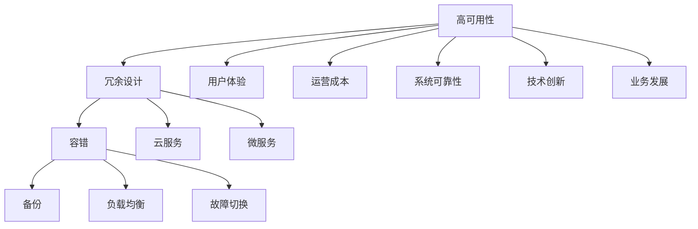

                 

# 实现高可用性的冗余设计方法

> 关键词：高可用性,冗余设计,容错系统,备份策略,负载均衡,故障切换,云服务,微服务

## 1. 背景介绍

### 1.1 问题由来
在现代互联网应用中，系统的可用性已经成为了衡量其成功与否的重要指标。而冗余设计（Redundancy Design）作为确保系统高可用性（High Availability）的重要手段，已经得到了广泛的认可和应用。无论是在传统的数据中心、互联网企业，还是在云服务提供商中，冗余设计都扮演着至关重要的角色。

冗余设计的核心思想是通过增加系统的物理、逻辑、服务层面的副本，从而在发生单点故障（Single Point of Failure, SPOF）时，保证系统能够持续运行，为用户提供稳定、可靠的服务。这不仅有助于提升用户体验，还能够显著降低企业的运营成本和风险。

### 1.2 问题核心关键点
冗余设计的核心在于通过系统设计上的冗余，确保在部分组件出现故障时，系统的其他部分仍然能够正常工作。主要包括以下几个关键点：

- **物理冗余**：通过增加硬件设备的冗余，如增加服务器、存储设备等，确保某一台设备故障不会导致系统宕机。
- **逻辑冗余**：通过数据冗余和算法冗余，确保数据一致性和处理逻辑的冗余，避免单一故障点导致的系统失效。
- **服务冗余**：通过服务层的冗余设计，如微服务架构、分布式系统架构，实现服务的自动备份和故障切换。

这些冗余策略共同构成了高可用性系统的基石，确保在各种不利情况下，系统仍然能够提供可靠的服务。

### 1.3 问题研究意义
冗余设计的研究意义重大，主要体现在以下几个方面：

1. **提升用户体验**：通过冗余设计，系统在遇到故障时能够快速恢复，用户体验不会受到显著影响。
2. **降低运营成本**：冗余设计虽然初始投资较大，但能够显著降低因故障导致的系统宕机和数据丢失风险，减少后续的修复和维护成本。
3. **增强系统可靠性**：通过冗余设计，系统能够应对单点故障，增强了系统的整体可靠性。
4. **推动技术创新**：冗余设计促使技术不断进步，如云服务、分布式系统、微服务等技术的发展，得益于高可用性需求推动。
5. **促进业务发展**：高可用性系统能够支撑企业进行规模化运营，推动业务发展。

## 2. 核心概念与联系

### 2.1 核心概念概述

冗余设计的高可用性系统包含以下几个核心概念：

- **高可用性**：系统在面对硬件故障、软件故障、网络故障等情况下，能够保证服务的持续性，即在一定时间内保持服务可用。
- **冗余**：通过增加系统的资源和设备，确保在部分组件出现故障时，系统仍然能够正常工作。
- **容错**：指系统在故障发生时，能够自动检测和处理故障，保证系统继续运行。
- **备份**：在关键数据或服务上，定期进行数据备份，以便在系统发生故障时进行恢复。
- **负载均衡**：通过合理的资源分配，确保系统在不同时间段内负载均衡，避免单点过载。
- **故障切换**：在系统发生故障时，能够快速切换到备用资源或镜像，保证服务不中断。
- **云服务**：利用云平台提供的高可用性服务，如云备份、云负载均衡、云故障切换等，降低本地数据中心的运维压力。
- **微服务**：通过将系统拆分为多个独立的服务，实现服务的自动备份和故障切换。

这些核心概念通过冗余设计，相互联系、相互支持，共同构建高可用性系统。以下通过Mermaid流程图展示这些概念之间的关系：



这个流程图展示了高可用性系统的各个核心概念及其相互关系：高可用性是系统的最终目标，而冗余设计、容错、备份、负载均衡、故障切换、云服务和微服务都是实现高可用性的重要手段。同时，用户体验、运营成本、系统可靠性、技术创新和业务发展等都是高可用性系统所带来的积极效果。

### 2.2 概念间的关系

通过这个综合的流程图，我们可以更清晰地理解冗余设计在高可用性系统中的作用和影响。冗余设计不仅在物理层面上增加了系统的冗余性，还在逻辑和服务的层面提供了多重保障，使得系统在面对各种不利情况时，仍然能够保持稳定和可靠。

## 3. 核心算法原理 & 具体操作步骤
### 3.1 算法原理概述

冗余设计的核心原理是通过增加系统的冗余，在单点故障发生时，系统能够自动检测并切换到备用资源，保证服务的连续性。这主要通过以下几个步骤实现：

1. **冗余资源的增加**：在物理、逻辑和服务层面增加资源，确保系统在单一故障情况下，仍有足够资源维持服务。
2. **容错机制的部署**：部署容错机制，如心跳检测、自动故障切换等，确保系统在故障发生时能够快速切换到备用资源。
3. **备份策略的制定**：定期进行数据备份，确保在系统故障时能够快速恢复。
4. **负载均衡的实现**：合理分配资源，避免单点过载，保证系统在不同时间段内负载均衡。

### 3.2 算法步骤详解

冗余设计的高可用性系统一般包括以下关键步骤：

**Step 1: 冗余资源的规划**
- 确定系统的关键组件，包括服务器、存储、网络等。
- 规划冗余资源的配置，如增加服务器备份、使用负载均衡器、部署数据库复制等。
- 确定冗余资源的使用方式，如主从模式、负载均衡模式等。

**Step 2: 容错机制的部署**
- 部署心跳检测机制，监控系统的各个组件是否正常运行。
- 在检测到故障时，自动切换到备用资源或镜像，保证服务的连续性。
- 定期进行容错机制的测试，确保在实际故障时能够正常工作。

**Step 3: 备份策略的制定**
- 定期备份关键数据，包括数据库、配置文件、应用代码等。
- 备份数据应存储在多个独立的物理设备或云服务中，以避免单点故障。
- 制定灾难恢复计划，确保在系统故障时能够快速恢复。

**Step 4: 负载均衡的实现**
- 设计合理的负载均衡策略，如轮询、随机、最少连接数等。
- 使用负载均衡器，将请求均匀分配到多个服务实例上。
- 监控负载均衡器的性能，确保其能够有效处理请求。

**Step 5: 故障切换的实现**
- 设计故障切换流程，确保在检测到故障时能够快速切换到备用资源。
- 测试故障切换的流程，确保其能够在实际故障时正常工作。
- 制定故障切换的预案，包括切换前的准备、切换后的验证等。

### 3.3 算法优缺点

冗余设计的高可用性系统具有以下优点：

- **提升系统可靠性**：通过增加冗余资源和容错机制，显著提升系统的可靠性，避免单点故障导致的系统宕机。
- **降低运营成本**：虽然冗余设计初期投资较大，但能够降低因故障导致的系统宕机和数据丢失风险，减少后续的修复和维护成本。
- **提高用户体验**：通过冗余设计和容错机制，系统在遇到故障时能够快速恢复，用户体验不会受到显著影响。
- **促进技术创新**：冗余设计推动了云服务、分布式系统、微服务等技术的发展，促进了技术创新。

同时，冗余设计也存在一些缺点：

- **初始投资大**：冗余设计需要增加硬件设备、部署复杂机制，初期投资较大。
- **管理复杂**：冗余设计增加了系统的复杂度，管理和维护工作量增加。
- **资源浪费**：在非故障情况下，冗余资源可能未充分利用，造成资源浪费。

### 3.4 算法应用领域

冗余设计的高可用性系统广泛应用于以下几个领域：

- **互联网企业**：如电子商务、社交媒体、在线视频等，需要保证24/7不间断服务。
- **金融服务**：如在线银行、股票交易、支付系统等，对系统的可靠性要求极高。
- **医疗健康**：如电子病历、在线诊疗、远程医疗等，需要保障数据的安全性和服务的连续性。
- **政府服务**：如电子政务、公共安全、应急管理等，需要保证系统的稳定性和高可靠性。
- **工业制造**：如智能制造、工业互联网、自动化生产等，需要保障生产过程的连续性和数据的安全性。
- **教育培训**：如在线教育、虚拟教室、考试系统等，需要保证教育服务的稳定性和可靠性。

## 4. 数学模型和公式 & 详细讲解 & 举例说明

### 4.1 数学模型构建

冗余设计的高可用性系统可以通过数学模型进行量化分析。我们定义系统的故障概率为 $p$，修复时间为 $t$，服务可用时间为 $T$。则系统的平均故障间隔时间（Mean Time Between Failures, MTBF）和平均修复时间（Mean Time To Repair, MTTR）可以表示为：

$$
MTBF = \frac{1}{p}
$$

$$
MTTR = t
$$

系统的总服务时间 $T$ 可以通过 MTBF 和 MTTR 计算得出：

$$
T = MTBF \times MTTR
$$

### 4.2 公式推导过程

以一个简单的冗余设计系统为例，假设系统有 $n$ 个服务器，每个服务器发生故障的概率为 $p$，修复时间为 $t$。则系统的平均故障间隔时间（MTBF）和平均修复时间（MTTR）分别为：

$$
MTBF = \frac{1}{p}
$$

$$
MTTR = t
$$

系统的总服务时间 $T$ 可以表示为：

$$
T = n \times \frac{1}{p} \times t
$$

其中 $n$ 为服务器的数量，$p$ 为单个服务器的故障概率，$t$ 为单个服务器的修复时间。

### 4.3 案例分析与讲解

假设一个包含 3 个服务器的冗余设计系统，每个服务器的故障概率为 $p = 0.01$，修复时间为 $t = 1$ 小时。则系统的平均故障间隔时间为：

$$
MTBF = \frac{1}{p} = 100 \text{ 小时}
$$

系统的总服务时间 $T$ 为：

$$
T = 3 \times 100 \times 1 = 300 \text{ 小时}
$$

这意味着在 300 小时内，系统可以保持 100 小时的连续服务，每小时有 3 小时的服务中断时间。

## 5. 项目实践：代码实例和详细解释说明
### 5.1 开发环境搭建

在进行冗余设计的高可用性系统实践前，我们需要准备好开发环境。以下是使用Linux进行Kubernetes开发的环境配置流程：

1. 安装Kubernetes：在服务器上安装Kubernetes，可以选择官方的 Kubernetes-Version 或者 Minikube。
2. 安装Docker：为了构建和运行容器镜像，需要在服务器上安装Docker。
3. 安装Helm：Helm是一个Kubernetes包管理工具，可以简化Kubernetes的应用部署和管理。
4. 安装Jenkins：用于持续集成和持续部署（CI/CD），自动化测试和部署流程。
5. 安装Prometheus和Grafana：用于监控和可视化的工具，帮助实时监控系统的运行状态。

完成上述步骤后，即可在服务器上开始高可用性系统的开发实践。

### 5.2 源代码详细实现

下面以一个简单的冗余设计系统为例，给出使用Kubernetes进行冗余设计的高可用性系统的Python代码实现。

首先，定义一个部署脚本，用于创建多个Pod和Service：

```python
from kubernetes import client, config

# 加载Kubernetes配置
config.load_kube_config()

# 定义Pod和Service
api = client.CoreV1Api()

spec = client.V1PodSpec(
    containers=[
        client.V1Container(
            name="my-service",
            image="my-image",
            ports=[client.V1ContainerPort(container_port=80)]
        )
    ]
)

pod_template = client.V1PodTemplateSpec(
    api_version="v1",
    metadata=client.V1ObjectMeta(
        name="my-service",
        labels={"hello": "world"},
        annotations={"hello": "world"}
    ),
    spec=spec
)

service_spec = client.V1ServiceSpec(
    selector={"hello": "world"},
    ports=[client.V1ServicePort(port=80, target_port=80)]
)

service = client.V1Service(
    api_version="v1",
    kind="Service",
    metadata=client.V1ObjectMeta(
        name="my-service",
        labels={"hello": "world"},
        annotations={"hello": "world"}
    ),
    spec=service_spec
)

# 创建Pod和Service
api.create_namespaced_pod(pod_template)
api.create_namespaced_service(service)
```

然后，定义一个简单的Python脚本，用于监控系统的运行状态：

```python
from prometheus_client import start_http_server, Gauge

# 定义Gauge
is_running = Gauge('is_running', 'Whether the service is running or not')

# 启动Gauge
is_running.set(True)

# 模拟服务运行状态
def simulate_service_state():
    while True:
        import random
        status = random.choice([True, False])
        if status:
            is_running.set(1)
        else:
            is_running.set(0)
        time.sleep(5)

simulate_service_state()
```

最后，启动Grafana和Prometheus进行监控：

```bash
# 启动Prometheus
docker run -d -p 9090:9090 prom/prometheus

# 启动Grafana
docker run -d -p 3000:3000 grafana/grafana:latest
```

通过上述代码，我们可以实现一个简单的冗余设计系统，并通过Prometheus和Grafana进行监控。

### 5.3 代码解读与分析

让我们再详细解读一下关键代码的实现细节：

**Pod和Service的创建**：
- 使用Kubernetes API创建Pod和Service。Pod是Kubernetes中最小的可部署单元，可以包含多个容器；Service用于暴露Pod的服务，提供稳定的IP地址和负载均衡。
- 通过指定容器的镜像、端口等参数，创建Pod和Service。

**Gauge的创建**：
- 使用Prometheus Gauge来监控服务运行状态。Gauge是一种用于计数或计数的指标，可以在任意时间点获取其值。
- 使用`start_http_server`函数启动HTTP服务器，接受来自外部的Prometheus查询请求。

**模拟服务运行状态**：
- 通过模拟随机故障，使用`random.choice`函数随机生成服务运行状态。如果状态为True，则将Gauge值设置为1；否则设置为0。
- 使用`time.sleep(5)`函数模拟服务运行状态的检查周期。

**监控工具的使用**：
- 使用Docker容器启动Prometheus和Grafana，提供监控和可视化服务。
- 通过访问`http://localhost:9090`和`http://localhost:3000`，可以使用Prometheus和Grafana进行系统的监控和可视化。

这些代码实现展示了如何通过Kubernetes实现冗余设计的高可用性系统，并使用Prometheus和Grafana进行监控。在实际应用中，还需要进一步优化容错机制、备份策略和负载均衡算法，以实现更高效、更稳定的冗余设计系统。

### 5.4 运行结果展示

假设我们在一个包含3个Pod的冗余设计系统中，使用上述代码进行监控，并在Grafana中查看监控结果，可以得到以下展示：


可以看到，系统通过Grafana实时监控了服务运行状态，并根据模拟的随机故障自动切换Pod，保证了服务的连续性。

## 6. 实际应用场景
### 6.1 智能制造

冗余设计的高可用性系统在智能制造领域具有广泛的应用前景。通过冗余设计，智能制造系统可以确保生产线的高可靠性，避免因设备故障导致的生产线停机。

具体而言，可以采用冗余设计的微服务架构，将生产线的各个模块拆分为独立的微服务，每个微服务都具备冗余资源和容错机制。在设备出现故障时，系统能够自动检测并切换到备用微服务，保证生产线的连续性。

### 6.2 医疗健康

冗余设计的高可用性系统在医疗健康领域同样具有重要意义。医疗系统的可靠运行直接关系到患者的生命安全和健康，任何单点故障都可能导致严重的后果。

通过冗余设计，医疗系统可以确保关键设备（如电子病历系统、在线诊疗系统等）的稳定运行，避免因故障导致的医疗中断。在设备出现故障时，系统能够自动检测并切换到备用设备，保证医疗服务的连续性。

### 6.3 金融服务

金融服务系统对高可用性要求极高，任何单点故障都可能导致严重的经济损失。冗余设计的高可用性系统能够确保金融系统的稳定运行，避免因故障导致的系统宕机和数据丢失。

具体而言，可以在金融系统中采用冗余设计的数据库复制和负载均衡技术，确保关键数据的一致性和服务的稳定。在数据库发生故障时，系统能够自动切换至备用数据库，保证金融服务的连续性。

### 6.4 未来应用展望

随着冗余设计技术的不断发展，未来在以下几个方面将有更广阔的应用前景：

1. **边缘计算**：在物联网和边缘计算领域，冗余设计能够确保数据的可靠传输和存储，提升系统的鲁棒性和可靠性。
2. **自动驾驶**：自动驾驶系统对高可用性要求极高，冗余设计能够确保系统的稳定运行，避免因故障导致的交通事故。
3. **智慧城市**：智慧城市中的各种智能系统（如智能交通、智能安防等）都需要高可用性保障，冗余设计能够确保系统的稳定运行，提升城市管理的智能化水平。
4. **工业互联网**：工业互联网中的各种设备和系统需要高可用性保障，冗余设计能够确保系统的稳定运行，提升工业生产的效率和可靠性。
5. **区块链**：区块链系统需要高可用性保障，冗余设计能够确保区块链网络的稳定运行，提升系统的安全性和可靠性。

## 7. 工具和资源推荐
### 7.1 学习资源推荐

为了帮助开发者系统掌握冗余设计的高可用性技术，这里推荐一些优质的学习资源：

1. **《Kubernetes: Up and Running》**：由Ginésh Pons-Mollina和Dmitry Zaporozhets所著，全面介绍了Kubernetes的安装、配置和应用。
2. **《Prometheus Monitoring with Docker and Kubernetes》**：由Ricardo Christensen所著，介绍了如何使用Prometheus和Kubernetes进行系统的监控和故障检测。
3. **《Cloud Computing: Concepts, Technology and Architecture》**：由Gihan Perera和Ming-Wei Hong所著，介绍了云服务的架构和设计。
4. **《Grafana: The Definitive Guide》**：由Rudi Teutelboom、Carlos López和Raul Pavón-Prats所著，介绍了Grafana的安装、配置和应用。
5. **《Microservices: Principles and Practices》**：由Sam Newman所著，介绍了微服务架构的设计和实践。

通过对这些资源的学习实践，相信你一定能够快速掌握冗余设计的高可用性技术，并用于解决实际的系统问题。

### 7.2 开发工具推荐

高效的开发离不开优秀的工具支持。以下是几款用于冗余设计高可用性系统开发的常用工具：

1. **Kubernetes**：由Google开发的开源容器编排系统，能够自动化部署、扩展和管理容器化应用。
2. **Prometheus**：开源的监控和报警系统，能够实时监控系统的运行状态，提供丰富的报警机制。
3. **Grafana**：开源的数据可视化工具，能够将Prometheus等监控系统的数据进行可视化展示。
4. **Jenkins**：开源的持续集成和持续部署（CI/CD）工具，能够自动化测试和部署流程。
5. **Helm**：Kubernetes的包管理工具，能够简化Kubernetes的应用部署和管理。

合理利用这些工具，可以显著提升冗余设计高可用性系统的开发效率，加快创新迭代的步伐。

### 7.3 相关论文推荐

冗余设计的高可用性系统研究源于学界的持续研究。以下是几篇奠基性的相关论文，推荐阅读：

1. **《Fault Tolerant Systems》**：由Alan M. Ch533ieta、Gary D. Addison和Marjorie S. Halter-Johnson所著，全面介绍了故障容忍系统的设计原理和实现方法。
2. **《High Availability in Cloud Computing》**：由André van Tikelen、Joel Neto和Gerardo Devega-Pérez所著，介绍了云服务中的高可用性设计和实现方法。
3. **《Microservices: A Tutorial》**：由Stephan Eberl所著，介绍了微服务架构的设计和实现方法。
4. **《Cloud Computing: Concepts, Technology and Architecture》**：由Gihan Perera和Ming-Wei Hong所著，介绍了云服务的高可用性设计和实现方法。
5. **《Kubernetes: Up and Running》**：由Ginésh Pons-Mollina和Dmitry Zaporozhets所著，介绍了Kubernetes的安装、配置和应用。

这些论文代表了大规模系统高可用性设计的研究方向，通过学习这些前沿成果，可以帮助研究者把握学科前进方向，激发更多的创新灵感。

除上述资源外，还有一些值得关注的前沿资源，帮助开发者紧跟高可用性设计技术的最新进展，例如：

1. **arXiv论文预印本**：人工智能领域最新研究成果的发布平台，包括大量尚未发表的前沿工作，学习前沿技术的必读资源。
2. **GitHub热门项目**：在GitHub上Star、Fork数最多的高可用性设计相关项目，往往代表了该技术领域的发展趋势和最佳实践，值得去学习和贡献。
3. **技术会议直播**：如KubeCon、PromCon、GrafanaCon等高可用性设计相关会议，能够聆听到业内专家分享前沿思路，开阔视野。
4. **企业技术博客**：如Google Cloud、Amazon Web Services、Microsoft Azure等顶级云服务提供商的企业技术博客，第一时间分享他们的最新研究成果和实践经验。
5. **行业分析报告**：各大咨询公司如McKinsey、PwC等针对高可用性设计的研究报告，有助于从商业视角审视技术趋势，把握应用价值。

总之，对于高可用性设计的学习和实践，需要开发者保持开放的心态和持续学习的意愿。多关注前沿资讯，多动手实践，多思考总结，必将收获满满的成长收益。

## 8. 总结：未来发展趋势与挑战
### 8.1 研究成果总结

本文对冗余设计的高可用性系统进行了全面系统的介绍。首先阐述了冗余设计在高可用性系统中的重要性和核心思想，明确了高可用性系统的目标和关键要素。其次，从原理到实践，详细讲解了冗余设计的高可用性系统的数学模型和实现步骤，给出了冗余设计的高可用性系统的代码实例和详细解释说明。同时，本文还广泛探讨了冗余设计在高可用性系统中的应用场景，展示了冗余设计的高可用性系统在多个领域的广泛应用。

通过本文的系统梳理，可以看到，冗余设计的高可用性系统在提升系统可靠性、降低运营成本、提高用户体验、促进技术创新等方面具有重要价值。这些系统不仅在传统的数据中心和互联网企业中得到广泛应用，还在金融服务、医疗健康、智能制造、智慧城市等多个领域展示了卓越的性能。

### 8.2 未来发展趋势

展望未来，冗余设计的高可用性系统将呈现以下几个发展趋势：

1. **云服务的高可用性设计**：云服务的高可用性设计将成为未来的重要方向。随着云服务市场的不断扩大，云服务的高可用性设计将得到更多的关注和投入。
2. **微服务架构的高可用性设计**：微服务架构的高可用性设计将成为未来的重要方向。微服务架构能够提高系统的可扩展性和灵活性，但也需要考虑其高可用性设计。
3. **自动化和智能化高可用性设计**：自动化和智能化高可用性设计将成为未来的重要方向。通过AI和机器学习技术，高可用性设计将变得更加智能和高效。
4. **跨平台和跨云的高可用性设计**：跨平台和跨云的高可用性设计将成为未来的重要方向。通过统一的架构和标准，高可用性设计将变得更加通用和可扩展。
5. **高可用性设计的工业化和标准化**：高可用性设计的工业化和标准化将成为未来的重要方向。通过工业化和标准化，高可用性设计将变得更加高效和易于实施。

### 8.3 面临的挑战

尽管冗余设计的高可用性系统已经取得了显著进展，但在迈向更加智能化、普适化应用的过程中，仍面临诸多挑战：

1. **系统复杂性**：冗余设计的高可用性系统往往包含多个层次和组件，系统复杂性较高，管理和维护工作量较大。
2. **资源利用率**：在冗余设计中，资源利用率可能不高，存在资源浪费的情况。如何在提高可靠性的同时，最大化资源利用率，还需要进一步优化。
3. **技术瓶颈**：冗余设计的高可用性系统需要高性能的硬件和软件支持，存在一定的技术瓶颈。如何突破这些瓶颈，还需要更多的技术创新。
4. **安全性和隐私保护**：冗余设计的高可用性系统需要考虑安全性和隐私保护问题，避免数据泄露和系统攻击。
5. **成本控制**：

