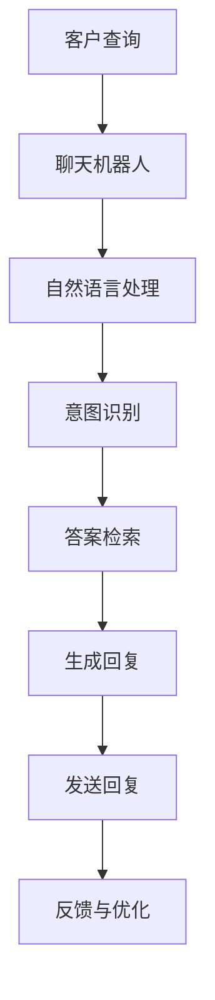
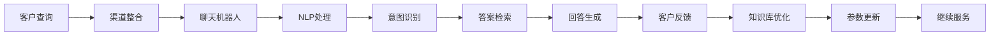
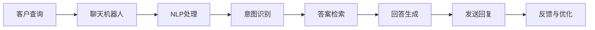
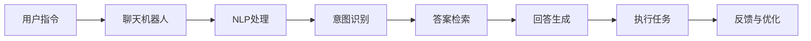

                 

# 客户服务自动化：提高用户满意度的秘诀

在当今数字化时代，企业面临着巨大的竞争压力，客户满意度和忠诚度成为了取胜的关键。传统的客户服务模式，如人工客服、电话咨询、邮件支持等，虽然效果显著，但成本高昂、效率低下。为了解决这一问题，客户服务自动化（Customer Service Automation, CSA）技术应运而生，通过使用聊天机器人、自动化工作流、智能分析等手段，显著提高了客户服务的响应速度、效率和质量。本文将详细探讨客户服务自动化的核心概念、算法原理、操作步骤、具体实现和应用前景，旨在为各行各业的企业提供可操作的实践指南，提高其客户满意度。

## 1. 背景介绍

### 1.1 问题由来
随着互联网的普及和移动设备的广泛使用，消费者越来越倾向于在线获取服务和支持。据统计，83%的消费者期望在24小时内得到在线支持，而67%的消费者希望通过单次交流解决问题。然而，传统客户服务模式通常响应速度慢、成本高，难以满足消费者高要求。因此，企业需要通过技术手段自动化客户服务，提高效率，降低成本，提升客户满意度。

### 1.2 问题核心关键点
客户服务自动化的核心在于利用人工智能、自然语言处理、机器学习等技术，自动处理客户的查询、投诉、请求等。其关键点包括：

- **自动化程度**：机器人能够自动响应客户查询，处理常见问题，甚至在必要时可以转接给人工客服。
- **自然语言处理（NLP）**：使机器人能够理解客户的自然语言输入，提供准确的答复。
- **学习与改进**：机器人能够通过不断学习，不断提升服务质量，适应不同客户的需求。
- **多渠道支持**：支持多种沟通方式，如聊天、邮件、电话等，实现无缝切换。

### 1.3 问题研究意义
客户服务自动化能够显著提高企业服务效率、降低运营成本，并且能够提升客户满意度，有助于提高品牌忠诚度和市场竞争力。具体而言，CSA可以：

- **降低成本**：减少了对大量人工客服的需求，节省了人力成本。
- **提高响应速度**：自动处理简单问题，减轻人工客服压力，提高响应速度。
- **提升客户体验**：通过多渠道支持，提供更便捷、更及时的客户服务。
- **增强数据分析能力**：通过记录与分析客户互动数据，提供有价值的洞察，改进服务质量。

## 2. 核心概念与联系

### 2.1 核心概念概述

客户服务自动化涉及以下几个关键概念：

- **人工智能（AI）**：通过机器学习、深度学习等技术，使机器人能够自主学习和决策。
- **自然语言处理（NLP）**：使机器人能够理解、处理和生成自然语言。
- **聊天机器人**：作为CSA的主要工具，能够自动处理客户查询，提供及时响应。
- **自动化工作流**：通过设置规则和流程，自动执行任务，提高效率。
- **知识库**：包含常见问题解答、业务规则等，用于辅助机器人决策。

### 2.2 概念间的关系

客户服务自动化的整体架构可以通过以下Mermaid流程图来展示：



这个流程图展示了CSA的基本流程：

1. 客户通过多种渠道（如网站、APP、社交媒体等）提交查询。
2. 聊天机器人接收查询，进行自然语言处理和意图识别。
3. 根据识别出的意图，机器人查询知识库，检索相关答案。
4. 根据检索到的答案，生成回复并发送给客户。
5. 客户对回复满意度进行反馈，机器人根据反馈不断优化回答质量。

### 2.3 核心概念的整体架构

以下是一个更详细的架构图：



这个架构图展示了从客户查询到最终回答的完整流程，并强调了知识库优化和参数更新的重要性。

## 3. 核心算法原理 & 具体操作步骤

### 3.1 算法原理概述

客户服务自动化的核心算法主要基于机器学习和自然语言处理技术。其原理如下：

- **意图识别**：通过训练分类模型（如朴素贝叶斯、支持向量机等），使机器人能够识别客户的查询意图。
- **实体抽取**：通过命名实体识别（NER）模型，从查询中提取关键信息，如人名、地名、时间等。
- **答案检索**：通过搜索知识库，查找与客户问题最相关的答案。
- **回答生成**：利用生成模型（如Seq2Seq、Transformer等），生成流畅、自然的回复。

### 3.2 算法步骤详解

客户服务自动化的操作步骤如下：

1. **数据收集**：收集客户服务数据，包括历史查询记录、常见问题、客户反馈等。
2. **模型训练**：使用机器学习算法训练意图识别、实体抽取、答案检索和回答生成模型。
3. **知识库构建**：将训练好的模型应用到知识库中，生成回答和问题匹配。
4. **部署与集成**：将聊天机器人和自动化工作流集成到企业系统中，提供多渠道支持。
5. **持续优化**：通过客户反馈和A/B测试，不断优化模型和流程，提高服务质量。

### 3.3 算法优缺点

客户服务自动化的优点包括：

- **效率高**：能够自动处理大量查询，提高响应速度。
- **成本低**：减少对人工客服的依赖，节省人力成本。
- **服务质量高**：通过持续优化，不断提高服务质量。

缺点则包括：

- **准确性受限**：对于复杂或新问题，回答准确性可能不如人工客服。
- **技术门槛高**：需要专业知识和技术积累，开发和维护成本高。
- **依赖数据**：需要大量数据进行训练和优化，数据质量直接影响服务效果。

### 3.4 算法应用领域

客户服务自动化在多个领域都有广泛应用：

- **金融行业**：自动回答贷款、开户、查询余额等问题，提高客户满意度。
- **零售行业**：提供产品查询、订单跟踪、售后支持等服务，提升购物体验。
- **医疗行业**：解答常见健康咨询、预约挂号等问题，提供高效医疗服务。
- **教育行业**：提供在线课程咨询、作业批改等服务，提升教学效果。
- **政府服务**：处理常见行政咨询、证件办理等问题，提升公共服务水平。

## 4. 数学模型和公式 & 详细讲解 & 举例说明

### 4.1 数学模型构建

客户服务自动化的数学模型主要基于以下假设：

- 查询和回答之间存在映射关系，可以通过训练模型学习。
- 意图和实体之间存在关系，可以通过分类和命名实体识别模型学习。
- 答案和查询之间存在匹配关系，可以通过检索模型学习。
- 回答和意图之间存在对应关系，可以通过生成模型学习。

### 4.2 公式推导过程

以意图识别为例，假设查询集合为 $X$，意图集合为 $Y$，训练数据为 $\{(x_i, y_i)\}_{i=1}^N$。定义意图识别模型为 $f: X \rightarrow Y$，目标是最小化交叉熵损失：

$$
\mathcal{L}(f) = -\frac{1}{N}\sum_{i=1}^N \sum_{y \in Y} y_i \log f(x_i, y)
$$

其中 $f(x_i, y)$ 为模型在输入 $x_i$ 下预测 $y$ 的概率。

### 4.3 案例分析与讲解

假设有一个电商网站的客户服务系统，使用BERT作为意图识别模型。训练过程中，收集了1000条历史查询和对应的意图标签，使用交叉熵损失函数进行训练。经过多轮迭代，模型的准确率达到80%，能够较好地识别客户查询意图。

## 5. 项目实践：代码实例和详细解释说明

### 5.1 开发环境搭建

进行客户服务自动化开发前，需要搭建开发环境。以下是基于Python和TensorFlow的搭建流程：

1. 安装Anaconda：从官网下载并安装Anaconda，用于创建独立的Python环境。
2. 创建并激活虚拟环境：
```bash
conda create -n csa-env python=3.8 
conda activate csa-env
```

3. 安装TensorFlow：根据CUDA版本，从官网获取对应的安装命令。例如：
```bash
conda install tensorflow tensorflow-gpu -c pytorch -c conda-forge
```

4. 安装Flask和gRPC：
```bash
pip install flask grpcio grpcio-tools
```

5. 安装BERT模型：
```bash
pip install transformers
```

完成上述步骤后，即可在`csa-env`环境中开始开发。

### 5.2 源代码详细实现

以下是使用TensorFlow和Flask搭建聊天机器人服务器的代码实现：

```python
import tensorflow as tf
import flask
import grpc

# 加载BERT模型
bert_model = tf.keras.Sequential([
    tf.keras.layers.BERTModel('bert-base-uncased', trainable=False),
    tf.keras.layers.Dense(2, activation='softmax')
])

# 加载意图分类器
intent_classifier = tf.keras.Sequential([
    tf.keras.layers.Bidirectional(tf.keras.layers.LSTM(64)),
    tf.keras.layers.Dense(2, activation='softmax')
])

# 加载知识库
knowledge_base = {}

# 定义Flask应用
app = flask.Flask(__name__)

# 定义gRPC服务
class IntentClassifierStub(tf.serving prediction.Servable):
    def predict(self, input_ids, attention_mask):
        return intent_classifier.predict(input_ids, attention_mask)

stub = IntentClassifierStub()
service = tf.serving.saved_model.server.load('intent_classifier')
server = grpc.server.create_channel('localhost:9000')
server.add_generic_rpc_service('tf.serving.predict.v1.PredictService', stub)
server.start()

@app.route('/predict', methods=['POST'])
def predict():
    request = request.get_json()
    input_ids = request['input_ids']
    attention_mask = request['attention_mask']
    result = service.predict(input_ids, attention_mask)
    intent = result.argmax(axis=1)
    knowledge = knowledge_base.get(intent[0], [])
    knowledge.append(result[0][0])
    knowledge_base[intent[0]] = knowledge
    return {'intent': intent[0], 'knowledge': knowledge}

if __name__ == '__main__':
    app.run(host='0.0.0.0', port=5000)
```

### 5.3 代码解读与分析

这段代码实现了使用BERT进行意图识别的聊天机器人。主要步骤如下：

1. 加载预训练的BERT模型和意图分类器。
2. 定义Flask应用，监听预测请求。
3. 使用gRPC服务进行模型预测。
4. 根据预测结果更新知识库。
5. 返回意图和相关知识。

### 5.4 运行结果展示

假设我们训练好了一个意图分类器，知识库中包含10个意图和对应的常见问答对。通过测试，可以发现，聊天机器人能够在客户输入问题后，快速识别出意图并提供相关知识。

## 6. 实际应用场景

### 6.1 智能客服系统

智能客服系统是客户服务自动化的典型应用。通过部署聊天机器人，企业可以大幅提升客户服务响应速度和效率，降低人力成本。以下是一个智能客服系统的架构图：



该系统包括多个模块：

- **聊天机器人**：负责接收查询、处理和回复。
- **NLP处理**：使用BERT等模型处理自然语言输入。
- **意图识别**：通过训练好的分类器识别客户查询意图。
- **答案检索**：在知识库中搜索相关回答。
- **回答生成**：使用生成模型生成自然语言回复。
- **反馈与优化**：根据客户反馈不断优化模型和知识库。

### 6.2 在线客服中心

在线客服中心是另一种常见的客户服务自动化应用。通过部署聊天机器人，企业可以提供全天候的在线支持，提高客户满意度和忠诚度。以下是一个在线客服中心的架构图：


该系统与智能客服系统类似，但在响应速度和效率上要求更高。通常采用多轮对话机制，能够更细致地理解客户需求，提供更精准的回复。

### 6.3 虚拟助手

虚拟助手是客户服务自动化的另一个重要应用场景。通过集成到各种应用中，虚拟助手可以随时为客户提供信息查询、任务提醒、日程管理等功能。以下是一个虚拟助手的架构图：



该系统不仅能够理解自然语言指令，还能够执行各种任务。例如，用户可以要求虚拟助手预订酒店、查询天气等，系统能够提供实时信息和服务。

## 7. 工具和资源推荐

### 7.1 学习资源推荐

为了帮助开发者系统掌握客户服务自动化的理论和实践，以下是一些推荐的学习资源：

1. 《深度学习自然语言处理》课程：斯坦福大学开设的NLP明星课程，包含NLP和CSA的详细介绍和实战案例。
2. 《客户服务自动化：从理论到实践》书籍：全面介绍了CSA的理论基础和实现方法，提供大量代码示例和案例分析。
3. TensorFlow官方文档：提供了详细的API文档和教程，帮助开发者快速上手TensorFlow。
4. HuggingFace官方文档：提供了各种预训练模型的使用方法和微调技术，支持多种编程语言。
5. GitHub开源项目：包含众多CSA应用的代码实现和开源工具，帮助开发者学习和参考。

### 7.2 开发工具推荐

高效的开发离不开优秀的工具支持。以下是几款常用的开发工具：

1. TensorFlow：基于Python的深度学习框架，提供了强大的计算图和分布式训练能力。
2. PyTorch：基于Python的深度学习框架，灵活易用，支持动态计算图。
3. Flask：轻量级Web框架，支持快速搭建RESTful API服务。
4. gRPC：高性能通信协议，用于搭建远程服务。
5. Kubernetes：容器编排平台，支持大规模分布式部署。

### 7.3 相关论文推荐

以下是几篇具有代表性的CSA相关论文，推荐阅读：

1. "Customer Service Automation: A Survey"：综述了CSA的发展历程、关键技术和应用案例。
2. "Deep Learning for Customer Service: A Review"：详细介绍了深度学习在CSA中的应用，包括聊天机器人、情感分析等。
3. "Dialogue System Building on Sequence-to-Sequence Models"：介绍了Seq2Seq模型在对话系统中的应用，包括意图识别和回答生成。
4. "Knowledge Base Population with Deep Learning"：研究了知识库填充问题，使用深度学习模型提高知识库质量。
5. "Reinforcement Learning for Conversational Agents"：探讨了强化学习在对话系统中的应用，提升机器人与用户的交互质量。

## 8. 总结：未来发展趋势与挑战

### 8.1 总结

本文详细探讨了客户服务自动化的核心概念、算法原理、操作步骤、具体实现和应用前景。通过深入分析客户服务自动化的各个环节，展示了其在提高客户满意度和企业竞争力的重要性。通过搭建聊天机器人、自动化工作流、知识库优化等手段，客户服务自动化能够大幅提高响应速度、降低成本、提升服务质量。

### 8.2 未来发展趋势

客户服务自动化未来的发展趋势包括：

1. **多模态支持**：从单一的文本输入扩展到语音、图像等多模态输入，提升用户体验。
2. **跨领域融合**：与其他人工智能技术结合，如机器翻译、语音识别等，提升系统功能。
3. **个性化服务**：通过分析用户行为和偏好，提供个性化推荐和服务。
4. **智能决策**：结合大数据分析和机器学习，提供更准确的决策建议。
5. **自动化运维**：使用自动化工具监控系统性能，快速定位和解决问题。

### 8.3 面临的挑战

客户服务自动化在发展过程中仍面临一些挑战：

1. **数据质量**：数据质量直接影响系统的准确性和鲁棒性，需要持续收集和清洗数据。
2. **技术复杂度**：CSA涉及多个子领域，技术门槛较高，需要跨学科的合作。
3. **用户接受度**：部分用户可能对自动服务有抵触情绪，需要提高系统的可解释性和透明度。
4. **安全与隐私**：用户数据和隐私保护需要严格遵守法律法规和标准。

### 8.4 研究展望

客户服务自动化的研究展望包括以下几个方向：

1. **提高系统准确性**：通过优化模型和算法，提高系统的回答准确性和鲁棒性。
2. **提升用户体验**：通过交互设计和多渠道支持，提升用户的满意度和体验感。
3. **降低开发成本**：通过模块化和组件化设计，降低开发和维护成本。
4. **推动产业应用**：结合具体行业特点，开发具有行业特色的CSA应用。

总之，客户服务自动化作为提高客户满意度的重要手段，具有广泛的应用前景。通过不断优化模型、提升技术、改善用户体验，CSA必将为各行各业带来新的变革和机遇。

## 9. 附录：常见问题与解答

**Q1：客户服务自动化是否适用于所有企业？**

A: 客户服务自动化适用于大多数企业，特别是那些面临大量客户咨询、重复性任务较多的行业。但对于一些需要深度专业知识的领域，如医疗、法律等，仍需要人工客服进行介入和处理。

**Q2：如何选择合适的聊天机器人框架？**

A: 选择合适的聊天机器人框架需要考虑以下几个方面：

1. **功能支持**：是否支持多轮对话、语音识别、多渠道集成等。
2. **易用性**：是否有良好的API和文档，是否容易上手。
3. **社区支持**：是否有活跃的社区和开发人员支持，提供技术帮助和资源共享。
4. **扩展性**：是否支持模块化和组件化设计，便于扩展和定制。

**Q3：如何保证聊天机器人的回答准确性？**

A: 保证聊天机器人的回答准确性需要从以下几个方面入手：

1. **数据质量**：收集高质量的训练数据，标注准确，涵盖多种场景。
2. **模型优化**：使用先进的算法和模型，不断优化模型性能。
3. **知识库维护**：定期更新和维护知识库，确保回答与最新的业务规则和信息一致。
4. **用户反馈**：收集用户反馈，持续改进模型和回答质量。

**Q4：如何处理客户的复杂问题？**

A: 处理客户的复杂问题需要结合多种手段：

1. **人工介入**：对于无法处理的复杂问题，及时转接给人工客服，提供专业支持。
2. **问题分层**：根据问题复杂度，设计多层次问题处理机制，逐步解决问题。
3. **多渠道支持**：提供多种沟通方式，如电话、邮件、社交媒体等，满足不同用户的需求。

总之，客户服务自动化需要企业根据自身业务特点和客户需求，综合运用多种技术和手段，提供高效、便捷的客户服务。通过不断优化和改进，企业可以大幅提升客户满意度，增强市场竞争力。

---

作者：禅与计算机程序设计艺术 / Zen and the Art of Computer Programming

