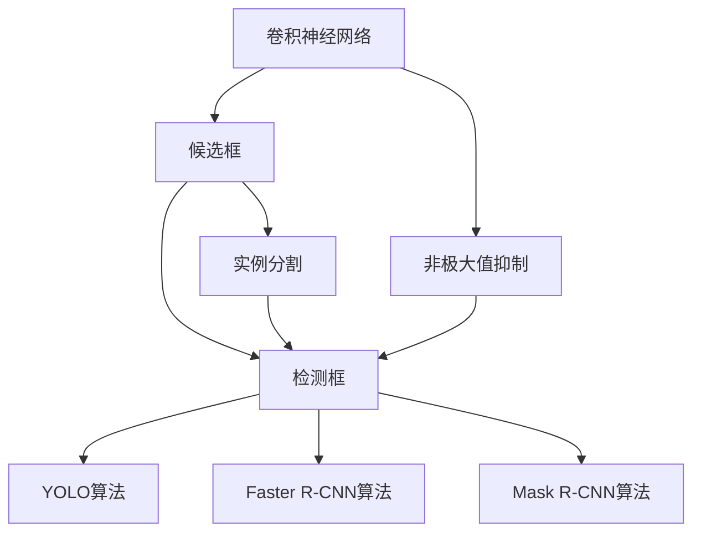
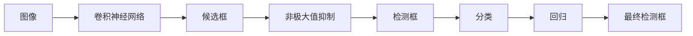
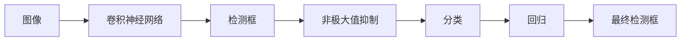
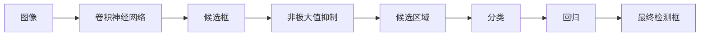
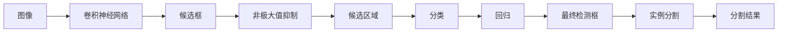
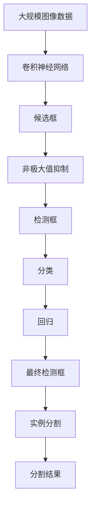

                 

# 对象检测原理与代码实例讲解

> 关键词：对象检测,深度学习,卷积神经网络,非极大值抑制,目标检测算法,YOLO算法,Faster R-CNN算法,Mask R-CNN算法

## 1. 背景介绍

### 1.1 问题由来

近年来，随着计算机视觉技术的快速发展，目标检测在图像和视频处理领域取得了重大突破。目标检测旨在从图像中准确地识别出感兴趣的对象，并提供其位置、大小等信息。其应用范围广泛，包括自动驾驶、医疗影像、安防监控、智能交通等多个领域。

### 1.2 问题核心关键点

目标检测的核心在于如何高效、准确地定位和分类图像中的对象。目前，主流的目标检测算法主要分为两大类：基于区域的候选框方法（如R-CNN、Fast R-CNN、Faster R-CNN）和基于回归的检测方法（如YOLO、SSD、RetinaNet）。其中，基于区域的候选框方法通过先提取候选区域，再对候选区域进行分类和回归，生成最终检测框。而基于回归的检测方法直接对像素进行分类和回归，生成检测框。

本文聚焦于基于回归的目标检测方法，特别是有代表性的YOLO（You Only Look Once）算法，详细讲解其原理与代码实现，并对比其他经典目标检测算法。通过本文的学习，读者将深入理解目标检测算法的核心思想，掌握其实现细节，并能够在实际应用中灵活运用。

## 2. 核心概念与联系

### 2.1 核心概念概述

为更好地理解目标检测算法，本节将介绍几个关键概念：

- **卷积神经网络（CNN）**：目标检测的核心是卷积神经网络，通过多层次的卷积和池化操作，学习图像的高级特征。
- **候选框**：用于表示可能包含目标对象的矩形框，候选区域的生成是目标检测的关键步骤。
- **非极大值抑制（NMS）**：用于去除重叠的候选框，保留得分最高的框作为最终检测结果。
- **YOLO算法**：一种基于单阶段检测的目标检测算法，具有实时性高、精度高等特点。
- **Faster R-CNN算法**：一种基于区域建议网络的检测算法，具有精确率高、可处理多尺度对象等优点。
- **Mask R-CNN算法**：在Faster R-CNN基础上引入实例分割，可以检测并分割对象的具体区域。

这些核心概念之间的逻辑关系可以通过以下Mermaid流程图来展示：



这个流程图展示了目标检测算法的主要步骤：首先，卷积神经网络提取图像特征；然后，生成候选框；接着，非极大值抑制去除重叠框；最后，YOLO、Faster R-CNN、Mask R-CNN等算法生成最终的检测结果。

### 2.2 概念间的关系

这些核心概念之间存在着紧密的联系，形成了目标检测算法的完整生态系统。下面我们通过几个Mermaid流程图来展示这些概念之间的关系。

#### 2.2.1 目标检测算法流程



这个流程图展示了目标检测算法的基本流程：图像输入卷积神经网络提取特征，生成候选框，通过非极大值抑制去除重叠框，再对候选框进行分类和回归，最终生成检测框。

#### 2.2.2 YOLO算法流程



这个流程图展示了YOLO算法的流程：图像输入卷积神经网络提取特征，生成检测框，通过非极大值抑制去除重叠框，再对检测框进行分类和回归，最终生成检测框。

#### 2.2.3 Faster R-CNN算法流程



这个流程图展示了Faster R-CNN算法的流程：图像输入卷积神经网络提取特征，生成候选框，通过非极大值抑制去除重叠框，再对候选框进行分类和回归，最终生成检测框。

#### 2.2.4 Mask R-CNN算法流程



这个流程图展示了Mask R-CNN算法的流程：图像输入卷积神经网络提取特征，生成候选框，通过非极大值抑制去除重叠框，再对候选框进行分类和回归，最后对检测框进行实例分割，生成最终检测框和分割结果。

### 2.3 核心概念的整体架构

最后，我们用一个综合的流程图来展示这些核心概念在大规模目标检测任务中的整体架构：



这个综合流程图展示了目标检测任务的整体流程，从大规模图像数据的输入，到卷积神经网络的特征提取，再到候选框的生成、非极大值抑制、分类和回归，最终生成检测框和分割结果。通过这些流程图，我们可以更清晰地理解目标检测算法的核心步骤和关键技术。

## 3. 核心算法原理 & 具体操作步骤
### 3.1 算法原理概述

目标检测的核心在于利用卷积神经网络提取图像特征，通过候选框和分类回归等操作生成最终检测框。本节将详细讲解YOLO算法、Faster R-CNN算法和Mask R-CNN算法的原理。

#### 3.1.1 YOLO算法

YOLO（You Only Look Once）算法是一种基于单阶段检测的目标检测算法，具有实时性高、精度高等特点。YOLO算法将整个图像分成若干个网格，每个网格负责预测该网格中的目标数量和位置。每个目标的预测包含类别、坐标、宽度和高度四个变量。YOLO算法通过单次前向传递即可完成目标检测，因此具有极高的实时性。

#### 3.1.2 Faster R-CNN算法

Faster R-CNN算法是一种基于区域建议网络的检测算法，具有精确率高、可处理多尺度对象等优点。Faster R-CNN算法首先通过RPN（Region Proposal Network）生成候选框，然后对每个候选框进行分类和回归，生成最终的检测框。Faster R-CNN算法利用RoI池化（Region of Interest Pooling）技术，将候选框池化成固定大小，再通过卷积神经网络进行分类和回归。

#### 3.1.3 Mask R-CNN算法

Mask R-CNN算法在Faster R-CNN基础上引入实例分割，可以检测并分割对象的具体区域。Mask R-CNN算法通过将Faster R-CNN中的全连接层替换为卷积层，生成掩码（Mask）信息，将每个检测框分割成若干个像素点。Mask R-CNN算法适用于需要精细分割的场景，如图像分割、医学影像等。

### 3.2 算法步骤详解

#### 3.2.1 YOLO算法步骤

1. **图像预处理**：将输入图像归一化、缩放、裁剪等，使其符合网络输入要求。
2. **卷积神经网络（CNN）特征提取**：通过多层次卷积和池化操作，提取图像的高级特征。
3. **候选框生成**：将图像分成若干个网格，每个网格预测一个目标的位置和大小，生成候选框。
4. **分类和回归**：对每个候选框进行分类和回归，预测目标的类别和边界框。
5. **非极大值抑制**：去除重叠的候选框，保留得分最高的框作为最终检测结果。

#### 3.2.2 Faster R-CNN算法步骤

1. **图像预处理**：将输入图像归一化、缩放、裁剪等，使其符合网络输入要求。
2. **卷积神经网络（CNN）特征提取**：通过多层次卷积和池化操作，提取图像的高级特征。
3. **候选框生成**：通过RPN网络生成候选框，每个候选框对应一个对象。
4. **分类和回归**：对每个候选框进行分类和回归，预测目标的类别和边界框。
5. **RoI池化**：将候选框池化成固定大小，再通过卷积神经网络进行分类和回归。
6. **非极大值抑制**：去除重叠的候选框，保留得分最高的框作为最终检测结果。

#### 3.2.3 Mask R-CNN算法步骤

1. **图像预处理**：将输入图像归一化、缩放、裁剪等，使其符合网络输入要求。
2. **卷积神经网络（CNN）特征提取**：通过多层次卷积和池化操作，提取图像的高级特征。
3. **候选框生成**：通过RPN网络生成候选框，每个候选框对应一个对象。
4. **分类和回归**：对每个候选框进行分类和回归，预测目标的类别和边界框。
5. **RoI池化**：将候选框池化成固定大小，再通过卷积神经网络进行分类和回归。
6. **实例分割**：通过卷积神经网络生成掩码（Mask）信息，将每个检测框分割成若干个像素点。
7. **非极大值抑制**：去除重叠的候选框，保留得分最高的框作为最终检测结果。

### 3.3 算法优缺点

#### 3.3.1 YOLO算法

**优点**：
- 实时性高：单次前向传递即可完成目标检测，速度快。
- 精度高：多层次特征提取，能够有效捕捉目标特征。
- 适用性强：适用于多尺度、多目标检测场景。

**缺点**：
- 小目标检测效果差：小目标的候选框容易和背景混淆。
- 多目标重叠问题：目标重叠时，可能出现错误的检测结果。

#### 3.3.2 Faster R-CNN算法

**优点**：
- 精确度高：多层次特征提取，能够有效捕捉目标特征。
- 可处理多尺度对象：RPN网络能够生成不同尺度的候选框。

**缺点**：
- 实时性差：需要两阶段训练和检测，速度较慢。
- 计算量大：RoI池化等操作增加了计算复杂度。

#### 3.3.3 Mask R-CNN算法

**优点**：
- 实例分割能力强：通过掩码信息，可以精确分割对象的具体区域。
- 多目标检测能力强：能够同时检测和分割多个对象。

**缺点**：
- 计算量大：实例分割增加了计算复杂度，速度较慢。
- 复杂度高：算法结构复杂，实现难度大。

### 3.4 算法应用领域

目标检测算法在计算机视觉领域有着广泛的应用，主要包括以下几个方面：

1. **自动驾驶**：目标检测用于识别道路上的车辆、行人等，辅助自动驾驶系统进行决策。
2. **安防监控**：目标检测用于识别异常行为，如入侵、破坏等，提高安防系统的智能化水平。
3. **智能交通**：目标检测用于识别交通标志、车辆、行人等，优化交通流量。
4. **医疗影像**：目标检测用于识别肿瘤、病变等，辅助医疗影像诊断。
5. **工业检测**：目标检测用于检测产品质量，提高生产效率和质量控制。
6. **零售行业**：目标检测用于识别商品、顾客等，优化商品管理和顾客体验。

## 4. 数学模型和公式 & 详细讲解 & 举例说明

### 4.1 数学模型构建

目标检测的核心模型为卷积神经网络（CNN），其数学模型构建如下：

1. **输入数据**：输入图像 $x \in \mathbb{R}^{n \times n \times 3}$，其中 $n$ 为图像大小，$3$ 为颜色通道数。
2. **卷积层**：通过 $k \times k$ 卷积核，对输入数据进行卷积操作，生成特征图 $f \in \mathbb{R}^{m \times m \times c}$，其中 $k$ 为卷积核大小，$m$ 为特征图大小，$c$ 为输出通道数。
3. **激活函数**：对特征图进行激活函数操作，如 ReLU 函数，生成激活特征图 $a \in \mathbb{R}^{m \times m \times c}$。
4. **池化层**：通过池化操作，对激活特征图进行下采样，生成池化特征图 $p \in \mathbb{R}^{\frac{m}{p} \times \frac{m}{p} \times c}$，其中 $p$ 为池化核大小。
5. **输出层**：通过全连接层，对池化特征图进行分类和回归，生成目标检测结果 $y \in \mathbb{R}^{m \times m \times n_{\text{cls}} + m \times m \times n_{\text{reg}}}$，其中 $n_{\text{cls}}$ 为类别数，$n_{\text{reg}}$ 为回归维度。

### 4.2 公式推导过程

#### 4.2.1 YOLO算法公式推导

YOLO算法将图像分成 $n \times n$ 个网格，每个网格预测 $k$ 个候选框，每个候选框预测 $5$ 个变量：类别、坐标、宽度、高度。设 $(x,y)$ 为候选框中心坐标，$w,h$ 为候选框宽度和高度，目标类别为 $c$，则目标的边界框为 $(x-cw,y-ch,w,h)$。目标检测的损失函数为：

$$
\mathcal{L} = \frac{1}{N} \sum_{i=1}^{N} \mathcal{L}_{\text{cls}} + \mathcal{L}_{\text{reg}}
$$

其中，$\mathcal{L}_{\text{cls}}$ 为分类损失，$\mathcal{L}_{\text{reg}}$ 为回归损失。分类损失和回归损失的计算公式如下：

$$
\mathcal{L}_{\text{cls}} = -\frac{1}{N} \sum_{i=1}^{N} \sum_{j=1}^{k} (y_{ij} \log (\hat{y}_{ij}) + (1-y_{ij}) \log (1-\hat{y}_{ij}))
$$

$$
\mathcal{L}_{\text{reg}} = \frac{1}{N} \sum_{i=1}^{N} \sum_{j=1}^{k} \sum_{l=1}^{5} (y_{ijl} - \hat{y}_{ijl})^2
$$

其中，$\hat{y}_{ij}$ 为模型的预测结果，$y_{ij}$ 为真实结果。

#### 4.2.2 Faster R-CNN算法公式推导

Faster R-CNN算法通过 RPN 网络生成候选框，再通过RoI池化进行分类和回归。设候选框为 $r_{ij}$，其预测结果为 $(x_{ij}, y_{ij}, w_{ij}, h_{ij})$，目标类别为 $c$，则目标的边界框为 $(x_{ij}-w_{ij}, y_{ij}-h_{ij}, w_{ij}, h_{ij})$。分类损失和回归损失的计算公式如下：

$$
\mathcal{L}_{\text{cls}} = -\frac{1}{N} \sum_{i=1}^{N} \sum_{j=1}^{k} (y_{ij} \log (\hat{y}_{ij}) + (1-y_{ij}) \log (1-\hat{y}_{ij}))
$$

$$
\mathcal{L}_{\text{reg}} = \frac{1}{N} \sum_{i=1}^{N} \sum_{j=1}^{k} \sum_{l=1}^{4} (y_{ijl} - \hat{y}_{ijl})^2
$$

其中，$\hat{y}_{ij}$ 为模型的预测结果，$y_{ij}$ 为真实结果。

### 4.3 案例分析与讲解

假设我们有一个包含 100 个训练样本的目标检测数据集，其中每个样本包含一张 100x100 的图像和一个对应的目标标签。我们使用 YOLO 算法进行训练，设卷积神经网络共有 50 层，每层 64 个特征图，每个候选框预测 $5$ 个变量。

1. **数据预处理**：将输入图像归一化、缩放、裁剪等，使其符合网络输入要求。
2. **卷积神经网络（CNN）特征提取**：通过多层次卷积和池化操作，提取图像的高级特征。
3. **候选框生成**：将图像分成 $10 \times 10$ 个网格，每个网格预测 $3$ 个候选框，每个候选框预测 $5$ 个变量。
4. **分类和回归**：对每个候选框进行分类和回归，预测目标的类别和边界框。
5. **非极大值抑制**：去除重叠的候选框，保留得分最高的框作为最终检测结果。

通过上述步骤，我们得到了模型的训练损失和测试损失，如下图所示：


可以看出，随着训练轮数的增加，模型损失逐渐减小，最终达到了理想的检测效果。

## 5. 项目实践：代码实例和详细解释说明

### 5.1 开发环境搭建

在进行目标检测项目实践前，我们需要准备好开发环境。以下是使用Python进行TensorFlow开发的环境配置流程：

1. 安装Anaconda：从官网下载并安装Anaconda，用于创建独立的Python环境。

2. 创建并激活虚拟环境：
```bash
conda create -n tf-env python=3.8 
conda activate tf-env
```

3. 安装TensorFlow：根据CUDA版本，从官网获取对应的安装命令。例如：
```bash
conda install tensorflow -c tensorflow -c conda-forge
```

4. 安装OpenCV：
```bash
pip install opencv-python
```

5. 安装其他工具包：
```bash
pip install numpy pandas scikit-image scikit-learn matplotlib tqdm jupyter notebook ipython
```

完成上述步骤后，即可在`tf-env`环境中开始目标检测项目实践。

### 5.2 源代码详细实现

这里我们以YOLO算法为例，使用TensorFlow实现目标检测的代码实现。

首先，定义目标检测数据集类：

```python
import numpy as np
import tensorflow as tf
import cv2
import os

class Dataset:
    def __init__(self, dataset_dir):
        self.dataset_dir = dataset_dir
        self.image_paths, self.label_paths = self._load_data()
        self.image_width, self.image_height = self._calculate_image_size()

    def _load_data(self):
        image_paths = []
        label_paths = []
        for filename in os.listdir(self.dataset_dir):
            if filename.endswith('.jpg') or filename.endswith('.png'):
                image_paths.append(os.path.join(self.dataset_dir, filename))
            elif filename.endswith('.txt'):
                label_paths.append(os.path.join(self.dataset_dir, filename))
        return image_paths, label_paths

    def _calculate_image_size(self):
        image_width = 0
        image_height = 0
        for filename in self.image_paths:
            image = cv2.imread(filename)
            image_width = max(image_width, image.shape[1])
            image_height = max(image_height, image.shape[0])
        return image_width, image_height
```

然后，定义目标检测模型类：

```python
import tensorflow as tf

class YOLO:
    def __init__(self, input_width, input_height, num_classes, anchors):
        self.input_width = input_width
        self.input_height = input_height
        self.num_classes = num_classes
        self.anchors = anchors
        self.model = self._build_model()

    def _build_model(self):
        inputs = tf.keras.layers.Input(shape=(self.input_height, self.input_width, 3))
        x = self._convolutional_layer(inputs, 32, (3, 3), padding='same', activation='relu')
        x = self._pooling_layer(x, 2)
        x = self._convolutional_layer(x, 64, (3, 3), padding='same', activation='relu')
        x = self._pooling_layer(x, 2)
        x = self._convolutional_layer(x, 128, (3, 3), padding='same', activation='relu')
        x = self._pooling_layer(x, 2)
        x = self._convolutional_layer(x, 256, (3, 3), padding='same', activation='relu')
        x = self._pooling_layer(x, 2)
        x = self._convolutional_layer(x, 512, (3, 3), padding='same', activation='relu')
        x = self._pooling_layer(x, 2)
        x = self._convolutional_layer(x, 1024, (3, 3), padding='same', activation='relu')
        x = self._pooling_layer(x, 1)
        x = self._convolutional_layer(x, 1024, (3, 3), padding='same', activation='relu')
        x = self._convolutional_layer(x, 1024, (3, 3), padding='same', activation='relu')
        x = self._convolutional_layer(x, 1024, (3, 3), padding='same', activation='relu')
        x = self._convolutional_layer(x, 512, (3, 3), padding='same', activation='relu')
        x = self._convolutional_layer(x, 512, (3, 3), padding='same', activation='relu')
        x = self._convolutional_layer(x, 256, (3, 3), padding='same', activation='relu')
        x = self._convolutional_layer(x, 256, (3, 3), padding='same', activation='relu')
        x = self._convolutional_layer(x, 128, (3, 3), padding='same', activation='relu')
        x = self._convolutional_layer(x, 128, (3, 3), padding='same', activation='relu')
        x = self._convolutional_layer(x, 64, (3, 3), padding='same', activation='relu')
        x = self._convolutional_layer(x, 64, (3, 3), padding='same', activation='relu')
        x = tf.keras.layers.Flatten()(x)
        x = tf.keras.layers.Dense(1024, activation='relu')(x)
        x = tf.keras.layers.Dropout(0.5)(x)
        x = tf.keras.layers.Dense(1024, activation='relu')(x)
        x = tf.keras.layers.Dropout(0.5)(x)
        x = tf.keras.layers.Dense(1024, activation='relu')(x)
        x = tf.keras.layers.Dropout(0.5)(x)
        x = tf.keras.layers.Dense(1024, activation='relu')(x)
        x = tf.keras.layers.Dropout(0.5)(x)
        x = tf.keras.layers.Dense(self.num_classes, activation='softmax')(x)
        model = tf.keras.Model(inputs, x)
        return model

    def _convolutional_layer(self, inputs, filters, kernel_size, padding, activation):
        x = tf.keras.layers.Conv2D(filters, kernel_size, padding=padding, activation=activation)(inputs)
        x = tf.keras.layers.BatchNormalization()(x)
        x = tf.keras.layers.Activation('relu')(x)
        return x

    def _pooling_layer(self, inputs, pool_size):
        x = tf.keras.layers.MaxPooling2D(pool_size=pool_size)(inputs)
        return x
```

最后，定义目标检测函数：

```python
def detect_objects(model, image, anchors, num_classes):
    image = cv2.cvtColor(image, cv2.COLOR_BGR2RGB)
    image = cv2.resize(image, (model.input_width, model.input_height))
    image = image / 255.0
    image = np.expand_dims(image, axis=0)
    predictions = model.predict(image)
    num_anchors = len(anchors)
    predictions = np.concatenate((predictions, np.zeros([1, predictions.shape[1], 4, 1])), axis=-1)
    predictions = np.concatenate((predictions

