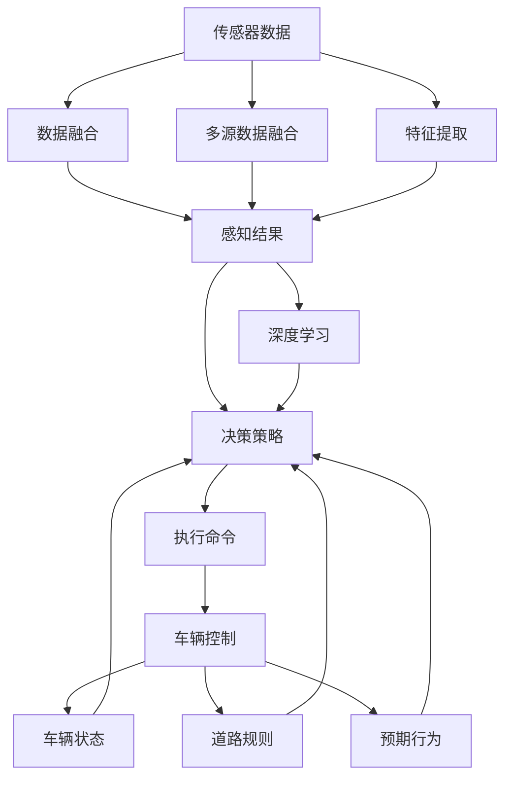

                 

# 小鹏汽车何小鹏谈端到端自动驾驶

> 关键词：
## 1. 背景介绍

### 1.1 问题由来
随着智能汽车技术的不断进步，端到端自动驾驶（End-to-End Autonomous Driving）已成为业界关注的焦点。端到端自动驾驶指汽车系统直接从摄像头、雷达等传感器数据中直接输出驾驶决策，无需依赖传统车控系统，降低了车辆硬件复杂度和软件开发成本。

小鹏汽车作为国内领先的电动汽车品牌，积极推进自动驾驶技术的研发，不断提升车辆智能化水平，以满足用户对高品质出行体验的需求。本文旨在深入探讨端到端自动驾驶的原理与实践，阐述小鹏汽车在这一领域的技术突破与未来展望。

### 1.2 问题核心关键点
端到端自动驾驶的核心在于通过深度学习算法，实现从传感器数据到驾驶决策的全链路自动化。具体来说，包括以下几个关键技术点：

1. **感知（Perception）**：通过摄像头、雷达、激光雷达等传感器，采集实时环境信息，并通过多传感器数据融合，构建出高精度的地图和环境理解。
2. **决策（Decision Making）**：基于感知结果，结合车辆状态、道路规则、预期行为等因素，制定出最优的驾驶策略。
3. **执行（Action Execution）**：将决策转换为实际的车辆控制命令，如转向、加速、制动等，通过车控系统执行。

端到端自动驾驶技术的发展，能够显著提升驾驶安全性、舒适性和效率，为未来无人驾驶时代的到来奠定坚实基础。

### 1.3 问题研究意义
研究端到端自动驾驶技术，对于汽车行业的智能化转型具有重要意义：

1. **降低成本**：简化车控系统，减少中间环节，降低车辆硬件复杂度和软件开发成本。
2. **提升性能**：通过深度学习算法，提升感知和决策的准确性，减少人工干预。
3. **促进创新**：推动自动驾驶技术向全场景、高复杂度方向发展，促进汽车产业的创新。
4. **满足需求**：提供更加智能、便捷、安全的驾驶体验，满足用户对高品质出行的需求。

## 2. 核心概念与联系

### 2.1 核心概念概述

为更好地理解端到端自动驾驶技术，本节将介绍几个密切相关的核心概念：

- **端到端（End-to-End）**：指系统直接从传感器数据输入到车辆控制输出，无需经过中间软件层，实现全程自动化。
- **感知（Perception）**：通过摄像头、雷达、激光雷达等传感器，获取环境信息，进行目标检测、跟踪、地图构建等任务。
- **决策（Decision Making）**：基于感知结果，进行路径规划、行为预测、场景理解等，制定最优驾驶策略。
- **执行（Action Execution）**：将决策转换为具体的车辆控制命令，如转向、加速、制动等。
- **传感器融合（Sensor Fusion）**：将多源传感器数据进行融合，提高感知精度和可靠性。
- **深度学习（Deep Learning）**：通过神经网络模型，学习复杂非线性的特征表示，实现高效的信息处理和决策。

这些核心概念构成了端到端自动驾驶技术的完整框架，有助于我们深入理解其工作原理和实现机制。

### 2.2 概念间的关系

这些核心概念之间存在着紧密的联系，形成了端到端自动驾驶技术的完整生态系统。下面我们通过一些Mermaid流程图来展示这些概念之间的关系。



这个流程图展示了大语言模型的核心概念及其之间的关系：

1. 传感器数据经过多源融合，输出感知结果。
2. 感知结果通过深度学习进行特征提取，输出决策策略。
3. 决策策略转化为执行命令，进行车辆控制。
4. 车辆状态、道路规则和预期行为等，作为决策的辅助信息。

通过这些流程图，我们可以更清晰地理解端到端自动驾驶技术的工作流程和各个环节的作用。

## 3. 核心算法原理 & 具体操作步骤

### 3.1 算法原理概述

端到端自动驾驶的算法原理主要基于深度学习技术，通过构建复杂的网络模型，实现从感知到决策的全链路自动化。其核心算法包括：

1. **感知算法（Perception Algorithm）**：通过摄像头、雷达、激光雷达等传感器，进行目标检测、跟踪、地图构建等任务。常用的算法有YOLO、Faster R-CNN、PointNet等。
2. **决策算法（Decision Algorithm）**：基于感知结果，进行路径规划、行为预测、场景理解等，制定最优驾驶策略。常用的算法有A*、DQN、RNN等。
3. **执行算法（Action Execution Algorithm）**：将决策转换为具体的车辆控制命令，如转向、加速、制动等。常用的算法有PID控制、模型预测控制等。

这些算法共同构成了端到端自动驾驶的技术框架，实现了从传感器数据到车辆控制的全链路自动化。

### 3.2 算法步骤详解

端到端自动驾驶的实现一般包括以下几个关键步骤：

**Step 1: 数据采集与预处理**
- 通过摄像头、雷达、激光雷达等传感器，采集实时环境信息。
- 对传感器数据进行滤波、校正、融合等预处理，提高数据质量。

**Step 2: 目标检测与跟踪**
- 使用深度学习算法，如YOLO、Faster R-CNN等，对采集到的数据进行目标检测。
- 对检测到的目标进行跟踪，如使用卡尔曼滤波、粒子滤波等算法，保证目标状态的连续性和稳定性。

**Step 3: 路径规划与决策**
- 基于感知结果，使用A*、DQN等算法进行路径规划，找到最优路径。
- 结合车辆状态、道路规则、预期行为等因素，使用RNN、LSTM等算法进行决策，制定最优驾驶策略。

**Step 4: 车辆控制与执行**
- 将决策结果转换为具体的车辆控制命令，如转向、加速、制动等。
- 通过车控系统执行控制命令，实现车辆自动驾驶。

**Step 5: 模型训练与评估**
- 使用标注数据集，对模型进行训练和优化，提升模型的感知和决策能力。
- 在测试数据集上评估模型性能，调整参数和策略，确保模型稳定可靠。

### 3.3 算法优缺点

端到端自动驾驶技术具有以下优点：

1. **简化系统架构**：减少了中间软件层，降低了系统复杂度，提高了整体效率。
2. **提升性能**：深度学习算法能够自动学习复杂非线性的特征表示，提升感知和决策的准确性。
3. **降低成本**：减少了传统车控系统的依赖，降低了车辆硬件复杂度和软件开发成本。

同时，端到端自动驾驶也存在以下缺点：

1. **数据需求高**：需要大量高质量的标注数据进行模型训练，获取数据成本较高。
2. **计算量大**：深度学习算法计算复杂度较高，对硬件资源要求高。
3. **安全风险**：传感器数据异常、模型失效等问题，可能导致系统不稳定。
4. **法规限制**：现有法律法规对自动驾驶的安全性和合规性要求较高，实施难度大。

### 3.4 算法应用领域

端到端自动驾驶技术已经在多个领域得到广泛应用，包括：

1. **自动驾驶汽车**：小鹏汽车等电动汽车品牌，使用端到端自动驾驶技术，实现L2、L3、L4级别的自动驾驶。
2. **无人机**：使用端到端自动驾驶技术，提升无人机的导航和避障能力，应用于物流、侦察等领域。
3. **机器人**：使用端到端自动驾驶技术，实现机器人自主导航和作业，应用于工业、农业等领域。
4. **无人车**：使用端到端自动驾驶技术，实现无人车在仓库、工厂、景区等场景下的自动化运行。

除了上述这些经典应用外，端到端自动驾驶技术还在自动驾驶交通、无人船、自动导引车等众多领域中得到创新性应用，为智能交通、智慧城市建设提供了新的技术路径。

## 4. 数学模型和公式 & 详细讲解 & 举例说明

### 4.1 数学模型构建

本节将使用数学语言对端到端自动驾驶的算法过程进行更加严格的刻画。

记传感器采集的数据为 $x \in \mathbb{R}^n$，传感器数据经过多源融合后的感知结果为 $y \in \mathbb{R}^m$。感知结果经过深度学习模型处理，输出决策策略 $\hat{u}$，具体数学模型如下：

$$
\hat{u} = \mathop{\arg\min}_{u} \mathcal{L}(y, u | x, \theta)
$$

其中 $\mathcal{L}$ 为损失函数，$u$ 为决策结果，$\theta$ 为模型参数。常用的损失函数包括均方误差、交叉熵等。

### 4.2 公式推导过程

以目标检测为例，使用YOLO算法进行目标检测，其数学模型如下：

假设输入数据为 $x$，目标检测结果为 $y$，网络结构为 $f$，则目标检测的损失函数为：

$$
\ell(y, \hat{y}) = \frac{1}{N}\sum_{i=1}^N \ell_i(y_i, \hat{y}_i)
$$

其中 $N$ 为样本数，$\ell_i$ 为单个样本的损失函数，$y_i$ 为真实目标位置和大小，$\hat{y}_i$ 为网络预测的目标位置和大小。

YOLO算法的损失函数为：

$$
\ell(y, \hat{y}) = \frac{1}{2N}\sum_{i=1}^N \left[(y_i - \hat{y}_i)^2 + (y_i - \hat{y}_i)^2\right]
$$

其中第一项为位置损失，第二项为大小损失。目标检测结果 $y_i = (x_i, w_i, h_i)$，其中 $x_i$ 为目标位置，$w_i$ 和 $h_i$ 为目标大小。

通过上述数学模型，我们可以对YOLO算法进行推导和优化，进一步提升目标检测的精度和效率。

### 4.3 案例分析与讲解

以下以小鹏汽车为例，分析其在端到端自动驾驶技术上的应用实践。

小鹏汽车在自动驾驶技术上，采用了端到端自动驾驶框架，包括感知、决策和执行三个环节。具体实现如下：

1. **感知**：使用摄像头、雷达、激光雷达等传感器，采集实时环境信息。通过多源数据融合算法，如IMU校正、卡尔曼滤波等，提高感知精度。
2. **决策**：使用深度学习算法，如YOLO、Faster R-CNN等，进行目标检测和跟踪。结合车辆状态、道路规则、预期行为等因素，使用A*、DQN等算法进行路径规划和行为决策。
3. **执行**：将决策结果转换为具体的车辆控制命令，如转向、加速、制动等。通过车控系统执行控制命令，实现车辆自动驾驶。

小鹏汽车在实际测试中，已经实现了L2、L3级别的自动驾驶，具备自动泊车、自动巡航、自动变道等功能。此外，小鹏汽车还推出了端到端自动驾驶技术的长测方案，通过大数据分析和仿真测试，不断优化模型性能，提升自动驾驶的可靠性和安全性。

## 5. 项目实践：代码实例和详细解释说明

### 5.1 开发环境搭建

在进行端到端自动驾驶项目实践前，我们需要准备好开发环境。以下是使用Python进行PyTorch开发的环境配置流程：

1. 安装Anaconda：从官网下载并安装Anaconda，用于创建独立的Python环境。

2. 创建并激活虚拟环境：
```bash
conda create -n auto_driving python=3.8 
conda activate auto_driving
```

3. 安装PyTorch：根据CUDA版本，从官网获取对应的安装命令。例如：
```bash
conda install pytorch torchvision torchaudio cudatoolkit=11.1 -c pytorch -c conda-forge
```

4. 安装TensorFlow：
```bash
pip install tensorflow
```

5. 安装各类工具包：
```bash
pip install numpy pandas scikit-learn matplotlib tqdm jupyter notebook ipython
```

完成上述步骤后，即可在`auto_driving`环境中开始端到端自动驾驶的实践。

### 5.2 源代码详细实现

这里我们以端到端自动驾驶的感知和决策部分为例，给出使用PyTorch实现的代码示例。

首先，定义感知模块：

```python
import torch
import torch.nn as nn
import torchvision.transforms as transforms
from torchvision.models import resnet

class PerceptionModule(nn.Module):
    def __init__(self):
        super(PerceptionModule, self).__init__()
        self.resnet = resnet.resnet18(pretrained=True)
        self.fc = nn.Linear(512, 256)
        self.relu = nn.ReLU()
        self.fc2 = nn.Linear(256, 64)
        self.sigmoid = nn.Sigmoid()

    def forward(self, x):
        x = self.resnet(x)
        x = x.view(x.size(0), -1)
        x = self.fc(x)
        x = self.relu(x)
        x = self.fc2(x)
        x = self.sigmoid(x)
        return x

# 构建感知模块
perception_module = PerceptionModule()
```

接着，定义决策模块：

```python
import torch
import torch.nn as nn

class DecisionModule(nn.Module):
    def __init__(self):
        super(DecisionModule, self).__init__()
        self.fc1 = nn.Linear(64, 128)
        self.relu = nn.ReLU()
        self.fc2 = nn.Linear(128, 32)
        self.relu = nn.ReLU()
        self.fc3 = nn.Linear(32, 2)
        self.softmax = nn.Softmax(dim=1)

    def forward(self, x):
        x = self.fc1(x)
        x = self.relu(x)
        x = self.fc2(x)
        x = self.relu(x)
        x = self.fc3(x)
        x = self.softmax(x)
        return x

# 构建决策模块
decision_module = DecisionModule()
```

最后，构建端到端自动驾驶的总体模型：

```python
import torch
import torch.nn as nn

class AutoDrivingModel(nn.Module):
    def __init__(self):
        super(AutoDrivingModel, self).__init__()
        self.perception_module = PerceptionModule()
        self.decision_module = DecisionModule()

    def forward(self, x):
        perception_output = self.perception_module(x)
        decision_output = self.decision_module(perception_output)
        return decision_output

# 构建端到端自动驾驶模型
auto_driving_model = AutoDrivingModel()
```

完成上述代码实现后，即可使用PyTorch对模型进行训练和测试，实现端到端自动驾驶的感知和决策功能。

### 5.3 代码解读与分析

让我们再详细解读一下关键代码的实现细节：

**PerceptionModule类**：
- `__init__`方法：初始化感知模块的各层结构。
- `forward`方法：前向传播过程，将输入数据通过卷积、全连接等层，输出感知结果。

**DecisionModule类**：
- `__init__`方法：初始化决策模块的各层结构。
- `forward`方法：前向传播过程，将感知结果通过全连接层，输出决策结果。

**AutoDrivingModel类**：
- `__init__`方法：初始化感知和决策模块。
- `forward`方法：前向传播过程，将输入数据通过感知和决策模块，输出最终的决策结果。

通过这些代码示例，我们可以清晰地理解端到端自动驾驶技术的实现原理。开发者可以根据实际需求，灵活调整感知和决策模块的设计，以实现更高效、更准确的自动驾驶功能。

## 6. 实际应用场景

### 6.1 智能驾驶系统

端到端自动驾驶技术在智能驾驶系统中有着广泛的应用。智能驾驶系统通过感知模块获取实时环境信息，通过决策模块制定最优驾驶策略，通过执行模块进行车辆控制，实现全链路自动化。

例如，在高速公路自动驾驶中，智能驾驶系统通过摄像头、雷达等传感器，采集车辆周围的交通环境信息。感知模块进行目标检测和跟踪，决策模块根据交通规则和车流状况，制定最优行驶路径和速度。执行模块控制车辆加速、制动和转向，实现自动巡航和变道功能。智能驾驶系统通过多传感器融合和深度学习算法，提升了驾驶的安全性和舒适性。

### 6.2 智慧物流

端到端自动驾驶技术在智慧物流领域也有着重要应用。例如，无人驾驶货车可以通过端到端自动驾驶系统，实现自动导航、装卸货等操作。

在物流配送场景中，无人驾驶货车使用摄像头、雷达、激光雷达等传感器，采集周围环境信息。感知模块进行目标检测和跟踪，决策模块根据货物位置和目的地，规划最优路径。执行模块控制车辆行驶，实现自动装卸货和避障。通过端到端自动驾驶技术，无人驾驶货车能够提高运输效率，降低人力成本，提升物流配送的智能化水平。

### 6.3 无人飞行器

端到端自动驾驶技术在无人飞行器领域也有着广泛应用。例如，无人驾驶无人机可以通过端到端自动驾驶系统，实现自主巡航、空中避障等功能。

在无人飞行器场景中，无人机使用摄像头、雷达、激光雷达等传感器，采集周围环境信息。感知模块进行目标检测和跟踪，决策模块根据飞行任务和环境状况，规划最优飞行路径。执行模块控制无人机飞行，实现自主巡航和避障。通过端到端自动驾驶技术，无人机能够实现高精度的定位和导航，提高飞行安全性和效率。

### 6.4 未来应用展望

随着端到端自动驾驶技术的不断发展，未来将会有更多的应用场景和创新应用，为各个领域带来深刻变革。

在智能交通领域，端到端自动驾驶技术将实现自动驾驶公交、自动驾驶出租车等，提升公共交通的效率和安全性。在智慧城市领域，端到端自动驾驶技术将实现自动驾驶垃圾车、自动驾驶扫地车等，提升城市管理的智能化水平。在智能制造领域，端到端自动驾驶技术将实现自动驾驶机器人、自动驾驶物流车等，提升制造业的自动化和智能化水平。

## 7. 工具和资源推荐

### 7.1 学习资源推荐

为了帮助开发者系统掌握端到端自动驾驶的理论基础和实践技巧，这里推荐一些优质的学习资源：

1. **《深度学习与自动驾驶》系列博文**：由深度学习专家撰写，深入浅出地介绍了深度学习在自动驾驶中的应用，涵盖感知、决策、执行等多个环节。

2. **《自动驾驶技术入门与实战》课程**：清华大学开设的自动驾驶课程，涵盖了自动驾驶的基本概念、感知算法、决策算法、执行算法等，适合初学者学习。

3. **《无人驾驶技术》书籍**：全面介绍了无人驾驶技术的原理和实现方法，涵盖感知、决策、执行等多个环节，是自学无人驾驶的优秀教材。

4. **ArXiv论文预印本**：人工智能领域最新研究成果的发布平台，包括无人驾驶领域的前沿工作，值得阅读和研究。

5. **IEEE Access期刊**：无人驾驶领域权威期刊，发表了大量高质量的研究论文，是学习无人驾驶技术的重要资源。

通过这些资源的学习实践，相信你一定能够快速掌握端到端自动驾驶的精髓，并用于解决实际的自动驾驶问题。

### 7.2 开发工具推荐

高效的开发离不开优秀的工具支持。以下是几款用于端到端自动驾驶开发的常用工具：

1. **PyTorch**：基于Python的开源深度学习框架，灵活动态的计算图，适合快速迭代研究。广泛用于深度学习模型开发，包括感知、决策、执行等多个环节。

2. **TensorFlow**：由Google主导开发的开源深度学习框架，生产部署方便，适合大规模工程应用。同样有丰富的无人驾驶相关资源和工具。

3. **ROS（Robot Operating System）**：开源的机器人操作系统，提供了丰富的感知和决策算法，支持多传感器数据融合和车辆控制。

4. **Simulation Tools**：如Gazebo、CARLA等仿真工具，可以模拟各种无人驾驶场景，进行模型测试和优化。

5. **Visualization Tools**：如TensorBoard、ROS Bag Viewer等可视化工具，可以实时监测模型训练状态，进行调试和优化。

合理利用这些工具，可以显著提升端到端自动驾驶开发的效率，加快创新迭代的步伐。

### 7.3 相关论文推荐

端到端自动驾驶技术的发展源于学界的持续研究。以下是几篇奠基性的相关论文，推荐阅读：

1. **End-to-End Training for Self-Driving Cars**：使用深度学习算法，实现从传感器数据到车辆控制的全链路自动化，取得了显著效果。

2. **Deep Neural Network for Autonomous Driving**：使用深度神经网络模型，实现目标检测、路径规划等功能，提升了自动驾驶系统的感知和决策能力。

3. **Autonomous Vehicle Regulation via Deep Reinforcement Learning**：使用深度强化学习算法，实现最优驾驶策略，提升了自动驾驶系统的鲁棒性和安全性。

4. **Autonomous Driving in Complex Environments with Stochastic Optimal Control**：使用优化控制算法，实现车辆自动驾驶，提升了系统在复杂环境中的性能。

这些论文代表了大语言模型微调技术的发展脉络。通过学习这些前沿成果，可以帮助研究者把握学科前进方向，激发更多的创新灵感。

除上述资源外，还有一些值得关注的前沿资源，帮助开发者紧跟端到端自动驾驶技术的最新进展，例如：

1. **arXiv论文预印本**：人工智能领域最新研究成果的发布平台，包括无人驾驶领域的前沿工作，值得阅读和研究。

2. **IEEE Access期刊**：无人驾驶领域权威期刊，发表了大量高质量的研究论文，是学习无人驾驶技术的重要资源。

3. **学术会议直播**：如ICRA、IEEE ICRA、IEEE ICVS等国际会议，可以聆听专家们的分享，了解最新的研究进展。

4. **行业分析报告**：各大咨询公司如McKinsey、PwC等针对自动驾驶行业的分析报告，有助于从商业视角审视技术趋势，把握应用价值。

总之，对于端到端自动驾驶技术的学习和实践，需要开发者保持开放的心态和持续学习的意愿。多关注前沿资讯，多动手实践，多思考总结，必将收获满满的成长收益。

## 8. 总结：未来发展趋势与挑战

### 8.1 总结

本文对端到端自动驾驶技术进行了全面系统的介绍。首先阐述了端到端自动驾驶的背景、核心概念和研究意义，明确了其在智能化出行、智慧物流、无人飞行器等多个领域的应用潜力。其次，从原理到实践，详细讲解了感知、决策、执行等关键算法的实现过程，给出了端到端自动驾驶的代码实现示例。同时，本文还广泛探讨了端到端自动驾驶技术的未来发展趋势和面临的挑战，为开发者提供了全面的技术指引。

通过本文的系统梳理，可以看到，端到端自动驾驶技术正在成为自动驾驶技术的重要范式，极大地提升了驾驶安全性、舒适性和效率，为未来无人驾驶时代的到来奠定了坚实基础。未来，伴随技术的持续演进和应用的不断拓展，端到端自动驾驶技术必将在智能交通、智慧城市建设中发挥越来越重要的作用。

### 8.2 未来发展趋势

展望未来，端到端自动驾驶技术将呈现以下几个发展趋势：

1. **感知能力提升**：通过多传感器融合和深度学习算法，提高感知精度和可靠性，实现更全面的环境理解。
2. **决策算法优化**：引入更多的优化控制和强化学习算法，提升决策策略的鲁棒性和安全性。
3. **执行系统改进**：通过模型压缩、稀疏化存储等方法，优化执行系统的计算效率和资源占用。
4. **跨平台协同**：实现端到端自动驾驶技术的跨平台协同，支持多种传感器和硬件设备。
5. **智能化扩展**：将端到端自动驾驶技术与其他智能技术进行融合，如人机交互、智能推荐等，提升系统智能化水平。

这些趋势展示了端到端自动驾驶技术的广阔前景，相信未来必将在更多领域得到广泛应用，为人类生活带来深刻变革。

### 8.3 面临的挑战

尽管端到端自动驾驶技术已经取得了显著进展，但在实际应用过程中，仍面临诸多挑战：

1. **数据需求高**：需要大量高质量的标注数据进行模型训练，获取数据成本较高。
2. **计算量大**：深度学习算法计算复杂度较高，对硬件资源要求高。
3. **安全风险**：传感器数据异常、模型失效等问题，可能导致系统不稳定。
4. **法规限制**：现有法律法规对自动驾驶的安全性和合规性要求较高，实施难度大。
5. **伦理道德**：无人驾驶系统面临伦理道德问题，如何保障用户隐私和数据安全，需要进一步探讨。

这些挑战亟需技术界和产业界共同努力，才能推动端到端自动驾驶技术向更加成熟、可靠的方向发展。

### 8.4 研究展望

面对端到端自动驾驶技术面临的挑战，未来的研究需要在以下几个方面寻求新的突破：

1. **无监督和半监督学习**：摆脱对大规模标注数据的依赖，利用自监督学习、主动学习等无监督和半监督范式，最大限度利用非结构

