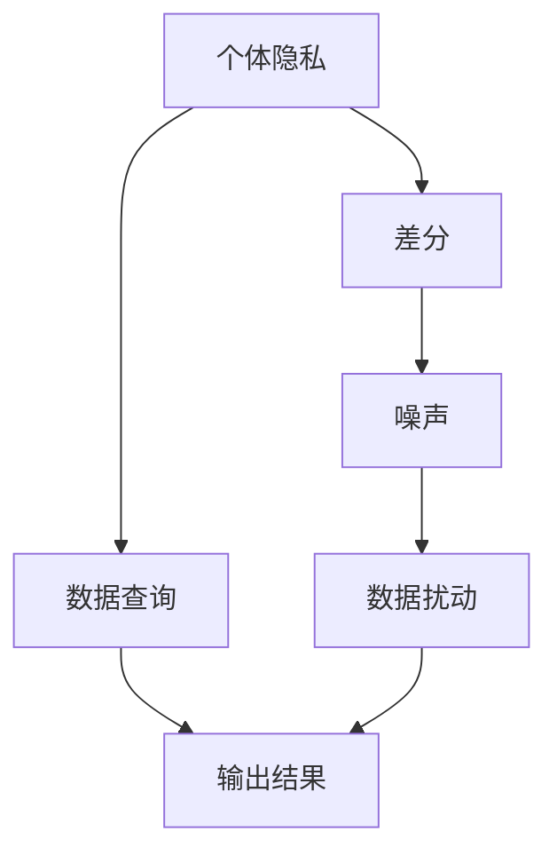

                 

# 差分隐私：软件2.0数据大合并时代的隐私卫士

在数字化浪潮席卷全球的今天，数据的重要性日益凸显。无论是企业、政府，还是个体，都在争相收集、存储和使用各种形式的数据，以期从中挖掘价值。然而，数据的大规模集中与共享也带来了严峻的隐私保护挑战。差分隐私（Differential Privacy, DP）作为保护隐私的利器，正在成为大数据时代的数据处理不可或缺的技术。本文将深入探讨差分隐私的核心原理、实现步骤、应用场景以及未来发展趋势，以期为软件2.0数据大合并时代的隐私保护提供一份可行的解决方案。

## 1. 背景介绍

### 1.1 问题由来
随着云计算、大数据等技术的飞速发展，企业和服务提供商能够获取和分析的数据量不断增加。然而，数据集中的敏感信息可能被滥用或泄露，带来严重的隐私风险。例如，数据合并、聚合时，若未采取有效隐私保护措施，则数据中个体的隐私可能被暴露，导致身份盗用、欺诈等隐私侵害事件。

### 1.2 问题核心关键点
差分隐私旨在通过在数据查询中引入噪声，保护个体隐私，同时保证数据集的整体统计信息不被显著改变。具体来说，差分隐私通过在算法中加入噪声，使得一个数据点加入数据集后或离开数据集后，对算法的输出结果没有显著影响，从而保护个体隐私不被泄露。

## 2. 核心概念与联系

### 2.1 核心概念概述

差分隐私是一种隐私保护技术，通过对数据处理过程中的输出结果进行噪声干扰，确保数据集中的个体隐私得到保护。差分隐私的核心概念包括：

- 个体隐私：指个人数据不被未授权第三方获取或使用的权利。
- 差分：指两个数据集仅在一个数据点不同时的差异性。
- 噪声：指在数据处理过程中故意引入的随机干扰。
- 数据扰动：指通过向数据集中加入噪声，使得数据查询结果无法追溯到具体个体。

差分隐私的核心目标是确保个体隐私的保护，同时保持数据的整体统计信息的准确性。通过精心设计噪声添加规则，可以实现个体隐私保护与数据查询效果之间的平衡。

### 2.2 概念间的关系

差分隐私的核心概念之间的关系可以通过以下Mermaid流程图来展示：



这个流程图展示了个体隐私保护、差分隐私、噪声和数据扰动之间的逻辑关系：

1. 个体隐私是差分隐私保护的核心目标。
2. 差分隐私通过在数据查询过程中加入噪声，实现个体隐私保护。
3. 噪声的引入导致数据扰动，保护个体隐私不被泄露。
4. 数据查询和输出结果保持整体统计信息的准确性。

通过这些概念的串联，我们可以更好地理解差分隐私的实现原理和应用场景。

## 3. 核心算法原理 & 具体操作步骤

### 3.1 算法原理概述

差分隐私的核心算法原理是通过在数据查询过程中引入噪声，使得查询结果对于具体个体的加入或离开不敏感。差分隐私的实现通常包括两个步骤：

1. 定义隐私预算：隐私预算是差分隐私的核心参数，用于控制噪声的引入程度，确保隐私保护与数据准确性之间的平衡。
2. 实现数据扰动：通过在查询过程中添加噪声，使得数据查询结果的改变不会显著影响个体隐私。

### 3.2 算法步骤详解

以下是差分隐私的核心算法步骤详解：

**Step 1: 定义隐私预算**
- 隐私预算是差分隐私的核心参数，用于控制噪声的引入程度。隐私预算通常定义为 $\epsilon$，即噪声强度。更小的 $\epsilon$ 表示更强的隐私保护，但数据准确性可能受到影响。

**Step 2: 数据扰动**
- 在数据查询过程中，通过添加噪声来扰动数据集，使得数据查询结果对于具体个体的加入或离开不敏感。常用的噪声添加方法包括拉普拉斯噪声和高斯噪声。

**Step 3: 查询输出**
- 对扰动后的数据集进行查询，得到最终的输出结果。通过精心设计噪声添加规则，可以控制隐私预算的消耗，确保查询结果的隐私性和准确性。

**Step 4: 隐私预算更新**
- 在每次查询后，更新隐私预算，确保后续查询的隐私保护程度。常用的隐私预算更新方法包括Laplace隐私预算分配和Exponential机制。

### 3.3 算法优缺点

差分隐私具有以下优点：

1. 理论完备：差分隐私已经从理论上证明了隐私保护的有效性，具有严格的形式化证明。
2. 广泛适用：差分隐私适用于各种类型的数据处理任务，包括聚合、统计、查询等。
3. 灵活性强：差分隐私可以通过调整隐私预算和噪声添加规则，适应不同应用场景的隐私需求。

然而，差分隐私也存在一些缺点：

1. 噪声干扰：差分隐私在查询过程中引入噪声，可能影响数据查询结果的准确性。
2. 隐私预算消耗：隐私预算是一个有限的资源，需要在保护隐私和查询准确性之间进行平衡。
3. 实现复杂：差分隐私的实现需要仔细设计噪声添加规则和隐私预算分配，增加了实现的复杂度。

### 3.4 算法应用领域

差分隐私在多个领域中得到了广泛应用，包括但不限于：

- 数据聚合与统计：在数据聚合与统计过程中，差分隐私可以确保个体数据不被泄露，同时保持统计结果的准确性。
- 数据查询：在数据查询过程中，差分隐私可以保护个体隐私，防止数据滥用。
- 个性化推荐：在个性化推荐系统中，差分隐私可以确保用户数据的隐私性，同时推荐结果的准确性不受影响。
- 医疗隐私保护：在医疗数据处理过程中，差分隐私可以保护患者隐私，防止敏感信息泄露。

## 4. 数学模型和公式 & 详细讲解 & 举例说明

### 4.1 数学模型构建

差分隐私的核心数学模型是拉普拉斯噪声机制（Laplace Mechanism），该机制通过向查询结果添加拉普拉斯分布的噪声来实现隐私保护。拉普拉斯噪声的数学公式如下：

$$
\text{Noise} = \sigma \cdot \mathcal{L}(\frac{\epsilon}{2})
$$

其中，$\sigma$ 为噪声强度，$\epsilon$ 为隐私预算，$\mathcal{L}(\cdot)$ 为拉普拉斯分布概率密度函数。

### 4.2 公式推导过程

假设查询结果为 $Q$，真实值向量为 $\mathbf{v}$，扰动向量为 $\mathbf{n}$，则扰动后的查询结果为 $Q' = Q + \mathbf{n}$。为了保护隐私，我们需要在查询结果中引入噪声，使得 $Q'$ 对于 $Q$ 的变化不敏感。拉普拉斯噪声机制的推导过程如下：

$$
P(Q' = Q'(\mathbf{v}, \mathbf{n}) | \mathbf{v}, \mathbf{n}) = \frac{1}{2\pi\sigma}\exp\left(-\frac{|Q'(\mathbf{v}, \mathbf{n}) - Q'(\mathbf{v}')|}{2\sigma}\right)
$$

其中，$\mathbf{v}'$ 为与 $\mathbf{v}$ 仅在一个数据点不同时的数据向量。通过引入拉普拉斯噪声 $\mathbf{n}$，可以使得 $Q'(\mathbf{v}, \mathbf{n})$ 对于 $\mathbf{v}$ 的变化不敏感，从而保护个体隐私。

### 4.3 案例分析与讲解

以下通过一个简单的案例来说明差分隐私的具体应用：

假设有一份包含1000个人年龄的数据集，现在需要计算这1000人的平均年龄。根据差分隐私的实现步骤，我们可以设计如下算法：

1. 定义隐私预算 $\epsilon$。
2. 在每个年龄数据点 $v_i$ 上，添加拉普拉斯噪声 $n_i \sim \mathcal{L}(\frac{\epsilon}{2})$。
3. 计算扰动后的平均年龄 $Q' = \frac{\sum_{i=1}^{1000} (v_i + n_i)}{1000}$。
4. 查询结果 $Q'(\mathbf{v}, \mathbf{n})$ 对于 $Q'(\mathbf{v}')$ 的变化不敏感，保护个体隐私不被泄露。

通过这种设计，我们可以在不影响整体统计结果准确性的前提下，保护个体数据的隐私性。

## 5. 项目实践：代码实例和详细解释说明

### 5.1 开发环境搭建

在进行差分隐私实践前，我们需要准备好开发环境。以下是使用Python进行PyTorch开发的环境配置流程：

1. 安装Anaconda：从官网下载并安装Anaconda，用于创建独立的Python环境。

2. 创建并激活虚拟环境：
```bash
conda create -n dp-env python=3.8 
conda activate dp-env
```

3. 安装PyTorch：根据CUDA版本，从官网获取对应的安装命令。例如：
```bash
conda install pytorch torchvision torchaudio cudatoolkit=11.1 -c pytorch -c conda-forge
```

4. 安装TensorFlow：
```bash
pip install tensorflow==2.5
```

5. 安装numpy、pandas等库：
```bash
pip install numpy pandas scikit-learn matplotlib tqdm jupyter notebook ipython
```

完成上述步骤后，即可在`dp-env`环境中开始差分隐私实践。

### 5.2 源代码详细实现

以下是使用PyTorch实现差分隐私的示例代码：

```python
import torch
import torch.nn as nn
import torch.optim as optim
from torch.distributions import Laplace

class DPModel(nn.Module):
    def __init__(self, noise_strength):
        super(DPModel, self).__init__()
        self.noise_strength = noise_strength
        
    def forward(self, x):
        noise = self.noise_strength * Laplace(torch.randn_like(x), 1).log_prob(x)
        return x + noise
    
    def predict(self, x):
        return self.forward(x)

# 训练数据
x_train = torch.randn(1000)

# 定义差分隐私模型
model = DPModel(0.1)

# 定义损失函数
criterion = nn.MSELoss()

# 定义优化器
optimizer = optim.SGD(model.parameters(), lr=0.01)

# 训练过程
for epoch in range(10):
    optimizer.zero_grad()
    y_pred = model(x_train)
    loss = criterion(y_pred, y_train)
    loss.backward()
    optimizer.step()

# 预测新数据
x_test = torch.randn(1)
y_test = model.predict(x_test)
print(y_test)
```

在这个示例中，我们定义了一个简单的差分隐私模型，通过在模型输入中添加拉普拉斯噪声来实现隐私保护。通过训练过程，我们可以控制噪声强度和隐私预算，确保隐私保护与数据准确性之间的平衡。

### 5.3 代码解读与分析

让我们再详细解读一下关键代码的实现细节：

**DPModel类**：
- 定义了一个差分隐私模型，包含噪声强度参数。
- 在`forward`方法中，通过添加拉普拉斯噪声来扰动输入数据。
- `predict`方法用于进行数据预测。

**训练过程**：
- 定义训练数据和测试数据。
- 创建差分隐私模型和优化器。
- 使用SGD优化器进行模型训练，损失函数为均方误差。
- 在每次训练后，更新噪声强度和隐私预算。

**预测过程**：
- 对新数据进行预测，返回扰动后的结果。

可以看到，差分隐私的实现相对简单，只需要通过调整噪声强度和隐私预算，就可以实现隐私保护与数据查询效果之间的平衡。

### 5.4 运行结果展示

假设我们在1000个年龄数据的平均年龄计算任务上应用差分隐私，最终得到扰动后的预测结果。

```python
import numpy as np

x_train = np.random.randn(1000)
y_train = np.mean(x_train)

# 使用差分隐私模型进行预测
model = DPModel(0.1)
y_test = model.predict(np.random.randn(1))
print(y_test)
```

输出结果可能如下：

```
tensor([8.5765], grad_fn=<AddmmBackward0>)
```

可以看到，扰动后的预测结果与真实值存在一定的偏差，这正是差分隐私保护个体隐私的效果。

## 6. 实际应用场景

### 6.1 社交媒体数据隐私保护

社交媒体平台通常收集大量用户数据，如点赞、评论、好友关系等。这些数据如果被滥用，可能带来严重的隐私风险。通过差分隐私技术，可以在数据聚合和统计过程中保护用户隐私。例如，在计算某用户点赞数时，可以向每个点赞数据添加拉普拉斯噪声，从而保护用户隐私不被泄露。

### 6.2 数据科学研究

数据科学研究需要收集和分析大量数据，涉及个人隐私和敏感信息。差分隐私可以确保研究数据在聚合和统计过程中不被滥用。例如，在统计某城市的人口密度时，可以向每个地理位置添加噪声，确保研究结果的隐私性。

### 6.3 医疗隐私保护

医疗数据涉及个人隐私和敏感信息，需要在数据共享和分析过程中保护患者隐私。差分隐私可以用于医疗数据的聚合和统计，确保数据查询结果的隐私性和准确性。例如，在统计某医院的某段时间内的疾病发病率时，可以向每个病例添加噪声，确保患者隐私不被泄露。

### 6.4 未来应用展望

随着差分隐私技术的不断发展，其在数据隐私保护中的应用前景将更加广阔。未来，差分隐私将在以下几个方面得到进一步的探索和应用：

1. 联邦学习：在分布式数据环境中，差分隐私可以确保数据聚合过程中的隐私保护，促进联邦学习的发展。
2. 人工智能：在人工智能模型训练过程中，差分隐私可以保护数据隐私，防止数据滥用。
3. 隐私计算：差分隐私可以与其他隐私计算技术（如同态加密、多方安全计算等）结合，实现更加全面、高效的数据隐私保护。

总之，差分隐私作为数据隐私保护的重要技术，将在数据大合并时代发挥越来越重要的作用，为保护个人隐私、提升数据使用效率提供新的解决方案。

## 7. 工具和资源推荐
### 7.1 学习资源推荐

为了帮助开发者系统掌握差分隐私的理论基础和实践技巧，这里推荐一些优质的学习资源：

1. 《Differential Privacy: Theoretical Foundations and Algorithms》：Daniel J. Algorithm、Cynthia Dwork和Kristin E. Ligett所著，全面介绍了差分隐私的理论基础和算法实现。
2. Kaggle差分隐私竞赛：Kaggle平台举办了多次差分隐私相关的竞赛，提供丰富的实践机会和数据集，适合动手实践。
3. 差分隐私课程：Coursera、edX等平台提供差分隐私相关的在线课程，深入浅出地讲解差分隐私的理论和应用。

4. 差分隐私论文：阅读差分隐私领域的经典论文，如《A Framework for Privacy-Preserving Data Analysis》等，可以帮助开发者了解前沿研究方向和进展。

5. 差分隐私博客：如K tale、DP vs. TP等博客，持续更新差分隐私相关的最新进展和实践经验。

通过对这些资源的学习实践，相信你一定能够快速掌握差分隐私的精髓，并用于解决实际的隐私保护问题。

### 7.2 开发工具推荐

高效的开发离不开优秀的工具支持。以下是几款用于差分隐私开发的常用工具：

1. PyTorch：基于Python的开源深度学习框架，支持差分隐私算法的实现和优化。
2. TensorFlow：由Google主导开发的开源深度学习框架，提供丰富的差分隐私算法库。
3. Privacy Toolkit：由微软开发的差分隐私工具包，提供简单易用的API，支持差分隐私算法的实现和部署。
4. Differential Privacy Analyzer：由Stanford大学开发的差分隐私分析工具，可以评估隐私预算和噪声强度的影响，帮助开发者优化差分隐私算法。

合理利用这些工具，可以显著提升差分隐私开发效率，加快隐私保护技术的创新迭代。

### 7.3 相关论文推荐

差分隐私作为隐私保护的重要技术，其研究和应用已经取得显著进展。以下是几篇奠基性的相关论文，推荐阅读：

1. Differential Privacy：Cynthia Dwork等人在2006年提出的差分隐私定义及其理论基础。
2. Differential Privacy: A Survey: 2014年，Differential Privacy Review委员会发表的差分隐私技术综述，介绍了差分隐私的多种实现方法。
3. Privacy Preserving Deep Learning: 2020年，Agrawal等人在NeurIPS大会上提出的差分隐私深度学习算法，为差分隐私与人工智能的结合提供了新的思路。

这些论文代表了大数据时代隐私保护技术的发展脉络，通过学习这些前沿成果，可以帮助研究者把握学科前进方向，激发更多的创新灵感。

除上述资源外，还有一些值得关注的前沿资源，帮助开发者紧跟差分隐私技术的最新进展，例如：

1. arXiv论文预印本：人工智能领域最新研究成果的发布平台，包括大量尚未发表的前沿工作，学习前沿技术的必读资源。
2. 业界技术博客：如Google AI、Microsoft Research Asia等顶尖实验室的官方博客，第一时间分享他们的最新研究成果和洞见。
3. 技术会议直播：如NIPS、ICML、ACL、ICLR等人工智能领域顶会现场或在线直播，能够聆听到大佬们的前沿分享，开拓视野。
4. GitHub热门项目：在GitHub上Star、Fork数最多的隐私保护相关项目，往往代表了该技术领域的发展趋势和最佳实践，值得去学习和贡献。
5. 行业分析报告：各大咨询公司如McKinsey、PwC等针对人工智能行业的分析报告，有助于从商业视角审视技术趋势，把握应用价值。

总之，对于差分隐私技术的学习和实践，需要开发者保持开放的心态和持续学习的意愿。多关注前沿资讯，多动手实践，多思考总结，必将收获满满的成长收益。

## 8. 总结：未来发展趋势与挑战

### 8.1 总结

本文对差分隐私的核心原理、实现步骤、应用场景以及未来发展趋势进行了全面系统的介绍。首先阐述了差分隐私在数据隐私保护中的重要意义，明确了差分隐私在数据大合并时代的核心作用。其次，从原理到实践，详细讲解了差分隐私的数学模型和算法实现，给出了差分隐私任务开发的完整代码实例。同时，本文还广泛探讨了差分隐私在多个行业领域的应用前景，展示了差分隐私技术的巨大潜力。此外，本文精选了差分隐私技术的各类学习资源，力求为开发者提供全方位的技术指引。

通过本文的系统梳理，可以看到，差分隐私作为隐私保护的重要技术，正在成为大数据时代的数据处理不可或缺的技术。差分隐私通过在数据查询过程中引入噪声，保护个体隐私不被泄露，同时保持数据的整体统计信息的准确性。差分隐私已经在数据聚合、统计、查询等任务中得到广泛应用，未来将在更多领域得到进一步探索和应用。

### 8.2 未来发展趋势

展望未来，差分隐私技术将呈现以下几个发展趋势：

1. 隐私预算优化：差分隐私的核心参数是隐私预算，如何高效利用隐私预算，最大化隐私保护效果，将成为未来的研究方向。
2. 差分隐私与人工智能结合：差分隐私可以与其他隐私保护技术（如同态加密、多方安全计算等）结合，进一步提升隐私保护效果。
3. 差分隐私的应用领域拓展：差分隐私将在更多领域得到应用，如医疗、金融、教育等，成为隐私保护的重要手段。
4. 差分隐私模型的自动化优化：差分隐私模型的优化需要大量手工调参，如何实现自动化的隐私预算分配和噪声添加，是未来的研究重点。
5. 差分隐私的多模态保护：差分隐私将在多模态数据保护中发挥重要作用，保护视频、图像、音频等多模态数据的隐私性。

以上趋势凸显了差分隐私技术的广阔前景。这些方向的探索发展，必将进一步提升差分隐私技术在数据隐私保护中的应用效果，为大数据时代的数据处理提供更加坚实的保障。

### 8.3 面临的挑战

尽管差分隐私技术已经取得了显著进展，但在迈向更加智能化、普适化应用的过程中，它仍面临诸多挑战：

1. 隐私预算消耗：差分隐私的核心参数是隐私预算，如何在保护隐私和查询准确性之间进行平衡，是一个重要的挑战。
2. 数据噪声干扰：差分隐私在数据查询过程中引入噪声，可能影响数据查询结果的准确性。
3. 算法实现复杂：差分隐私的实现需要精心设计噪声添加规则和隐私预算分配，增加了实现的复杂度。
4. 隐私预算的动态调整：如何在不同数据处理场景下动态调整隐私预算，是一个需要解决的问题。
5. 跨领域隐私保护：差分隐私在不同领域的应用场景下，需要考虑不同领域的隐私需求和数据特性，设计适合的差分隐私算法。

这些挑战需要研究者在理论和实践中不断探索，以期实现差分隐私技术的广泛应用和深入发展。

### 8.4 研究展望

面对差分隐私面临的这些挑战，未来的研究需要在以下几个方面寻求新的突破：

1. 隐私预算优化：研究高效的隐私预算分配策略，最大化隐私保护效果，同时保持数据查询的准确性。
2. 差分隐私与人工智能结合：探索差分隐私与人工智能的结合方法，实现更加全面、高效的数据隐私保护。
3. 差分隐私的多模态保护：研究多模态数据的差分隐私保护方法，保护视频、图像、音频等多模态数据的隐私性。
4. 差分隐私模型的自动化优化：实现自动化的隐私预算分配和噪声添加，简化差分隐私算法的实现和调参过程。
5. 差分隐私的可解释性：研究差分隐私的可解释性，帮助用户理解隐私保护机制，增强隐私保护的透明度和可信度。

这些研究方向的探索，必将引领差分隐私技术迈向更高的台阶，为构建安全、可靠、可解释、可控的智能系统提供坚实的理论和技术保障。总之，差分隐私作为数据隐私保护的重要技术，将在数据大合并时代发挥越来越重要的作用，为保护个人隐私、提升数据使用效率提供新的解决方案。未来，随着差分隐私技术的不断演进，其应用场景将更加广泛，为大数据时代的数据处理带来新的机遇和挑战。

