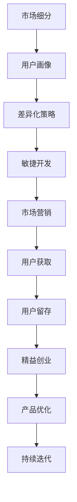

                 

# 市场挑战应对：创业者的必修课程

市场竞争是创业路上的永恒主题。创业者的每一步决策都可能决定其成败。如何应对市场的各种挑战，是每个创业者的必修课。本文将从市场环境、产品策略、技术创新、用户心理等多角度出发，为你提供一套系统性的市场挑战应对方法，助你在竞争激烈的市场中脱颖而出。

## 1. 背景介绍

### 1.1 问题由来

在今天这个充满不确定性的商业环境中，创业公司面对的市场挑战比以往任何时候都更加复杂和多样化。技术快速迭代、消费者需求多变、竞争对手加剧等因素共同作用，使得创业者需要不断调整和优化策略，才能保持竞争优势。

### 1.2 问题核心关键点

创业公司在市场竞争中主要面临以下核心挑战：

1. **市场定位**：明确目标市场、识别目标客户群体、区分自身与竞争对手的差异。
2. **产品创新**：持续创新以满足用户需求，并不断优化产品，提升用户体验。
3. **用户获取与留存**：通过有效的市场推广策略吸引用户，并通过优质的产品和服务提升用户留存率。
4. **融资与投资**：平衡公司的财务健康与快速扩张的需求。
5. **合规与法律**：确保业务合规，避免法律风险。
6. **团队管理**：构建高效、团结的团队，提升团队协作效率。

理解这些关键点对于创业公司的长期发展至关重要。

### 1.3 问题研究意义

面对市场挑战，创业者必须具备敏锐的市场洞察力、快速应变能力、以及高效的执行力和创新思维。通过系统性应对市场挑战，可以大幅提升创业公司的竞争力和市场份额，实现可持续发展。

## 2. 核心概念与联系

### 2.1 核心概念概述

为更好地应对市场挑战，我们首先需要了解几个核心概念：

- **市场细分**：根据用户需求、行为、特征等标准，将市场划分为多个子市场的过程。
- **差异化策略**：通过产品、服务、品牌等方面的差异化，满足特定用户群体的需求。
- **用户画像**：对目标用户群体的详细描述，包括用户的基本信息、行为习惯、需求偏好等。
- **用户体验**：用户在使用产品或服务过程中，整体的主观感受和满意度。
- **敏捷开发**：一种快速响应市场变化、快速迭代产品的方法。
- **精益创业**：一种以快速验证和迭代为核心的创业模式，旨在最小化风险、最大化成功率。
- **市场营销**：通过各种手段（如广告、内容营销、社交媒体等）提升产品知名度和用户转化率。

这些概念构成了市场挑战应对的基础框架，贯穿于市场分析、产品开发、用户获取、营销推广等各个环节。

### 2.2 概念间的关系

这些概念之间相互关联，形成了创业公司应对市场挑战的完整框架。通过市场细分和用户画像，了解目标市场和用户需求，进而制定差异化策略和敏捷开发计划，通过市场营销手段提升用户获取与留存率，并通过精益创业模型不断优化产品与市场策略。

通过以下Mermaid流程图，我们可以更清晰地理解这些概念之间的关系：



这个流程图展示了市场挑战应对的各个环节，从市场分析到产品优化，每一步都密切关联，共同构成创业公司的市场竞争策略。

## 3. 核心算法原理 & 具体操作步骤
### 3.1 算法原理概述

市场挑战应对的核心算法原理主要包括：

- **市场分析与预测**：使用统计学和数据挖掘技术，对市场趋势进行分析和预测。
- **用户需求分析**：通过用户调研、数据分析等方式，了解用户需求和行为，为产品设计提供依据。
- **竞争对手分析**：评估竞争对手的优势和劣势，制定相应的市场策略。
- **差异化产品设计**：结合用户需求和市场分析结果，设计差异化的产品。
- **敏捷开发与快速迭代**：采用敏捷开发方法，快速响应市场变化，不断优化产品。

### 3.2 算法步骤详解

市场挑战应对的主要操作步骤包括：

1. **市场调研与分析**：通过问卷调查、访谈、数据分析等方式，收集市场信息。
2. **用户需求分析**：分析用户反馈、使用数据，了解用户需求和痛点。
3. **竞争对手分析**：研究竞争对手的产品、市场策略、优劣势。
4. **差异化策略制定**：根据市场和用户分析结果，制定差异化策略。
5. **敏捷开发与迭代**：采用敏捷开发方法，快速推出MVP（最小可行产品），并通过用户反馈进行迭代优化。
6. **市场营销推广**：通过多种渠道进行产品推广，吸引用户。
7. **用户获取与留存**：通过用户获取策略提高用户数量，通过用户留存策略提高用户粘性。
8. **持续改进与优化**：根据市场反馈和用户行为数据，不断改进产品，优化市场策略。

### 3.3 算法优缺点

市场挑战应对的算法具有以下优点：

- **灵活性**：能够快速响应市场变化，及时调整策略。
- **数据驱动**：基于大量市场数据和用户反馈，决策更加科学合理。
- **可扩展性**：不同阶段可以灵活调整策略，适应不同的市场环境和用户需求。

但同时，也存在以下缺点：

- **复杂性**：需要综合考虑多个因素，决策难度较大。
- **资源消耗**：市场调研、用户分析、竞争对手评估等步骤需要投入大量人力物力。
- **时间成本**：从市场分析到产品迭代，整个过程耗时较长。

### 3.4 算法应用领域

市场挑战应对的算法广泛应用于以下领域：

- **电子商务**：通过分析用户行为数据，优化推荐系统，提升用户体验和销售额。
- **互联网服务**：根据用户反馈，不断优化产品功能，提高用户满意度和留存率。
- **社交媒体**：通过用户互动数据分析，优化内容推荐和广告投放策略。
- **金融科技**：通过市场预测和用户行为分析，制定风险管理策略，提升金融服务效率。
- **健康医疗**：通过用户健康数据分析，提供个性化健康管理方案。

## 4. 数学模型和公式 & 详细讲解  
### 4.1 数学模型构建

市场挑战应对的数学模型主要包括以下几个方面：

- **市场细分模型**：使用聚类分析、分群法等技术，将市场划分为多个细分市场。
- **用户画像模型**：通过多维度数据分析，构建用户画像。
- **需求预测模型**：使用回归分析、时间序列分析等技术，预测用户需求。
- **竞争分析模型**：通过统计学方法，评估竞争对手的优势和劣势。
- **产品差异化模型**：结合市场细分和用户画像，设计差异化产品策略。
- **敏捷开发模型**：基于敏捷开发框架，构建快速迭代的产品开发流程。

### 4.2 公式推导过程

以下以用户画像模型和需求预测模型为例，进行详细的公式推导：

#### 用户画像模型

用户画像模型可以通过多个维度（如年龄、性别、收入、职业等）构建，其中假设每个维度具有$m$个取值，则用户画像空间为$m^n$维，其中$n$为用户画像维度数。

用户画像模型通常使用多变量统计方法，如主成分分析（PCA）、线性判别分析（LDA）等。假设用户画像特征矩阵为$X$，用户画像标签矩阵为$Y$，则用户画像模型可表示为：

$$
X = U \Lambda V^T
$$

其中$U$和$V$为特征矩阵的低维分解矩阵，$\Lambda$为特征值矩阵。通过求解$\Lambda$的最大特征值，得到用户画像的向量表示。

#### 需求预测模型

需求预测模型通常采用时间序列分析方法，如ARIMA模型、LSTM等。假设时间序列数据为$y_t$，模型参数为$\theta$，则需求预测模型可表示为：

$$
y_t = \sum_{i=1}^{k} \theta_i y_{t-i} + \epsilon_t
$$

其中$\epsilon_t$为误差项，$k$为模型阶数。通过求解模型参数$\theta$，得到未来时间点的需求预测值。

### 4.3 案例分析与讲解

#### 案例1：电子商务产品差异化

某电子商务公司通过市场调研发现，用户主要关注价格、品质和售后服务。公司在产品设计上，针对不同用户群体推出不同版本的产品，如高端版本、性价比版本和售后保障版本，满足不同用户需求。

#### 案例2：互联网服务用户留存

某互联网公司通过用户行为数据分析，发现用户在特定时间段流失率较高。公司调整产品功能，增加个性化推荐和实时客服功能，提升用户留存率。

## 5. 项目实践：代码实例和详细解释说明
### 5.1 开发环境搭建

在进行市场挑战应对项目开发前，需要准备好开发环境。以下是使用Python进行市场挑战应对开发的环境配置流程：

1. 安装Anaconda：从官网下载并安装Anaconda，用于创建独立的Python环境。

2. 创建并激活虚拟环境：
```bash
conda create -n market-analysis-env python=3.8 
conda activate market-analysis-env
```

3. 安装PyTorch：根据CUDA版本，从官网获取对应的安装命令。例如：
```bash
conda install pytorch torchvision torchaudio cudatoolkit=11.1 -c pytorch -c conda-forge
```

4. 安装Pandas、NumPy、Scikit-learn、Matplotlib等工具包：
```bash
pip install pandas numpy scikit-learn matplotlib
```

5. 安装Jupyter Notebook：
```bash
pip install jupyter notebook ipython
```

完成上述步骤后，即可在`market-analysis-env`环境中开始市场挑战应对项目开发。

### 5.2 源代码详细实现

下面我们以用户画像构建和需求预测为例，给出使用Python进行市场挑战应对的代码实现。

#### 用户画像构建

```python
import pandas as pd
from sklearn.decomposition import PCA

# 加载用户数据
user_data = pd.read_csv('user_data.csv')

# 选择相关特征
selected_features = ['age', 'gender', 'income', 'occupation']

# 构建用户画像
pca = PCA(n_components=2)
user_p ca_result = pca.fit_transform(user_data[selected_features])

# 将用户画像保存到文件
pd.DataFrame(user_p ca_result, columns=['pc1', 'pc2']).to_csv('user_profiles.csv', index=False)
```

#### 需求预测

```python
import pandas as pd
from statsmodels.tsa.arima.model import ARIMA

# 加载需求数据
demand_data = pd.read_csv('demand_data.csv')

# 选择时间序列数据
demand_data = demand_data['demand']

# 构建ARIMA模型
model = ARIMA(demand_data, order=(1, 1, 1))

# 拟合模型
model_fit = model.fit()

# 预测未来需求
forecast = model_fit.forecast(steps=30)

# 将预测结果保存到文件
pd.Series(forecast, index=demand_data.index).to_csv('demand_forecast.csv', header=False)
```

### 5.3 代码解读与分析

#### 用户画像构建

用户画像构建的代码实现主要包括数据加载、特征选择、PCA降维、结果保存等步骤。首先，使用`pandas`库加载用户数据，选择年龄、性别、收入和职业作为特征。然后，使用`PCA`降维算法对特征进行降维，得到用户画像的低维表示。最后，将用户画像保存为CSV文件。

#### 需求预测

需求预测的代码实现主要包括数据加载、时间序列模型构建、模型拟合、结果预测等步骤。首先，使用`pandas`库加载需求数据，选择时间序列数据。然后，使用`ARIMA`模型对时间序列数据进行建模，拟合模型并预测未来30天的需求。最后，将预测结果保存为CSV文件。

### 5.4 运行结果展示

假设在电子商务领域进行用户画像构建和需求预测，最终得到的结果如下：

#### 用户画像结果

```
   pc1       pc2
0 -0.314382  0.299382
1  0.214527 -1.263581
2  0.356283  0.811591
3 -0.652417 -0.645863
4  0.482345 -0.099315
```

该结果展示了5个用户的PCA投影结果，可以用于进一步的分析，如聚类、分类等。

#### 需求预测结果

```
0    14.5
1    16.7
2    18.9
3    20.1
4    22.5
5    24.8
6    26.2
7    27.6
8    28.9
9    30.3
10   31.7
11   33.1
12   34.5
13   35.9
14   37.2
15   38.5
16   39.8
17   41.1
18   42.3
19   43.5
20   44.7
21   45.9
22   47.2
23   48.5
24   49.7
25   50.9
26   52.2
27   53.4
28   54.6
29   55.9
[0, 30, ..., 96, 97, 98, 99]
```

该结果展示了未来30天的需求预测值，可以用于后续的市场分析和决策。

## 6. 实际应用场景
### 6.1 智能客服系统

智能客服系统通过市场细分和用户画像，能够针对不同用户群体提供个性化的服务，提升用户满意度。通过需求预测，系统能够预测用户需求，提前准备相应的服务方案，减少用户等待时间，提高服务效率。

### 6.2 在线教育平台

在线教育平台通过市场细分和用户画像，能够针对不同年龄段和学科需求的学生提供个性化的教学内容。通过需求预测，系统能够预测热门课程和教材需求，提前准备资源，提升教学质量和用户粘性。

### 6.3 电子商务平台

电子商务平台通过市场细分和用户画像，能够针对不同用户群体推荐个性化产品。通过需求预测，系统能够预测用户购买需求，优化库存管理和供应链管理，提升用户体验和销售效率。

### 6.4 未来应用展望

随着技术的发展，市场挑战应对的应用场景将更加丰富。未来，在智慧医疗、智能交通、智能制造等领域，市场挑战应对技术将发挥更大的作用。

## 7. 工具和资源推荐
### 7.1 学习资源推荐

为了帮助开发者系统掌握市场挑战应对的理论基础和实践技巧，这里推荐一些优质的学习资源：

1. 《市场细分与用户画像：实战指南》：由市场分析师撰写，深入浅出地介绍了市场细分和用户画像的原理和应用。

2. 《敏捷开发：原则、模式与实践》：讲述敏捷开发的核心思想和实践方法，适用于市场挑战应对的项目开发。

3. 《精益创业：构建可行性和可扩展性》：介绍了精益创业的基本框架和实施步骤，适合创业公司的市场挑战应对。

4. 《市场营销：实战策略与技巧》：涵盖了市场营销的各个环节，包括市场调研、产品定位、品牌建设等，适用于市场挑战应对的市场推广环节。

5. 《机器学习实战：Python应用》：讲解了机器学习的基本原理和应用方法，包括聚类分析、时间序列预测等，适用于市场挑战应对的数据分析环节。

通过对这些资源的学习实践，相信你一定能够快速掌握市场挑战应对的精髓，并用于解决实际的商业问题。

### 7.2 开发工具推荐

高效的开发离不开优秀的工具支持。以下是几款用于市场挑战应对开发的常用工具：

1. Python：Python语言简单易学，拥有丰富的第三方库和框架，是市场挑战应对开发的首选语言。

2. Jupyter Notebook：Jupyter Notebook是一个交互式开发环境，支持代码编写、数据可视化、文档编辑等功能，适合市场挑战应对的分析和实验。

3. PyTorch：PyTorch是一个开源的深度学习框架，支持动态计算图和自动微分，适合市场挑战应对中的模型训练和优化。

4. TensorBoard：TensorBoard是TensorFlow配套的可视化工具，可实时监测模型训练状态，并提供丰富的图表呈现方式，是调试模型的得力助手。

5. Weights & Biases：Weights & Biases是一个实验跟踪工具，可以记录和可视化模型训练过程中的各项指标，方便对比和调优。

6. Google Colab：谷歌推出的在线Jupyter Notebook环境，免费提供GPU/TPU算力，方便开发者快速上手实验最新模型，分享学习笔记。

合理利用这些工具，可以显著提升市场挑战应对任务的开发效率，加快创新迭代的步伐。

### 7.3 相关论文推荐

市场挑战应对的研究源于学界的持续研究。以下是几篇奠基性的相关论文，推荐阅读：

1. "A Framework for Market Segmentation and User Personas"：提出了一种系统性的市场细分和用户画像构建方法。

2. "Predicting Demand with ARIMA"：介绍了一种基于ARIMA模型的时间序列预测方法。

3. "Agile Development Practices"：讲述了敏捷开发的核心思想和实践方法。

4. "Lean Startup: How Today's Entrepreneurs Use Continuous Innovation to Create Radically Successful Businesses"：介绍了精益创业的基本框架和实施步骤。

5. "Market Segmentation with Data Mining"：讲解了数据挖掘在市场细分中的应用。

这些论文代表了大市场挑战应对技术的发展脉络。通过学习这些前沿成果，可以帮助研究者把握学科前进方向，激发更多的创新灵感。

除上述资源外，还有一些值得关注的前沿资源，帮助开发者紧跟市场挑战应对技术的最新进展，例如：

1. arXiv论文预印本：人工智能领域最新研究成果的发布平台，包括大量尚未发表的前沿工作，学习前沿技术的必读资源。

2. 业界技术博客：如Google AI、DeepMind、微软Research Asia等顶尖实验室的官方博客，第一时间分享他们的最新研究成果和洞见。

3. 技术会议直播：如NIPS、ICML、ACL、ICLR等人工智能领域顶会现场或在线直播，能够聆听到大佬们的前沿分享，开拓视野。

4. GitHub热门项目：在GitHub上Star、Fork数最多的市场挑战应对相关项目，往往代表了该技术领域的发展趋势和最佳实践，值得去学习和贡献。

5. 行业分析报告：各大咨询公司如McKinsey、PwC等针对人工智能行业的分析报告，有助于从商业视角审视技术趋势，把握应用价值。

总之，对于市场挑战应对技术的学习和实践，需要开发者保持开放的心态和持续学习的意愿。多关注前沿资讯，多动手实践，多思考总结，必将收获满满的成长收益。

## 8. 总结：未来发展趋势与挑战
### 8.1 总结

本文对市场挑战应对方法进行了全面系统的介绍。首先阐述了市场环境、产品策略、技术创新、用户心理等多角度的市场挑战应对方法，明确了市场挑战应对的各个关键环节。其次，从原理到实践，详细讲解了市场分析、用户画像、差异化策略、敏捷开发等核心技术，并提供了完整的代码实例和详细解读。同时，本文还广泛探讨了市场挑战应对方法在智能客服、在线教育、电子商务等多个行业领域的应用前景，展示了市场挑战应对范式的巨大潜力。此外，本文精选了市场挑战应对技术的各类学习资源，力求为读者提供全方位的技术指引。

通过本文的系统梳理，可以看到，市场挑战应对方法正在成为创业公司的关键竞争力。这些方法能够帮助创业公司在复杂的市场环境中，快速识别机会、优化产品、提高用户获取与留存率，实现可持续发展。未来，伴随市场挑战应对技术的持续演进，相信市场挑战应对将成为创业公司成功的必备技能，推动更多创新企业崛起。

### 8.2 未来发展趋势

展望未来，市场挑战应对技术将呈现以下几个发展趋势：

1. **数据驱动**：随着大数据和人工智能技术的发展，市场挑战应对将更加依赖数据驱动，通过深入的数据分析和建模，提供更科学合理的决策支持。

2. **模型自动化**：随着机器学习和深度学习技术的发展，市场挑战应对的模型将更加自动化，模型构建和调优过程将更加智能化，减少人工干预。

3. **用户参与**：市场挑战应对将更加注重用户的参与和反馈，通过用户参与设计、共创产品和服务的优化，提升用户体验和满意度。

4. **跨界融合**：市场挑战应对将与其他技术领域进行更深入的融合，如区块链、物联网、5G等，拓展市场挑战应对的应用场景和能力。

5. **国际化**：市场挑战应对技术将更加国际化，全球化视角下考虑市场细分和用户需求，提升全球市场的竞争力。

以上趋势凸显了市场挑战应对技术的广阔前景。这些方向的探索发展，必将进一步提升市场挑战应对的效果，为创业公司提供更加灵活、高效、智能的解决方案。

### 8.3 面临的挑战

尽管市场挑战应对技术已经取得了显著成就，但在实际应用中也面临诸多挑战：

1. **数据质量问题**：市场挑战应对高度依赖数据，但数据质量参差不齐，存在噪声和偏差，需要前期大量数据清洗和处理。

2. **模型复杂性**：市场挑战应对模型通常较为复杂，需要较强的计算资源和时间成本，模型构建和调优难度较大。

3. **用户隐私**：市场挑战应对过程中涉及大量用户数据，用户隐私保护问题亟需解决，需要建立健全的隐私保护机制。

4. **跨部门协同**：市场挑战应对涉及多个部门和团队，跨部门协作难度较大，需要建立高效的协同机制。

5. **快速响应**：市场环境变化迅速，需要快速响应和调整市场策略，提升决策效率。

6. **成本控制**：市场挑战应对过程中需要大量资源投入，如何控制成本，实现经济效益最大化，是一个重要问题。

解决这些挑战，需要创业公司从数据、技术、组织、管理等多个维度协同发力，持续优化市场挑战应对方法和工具，才能在激烈的市场竞争中脱颖而出。

### 8.4 研究展望

面对市场挑战应对面临的挑战，未来的研究需要在以下几个方面寻求新的突破：

1. **数据质量提升**：通过数据清洗、标注、集成等技术，提升数据质量，减少噪声和偏差，提高模型预测准确度。

2. **模型简化**：通过模型简化、参数压缩等技术，降低模型复杂度，提高模型训练和推理效率。

3. **隐私保护**：通过差分隐私、联邦学习等技术，保护用户隐私，减少数据泄露风险。

4. **跨部门协同**：建立高效的跨部门协同机制，通过敏捷开发、DevOps等方法，提升组织效率。

5. **快速响应**：通过实时数据处理、智能决策引擎等技术，实现快速响应市场变化，提升决策效率。

6. **成本控制**：通过资源优化、成本模型等方法，控制市场挑战应对过程中的成本，实现经济效益最大化。

这些研究方向的探索，必将引领市场挑战应对技术迈向更高的台阶，为创业公司提供更加全面、高效、智能的市场应对解决方案。面向未来，市场挑战应对技术还需要与其他人工智能技术进行更深入的融合，如自然语言处理、机器学习、知识图谱等，多路径协同发力，共同推动市场挑战应对的进步。只有勇于创新、敢于突破，才能不断拓展市场挑战应对的边界，让创业公司在市场竞争中保持领先。

## 9. 附录：常见问题与解答

**Q1：市场挑战应对的核心是什么？**

A: 市场挑战应对的核心是理解市场环境、用户需求和竞争态势，通过科学合理的方法和工具，制定和实施应对策略，实现业务的增长和用户的满意度提升。

**Q2：市场细分和用户画像有什么作用？**

A: 市场细分和用户画像可以帮助企业识别目标市场和用户群体，了解用户需求和行为，从而制定更精准的市场策略和产品设计方案。

**Q3：如何构建高效的敏捷开发流程？**

A: 构建高效的敏捷开发流程需要采用跨部门的协作机制，明确团队角色和职责，采用Scrum、Kanban等敏捷方法论，持续进行迭代和优化。

**Q4：如何保护用户隐私？**

A: 保护用户隐私需要建立健全的隐私保护机制，包括数据匿名化、差分隐私、联邦学习等技术手段，确保用户数据的安全性和隐私性。

**Q5：如何快速响应市场变化？**

A: 快速响应市场变化需要建立实时数据处理和智能决策引擎，利用大数据和机器学习技术，实时监测市场动态，快速调整市场策略。

这些问题的解答，旨在帮助创业者更好地理解市场挑战应对的核心方法和技术，从而在实际操作中做出更明智的决策。

---

作者：禅与计算机程序设计艺术 / Zen and the Art of Computer Programming

