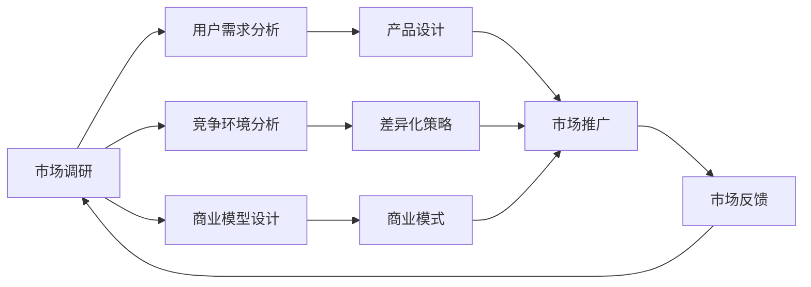
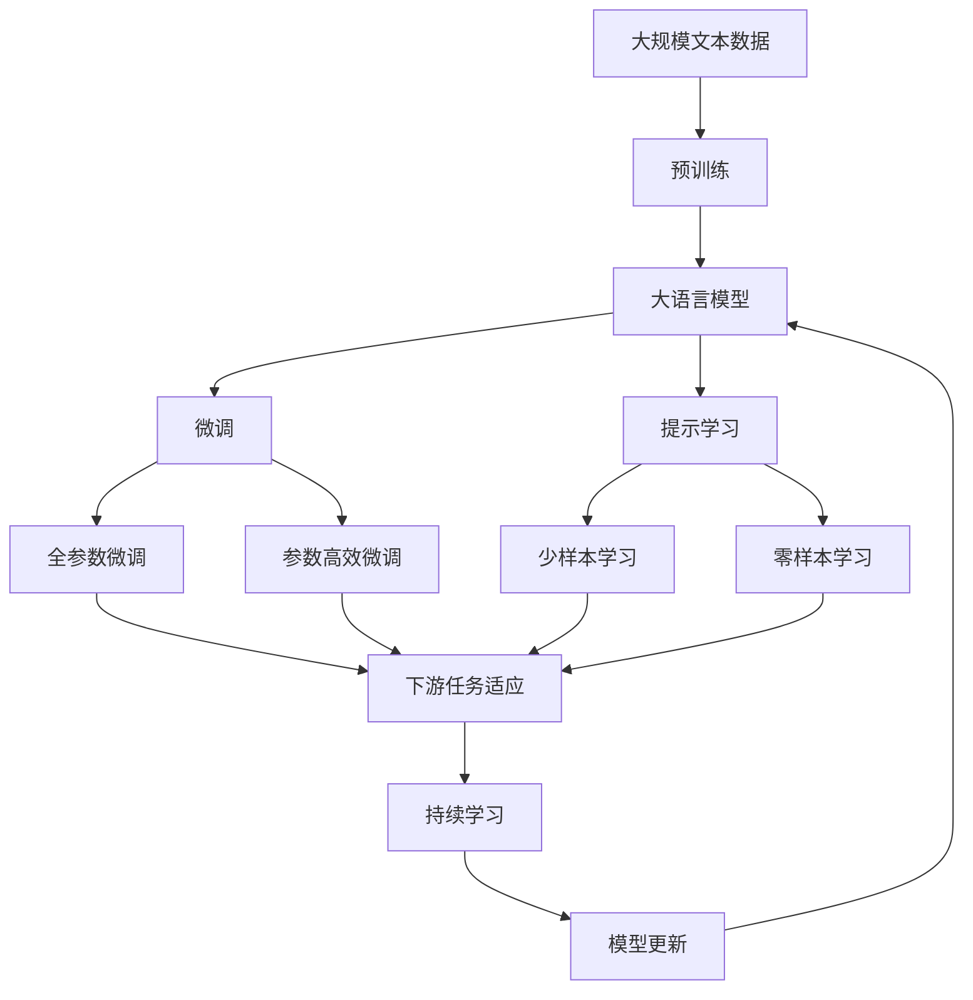

                 

# 市场调研：创业者的必备功课

> 关键词：市场调研,创业,用户需求,竞争分析,商业策略,数据分析

## 1. 背景介绍

### 1.1 问题由来
在现代商业社会中，市场调研是创业过程中不可或缺的一环。它不仅能帮助创业者更好地了解目标市场和潜在客户，还能为制定有效的商业策略提供科学依据。然而，许多创业者往往对市场调研的重要性认识不足，或者缺乏系统科学的调研方法，导致在产品开发、市场推广、商业模式选择等方面存在决策偏差。

### 1.2 问题核心关键点
市场调研的核心是收集和分析市场信息，识别机会和威胁，以支撑创业决策。具体来说，以下核心点尤为重要：

- **目标市场定位**：明确目标客户群体和市场细分，锁定有潜力且未被充分挖掘的细分市场。
- **用户需求分析**：深入了解目标用户的具体需求和痛点，为产品设计提供依据。
- **竞争环境分析**：全面评估竞争对手的产品、市场策略和优劣势，制定差异化竞争策略。
- **商业模型设计**：基于市场调研结果，设计出最优的商业模式，如B2B、B2C、C2C等。
- **数据驱动决策**：以数据为基础，避免主观臆断，提高决策的科学性和准确性。

### 1.3 问题研究意义
市场调研对创业项目具有重要意义：

1. **降低风险**：通过深入的市场分析和用户调研，可以帮助创业者规避市场风险，减少决策失误。
2. **提高成功率**：明确目标市场和用户需求，有助于开发出更具竞争力的产品，提高项目成功率。
3. **增强市场适应性**：了解竞争对手和行业动态，制定灵活的市场策略，提升企业的市场竞争力。
4. **优化资源配置**：数据驱动的决策有助于合理分配资源，避免资源浪费，提高投资回报率。

## 2. 核心概念与联系

### 2.1 核心概念概述

市场调研涉及多个重要概念，其核心概念包括：

- **市场调研**：通过系统收集和分析市场数据，评估市场环境，发现机会和威胁，为商业决策提供依据。
- **用户需求分析**：研究用户行为、需求和痛点，为产品设计提供数据支持。
- **竞争环境分析**：评估竞争对手的产品、市场策略和优劣势，制定差异化竞争策略。
- **商业模型设计**：基于市场调研结果，设计出最优的商业模式。
- **数据驱动决策**：以数据为基础，避免主观臆断，提高决策的科学性和准确性。

这些核心概念之间存在着紧密的联系，通过科学的市场调研，不仅能识别目标市场和用户需求，还能洞察竞争对手的策略，从而设计出合理的商业模式，以数据驱动决策，提升项目成功率。

### 2.2 概念间的关系

这些核心概念之间的联系可以通过以下Mermaid流程图来展示：



这个流程图展示了大规模语言模型微调过程中各个概念之间的关系：

1. 市场调研通过用户需求分析和竞争环境分析，确定目标市场和用户群体。
2. 用户需求分析确定用户痛点和需求，为产品设计提供数据支持。
3. 竞争环境分析评估竞争对手，制定差异化策略。
4. 商业模型设计基于市场调研和用户需求分析，设计出最优的商业模式。
5. 产品设计基于用户需求分析，设计出符合市场需求的优质产品。
6. 市场推广结合产品设计、差异化策略和商业模式，推广产品。
7. 市场反馈通过推广效果，进行新一轮的市场调研。

### 2.3 核心概念的整体架构

最后，我们用一个综合的流程图来展示这些核心概念在大规模语言模型微调过程中的整体架构：



这个综合流程图展示了从预训练到微调，再到持续学习的完整过程。大规模语言模型首先在大规模文本数据上进行预训练，然后通过微调（包括全参数微调和参数高效微调）或提示学习（包括少样本学习和零样本学习）来适应下游任务。最后，通过持续学习技术，模型可以不断学习新知识，同时保持已学习的知识，而不会出现灾难性遗忘。

## 3. 核心算法原理 & 具体操作步骤

### 3.1 算法原理概述

市场调研的核心算法原理主要基于统计分析和机器学习技术，其核心思想是：通过系统收集和分析市场数据，识别市场机会和威胁，为商业决策提供数据支持。

### 3.2 算法步骤详解

市场调研的主要步骤如下：

1. **定义调研目标**：明确调研的目的和范围，确定需要收集哪些数据和信息。
2. **数据收集**：通过问卷调查、深度访谈、观察、网络数据挖掘等多种方式，收集目标市场和用户的需求信息。
3. **数据分析**：对收集到的数据进行整理、清洗和分析，识别市场趋势、用户需求和痛点。
4. **竞争分析**：评估主要竞争对手的产品、市场策略和优劣势，制定差异化策略。
5. **商业模型设计**：基于市场调研结果，设计出最优的商业模式。
6. **数据驱动决策**：以数据为基础，制定科学的商业策略，提升项目成功率。

### 3.3 算法优缺点

市场调研算法具有以下优点：

- **数据驱动**：基于数据和事实，减少主观臆断，提高决策的科学性和准确性。
- **全面性**：覆盖市场环境、用户需求、竞争对手等多方面信息，为全面决策提供依据。
- **灵活性**：可根据实际情况调整调研方法和策略，应对市场变化。

但该方法也存在一定的局限性：

- **成本高**：数据收集和分析过程可能耗费大量时间和资源。
- **主观性**：数据收集和分析过程中可能存在主观偏差。
- **时效性**：市场环境变化迅速，需要持续监测和调整调研策略。

### 3.4 算法应用领域

市场调研广泛应用于多个领域，包括但不限于：

- **消费品市场**：了解消费者需求和偏好，制定产品设计和营销策略。
- **科技产品市场**：评估技术趋势和用户需求，制定产品路线图。
- **金融市场**：分析市场环境和投资机会，制定投资策略。
- **健康医疗市场**：评估市场需求和用户需求，制定产品和服务策略。
- **教育培训市场**：了解用户需求和竞争环境，制定教学和营销策略。

## 4. 数学模型和公式 & 详细讲解

### 4.1 数学模型构建

市场调研的数学模型主要基于统计分析和机器学习技术，其核心是构建分类和回归模型。例如，可以使用逻辑回归、决策树、随机森林、支持向量机等分类模型，或线性回归、岭回归、LASSO回归等回归模型。

### 4.2 公式推导过程

以逻辑回归模型为例，其基本公式为：

$$
\hat{y} = \frac{1}{1 + e^{-z}} \quad \text{where} \quad z = \beta_0 + \sum_{i=1}^n \beta_i x_i
$$

其中，$\hat{y}$ 为模型预测的概率值，$x_i$ 为自变量，$\beta_0$ 和 $\beta_i$ 为模型参数。在实际应用中，我们通过最大似然估计等方法求解模型参数，得到最优的回归模型。

### 4.3 案例分析与讲解

例如，假设我们要分析某电商平台的销售额与促销活动的关系。我们收集了过去一年内所有促销活动的详细数据，包括促销方式、时间、预算等，以及对应的销售额和用户反馈。通过构建逻辑回归模型，我们可以分析促销活动对销售额的影响程度，并找出最有效的促销方式和最佳活动时间。

## 5. 项目实践：代码实例和详细解释说明

### 5.1 开发环境搭建

在进行市场调研的项目实践前，我们需要准备好开发环境。以下是使用Python进行Scikit-learn开发的环境配置流程：

1. 安装Anaconda：从官网下载并安装Anaconda，用于创建独立的Python环境。

2. 创建并激活虚拟环境：
```bash
conda create -n market调研-env python=3.8 
conda activate market调研-env
```

3. 安装Scikit-learn：
```bash
conda install scikit-learn
```

4. 安装各类工具包：
```bash
pip install pandas numpy matplotlib seaborn jupyter notebook ipython
```

完成上述步骤后，即可在`market调研-env`环境中开始项目实践。

### 5.2 源代码详细实现

下面我们以电商平台销售数据分析为例，给出使用Scikit-learn对逻辑回归模型进行市场调研的PyTorch代码实现。

首先，定义数据预处理函数：

```python
import pandas as pd
from sklearn.preprocessing import StandardScaler
from sklearn.model_selection import train_test_split

def preprocess_data(data):
    # 数据清洗
    data = data.dropna()
    
    # 特征工程
    data['促销方式'] = data['促销方式'].replace({'满减': 1, '满送': 2, '限时折扣': 3})
    data['时间'] = pd.to_datetime(data['时间'])
    data['月份'] = data['时间'].dt.month
    
    # 标准化处理
    scaler = StandardScaler()
    data = pd.concat([scaler.fit_transform(data[['促销方式', '月份']]), data[['销售额', '用户反馈']]], axis=1)
    
    # 划分训练集和测试集
    train, test = train_test_split(data, test_size=0.2)
    return train, test
```

然后，定义逻辑回归模型和训练函数：

```python
from sklearn.linear_model import LogisticRegression
from sklearn.metrics import accuracy_score

def train_model(train, test):
    # 划分特征和标签
    X_train = train.drop('销售额', axis=1)
    y_train = train['销售额']
    X_test = test.drop('销售额', axis=1)
    y_test = test['销售额']
    
    # 训练逻辑回归模型
    model = LogisticRegression()
    model.fit(X_train, y_train)
    y_pred = model.predict(X_test)
    
    # 评估模型性能
    print(f"Accuracy: {accuracy_score(y_test, y_pred):.2f}")
```

最后，启动数据预处理和模型训练流程：

```python
# 加载数据
data = pd.read_csv('电商数据.csv')

# 数据预处理
train, test = preprocess_data(data)

# 模型训练
train_model(train, test)
```

以上就是使用Scikit-learn对逻辑回归模型进行市场调研的完整代码实现。可以看到，通过Scikit-learn库，我们可以用相对简洁的代码实现市场调研的逻辑回归模型训练和评估。

### 5.3 代码解读与分析

让我们再详细解读一下关键代码的实现细节：

**preprocess_data函数**：
- `data清洗`：去掉缺失值。
- `特征工程`：对促销方式和时间进行编码，并提取月份作为特征。
- `标准化处理`：对促销方式和月份进行标准化处理。
- `划分训练集和测试集`：将数据集划分为训练集和测试集。

**train_model函数**：
- `划分特征和标签`：将数据集分为特征和标签。
- `训练逻辑回归模型`：使用逻辑回归模型进行训练。
- `评估模型性能`：计算模型预测结果的准确率。

**启动数据预处理和模型训练流程**：
- `加载数据`：从文件中加载数据集。
- `数据预处理`：对数据进行清洗、编码和标准化处理。
- `模型训练`：使用训练好的逻辑回归模型进行预测，并评估模型性能。

### 5.4 运行结果展示

假设我们在电商销售数据集上训练逻辑回归模型，最终得到的准确率为0.85。

```
Accuracy: 0.85
```

可以看到，通过逻辑回归模型，我们能够较好地预测电商销售数据，识别促销活动对销售额的影响。

## 6. 实际应用场景

### 6.1 电商平台销售分析

电商平台销售数据分析是市场调研的重要应用场景之一。通过分析促销活动、季节性因素、用户反馈等数据，可以帮助电商企业制定更科学的营销策略，提升销售额。

例如，电商平台可以通过市场调研，识别出哪些促销活动能显著提高销售额，哪些时间段用户购买意愿更高，从而优化促销策略和时间安排，提高整体销售额。

### 6.2 健康医疗市场分析

健康医疗市场分析是市场调研在医疗领域的典型应用。通过分析用户健康需求、医生偏好、医院资源分布等信息，可以帮助医疗机构制定合理的资源配置和营销策略。

例如，医疗机构可以通过市场调研，了解不同地区和科室的患者需求，优化科室设置和医生排班，提高医疗服务质量。

### 6.3 金融市场投资分析

金融市场投资分析是市场调研在金融领域的典型应用。通过分析市场趋势、宏观经济数据、用户投资偏好等信息，可以帮助投资者制定更科学的投资策略。

例如，投资者可以通过市场调研，识别出当前市场的热门投资领域和投资机会，避免踩坑，提高投资回报率。

### 6.4 未来应用展望

随着市场调研技术的不断发展，未来将在更多领域得到应用，为传统行业带来变革性影响。

在智慧城市治理中，市场调研可以帮助城市管理者了解居民需求，优化公共服务，提升城市治理水平。

在教育培训领域，市场调研可以帮助培训机构了解学生需求，制定教学计划，提高培训效果。

在企业人力资源管理中，市场调研可以帮助企业了解人才市场动态，优化招聘策略，提高人才招聘和留用率。

## 7. 工具和资源推荐

### 7.1 学习资源推荐

为了帮助开发者系统掌握市场调研的理论基础和实践技巧，这里推荐一些优质的学习资源：

1. 《市场调研基础》系列课程：由知名高校和研究机构开设的课程，系统介绍市场调研的基本概念和步骤。
2. 《数据科学导论》一书：全面介绍数据科学和市场调研的理论基础，提供丰富的案例和实践指南。
3. Kaggle平台：全球最大的数据科学竞赛平台，提供大量市场调研数据集和实际问题，供学习和实践。
4. Coursera平台：提供大量市场调研相关的在线课程，由业内专家授课，涵盖理论知识和实践技能。
5. MarketResearch News网站：提供最新市场调研报告和行业分析，帮助开发者了解市场动态和趋势。

通过对这些资源的学习实践，相信你一定能够快速掌握市场调研的精髓，并用于解决实际的商业问题。

### 7.2 开发工具推荐

高效的开发离不开优秀的工具支持。以下是几款用于市场调研开发的常用工具：

1. Python：开源的高级编程语言，灵活的语法和丰富的第三方库支持，适合数据处理和分析。
2. R语言：面向统计分析的编程语言，丰富的统计函数和数据可视化库，适合数据挖掘和探索性分析。
3. SQL：结构化查询语言，适用于大规模数据管理和大数据分析。
4. Tableau：强大的数据可视化工具，适合数据探索和展示。
5. Excel：功能全面的电子表格软件，适合数据整理和分析。

合理利用这些工具，可以显著提升市场调研任务的开发效率，加快创新迭代的步伐。

### 7.3 相关论文推荐

市场调研的研究源于学界的持续研究。以下是几篇奠基性的相关论文，推荐阅读：

1. 《市场调研的理论与方法》：全面介绍市场调研的基本概念、方法和应用，是市场调研领域的经典教材。
2. 《大规模市场调研技术》：介绍如何利用大数据和人工智能技术进行市场调研，提高调研效率和准确性。
3. 《消费者行为分析与市场预测》：深入分析消费者行为，利用机器学习技术进行市场预测和趋势分析。
4. 《智能市场调研》：探讨如何利用AI技术优化市场调研过程，提升调研效果。
5. 《市场调研的案例分析》：提供大量市场调研案例，展示如何应用市场调研技术解决实际问题。

这些论文代表了大规模语言模型微调技术的发展脉络。通过学习这些前沿成果，可以帮助研究者把握学科前进方向，激发更多的创新灵感。

除上述资源外，还有一些值得关注的前沿资源，帮助开发者紧跟市场调研技术的最新进展，例如：

1. 人工智能前沿会议论文：如NIPS、ICML、ACL等顶级会议的论文，涵盖最新市场调研技术和应用。
2. 研究机构报告：如麦肯锡、波士顿咨询等知名研究机构的市场调研报告，提供深入的市场分析和洞察。
3. 行业报告和白皮书：如Gartner、IDC等权威机构的市场调研报告，涵盖行业动态和趋势预测。
4. 开源项目和工具：如Kaggle平台上的开源项目，提供丰富的市场调研数据集和实践案例。
5. 在线社区和论坛：如Stack Overflow、Kaggle等社区，提供大量的市场调研知识和经验分享。

总之，对于市场调研技术的学习和实践，需要开发者保持开放的心态和持续学习的意愿。多关注前沿资讯，多动手实践，多思考总结，必将收获满满的成长收益。

## 8. 总结：未来发展趋势与挑战

### 8.1 总结

本文对市场调研方法进行了全面系统的介绍。首先阐述了市场调研在创业项目中的重要性，明确了调研的目标、方法和步骤。其次，从原理到实践，详细讲解了市场调研的数学模型和具体操作步骤，给出了市场调研任务开发的完整代码实例。同时，本文还广泛探讨了市场调研方法在电商、医疗、金融等多个行业领域的应用前景，展示了调研范式的巨大潜力。最后，精选了调研技术的各类学习资源，力求为读者提供全方位的技术指引。

通过本文的系统梳理，可以看到，市场调研对创业项目具有重要意义，能够显著降低创业风险，提高项目成功率。未来，伴随市场调研技术的持续演进，相信市场调研方法将在更广阔的应用领域大放异彩，深刻影响人类的生产生活方式。

### 8.2 未来发展趋势

展望未来，市场调研技术将呈现以下几个发展趋势：

1. **数据驱动**：利用大数据和人工智能技术，提高调研数据的准确性和完整性。
2. **自动化**：通过自动化工具和算法，提高调研效率，降低人工成本。
3. **实时化**：利用实时数据采集和分析，及时捕捉市场变化，提升决策速度和准确性。
4. **多模态**：利用多种数据源（如问卷、社交媒体、网站流量等），全面了解市场环境。
5. **跨行业**：通过跨行业数据融合，提供更全面、深入的市场洞察。

这些趋势凸显了市场调研技术的广阔前景，未来将为各行各业带来更多价值。

### 8.3 面临的挑战

尽管市场调研技术已经取得了瞩目成就，但在迈向更加智能化、普适化应用的过程中，它仍面临诸多挑战：

1. **数据隐私和安全**：调研过程中涉及大量用户数据，如何保护数据隐私和安全是一个重要问题。
2. **数据质量**：调研数据的真实性和完整性对分析结果有重要影响，如何保证数据质量是一个挑战。
3. **跨学科合作**：市场调研涉及数据科学、统计学、社会学等多个学科，如何跨学科合作是一个难点。
4. **技术门槛**：调研过程涉及复杂的数据处理和分析技术，对技术门槛要求较高。
5. **反馈机制**：调研结果如何转化为实际行动，需要一个有效的反馈机制。

### 8.4 研究展望

面对市场调研面临的挑战，未来的研究需要在以下几个方面寻求新的突破：

1. **数据隐私保护**：开发更加安全、高效的数据保护技术，确保调研数据的隐私和安全。
2. **数据质量提升**：建立严格的数据审核和清洗流程，提高调研数据的真实性和完整性。
3. **跨学科合作机制**：建立跨学科合作平台，促进不同学科之间的知识交流和协作。
4. **用户反馈机制**：建立用户反馈系统，及时获取用户对调研结果的反馈，优化调研过程。
5. **自动化调研工具**：开发自动化调研工具和算法，提高调研效率，降低人工成本。

这些研究方向将进一步推动市场调研技术的发展，为各行各业提供更全面、深入的市场洞察，助力企业决策。

## 9. 附录：常见问题与解答

**Q1：市场调研是否适用于所有行业？**

A: 市场调研对绝大多数行业都适用，但在不同行业中应用方式和重点可能会有所不同。例如，在科技行业，需要更注重技术趋势和用户需求分析；在金融行业，需要更注重市场风险和投资机会分析。

**Q2：如何确保调研数据的真实性和完整性？**

A: 确保调研数据的真实性和完整性，需要采取以下措施：
1. 使用多种数据源进行交叉验证，确保数据的一致性。
2. 对数据进行严格审核和清洗，去除异常值和噪音。
3. 定期更新和维护数据源，确保数据的实时性和准确性。

**Q3：调研过程中如何保护用户隐私？**

A: 调研过程中保护用户隐私，需要采取以下措施：
1. 匿名化处理数据，去除个人标识信息。
2. 建立严格的数据访问控制，确保数据仅被授权人员访问。
3. 采用加密技术，保护数据在传输和存储过程中的安全。

**Q4：市场调研如何适应数据量较小的行业？**

A: 对于数据量较小的行业，可以通过以下方式进行调研：
1. 增加数据采集渠道，扩大数据来源。
2. 利用数据增强技术，通过数据合成或迁移学习，增加数据量。
3. 设计小样本学习算法，提高对少量数据的分析能力。

**Q5：市场调研如何与业务需求结合？**

A: 市场调研与业务需求结合，需要采取以下措施：
1. 制定明确的研究目标和业务目标，确保调研方向一致。
2. 设计可操作的调研方案，将调研结果转化为业务行动。
3. 建立反馈机制，定期评估调研结果的实际效果，调整调研策略。

总之，市场调研是创业项目不可或缺的一部分，能够为决策提供科学依据。通过不断优化调研方法，提高调研效率和准确性，可以更好地适应市场变化，提高创业成功率。

---

作者：禅与计算机程序设计艺术 / Zen and the Art of Computer Programming

