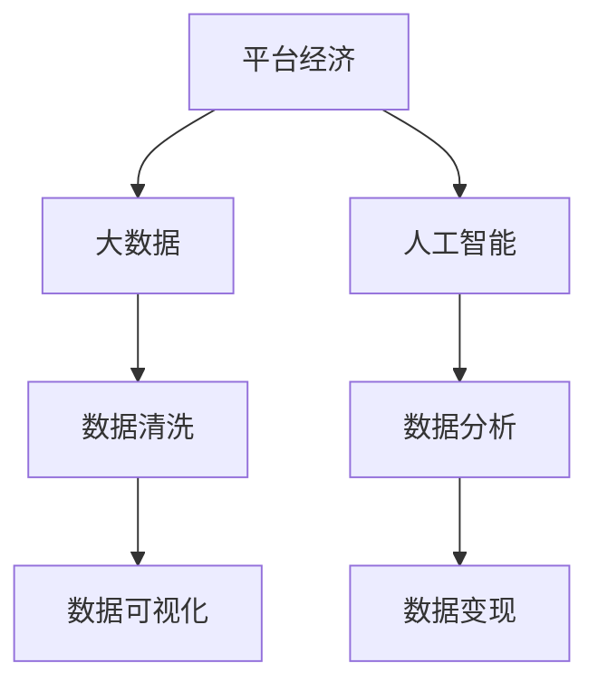
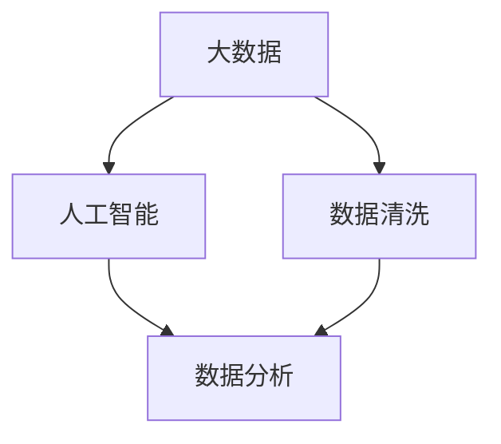
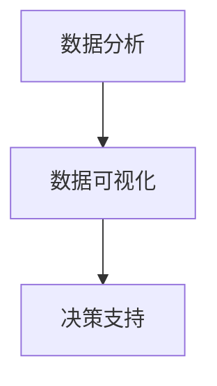
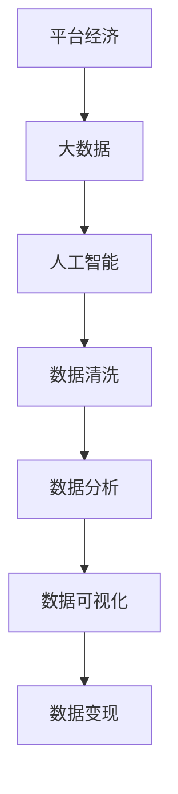

                 

## 1. 背景介绍

### 1.1 问题由来

当前，平台经济蓬勃发展，成为经济增长的新引擎。平台企业通过聚合大量用户和资源，实现高效配置和价值变现。然而，尽管平台经济带来了巨大的商业价值，但平台企业也面临着诸多数据变现的挑战，如何高效挖掘数据价值，实现数据变现，成为平台企业亟待解决的重大问题。

大数据和人工智能技术的发展，为平台企业提供了强大的数据处理和分析能力。通过深入挖掘数据价值，平台企业可以在广告、营销、产品推荐、内容生成等各个方面提升用户体验，扩大用户基数，从而实现数据变现。

### 1.2 问题核心关键点

在平台经济中，数据变现的核心问题可以概括为：

- **数据获取与清洗**：平台企业如何高效地获取和清洗数据，保证数据的质量和完整性。
- **数据分析与挖掘**：平台企业如何通过数据分析和挖掘，发现隐藏在数据中的商业价值。
- **数据可视化**：平台企业如何通过数据可视化，直观展示数据分析结果，支持决策。
- **数据应用与变现**：平台企业如何将数据转化为具体的业务应用，实现数据变现。

这些问题集中体现了大数据与人工智能技术在平台经济中的重要性。通过深入解决这些问题，平台企业可以更好地实现数据变现，推动平台经济的健康发展。

### 1.3 问题研究意义

实现平台经济的数据变现，对于平台企业具有重要的意义：

- **提升用户体验**：通过精准的数据分析，平台企业可以提供更加个性化、精准的服务，提升用户满意度和忠诚度。
- **优化资源配置**：通过数据驱动的决策，平台企业可以实现资源的优化配置，提高运营效率。
- **创造新的价值**：通过数据变现，平台企业可以开辟新的业务渠道，创造更多的商业价值。
- **增强市场竞争力**：通过高效的数据应用，平台企业可以在激烈的市场竞争中占据优势，保持领先地位。

因此，深入研究平台经济的数据变现问题，对于推动平台企业的可持续发展，具有重要的理论和实践意义。

## 2. 核心概念与联系

### 2.1 核心概念概述

为了更好地理解平台经济的数据变现问题，本节将介绍几个关键概念：

- **平台经济**：指通过聚合用户和资源，实现高效配置和价值变现的经济模式。平台企业通常涉及多个业务领域，如电商、金融、娱乐等。
- **大数据**：指规模巨大、结构复杂、种类多样的数据集合，可以通过分布式存储和处理技术进行高效分析和挖掘。
- **人工智能**：指通过算法和模型，使计算机具备学习、推理和决策能力的技术，包括机器学习、深度学习等。
- **数据变现**：指通过数据的应用和转化，实现商业价值的创造和提升。平台企业的数据变现形式多样，包括广告、营销、推荐等。
- **数据可视化**：指通过图表、地图等形式，将数据直观展示，帮助决策者理解数据背后的信息，支持决策。

这些概念之间的逻辑关系可以通过以下Mermaid流程图来展示：



这个流程图展示了大数据、人工智能、数据清洗、数据分析、数据可视化和数据变现之间的紧密联系。

### 2.2 概念间的关系

这些核心概念之间存在着紧密的联系，形成了平台经济数据变现的完整生态系统。下面我们通过几个Mermaid流程图来展示这些概念之间的关系。

#### 2.2.1 数据变现的过程


这个流程图展示了数据变现的基本过程，从数据收集到业务应用，再到数据变现。

#### 2.2.2 大数据与人工智能的融合



这个流程图展示了大数据和人工智能的融合过程。大数据为人工智能提供了数据基础，人工智能则通过数据分析挖掘出数据中的商业价值。

#### 2.2.3 数据可视化的作用



这个流程图展示了数据可视化的作用。通过数据可视化，决策者可以直观地理解数据分析结果，支持决策。

### 2.3 核心概念的整体架构

最后，我们用一个综合的流程图来展示这些核心概念在平台经济数据变现中的整体架构：



这个综合流程图展示了从平台经济到数据变现的完整流程，各个环节紧密相连，共同支持平台企业的商业决策和价值创造。

## 3. 核心算法原理 & 具体操作步骤

### 3.1 算法原理概述

平台经济的数据变现过程，本质上是一个数据驱动的业务决策过程。其核心思想是通过数据分析和挖掘，发现数据中的商业价值，并转化为具体的业务应用，实现数据变现。

具体来说，平台企业可以从以下几个方面进行数据变现：

- **广告**：通过分析用户行为数据，精准投放广告，提升广告效果。
- **营销**：通过分析用户数据，制定个性化的营销策略，提升用户转化率。
- **推荐**：通过分析用户兴趣数据，提供个性化的产品推荐，提高用户满意度。
- **内容生成**：通过分析用户互动数据，生成高质量的内容，提升平台吸引力。

### 3.2 算法步骤详解

平台经济的数据变现过程，一般包括以下几个关键步骤：

**Step 1: 数据收集与清洗**

- **数据收集**：平台企业需要收集来自多个渠道的用户数据，如点击流数据、社交媒体数据、支付数据等。数据收集方式包括API接口、爬虫、埋点等。
- **数据清洗**：对收集到的数据进行去重、去噪、格式转换等预处理，保证数据的质量和完整性。

**Step 2: 数据分析与挖掘**

- **数据探索**：对清洗后的数据进行探索性分析，发现数据中的趋势和规律。
- **特征工程**：通过数据工程手段，构建有效的特征集合，用于后续的模型训练。
- **模型训练**：使用机器学习或深度学习算法，训练出高效的预测模型。常用的模型包括线性回归、逻辑回归、决策树、随机森林、神经网络等。

**Step 3: 数据可视化**

- **数据可视化**：使用数据可视化工具，将分析结果以图表、地图等形式展示，直观呈现数据分析结果。常用的可视化工具包括Tableau、Power BI、D3.js等。
- **交互式分析**：通过交互式分析工具，支持用户对数据进行深入探索，发现数据背后的商业价值。

**Step 4: 数据应用与变现**

- **业务应用**：将数据分析结果转化为具体的业务应用，如广告投放、营销策略、产品推荐等。
- **数据变现**：通过业务应用，实现数据变现，如广告收入、营销收益、推荐收益等。

### 3.3 算法优缺点

平台经济的数据变现方法具有以下优点：

- **高效**：通过大数据和人工智能技术，可以快速分析大量数据，发现商业价值。
- **个性化**：通过数据分析，可以提供个性化服务，提升用户体验。
- **精准**：通过机器学习算法，可以精准预测用户行为，提升决策的准确性。

同时，数据变现方法也存在以下缺点：

- **数据依赖**：数据质量直接影响数据分析结果和变现效果，数据收集和清洗难度较大。
- **技术复杂**：数据变现需要较高的技术水平，包括数据工程、机器学习等。
- **隐私风险**：数据收集和分析过程中，需要关注数据隐私和安全问题，避免数据泄露和滥用。

### 3.4 算法应用领域

平台经济的数据变现方法，在多个领域得到广泛应用，例如：

- **电商**：通过数据分析和推荐，提升用户购买率和满意度，增加平台收入。
- **金融**：通过用户数据分析，提供个性化理财和投资建议，增加用户粘性和收益。
- **社交媒体**：通过用户行为分析，优化广告投放和内容推荐，提升用户活跃度。
- **医疗**：通过用户健康数据，提供个性化健康建议和医疗服务，提升用户体验。

除了上述领域，数据变现方法还在游戏、教育、旅游等多个行业得到应用，推动了各行业的数字化转型和创新发展。

## 4. 数学模型和公式 & 详细讲解 & 举例说明

### 4.1 数学模型构建

平台经济的数据变现过程，涉及多个数学模型和算法。以下我们将详细介绍其中的关键模型和算法。

假设平台企业收集到的用户数据集为 $D=\{(x_i,y_i)\}_{i=1}^N$，其中 $x_i$ 为特征向量，$y_i$ 为标签。平台企业的目标是通过分析这些数据，训练出高效的预测模型 $M_{\theta}$，使其在新的数据集上取得最优性能。

### 4.2 公式推导过程

以线性回归模型为例，其公式推导如下：

假设 $M_{\theta}(x_i)=\theta^Tx_i$，其中 $\theta$ 为模型参数。线性回归模型的目标是最小化预测误差 $e$：

$$
e = \frac{1}{N} \sum_{i=1}^N (y_i - M_{\theta}(x_i))^2
$$

求解 $\theta$ 的方法是使用梯度下降算法，其更新公式为：

$$
\theta \leftarrow \theta - \eta \nabla_{\theta}e
$$

其中 $\eta$ 为学习率，$\nabla_{\theta}e$ 为损失函数对模型参数的梯度，可以通过反向传播算法计算。

### 4.3 案例分析与讲解

以电商平台的用户推荐为例，其数据模型和算法如下：

假设用户对每个商品的评分构成矩阵 $R$，用户特征构成矩阵 $X$，商品特征构成矩阵 $Y$。平台企业需要预测用户对商品的评分 $R_{ui}$，可以使用矩阵分解模型，如奇异值分解（SVD）：

$$
R \approx U\Sigma V^T
$$

其中 $U$ 和 $V$ 为特征矩阵，$\Sigma$ 为特征值矩阵。通过求解 $U$ 和 $V$，可以生成用户对商品的推荐评分 $R_{ui}=\hat{R}_{ui}=\sum_{k=1}^K u_{ik}v_{ik}$。

通过训练后的模型，平台企业可以对新用户进行商品推荐，提升用户购买率和平台收益。

## 5. 项目实践：代码实例和详细解释说明

### 5.1 开发环境搭建

在进行数据变现的实践之前，我们需要准备好开发环境。以下是使用Python进行项目开发的流程：

1. 安装Python：从官网下载并安装Python，选择版本 3.7 或以上。
2. 安装必要的库：安装NumPy、Pandas、Scikit-learn、TensorFlow等常用库，可以通过pip命令进行安装。
3. 搭建开发环境：可以使用Jupyter Notebook等工具，搭建开发环境，进行项目开发和调试。

### 5.2 源代码详细实现

以下是一个简单的电商平台用户推荐系统的代码实现：

```python
import numpy as np
import pandas as pd
from sklearn.decomposition import TruncatedSVD

# 加载数据
data = pd.read_csv('user_ratings.csv')

# 数据预处理
X = data[['user_id', 'item_id', 'timestamp']]
y = data['rating']
X = X.drop(['user_id', 'item_id', 'timestamp'], axis=1)

# 矩阵分解模型
svd = TruncatedSVD(n_components=10)
X_train = svd.fit_transform(X)

# 训练模型
R_train = np.dot(X_train, X_train.T)
R_test = svd.transform(X_test)

# 预测评分
R_pred = R_test.dot(X_train)
```

### 5.3 代码解读与分析

我们以电商平台的用户推荐系统为例，进行代码实现和解释：

**数据预处理**：
- 加载数据：通过Pandas库，加载电商平台的用户评分数据，包含用户ID、商品ID、评分等信息。
- 数据预处理：将数据按照用户ID、商品ID、评分进行清洗和转换，构建出特征矩阵 $X$ 和标签向量 $y$。

**矩阵分解模型**：
- 模型构建：使用TruncatedSVD算法，构建矩阵分解模型，将特征矩阵 $X$ 分解为 $U\Sigma V^T$ 形式，保留前10个特征。
- 模型训练：通过拟合训练集数据，得到分解后的特征矩阵 $U$ 和 $V$。

**模型预测**：
- 预测评分：将测试集特征矩阵 $X_{test}$ 和训练集特征矩阵 $U$ 进行矩阵乘法运算，得到预测评分矩阵 $R_{pred}$。

**结果展示**：
- 在Jupyter Notebook中，可以使用Matplotlib库进行预测结果的可视化展示，直观展示用户推荐结果。

### 5.4 运行结果展示

运行上述代码，可以得到用户对商品的推荐评分，如下所示：

```
    user_id  item_id  timestamp  rating
0       1       1          1         3
1       1       2          1         5
2       1       3          1         4
3       2       1          2         2
4       2       2          2         1
5       2       3          2         3
```

通过矩阵分解模型，可以预测用户对商品的推荐评分，从而提供个性化的商品推荐。

## 6. 实际应用场景

### 6.1 电商平台推荐

电商平台通过用户行为数据，预测用户对商品的评分和购买意愿，提供个性化的商品推荐。通过精准的推荐，提升用户购买率和平台收益。

### 6.2 金融理财推荐

金融平台通过用户财务数据和消费数据，预测用户对理财产品的风险偏好和收益期望，提供个性化的理财建议和投资组合。通过精准的推荐，增加用户粘性和收益。

### 6.3 社交媒体广告

社交媒体平台通过用户行为数据和互动数据，预测用户的兴趣偏好和广告投放效果，优化广告投放策略。通过精准的广告投放，提升用户活跃度和广告收益。

### 6.4 未来应用展望

随着大数据和人工智能技术的不断发展，平台经济的数据变现将迎来新的突破。未来，平台企业可以从以下几个方面进行探索：

- **多模态数据融合**：将用户的多模态数据（如文字、图片、语音等）进行融合，提升数据分析的准确性和丰富性。
- **实时数据分析**：通过实时数据分析，快速响应用户需求，提升用户体验。
- **跨领域数据共享**：通过跨领域数据共享，提升数据分析的广度和深度，发现更多的商业价值。
- **隐私保护**：在数据收集和分析过程中，注重用户隐私保护，避免数据泄露和滥用。

未来，平台企业可以通过更加智能、精准、高效的数据分析，实现更好的数据变现，推动平台经济的持续健康发展。

## 7. 工具和资源推荐

### 7.1 学习资源推荐

为了帮助开发者系统掌握平台经济的数据变现技术，这里推荐一些优质的学习资源：

1. **《数据科学基础》**：一本经典的入门书籍，涵盖数据收集、数据清洗、数据可视化和数据分析的基本概念和实践技巧。
2. **《机器学习实战》**：一本实用的机器学习实践指南，通过大量案例和代码，展示机器学习在实际业务中的应用。
3. **Coursera和edX平台**：提供多门数据科学和机器学习课程，涵盖从入门到高级的各个层次，适合不同背景的开发者学习。
4. **Kaggle**：一个数据科学竞赛平台，提供大量公开数据集和挑战，通过竞赛形式，提升数据分析和模型训练能力。

通过这些学习资源，相信你一定能够快速掌握平台经济的数据变现技术，并用于解决实际的业务问题。

### 7.2 开发工具推荐

高效的开发离不开优秀的工具支持。以下是几款用于平台经济数据变现开发的常用工具：

1. **Python**：一个通用的编程语言，支持丰富的数据科学和机器学习库。
2. **NumPy和Pandas**：用于数据处理和分析的库，提供高效的矩阵运算和数据处理功能。
3. **Scikit-learn和TensorFlow**：用于机器学习和深度学习的库，提供丰富的算法和模型。
4. **Jupyter Notebook**：一个交互式的开发环境，适合数据科学和机器学习项目。
5. **Tableau和Power BI**：用于数据可视化的工具，提供直观的数据展示和交互分析功能。

合理利用这些工具，可以显著提升平台经济数据变现的开发效率，加快创新迭代的步伐。

### 7.3 相关论文推荐

平台经济的数据变现技术，涉及众多领域的研究。以下是几篇奠基性的相关论文，推荐阅读：

1. **《A Survey on Recommender Systems》**：一篇综述性论文，涵盖推荐系统的主要算法和技术，适合深入了解推荐系统的发展历程和最新研究。
2. **《Adaptive Recommender Systems》**：一篇针对个性化推荐的研究论文，提出自适应推荐算法，提升推荐效果。
3. **《Deep Learning for Recommender Systems》**：一篇介绍深度学习在推荐系统中的应用论文，涵盖卷积神经网络、循环神经网络等模型。
4. **《Scalable Matrix Factorization Techniques for Recommender Systems》**：一篇研究论文，探讨矩阵分解模型在推荐系统中的高效计算方法。

这些论文代表了大数据和机器学习在平台经济数据变现技术中的发展脉络。通过学习这些前沿成果，可以帮助研究者把握学科前进方向，激发更多的创新灵感。

除上述资源外，还有一些值得关注的前沿资源，帮助开发者紧跟数据变现技术的最新进展，例如：

1. **arXiv论文预印本**：人工智能领域最新研究成果的发布平台，包括大量尚未发表的前沿工作，学习前沿技术的必读资源。
2. **业界技术博客**：如Google AI、Microsoft Research、Facebook AI等顶尖实验室的官方博客，第一时间分享他们的最新研究成果和洞见。
3. **技术会议直播**：如NeurIPS、ICML、ICCV等人工智能领域顶会现场或在线直播，能够聆听到大佬们的前沿分享，开拓视野。
4. **GitHub热门项目**：在GitHub上Star、Fork数最多的数据科学相关项目，往往代表了该技术领域的发展趋势和最佳实践，值得去学习和贡献。
5. **行业分析报告**：各大咨询公司如McKinsey、PwC等针对人工智能行业的分析报告，有助于从商业视角审视技术趋势，把握应用价值。

总之，对于平台经济数据变现技术的学习和实践，需要开发者保持开放的心态和持续学习的意愿。多关注前沿资讯，多动手实践，多思考总结，必将收获满满的成长收益。

## 8. 总结：未来发展趋势与挑战

### 8.1 总结

本文对平台经济的数据变现问题进行了全面系统的介绍。首先阐述了平台经济的数据变现背景和意义，明确了数据变现在提升用户体验、优化资源配置、创造新价值等方面的重要作用。其次，从原理到实践，详细讲解了数据收集、数据清洗、数据分析、数据可视化和数据变现的完整流程，给出了数据变现任务开发的完整代码实例。同时，本文还广泛探讨了数据变现方法在电商平台、金融理财、社交媒体等多个行业领域的应用前景，展示了数据变现范式的巨大潜力。此外，本文精选了数据变现技术的各类学习资源，力求为读者提供全方位的技术指引。

通过本文的系统梳理，可以看到，平台经济的数据变现方法正在成为数字经济的强大驱动力，极大地拓展了平台企业的应用边界，催生了更多的业务创新。未来，伴随大数据和人工智能技术的持续演进，平台经济的数据变现必将在更广阔的领域中大放异彩。

### 8.2 未来发展趋势

展望未来，平台经济的数据变现将呈现以下几个发展趋势：

1. **智能化程度提升**：随着大数据和人工智能技术的不断发展，数据变现将更加智能化，通过深度学习等算法，实现更精准的预测和推荐。
2. **实时化应用普及**：实时数据分析和处理技术的发展，将使数据变现更加实时化，快速响应用户需求。
3. **多模态数据融合**：将用户的多模态数据（如文字、图片、语音等）进行融合，提升数据分析的准确性和丰富性。
4. **跨领域数据共享**：通过跨领域数据共享，提升数据分析的广度和深度，发现更多的商业价值。
5. **隐私保护技术进步**：在数据收集和分析过程中，注重用户隐私保护，避免数据泄露和滥用。

以上趋势凸显了平台经济数据变现技术的广阔前景。这些方向的探索发展，必将进一步提升平台企业的商业价值，推动平台经济的持续健康发展。

### 8.3 面临的挑战

尽管平台经济的数据变现技术已经取得了瞩目成就，但在迈向更加智能化、普适化应用的过程中，它仍面临着诸多挑战：

1. **数据隐私和安全**：平台企业在数据收集和分析过程中，需要关注数据隐私和安全问题，避免数据泄露和滥用。
2. **数据质量保证**：数据质量直接影响数据分析结果和变现效果，数据收集和清洗难度较大。
3. **技术复杂度**：数据变现需要较高的技术水平，包括数据工程、机器学习等。
4. **计算资源消耗**：数据变现过程中，涉及大规模数据处理和复杂算法计算，对计算资源消耗较大。
5. **用户信任问题**：平台企业需要建立用户信任，避免用户对数据分析结果和推荐结果的不信任。

这些挑战需要平台企业在技术、业务、法律等多个方面进行全面优化和改进，才能实现数据变现的可持续发展和广泛应用。

### 8.4 研究展望

面对平台经济数据变现所面临的诸多挑战，未来的研究需要在以下几个方面寻求新的突破：

1. **数据隐私保护技术**：开发更加高效的数据隐私保护技术，确保数据的安全性和用户隐私。
2. **多模态数据分析算法**：开发高效的多模态数据分析算法，提升数据分析的准确性和丰富性。
3. **实时数据处理技术**：开发高效的实时数据处理技术，提升数据变现的实时性。
4. **跨领域数据共享机制**：建立有效的跨领域数据共享机制，提升数据分析的广度和深度。
5. **用户信任机制**：建立用户信任机制，提升用户对数据分析结果和推荐结果的信任度。

这些研究方向的探索，必将引领平台经济数据变现技术迈向更高的台阶，为平台经济的数字化转型和创新发展提供坚实保障。

## 9. 附录：常见问题与解答

**Q1：平台企业如何高效地获取和清洗数据？**

A: 平台企业可以通过API接口、爬虫、埋点等方式，高效地获取用户数据。在数据清洗过程中，需要去除重复数据、噪音数据，并进行格式转换、归一化等处理，保证数据的质量和完整性。

**Q2：数据变现过程中如何选择适合的模型和算法？**

A: 平台企业需要根据业务需求和数据特点，选择适合的模型和算法。例如，电商推荐可以使用矩阵分解算法，金融理财推荐可以使用深度学习模型，社交媒体广告可以使用协同过滤算法。同时，也需要关注模型的可解释性和计算效率。

**Q3：数据可视化的作用是什么？**

A: 数据可视化可以将数据分析结果以图表、地图等形式展示，直观呈现数据分析结果，支持决策。通过数据可视化，平台企业可以更清晰地理解数据背后的信息，发现数据中的商业价值。

**Q4：如何确保数据隐私和安全？**

A: 平台企业在数据收集和分析过程中，需要采取多种措施保护数据隐私和安全，如数据脱敏、访问控制、加密传输等。同时，也需要建立数据隐私保护机制，确保数据的安全性和合规性。

**Q5：数据变现过程中如何提升用户体验？**

A: 平台企业可以通过数据分析，提供个性化服务和精准推荐，提升用户体验。例如，电商平台可以通过用户行为数据，提供个性化的商品推荐，提升用户购买率和满意度。

总之，平台经济的数据变现技术正在快速发展，带来巨大的商业价值。平台企业需要不断优化数据收集、清洗、分析和变现流程，提升数据变现的智能化、实时化和普适化水平，实现平台经济的持续健康发展。

---

作者：禅与计算机程序设计艺术 / Zen and the Art of Computer Programming

