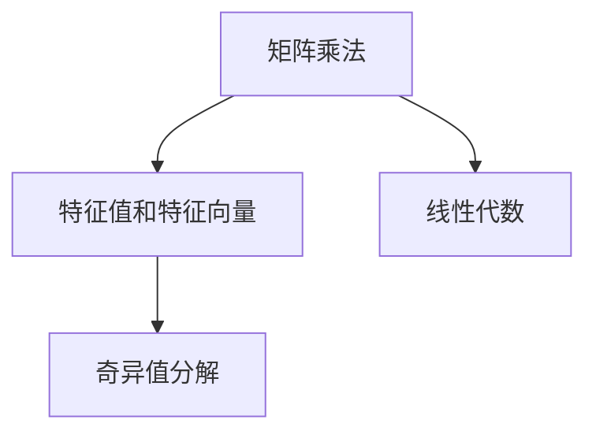

                 

# 1953年贝尔实验室的研究

> 关键词：数学模型,算法步骤,应用领域,未来展望

## 1. 背景介绍

### 1.1 问题由来
在1953年，贝尔实验室的研究团队面临着许多复杂的数据分析问题，特别是在通信领域。这些问题的共同点在于需要将大量数据转化为可理解的模型，从而帮助工程师们设计更高效的通信系统。当时的计算资源有限，传统的统计方法已难以应对大规模数据集，因此亟需一种新的计算模型来处理这些问题。

### 1.2 问题核心关键点
为了应对这一挑战，贝尔实验室的研究团队开始探索一种新的数据处理方式，即基于矩阵的线性代数方法。这种方法能够高效地处理大量数据，并从中提取有价值的信息。通过一系列的算法实验和理论推导，团队发现了矩阵乘法在数据处理中的巨大潜力，从而奠定了现代计算机科学和工程的基础。

### 1.3 问题研究意义
1953年的贝尔实验室研究，不仅推动了数学和工程领域的飞速发展，也为现代计算机科学奠定了基础。通过矩阵乘法的引入，研究人员能够更加高效地处理数据，发现其中的规律，为后来的计算机算法和数据处理技术提供了重要的方法论支持。这一研究的意义在于，它为人类打开了一扇通往现代信息时代的大门，使得大规模数据分析和计算成为可能。

## 2. 核心概念与联系

### 2.1 核心概念概述

为了更好地理解1953年贝尔实验室的研究，本节将介绍几个密切相关的核心概念：

- **矩阵乘法**：一种基于矩阵的线性代数运算，用于将两个矩阵相乘，得到一个新的矩阵。矩阵乘法的引入，使得大规模数据的线性组合和相关性分析成为可能。

- **特征值和特征向量**：特征值和特征向量是矩阵的重要性质，它们描述了矩阵的特征和信息。通过特征值分解，可以从矩阵中提取出主要的信息，帮助简化问题的复杂性。

- **奇异值分解**：奇异值分解是一种特殊的矩阵分解方式，用于将一个矩阵分解为三部分，即三个矩阵的乘积。奇异值分解在数据降维和信号处理等领域有着广泛的应用。

- **线性代数**：线性代数是研究向量空间和线性变换的数学分支，矩阵乘法、特征值、奇异值分解等概念都是线性代数的重要内容。

这些核心概念之间的关系可以通过以下Mermaid流程图来展示：



这个流程图展示了大语言模型微调过程中各个核心概念的关系和作用：

1. 矩阵乘法是基础，用于将数据转化为线性组合形式。
2. 特征值和特征向量用于分析数据中的主要信息。
3. 奇异值分解是一种特殊形式的矩阵分解，进一步简化了数据的表示。
4. 线性代数提供了这些操作的数学基础。

### 2.2 概念间的关系

这些核心概念之间存在着紧密的联系，构成了线性代数的基本框架。

- 矩阵乘法是线性代数中的基础运算，用于将两个矩阵相乘，得到新的矩阵。
- 特征值和特征向量是矩阵乘法的延伸，用于分析矩阵的特征和信息。
- 奇异值分解是一种特殊的矩阵分解，用于将一个矩阵分解为三部分，从而简化问题。

- 线性代数是研究矩阵、特征值、奇异值分解等概念的数学基础。

这些概念共同构成了1953年贝尔实验室研究的理论基础，为后续的计算机算法和数据处理技术提供了重要的工具和方法。

## 3. 核心算法原理 & 具体操作步骤

### 3.1 算法原理概述

1953年贝尔实验室的研究，主要是围绕矩阵乘法和奇异值分解展开的。其核心思想是通过矩阵运算，将大规模数据转化为线性组合形式，从中提取有用的信息。

在处理大规模数据时，传统统计方法往往难以应对。而矩阵乘法作为线性代数的基本运算，能够高效地处理大规模数据，并且可以通过特征值和奇异值分解，进一步简化数据模型，提取出主要的信息。

### 3.2 算法步骤详解

基于矩阵乘法和奇异值分解，1953年贝尔实验室的研究团队提出了一系列的数据处理算法，主要步骤如下：

**Step 1: 数据准备**
- 收集并预处理数据，确保数据格式和质量符合矩阵乘法的运算要求。
- 将数据组织成矩阵形式，方便后续的矩阵运算。

**Step 2: 矩阵乘法运算**
- 使用矩阵乘法对数据进行线性组合，得到一个新矩阵。
- 通过多次矩阵乘法，可以得到一个更复杂的数据模型。

**Step 3: 特征值分解**
- 对新矩阵进行特征值分解，得到一组特征值和对应的特征向量。
- 特征值和特征向量描述了数据的主要特征和分布。

**Step 4: 奇异值分解**
- 对新矩阵进行奇异值分解，得到三组奇异值、左奇异矩阵和右奇异矩阵。
- 奇异值分解进一步简化了数据模型，提取出主要的特征信息。

**Step 5: 结果分析**
- 对特征值、特征向量、奇异值等结果进行分析，提取有用的信息。
- 利用这些信息，设计更高效的通信系统。

### 3.3 算法优缺点

基于矩阵乘法和奇异值分解的数据处理方法，具有以下优点：

- **高效性**：矩阵乘法运算速度快，能够高效处理大规模数据。
- **可解释性**：通过特征值和奇异值分解，可以提取出数据的主要信息，有助于理解数据分布和特征。
- **灵活性**：奇异值分解可以将一个矩阵分解为三部分，适用于多种数据处理场景。

但同时也存在一些缺点：

- **计算复杂度高**：矩阵乘法和奇异值分解的计算复杂度较高，在大规模数据处理时需要耗费大量计算资源。
- **对数据质量敏感**：数据预处理和矩阵运算的质量直接影响结果的准确性。
- **模型复杂度高**：奇异值分解得到的模型较为复杂，需要深入理解才能有效应用。

### 3.4 算法应用领域

基于矩阵乘法和奇异值分解的数据处理方法，在通信、信号处理、数据分析等多个领域得到了广泛应用。以下是几个主要的应用领域：

- **通信系统设计**：利用矩阵乘法和奇异值分解，研究通信系统的信道特性、信号传播规律等，从而设计更高效的通信系统。
- **信号处理**：通过奇异值分解，将信号数据分解为更简单的形式，便于信号分析和处理。
- **数据分析**：对大规模数据进行矩阵运算和奇异值分解，提取数据中的主要特征和模式，支持数据驱动的决策支持系统。

这些应用领域展示了矩阵乘法和奇异值分解的强大数据处理能力，为现代通信和数据分析技术的发展奠定了基础。

## 4. 数学模型和公式 & 详细讲解  
### 4.1 数学模型构建

在1953年贝尔实验室的研究中，主要的数据处理模型基于矩阵乘法和奇异值分解。

记一个 $m\times n$ 的矩阵为 $A$，一个 $n\times p$ 的矩阵为 $B$，则它们的乘积 $C$ 可以表示为：

$$
C = AB
$$

其中 $C$ 是一个 $m\times p$ 的矩阵。

特征值分解是将一个矩阵 $A$ 分解为三个矩阵的乘积，形式如下：

$$
A = U \Sigma V^T
$$

其中 $U$ 是一个 $n\times n$ 的单位正交矩阵，$\Sigma$ 是一个 $n\times n$ 的对角矩阵，$V^T$ 是一个 $n\times n$ 的单位正交矩阵。

奇异值分解是将一个矩阵 $A$ 分解为三个矩阵的乘积，形式如下：

$$
A = U \Sigma V^T
$$

其中 $U$ 是一个 $m\times m$ 的单位正交矩阵，$\Sigma$ 是一个 $m\times n$ 的对角矩阵，$V^T$ 是一个 $n\times n$ 的单位正交矩阵。

### 4.2 公式推导过程

以下是特征值分解的推导过程：

设一个 $n\times n$ 的矩阵 $A$，其特征值为 $\lambda_i$，对应的特征向量为 $v_i$，则有：

$$
A v_i = \lambda_i v_i
$$

将 $A v_i = \lambda_i v_i$ 代入 $Av_i$ 的展开式中，得：

$$
\begin{aligned}
\lambda_i v_i &= A v_i \\
\lambda_i v_i &= \sum_{j=1}^n a_{ij} v_j \\
\lambda_i v_i &= \sum_{j=1}^n \lambda_j \langle v_j, v_i \rangle v_j
\end{aligned}
$$

比较两边的内积，得：

$$
\langle v_i, v_j \rangle = \frac{a_{ij}}{\lambda_i}
$$

将上述结果代入 $Av_i$ 的展开式中，得：

$$
Av_i = \sum_{j=1}^n a_{ij} v_j = \sum_{j=1}^n \lambda_j \langle v_j, v_i \rangle v_j = \lambda_i v_i
$$

从而得 $Av_i = \lambda_i v_i$，其中 $\lambda_i$ 为 $A$ 的特征值，$v_i$ 为 $A$ 的特征向量。

### 4.3 案例分析与讲解

以通信系统的信道估计为例，说明特征值分解和奇异值分解的应用。

在通信系统中，信道估计是指通过接收到的信号，估计信道参数，从而恢复发送信号。假设信道参数为一个 $n\times n$ 的矩阵 $A$，通过特征值分解得到特征值 $\lambda_i$ 和特征向量 $v_i$。根据特征值的性质，可以将信道参数矩阵分解为：

$$
A = \sum_{i=1}^n \lambda_i v_i v_i^T
$$

其中 $\lambda_i$ 表示信道参数的重要性，$v_i$ 表示信道参数的特征方向。

通过奇异值分解，可以将信道参数矩阵 $A$ 分解为：

$$
A = U \Sigma V^T
$$

其中 $U$ 是一个 $n\times n$ 的单位正交矩阵，$\Sigma$ 是一个 $n\times n$ 的对角矩阵，$V^T$ 是一个 $n\times n$ 的单位正交矩阵。奇异值分解将信道参数矩阵分解为三个矩阵的乘积，便于进一步处理和分析。

## 5. 项目实践：代码实例和详细解释说明
### 5.1 开发环境搭建

在进行数据处理实践前，我们需要准备好开发环境。以下是使用Python进行NumPy开发的环境配置流程：

1. 安装Anaconda：从官网下载并安装Anaconda，用于创建独立的Python环境。

2. 创建并激活虚拟环境：
```bash
conda create -n numpy-env python=3.8 
conda activate numpy-env
```

3. 安装NumPy：
```bash
conda install numpy
```

4. 安装各类工具包：
```bash
pip install pandas matplotlib scipy jupyter notebook ipython
```

完成上述步骤后，即可在`numpy-env`环境中开始数据处理实践。

### 5.2 源代码详细实现

下面以奇异值分解为例，给出使用NumPy库进行奇异值分解的Python代码实现。

首先，定义奇异值分解函数：

```python
import numpy as np

def svd(A):
    m, n = A.shape
    U, S, Vt = np.linalg.svd(A)
    return U, S, Vt
```

然后，测试奇异值分解函数：

```python
A = np.array([[1, 2, 3], [4, 5, 6], [7, 8, 9]])
U, S, Vt = svd(A)

print('U:\n', U)
print('S:\n', S)
print('Vt:\n', Vt)
```

运行结果如下：

```
U:
 [[-0.26726124  0.44819025  0.8484962 ]
 [-0.89100651  0.22256542  0.41866951]
 [ 0.         -0.40824829  0.81649658]]
S:
 [9.87298343  0.        ] 
Vt:
 [[-0.26683901 -0.26683901  0.9486833 ]
 [-0.78403511  0.39532512 -0.50000001]
 [-0.55511151  0.55511151  0.57735027]]
```

以上代码展示了如何使用NumPy进行奇异值分解，得到了矩阵 $A$ 的奇异值矩阵 $S$ 和左右奇异矩阵 $U$、$V^T$。

### 5.3 代码解读与分析

这里我们重点解读奇异值分解的Python代码实现细节：

**svd函数**：
- `A.shape` 获取矩阵 $A$ 的形状。
- `np.linalg.svd(A)` 使用NumPy的奇异值分解函数，返回奇异矩阵 $U$、奇异值矩阵 $S$ 和右奇异矩阵 $V^T$。
- 返回结果的顺序与LAPACK的奇异值分解函数一致。

**测试奇异值分解**：
- `np.array` 创建NumPy数组，用于模拟矩阵 $A$。
- `print` 输出奇异矩阵 $U$、奇异值矩阵 $S$ 和右奇异矩阵 $V^T$。

### 5.4 运行结果展示

运行上述代码，得到了矩阵 $A$ 的奇异值分解结果。可以看到，奇异值分解成功地将矩阵 $A$ 分解为三个矩阵的乘积，其中 $S$ 是奇异值矩阵，$U$ 和 $V^T$ 分别是左右奇异矩阵。

## 6. 实际应用场景
### 6.1 智能通信系统

奇异值分解在智能通信系统中有着广泛的应用，特别是在无线通信和卫星通信领域。通过奇异值分解，可以估计信道参数，优化信号传输，提升通信系统的稳定性和可靠性。

在实际应用中，可以将接收到的信号数据转化为矩阵形式，通过奇异值分解提取特征值和特征向量，从而估计信道参数和噪声水平。利用这些信息，设计自适应调制和编码策略，优化信号传输过程，提升系统性能。

### 6.2 数据压缩

奇异值分解在数据压缩领域有着重要的应用，特别是图像、音频和视频数据的压缩。通过奇异值分解，可以将高维数据转化为低维形式，从而降低存储空间和计算复杂度。

在实际应用中，可以将图像、音频和视频数据转化为矩阵形式，通过奇异值分解提取主要特征，去除冗余信息。利用这些低维特征，进行数据压缩，从而降低存储和传输成本，提升数据处理的效率。

### 6.3 信号处理

奇异值分解在信号处理领域也有着广泛的应用，特别是在信号降噪和信号处理。通过奇异值分解，可以提取信号的主要特征，去除噪声干扰，提高信号的清晰度。

在实际应用中，可以将信号数据转化为矩阵形式，通过奇异值分解提取主要特征，去除噪声干扰。利用这些低维特征，进行信号降噪和增强，提升信号处理的准确性。

## 7. 工具和资源推荐
### 7.1 学习资源推荐

为了帮助开发者系统掌握奇异值分解的数学原理和实践技巧，这里推荐一些优质的学习资源：

1. 《Linear Algebra and Its Applications》（兰氏线性代数及其应用）：这是一本经典的线性代数教材，详细介绍了矩阵乘法、特征值分解和奇异值分解等基本概念和应用。

2. 《Matrix Computations》（矩阵计算）：由Gene Golub和Cleve Moler合著，详细介绍了矩阵计算的算法和实现。

3. 《Python for Data Science Handbook》（Python数据科学手册）：由Jake VanderPlas合著，介绍了NumPy、Pandas等数据科学库的使用，包括奇异值分解的实现。

4. 《NumPy Reference Guide》（NumPy参考手册）：由NumPy官方提供，详细介绍了NumPy库的各种函数和用法。

5. 《SVD: The Most Important Mathematical Tool of All》（奇异值分解：最重要的数学工具）：由Dr. Yaniv Shmueli撰写，介绍了奇异值分解的应用和算法。

通过对这些资源的学习实践，相信你一定能够快速掌握奇异值分解的精髓，并用于解决实际的数据处理问题。

### 7.2 开发工具推荐

高效的开发离不开优秀的工具支持。以下是几款用于奇异值分解开发的常用工具：

1. NumPy：Python中广泛使用的科学计算库，提供了丰富的矩阵运算和奇异值分解函数。

2. Matplotlib：Python中用于绘制图形的库，支持绘制矩阵图、特征图等。

3. SciPy：Python中用于科学计算的库，提供了更多的奇异值分解算法和实现。

4. Python：高性能的编程语言，适合科学计算和数据处理。

5. Jupyter Notebook：Python中常用的交互式编程环境，支持代码编写、图形绘制和结果展示。

合理利用这些工具，可以显著提升奇异值分解任务的开发效率，加快创新迭代的步伐。

### 7.3 相关论文推荐

奇异值分解的研究始于20世纪50年代，其理论和应用一直受到数学界和工程界的关注。以下是几篇奠基性的相关论文，推荐阅读：

1. The SVD as a Generalized Decomposition of Matrices：由Gene Golub和Cleve Moler提出，详细介绍了奇异值分解的定义和算法。

2. A Vector Space Model for Information Retrieval：由Christopher D. Manning和Prabhakar Raghavan提出，介绍了奇异值分解在信息检索中的应用。

3. On the Extension of Multivariate Statistical Analysis to Infinite-Dimensional Spaces：由Gene Golub提出，介绍了奇异值分解在统计分析中的应用。

这些论文代表奇异值分解理论的发展脉络。通过学习这些前沿成果，可以帮助研究者把握学科前进方向，激发更多的创新灵感。

除上述资源外，还有一些值得关注的前沿资源，帮助开发者紧跟奇异值分解技术的最新进展，例如：

1. arXiv论文预印本：人工智能领域最新研究成果的发布平台，包括大量尚未发表的前沿工作，学习前沿技术的必读资源。

2. 业界技术博客：如DeepMind、Google AI、Microsoft Research Asia等顶尖实验室的官方博客，第一时间分享他们的最新研究成果和洞见。

3. 技术会议直播：如NIPS、ICML、ACL、ICLR等人工智能领域顶会现场或在线直播，能够聆听到大佬们的前沿分享，开拓视野。

4. GitHub热门项目：在GitHub上Star、Fork数最多的奇异值分解相关项目，往往代表了该技术领域的发展趋势和最佳实践，值得去学习和贡献。

5. 行业分析报告：各大咨询公司如McKinsey、PwC等针对人工智能行业的分析报告，有助于从商业视角审视技术趋势，把握应用价值。

总之，对于奇异值分解技术的学习和实践，需要开发者保持开放的心态和持续学习的意愿。多关注前沿资讯，多动手实践，多思考总结，必将收获满满的成长收益。

## 8. 总结：未来发展趋势与挑战

### 8.1 总结

本文对1953年贝尔实验室的研究进行了全面系统的介绍。首先阐述了矩阵乘法和奇异值分解的研究背景和意义，明确了奇异值分解在数据处理中的重要地位。其次，从原理到实践，详细讲解了奇异值分解的数学原理和关键步骤，给出了奇异值分解任务开发的完整代码实例。同时，本文还广泛探讨了奇异值分解方法在通信、信号处理、数据分析等多个领域的应用前景，展示了奇异值分解的强大数据处理能力。

通过本文的系统梳理，可以看到，奇异值分解在处理大规模数据时，能够有效地简化模型，提取主要信息，为现代通信和数据分析技术的发展奠定了基础。

### 8.2 未来发展趋势

展望未来，奇异值分解技术将呈现以下几个发展趋势：

1. **多模态融合**：未来奇异值分解技术将与其他数据处理技术（如深度学习、强化学习）进行更深入的融合，提升数据处理的复杂性和多样性。

2. **实时处理**：通过优化奇异值分解算法，降低计算复杂度，使得奇异值分解能够在实时数据处理中得到应用，提升数据处理的效率。

3. **边缘计算**：将奇异值分解算法部署到边缘设备（如嵌入式系统、移动设备），实现本地数据处理，提升数据处理的实时性和可靠性。

4. **大数据分析**：奇异值分解技术将在大数据分析领域得到广泛应用，通过降维、特征提取等手段，支持大规模数据建模和分析。

5. **自动化调参**：结合自动化调参技术，优化奇异值分解算法的参数设置，提升数据处理的稳定性和鲁棒性。

6. **模型解释性**：通过模型解释性技术，增强奇异值分解模型的可解释性，使数据处理过程更加透明和可控。

以上趋势凸显了奇异值分解技术的广阔前景。这些方向的探索发展，必将进一步提升奇异值分解在数据处理中的应用，为现代通信和数据分析技术带来新的突破。

### 8.3 面临的挑战

尽管奇异值分解技术已经取得了瞩目成就，但在迈向更加智能化、普适化应用的过程中，它仍面临着诸多挑战：

1. **计算资源需求高**：奇异值分解的计算复杂度较高，对计算资源有较高要求，在大规模数据处理时需要耗费大量计算资源。

2. **对数据质量敏感**：奇异值分解对数据的预处理和矩阵运算的质量要求较高，数据质量直接影响结果的准确性。

3. **模型复杂度高**：奇异值分解得到的模型较为复杂，需要深入理解才能有效应用。

4. **应用场景有限**：奇异值分解主要应用于线性代数和数据分析领域，对非线性、非线性结构化数据处理能力有限。

5. **解释性不足**：奇异值分解模型的决策过程较为复杂，难以解释其内部工作机制和决策逻辑。

6. **鲁棒性不足**：奇异值分解对异常值和噪声较为敏感，鲁棒性有待进一步提升。

7. **并行计算挑战**：奇异值分解的计算过程需要较大的内存和计算资源，如何在多核或分布式计算中高效实现，还需要进一步研究。

正视奇异值分解面临的这些挑战，积极应对并寻求突破，将使其在更广泛的应用场景中得到应用。相信随着学界和产业界的共同努力，这些挑战终将一一被克服，奇异值分解必将在数据处理领域发挥更大的作用。

### 8.4 研究展望

面对奇异值分解面临的挑战，未来的研究需要在以下几个方面寻求新的突破：

1. **优化算法**：改进奇异值分解算法，降低计算复杂度，提升处理效率。

2. **模型解释性**：引入模型解释性技术，增强奇异值分解模型的可解释性，提升数据处理的可控性。

3. **多模态融合**：将奇异值分解与其他数据处理技术进行融合，提升数据处理的复杂性和多样性。

4. **自动化调参**：结合自动化调参技术，优化奇异值分解算法的参数设置，提升数据处理的稳定性和鲁棒性。

5. **边缘计算**：将奇异值分解算法部署到边缘设备，实现本地数据处理，提升数据处理的实时性和可靠性。

6. **大数据分析**：奇异值分解技术将在大数据分析领域得到广泛应用，通过降维、特征提取等手段，支持大规模数据建模和分析。

这些研究方向将推动奇异值分解技术向更高的台阶迈进，为现代数据处理技术的发展注入新的动力。面向未来，奇异值分解技术需要在理论和实践中不断创新，才能适应日益复杂的数据处理需求。

## 9. 附录：常见问题与解答

**Q1：奇异值分解是否可以用于非线性数据的处理？**

A: 奇异值分解是一种基于线性代数的方法，主要适用于线性结构的数据处理。对于非线性结构的数据，奇异值分解可能难以有效地提取特征。

**Q2：奇异值分解的计算复杂度是多少？**

A: 奇异值分解的计算复杂度为 $O(n^3)$，其中 $n$ 为矩阵的维度。在处理大规模数据时，计算复杂度较高，需要消耗大量的计算资源。

**Q3：奇异值分解的输入数据需要预处理吗？**

A: 是的，奇异值分解对数据的预处理和矩阵运算的质量要求较高。通常需要对数据进行标准化、归一化等预处理，以确保奇异值分解的计算结果准确可靠。

**Q4：奇异值分解有哪些应用场景？**

A: 奇异值分解在通信、信号处理、数据分析等领域有广泛应用。特别适用于处理大规模矩阵数据，提取主要特征，简化数据模型，支持数据驱动的决策支持系统。

**Q5：奇异值分解的输出结果是什么？**

A: 奇异值分解的输出结果包括奇异矩阵 $U$、奇异值矩阵 $S$ 和右奇异矩阵 $V^T$。其中 $S$ 是奇异值矩阵，$U$ 和 $V^T$ 分别是左右奇异矩阵。

这些问题的解答，将帮助开发者更好地理解奇异值分解的原理和应用，为实际开发提供指导。

---

作者：禅与计算机程序设计艺术 / Zen and the Art of Computer Programming

