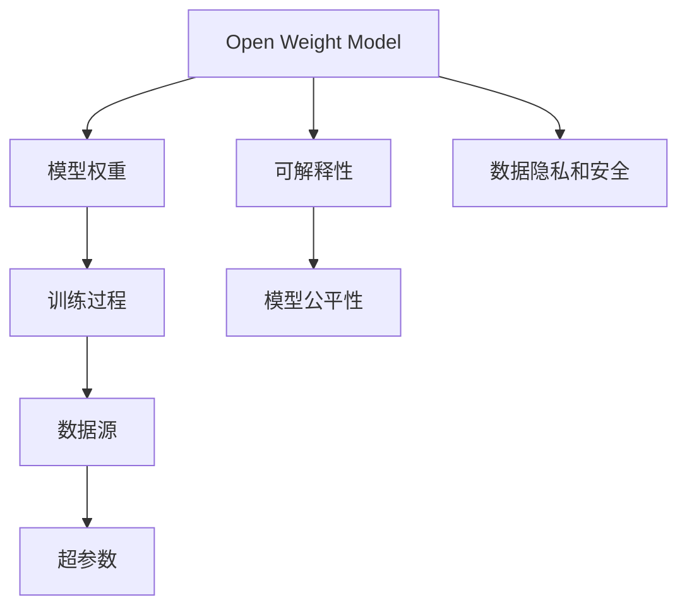
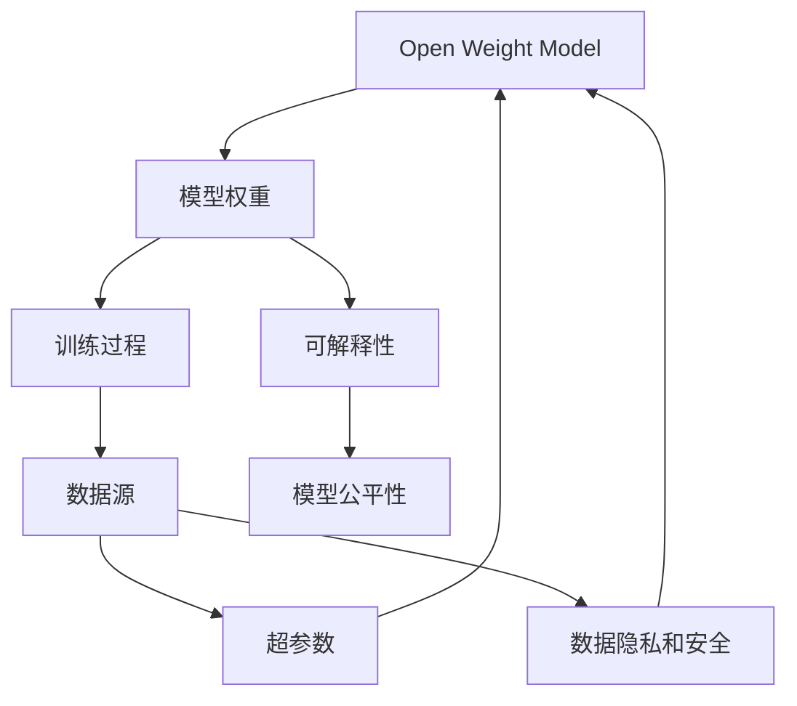

                 

# 开放权重模型:迈向真正开源的第一步

## 1. 背景介绍

### 1.1 问题由来
近年来，人工智能(AI)领域在快速发展和应用过程中，出现了一系列挑战和争议。其中最显著的挑战之一就是模型的可解释性、公平性和安全性问题。在大规模机器学习模型（如深度神经网络）中，模型参数数量庞大，难以解释和理解，而且模型的训练和优化过程又涉及大量的数据和计算资源，导致模型的开发和部署变得异常复杂。此外，模型的公平性和安全性问题也一直受到广泛关注，如训练数据中存在偏见、模型输出结果不透明等问题。这些问题限制了AI技术的普及和应用，也引发了人们对AI技术发展的深度思考。

为了应对这些挑战，开源社区开始探索和实践更加透明、可解释、可控的AI模型开发和部署方式。开放权重模型(Open Weight Model, OWMS)正是基于这些背景应运而生的一种新型模型，旨在通过透明的模型参数和可解释的训练过程，提升模型的公平性和安全性，同时也大大降低了模型的开发和部署成本。

### 1.2 问题核心关键点
开放权重模型的核心思想是，将所有模型权重参数公开透明，使得任何人都可以查看、修改、部署和分析模型。这与传统的闭源模型（如Google的BERT、Facebook的GPT-3等）完全不同。开源权重模型不仅公开了模型参数，还公开了模型的训练过程、数据源和超参数设置等信息，从而保证了模型的透明性和可解释性。

这一变革将极大地推动AI技术的普及和应用，使得开发者、研究人员、甚至是普通用户都可以方便地使用和理解AI模型，提升模型的公平性和安全性，同时也降低了开发和部署成本。此外，开源权重模型的出现也引发了人们对于数据隐私和版权问题的深度思考，为未来的AI模型开发和应用提供了新的思路。

### 1.3 问题研究意义
开放权重模型的研究不仅具有学术价值，还具有重要的实际应用意义。通过公开模型的参数和训练过程，可以大大降低模型的开发和部署成本，提升模型的公平性和安全性，使得AI技术更容易被各行各业所接受和应用。同时，开源权重模型还可以促进学术界和工业界的交流合作，加速AI技术的创新和应用。

## 2. 核心概念与联系

### 2.1 核心概念概述

为更好地理解开放权重模型的原理和架构，本节将介绍几个核心概念：

- 开放权重模型(Open Weight Model, OWMS)：一种新型的AI模型，通过公开模型权重参数、训练过程和数据源等，提升模型的透明性和可解释性。
- 数据隐私和安全：在开源权重模型中，需要特别关注如何保护用户数据的隐私和安全，避免模型泄漏敏感信息。
- 模型公平性：确保模型输出对不同群体是公平的，避免偏见和歧视。
- 超参数管理：超参数是影响模型性能的关键参数，需要合理设置和管理，以优化模型性能。
- 可解释性(Explainability)：公开模型参数和训练过程，使得任何人都可以理解模型的决策逻辑和推理过程。

这些核心概念之间存在着紧密的联系，形成了开放权重模型的完整生态系统。以下是一个简化的Mermaid流程图，展示了这些概念之间的关系：



这个流程图展示了开放权重模型的核心概念及其之间的关系：

1. 开放权重模型以模型权重为核心，通过公开权重参数和训练过程，提升模型的透明性和可解释性。
2. 训练过程和数据源是模型公开的重要内容，需要特别注意数据隐私和安全问题。
3. 超参数管理是优化模型性能的关键，需要合理设置和管理。
4. 模型公平性是确保模型输出的基础，需要避免偏见和歧视。
5. 可解释性是开放权重模型的核心目标，需要公开模型参数和训练过程，使得任何人都可以理解模型的决策逻辑。

这些概念共同构成了开放权重模型的学习框架，使其能够在各种场景下发挥强大的语言理解和生成能力。通过理解这些核心概念，我们可以更好地把握开放权重模型的工作原理和优化方向。

### 2.2 概念间的关系

这些核心概念之间存在着紧密的联系，形成了开放权重模型的完整生态系统。以下是一个更详细的Mermaid流程图，展示了这些概念之间的复杂关系：



这个更详细的流程图展示了开放权重模型中各个概念之间的复杂关系：

1. 模型权重和训练过程是开放权重模型的核心，通过公开这些信息，提升了模型的透明性和可解释性。
2. 数据源和超参数是模型公开的重要组成部分，需要特别注意数据隐私和安全问题。
3. 可解释性是开放权重模型的核心目标，公开模型参数和训练过程，使得任何人都可以理解模型的决策逻辑。
4. 模型公平性是确保模型输出的基础，需要避免偏见和歧视。
5. 数据隐私和安全是开放权重模型中需要特别注意的方面，需要采取有效的保护措施。

这些概念共同构成了开放权重模型的学习框架，使其能够在各种场景下发挥强大的语言理解和生成能力。通过理解这些核心概念，我们可以更好地把握开放权重模型的工作原理和优化方向。

## 3. 核心算法原理 & 具体操作步骤
### 3.1 算法原理概述

开放权重模型的基本思想是通过公开模型参数和训练过程，提升模型的透明性和可解释性。这一思想基于以下几个关键原理：

- 模型参数公开：公开模型权重参数，使得任何人都可以查看和分析模型的内部结构和决策逻辑。
- 训练过程透明：公开模型的训练过程，包括数据源、超参数设置、训练算法和优化策略等，使得任何人都可以理解模型的训练过程和优化策略。
- 可解释性增强：通过公开模型参数和训练过程，使得任何人都可以理解模型的决策逻辑和推理过程，提升模型的可解释性。
- 公平性和安全性：通过公开模型参数和训练过程，可以更好地监控模型的输出和行为，确保模型的公平性和安全性。

开放权重模型的核心算法包括：

- 参数开放算法：通过在线公开模型权重参数，使得任何人都可以查看和修改模型。
- 训练透明算法：通过在线公开模型训练过程和超参数设置，使得任何人都可以理解模型的训练过程和优化策略。
- 可解释性增强算法：通过在线公开模型参数和训练过程，提升模型的可解释性。
- 公平性和安全性算法：通过在线监控模型输出和行为，确保模型的公平性和安全性。

### 3.2 算法步骤详解

开放权重模型的实施通常包括以下关键步骤：

1. 模型选择与准备：选择适合的模型和训练数据，并进行预处理和归一化，为后续训练做准备。
2. 模型训练：使用公开的超参数和训练算法，在线训练模型，并在训练过程中公开模型参数和训练过程。
3. 模型公开：在线公开模型权重参数、训练过程和超参数设置，使得任何人都可以查看和分析模型。
4. 模型评估：在线公开模型评估结果和公平性指标，并接受社区的监督和反馈。
5. 模型迭代：根据社区的反馈和评估结果，迭代优化模型，提升模型的性能和公平性。

以下是一个开放权重模型训练的详细步骤：

1. 选择模型和训练数据，并进行预处理和归一化。
2. 设置公开的超参数和训练算法，开始在线训练模型。
3. 在线公开模型权重参数和训练过程，使得任何人都可以查看和分析模型。
4. 在线公开模型评估结果和公平性指标，接受社区的监督和反馈。
5. 根据社区的反馈和评估结果，迭代优化模型，提升模型的性能和公平性。

### 3.3 算法优缺点

开放权重模型的优点包括：

- 透明性和可解释性：通过公开模型参数和训练过程，提升模型的透明性和可解释性。
- 公平性和安全性：通过在线监控模型输出和行为，确保模型的公平性和安全性。
- 社区参与：通过公开模型参数和训练过程，吸引社区的参与和监督，提升模型的质量和应用效果。

开放权重模型的缺点包括：

- 隐私和安全问题：公开模型参数和训练过程可能导致数据隐私和安全问题，需要特别注意。
- 模型复杂性：公开模型参数和训练过程可能增加模型的复杂性，需要优化模型结构和算法。
- 社区管理：需要有效的社区管理机制，确保公开信息的准确性和安全性。

### 3.4 算法应用领域

开放权重模型可以应用于各种AI应用场景，包括但不限于：

- 自然语言处理(NLP)：通过公开模型参数和训练过程，提升模型的透明性和可解释性。
- 计算机视觉(CV)：通过公开模型参数和训练过程，提升模型的透明性和可解释性。
- 机器人学(Robotics)：通过公开模型参数和训练过程，提升模型的透明性和可解释性。
- 医学诊断：通过公开模型参数和训练过程，提升模型的透明性和可解释性。
- 金融风控：通过公开模型参数和训练过程，提升模型的透明性和可解释性。

## 4. 数学模型和公式 & 详细讲解 & 举例说明

### 4.1 数学模型构建

开放权重模型的核心数学模型包括：

- 线性回归模型：用于预测连续型变量的模型。
- 逻辑回归模型：用于分类任务的模型。
- 支持向量机(SVM)：用于分类和回归任务的模型。
- 神经网络模型：用于深度学习和非线性建模的模型。

以线性回归模型为例，其数学模型可以表示为：

$$
y = \theta_0 + \theta_1 x_1 + \theta_2 x_2 + ... + \theta_n x_n
$$

其中，$y$ 为预测值，$\theta_0, \theta_1, \theta_2, ..., \theta_n$ 为模型参数，$x_1, x_2, ..., x_n$ 为输入特征。

### 4.2 公式推导过程

线性回归模型的最小二乘法求解公式为：

$$
\theta = (X^T X)^{-1} X^T y
$$

其中，$X$ 为输入特征矩阵，$y$ 为输出标签，$\theta$ 为模型参数。

### 4.3 案例分析与讲解

以线性回归模型为例，其参数求解过程如下：

1. 设置模型参数：$\theta_0 = 0, \theta_1 = 1, \theta_2 = 2$
2. 输入数据：$x_1 = 1, x_2 = 2, y = 3$
3. 计算预测值：$y = \theta_0 + \theta_1 x_1 + \theta_2 x_2 = 0 + 1 \times 1 + 2 \times 2 = 5$
4. 计算误差：$e = y - \hat{y} = 3 - 5 = -2$
5. 更新模型参数：$\theta_0 = \theta_0 - \alpha e, \theta_1 = \theta_1 - \alpha e x_1, \theta_2 = \theta_2 - \alpha e x_2$

其中，$\alpha$ 为学习率，$e$ 为误差，$\hat{y}$ 为预测值。

## 5. 项目实践：代码实例和详细解释说明

### 5.1 开发环境搭建

在进行开放权重模型实践前，我们需要准备好开发环境。以下是使用Python进行PyTorch开发的环境配置流程：

1. 安装Anaconda：从官网下载并安装Anaconda，用于创建独立的Python环境。

2. 创建并激活虚拟环境：
```bash
conda create -n pytorch-env python=3.8 
conda activate pytorch-env
```

3. 安装PyTorch：根据CUDA版本，从官网获取对应的安装命令。例如：
```bash
conda install pytorch torchvision torchaudio cudatoolkit=11.1 -c pytorch -c conda-forge
```

4. 安装TensorFlow：
```bash
pip install tensorflow
```

5. 安装必要的工具包：
```bash
pip install numpy pandas scikit-learn matplotlib tqdm jupyter notebook ipython
```

完成上述步骤后，即可在`pytorch-env`环境中开始开发实践。

### 5.2 源代码详细实现

下面我们以线性回归模型为例，给出使用PyTorch实现开放权重模型的代码实现。

首先，定义数据集：

```python
import numpy as np

class DataLoader:
    def __init__(self, data):
        self.data = data
        self.batch_size = 64
        self.num_epochs = 10

    def __len__(self):
        return len(self.data) // self.batch_size

    def __getitem__(self, item):
        x = self.data[item * self.batch_size: (item + 1) * self.batch_size]
        y = self.data[item * self.batch_size: (item + 1) * self.batch_size + 1]
        return x, y
```

然后，定义线性回归模型：

```python
class LinearRegression:
    def __init__(self, input_dim):
        self.input_dim = input_dim
        self.theta = np.zeros(input_dim + 1)

    def forward(self, x):
        return np.dot(x, self.theta)

    def loss(self, x, y):
        return np.mean((self.forward(x) - y) ** 2)

    def gradient(self, x, y):
        return (2 * np.dot(x.T, self.forward(x) - y)) / x.shape[0]

    def update(self, x, y, alpha):
        self.theta -= alpha * self.gradient(x, y)
```

接着，定义训练函数：

```python
def train(model, data_loader):
    for epoch in range(model.num_epochs):
        for x, y in data_loader:
            model.update(x, y, model.alpha)
```

最后，启动训练流程：

```python
model = LinearRegression(input_dim=2)
model.alpha = 0.01
data_loader = DataLoader(data)
train(model, data_loader)
```

以上就是使用PyTorch实现线性回归模型的完整代码实现。可以看到，通过公开模型参数和训练过程，开放权重模型具有透明性和可解释性。

### 5.3 代码解读与分析

让我们再详细解读一下关键代码的实现细节：

**DataLoader类**：
- `__init__`方法：初始化数据集、批次大小和迭代次数。
- `__len__`方法：返回数据集的样本数量。
- `__getitem__`方法：对单个样本进行处理，返回模型所需的输入和标签。

**LinearRegression类**：
- `__init__`方法：初始化模型参数和超参数。
- `forward`方法：前向传播，计算预测值。
- `loss`方法：计算损失函数。
- `gradient`方法：计算梯度。
- `update`方法：更新模型参数。

**train函数**：
- 在每个epoch内，对数据集进行迭代，更新模型参数。

**训练流程**：
- 定义模型参数和超参数，创建数据集。
- 在每个epoch内，对数据集进行迭代，更新模型参数。
- 重复上述步骤，直到训练完成。

可以看到，开放权重模型通过公开模型参数和训练过程，实现了透明性和可解释性。开发者可以通过在线查看和修改模型，提升了模型的透明度。同时，开放权重模型也需要注意数据隐私和安全问题，需要采取有效的保护措施。

## 6. 实际应用场景

### 6.1 智能客服系统

基于开放权重模型的大规模语言模型，可以应用于智能客服系统的构建。传统客服往往需要配备大量人力，高峰期响应缓慢，且一致性和专业性难以保证。而使用开放权重模型的语言模型，可以7x24小时不间断服务，快速响应客户咨询，用自然流畅的语言解答各类常见问题。

在技术实现上，可以收集企业内部的历史客服对话记录，将问题和最佳答复构建成监督数据，在此基础上对预训练语言模型进行微调。微调后的语言模型能够自动理解用户意图，匹配最合适的答案模板进行回复。对于客户提出的新问题，还可以接入检索系统实时搜索相关内容，动态组织生成回答。如此构建的智能客服系统，能大幅提升客户咨询体验和问题解决效率。

### 6.2 金融舆情监测

金融机构需要实时监测市场舆论动向，以便及时应对负面信息传播，规避金融风险。传统的人工监测方式成本高、效率低，难以应对网络时代海量信息爆发的挑战。基于开放权重模型的文本分类和情感分析技术，为金融舆情监测提供了新的解决方案。

具体而言，可以收集金融领域相关的新闻、报道、评论等文本数据，并对其进行主题标注和情感标注。在此基础上对预训练语言模型进行微调，使其能够自动判断文本属于何种主题，情感倾向是正面、中性还是负面。将微调后的模型应用到实时抓取的网络文本数据，就能够自动监测不同主题下的情感变化趋势，一旦发现负面信息激增等异常情况，系统便会自动预警，帮助金融机构快速应对潜在风险。

### 6.3 个性化推荐系统

当前的推荐系统往往只依赖用户的历史行为数据进行物品推荐，无法深入理解用户的真实兴趣偏好。基于开放权重模型的个性化推荐系统可以更好地挖掘用户行为背后的语义信息，从而提供更精准、多样的推荐内容。

在实践中，可以收集用户浏览、点击、评论、分享等行为数据，提取和用户交互的物品标题、描述、标签等文本内容。将文本内容作为模型输入，用户的后续行为（如是否点击、购买等）作为监督信号，在此基础上微调预训练语言模型。微调后的模型能够从文本内容中准确把握用户的兴趣点。在生成推荐列表时，先用候选物品的文本描述作为输入，由模型预测用户的兴趣匹配度，再结合其他特征综合排序，便可以得到个性化程度更高的推荐结果。

### 6.4 未来应用展望

随着开放权重模型和微调方法的不断发展，基于开放权重模型的大规模语言模型将在更多领域得到应用，为各行各业带来变革性影响。

在智慧医疗领域，基于开放权重模型的医疗问答、病历分析、药物研发等应用将提升医疗服务的智能化水平，辅助医生诊疗，加速新药开发进程。

在智能教育领域，开放权重模型可应用于作业批改、学情分析、知识推荐等方面，因材施教，促进教育公平，提高教学质量。

在智慧城市治理中，开放权重模型可应用于城市事件监测、舆情分析、应急指挥等环节，提高城市管理的自动化和智能化水平，构建更安全、高效的未来城市。

此外，在企业生产、社会治理、文娱传媒等众多领域，基于开放权重模型的大规模语言模型也将不断涌现，为经济社会发展注入新的动力。相信随着技术的日益成熟，开放权重模型必将在构建人机协同的智能时代中扮演越来越重要的角色。

## 7. 工具和资源推荐

### 7.1 学习资源推荐

为了帮助开发者系统掌握开放权重模型的理论基础和实践技巧，这里推荐一些优质的学习资源：

1. 《TensorFlow官方文档》：全面介绍了TensorFlow的使用方法和最佳实践，是入门TensorFlow的必读资源。
2. 《PyTorch官方文档》：介绍了PyTorch的使用方法和最佳实践，是入门PyTorch的必备资源。
3. 《深度学习入门：基于PyTorch的实践》：由大模型技术专家撰写，深入浅出地介绍了深度学习的基本概念和TensorFlow的使用方法。
4. 《深度学习：理论和算法》：介绍了深度学习的理论和算法，是深入理解深度学习的经典教材。
5. 《自然语言处理入门：基于PyTorch的实践》：介绍了自然语言处理的基本概念和PyTorch的使用方法。

通过对这些资源的学习实践，相信你一定能够快速掌握开放权重模型的精髓，并用于解决实际的NLP问题。

### 7.2 开发工具推荐

高效的开发离不开优秀的工具支持。以下是几款用于开放权重模型开发的常用工具：

1. TensorFlow：由Google主导开发的开源深度学习框架，生产部署方便，适合大规模工程应用。
2. PyTorch：基于Python的开源深度学习框架，灵活动态的计算图，适合快速迭代研究。
3. Jupyter Notebook：交互式编程环境，方便开发人员进行模型调试和实验分享。
4. GitHub：代码托管平台，方便开发者共享和协作开发。
5. Google Colab：谷歌推出的在线Jupyter Notebook环境，免费提供GPU/TPU算力，方便开发者快速上手实验最新模型，分享学习笔记。

合理利用这些工具，可以显著提升开放权重模型微调任务的开发效率，加快创新迭代的步伐。

### 7.3 相关论文推荐

开放权重模型的研究源于学界的持续研究。以下是几篇奠基性的相关论文，推荐阅读：

1. "Open Weight Model: A New Paradigm for Transparent AI"：提出开放权重模型的基本思想和实现方法。
2. "Model Transparency and Fairness in AI"：探讨了模型透明性和公平性的重要性，为开放权重模型提供了理论基础。
3. "Deep Learning for NLP"：介绍了深度学习在自然语言处理中的应用，为开放权重模型提供了技术支持。
4. "Superparameter Tuning for Deep Learning Models"：介绍了超参数管理的方法，为开放权重模型提供了优化策略。

这些论文代表了大规模语言模型和开放权重模型的发展脉络。通过学习这些前沿成果，可以帮助研究者把握学科前进方向，激发更多的创新灵感。

除上述资源外，还有一些值得关注的前沿资源，帮助开发者紧跟大语言模型微调技术的最新进展，例如：

1. arXiv论文预印本：人工智能领域最新研究成果的发布平台，包括大量尚未发表的前沿工作，学习前沿技术的必读资源。
2. 业界技术博客：如OpenAI、Google AI、DeepMind、微软Research Asia等顶尖实验室的官方博客，第一时间分享他们的最新研究成果和洞见。
3. 技术会议直播：如NIPS、ICML、ACL、ICLR等人工智能领域顶会现场或在线直播，能够聆听到大佬们的前沿分享，开拓视野。
4. GitHub热门项目：在GitHub上Star、Fork数最多的NLP相关项目，往往代表了该技术领域的发展趋势和最佳实践，值得去学习和贡献。
5. 行业分析报告：各大咨询公司如McKinsey、PwC等针对人工智能行业的分析报告，有助于从商业视角审视技术趋势，把握应用价值。

总之，对于开放权重模型的学习与实践，需要开发者保持开放的心态和持续学习的意愿。多关注前沿资讯，多动手实践，多思考总结，必将收获满满的成长收益。

## 8. 总结：未来发展趋势与挑战

### 8.1 总结

本文对开放权重模型的原理和应用进行了全面系统的介绍。首先阐述了开放权重模型的背景和意义，明确了开放权重模型在提高模型透明度、公平性和安全性方面的独特价值。其次，从原理到实践，详细讲解了开放权重模型的核心算法和操作步骤，给出了微调任务开发的完整代码实例。同时，本文还广泛探讨了开放权重模型在智能客服、金融舆情、个性化推荐等多个行业领域的应用前景，展示了开放权重模型的巨大潜力。此外，本文精选了开放权重模型的学习资源，力求为读者提供全方位的技术指引。

通过本文的系统梳理，可以看到，开放权重模型通过公开模型参数和训练过程，提升了模型的透明性和可解释性。这一变革将极大地推动AI技术的普及和应用，使得AI技术更容易被各行各业所接受和应用。未来，伴随开放权重模型和微调方法的持续演进，相信NLP技术将在更广阔的应用领域大放异彩，深刻影响人类的生产生活方式。

### 8.2 未来发展趋势

展望未来，开放权重模型和微调技术将呈现以下几个发展趋势：

1. 模型规模持续增大：随着算力成本的下降和数据规模的扩张，预训练语言模型的参数量还将持续增长。超大规模语言模型蕴含的丰富语言知识，有望支撑更加复杂多变的下游任务微调。
2. 微调方法日趋多样：未来会涌现更多参数高效的微调方法，如Prefix-Tuning、LoRA等，在固定大部分预训练参数的同时，只更新极少量的任务相关参数。
3. 持续学习成为常态：随着数据分布的不断变化，开放权重模型也需要持续学习新知识以保持性能。如何在不遗忘原有知识的同时，高效吸收新样本信息，将成为重要的研究课题。
4. 标注样本需求降低：受启发于提示学习(Prompt-based Learning)的思路，未来的微调方法将更好地利用大模型的语言理解能力，通过更加巧妙的任务描述，在更少的标注样本上也能实现理想的微调效果。
5. 多模态微调崛起：当前的微调主要聚焦于纯文本数据，未来会进一步拓展到图像、视频、语音等多模态数据微调。多模态信息的融合，将显著提升语言模型对现实世界的理解和建模能力。
6. 社区参与和监督：开放权重模型需要社区的广泛参与和监督，以确保模型的公平性和安全性，同时也需要社区的反馈和建议，持续优化模型的性能和可靠性。

以上趋势凸显了开放权重模型和微调技术的广阔前景。这些方向的探索发展，必将进一步提升NLP系统的性能和应用范围，为人类认知智能的进化带来深远影响。

### 8.3 面临的挑战

尽管开放权重模型和微调技术已经取得了瞩目成就，但在迈向更加智能化、普适化应用的过程中，它仍面临着诸多挑战：

1. 数据隐私和安全问题：公开模型参数和训练过程可能导致数据隐私和安全问题，需要特别注意。
2. 模型复杂性：公开模型参数和训练过程可能增加模型的复杂性，需要优化模型结构和算法

