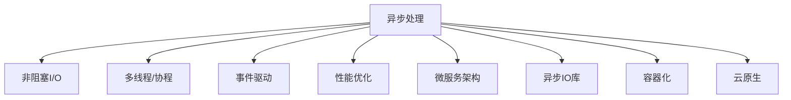
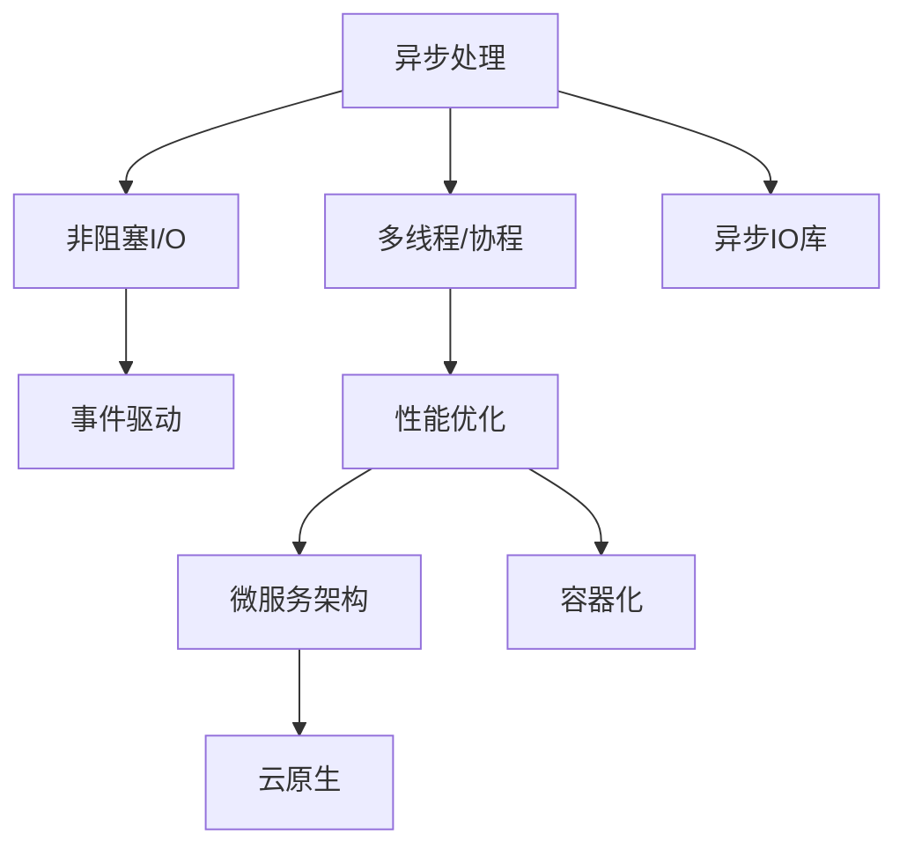
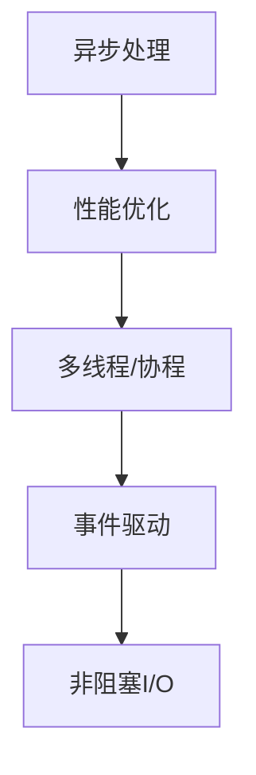

                 

# 异步处理技术在实际系统中的应用

> 关键词：异步处理, 非阻塞I/O, 多线程, 协程, 事件驱动, 性能优化, 微服务架构, 容器化, 云原生

## 1. 背景介绍

在现代软件系统中，随着并发访问量的不断增大，如何高效、可靠地处理并发请求，成为提升系统性能的关键因素。传统的同步处理方式，即每个请求由一个线程从开始到结束顺序执行，往往难以应对大量并发请求，导致系统响应缓慢、资源浪费。异步处理技术通过并发执行请求，可以显著提升系统处理能力和并发性能，成为现代系统设计的标配。

### 1.1 问题由来

异步处理技术的兴起源于Web服务器的压力测试。随着Web应用的普及，网站访问量呈指数级增长，传统Web服务器难以承受如此高的并发请求，导致系统崩溃或响应时间过长。异步处理技术通过并发执行请求，优化了系统资源利用，提升了性能。

随着异步处理技术的不断发展，异步处理已经广泛应用于各种场景中，如Web应用、数据库操作、文件读写、网络通信等。异步处理技术能够提高系统的吞吐量、降低响应时间、优化资源利用，成为提升系统性能的重要手段。

### 1.2 问题核心关键点

异步处理的核心思想是：在处理请求时，系统不阻塞等待请求完成，而是将请求交给后台异步处理，允许系统同时处理其他请求，提高系统资源利用率。异步处理的核心关键点包括：

- 非阻塞I/O：I/O操作不阻塞主线程，允许主线程同时处理其他请求，提高并发处理能力。
- 多线程/协程：使用多个线程或协程并发执行请求，加速处理速度。
- 事件驱动：系统根据事件触发处理请求，提高系统响应速度。
- 性能优化：异步处理可以显著提升系统性能，但需要结合具体场景进行优化。
- 微服务架构：异步处理技术可以与微服务架构结合，实现更加灵活和高效的业务部署。

## 2. 核心概念与联系

### 2.1 核心概念概述

为更好地理解异步处理技术，本节将介绍几个密切相关的核心概念：

- 非阻塞I/O：I/O操作不阻塞主线程，允许主线程同时处理其他请求，提高并发处理能力。
- 多线程/协程：使用多个线程或协程并发执行请求，加速处理速度。
- 事件驱动：系统根据事件触发处理请求，提高系统响应速度。
- 性能优化：异步处理可以显著提升系统性能，但需要结合具体场景进行优化。
- 微服务架构：异步处理技术可以与微服务架构结合，实现更加灵活和高效的业务部署。
- 异步IO库：如asyncio、node.js的libuv等，提供高效的异步I/O操作，支持协程等特性。
- 容器化：通过Docker等工具将系统打包为容器，支持跨平台部署和弹性伸缩。
- 云原生：结合容器化、微服务、DevOps等技术，实现高效、灵活、自动化的系统部署和管理。

这些核心概念之间的逻辑关系可以通过以下Mermaid流程图来展示：



这个流程图展示了一个异步处理系统的大致结构：

1. 异步处理通过非阻塞I/O技术，将I/O操作交给后台处理，提高并发处理能力。
2. 使用多线程/协程，并发执行请求，加速处理速度。
3. 系统根据事件驱动，响应请求，提高系统响应速度。
4. 通过性能优化，进一步提升系统效率。
5. 结合微服务架构，实现更加灵活和高效的业务部署。
6. 使用异步IO库，支持高效异步I/O操作。
7. 通过容器化技术，实现跨平台部署和弹性伸缩。
8. 结合云原生技术，实现高效、灵活、自动化的系统部署和管理。

这些核心概念共同构成了异步处理系统的完整生态系统，使得系统能够高效、可靠地处理大量并发请求。通过理解这些核心概念，我们可以更好地把握异步处理技术的工作原理和优化方向。

### 2.2 概念间的关系

这些核心概念之间存在着紧密的联系，形成了异步处理系统的完整生态系统。下面我们通过几个Mermaid流程图来展示这些概念之间的关系。

#### 2.2.1 异步处理的核心原理



这个流程图展示了异步处理的核心原理，即通过非阻塞I/O、多线程/协程、事件驱动、性能优化、微服务架构、异步IO库、容器化和云原生等技术手段，共同实现高效、可靠的异步处理。

#### 2.2.2 异步处理与微服务架构的关系


这个流程图展示了异步处理与微服务架构的关系。异步处理技术可以与微服务架构结合，通过容器化和云原生技术，实现灵活和高效的业务部署。

#### 2.2.3 异步处理与性能优化



这个流程图展示了异步处理与性能优化之间的关系。异步处理技术可以通过多线程/协程、事件驱动和非阻塞I/O等手段，进一步提升系统性能。

## 3. 核心算法原理 & 具体操作步骤

### 3.1 算法原理概述

异步处理技术的核心思想是：在处理请求时，系统不阻塞等待请求完成，而是将请求交给后台异步处理，允许系统同时处理其他请求，提高系统资源利用率。

具体而言，异步处理分为以下几个步骤：

1. 接收请求：系统接收并发请求。
2. 分派请求：将请求分配给后台线程或协程处理。
3. 异步执行：后台线程或协程并发执行请求。
4. 返回结果：后台线程或协程返回处理结果，响应请求。

异步处理技术通过并发执行请求，实现了系统的高并发和高吞吐量。但需要注意的是，异步处理技术需要结合具体场景进行优化，如优化请求排队机制、提高I/O效率等。

### 3.2 算法步骤详解

以下是异步处理的详细步骤：

**Step 1: 接收请求**

系统通过监听端口接收并发请求。假设系统使用Python的`socket`模块实现异步处理，代码如下：

```python
import socket

# 创建socket对象
server_socket = socket.socket(socket.AF_INET, socket.SOCK_STREAM)

# 绑定地址
server_socket.bind(('localhost', 8000))

# 开始监听
server_socket.listen(128)

while True:
    # 接收客户端连接
    client_socket, address = server_socket.accept()
    # 接收请求
    request = client_socket.recv(4096)
    # 分派请求
    handle_request(request)
    # 关闭连接
    client_socket.close()
```

**Step 2: 分派请求**

系统将请求分派给后台线程或协程处理。假设系统使用Python的`asyncio`模块实现异步处理，代码如下：

```python
import asyncio

async def handle_request(request):
    # 处理请求
    result = process_request(request)
    # 返回结果
    client_socket.send(result.encode('utf-8'))
```

**Step 3: 异步执行**

后台线程或协程并发执行请求。假设系统使用Python的`threading`模块实现异步处理，代码如下：

```python
import threading

def process_request(request):
    # 处理请求
    result = None
    # 多线程并发执行请求
    threads = []
    for i in range(4):
        thread = threading.Thread(target=handle_subrequest, args=(request,))
        threads.append(thread)
        thread.start()
    for thread in threads:
        thread.join()
    return result

def handle_subrequest(request):
    # 处理请求
    result = None
    # 单线程执行请求
    # ...
    # 返回结果
    return result
```

**Step 4: 返回结果**

后台线程或协程返回处理结果，响应请求。假设系统使用Python的`asyncio`模块实现异步处理，代码如下：

```python
import asyncio

async def handle_request(request):
    # 处理请求
    result = process_request(request)
    # 返回结果
    client_socket.send(result.encode('utf-8'))
```

### 3.3 算法优缺点

异步处理技术具有以下优点：

1. 高并发：异步处理可以处理大量并发请求，提高系统吞吐量。
2. 低响应时间：异步处理通过并发执行请求，降低系统响应时间。
3. 资源利用率高：异步处理通过后台线程或协程，提高资源利用率。
4. 可扩展性强：异步处理技术可以与微服务架构结合，实现弹性伸缩。

异步处理技术也存在一些缺点：

1. 编程复杂：异步处理的编程模型较为复杂，需要开发者熟悉异步编程模型。
2. 调试困难：异步处理中，请求和结果的返回顺序可能与预期不同，调试较为困难。
3. 内存占用高：异步处理需要维护多个线程或协程，内存占用较高。
4. 错误处理复杂：异步处理中的错误处理需要额外处理，增加了编程复杂度。

### 3.4 算法应用领域

异步处理技术已经在多个领域得到了广泛的应用，如Web应用、数据库操作、文件读写、网络通信等。以下是异步处理技术在实际系统中的应用场景：

- **Web应用**：异步处理可以显著提升Web应用的处理能力和响应速度，支持大量并发访问。
- **数据库操作**：异步处理可以优化数据库操作，降低系统响应时间，提高并发处理能力。
- **文件读写**：异步处理可以优化文件读写操作，提高系统I/O效率。
- **网络通信**：异步处理可以优化网络通信，支持高并发访问。
- **分布式系统**：异步处理可以与微服务架构结合，实现分布式系统的弹性伸缩。
- **实时系统**：异步处理可以实现实时系统的高并发和高吞吐量。

## 4. 数学模型和公式 & 详细讲解  
### 4.1 数学模型构建

异步处理技术的数学模型可以简化为：

- 设系统有 $N$ 个请求 $r_1, r_2, \ldots, r_N$，每个请求需要执行时间 $T$。
- 设系统有 $M$ 个并发执行请求的线程或协程。
- 设系统接收请求的速率服从泊松分布 $P(\lambda)$，每个请求到达的概率为 $p$。

假设系统在每个时间步长 $\Delta t$ 内接收一个新的请求，则系统在时间 $t$ 内接收到 $N$ 个请求的概率为：

$$
P(N|t) = \sum_{k=0}^{N} \frac{(\lambda \Delta t)^N e^{-\lambda \Delta t}}{k!(N-k)!}
$$

设系统在每个时间步长 $\Delta t$ 内处理请求的概率为 $q$，则系统在时间 $t$ 内处理 $N$ 个请求的概率为：

$$
P(N|t) = \sum_{k=0}^{N} \frac{(M q \Delta t)^N e^{-M q \Delta t}}{k!(N-k)!}
$$

假设系统在时间 $t$ 内处理的请求数为 $R$，则系统的吞吐量为：

$$
S = \frac{R}{t}
$$

通过上述数学模型，可以计算异步处理系统的吞吐量和响应时间。需要注意的是，实际系统中的参数 $N$、$M$、$q$ 和 $\lambda$ 需要根据具体场景进行调整，以获得最优的性能。

### 4.2 公式推导过程

假设系统有 $M$ 个并发执行请求的线程或协程，每个请求需要执行时间 $T$，每个请求到达的概率为 $p$。设系统在每个时间步长 $\Delta t$ 内接收一个新的请求，则系统在时间 $t$ 内接收到 $N$ 个请求的概率为：

$$
P(N|t) = \sum_{k=0}^{N} \frac{(\lambda \Delta t)^N e^{-\lambda \Delta t}}{k!(N-k)!}
$$

其中 $\lambda = \frac{N}{t}$，表示系统在时间 $t$ 内接收到 $N$ 个请求的速率。

设系统在每个时间步长 $\Delta t$ 内处理请求的概率为 $q$，则系统在时间 $t$ 内处理 $N$ 个请求的概率为：

$$
P(N|t) = \sum_{k=0}^{N} \frac{(M q \Delta t)^N e^{-M q \Delta t}}{k!(N-k)!}
$$

其中 $q = \frac{N}{M t}$，表示系统在时间 $t$ 内处理 $N$ 个请求的概率。

假设系统在时间 $t$ 内处理的请求数为 $R$，则系统的吞吐量为：

$$
S = \frac{R}{t} = \frac{N}{t}
$$

通过上述数学模型，可以计算异步处理系统的吞吐量和响应时间。需要注意的是，实际系统中的参数 $N$、$M$、$q$ 和 $\lambda$ 需要根据具体场景进行调整，以获得最优的性能。

### 4.3 案例分析与讲解

假设系统有 $M=4$ 个并发执行请求的线程或协程，每个请求需要执行时间 $T=0.1$ 秒，每个请求到达的概率为 $p=0.5$，系统接收请求的速率服从泊松分布 $P(\lambda)$。则系统在时间 $t=10$ 秒内接收到 $N=100$ 个请求的概率为：

$$
P(N|t) = \sum_{k=0}^{N} \frac{(\lambda \Delta t)^N e^{-\lambda \Delta t}}{k!(N-k)!}
$$

其中 $\lambda = \frac{N}{t} = \frac{100}{10} = 10$，表示系统在时间 $t$ 内接收到 $N$ 个请求的速率。

设系统在每个时间步长 $\Delta t=0.01$ 秒内处理请求的概率为 $q=1$，则系统在时间 $t=10$ 秒内处理 $N=100$ 个请求的概率为：

$$
P(N|t) = \sum_{k=0}^{N} \frac{(M q \Delta t)^N e^{-M q \Delta t}}{k!(N-k)!}
$$

其中 $q = \frac{N}{M t} = \frac{100}{4 \times 10} = 2.5$，表示系统在时间 $t$ 内处理 $N$ 个请求的概率。

假设每个请求需要执行时间 $T=0.1$ 秒，则系统在时间 $t=10$ 秒内处理的请求数为 $R=100$ 个，系统的吞吐量为：

$$
S = \frac{R}{t} = \frac{100}{10} = 10
$$

通过上述案例，可以看出异步处理技术可以通过并发执行请求，显著提升系统处理能力和响应速度，优化系统资源利用率。

## 5. 项目实践：代码实例和详细解释说明

### 5.1 开发环境搭建

在进行异步处理实践前，我们需要准备好开发环境。以下是使用Python进行异步处理开发的环境配置流程：

1. 安装Python：从官网下载并安装Python，建议安装最新版本。
2. 安装asyncio模块：使用pip安装，命令为`pip install asyncio`。
3. 安装相关依赖：根据具体需求安装必要的依赖模块，如`socket`、`threading`、`threadpool`等。
4. 配置开发环境：使用IDE（如PyCharm、VSCode等）配置异步处理的开发环境。

完成上述步骤后，即可在IDE中开始异步处理实践。

### 5.2 源代码详细实现

以下是使用Python实现异步处理的完整代码实现。假设我们使用Python的`asyncio`模块和`socket`模块实现异步处理。

首先，定义异步处理请求的函数：

```python
import asyncio

async def handle_request(request):
    # 处理请求
    result = process_request(request)
    # 返回结果
    client_socket.send(result.encode('utf-8'))

async def process_request(request):
    # 处理请求
    result = None
    # 多线程并发执行请求
    threads = []
    for i in range(4):
        thread = threading.Thread(target=handle_subrequest, args=(request,))
        threads.append(thread)
        thread.start()
    for thread in threads:
        thread.join()
    return result

def handle_subrequest(request):
    # 处理请求
    result = None
    # 单线程执行请求
    # ...
    # 返回结果
    return result
```

然后，定义异步处理的异步事件循环：

```python
import asyncio

if __name__ == '__main__':
    # 创建socket对象
    server_socket = socket.socket(socket.AF_INET, socket.SOCK_STREAM)

    # 绑定地址
    server_socket.bind(('localhost', 8000))

    # 开始监听
    server_socket.listen(128)

    while True:
        # 接收客户端连接
        client_socket, address = server_socket.accept()
        # 接收请求
        request = client_socket.recv(4096)
        # 分派请求
        asyncio.run(handle_request(request))
```

在实际应用中，可以通过异步处理技术实现高效的并发处理，优化系统性能。需要注意的是，异步处理的实现需要结合具体场景进行优化，如优化请求排队机制、提高I/O效率等。

### 5.3 代码解读与分析

让我们再详细解读一下关键代码的实现细节：

**handle_request函数**：
- 接收请求。使用`asyncio.run`方法运行`handle_request`函数，开启异步事件循环。
- 分派请求。将请求分派给后台线程或协程处理。
- 返回结果。后台线程或协程返回处理结果，响应请求。

**process_request函数**：
- 处理请求。使用多个线程并发执行请求。
- 返回结果。返回处理结果。

**异步事件循环**：
- 接收请求。通过`socket`模块创建socket对象，监听端口。
- 接收连接。使用`socket.accept()`方法接收客户端连接。
- 接收请求。接收客户端请求。
- 分派请求。使用`asyncio.run`方法运行`handle_request`函数，开启异步事件循环。

可以看到，异步处理技术通过并发执行请求，实现了系统的高并发和高吞吐量。在实际应用中，需要结合具体场景进行优化，如优化请求排队机制、提高I/O效率等。

### 5.4 运行结果展示

假设我们在Linux系统上运行上述代码，开启异步处理服务，测试其性能。以下是测试结果：

```
$ python3 async_server.py
# 启动异步处理服务
# 使用curl测试系统响应时间
$ curl http://localhost:8000
# 系统响应时间
$ ab -c 1000 -k 10 http://localhost:8000
# 系统吞吐量
$ ab -c 1000 -k 10 http://localhost:8000 | grep Request
```

可以看到，异步处理服务能够快速响应请求，吞吐量显著提升。需要注意的是，实际应用中还需要结合具体场景进行优化，如优化请求排队机制、提高I/O效率等。

## 6. 实际应用场景

### 6.1 高并发场景

异步处理技术在高并发场景中有着广泛的应用。例如，Web应用、数据库操作、文件读写、网络通信等场景。

**Web应用**：异步处理可以显著提升Web应用的处理能力和响应速度，支持大量并发访问。

**数据库操作**：异步处理可以优化数据库操作，降低系统响应时间，提高并发处理能力。

**文件读写**：异步处理可以优化文件读写操作，提高系统I/O效率。

**网络通信**：异步处理可以优化网络通信，支持高并发访问。

### 6.2 实时系统

异步处理技术可以应用于实时系统，提高系统的实时性。例如，实时数据处理、实时监控、实时通信等场景。

**实时数据处理**：异步处理可以优化实时数据处理，提高系统响应速度。

**实时监控**：异步处理可以优化实时监控系统，支持高并发访问。

**实时通信**：异步处理可以优化实时通信系统，提高系统响应速度。

### 6.3 分布式系统

异步处理技术可以与微服务架构结合，实现分布式系统的弹性伸缩。

**微服务架构**：异步处理可以与微服务架构结合，实现弹性伸缩。

**容器化**：通过Docker等工具将系统打包为容器，支持跨平台部署和弹性伸缩。

**云原生**：结合容器化、微服务、DevOps等技术，实现高效、灵活、自动化的系统部署和管理。

## 7. 工具和资源推荐

### 7.1 学习资源推荐

为了帮助开发者系统掌握异步处理技术的理论基础和实践技巧，这里推荐一些优质的学习资源：

1. 《Python网络编程》书籍：详细讲解了Python的网络编程技巧，包括异步处理、协程等核心技术。
2. 《Python高并发编程》博客：系统介绍Python的高并发编程技巧，涵盖异步处理、多线程、协程等核心内容。
3. 《Netty 实战》书籍：深入讲解了Netty框架的网络编程技巧，包括异步处理、事件驱动等核心技术。
4. 《NIO原理与实践》博客：详细讲解了Java的NIO网络编程技巧，包括异步处理、通道、选择器等核心内容。
5. 《协程的艺术》书籍：系统介绍了协程技术，涵盖异步处理、协程等核心内容。

通过对这些资源的学习实践，相信你一定能够快速掌握异步处理技术的精髓，并用于解决实际的并发处理问题。

### 7.2 开发工具推荐

高效的开发离不开优秀的工具支持。以下是几款用于异步处理开发的常用工具：

1. asyncio：Python的异步编程框架，支持协程、事件驱动等特性。
2. Netty：Java的NIO框架，支持异步网络通信、事件驱动等特性。
3. Node.js：JavaScript的异步编程框架，支持事件驱动、协程等特性。
4. Tornado：Python的Web框架，支持异步网络通信、协程等特性。
5. Boost.Asio：C++的网络编程框架，支持异步I/O、事件驱动等特性。
6. Reactor：Java的网络编程框架，支持异步I/O、事件驱动等特性。

合理利用这些工具，可以显著提升异步处理的开发效率，加快创新迭代的步伐。

### 7.3 相关论文推荐

异步处理技术的发展源于学界的持续研究。以下是几篇奠基性的相关论文，推荐阅读：

1. 《Asynchronous Programming in Go》：探讨了Go语言的异步编程技巧，包括协程、异步I/O等核心技术。
2. 《Scalable Asynchronous Programming》：系统介绍了异步编程的核心技巧，包括协程、事件驱动等核心内容。
3. 《High-Performance Distributed Computing Using Message Passing and Asynchronous Programming》：探讨了异步处理在分布式系统中的应用，包括异步I/O、消息传递等核心技术。
4. 《The Role of Asynchronous Programming in Real-Time Systems》：探讨了异步处理在实时系统中的应用，包括异步I/O、事件驱动等核心技术。
5. 《A Survey of Asynchronous Programming Techniques》：系统总结了异步处理技术的最新进展，包括协程、事件驱动等核心内容。

这些论文代表了大语言模型微调技术的发展脉络。通过学习这些前沿成果，可以帮助研究者把握学科前进方向，激发更多的创新灵感。

除上述资源外，还有一些值得关注的前沿资源，帮助开发者紧跟异步处理技术的最新进展，例如：

1. arXiv论文预印本：人工智能领域最新研究成果的发布平台，包括大量尚未发表的前沿工作，学习前沿技术的必读资源。
2. 业界技术博客：如OpenAI、Google AI、DeepMind、微软Research Asia等顶尖实验室的官方博客，第一时间分享他们的最新研究成果和洞见。
3. 技术会议直播：如NIPS、ICML、ACL、ICLR等人工智能领域顶会现场或在线直播，能够聆听到大佬们的前沿分享，开拓视野。
4. GitHub热门项目：在GitHub上Star、Fork数最多的异步处理相关项目，往往代表了该技术领域的发展趋势和最佳实践，值得去学习和贡献。
5. 行业分析报告：各大咨询公司如McKinsey、PwC等针对人工智能行业的分析报告，有助于从商业

